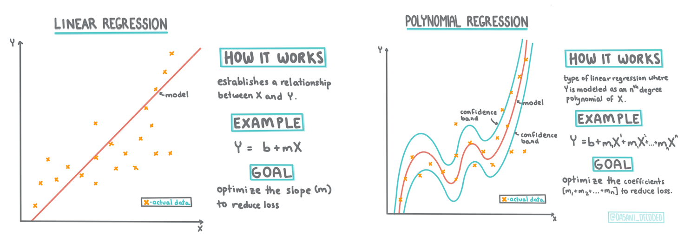
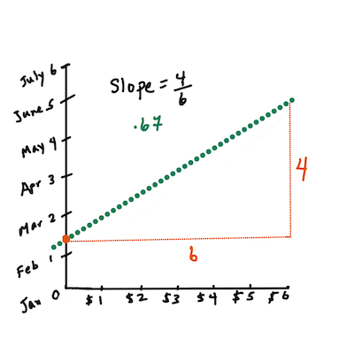
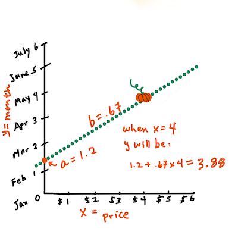

<!--
CO_OP_TRANSLATOR_METADATA:
{
  "original_hash": "2f88fbc741d792890ff2f1430fe0dae0",
  "translation_date": "2025-08-29T16:35:48+00:00",
  "source_file": "2-Regression/3-Linear/README.md",
  "language_code": "mr"
}
-->
# Scikit-learn वापरून रिग्रेशन मॉडेल तयार करा: चार प्रकारे रिग्रेशन


> माहितीपट [Dasani Madipalli](https://twitter.com/dasani_decoded) यांनी तयार केला आहे
## [पूर्व-व्याख्यान प्रश्नमंजुषा](https://gray-sand-07a10f403.1.azurestaticapps.net/quiz/13/)

> ### [हा धडा R मध्ये उपलब्ध आहे!](../../../../2-Regression/3-Linear/solution/R/lesson_3.html)
### परिचय 

आतापर्यंत तुम्ही रिग्रेशन म्हणजे काय हे समजून घेतले आहे, ज्यासाठी आपण कद्दूच्या किंमतींच्या डेटासेटचा वापर केला आहे, जो आपण या धड्यादरम्यान वापरणार आहोत. तुम्ही Matplotlib वापरून त्याचे व्हिज्युअलायझेशन देखील केले आहे.

आता तुम्ही मशीन लर्निंगसाठी रिग्रेशन अधिक सखोलपणे समजून घेण्यासाठी तयार आहात. व्हिज्युअलायझेशन तुम्हाला डेटाचा अर्थ लावण्यास मदत करते, परंतु मशीन लर्निंगची खरी ताकद _मॉडेल प्रशिक्षण_ मध्ये आहे. मॉडेल ऐतिहासिक डेटावर प्रशिक्षित केले जातात जेणेकरून डेटा अवलंबित्व आपोआप कॅप्चर करता येईल आणि नवीन डेटासाठी परिणामांची भविष्यवाणी करता येईल, ज्याला मॉडेलने पूर्वी पाहिलेले नाही.

या धड्यात, तुम्ही रिग्रेशनचे दोन प्रकार अधिक सखोलपणे शिकाल: _मूलभूत रेखीय रिग्रेशन_ आणि _बहुपद रिग्रेशन_, तसेच या तंत्रांच्या पाठीमागील गणित. ही मॉडेल्स आपल्याला विविध इनपुट डेटाच्या आधारे कद्दूच्या किंमतींची भविष्यवाणी करण्यास अनुमती देतील.

[](https://youtu.be/CRxFT8oTDMg "मशीन लर्निंगसाठी नवशिके - रेखीय रिग्रेशन समजून घेणे")

> 🎥 रेखीय रिग्रेशनचा संक्षिप्त व्हिडिओ आढावा पाहण्यासाठी वरील प्रतिमेवर क्लिक करा.

> या अभ्यासक्रमादरम्यान, आम्ही गणिताचे किमान ज्ञान गृहीत धरतो आणि इतर क्षेत्रांमधून आलेल्या विद्यार्थ्यांसाठी ते सुलभ करण्याचा प्रयत्न करतो, त्यामुळे नोट्स, 🧮 गणितीय कॉलआउट्स, आकृत्या आणि समज सुलभ करण्यासाठी इतर शिकण्याची साधने शोधा.

### पूर्वतयारी

आतापर्यंत तुम्ही कद्दूच्या डेटाच्या संरचनेशी परिचित असले पाहिजे, ज्याचा आपण अभ्यास करत आहोत. तुम्हाला ते या धड्याच्या _notebook.ipynb_ फाइलमध्ये प्रीलोड केलेले आणि प्री-क्लीन केलेले सापडेल. या फाइलमध्ये, कद्दूची किंमत नवीन डेटा फ्रेममध्ये प्रति बस्शेल दर्शविली जाते. Visual Studio Code मध्ये कर्नल्स चालवून तुम्ही हे नोटबुक चालवू शकता याची खात्री करा.

### तयारी

स्मरणपत्र म्हणून, तुम्ही हे डेटा लोड करत आहात जेणेकरून त्यावर प्रश्न विचारता येतील.

- कद्दू खरेदी करण्यासाठी सर्वोत्तम वेळ कोणता आहे?
- मिनिएचर कद्दूंच्या केसची किंमत किती अपेक्षित आहे?
- मला ते अर्ध्या बस्शेल बास्केटमध्ये खरेदी करावे का किंवा 1 1/9 बस्शेल बॉक्सने खरेदी करावे का?
चला या डेटामध्ये अधिक खोदकाम करूया.

मागील धड्यात, तुम्ही एक Pandas डेटा फ्रेम तयार केली आणि मूळ डेटासेटचा भाग त्यात भरला, बस्शेलद्वारे किंमतींचे मानकीकरण केले. असे केल्याने, तुम्हाला सुमारे 400 डेटा पॉइंट्स मिळाले आणि ते फक्त शरद ऋतूतील महिन्यांसाठी होते.

या धड्याच्या सोबतच्या नोटबुकमध्ये प्रीलोड केलेल्या डेटावर एक नजर टाका. डेटा प्रीलोड केला आहे आणि प्रारंभिक स्कॅटरप्लॉट महिन्याचा डेटा दर्शविण्यासाठी चार्ट केला आहे. कदाचित आपण ते अधिक स्वच्छ करून डेटाच्या स्वरूपाबद्दल थोडी अधिक माहिती मिळवू शकतो.

## रेखीय रिग्रेशन रेषा

जसे तुम्ही धडा 1 मध्ये शिकलात, रेखीय रिग्रेशन व्यायामाचा उद्देश म्हणजे एक रेषा प्लॉट करणे:

- **व्हेरिएबल्सचे संबंध दाखवा**. व्हेरिएबल्समधील संबंध दाखवा
- **भविष्यवाणी करा**. नवीन डेटा पॉइंट त्या रेषेच्या संदर्भात कुठे पडेल याची अचूक भविष्यवाणी करा.

**लीस्ट-स्क्वेअर रिग्रेशन** प्रकारची रेषा काढणे सामान्य आहे. 'लीस्ट-स्क्वेअर' हा शब्द म्हणजे रिग्रेशन रेषेभोवती असलेल्या सर्व डेटा पॉइंट्सचे वर्गीकरण केले जाते आणि नंतर जोडले जाते. आदर्शपणे, अंतिम बेरीज शक्य तितकी लहान असावी, कारण आपल्याला कमी त्रुटी, किंवा `लीस्ट-स्क्वेअर` हवे आहेत.

आम्ही असे करतो कारण आम्हाला अशी रेषा मॉडेल करायची आहे ज्यामध्ये आमच्या सर्व डेटा पॉइंट्सपासून किमान एकत्रित अंतर आहे. आम्ही अटी जोडण्यापूर्वी वर्गीकरण देखील करतो कारण आम्हाला त्याच्या दिशेऐवजी त्याच्या परिमाणाची चिंता आहे.

> **🧮 गणित दाखवा**
>
> ही रेषा, ज्याला _सर्वोत्तम फिटची रेषा_ म्हणतात, [एका समीकरणाने](https://en.wikipedia.org/wiki/Simple_linear_regression) व्यक्त केली जाऊ शकते:
>
> ```
> Y = a + bX
> ```
>
> `X` हा 'स्पष्टीकरणात्मक व्हेरिएबल' आहे. `Y` हा 'अवलंबून असलेला व्हेरिएबल' आहे. रेषेचा उतार `b` आहे आणि `a` हा y-अंतर आहे, जो `X = 0` असताना `Y` च्या मूल्याचा संदर्भ देतो.
>
>
>
> प्रथम, उतार `b` ची गणना करा. माहितीपट [Jen Looper](https://twitter.com/jenlooper) यांनी तयार केला आहे.
>
> दुसऱ्या शब्दांत, आणि कद्दूच्या डेटाच्या मूळ प्रश्नाचा संदर्भ देऊन: "महिन्याने प्रति बस्शेल कद्दूची किंमत भाकीत करा", `X` किंमतीचा संदर्भ देईल आणि `Y` विक्रीच्या महिन्याचा संदर्भ देईल.
>
>
>
> `Y` चे मूल्य काढा. जर तुम्ही सुमारे $4 खर्च करत असाल, तर तो एप्रिल असला पाहिजे! माहितीपट [Jen Looper](https://twitter.com/jenlooper) यांनी तयार केला आहे.
>
> रेषेचा उतार दर्शविणारे गणित, जे y-अंतरावर देखील अवलंबून आहे, किंवा `X = 0` असताना `Y` कुठे स्थित आहे.
>
> या मूल्यांच्या गणनेची पद्धत तुम्ही [Math is Fun](https://www.mathsisfun.com/data/least-squares-regression.html) वेबसाइटवर पाहू शकता. तसेच [हा लीस्ट-स्क्वेअर कॅल्क्युलेटर](https://www.mathsisfun.com/data/least-squares-calculator.html) भेट द्या आणि कसे संख्या रेषेवर परिणाम करतात ते पाहा.

## सहसंबंध

समजून घेण्यासारखा आणखी एक शब्द म्हणजे दिलेल्या X आणि Y व्हेरिएबल्समधील **सहसंबंध गुणांक**. स्कॅटरप्लॉट वापरून, तुम्ही हा गुणांक पटकन व्हिज्युअल करू शकता. एका नीट रेषेत विखुरलेले डेटा पॉइंट्स असलेला प्लॉट उच्च सहसंबंध दर्शवतो, परंतु X आणि Y दरम्यान सर्वत्र विखुरलेले डेटा पॉइंट्स असलेला प्लॉट कमी सहसंबंध दर्शवतो.

एक चांगले रेखीय रिग्रेशन मॉडेल असेल ज्यामध्ये लीस्ट-स्क्वेअर रिग्रेशन पद्धतीसह रिग्रेशन रेषा वापरून उच्च (1 च्या जवळ) सहसंबंध गुणांक असेल.

✅ या धड्याच्या सोबतच्या नोटबुक चालवा आणि महिना ते किंमत स्कॅटरप्लॉट पहा. कद्दू विक्रीसाठी महिना ते किंमत डेटा उच्च किंवा कमी सहसंबंध असल्याचे दिसते का, तुमच्या स्कॅटरप्लॉटच्या व्हिज्युअल व्याख्येनुसार? जर तुम्ही `महिना` ऐवजी अधिक सूक्ष्म उपाय वापरला तर ते बदलते का, उदा. *वर्षाचा दिवस* (उदा. वर्षाच्या सुरुवातीपासून दिवसांची संख्या)?

खालील कोडमध्ये, आम्ही गृहीत धरतो की आम्ही डेटा साफ केला आहे आणि `new_pumpkins` नावाचा डेटा फ्रेम प्राप्त केला आहे, जो खालीलप्रमाणे आहे:

ID | महिना | वर्षाचा दिवस | प्रकार | शहर | पॅकेज | कमी किंमत | जास्त किंमत | किंमत
---|-------|-----------|---------|------|---------|-----------|------------|-------
70 | 9 | 267 | PIE TYPE | BALTIMORE | 1 1/9 बस्शेल कार्टन्स | 15.0 | 15.0 | 13.636364
71 | 9 | 267 | PIE TYPE | BALTIMORE | 1 1/9 बस्शेल कार्टन्स | 18.0 | 18.0 | 16.363636
72 | 10 | 274 | PIE TYPE | BALTIMORE | 1 1/9 बस्शेल कार्टन्स | 18.0 | 18.0 | 16.363636
73 | 10 | 274 | PIE TYPE | BALTIMORE | 1 1/9 बस्शेल कार्टन्स | 17.0 | 17.0 | 15.454545
74 | 10 | 281 | PIE TYPE | BALTIMORE | 1 1/9 बस्शेल कार्टन्स | 15.0 | 15.0 | 13.636364

> डेटा साफ करण्यासाठी कोड [`notebook.ipynb`](notebook.ipynb) मध्ये उपलब्ध आहे. आम्ही मागील धड्यातील समान साफसफाईची पावले केली आहेत आणि खालील अभिव्यक्ती वापरून `DayOfYear` कॉलमची गणना केली आहे:

```python
day_of_year = pd.to_datetime(pumpkins['Date']).apply(lambda dt: (dt-datetime(dt.year,1,1)).days)
```

आता तुम्हाला रेखीय रिग्रेशनच्या पाठीमागील गणिताची समज आहे, चला रिग्रेशन मॉडेल तयार करूया आणि पाहूया की कद्दूच्या पॅकेजपैकी कोणते पॅकेज सर्वोत्तम कद्दूच्या किंमती देईल. सुट्टीतील कद्दूच्या पॅचसाठी कद्दू खरेदी करणाऱ्या एखाद्याला कदाचित कद्दूच्या पॅचसाठी कद्दूच्या पॅकेजेसच्या खरेदीचा ऑप्टिमायझेशन करण्यासाठी ही माहिती हवी असेल.

## सहसंबंध शोधणे

[](https://youtu.be/uoRq-lW2eQo "मशीन लर्निंगसाठी नवशिके - सहसंबंध शोधणे: रेखीय रिग्रेशनची गुरुकिल्ली")

> 🎥 सहसंबंधाचा संक्षिप्त व्हिडिओ आढावा पाहण्यासाठी वरील प्रतिमेवर क्लिक करा.

मागील धड्यात तुम्ही कदाचित पाहिले असेल की वेगवेगळ्या महिन्यांसाठी सरासरी किंमत अशी दिसते:


याचा अर्थ असा आहे की काही सहसंबंध असावा, आणि आपण `महिना` आणि `किंमत` यांच्यातील संबंध किंवा `DayOfYear` आणि `किंमत` यांच्यातील संबंध भाकीत करण्यासाठी रेखीय रिग्रेशन मॉडेल प्रशिक्षण देण्याचा प्रयत्न करू शकतो. येथे स्कॅटर प्लॉट आहे जो नंतरचा संबंध दर्शवतो:

 

चला `corr` फंक्शन वापरून सहसंबंध आहे का ते पाहूया:

```python
print(new_pumpkins['Month'].corr(new_pumpkins['Price']))
print(new_pumpkins['DayOfYear'].corr(new_pumpkins['Price']))
```

असे दिसते की सहसंबंध खूपच कमी आहे, `महिना` साठी -0.15 आणि `DayOfMonth` साठी -0.17, परंतु आणखी एक महत्त्वाचा संबंध असू शकतो. असे दिसते की वेगवेगळ्या कद्दूच्या प्रकारांशी संबंधित किंमतींचे वेगवेगळे क्लस्टर आहेत. ही कल्पना पुष्टी करण्यासाठी, चला प्रत्येक कद्दू श्रेणी वेगळ्या रंगाने प्लॉट करूया. `scatter` प्लॉटिंग फंक्शनला `ax` पॅरामीटर पास करून आपण सर्व पॉइंट्स एकाच ग्राफवर प्लॉट करू शकतो:

```python
ax=None
colors = ['red','blue','green','yellow']
for i,var in enumerate(new_pumpkins['Variety'].unique()):
    df = new_pumpkins[new_pumpkins['Variety']==var]
    ax = df.plot.scatter('DayOfYear','Price',ax=ax,c=colors[i],label=var)
```

 

आमच्या तपासणीने सूचित केले आहे की विक्रीच्या तारखेपेक्षा प्रकाराचा एकूण किंमतीवर अधिक प्रभाव आहे. आम्ही हे बार ग्राफसह पाहू शकतो:

```python
new_pumpkins.groupby('Variety')['Price'].mean().plot(kind='bar')
```

 

आता आपण फक्त एका कद्दू प्रकारावर, 'पाई प्रकार' वर लक्ष केंद्रित करूया आणि पाहूया की तारखेला किंमतीवर काय परिणाम होतो:

```python
pie_pumpkins = new_pumpkins[new_pumpkins['Variety']=='PIE TYPE']
pie_pumpkins.plot.scatter('DayOfYear','Price') 
```
 

जर आपण आता `corr` फंक्शन वापरून `किंमत` आणि `DayOfYear` यांच्यातील सहसंबंधाची गणना केली, तर आपल्याला सुमारे `-0.27` मिळेल - ज्याचा अर्थ असा आहे की भविष्यवाणी मॉडेल प्रशिक्षण देणे योग्य आहे.

> रेखीय रिग्रेशन मॉडेल प्रशिक्षण देण्यापूर्वी, आपला डेटा स्वच्छ असल्याची खात्री करणे महत्त्वाचे आहे. रेखीय रिग्रेशन रिक्त मूल्यांसह चांगले कार्य करत नाही, त्यामुळे सर्व रिक्त सेल्स काढून टाकणे योग्य आहे:

```python
pie_pumpkins.dropna(inplace=True)
pie_pumpkins.info()
```

आणखी एक दृष्टिकोन म्हणजे त्या रिक्त मूल्यांना संबंधित कॉलममधील सरासरी मूल्यांनी भरून टाकणे.

## साधे रेखीय रिग्रेशन

[](https://youtu.be/e4c_UP2fSjg "मशीन लर्निंगसाठी नवशिके - Scikit-learn वापरून रेखीय आणि बहुपद रिग्रेशन")

> 🎥 Scikit-learn वापरून रेखीय आणि बहुपद रिग्रेशनचा संक्षिप्त व्हिडिओ आढावा पाहण्यासाठी वरील प्रतिमेवर क्लिक करा.

आमचे रेखीय रिग्रेशन मॉडेल प्रशिक्षण देण्यासाठी, आम्ही **Scikit-learn** लायब्ररी वापरणार आहोत.

```python
from sklearn.linear_model import LinearRegression
from sklearn.metrics import mean_squared_error
from sklearn.model_selection import train_test_split
```

आम्ही इनपुट मूल्ये (वैशिष्ट्ये) आणि अपेक्षित आउटपुट (लेबल) वेगळ्या numpy ऍरेमध्ये विभाजित करून सुरुवात करतो:

```python
X = pie_pumpkins['DayOfYear'].to_numpy().reshape(-1,1)
y = pie_pumpkins['Price']
```

> लक्षात घ्या की आम्हाला इनपुट डेटावर `reshape` करावे लागले जेणेकरून रेखीय रिग्रेशन पॅकेजने ते योग्य प्रकारे समजावे. रेखीय रिग्रेशन इनपुट म्हणून 2D ऍरेची अपेक्षा करते, जिथे ऍरेचा प्रत्येक रांग इनपुट वैशिष्ट्यांच्या व्हेक्टरशी संबंधित असतो. आमच्या बाबतीत, कारण आमच्याकडे फक्त एक इनपुट आहे - आम्हाला आकार N×1 असलेला ऍरे आवश्यक आहे, जिथे N डेटासेटचा आकार आहे.

मग, आम्हाला डेटा ट्रेन आणि टेस्ट डेटासेटमध्ये विभाजित करणे आवश्यक आहे, जेणेकरून आम्ही प्रशिक्षणानंतर आमच्या मॉडेलची पडताळणी करू शकू:

```python
X_train, X_test, y_train, y_test = train_test_split(X, y, test_size=0.2, random_state=0)
```

शेवटी, वास्तविक रेखीय रिग्रेशन मॉडेल प्रशिक्षण देणे फक्त दोन ओळींचा कोड घेते. आम्ही `LinearRegression` ऑब्जेक्ट परिभाषित करतो आणि `fit` पद्धत वापरून आमच्या डेटावर फिट करतो:

```python
lin_reg = LinearRegression()
lin_reg.fit(X_train,y_train)
```

`LinearRegression` ऑब्जेक्टमध्ये `fit` केल्यानंतर रिग्र
आमची चूक सुमारे 2 मुद्द्यांवर आहे, जी ~17% आहे. फारशी चांगली नाही. मॉडेल गुणवत्तेचा आणखी एक निर्देशक म्हणजे **निर्धारण गुणांक**, जो खालीलप्रमाणे मिळवता येतो:

```python
score = lin_reg.score(X_train,y_train)
print('Model determination: ', score)
```
जर मूल्य 0 असेल, तर याचा अर्थ मॉडेल इनपुट डेटा विचारात घेत नाही आणि *सर्वात वाईट रेषीय भविष्यवक्ता* म्हणून कार्य करते, जो फक्त निकालाचा सरासरी मूल्य आहे. मूल्य 1 असल्यास, आपण सर्व अपेक्षित आउटपुट पूर्णपणे अंदाज करू शकतो. आमच्या बाबतीत, निर्धारण गुणांक सुमारे 0.06 आहे, जो खूपच कमी आहे.

आम्ही चाचणी डेटा आणि रेषीय रिग्रेशन रेषा एकत्र प्लॉट करू शकतो, ज्यामुळे आमच्या बाबतीत रिग्रेशन कसे कार्य करते हे चांगले दिसेल:

```python
plt.scatter(X_test,y_test)
plt.plot(X_test,pred)
```


## बहुपद रिग्रेशन

रेषीय रिग्रेशनचा आणखी एक प्रकार म्हणजे बहुपद रिग्रेशन. कधी कधी व्हेरिएबल्समध्ये रेषीय संबंध असतो - जसे की भोपळ्याचा आकार मोठा असेल तर किंमत जास्त असेल - परंतु कधी कधी हे संबंध सरळ रेषा किंवा पृष्ठभाग म्हणून प्लॉट करता येत नाहीत.

✅ येथे [काही अधिक उदाहरणे](https://online.stat.psu.edu/stat501/lesson/9/9.8) आहेत ज्यामध्ये बहुपद रिग्रेशनचा उपयोग होऊ शकतो.

Date आणि Price यांच्यातील संबंध पुन्हा एकदा पाहा. हा स्कॅटरप्लॉट सरळ रेषेने विश्लेषित केला जावा असे वाटते का? किंमती बदलू शकत नाहीत का? अशा परिस्थितीत, तुम्ही बहुपद रिग्रेशन वापरून पाहू शकता.

✅ बहुपद म्हणजे गणितीय अभिव्यक्ती ज्यामध्ये एक किंवा अधिक व्हेरिएबल्स आणि गुणांक असू शकतात.

बहुपद रिग्रेशन वक्र रेषा तयार करते जे नॉन-रेषीय डेटाशी चांगले जुळते. आमच्या बाबतीत, जर आम्ही `DayOfYear` च्या वर्गाचा व्हेरिएबल इनपुट डेटामध्ये समाविष्ट केला, तर आम्ही एका परबोलिक वक्रासह आमचा डेटा फिट करू शकतो, ज्याचा किमान बिंदू वर्षाच्या विशिष्ट बिंदूवर असेल.

Scikit-learn मध्ये डेटा प्रक्रिया एकत्र करण्यासाठी एक उपयुक्त [pipeline API](https://scikit-learn.org/stable/modules/generated/sklearn.pipeline.make_pipeline.html?highlight=pipeline#sklearn.pipeline.make_pipeline) समाविष्ट आहे. **पाइपलाइन** म्हणजे **अंदाजकांची** साखळी. आमच्या बाबतीत, आम्ही एक पाइपलाइन तयार करू जी प्रथम आमच्या मॉडेलमध्ये बहुपद वैशिष्ट्ये जोडते आणि नंतर रिग्रेशन प्रशिक्षित करते:

```python
from sklearn.preprocessing import PolynomialFeatures
from sklearn.pipeline import make_pipeline

pipeline = make_pipeline(PolynomialFeatures(2), LinearRegression())

pipeline.fit(X_train,y_train)
```

`PolynomialFeatures(2)` वापरण्याचा अर्थ असा आहे की आम्ही इनपुट डेटामधून सर्व दुसऱ्या-डिग्री बहुपदांचा समावेश करू. आमच्या बाबतीत याचा अर्थ फक्त `DayOfYear`<sup>2</sup> असेल, परंतु दोन इनपुट व्हेरिएबल्स X आणि Y दिल्यास, यामध्ये X<sup>2</sup>, XY आणि Y<sup>2</sup> जोडले जाईल. आम्ही हवे असल्यास उच्च डिग्री बहुपद देखील वापरू शकतो.

पाइपलाइन मूळ `LinearRegression` ऑब्जेक्टप्रमाणेच वापरली जाऊ शकते, म्हणजे आम्ही पाइपलाइन `fit` करू शकतो आणि नंतर `predict` वापरून अंदाज परिणाम मिळवू शकतो. येथे चाचणी डेटा आणि अंदाज वक्र दर्शविणारा ग्राफ आहे:


बहुपद रिग्रेशन वापरून, आम्हाला किंचित कमी MSE आणि उच्च निर्धारण मिळू शकते, परंतु फारसे महत्त्वाचे नाही. आम्हाला इतर वैशिष्ट्यांचा विचार करणे आवश्यक आहे!

> तुम्ही पाहू शकता की किमान भोपळ्याच्या किंमती हॅलोविनच्या आसपास दिसतात. तुम्ही हे कसे स्पष्ट कराल?

🎃 अभिनंदन, तुम्ही एक मॉडेल तयार केले आहे जे पाई भोपळ्याच्या किंमतींचा अंदाज लावण्यास मदत करू शकते. तुम्ही कदाचित सर्व प्रकारच्या भोपळ्यांसाठी समान प्रक्रिया पुन्हा करू शकता, परंतु ते कंटाळवाणे होईल. आता आपण आपल्या मॉडेलमध्ये भोपळ्याच्या प्रकाराचा विचार कसा करायचा ते शिकूया!

## श्रेणी वैशिष्ट्ये

आदर्श जगात, आम्हाला समान मॉडेल वापरून भोपळ्याच्या विविध प्रकारांसाठी किंमतींचा अंदाज लावता यावा अशी इच्छा आहे. तथापि, `Variety` कॉलम `Month` सारख्या कॉलमपेक्षा थोडा वेगळा आहे, कारण त्यामध्ये नॉन-न्यूमेरिक मूल्ये आहेत. अशा कॉलम्सला **श्रेणी** म्हणतात.

[](https://youtu.be/DYGliioIAE0 "ML for beginners - Categorical Feature Predictions with Linear Regression")

> 🎥 वरील प्रतिमेवर क्लिक करा श्रेणी वैशिष्ट्ये वापरण्याचा संक्षिप्त व्हिडिओ आढावा पाहण्यासाठी.

येथे तुम्ही पाहू शकता की प्रकारानुसार सरासरी किंमत कशी बदलते:


प्रकाराचा विचार करण्यासाठी, प्रथम त्याला न्यूमेरिक स्वरूपात रूपांतरित करणे आवश्यक आहे, किंवा **एन्कोड** करणे आवश्यक आहे. हे करण्याचे अनेक मार्ग आहेत:

* साधे **न्यूमेरिक एन्कोडिंग** विविध प्रकारांची टेबल तयार करेल आणि नंतर प्रकाराचे नाव त्या टेबलमधील निर्देशांकाने बदलले जाईल. हे रेषीय रिग्रेशनसाठी सर्वोत्तम कल्पना नाही, कारण रेषीय रिग्रेशन निर्देशांकाच्या वास्तविक न्यूमेरिक मूल्याचा विचार करते आणि काही गुणांकाने गुणाकार करून निकालात जोडते. आमच्या बाबतीत, निर्देशांक क्रमांक आणि किंमत यांच्यातील संबंध स्पष्टपणे नॉन-रेषीय आहे, जरी आम्ही सुनिश्चित केले की निर्देशांक विशिष्ट क्रमाने क्रमवारीत आहेत.
* **वन-हॉट एन्कोडिंग** `Variety` कॉलम 4 वेगळ्या कॉलम्सने बदलेल, प्रत्येक प्रकारासाठी एक. प्रत्येक कॉलममध्ये `1` असेल जर संबंधित पंक्ती दिलेल्या प्रकाराची असेल, अन्यथा `0`. याचा अर्थ असा की रेषीय रिग्रेशनमध्ये चार गुणांक असतील, प्रत्येक भोपळ्याच्या प्रकारासाठी एक, त्या विशिष्ट प्रकारासाठी "सुरुवातीची किंमत" (किंवा "अतिरिक्त किंमत") जबाबदार.

खालील कोड प्रकार वन-हॉट एन्कोड कसा करता येतो हे दाखवतो:

```python
pd.get_dummies(new_pumpkins['Variety'])
```

 ID | FAIRYTALE | MINIATURE | MIXED HEIRLOOM VARIETIES | PIE TYPE
----|-----------|-----------|--------------------------|----------
70 | 0 | 0 | 0 | 1
71 | 0 | 0 | 0 | 1
... | ... | ... | ... | ...
1738 | 0 | 1 | 0 | 0
1739 | 0 | 1 | 0 | 0
1740 | 0 | 1 | 0 | 0
1741 | 0 | 1 | 0 | 0
1742 | 0 | 1 | 0 | 0

वन-हॉट एन्कोड केलेला प्रकार इनपुट म्हणून वापरून रेषीय रिग्रेशन प्रशिक्षित करण्यासाठी, आम्हाला फक्त `X` आणि `y` डेटा योग्य प्रकारे प्रारंभ करणे आवश्यक आहे:

```python
X = pd.get_dummies(new_pumpkins['Variety'])
y = new_pumpkins['Price']
```

उर्वरित कोड वर वापरलेल्या रेषीय रिग्रेशन प्रशिक्षित करण्यासाठी समान आहे. जर तुम्ही प्रयत्न केला, तर तुम्हाला दिसेल की सरासरी चौरस त्रुटी जवळजवळ समान आहे, परंतु आम्हाला खूप उच्च निर्धारण गुणांक (~77%) मिळतो. अधिक अचूक अंदाज मिळवण्यासाठी, आम्ही अधिक श्रेणी वैशिष्ट्यांचा विचार करू शकतो, तसेच `Month` किंवा `DayOfYear` सारख्या न्यूमेरिक वैशिष्ट्यांचा विचार करू शकतो. एक मोठी वैशिष्ट्ये असलेली अ‍ॅरे मिळवण्यासाठी, आम्ही `join` वापरू शकतो:

```python
X = pd.get_dummies(new_pumpkins['Variety']) \
        .join(new_pumpkins['Month']) \
        .join(pd.get_dummies(new_pumpkins['City'])) \
        .join(pd.get_dummies(new_pumpkins['Package']))
y = new_pumpkins['Price']
```

येथे आम्ही `City` आणि `Package` प्रकाराचाही विचार करतो, ज्यामुळे आम्हाला MSE 2.84 (10%) आणि निर्धारण 0.94 मिळते!

## सर्वकाही एकत्र ठेवणे

सर्वात चांगले मॉडेल तयार करण्यासाठी, आम्ही वरील उदाहरणातील संयुक्त (वन-हॉट एन्कोड केलेले श्रेणी + न्यूमेरिक) डेटा बहुपद रिग्रेशनसह वापरू शकतो. तुमच्या सोयीसाठी येथे संपूर्ण कोड आहे:

```python
# set up training data
X = pd.get_dummies(new_pumpkins['Variety']) \
        .join(new_pumpkins['Month']) \
        .join(pd.get_dummies(new_pumpkins['City'])) \
        .join(pd.get_dummies(new_pumpkins['Package']))
y = new_pumpkins['Price']

# make train-test split
X_train, X_test, y_train, y_test = train_test_split(X, y, test_size=0.2, random_state=0)

# setup and train the pipeline
pipeline = make_pipeline(PolynomialFeatures(2), LinearRegression())
pipeline.fit(X_train,y_train)

# predict results for test data
pred = pipeline.predict(X_test)

# calculate MSE and determination
mse = np.sqrt(mean_squared_error(y_test,pred))
print(f'Mean error: {mse:3.3} ({mse/np.mean(pred)*100:3.3}%)')

score = pipeline.score(X_train,y_train)
print('Model determination: ', score)
```

यामुळे आम्हाला जवळजवळ 97% निर्धारण गुणांक आणि MSE=2.23 (~8% अंदाज त्रुटी) मिळेल.

| मॉडेल | MSE | निर्धारण |
|-------|-----|----------|
| `DayOfYear` Linear | 2.77 (17.2%) | 0.07 |
| `DayOfYear` Polynomial | 2.73 (17.0%) | 0.08 |
| `Variety` Linear | 5.24 (19.7%) | 0.77 |
| All features Linear | 2.84 (10.5%) | 0.94 |
| All features Polynomial | 2.23 (8.25%) | 0.97 |

🏆 खूप छान! तुम्ही एका धड्यात चार रिग्रेशन मॉडेल्स तयार केली आणि मॉडेलची गुणवत्ता 97% पर्यंत सुधारली. रिग्रेशनवरील अंतिम विभागात, तुम्ही श्रेणी निश्चित करण्यासाठी लॉजिस्टिक रिग्रेशनबद्दल शिकाल.

---
## 🚀चॅलेंज

या नोटबुकमध्ये अनेक वेगवेगळ्या व्हेरिएबल्सची चाचणी करा आणि पाहा की सहसंबंध मॉडेल अचूकतेशी कसा संबंधित आहे.

## [पाठानंतरचा क्विझ](https://gray-sand-07a10f403.1.azurestaticapps.net/quiz/14/)

## पुनरावलोकन आणि स्व-अभ्यास

या धड्यात आपण रेषीय रिग्रेशनबद्दल शिकलो. रिग्रेशनचे इतर महत्त्वाचे प्रकार आहेत. Stepwise, Ridge, Lasso आणि Elasticnet तंत्रांबद्दल वाचा. अधिक शिकण्यासाठी चांगला अभ्यासक्रम म्हणजे [Stanford Statistical Learning course](https://online.stanford.edu/courses/sohs-ystatslearning-statistical-learning).

## असाइनमेंट 

[मॉडेल तयार करा](assignment.md)

---

**अस्वीकरण**:  
हा दस्तऐवज AI भाषांतर सेवा [Co-op Translator](https://github.com/Azure/co-op-translator) वापरून भाषांतरित करण्यात आला आहे. आम्ही अचूकतेसाठी प्रयत्नशील असलो तरी, कृपया लक्षात ठेवा की स्वयंचलित भाषांतरांमध्ये त्रुटी किंवा अचूकतेचा अभाव असू शकतो. मूळ भाषेतील दस्तऐवज हा अधिकृत स्रोत मानला जावा. महत्त्वाच्या माहितीसाठी, व्यावसायिक मानवी भाषांतराची शिफारस केली जाते. या भाषांतराचा वापर करून उद्भवलेल्या कोणत्याही गैरसमज किंवा चुकीच्या अर्थासाठी आम्ही जबाबदार राहणार नाही.