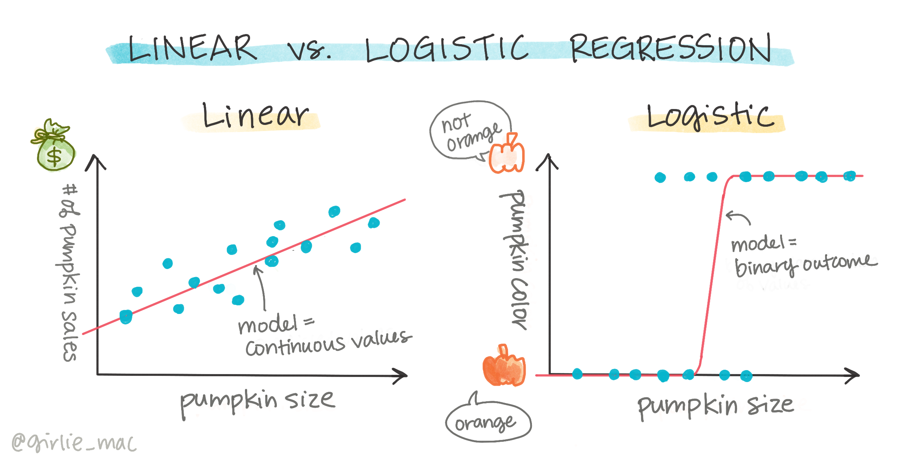
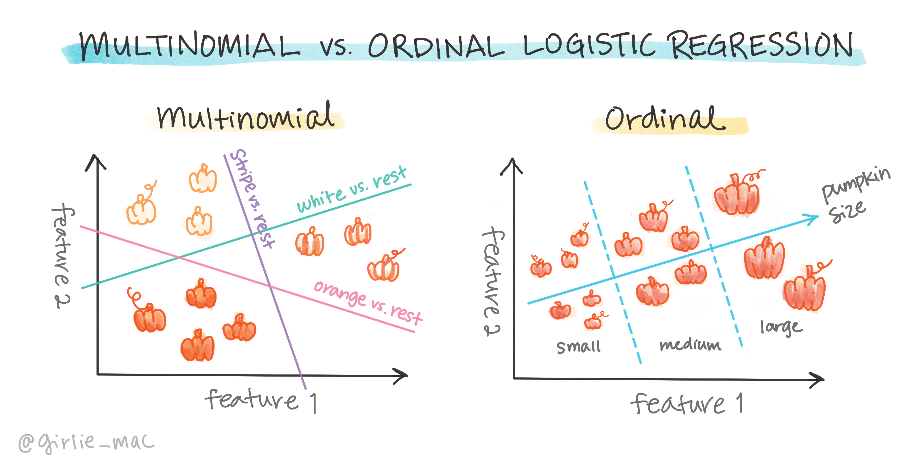

<!--
CO_OP_TRANSLATOR_METADATA:
{
  "original_hash": "72b5bae0879baddf6aafc82bb07b8776",
  "translation_date": "2025-08-29T16:42:20+00:00",
  "source_file": "2-Regression/4-Logistic/README.md",
  "language_code": "mr"
}
-->
# वर्गांचे अंदाज लावण्यासाठी लॉजिस्टिक रिग्रेशन



## [पूर्व-व्याख्यान प्रश्नमंजूषा](https://gray-sand-07a10f403.1.azurestaticapps.net/quiz/15/)

> ### [हा धडा R मध्ये उपलब्ध आहे!](../../../../2-Regression/4-Logistic/solution/R/lesson_4.html)

## परिचय

रिग्रेशनवरील या अंतिम धड्यात, जो एक मूलभूत _क्लासिक_ मशीन लर्निंग तंत्र आहे, आपण लॉजिस्टिक रिग्रेशनवर एक नजर टाकणार आहोत. तुम्ही हे तंत्र दोन श्रेणींचे अंदाज लावण्यासाठी वापरू शकता. ही कँडी चॉकलेट आहे का नाही? हा रोग संसर्गजन्य आहे का नाही? हा ग्राहक हा उत्पादन निवडेल का नाही?

या धड्यात तुम्ही शिकाल:

- डेटा व्हिज्युअलायझेशनसाठी नवीन लायब्ररी
- लॉजिस्टिक रिग्रेशनसाठी तंत्र

✅ या प्रकारच्या रिग्रेशनसह काम करण्याचे तुमचे ज्ञान या [Learn module](https://docs.microsoft.com/learn/modules/train-evaluate-classification-models?WT.mc_id=academic-77952-leestott) मध्ये अधिक सखोल करा.

## पूर्वतयारी

कद्दूच्या डेटासह काम केल्यामुळे, आपल्याला आता हे समजले आहे की एक द्विआधारी श्रेणी आहे ज्यावर आपण काम करू शकतो: `Color`.

चला लॉजिस्टिक रिग्रेशन मॉडेल तयार करूया जे काही व्हेरिएबल्स दिल्यास, _एखाद्या कद्दूचा रंग काय असेल_ (नारंगी 🎃 किंवा पांढरा 👻) याचा अंदाज लावेल.

> आपण रिग्रेशनबद्दलच्या धड्यांमध्ये द्विआधारी वर्गीकरण का बोलत आहोत? फक्त भाषिक सोयीसाठी, कारण लॉजिस्टिक रिग्रेशन [खरं तर एक वर्गीकरण पद्धत आहे](https://scikit-learn.org/stable/modules/linear_model.html#logistic-regression), जरी ती लीनियर-आधारित आहे. डेटा वर्गीकृत करण्याच्या इतर पद्धतींबद्दल पुढील धड्यांमध्ये जाणून घ्या.

## प्रश्न परिभाषित करा

आपल्या उद्देशांसाठी, आपण याला द्विआधारी स्वरूपात व्यक्त करू: 'पांढरा' किंवा 'पांढरा नाही'. आमच्या डेटासेटमध्ये 'पट्टेदार' श्रेणी देखील आहे परंतु त्याचे काहीच उदाहरण आहे, त्यामुळे आपण ते वापरणार नाही. डेटासेटमधून null मूल्ये काढून टाकल्यानंतर ते अदृश्य होते.

> 🎃 मजेदार तथ्य, आम्ही कधी कधी पांढऱ्या कद्दूला 'भूत' कद्दू म्हणतो. ते कोरायला फारसे सोपे नसते, त्यामुळे ते नारंगी कद्दूपेक्षा कमी लोकप्रिय असतात पण ते छान दिसतात! त्यामुळे आपण आपला प्रश्न पुन्हा असेही मांडू शकतो: 'भूत' किंवा 'भूत नाही'. 👻

## लॉजिस्टिक रिग्रेशनबद्दल

लॉजिस्टिक रिग्रेशन लीनियर रिग्रेशनपेक्षा, ज्याबद्दल तुम्ही यापूर्वी शिकले होते, काही महत्त्वाच्या प्रकारांनी वेगळे आहे.

[](https://youtu.be/KpeCT6nEpBY "मशीन लर्निंग वर्गीकरणासाठी लॉजिस्टिक रिग्रेशन समजून घेणे")

> 🎥 लॉजिस्टिक रिग्रेशनचा संक्षिप्त व्हिडिओ आढावा घेण्यासाठी वरील प्रतिमेवर क्लिक करा.

### द्विआधारी वर्गीकरण

लॉजिस्टिक रिग्रेशन लीनियर रिग्रेशनसारखी वैशिष्ट्ये देत नाही. पूर्वीचे द्विआधारी श्रेणी ("पांढरा किंवा पांढरा नाही") बद्दल अंदाज देते तर नंतरचे सतत मूल्यांचा अंदाज लावण्यास सक्षम आहे, उदाहरणार्थ कद्दूचा उगम आणि कापणीचा वेळ दिल्यास, _त्याच्या किंमतीत किती वाढ होईल_.


> माहितीपट [दसानी मदीपल्ली](https://twitter.com/dasani_decoded) यांनी तयार केला आहे.

### इतर वर्गीकरण

लॉजिस्टिक रिग्रेशनचे इतर प्रकार आहेत, ज्यात मल्टिनॉमियल आणि ऑर्डिनल समाविष्ट आहेत:

- **मल्टिनॉमियल**, ज्यामध्ये एकापेक्षा जास्त श्रेणी असते - "नारंगी, पांढरा आणि पट्टेदार".
- **ऑर्डिनल**, ज्यामध्ये क्रमबद्ध श्रेणी असते, जेव्हा आपण आपल्या परिणामांना तार्किकरित्या क्रमबद्ध करायचे असते तेव्हा उपयुक्त, जसे की कद्दू जे मर्यादित आकारांनुसार क्रमबद्ध केले जातात (mini, sm, med, lg, xl, xxl).



### व्हेरिएबल्सला सहसंबद्ध असण्याची गरज नाही

लक्षात ठेवा की लीनियर रिग्रेशन अधिक सहसंबद्ध व्हेरिएबल्ससह चांगले कार्य करते? लॉजिस्टिक रिग्रेशन उलट आहे - व्हेरिएबल्सला जुळण्याची गरज नाही. हे डेटा साठी कार्य करते ज्यामध्ये काहीसे कमजोर सहसंबंध आहेत.

### तुम्हाला स्वच्छ डेटाची गरज आहे

लॉजिस्टिक रिग्रेशन अधिक डेटा वापरल्यास अधिक अचूक परिणाम देईल; आमचे छोटे डेटासेट या कार्यासाठी आदर्श नाही, त्यामुळे हे लक्षात ठेवा.

[](https://youtu.be/B2X4H9vcXTs "लॉजिस्टिक रिग्रेशनसाठी डेटा विश्लेषण आणि तयारी")

✅ लॉजिस्टिक रिग्रेशनसाठी चांगल्या प्रकारे उपयुक्त असलेल्या डेटाच्या प्रकारांबद्दल विचार करा.

## व्यायाम - डेटा स्वच्छ करा

सुरुवातीला, null मूल्ये काढून टाकून आणि फक्त काही स्तंभ निवडून डेटा थोडा स्वच्छ करा:

1. खालील कोड जोडा:

    ```python
  
    columns_to_select = ['City Name','Package','Variety', 'Origin','Item Size', 'Color']
    pumpkins = full_pumpkins.loc[:, columns_to_select]

    pumpkins.dropna(inplace=True)
    ```

    तुम्ही तुमच्या नवीन डेटाफ्रेमवर नेहमी एक नजर टाकू शकता:

    ```python
    pumpkins.info
    ```

### व्हिज्युअलायझेशन - श्रेणीबद्ध प्लॉट

आता तुम्ही [स्टार्टर नोटबुक](./notebook.ipynb) पुन्हा कद्दूच्या डेटासह लोड केले आहे आणि काही व्हेरिएबल्ससह डेटासेट जतन करण्यासाठी ते स्वच्छ केले आहे, ज्यामध्ये `Color` समाविष्ट आहे. चला नोटबुकमध्ये डेटाफ्रेम व्हिज्युअलाइझ करूया वेगळ्या लायब्ररीचा वापर करून: [Seaborn](https://seaborn.pydata.org/index.html), जी आपण यापूर्वी वापरलेल्या Matplotlib वर आधारित आहे.

Seaborn तुमचा डेटा व्हिज्युअलाइझ करण्याचे काही छान मार्ग ऑफर करते. उदाहरणार्थ, तुम्ही `Variety` आणि `Color` साठी डेटा वितरणांची तुलना श्रेणीबद्ध प्लॉटमध्ये करू शकता.

1. कद्दूच्या डेटासह `catplot` फंक्शन वापरून, आणि प्रत्येक कद्दू श्रेणीसाठी (नारंगी किंवा पांढरा) रंग मॅपिंग निर्दिष्ट करून, अशा प्रकारचा प्लॉट तयार करा:

    ```python
    import seaborn as sns
    
    palette = {
    'ORANGE': 'orange',
    'WHITE': 'wheat',
    }

    sns.catplot(
    data=pumpkins, y="Variety", hue="Color", kind="count",
    palette=palette, 
    )
    ```

    

    डेटा पाहून, तुम्ही पाहू शकता की `Color` डेटा `Variety` शी कसा संबंधित आहे.

    ✅ या श्रेणीबद्ध प्लॉट दिल्यानंतर, तुम्ही कोणते मनोरंजक अन्वेषण कल्पना करू शकता?

### डेटा पूर्व-प्रक्रिया: फीचर आणि लेबल एन्कोडिंग

आमच्या कद्दूच्या डेटासेटमध्ये त्याच्या सर्व स्तंभांसाठी स्ट्रिंग मूल्ये आहेत. श्रेणीबद्ध डेटासह काम करणे मानवांसाठी अंतर्ज्ञानी आहे परंतु मशीनसाठी नाही. मशीन लर्निंग अल्गोरिदम्स संख्यांसह चांगले कार्य करतात. म्हणून एन्कोडिंग हा डेटा पूर्व-प्रक्रिया टप्प्यातील एक अतिशय महत्त्वाचा भाग आहे, कारण यामुळे आम्हाला श्रेणीबद्ध डेटा संख्यात्मक डेटामध्ये बदलण्यास सक्षम होते, कोणतीही माहिती न गमावता. चांगले एन्कोडिंग चांगले मॉडेल तयार करण्यास मदत करते.

फीचर एन्कोडिंगसाठी दोन मुख्य प्रकारचे एन्कोडर आहेत:

1. ऑर्डिनल एन्कोडर: हे ऑर्डिनल व्हेरिएबल्ससाठी चांगले आहे, जे श्रेणीबद्ध व्हेरिएबल्स आहेत जिथे त्यांचा डेटा तार्किक क्रमाचे अनुसरण करतो, जसे की आमच्या डेटासेटमधील `Item Size` स्तंभ. हे असे मॅपिंग तयार करते की प्रत्येक श्रेणी एका क्रमांकाने दर्शविली जाते, जो स्तंभातील श्रेणीचा क्रम आहे.

    ```python
    from sklearn.preprocessing import OrdinalEncoder

    item_size_categories = [['sml', 'med', 'med-lge', 'lge', 'xlge', 'jbo', 'exjbo']]
    ordinal_features = ['Item Size']
    ordinal_encoder = OrdinalEncoder(categories=item_size_categories)
    ```

2. श्रेणीबद्ध एन्कोडर: हे नाममात्र व्हेरिएबल्ससाठी चांगले आहे, जे श्रेणीबद्ध व्हेरिएबल्स आहेत जिथे त्यांचा डेटा तार्किक क्रमाचे अनुसरण करत नाही, जसे की आमच्या डेटासेटमधील `Item Size` वगळता इतर सर्व वैशिष्ट्ये. हे एक वन-हॉट एन्कोडिंग आहे, ज्याचा अर्थ प्रत्येक श्रेणी बायनरी स्तंभाद्वारे दर्शविली जाते: एन्कोड केलेला व्हेरिएबल 1 च्या बरोबर आहे जर कद्दू त्या `Variety` शी संबंधित असेल आणि अन्यथा 0.

    ```python
    from sklearn.preprocessing import OneHotEncoder

    categorical_features = ['City Name', 'Package', 'Variety', 'Origin']
    categorical_encoder = OneHotEncoder(sparse_output=False)
    ```

यानंतर, `ColumnTransformer` वापरून अनेक एन्कोडर एका चरणात एकत्र केले जातात आणि योग्य स्तंभांवर लागू केले जातात.

```python
    from sklearn.compose import ColumnTransformer
    
    ct = ColumnTransformer(transformers=[
        ('ord', ordinal_encoder, ordinal_features),
        ('cat', categorical_encoder, categorical_features)
        ])
    
    ct.set_output(transform='pandas')
    encoded_features = ct.fit_transform(pumpkins)
```

दुसरीकडे, लेबल एन्कोड करण्यासाठी, आम्ही scikit-learn चा `LabelEncoder` वर्ग वापरतो, जो लेबल्स सामान्यीकृत करण्यासाठी एक युटिलिटी वर्ग आहे ज्यामुळे त्यात फक्त 0 ते n_classes-1 (येथे, 0 आणि 1) दरम्यानचे मूल्य असते.

```python
    from sklearn.preprocessing import LabelEncoder

    label_encoder = LabelEncoder()
    encoded_label = label_encoder.fit_transform(pumpkins['Color'])
```

एकदा आम्ही फीचर्स आणि लेबल एन्कोड केले की, आम्ही त्यांना नवीन डेटाफ्रेम `encoded_pumpkins` मध्ये एकत्र करू शकतो.

```python
    encoded_pumpkins = encoded_features.assign(Color=encoded_label)
```

✅ `Item Size` स्तंभासाठी ऑर्डिनल एन्कोडर वापरण्याचे फायदे काय आहेत?

### व्हेरिएबल्समधील संबंधांचे विश्लेषण करा

आता आपण आपला डेटा पूर्व-प्रक्रिया केला आहे, आपण फीचर्स आणि लेबलमधील संबंधांचे विश्लेषण करू शकतो जेणेकरून मॉडेल फीचर्स दिल्यास लेबलचा अंदाज किती चांगला लावू शकेल याची कल्पना मिळेल. 

डेटा प्लॉट करणे हे असे विश्लेषण करण्याचा सर्वोत्तम मार्ग आहे. आम्ही पुन्हा Seaborn च्या `catplot` फंक्शनचा वापर करू, `Item Size`, `Variety` आणि `Color` मधील संबंध श्रेणीबद्ध प्लॉटमध्ये व्हिज्युअलाइझ करण्यासाठी. डेटा चांगल्या प्रकारे प्लॉट करण्यासाठी आम्ही एन्कोड केलेला `Item Size` स्तंभ आणि अनएन्कोड केलेला `Variety` स्तंभ वापरणार आहोत.

```python
    palette = {
    'ORANGE': 'orange',
    'WHITE': 'wheat',
    }
    pumpkins['Item Size'] = encoded_pumpkins['ord__Item Size']

    g = sns.catplot(
        data=pumpkins,
        x="Item Size", y="Color", row='Variety',
        kind="box", orient="h",
        sharex=False, margin_titles=True,
        height=1.8, aspect=4, palette=palette,
    )
    g.set(xlabel="Item Size", ylabel="").set(xlim=(0,6))
    g.set_titles(row_template="{row_name}")
```


### स्वॉर्म प्लॉट वापरा

`Color` एक द्विआधारी श्रेणी आहे (पांढरा किंवा नाही), त्यामुळे त्याला 'व्हिज्युअलायझेशनसाठी [विशेष दृष्टिकोन](https://seaborn.pydata.org/tutorial/categorical.html?highlight=bar)' आवश्यक आहे. या श्रेणीचा इतर व्हेरिएबल्सशी संबंध व्हिज्युअलाइझ करण्याचे इतर मार्ग आहेत.

तुम्ही Seaborn प्लॉट्ससह व्हेरिएबल्स बाजूने व्हिज्युअलाइझ करू शकता.

1. मूल्यांचे वितरण दर्शविण्यासाठी 'स्वॉर्म' प्लॉट वापरून पहा:

    ```python
    palette = {
    0: 'orange',
    1: 'wheat'
    }
    sns.swarmplot(x="Color", y="ord__Item Size", data=encoded_pumpkins, palette=palette)
    ```

    

**लक्ष द्या**: वरील कोड चेतावणी निर्माण करू शकतो, कारण Seaborn अशा मोठ्या प्रमाणातील डेटा पॉइंट्स स्वॉर्म प्लॉटमध्ये दर्शविण्यात अयशस्वी होतो. संभाव्य उपाय म्हणजे मार्करचा आकार कमी करणे, 'size' पॅरामीटर वापरून. तथापि, लक्षात ठेवा की यामुळे प्लॉटची वाचनीयता प्रभावित होते.

> **🧮 गणित दाखवा**
>
> लॉजिस्टिक रिग्रेशन 'मॅक्सिमम लाइकलीहुड' संकल्पनेवर आधारित आहे, ज्यासाठी [सिग्मॉइड फंक्शन्स](https://wikipedia.org/wiki/Sigmoid_function) वापरल्या जातात. 'सिग्मॉइड फंक्शन' प्लॉटवर 'S' आकारासारखे दिसते. ते एखाद्या मूल्याला घेते आणि ते 0 ते 1 दरम्यान कुठेतरी मॅप करते. त्याचे वक्र 'लॉजिस्टिक वक्र' म्हणूनही ओळखले जाते. त्याचा फॉर्म्युला असा दिसतो:
>
> 
>
> जिथे सिग्मॉइडचा मध्यबिंदू x च्या 0 पॉइंटवर असतो, L वक्राचे जास्तीत जास्त मूल्य असते आणि k वक्राची तीव्रता असते. जर फंक्शनचा परिणाम 0.5 पेक्षा जास्त असेल, तर संबंधित लेबलला द्विआधारी निवडीचा '1' वर्ग दिला जाईल. अन्यथा, त्याचे वर्गीकरण '0' म्हणून केले जाईल.

## तुमचे मॉडेल तयार करा

Scikit-learn मध्ये द्विआधारी वर्गीकरण शोधण्यासाठी मॉडेल तयार करणे आश्चर्यकारकपणे सोपे आहे.

[](https://youtu.be/MmZS2otPrQ8 "डेटा वर्गीकरणासाठी लॉजिस्टिक रिग्रेशन")

> 🎥 लीनियर रिग्रेशन मॉडेल तयार करण्याचा संक्षिप्त व्हिडिओ आढावा घेण्यासाठी वरील प्रतिमेवर क्लिक करा.

1. तुमच्या वर्गीकरण मॉडेलमध्ये वापरायचे व्हेरिएबल्स निवडा आणि `train_test_split()` कॉल करून प्रशिक्षण आणि चाचणी संच विभाजित करा:

    ```python
    from sklearn.model_selection import train_test_split
    
    X = encoded_pumpkins[encoded_pumpkins.columns.difference(['Color'])]
    y = encoded_pumpkins['Color']

    X_train, X_test, y_train, y_test = train_test_split(X, y, test_size=0.2, random_state=0)
    
    ```

2. आता तुम्ही तुमचे मॉडेल प्रशिक्षण देऊ शकता, तुमच्या प्रशिक्षण डेटासह `fit()` कॉल करून, आणि त्याचा परिणाम प्रिंट करू शकता:

    ```python
    from sklearn.metrics import f1_score, classification_report 
    from sklearn.linear_model import LogisticRegression

    model = LogisticRegression()
    model.fit(X_train, y_train)
    predictions = model.predict(X_test)

    print(classification_report(y_test, predictions))
    print('Predicted labels: ', predictions)
    print('F1-score: ', f1_score(y_test, predictions))
    ```

    तुमच्या मॉडेलच्या स्कोअरबोर्डकडे एक नजर टाका. तुमच्याकडे फक्त सुमारे 1000 पंक्तींचा डेटा असल्यामुळे ते वाईट नाही:

    ```output
                       precision    recall  f1-score   support
    
                    0       0.94      0.98      0.96       166
                    1       0.85      0.67      0.75        33
    
        accuracy                                0.92       199
        macro avg           0.89      0.82      0.85       199
        weighted avg        0.92      0.92      0.92       199
    
        Predicted labels:  [0 0 0 0 0 0 0 0 0 0 0 0 0 0 0 0 0 0 0 0 1 0 0 1 0 0 0 0 0 0 0 0 1 0 0 0 0
        0 0 0 0 0 1 0 1 0 0 1 0 0 0 0 0 1 0 1 0 1 0 1 0 0 0 0 0 0 0 0 0 0 0 0 0 0
        1 0 0 0 0 0 0 0 1 0 0 0 0 0 0 0 1 0 0 0 0 0 0 0 0 1 0 1 0 0 0 0 0 0 0 1 0
        0 0 0 0 0 0 0 0 0 0 0 0 0 0 0 0 0 0 0 0 0 1 0 0 0 0 0 0 0 0 1 0 0 0 1 1 0
        0 0 0 0 1 0 0 0 0 0 1 0 0 0 0 0 0 0 0 0 0 0 0 0 0 0 0 0 0 0 0 0 0 0 0 0 1
        0 0 0 1 0 0 0 0 0 0 0 0 1 1]
        F1-score:  0.7457627118644068
    ```

## गोंधळाचे मॅट्रिक्स वापरून चांगले समजून घ्या

तुम्ही वरील आयटम्स प्रिंट करून [अटींमध्ये](https://scikit-learn.org/stable/modules/generated/sklearn.metrics.classification_report.html?highlight=classification_report#sklearn.metrics.classification_report) स्कोअरबोर्ड रिपोर्ट मिळवू शकता, परंतु तुम्ही तुमचे मॉडेल अधिक चांगल्या प्रकारे समजू शकता जर तुम्ही [गोंधळाचे मॅट्रिक्स](https://scikit-learn.org/stable/modules/model_evaluation.html#confusion-matrix) वापरले तर जे मॉडेल कसे कार्य करत आहे हे समजण्यास मदत करते.

> 🎓 '[गोंधळाचे मॅट्रिक्स](https://wikipedia.org/wiki/Confusion_matrix)' (किंवा 'त्रुटी मॅट्रिक्स') ही एक टेबल आहे जी तुमच्या मॉडेलचे खरे वि. खोटे पॉझिटिव्ह आणि निगेटिव्ह व्यक्त करते, अशा प्रकारे अंदाजांची अचूकता मोजते.

1. गोंधळाचे मॅट्रिक्स वापरण्यासाठी, `confusion_matrix()` कॉल करा:

    ```python
    from sklearn.metrics import confusion_matrix
    confusion_matrix(y_test, predictions)
    ```

    तुमच्या मॉडेलच्या गोंधळाच्या मॅट्रिक्सकडे एक नजर टाका:

    ```output
    array([[162,   4],
           [ 11,  22]])
    ```

Scikit-learn मध्ये, गोंधळाच्या मॅट्रिक्समध्ये पंक्ती (axis 0) वास्तविक लेबल्स असतात आणि स्तंभ (axis 1) अंदाजित लेबल्स असतात.

|       |   0   |   1   |
| :---: | :---
गोंधळ मॅट्रिक्सचा प्रिसिजन आणि रिकॉलशी कसा संबंध आहे? लक्षात ठेवा, वरील प्रिंट केलेल्या वर्गीकरण अहवालात प्रिसिजन (0.85) आणि रिकॉल (0.67) दर्शविले होते.

प्रिसिजन = tp / (tp + fp) = 22 / (22 + 4) = 0.8461538461538461

रिकॉल = tp / (tp + fn) = 22 / (22 + 11) = 0.6666666666666666

✅ प्रश्न: गोंधळ मॅट्रिक्सनुसार, मॉडेलने कसे काम केले? उत्तर: वाईट नाही; बऱ्याच प्रमाणात खरे निगेटिव्ह्स आहेत, पण काही खोटे निगेटिव्ह्सही आहेत.

चला, आपण यापूर्वी पाहिलेल्या संज्ञा पुन्हा गोंधळ मॅट्रिक्समधील TP/TN आणि FP/FN च्या मॅपिंगच्या मदतीने पाहूया:

🎓 प्रिसिजन: TP/(TP + FP) पुनर्प्राप्त केलेल्या उदाहरणांपैकी संबंधित उदाहरणांचे प्रमाण (उदा. कोणते लेबल्स योग्यरित्या लेबल केले गेले)

🎓 रिकॉल: TP/(TP + FN) पुनर्प्राप्त केलेल्या संबंधित उदाहरणांचे प्रमाण, योग्यरित्या लेबल केले गेले असो वा नसो

🎓 f1-स्कोअर: (2 * प्रिसिजन * रिकॉल)/(प्रिसिजन + रिकॉल) प्रिसिजन आणि रिकॉलचा भारित सरासरी, सर्वोत्तम 1 आणि सर्वात वाईट 0

🎓 सपोर्ट: प्रत्येक लेबलच्या पुनर्प्राप्त झालेल्या उदाहरणांची संख्या

🎓 अचूकता: (TP + TN)/(TP + TN + FP + FN) नमुन्यासाठी अचूकपणे अंदाज लावलेल्या लेबल्सचे टक्केवारी

🎓 मॅक्रो सरासरी: प्रत्येक लेबलसाठी वजन न देता मेट्रिक्सची सरासरी गणना, लेबल असमतोल विचारात न घेता.

🎓 वजनित सरासरी: प्रत्येक लेबलसाठी मेट्रिक्सची सरासरी गणना, सपोर्ट (प्रत्येक लेबलसाठी खऱ्या उदाहरणांची संख्या) ने त्यांना वजन देऊन लेबल असमतोल विचारात घेणे.

✅ तुम्हाला वाटते की जर तुम्हाला तुमच्या मॉडेलने खोट्या निगेटिव्ह्सची संख्या कमी करायची असेल, तर कोणता मेट्रिक पाहायला हवा?

## या मॉडेलचा ROC कर्व्ह व्हिज्युअलाइझ करा

[](https://youtu.be/GApO575jTA0 "ML for beginners - Analyzing Logistic Regression Performance with ROC Curves")

> 🎥 वरील प्रतिमेवर क्लिक करा ROC कर्व्ह्सचा छोटासा व्हिडिओ आढावा पाहण्यासाठी

चला, तथाकथित 'ROC' कर्व्ह पाहण्यासाठी आणखी एक व्हिज्युअलायझेशन करूया:

```python
from sklearn.metrics import roc_curve, roc_auc_score
import matplotlib
import matplotlib.pyplot as plt
%matplotlib inline

y_scores = model.predict_proba(X_test)
fpr, tpr, thresholds = roc_curve(y_test, y_scores[:,1])

fig = plt.figure(figsize=(6, 6))
plt.plot([0, 1], [0, 1], 'k--')
plt.plot(fpr, tpr)
plt.xlabel('False Positive Rate')
plt.ylabel('True Positive Rate')
plt.title('ROC Curve')
plt.show()
```

Matplotlib चा वापर करून, मॉडेलचा [Receiving Operating Characteristic](https://scikit-learn.org/stable/auto_examples/model_selection/plot_roc.html?highlight=roc) किंवा ROC प्लॉट करा. ROC कर्व्ह्सचा वापर सामान्यतः वर्गीकरणाच्या आउटपुटचे खरे विरुद्ध खोटे पॉझिटिव्ह्सच्या दृष्टीने दृश्य मिळवण्यासाठी केला जातो. "ROC कर्व्ह्समध्ये सामान्यतः Y अक्षावर खरे पॉझिटिव्ह रेट आणि X अक्षावर खोटे पॉझिटिव्ह रेट असतो." त्यामुळे कर्व्हची तीव्रता आणि मध्यरेषा व कर्व्ह यांच्यातील जागा महत्त्वाची ठरते: तुम्हाला अशी कर्व्ह हवी आहे जी पटकन वर जाईल आणि रेषेच्या वर जाईल. आपल्या बाबतीत, सुरुवातीला खोटे पॉझिटिव्ह्स आहेत, आणि नंतर रेषा योग्यरित्या वर जाते:


शेवटी, Scikit-learn च्या [`roc_auc_score` API](https://scikit-learn.org/stable/modules/generated/sklearn.metrics.roc_auc_score.html?highlight=roc_auc#sklearn.metrics.roc_auc_score) चा वापर करून प्रत्यक्ष 'Area Under the Curve' (AUC) मोजा:

```python
auc = roc_auc_score(y_test,y_scores[:,1])
print(auc)
```
परिणाम `0.9749908725812341` आहे. AUC 0 ते 1 दरम्यान असतो, त्यामुळे तुम्हाला मोठा स्कोअर हवा आहे, कारण 100% अचूक अंदाज लावणाऱ्या मॉडेलचा AUC 1 असेल; या प्रकरणात, मॉडेल _खूप चांगले_ आहे.

वर्गीकरणावरील भविष्यातील धड्यांमध्ये, तुम्ही तुमच्या मॉडेलच्या स्कोअर्समध्ये सुधारणा करण्यासाठी कसे पुनरावृत्ती करायचे ते शिकाल. पण सध्या, अभिनंदन! तुम्ही हे रिग्रेशन धडे पूर्ण केले आहेत!

---
## 🚀चॅलेंज

लॉजिस्टिक रिग्रेशनबद्दल अजून बरेच काही समजून घ्यायचे आहे! पण शिकण्याचा सर्वोत्तम मार्ग म्हणजे प्रयोग करणे. अशा प्रकारच्या विश्लेषणासाठी योग्य असलेला डेटासेट शोधा आणि त्यावर मॉडेल तयार करा. तुम्हाला काय शिकायला मिळते? टिप: [Kaggle](https://www.kaggle.com/search?q=logistic+regression+datasets) वर मनोरंजक डेटासेट्स शोधा.

## [पाठानंतरचा क्विझ](https://gray-sand-07a10f403.1.azurestaticapps.net/quiz/16/)

## पुनरावलोकन आणि स्व-अभ्यास

[स्टॅनफोर्डच्या या पेपरच्या](https://web.stanford.edu/~jurafsky/slp3/5.pdf) पहिल्या काही पानांचे वाचन करा, ज्यामध्ये लॉजिस्टिक रिग्रेशनच्या काही व्यावहारिक उपयोगांबद्दल माहिती आहे. आपण आतापर्यंत अभ्यासलेल्या रिग्रेशन प्रकारांपैकी कोणत्या प्रकारासाठी कोणते कार्य अधिक योग्य आहे याचा विचार करा. काय चांगले काम करेल?

## असाइनमेंट 

[हे रिग्रेशन पुन्हा प्रयत्न करा](assignment.md)

---

**अस्वीकरण**:  
हा दस्तऐवज AI भाषांतर सेवा [Co-op Translator](https://github.com/Azure/co-op-translator) वापरून भाषांतरित करण्यात आला आहे. आम्ही अचूकतेसाठी प्रयत्नशील असलो तरी कृपया लक्षात ठेवा की स्वयंचलित भाषांतरांमध्ये त्रुटी किंवा अचूकतेचा अभाव असू शकतो. मूळ भाषेतील दस्तऐवज हा अधिकृत स्रोत मानला जावा. महत्त्वाच्या माहितीसाठी व्यावसायिक मानवी भाषांतराची शिफारस केली जाते. या भाषांतराचा वापर करून निर्माण होणाऱ्या कोणत्याही गैरसमज किंवा चुकीच्या अर्थासाठी आम्ही जबाबदार राहणार नाही.