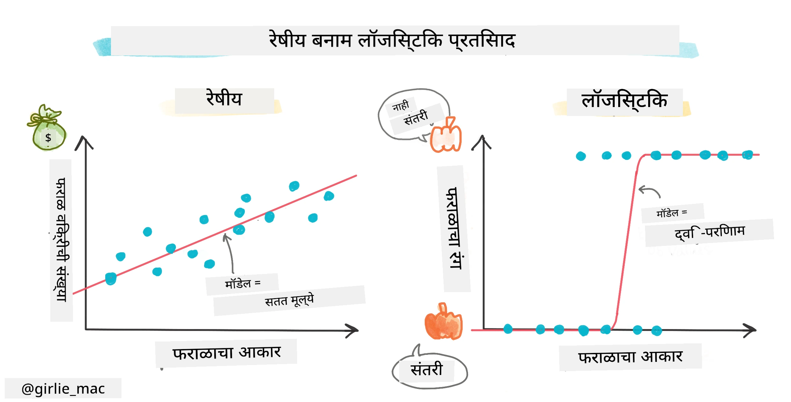
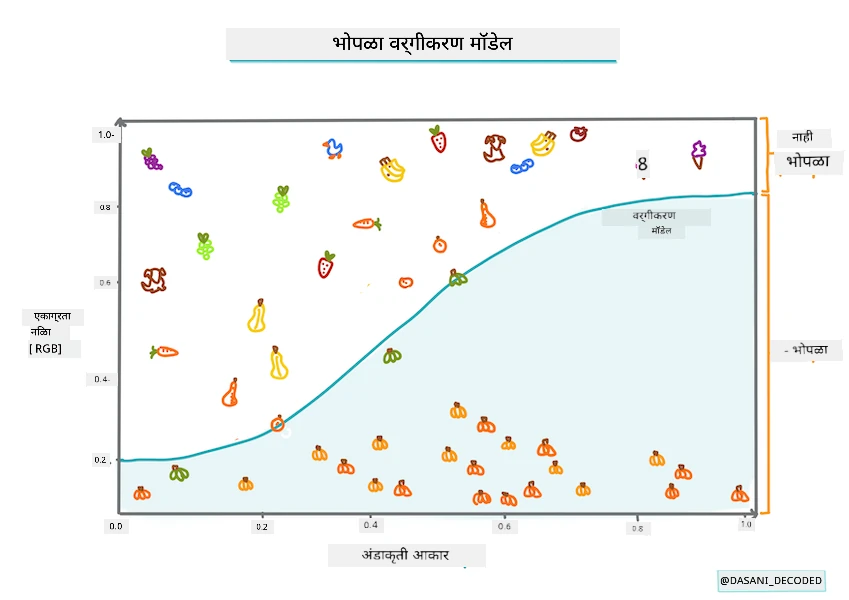
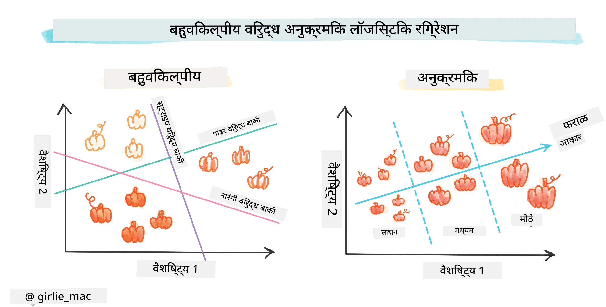
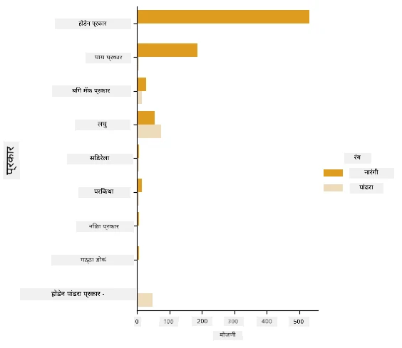
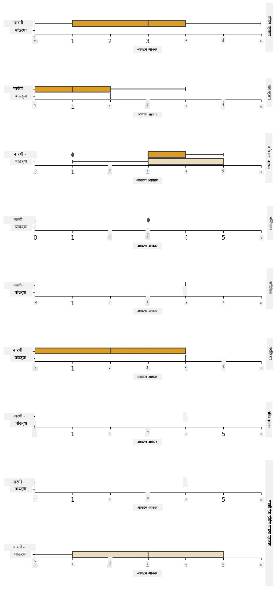
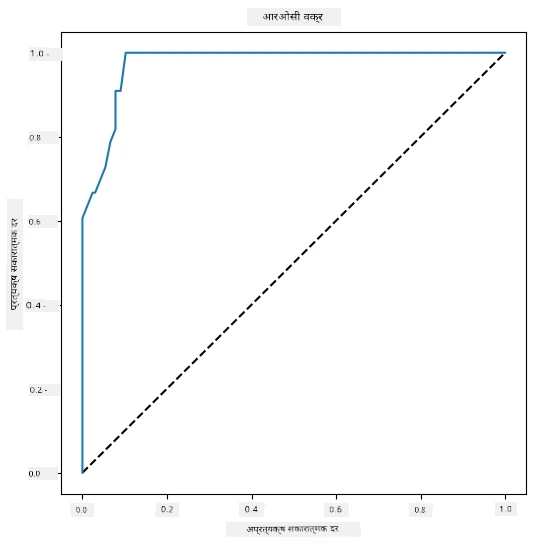

# वर्गांमध्ये भाकीत करण्यासाठी लॉजिस्टिक रिग्रेशन



## [प्री-लेक्चर क्विझ](https://ff-quizzes.netlify.app/en/ml/)

> ### [हा धडा R मध्ये उपलब्ध आहे!](../../../../2-Regression/4-Logistic/solution/R/lesson_4.html)

## परिचय

रिग्रेशनवरील या अंतिम धड्यांमध्ये, जी एक मूलभूत _क्लासिक_ एमएल तंत्र आहे, आपण लॉजिस्टिक रिग्रेशन कडे पाहू. तुम्ही हे तंत्र वापराल बायनरी वर्गांचे भाकीत करण्यासाठी नमुने शोधायला. हा कँडी चॉकलेट आहे की नाही? ही आजार संसर्गजन्य आहे की नाही? हा ग्राहक हा उत्पादन निवडेल की नाही?

या धड्यात, तुम्ही शिकाल:

- डेटा व्हिज्युअलायझेशनसाठी नवीन लायब्ररी
- लॉजिस्टिक रिग्रेशनसाठी तंत्रे

✅ या [Learn module](https://docs.microsoft.com/learn/modules/train-evaluate-classification-models?WT.mc_id=academic-77952-leestott) मध्ये या प्रकारच्या रिग्रेशनसह काम करण्याचे तुमचे समज वाढवा

## पूर्वअट

कद्दूच्या डेटावर काम केल्यानंतर, आता आपण इतके परिचित आहोत की आपल्याकडे एक बायनरी वर्ग आहे ज्यावर आपण काम करू शकतो: `Color`.

चला एक लॉजिस्टिक रिग्रेशन मॉडेल तयार करू ज्याद्वारे काही चलांच्या मदतीने, _ठरवायचे काढायचे आहे की दिलेला कद्दू कोणत्या रंगाचा असण्याची शक्यता आहे_ (केशरी 🎃 की पांढरा 👻).

> आपण रिग्रेशनबद्दल ग्रुप केलेल्या धडात बायनरी वर्गीकरणाबाबत का बोलत आहोत? फक्त भाषिक सुविधेसाठी, कारण लॉजिस्टिक रिग्रेशन ही [खरेतर वर्गीकरण पद्धत आहे](https://scikit-learn.org/stable/modules/linear_model.html#logistic-regression), जरी ती एक रेषीय आधारित पद्धत आहे. पुढील धडगटात डेटा वर्गीकरणाच्या इतर मार्गांबद्दल जाणून घ्या.

## प्रश्न निश्चित करा

आपल्या उद्दिष्टांसाठी, आपण याला बायनरी स्वरूपात मांडणार आहोत: 'पांढरा' किंवा 'पांढरा नाही'. आमच्या डेटासेटमध्ये 'स्ट्राइप्ड' हा वर्ग देखील आहे पण त्याचे उदाहरण फारच कमी आहेत, म्हणून तो वापरणार नाही. त्याला डाटासेटमधून शून्य मूल्ये काढल्यानंतर तो नाहीसा होतो.

> 🎃 मजेशीर गोष्ट, आपण कधी कधी पांढऱ्या कद्दूंना 'भुताच्या' कद्दू म्हणतो. ते फार सहज नक्की करता येत नाहीत, त्यामुळे ते केशरींपेक्षा फार फार लोकप्रिय नाहीत पण ते छान दिसतात! त्यामुळे आपण आपला प्रश्न असे देखील पुनर्बाधित करू शकतो: 'भुत' किंवा 'भुत नाही'. 👻

## लॉजिस्टिक रिग्रेशनबाबत

यापूर्वी तुम्ही शिकलेल्या लिनियर रिग्रेशनपासून लॉजिस्टिक रिग्रेशन काही महत्त्वाच्या बाबतीत वेगळे आहे.

[](https://youtu.be/KpeCT6nEpBY "एमएल नवशिक्यांसाठी - मशीन लर्निंग वर्गीकरणासाठी लॉजिस्टिक रिग्रेशन समजून घेणे")

> 🎥 लॉजिस्टिक रिग्रेशनचा संक्षिप्त विडिओ आढावा पाहण्यासाठी वरच्या चित्रावर क्लिक करा.

### बायनरी वर्गीकरण

लॉजिस्टिक रिग्रेशन लिनियर रिग्रेशनसारख्या वैशिष्ट्ये देत नाही. पहिला बायनरी वर्गाविषयी भाकीत देतो ("पांढरा की नाही") तर दुसरा सलग मूल्ये भाकीत करू शकतो, उदा. कद्दूचा काटेकोर स्रोत आणि कापणीची वेळ दिल्यास, _त्याची किंमत किती वाढेल_.


> माहितीचित्र [दसानी मदीपल्ली](https://twitter.com/dasani_decoded) यांच्या कडून

### इतर वर्गीकरणे

लॉजिस्टिक रिग्रेशनचे इतर प्रकार देखील असतात, ज्यात मल्टिनॉमियल आणि ऑर्डिनल समाविष्ट आहेत:

- **मल्टिनॉमियल**, ज्यामध्ये एकापेक्षा जास्त वर्ग असतात - "केशरी, पांढरा, आणि पट्टेदार".
- **ऑर्डिनल**, ज्यामध्ये क्रमबद्ध वर्ग असतात, जर आपण आपल्या निकालांना लॉजिकल क्रमाने ठेवायचा असेल तर उपयोगात येते, जसे आपल्या कद्दू ज्यांना काही निश्चित आकारांच्या श्रेणीने (मिनी, स्मॉल, मीडियम, लार्ज, एक्सएल, एक्सएक्सएल) क्रमबद्ध केले आहे.



### चल (variables) यांचे सहसंबंध आवश्यक नाहीत

लक्षात ठेवा लिनियर रिग्रेशनसाठी जास्त सहसंबंधित चल चांगले असतात? लॉजिस्टिक रिग्रेशन याउलट आहे - चलांना जुळण्याची गरज नाही. हे त्यासाठी उपयुक्त आहे ज्यात थोडा कमी सहसंबंध आहे.

### तुलनेने मोठा स्वच्छ डेटाची गरज आहे

लॉजिस्टिक रिग्रेशन अधिक डेटा वापरल्यास अचूक निकाल देते; आमचा छोटा डेटासेट या कामासाठी सर्वोत्तम नाही, त्यामुळे हे लक्षात ठेवा.

[](https://youtu.be/B2X4H9vcXTs "एमएल नवशिक्यांसाठी - लॉजिस्टिक रिग्रेशनसाठी डेटा विश्लेषण आणि तयारी")

> 🎥 लिनियर रिग्रेशनसाठी डेटा तयार करण्याच्या आढाव्यासाठी वर दिलेल्या चित्रावर क्लिक करा

✅ अशा प्रकारच्या डेटाचा विचार करा जे लॉजिस्टिक रिग्रेशनसाठी चांगले असू शकतात

## सराव - डेटा टायडी करा

प्रथम, डेटा थोडा स्वच्छ करा, शून्य मूल्ये काढून टाका आणि केवळ काही स्तंभ निवडा:

1. खालील कोड जोडा:

    ```python
  
    columns_to_select = ['City Name','Package','Variety', 'Origin','Item Size', 'Color']
    pumpkins = full_pumpkins.loc[:, columns_to_select]

    pumpkins.dropna(inplace=True)
    ```

    तुम्ही नेहमी तुमच्या नवीन डेटा फ्रेमवर एक नजर टाकू शकता:

    ```python
    pumpkins.info
    ```

### व्हिज्युअलायझेशन - श्रेणीकरणीय प्लॉट

आतापर्यंत तुम्ही पुन्हा [स्टार्टर नोटबुक](./notebook.ipynb) मध्ये कद्दू डेटासेट लोड केला आहे आणि स्वच्छ केला आहे जेणेकरून काही चलांचा भाग राहील, ज्यात `Color` देखील आहे. चला नोटबुकमध्ये वेगळ्या लायब्ररीचा वापर करून डेटा फ्रेम व्हिज्युअलायझेशन करूया: [Seaborn](https://seaborn.pydata.org/index.html), जी Matplotlib वर आधारित आहे जी आपण आधी वापरली होती.

Seaborn तुमच्या डेटाचे दृश्य सादर करण्याचे काही छान मार्ग देते. उदाहरणार्थ, तुम्ही प्रत्येक `Variety` आणि `Color` साठी डेटाचे वितरण श्रेणी प्लॉटमध्ये तुलना करू शकता.

1. `catplot` फंक्शन वापरून असा प्लॉट तयार करा, आपल्या कद्दू डेटासेट `pumpkins` वापरून, आणि प्रत्येक कद्दू वर्गासाठी रंग नकाशा निर्दिष्ट करा (केशरी किंवा पांढरा):

    ```python
    import seaborn as sns
    
    palette = {
    'ORANGE': 'orange',
    'WHITE': 'wheat',
    }

    sns.catplot(
    data=pumpkins, y="Variety", hue="Color", kind="count",
    palette=palette, 
    )
    ```

    

    डेटाकडे पाहून तुम्ही पाहू शकता की Color डेटा Variety शी कसा संबंधीत आहे.

    ✅ या श्रेणी प्लॉटवरून तुम्हाला कोणत्या काही मनोरंजक शोधांसाठी कल्पना येतात?

### डेटा पूर्व प्रक्रियाकरण: फिचर आणि लेबल एनकोडिंग
आमच्या कद्दूंना डेटासेटमधील सर्व स्तंभांमध्ये स्ट्रिंग मूल्ये आहेत. श्रेणीकरणीय डेटाबरोबर काम करणे माणसांसाठी सोपे आहे पण मशीनसाठी नाही. मशीन लर्निंग अल्गोरिदमसंख्यांसह चांगले काम करतात. म्हणून एनकोडिंग ही डेटा पूर्व-प्रक्रियाकरण मध्ये एक महत्त्वाची पायरी आहे, कारण ती आपल्याला श्रेणीकरणीय डेटा संख्यात्मक डेटामध्ये बदलण्याची परवानगी देते, कोणतीही माहिती गमावली न जाता. चांगले एनकोडिंग चांगले मॉडेल तयार करते.

फिचर एनकोडिंगसाठी दोन मुख्य प्रकार आहेत:

1. ऑर्डिनल एनकोडर: हा ऑर्डिनल चलांसाठी योग्य आहे, जे श्रेणी वर्ग आहेत ज्याचा डेटा तार्किक क्रमाने आहे, जसे आमच्या डेटासेटमधील `Item Size` स्तंभ. हा अशा प्रकारे मॅपिंग तयार करतो की प्रत्येक वर्ग क्रमाने एक संख्या दर्शवेल.

    ```python
    from sklearn.preprocessing import OrdinalEncoder

    item_size_categories = [['sml', 'med', 'med-lge', 'lge', 'xlge', 'jbo', 'exjbo']]
    ordinal_features = ['Item Size']
    ordinal_encoder = OrdinalEncoder(categories=item_size_categories)
    ```

2. श्रेणीक्रमांक एनकोडर: हा नोमिनल चलांसाठी योग्य आहे, जे श्रेणी वर्ग आहेत ज्याचा डेटा तार्किक क्रमाने नाही, जसे आमच्या डेटासेटमधील `Item Size` व्यतिरिक्त सर्व वैशिष्ट्ये. ही वन-हॉट एनकोडिंग आहे, म्हणजे प्रत्येक वर्ग एक बायनरी स्तंभाने दर्शविला जातो: एनकोड केलेला चल 1 असेल जर कद्दू त्या Variety मध्ये असेल आणि 0 अन्यथा.

    ```python
    from sklearn.preprocessing import OneHotEncoder

    categorical_features = ['City Name', 'Package', 'Variety', 'Origin']
    categorical_encoder = OneHotEncoder(sparse_output=False)
    ```
 त्यानंतर, `ColumnTransformer` वापरून एकाच टप्प्यात अनेक एनकोडर्स एकत्र करून योग्य स्तंभावर लागू केले जातात.

```python
    from sklearn.compose import ColumnTransformer
    
    ct = ColumnTransformer(transformers=[
        ('ord', ordinal_encoder, ordinal_features),
        ('cat', categorical_encoder, categorical_features)
        ])
    
    ct.set_output(transform='pandas')
    encoded_features = ct.fit_transform(pumpkins)
```
 दुसरीकडे, लेबल एनकोड करण्यासाठी, आम्ही स्किकिट-लर्नच्या `LabelEncoder` वर्गाचा वापर करतो, जो लेबलेसाठी एक उपयोगी वर्ग आहे जो त्यांना 0 ते n_classes-1 (इथे, 0 आणि 1) मधील मूल्यांमध्ये सामान्यीकरण करण्यात मदत करतो.

```python
    from sklearn.preprocessing import LabelEncoder

    label_encoder = LabelEncoder()
    encoded_label = label_encoder.fit_transform(pumpkins['Color'])
```
 फिचर आणि लेबल एनकोड केल्यानंतर, आम्ही त्यांना नवीन डेटा फ्रेम `encoded_pumpkins` मध्ये एकत्र करू शकतो.

```python
    encoded_pumpkins = encoded_features.assign(Color=encoded_label)
```
✅ `Item Size` स्तंभावर ऑर्डिनल एनकोडर वापरण्याचे फायदे काय आहेत?

### चलांमधील संबंधांचे विश्लेषण करा

आता आमचा डेटा प्री-प्रोसेसिंग झाल्यानंतर, आम्ही फिचर आणि लेबलमधील संबंधांचे विश्लेषण करू शकतो ज्यातून मॉडेलला फिचरस दिल्यास लेबल कितपत चांगले भाकीत करता येईल हे समजू शकते.
यासाठीचा सर्वोत्तम मार्ग म्हणजे डेटा प्लॉट करणे. आम्ही पुन्हा Seaborn चा `catplot` फंक्शन वापरणार आहोत, जेणेकरून `Item Size`, `Variety` आणि `Color` यांमधील संबंध श्रेणी प्लॉटमध्ये पाहता येतील. डेटा चांगल्या प्रकारे प्लॉट करण्यासाठी आम्ही एनकोड केलेला `Item Size` स्तंभ आणि अन एनकोड केलेला `Variety` स्तंभ वापरणार आहोत.

```python
    palette = {
    'ORANGE': 'orange',
    'WHITE': 'wheat',
    }
    pumpkins['Item Size'] = encoded_pumpkins['ord__Item Size']

    g = sns.catplot(
        data=pumpkins,
        x="Item Size", y="Color", row='Variety',
        kind="box", orient="h",
        sharex=False, margin_titles=True,
        height=1.8, aspect=4, palette=palette,
    )
    g.set(xlabel="Item Size", ylabel="").set(xlim=(0,6))
    g.set_titles(row_template="{row_name}")
```


### स्वार्म प्लॉट वापरा

कारण Color हा बायनरी वर्ग आहे (पांढरा किंवा नाही), त्याला 'व्हिज्युअलायझेशनसाठी [विशेष दृष्टिकोन](https://seaborn.pydata.org/tutorial/categorical.html?highlight=bar)' लागतो. या वर्गाचा इतर चलांशी संबंध दाखविण्यासाठी इतर अनेक प्रकार देखील आहेत.

तुम्ही Seaborn प्लॉट्ससह चल बाजूने बाजूने दिसवू शकता.

1. मूल्यांचे वितरण दाखविण्यासाठी 'स्वार्म' प्लॉट वापरून पाहा:

    ```python
    palette = {
    0: 'orange',
    1: 'wheat'
    }
    sns.swarmplot(x="Color", y="ord__Item Size", data=encoded_pumpkins, palette=palette)
    ```

    

**जागरूक रहा**: वरील कोड स्वार्म प्लॉटमध्ये इतक्या डेटापॉइंटचे प्रतिनिधित्व न करू शकल्याने वारंवार वारंवार चेतावणी निर्माण करू शकतो. यासाठी शक्यतो 'size' पॅरामीटर वापरून मार्करचा आकार कमी करणे एक उपाय आहे. मात्र, यामुळे प्लॉट वाचायला त्रास होऊ शकतो.


> **🧮 मला गणित दाखवा**
>
> लॉजिस्टिक रिग्रेशन 'मॅक्सिमम लाइकलिहूड' या संकल्पनेवर आधारित आहे ज्यात [सिग्मॉइड फंक्शन्स](https://wikipedia.org/wiki/Sigmoid_function) वापरल्या जातात. प्लॉटवर 'सिग्मॉइड फंक्शन' 'S' आकारात दिसते. ते एखादे मूल्य घेते आणि त्यास 0 आणि 1 मधील मध्यभागी नकाशित करते. त्याला 'लॉजिस्टिक वक्र' असेही म्हणतात. त्याचा सूत्र असे आहे:
>
> 
>
> जिथे सिग्मॉइडचा मध्यबिंदू x च्या शून्य बिंदूवर असतो, L वक्राचे कमाल मूल्य आहे, आणि k वक्राची तिव्रता आहे. जर फंक्शनचा परिणाम 0.5 पेक्षा जास्त असेल, तर त्या वर्गाला '1' म्हणून वर्गीकृत केले जाते. अन्यथा, तो '0' म्हणून वर्गीकृत होतो.

## तुमचे मॉडेल तयार करा

या बायनरी वर्गीकरणासाठी मॉडेल तयार करणे Scikit-learn मध्ये आश्चर्यकारकपणे सोपे आहे.

[](https://youtu.be/MmZS2otPrQ8 "एमएल नवशिक्यांसाठी - डेटा वर्गीकरणासाठी लॉजिस्टिक रिग्रेशन")

> 🎥 लिनियर रिग्रेशन मॉडेल तयार करण्याच्या संक्षिप्त विडिओसाठी वरील चित्रावर क्लिक करा

1. तुमच्या वर्गीकरण मॉडेलमध्ये वापरायचे चल निवडा आणि `train_test_split()` कॉल करून प्रशिक्षण व चाचणी संच विभाजित करा:

    ```python
    from sklearn.model_selection import train_test_split
    
    X = encoded_pumpkins[encoded_pumpkins.columns.difference(['Color'])]
    y = encoded_pumpkins['Color']

    X_train, X_test, y_train, y_test = train_test_split(X, y, test_size=0.2, random_state=0)
    
    ```

2. आता `fit()` कॉल करून तुमचे मॉडेल प्रशिक्षण द्या आणि त्याचा निकाल दर्शवा:

    ```python
    from sklearn.metrics import f1_score, classification_report 
    from sklearn.linear_model import LogisticRegression

    model = LogisticRegression()
    model.fit(X_train, y_train)
    predictions = model.predict(X_test)

    print(classification_report(y_test, predictions))
    print('Predicted labels: ', predictions)
    print('F1-score: ', f1_score(y_test, predictions))
    ```

    तुमच्या मॉडेलचा स्कोरबोर्ड पहा. वाईट नाही, लक्षात घेतले तर फक्त सुमारे 1000 रांगा आहेत डेटा सेट मध्ये:

    ```output
                       precision    recall  f1-score   support
    
                    0       0.94      0.98      0.96       166
                    1       0.85      0.67      0.75        33
    
        accuracy                                0.92       199
        macro avg           0.89      0.82      0.85       199
        weighted avg        0.92      0.92      0.92       199
    
        Predicted labels:  [0 0 0 0 0 0 0 0 0 0 0 0 0 0 0 0 0 0 0 0 1 0 0 1 0 0 0 0 0 0 0 0 1 0 0 0 0
        0 0 0 0 0 1 0 1 0 0 1 0 0 0 0 0 1 0 1 0 1 0 1 0 0 0 0 0 0 0 0 0 0 0 0 0 0
        1 0 0 0 0 0 0 0 1 0 0 0 0 0 0 0 1 0 0 0 0 0 0 0 0 1 0 1 0 0 0 0 0 0 0 1 0
        0 0 0 0 0 0 0 0 0 0 0 0 0 0 0 0 0 0 0 0 0 1 0 0 0 0 0 0 0 0 1 0 0 0 1 1 0
        0 0 0 0 1 0 0 0 0 0 1 0 0 0 0 0 0 0 0 0 0 0 0 0 0 0 0 0 0 0 0 0 0 0 0 0 1
        0 0 0 1 0 0 0 0 0 0 0 0 1 1]
        F1-score:  0.7457627118644068
    ```

## कनफ्युजन मॅट्रिक्सद्वारे अधिक चांगले समजून घेणे

वर दिलेल्या आयटम्स मुद्रित करून तुम्हाला स्कोरबोर्ड अहवाल मिळेल [अटी](https://scikit-learn.org/stable/modules/generated/sklearn.metrics.classification_report.html?highlight=classification_report#sklearn.metrics.classification_report), पण मॉडेल कसे कार्य करते हे समजण्यासाठी तुम्ही [कनफ्युजन मॅट्रिक्स](https://scikit-learn.org/stable/modules/model_evaluation.html#confusion-matrix) वापरू शकता.

> 🎓 '[कनफ्युजन मॅट्रिक्स](https://wikipedia.org/wiki/Confusion_matrix)' (किंवा 'त्रुटी मॅट्रिक्स') ही एक तक्ता आहे जी तुमच्या मॉडेलच्या ख-खरे विरुद्ध खोटे सकारात्मक आणि नकारात्मक प्रदर्शित करतो, ज्यामुळे भाकीतांचे अचूक मूल्यांकन होते.

1. कनफ्युजन मेट्रिक्स वापरण्यासाठी `confusion_matrix()` कॉल करा:

    ```python
    from sklearn.metrics import confusion_matrix
    confusion_matrix(y_test, predictions)
    ```

    तुमच्या मॉडेलचा कनफ्युजन मेट्रिक्स पाहा:

    ```output
    array([[162,   4],
           [ 11,  22]])
    ```

Scikit-learn मध्ये कनफ्युजन मॅट्रिक्सच्या रांगा (अक्ष 0) खरी लेबल आहेत आणि स्तंभ (अक्ष 1) भाकीत केलेली लेबल.

|       |   0   |   1   |
| :---: | :---: | :---: |
|   0   |  TN   |  FP   |
|   1   |  FN   |  TP   |

येथे काय घडत आहे? समजा आपला मॉडेल कद्दूंना दोन बायनरी वर्गांमध्ये वर्गीकृत करण्यास सांगितला आहे, 'पांढरा' आणि 'पांढरा नाही' या वर्गांमध्ये.

- जर तुमचा मॉडेल एखादा कद्दू पांढऱ्यासाठी नाही असे भाकीत करतो आणि तो प्रत्यक्षात 'पांढरा नाही' वर्गाचा आहे, तर आपण त्याला खरा नकारात्मक (True Negative) म्हणतो, जो वर डाव्या बाजूच्या संख्येने दाखविला आहे.
- जर तुमचा मॉडेल एखादा कद्दू पांढरा म्हणून भाकीत करतो पण तो प्रत्यक्षात 'पांढरा नाही' वर्गाचा असतो, तर आपण त्याला खोटा सकारात्मक (False Positive) म्हणतो, जो वर उजव्या बाजूच्या संख्येने दाखविला आहे.
- जर तुमचा मॉडेल एखादा कद्दू पांढऱ्यासाठी नाही असे भाकीत करतो पण तो प्रत्यक्षात 'पांढरा' वर्गाचा असतो, तर आपण त्याला खोटा नकारात्मक (False Negative) म्हणतो, जो खाली डाव्या बाजूच्या संख्येने दाखविला आहे.
- जर तुमचा मॉडेल एखादा कद्दू पांढरा म्हणून भाकीत करतो आणि तो प्रत्यक्षात 'पांढरा' वर्गाचा आहे, तर आपण त्याला खरा सकारात्मक (True Positive) म्हणतो, जो खाली उजव्या बाजूच्या संख्येने दाखविला आहे.


तुम्हाला कदाचित अंदाज आला असेल की खरे पॉझिटिव्ह्स आणि खरे निगेटिव्ह्सची संख्या जास्त असावी आणि खोटे पॉझिटिव्ह्स आणि खोटे निगेटिव्ह्स कमी असावेत, ज्याचा अर्थ असा की मॉडेल चांगले काम करते.

संदिग्ध मॅट्रिक्स म्हणजे प्रिसिजन आणि रीकॉलशी कसे संबंधित आहे? लक्षात ठेवा, वर छापलेल्या वर्गीकरण अहवालात प्रिसिजन (0.85) आणि रीकॉल (0.67) दाखवले आहे.

प्रिसिजन = tp / (tp + fp) = 22 / (22 + 4) = 0.8461538461538461

रीकॉल = tp / (tp + fn) = 22 / (22 + 11) = 0.6666666666666666

✅ प्रश्न: संदिग्ध मॅट्रिक्सनुसार, मॉडेलने कसे काम केले? उत्तर: वाईट नाही; खरे निगेटिव्ह्स चांगल्या प्रमाणात आहेत पण काही खोटे निगेटिव्ह्स आहेत.

चला आधी पाहिलेल्या टर्म्सना संदिग्ध मॅट्रिक्सच्या TP/TN आणि FP/FN नकाशाच्या मदतीने पुन्हा पाहूया:

🎓 प्रिसिजन: TP/(TP + FP) प्राप्त झालेल्या उदाहरणांमधील संबंधित उदाहरणांचा भाग (उदा. कोणते लेबल चांगले लेबल केले गेले)

🎓 रीकॉल: TP/(TP + FN) प्राप्त झालेल्या संबंधित उदाहरणांचा भाग, त्यांना चांगले लेबल केले गेले असो किंवा नाही

🎓 f1-score: (2 * precision * recall)/(precision + recall) प्रिसिजन आणि रीकॉलचा वजनदार सरासरी, ज्यात 1 सर्वोत्तम आणि 0 सर्वात वाईट आहे

🎓 सपोर्ट: प्रत्येक लेबलच्या प्राप्त घटनांची संख्या

🎓 अचूकता (Accuracy): (TP + TN)/(TP + TN + FP + FN) नमुन्यासाठी लेबल अचूकपणे भाकीत करण्याचा टक्केवारी.

🎓 मॅक्रो सरासरी (Macro Avg): प्रत्येक लेबलसाठी असंवेदनशील सरासरी मेट्रिक्सची मोजणी, लेबल असंतुलन लक्षात न घेता.

🎓 वजनदार सरासरी (Weighted Avg): प्रत्येक लेबलसाठी सरासरी मेट्रिक्सची मोजणी, त्याच्या सपोर्ट (प्रत्येक लेबलसाठी खरे उदाहरणांची संख्या) द्वारे वजन देऊन लेबल असंतुलन लक्षात घेऊन.

✅ जर तुम्हाला तुमच्या मॉडेलच्या खोट्या निगेटिव्ह्सची संख्या कमी करायची असेल तर कोणती मेट्रिक पाहायला हवी असेल?

## या मॉडेलचा ROC कर्व्ह व्हिज्युअलाइझ करा

[](https://youtu.be/GApO575jTA0 "ML for beginners - Analyzing Logistic Regression Performance with ROC Curves")

> 🎥 ROC कर्व्हचा थोडकासा विडियो आढावा पाहण्यासाठी वरील प्रतिमा क्लिक करा

चला आणखी एक व्हिज्युअलाइजेशन करूया ज्याला 'ROC' कर्व्ह म्हणतात:

```python
from sklearn.metrics import roc_curve, roc_auc_score
import matplotlib
import matplotlib.pyplot as plt
%matplotlib inline

y_scores = model.predict_proba(X_test)
fpr, tpr, thresholds = roc_curve(y_test, y_scores[:,1])

fig = plt.figure(figsize=(6, 6))
plt.plot([0, 1], [0, 1], 'k--')
plt.plot(fpr, tpr)
plt.xlabel('False Positive Rate')
plt.ylabel('True Positive Rate')
plt.title('ROC Curve')
plt.show()
```

Matplotlib वापरून मॉडेलचा [Receiving Operating Characteristic](https://scikit-learn.org/stable/auto_examples/model_selection/plot_roc.html?highlight=roc) किंवा ROC प्लॉट करा. ROC कर्व्हचा उपयोग वर्गीकरणाऱ्या बहुधा त्यांच्या खऱ्या विरुद्ध खोट्या पॉझिटिव्ह आउटपुटचा अनुभव घेण्यासाठी केला जातो. "ROC कर्व्हमध्ये सामान्यतः खर्‍या पॉझिटिव्ह रेटसाठी Y अक्षावर आणि खोट्या पॉझिटिव्ह रेटसाठी X अक्षावर दाखवले जाते." त्यामुळे कर्व्हची तीव्रता आणि मध्यरेषा व कर्व्ह यामधील अंतर महत्वाचे असते: तुम्हाला अशी कर्व पाहिजे जी पटकन वर आणि रेषेच्या वर जाईल. आपल्या बाबतीत, सुरुवातीस खोटे पॉझिटिव्ह्स आहेत, आणि नंतर रेषा वर आणि योग्य पद्धतीने वाढते:



अखेरीस, Scikit-learn ची [`roc_auc_score` API](https://scikit-learn.org/stable/modules/generated/sklearn.metrics.roc_auc_score.html?highlight=roc_auc#sklearn.metrics.roc_auc_score) वापरून वास्तविक 'कर्वखालील क्षेत्र' (AUC) मोजा:

```python
auc = roc_auc_score(y_test,y_scores[:,1])
print(auc)
```
परिणाम आहे `0.9749908725812341`. AUC च्या मानाने जो 0 ते 1 पर्यंत असतो, तुम्हाला मोठा स्कोर हवा असतो, कारण 100% अचूक भाकित करणारा मॉडेलचा AUC 1 असेल; या बाबतीत, मॉडेल _खूप चांगले_ आहे.

भविष्यातील वर्गीकरणाच्या धडय़ांमध्ये तुम्हाला शिकायला मिळेल की तुमच्या मॉडेलच्या स्कोर्स सुधारण्यासाठी कसे पुनरावृत्ती करायची. पण सध्या, अभिनंदन! तुम्ही हे रिग्रेशनचे धडे पूर्ण केलेत!

---
## 🚀आव्हान

लॉजिस्टिक रिग्रेशनबद्दल आणखी बरेच काही आहे! पण शिकण्याचा सर्वोत्तम मार्ग म्हणजे प्रयोग करणे. अशा प्रकारच्या विश्लेषणासाठी योग्य डेटा संच शोधा आणि त्यावर मॉडेल तयार करा. तुम्ही काय शिकलात? टिप: [Kaggle](https://www.kaggle.com/search?q=logistic+regression+datasets) येथे मनोरंजक डेटा संच शोधा.

## [धडा संपल्यानंतरचे क्विझ](https://ff-quizzes.netlify.app/en/ml/)

## पुनरावलोकन व स्वअध्ययन

लॉजिस्टिक रिग्रेशनसाठी काही व्यावहारिक वापरांबाबत [स्टॅनफोर्डचा हा पेपर](https://web.stanford.edu/~jurafsky/slp3/5.pdf) वाचा. आपण आतापर्यंत शिकलेल्या वेगवेगळ्या प्रकारच्या रिग्रेशनच्या कामांमध्ये कोणती कार्ये कोणत्या प्रकाराशी अधिक सुसंगत आहेत याचा विचार करा. काय सर्वोत्तम काम करेल?

## गृहपाठ

[हा रिग्रेशन पुन्हा प्रयत्न करा](assignment.md)

---

<!-- CO-OP TRANSLATOR DISCLAIMER START -->
**अस्वीकरण**:
हा दस्तऐवज AI भाषांतर सेवा [Co-op Translator](https://github.com/Azure/co-op-translator) चा वापर करून अनुवादित केला आहे. जरी आम्ही अचूकतेसाठी प्रयत्न करतो, तरी कृपया लक्षात घ्या की स्वयंचलित भाषांतरांमध्ये त्रुटी किंवा अचूकतेची कमतरता असू शकते. मूळ दस्तऐवज त्याच्या मूळ भाषेत अधिकृत स्रोत मानला पाहिजे. महत्त्वाची माहिती असल्यास, व्यावसायिक मानवी भाषांतराची शिफारस केली जाते. या भाषांतराच्या वापरामुळे उद्भवणाऱ्या कोणत्याही गैरसमज किंवा चुकीच्या अर्थलावणीसाठी आम्ही जबाबदार नाही.
<!-- CO-OP TRANSLATOR DISCLAIMER END -->