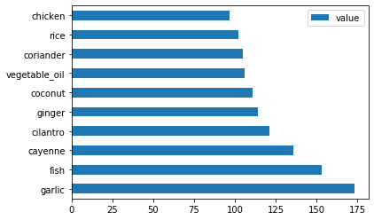

<!--
CO_OP_TRANSLATOR_METADATA:
{
  "original_hash": "76438ce4e5d48982d48f1b55c981caac",
  "translation_date": "2025-08-29T17:57:02+00:00",
  "source_file": "4-Classification/1-Introduction/README.md",
  "language_code": "mr"
}
-->
# वर्गीकरणाची ओळख

या चार धड्यांमध्ये, तुम्ही क्लासिक मशीन लर्निंगच्या मूलभूत घटकांपैकी एक - _वर्गीकरण_ - याचा अभ्यास कराल. आम्ही आशिया आणि भारतातील विविध स्वादिष्ट पदार्थांबद्दलच्या डेटासेटसह विविध वर्गीकरण अल्गोरिदम वापरण्याची प्रक्रिया पाहू. आशा आहे की तुम्हाला भूक लागली असेल!


> या धड्यांमध्ये पॅन-आशियाई पदार्थांचा उत्सव साजरा करा! प्रतिमा [Jen Looper](https://twitter.com/jenlooper) यांची आहे.

वर्गीकरण ही [सुपरवाइज्ड लर्निंग](https://wikipedia.org/wiki/Supervised_learning) ची एक पद्धत आहे, जी रिग्रेशन तंत्रांशी बरीचशी साम्य दर्शवते. जर मशीन लर्निंगचा उद्देश डेटासेट्स वापरून मूल्ये किंवा गोष्टींची नावे अंदाज लावणे असेल, तर वर्गीकरण प्रामुख्याने दोन गटांमध्ये विभागले जाते: _बायनरी वर्गीकरण_ आणि _मल्टिक्लास वर्गीकरण_.

[](https://youtu.be/eg8DJYwdMyg "वर्गीकरणाची ओळख")

> 🎥 वरील प्रतिमेवर क्लिक करा: MIT चे John Guttag वर्गीकरणाची ओळख करून देतात.

लक्षात ठेवा:

- **रेखीय रिग्रेशन** तुम्हाला व्हेरिएबल्समधील संबंधांचा अंदाज लावण्यास आणि नवीन डेटा पॉइंट त्या रेषेच्या संदर्भात कुठे असेल हे अचूकपणे भाकीत करण्यास मदत करते. उदाहरणार्थ, तुम्ही अंदाज लावू शकता की _सप्टेंबर आणि डिसेंबरमध्ये भोपळ्याची किंमत किती असेल_.
- **लॉजिस्टिक रिग्रेशन** तुम्हाला "बायनरी श्रेणी" शोधण्यास मदत करते: या किंमतीच्या टप्प्यावर, _हा भोपळा नारिंगी आहे की नाही_?

वर्गीकरण विविध अल्गोरिदम वापरून डेटा पॉइंटचे लेबल किंवा वर्ग ठरवण्याचे इतर मार्ग शोधते. चला, या पदार्थांच्या डेटावर काम करून पाहूया की, घटकांचा गट पाहून आपण त्याचा मूळ पदार्थ कोणता आहे हे ठरवू शकतो का.

## [पूर्व-व्याख्यान क्विझ](https://gray-sand-07a10f403.1.azurestaticapps.net/quiz/19/)

> ### [हा धडा R मध्ये उपलब्ध आहे!](../../../../4-Classification/1-Introduction/solution/R/lesson_10.html)

### परिचय

वर्गीकरण हे मशीन लर्निंग संशोधक आणि डेटा वैज्ञानिकांसाठी मूलभूत कार्यांपैकी एक आहे. बायनरी मूल्याचे मूलभूत वर्गीकरण ("हा ईमेल स्पॅम आहे का नाही?") पासून ते संगणकीय दृष्टिकोन वापरून जटिल प्रतिमा वर्गीकरण आणि विभागणीपर्यंत, डेटा वर्गांमध्ये विभागणे आणि त्यावर प्रश्न विचारणे नेहमीच उपयुक्त ठरते.

वैज्ञानिक दृष्टिकोनातून सांगायचे झाले तर, तुमची वर्गीकरण पद्धत एक प्रेडिक्टिव्ह मॉडेल तयार करते, जे तुम्हाला इनपुट व्हेरिएबल्स आणि आउटपुट व्हेरिएबल्स यांच्यातील संबंध मॅप करण्यास सक्षम करते.


> बायनरी वि. मल्टिक्लास समस्यांचे वर्गीकरण अल्गोरिदम हाताळतात. [Jen Looper](https://twitter.com/jenlooper) यांची माहितीपट प्रतिमा.

आपला डेटा साफ करण्याची, त्याचे व्हिज्युअलायझेशन करण्याची आणि आपल्या एमएल कार्यांसाठी तयार करण्याची प्रक्रिया सुरू करण्यापूर्वी, मशीन लर्निंगचा डेटा वर्गीकरणासाठी कसा उपयोग केला जाऊ शकतो याबद्दल थोडेसे शिकूया.

[आकडेवारी](https://wikipedia.org/wiki/Statistical_classification) वरून प्रेरित, क्लासिक मशीन लर्निंग वापरून वर्गीकरण `smoker`, `weight`, आणि `age` यांसारख्या वैशिष्ट्यांचा उपयोग करून _X आजार होण्याची शक्यता_ ठरवते. रिग्रेशन सरावांप्रमाणेच ही एक सुपरवाइज्ड लर्निंग तंत्र आहे, जिथे तुमचा डेटा लेबल केलेला असतो आणि एमएल अल्गोरिदम त्या लेबल्सचा उपयोग करून डेटासेटच्या वर्गांचे (किंवा 'वैशिष्ट्यांचे') वर्गीकरण आणि अंदाज लावतात आणि त्यांना गट किंवा परिणामाशी जोडतात.

✅ एका पदार्थांच्या डेटासेटची कल्पना करा. मल्टिक्लास मॉडेल कोणते प्रश्न सोडवू शकेल? बायनरी मॉडेल कोणते प्रश्न सोडवू शकेल? जर तुम्हाला ठरवायचे असेल की एखाद्या पदार्थात मेथी वापरली जाते का? किंवा जर तुम्हाला पाहायचे असेल की, जर तुम्हाला स्टार अनीस, आर्टिचोक्स, फुलकोबी, आणि हॉर्सरॅडिशने भरलेली किराणा पिशवी दिली, तर तुम्ही एक पारंपरिक भारतीय पदार्थ तयार करू शकता का?

[](https://youtu.be/GuTeDbaNoEU "क्रेझी मिस्ट्री बास्केट्स")

> 🎥 वरील प्रतिमेवर क्लिक करा. 'Chopped' या शोचा संपूर्ण आधार म्हणजे 'मिस्ट्री बास्केट', जिथे शेफ्सना निवडलेल्या घटकांपासून काहीतरी बनवायचे असते. नक्कीच, एखाद्या एमएल मॉडेलने मदत केली असती!

## हॅलो 'क्लासिफायर'

आपण या पदार्थांच्या डेटासेटबद्दल विचारू इच्छित असलेला प्रश्न हा खरोखरच **मल्टिक्लास प्रश्न** आहे, कारण आपल्याकडे काम करण्यासाठी अनेक संभाव्य राष्ट्रीय पदार्थ आहेत. घटकांचा एक गट दिल्यास, या अनेक वर्गांपैकी कोणत्या वर्गात डेटा बसेल?

Scikit-learn विविध प्रकारचे अल्गोरिदम ऑफर करते, जे तुम्हाला सोडवायच्या समस्येच्या प्रकारावर अवलंबून डेटा वर्गीकृत करण्यासाठी वापरले जाऊ शकतात. पुढील दोन धड्यांमध्ये, तुम्ही या अल्गोरिदमपैकी काहींबद्दल शिकाल.

## व्यायाम - तुमचा डेटा साफ करा आणि संतुलित करा

या प्रकल्पाला सुरुवात करण्यापूर्वीचे पहिले काम म्हणजे तुमचा डेटा साफ करणे आणि **संतुलित करणे**, जेणेकरून चांगले परिणाम मिळतील. या फोल्डरच्या मूळ भागातील रिक्त _notebook.ipynb_ फाईलपासून सुरुवात करा.

सर्वप्रथम [imblearn](https://imbalanced-learn.org/stable/) स्थापित करा. हे Scikit-learn चे एक पॅकेज आहे, जे तुम्हाला डेटा अधिक चांगल्या प्रकारे संतुलित करण्यात मदत करेल (तुम्ही या कार्याबद्दल थोड्याच वेळात अधिक शिकाल).

1. `imblearn` स्थापित करण्यासाठी, `pip install` चालवा, असे:

    ```python
    pip install imblearn
    ```

1. तुमचा डेटा आयात करण्यासाठी आणि त्याचे व्हिज्युअलायझेशन करण्यासाठी आवश्यक पॅकेजेस आयात करा, तसेच `imblearn` मधून `SMOTE` आयात करा.

    ```python
    import pandas as pd
    import matplotlib.pyplot as plt
    import matplotlib as mpl
    import numpy as np
    from imblearn.over_sampling import SMOTE
    ```

    आता तुम्ही पुढील डेटा आयात करण्यासाठी तयार आहात.

1. पुढील काम म्हणजे डेटा आयात करणे:

    ```python
    df  = pd.read_csv('../data/cuisines.csv')
    ```

   `read_csv()` वापरून _cusines.csv_ फाईलची सामग्री वाचली जाईल आणि ती `df` व्हेरिएबलमध्ये ठेवली जाईल.

1. डेटाच्या आकाराची तपासणी करा:

    ```python
    df.head()
    ```

   पहिल्या पाच ओळी अशा दिसतात:

    ```output
    |     | Unnamed: 0 | cuisine | almond | angelica | anise | anise_seed | apple | apple_brandy | apricot | armagnac | ... | whiskey | white_bread | white_wine | whole_grain_wheat_flour | wine | wood | yam | yeast | yogurt | zucchini |
    | --- | ---------- | ------- | ------ | -------- | ----- | ---------- | ----- | ------------ | ------- | -------- | --- | ------- | ----------- | ---------- | ----------------------- | ---- | ---- | --- | ----- | ------ | -------- |
    | 0   | 65         | indian  | 0      | 0        | 0     | 0          | 0     | 0            | 0       | 0        | ... | 0       | 0           | 0          | 0                       | 0    | 0    | 0   | 0     | 0      | 0        |
    | 1   | 66         | indian  | 1      | 0        | 0     | 0          | 0     | 0            | 0       | 0        | ... | 0       | 0           | 0          | 0                       | 0    | 0    | 0   | 0     | 0      | 0        |
    | 2   | 67         | indian  | 0      | 0        | 0     | 0          | 0     | 0            | 0       | 0        | ... | 0       | 0           | 0          | 0                       | 0    | 0    | 0   | 0     | 0      | 0        |
    | 3   | 68         | indian  | 0      | 0        | 0     | 0          | 0     | 0            | 0       | 0        | ... | 0       | 0           | 0          | 0                       | 0    | 0    | 0   | 0     | 0      | 0        |
    | 4   | 69         | indian  | 0      | 0        | 0     | 0          | 0     | 0            | 0       | 0        | ... | 0       | 0           | 0          | 0                       | 0    | 0    | 0   | 0     | 1      | 0        |
    ```

1. `info()` कॉल करून या डेटाबद्दल माहिती मिळवा:

    ```python
    df.info()
    ```

    तुमचे आउटपुट असे दिसते:

    ```output
    <class 'pandas.core.frame.DataFrame'>
    RangeIndex: 2448 entries, 0 to 2447
    Columns: 385 entries, Unnamed: 0 to zucchini
    dtypes: int64(384), object(1)
    memory usage: 7.2+ MB
    ```

## व्यायाम - पदार्थांबद्दल शिकणे

आता काम अधिक मनोरंजक होऊ लागते. चला, प्रत्येक पदार्थानुसार डेटाचे वितरण शोधूया.

1. `barh()` कॉल करून डेटा बारच्या स्वरूपात प्लॉट करा:

    ```python
    df.cuisine.value_counts().plot.barh()
    ```

    

    पदार्थांची संख्या मर्यादित आहे, परंतु डेटाचे वितरण असमान आहे. तुम्ही ते सुधारू शकता! तसे करण्यापूर्वी, आणखी थोडे शोधा.

1. प्रत्येक पदार्थासाठी किती डेटा उपलब्ध आहे हे शोधा आणि ते प्रिंट करा:

    ```python
    thai_df = df[(df.cuisine == "thai")]
    japanese_df = df[(df.cuisine == "japanese")]
    chinese_df = df[(df.cuisine == "chinese")]
    indian_df = df[(df.cuisine == "indian")]
    korean_df = df[(df.cuisine == "korean")]
    
    print(f'thai df: {thai_df.shape}')
    print(f'japanese df: {japanese_df.shape}')
    print(f'chinese df: {chinese_df.shape}')
    print(f'indian df: {indian_df.shape}')
    print(f'korean df: {korean_df.shape}')
    ```

    आउटपुट असे दिसते:

    ```output
    thai df: (289, 385)
    japanese df: (320, 385)
    chinese df: (442, 385)
    indian df: (598, 385)
    korean df: (799, 385)
    ```

## घटक शोधणे

आता तुम्ही डेटामध्ये अधिक खोलवर जाऊ शकता आणि प्रत्येक पदार्थासाठी विशिष्ट घटक कोणते आहेत हे शोधू शकता. वेगवेगळ्या पदार्थांमध्ये गोंधळ निर्माण करणारा पुनरावृत्ती डेटा साफ करा, त्यामुळे या समस्येबद्दल शिकूया.

1. घटकांचा डेटा फ्रेम तयार करण्यासाठी Python मध्ये `create_ingredient()` नावाची फंक्शन तयार करा. ही फंक्शन एका निरुपयोगी कॉलमला काढून टाकून आणि घटकांची संख्या मोजून त्यांचे वर्गीकरण करेल:

    ```python
    def create_ingredient_df(df):
        ingredient_df = df.T.drop(['cuisine','Unnamed: 0']).sum(axis=1).to_frame('value')
        ingredient_df = ingredient_df[(ingredient_df.T != 0).any()]
        ingredient_df = ingredient_df.sort_values(by='value', ascending=False,
        inplace=False)
        return ingredient_df
    ```

   आता तुम्ही या फंक्शनचा उपयोग करून प्रत्येक पदार्थासाठी टॉप दहा लोकप्रिय घटकांची कल्पना करू शकता.

1. `create_ingredient()` कॉल करा आणि `barh()` कॉल करून प्लॉट करा:

    ```python
    thai_ingredient_df = create_ingredient_df(thai_df)
    thai_ingredient_df.head(10).plot.barh()
    ```

    

1. जपानी डेटासाठीही तेच करा:

    ```python
    japanese_ingredient_df = create_ingredient_df(japanese_df)
    japanese_ingredient_df.head(10).plot.barh()
    ```

    

1. आता चिनी घटकांसाठी:

    ```python
    chinese_ingredient_df = create_ingredient_df(chinese_df)
    chinese_ingredient_df.head(10).plot.barh()
    ```

    

1. भारतीय घटक प्लॉट करा:

    ```python
    indian_ingredient_df = create_ingredient_df(indian_df)
    indian_ingredient_df.head(10).plot.barh()
    ```

    

1. शेवटी, कोरियन घटक प्लॉट करा:

    ```python
    korean_ingredient_df = create_ingredient_df(korean_df)
    korean_ingredient_df.head(10).plot.barh()
    ```

    

1. आता, वेगवेगळ्या पदार्थांमध्ये गोंधळ निर्माण करणारे सर्वसामान्य घटक `drop()` कॉल करून काढून टाका:

   प्रत्येकाला तांदूळ, लसूण आणि आले आवडते!

    ```python
    feature_df= df.drop(['cuisine','Unnamed: 0','rice','garlic','ginger'], axis=1)
    labels_df = df.cuisine #.unique()
    feature_df.head()
    ```

## डेटासेट संतुलित करा

आता तुमचा डेटा साफ झाला आहे, [SMOTE](https://imbalanced-learn.org/dev/references/generated/imblearn.over_sampling.SMOTE.html) - "सिंथेटिक मायनॉरिटी ओव्हर-सॅम्पलिंग टेक्निक" - वापरून तो संतुलित करा.

1. `fit_resample()` कॉल करा, ही रणनीती इंटरपोलेशनद्वारे नवीन नमुने तयार करते.

    ```python
    oversample = SMOTE()
    transformed_feature_df, transformed_label_df = oversample.fit_resample(feature_df, labels_df)
    ```

    तुमचा डेटा संतुलित केल्याने, तुम्हाला वर्गीकरण करताना चांगले परिणाम मिळतील. बायनरी वर्गीकरणाचा विचार करा. जर तुमच्या डेटाचा जास्त भाग एका वर्गाचा असेल, तर एमएल मॉडेल त्या वर्गाचा अंदाज जास्त वेळा लावेल, कारण त्याच्यासाठी जास्त डेटा उपलब्ध आहे. डेटा संतुलित केल्याने कोणताही असमतोल डेटा काढून टाकण्यास मदत होते.

1. आता प्रत्येक घटकासाठी लेबल्सची संख्या तपासा:

    ```python
    print(f'new label count: {transformed_label_df.value_counts()}')
    print(f'old label count: {df.cuisine.value_counts()}')
    ```

    तुमचे आउटपुट असे दिसते:

    ```output
    new label count: korean      799
    chinese     799
    indian      799
    japanese    799
    thai        799
    Name: cuisine, dtype: int64
    old label count: korean      799
    indian      598
    chinese     442
    japanese    320
    thai        289
    Name: cuisine, dtype: int64
    ```

    डेटा स्वच्छ, संतुलित, आणि खूपच स्वादिष्ट आहे!

1. शेवटचा टप्पा म्हणजे तुमचा संतुलित डेटा, ज्यामध्ये लेबल्स आणि वैशिष्ट्ये समाविष्ट आहेत, एका नवीन डेटा फ्रेममध्ये जतन करणे, ज्याला फाईलमध्ये निर्यात करता येईल:

    ```python
    transformed_df = pd.concat([transformed_label_df,transformed_feature_df],axis=1, join='outer')
    ```

1. `transformed_df.head()` आणि `transformed_df.info()` वापरून डेटा एकदा पुन्हा पाहा. भविष्यातील धड्यांसाठी या डेटाची एक प्रत जतन करा:

    ```python
    transformed_df.head()
    transformed_df.info()
    transformed_df.to_csv("../data/cleaned_cuisines.csv")
    ```

    हा ताजा CSV आता मूळ डेटा फोल्डरमध्ये सापडेल.

---

## 🚀आव्हान

या अभ्यासक्रमात अनेक मनोरंजक डेटासेट्स आहेत. `data` फोल्डरमध्ये शोधा आणि बायनरी किंवा मल्टिक्लास वर्गीकरणासाठी योग्य असलेले कोणतेही डेटासेट आहेत का ते पाहा? तुम्ही या डेटासेटबद्दल कोणते प्रश्न विचाराल?

## [व्याख्यानानंतरचा क्विझ](https://gray-sand-07a10f403.1.azurestaticapps.net/quiz/20/)

## पुनरावलोकन आणि स्व-अभ्यास

SMOTE च्या API बद्दल अधिक शोधा. ते कोणत्या उपयोगांसाठी सर्वोत्तम आहे? ते कोणत्या समस्यांचे निराकरण करते?

## असाइनमेंट 

[वर्गीकरण पद्धती शोधा](assignment.md)

---

**अस्वीकरण**:  
हा दस्तऐवज AI भाषांतर सेवा [Co-op Translator](https://github.com/Azure/co-op-translator) वापरून भाषांतरित करण्यात आला आहे. आम्ही अचूकतेसाठी प्रयत्नशील असलो तरी कृपया लक्षात ठेवा की स्वयंचलित भाषांतरे त्रुटी किंवा अचूकतेच्या अभावाने युक्त असू शकतात. मूळ भाषेतील दस्तऐवज हा अधिकृत स्रोत मानला जावा. महत्त्वाच्या माहितीसाठी व्यावसायिक मानवी भाषांतराची शिफारस केली जाते. या भाषांतराचा वापर करून उद्भवलेल्या कोणत्याही गैरसमज किंवा चुकीच्या अर्थासाठी आम्ही जबाबदार राहणार नाही.