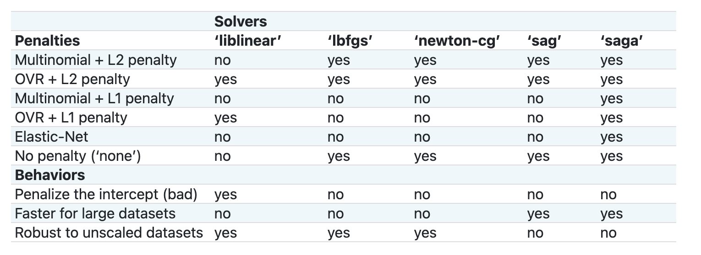

<!--
CO_OP_TRANSLATOR_METADATA:
{
  "original_hash": "9579f42e3ff5114c58379cc9e186a828",
  "translation_date": "2025-08-29T17:49:08+00:00",
  "source_file": "4-Classification/2-Classifiers-1/README.md",
  "language_code": "mr"
}
-->
# खाद्यपदार्थ वर्गीकरण 1

या धड्यात, तुम्ही मागील धड्यातून जतन केलेल्या संतुलित, स्वच्छ डेटासेटचा वापर कराल, जो पूर्णपणे विविध खाद्यपदार्थांबद्दल आहे.

तुम्ही या डेटासेटचा वापर विविध वर्गीकरण पद्धतींसह कराल, ज्यामुळे _घटकांच्या गटावर आधारित राष्ट्रीय खाद्यपदार्थ ओळखता येईल_. हे करत असताना, तुम्हाला वर्गीकरण कार्यांसाठी अल्गोरिदम कसे वापरले जाऊ शकतात याबद्दल अधिक माहिती मिळेल.

## [पूर्व-व्याख्यान क्विझ](https://gray-sand-07a10f403.1.azurestaticapps.net/quiz/21/)
# तयारी

[धडा 1](../1-Introduction/README.md) पूर्ण केल्याचे गृहीत धरून, _cleaned_cuisines.csv_ फाइल `/data` फोल्डरच्या मूळ ठिकाणी या चार धड्यांसाठी उपलब्ध आहे याची खात्री करा.

## व्यायाम - राष्ट्रीय खाद्यपदार्थ ओळखा

1. या धड्याच्या _notebook.ipynb_ फोल्डरमध्ये काम करताना, त्या फाइलसह Pandas लायब्ररी आयात करा:

    ```python
    import pandas as pd
    cuisines_df = pd.read_csv("../data/cleaned_cuisines.csv")
    cuisines_df.head()
    ```

    डेटा असा दिसतो:

|     | Unnamed: 0 | cuisine | almond | angelica | anise | anise_seed | apple | apple_brandy | apricot | armagnac | ... | whiskey | white_bread | white_wine | whole_grain_wheat_flour | wine | wood | yam | yeast | yogurt | zucchini |
| --- | ---------- | ------- | ------ | -------- | ----- | ---------- | ----- | ------------ | ------- | -------- | --- | ------- | ----------- | ---------- | ----------------------- | ---- | ---- | --- | ----- | ------ | -------- |
| 0   | 0          | indian  | 0      | 0        | 0     | 0          | 0     | 0            | 0       | 0        | ... | 0       | 0           | 0          | 0                       | 0    | 0    | 0   | 0     | 0      | 0        |
| 1   | 1          | indian  | 1      | 0        | 0     | 0          | 0     | 0            | 0       | 0        | ... | 0       | 0           | 0          | 0                       | 0    | 0    | 0   | 0     | 0      | 0        |
| 2   | 2          | indian  | 0      | 0        | 0     | 0          | 0     | 0            | 0       | 0        | ... | 0       | 0           | 0          | 0                       | 0    | 0    | 0   | 0     | 0      | 0        |
| 3   | 3          | indian  | 0      | 0        | 0     | 0          | 0     | 0            | 0       | 0        | ... | 0       | 0           | 0          | 0                       | 0    | 0    | 0   | 0     | 0      | 0        |
| 4   | 4          | indian  | 0      | 0        | 0     | 0          | 0     | 0            | 0       | 0        | ... | 0       | 0           | 0          | 0                       | 0    | 0    | 0   | 0     | 1      | 0        |
  

1. आता आणखी काही लायब्ररी आयात करा:

    ```python
    from sklearn.linear_model import LogisticRegression
    from sklearn.model_selection import train_test_split, cross_val_score
    from sklearn.metrics import accuracy_score,precision_score,confusion_matrix,classification_report, precision_recall_curve
    from sklearn.svm import SVC
    import numpy as np
    ```

1. X आणि y निर्देशांक दोन डेटाफ्रेम्समध्ये विभागा. `cuisine` हे लेबल्स डेटाफ्रेम असू शकते:

    ```python
    cuisines_label_df = cuisines_df['cuisine']
    cuisines_label_df.head()
    ```

    हे असे दिसेल:

    ```output
    0    indian
    1    indian
    2    indian
    3    indian
    4    indian
    Name: cuisine, dtype: object
    ```

1. `Unnamed: 0` आणि `cuisine` या स्तंभांना `drop()` वापरून काढून टाका. उर्वरित डेटा प्रशिक्षणासाठी जतन करा:

    ```python
    cuisines_feature_df = cuisines_df.drop(['Unnamed: 0', 'cuisine'], axis=1)
    cuisines_feature_df.head()
    ```

    तुमचे वैशिष्ट्य असे दिसेल:

|      | almond | angelica | anise | anise_seed | apple | apple_brandy | apricot | armagnac | artemisia | artichoke |  ... | whiskey | white_bread | white_wine | whole_grain_wheat_flour | wine | wood |  yam | yeast | yogurt | zucchini |
| ---: | -----: | -------: | ----: | ---------: | ----: | -----------: | ------: | -------: | --------: | --------: | ---: | ------: | ----------: | ---------: | ----------------------: | ---: | ---: | ---: | ----: | -----: | -------: |
|    0 |      0 |        0 |     0 |          0 |     0 |            0 |       0 |        0 |         0 |         0 |  ... |       0 |           0 |          0 |                       0 |    0 |    0 |    0 |     0 |      0 |        0 | 0 |
|    1 |      1 |        0 |     0 |          0 |     0 |            0 |       0 |        0 |         0 |         0 |  ... |       0 |           0 |          0 |                       0 |    0 |    0 |    0 |     0 |      0 |        0 | 0 |
|    2 |      0 |        0 |     0 |          0 |     0 |            0 |       0 |        0 |         0 |         0 |  ... |       0 |           0 |          0 |                       0 |    0 |    0 |    0 |     0 |      0 |        0 | 0 |
|    3 |      0 |        0 |     0 |          0 |     0 |            0 |       0 |        0 |         0 |         0 |  ... |       0 |           0 |          0 |                       0 |    0 |    0 |    0 |     0 |      0 |        0 | 0 |
|    4 |      0 |        0 |     0 |          0 |     0 |            0 |       0 |        0 |         0 |         0 |  ... |       0 |           0 |          0 |                       0 |    0 |    0 |    0 |     0 |      1 |        0 | 0 |

आता तुमचा मॉडेल प्रशिक्षणासाठी तयार आहे!

## तुमचा वर्गीकरणकर्ता निवडणे

आता तुमचा डेटा स्वच्छ आणि प्रशिक्षणासाठी तयार आहे, तुम्हाला कोणता अल्गोरिदम वापरायचा आहे हे ठरवावे लागेल.

Scikit-learn वर्गीकरणाला Supervised Learning अंतर्गत वर्गीकृत करते, आणि त्या श्रेणीत तुम्हाला वर्गीकरणासाठी अनेक पद्धती सापडतील. [विविधता](https://scikit-learn.org/stable/supervised_learning.html) सुरुवातीला थोडी गोंधळात टाकणारी वाटू शकते. खालील पद्धतींमध्ये वर्गीकरण तंत्रांचा समावेश आहे:

- रेषीय मॉडेल्स
- सपोर्ट व्हेक्टर मशीन
- स्टोकॅस्टिक ग्रेडियंट डिसेंट
- जवळचे शेजारी
- गॉसियन प्रक्रिया
- निर्णय वृक्ष
- समुच्चय पद्धती (वोटिंग क्लासिफायर)
- मल्टिक्लास आणि मल्टीआउटपुट अल्गोरिदम (मल्टिक्लास-मल्टीलेबल वर्गीकरण, मल्टिक्लास-मल्टीआउटपुट वर्गीकरण)

> तुम्ही [डेटा वर्गीकृत करण्यासाठी न्यूरल नेटवर्क्स](https://scikit-learn.org/stable/modules/neural_networks_supervised.html#classification) देखील वापरू शकता, परंतु ते या धड्याच्या कक्षेबाहेर आहे.

### कोणता वर्गीकरणकर्ता निवडायचा?

तर, कोणता वर्गीकरणकर्ता निवडायचा? अनेक पद्धती वापरून चांगला निकाल मिळतो का हे पाहणे हा एक चाचणी करण्याचा मार्ग आहे. Scikit-learn [साइड-बाय-साइड तुलना](https://scikit-learn.org/stable/auto_examples/classification/plot_classifier_comparison.html) ऑफर करते, जिथे KNeighbors, SVC दोन प्रकारे, GaussianProcessClassifier, DecisionTreeClassifier, RandomForestClassifier, MLPClassifier, AdaBoostClassifier, GaussianNB आणि QuadraticDiscriminationAnalysis यांची तुलना केली जाते:


> Scikit-learn च्या दस्तऐवजांवरून तयार केलेले प्लॉट्स

> AutoML हे काम सहज सोडवते, कारण ते क्लाउडमध्ये या तुलना चालवते, ज्यामुळे तुम्हाला तुमच्या डेटासाठी सर्वोत्तम अल्गोरिदम निवडता येतो. [येथे प्रयत्न करा](https://docs.microsoft.com/learn/modules/automate-model-selection-with-azure-automl/?WT.mc_id=academic-77952-leestott)

### एक चांगला दृष्टिकोन

अंधाधुंद अंदाज लावण्यापेक्षा, [ML Cheat Sheet](https://docs.microsoft.com/azure/machine-learning/algorithm-cheat-sheet?WT.mc_id=academic-77952-leestott) डाउनलोड करून त्यातील कल्पना वापरणे चांगले आहे. येथे, आम्हाला कळते की आमच्या मल्टिक्लास समस्येसाठी काही पर्याय आहेत:


> मायक्रोसॉफ्टच्या अल्गोरिदम चीटशीटचा एक भाग, मल्टिक्लास वर्गीकरण पर्याय तपशीलवार

✅ ही चीटशीट डाउनलोड करा, प्रिंट करा, आणि भिंतीवर लावा!

### विचार

आमच्याकडे असलेल्या मर्यादांनुसार विविध दृष्टिकोनांचा विचार करूया:

- **न्यूरल नेटवर्क्स खूप जड आहेत**. आमचा स्वच्छ, परंतु मर्यादित डेटासेट आणि स्थानिक नोटबुक्सद्वारे प्रशिक्षण चालवण्याचा विचार करता, न्यूरल नेटवर्क्स या कार्यासाठी खूप जड आहेत.
- **दोन-वर्ग वर्गीकरणकर्ता नाही**. आम्ही दोन-वर्ग वर्गीकरणकर्ता वापरत नाही, त्यामुळे one-vs-all वगळले जाते.
- **निर्णय वृक्ष किंवा लॉजिस्टिक रिग्रेशन उपयुक्त ठरू शकते**. निर्णय वृक्ष किंवा मल्टिक्लास डेटासाठी लॉजिस्टिक रिग्रेशन उपयुक्त ठरू शकते.
- **मल्टिक्लास बूस्टेड निर्णय वृक्ष वेगळ्या समस्येचे निराकरण करतात**. मल्टिक्लास बूस्टेड निर्णय वृक्ष मुख्यतः नॉनपॅरामेट्रिक कार्यांसाठी उपयुक्त आहेत, जसे की रँकिंग तयार करणे, त्यामुळे ते आमच्यासाठी उपयुक्त नाहीत.

### Scikit-learn चा वापर

आम्ही आमच्या डेटाचा अभ्यास करण्यासाठी Scikit-learn वापरणार आहोत. तथापि, Scikit-learn मध्ये लॉजिस्टिक रिग्रेशन वापरण्याचे अनेक मार्ग आहेत. [पास करण्यासाठीचे पॅरामीटर्स](https://scikit-learn.org/stable/modules/generated/sklearn.linear_model.LogisticRegression.html?highlight=logistic%20regressio#sklearn.linear_model.LogisticRegression) पाहा.

मूलत: दोन महत्त्वाचे पॅरामीटर्स आहेत - `multi_class` आणि `solver` - जे आम्हाला निर्दिष्ट करावे लागतील, जेव्हा आम्ही Scikit-learn ला लॉजिस्टिक रिग्रेशन करण्यास सांगतो. `multi_class` मूल्य विशिष्ट वर्तन लागू करते. `solver` चे मूल्य कोणता अल्गोरिदम वापरायचा ते ठरवते. सर्व सॉल्व्हर सर्व `multi_class` मूल्यांसह जोडले जाऊ शकत नाहीत.

दस्तऐवजांनुसार, मल्टिक्लास प्रकरणात, प्रशिक्षण अल्गोरिदम:

- **one-vs-rest (OvR) योजना वापरते**, जर `multi_class` पर्याय `ovr` वर सेट असेल
- **क्रॉस-एंट्रॉपी लॉस वापरते**, जर `multi_class` पर्याय `multinomial` वर सेट असेल. (सध्या `multinomial` पर्याय फक्त ‘lbfgs’, ‘sag’, ‘saga’ आणि ‘newton-cg’ सॉल्व्हरद्वारे समर्थित आहे.)

> 🎓 येथे 'scheme' म्हणजे 'ovr' (one-vs-rest) किंवा 'multinomial' असू शकते. लॉजिस्टिक रिग्रेशन मुख्यतः बायनरी वर्गीकरणासाठी डिझाइन केलेले असल्याने, या योजना त्याला मल्टिक्लास वर्गीकरण कार्ये अधिक चांगल्या प्रकारे हाताळण्यास अनुमती देतात. [स्रोत](https://machinelearningmastery.com/one-vs-rest-and-one-vs-one-for-multi-class-classification/)

> 🎓 'solver' म्हणजे "ऑप्टिमायझेशन समस्येसाठी वापरायचा अल्गोरिदम". [स्रोत](https://scikit-learn.org/stable/modules/generated/sklearn.linear_model.LogisticRegression.html?highlight=logistic%20regressio#sklearn.linear_model.LogisticRegression).

Scikit-learn या टेबलद्वारे स्पष्ट करते की सॉल्व्हर विविध प्रकारच्या डेटास्ट्रक्चर्सद्वारे सादर केलेल्या आव्हानांना कसे हाताळतात:



## व्यायाम - डेटा विभाजित करा

तुम्ही नुकतेच मागील धड्यात लॉजिस्टिक रिग्रेशनबद्दल शिकलात, त्यामुळे तुमच्या पहिल्या प्रशिक्षण चाचणीसाठी लॉजिस्टिक रिग्रेशनवर लक्ष केंद्रित करू शकता.
`train_test_split()` कॉल करून तुमचा डेटा प्रशिक्षण आणि चाचणी गटांमध्ये विभाजित करा:

```python
X_train, X_test, y_train, y_test = train_test_split(cuisines_feature_df, cuisines_label_df, test_size=0.3)
```

## व्यायाम - लॉजिस्टिक रिग्रेशन लागू करा

तुम्ही मल्टिक्लास प्रकरण वापरत असल्याने, तुम्हाला कोणती _scheme_ वापरायची आणि कोणता _solver_ सेट करायचा हे निवडावे लागेल. मल्टिक्लास सेटिंगसह आणि **liblinear** सॉल्व्हरसह LogisticRegression वापरा.

1. `multi_class` `ovr` वर सेट करा आणि सॉल्व्हर `liblinear` वर सेट करून लॉजिस्टिक रिग्रेशन तयार करा:

    ```python
    lr = LogisticRegression(multi_class='ovr',solver='liblinear')
    model = lr.fit(X_train, np.ravel(y_train))
    
    accuracy = model.score(X_test, y_test)
    print ("Accuracy is {}".format(accuracy))
    ```

    ✅ `lbfgs` सारखा वेगळा सॉल्व्हर वापरून पहा, जो अनेकदा डीफॉल्ट म्हणून सेट केला जातो
> लक्षात ठेवा, तुमच्या डेटाला सपाट करण्याची आवश्यकता असल्यास Pandas [`ravel`](https://pandas.pydata.org/pandas-docs/stable/reference/api/pandas.Series.ravel.html) फंक्शन वापरा.
अचूकता **80%** पेक्षा जास्त चांगली आहे!

1. तुम्ही एका डेटाच्या ओळीसाठी (#50) हा मॉडेल कसा कार्य करतो ते पाहू शकता:

    ```python
    print(f'ingredients: {X_test.iloc[50][X_test.iloc[50]!=0].keys()}')
    print(f'cuisine: {y_test.iloc[50]}')
    ```

    परिणाम प्रिंट होतो:

   ```output
   ingredients: Index(['cilantro', 'onion', 'pea', 'potato', 'tomato', 'vegetable_oil'], dtype='object')
   cuisine: indian
   ```

   ✅ वेगळी ओळ क्रमांक वापरून पहा आणि परिणाम तपासा

1. अधिक सखोल जाणून घेण्यासाठी, तुम्ही या अंदाजाची अचूकता तपासू शकता:

    ```python
    test= X_test.iloc[50].values.reshape(-1, 1).T
    proba = model.predict_proba(test)
    classes = model.classes_
    resultdf = pd.DataFrame(data=proba, columns=classes)
    
    topPrediction = resultdf.T.sort_values(by=[0], ascending = [False])
    topPrediction.head()
    ```

    परिणाम प्रिंट होतो - भारतीय खाद्यपदार्थ हा त्याचा सर्वोत्तम अंदाज आहे, चांगल्या संभाव्यतेसह:

    |          |        0 |
    | -------: | -------: |
    |   indian | 0.715851 |
    |  chinese | 0.229475 |
    | japanese | 0.029763 |
    |   korean | 0.017277 |
    |     thai | 0.007634 |

    ✅ तुम्ही स्पष्ट करू शकता का की मॉडेलला हे भारतीय खाद्यपदार्थ असल्याचा चांगला आत्मविश्वास का आहे?

1. वर्गीकरण अहवाल प्रिंट करून अधिक तपशील मिळवा, जसे तुम्ही रिग्रेशन धड्यांमध्ये केले होते:

    ```python
    y_pred = model.predict(X_test)
    print(classification_report(y_test,y_pred))
    ```

    |              | precision | recall | f1-score | support |
    | ------------ | --------- | ------ | -------- | ------- |
    | chinese      | 0.73      | 0.71   | 0.72     | 229     |
    | indian       | 0.91      | 0.93   | 0.92     | 254     |
    | japanese     | 0.70      | 0.75   | 0.72     | 220     |
    | korean       | 0.86      | 0.76   | 0.81     | 242     |
    | thai         | 0.79      | 0.85   | 0.82     | 254     |
    | accuracy     | 0.80      | 1199   |          |         |
    | macro avg    | 0.80      | 0.80   | 0.80     | 1199    |
    | weighted avg | 0.80      | 0.80   | 0.80     | 1199    |

## 🚀चॅलेंज

या धड्यात, तुम्ही तुमच्या स्वच्छ केलेल्या डेटाचा वापर करून एक मशीन लर्निंग मॉडेल तयार केले, जे घटकांच्या मालिकेवर आधारित राष्ट्रीय खाद्यपदार्थाचा अंदाज लावू शकते. Scikit-learn विविध प्रकारे डेटा वर्गीकृत करण्यासाठी कोणते पर्याय देते ते वाचा. 'solver' या संकल्पनेचा अधिक सखोल अभ्यास करा, जेणेकरून पडद्यामागे काय चालते ते समजू शकाल.

## [व्याख्यानानंतरचा प्रश्नमंजूषा](https://gray-sand-07a10f403.1.azurestaticapps.net/quiz/22/)

## पुनरावलोकन आणि स्व-अभ्यास

लॉजिस्टिक रिग्रेशनमागील गणिताचा अधिक सखोल अभ्यास [या धड्यात](https://people.eecs.berkeley.edu/~russell/classes/cs194/f11/lectures/CS194%20Fall%202011%20Lecture%2006.pdf) करा.  
## असाइनमेंट 

[solvers चा अभ्यास करा](assignment.md)

---

**अस्वीकरण**:  
हा दस्तऐवज AI भाषांतर सेवा [Co-op Translator](https://github.com/Azure/co-op-translator) वापरून भाषांतरित करण्यात आला आहे. आम्ही अचूकतेसाठी प्रयत्नशील असलो तरी, कृपया लक्षात ठेवा की स्वयंचलित भाषांतरांमध्ये त्रुटी किंवा अचूकतेचा अभाव असू शकतो. मूळ भाषेतील दस्तऐवज हा अधिकृत स्रोत मानला जावा. महत्त्वाच्या माहितीसाठी व्यावसायिक मानवी भाषांतराची शिफारस केली जाते. या भाषांतराचा वापर करून उद्भवलेल्या कोणत्याही गैरसमज किंवा चुकीच्या अर्थासाठी आम्ही जबाबदार राहणार नाही.