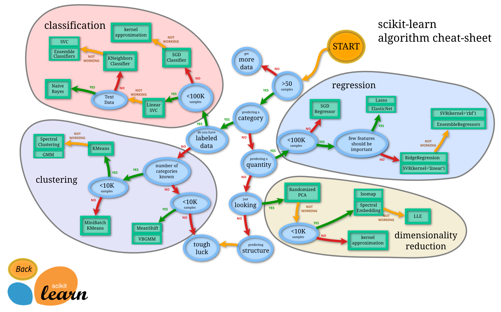

<!--
CO_OP_TRANSLATOR_METADATA:
{
  "original_hash": "808a71076f76ae8f5458862a8edd9215",
  "translation_date": "2025-08-29T17:54:54+00:00",
  "source_file": "4-Classification/3-Classifiers-2/README.md",
  "language_code": "mr"
}
-->
# पाककृती वर्गीकरण 2

या दुसऱ्या वर्गीकरणाच्या धड्यात, तुम्ही संख्यात्मक डेटा वर्गीकृत करण्याचे अधिक मार्ग शोधाल. तसेच, एका वर्गीकर्त्याच्या निवडीचे परिणाम दुसऱ्याच्या तुलनेत काय असतात हे शिकाल.

## [पूर्व-व्याख्यान प्रश्नमंजूषा](https://gray-sand-07a10f403.1.azurestaticapps.net/quiz/23/)

### पूर्वतयारी

आम्ही गृहीत धरतो की तुम्ही मागील धडे पूर्ण केले आहेत आणि तुमच्या `data` फोल्डरमध्ये _cleaned_cuisines.csv_ नावाचा स्वच्छ डेटा संच आहे, जो या 4-धड्यांच्या फोल्डरच्या मूळ भागात आहे.

### तयारी

आम्ही तुमच्या _notebook.ipynb_ फाइलमध्ये स्वच्छ डेटा संच लोड केला आहे आणि तो X आणि y डेटा फ्रेम्समध्ये विभागला आहे, जे मॉडेल तयार करण्याच्या प्रक्रियेसाठी तयार आहेत.

## वर्गीकरणाचा नकाशा

यापूर्वी, तुम्ही मायक्रोसॉफ्टच्या चीट शीटचा वापर करून डेटा वर्गीकृत करण्याचे विविध पर्याय शिकले. Scikit-learn एक समान, पण अधिक तपशीलवार चीट शीट ऑफर करते जी तुमच्या वर्गीकर्त्यांना (वर्गीकर्त्यांसाठी दुसरा शब्द) अधिक चांगल्या प्रकारे निवडण्यास मदत करू शकते:


> टिप: [हा नकाशा ऑनलाइन पहा](https://scikit-learn.org/stable/tutorial/machine_learning_map/) आणि मार्गावर क्लिक करून दस्तऐवज वाचा.

### योजना

तुमच्या डेटाचा स्पष्ट अंदाज घेतल्यानंतर हा नकाशा खूप उपयुक्त ठरतो, कारण तुम्ही त्याच्या मार्गावरून निर्णय घेऊ शकता:

- आमच्याकडे >50 नमुने आहेत
- आम्हाला श्रेणीचा अंदाज लावायचा आहे
- आमच्याकडे लेबल केलेला डेटा आहे
- आमच्याकडे 100K पेक्षा कमी नमुने आहेत
- ✨ आम्ही Linear SVC निवडू शकतो
- जर ते काम केले नाही, कारण आमच्याकडे संख्यात्मक डेटा आहे
    - आम्ही ✨ KNeighbors Classifier वापरून पाहू शकतो 
      - जर ते काम केले नाही, तर ✨ SVC आणि ✨ Ensemble Classifiers वापरून पाहा

हा मार्ग अनुसरण्यासाठी खूप उपयुक्त आहे.

## व्यायाम - डेटा विभाजित करा

या मार्गाचा अनुसरण करताना, आपल्याला वापरण्यासाठी काही लायब्ररी आयात करणे आवश्यक आहे.

1. आवश्यक लायब्ररी आयात करा:

    ```python
    from sklearn.neighbors import KNeighborsClassifier
    from sklearn.linear_model import LogisticRegression
    from sklearn.svm import SVC
    from sklearn.ensemble import RandomForestClassifier, AdaBoostClassifier
    from sklearn.model_selection import train_test_split, cross_val_score
    from sklearn.metrics import accuracy_score,precision_score,confusion_matrix,classification_report, precision_recall_curve
    import numpy as np
    ```

1. तुमचा प्रशिक्षण आणि चाचणी डेटा विभाजित करा:

    ```python
    X_train, X_test, y_train, y_test = train_test_split(cuisines_feature_df, cuisines_label_df, test_size=0.3)
    ```

## Linear SVC वर्गीकर्ता

Support-Vector clustering (SVC) ही Support-Vector machines च्या ML तंत्रज्ञानाच्या कुटुंबातील एक शाखा आहे (खाली याबद्दल अधिक जाणून घ्या). या पद्धतीत, तुम्ही लेबल्स कसे क्लस्टर करायचे ते ठरवण्यासाठी 'kernel' निवडू शकता. 'C' पॅरामीटर 'regularization' संदर्भित करते जे पॅरामीटर्सच्या प्रभावाचे नियमन करते. kernel [काही](https://scikit-learn.org/stable/modules/generated/sklearn.svm.SVC.html#sklearn.svm.SVC) पैकी एक असू शकतो; येथे आम्ही 'linear' सेट करतो जेणेकरून आम्ही linear SVC वापरू शकू. Probability डीफॉल्टनुसार 'false' असते; येथे आम्ही probability estimates गोळा करण्यासाठी 'true' सेट करतो. आम्ही random state '0' वर सेट करतो जेणेकरून डेटा shuffle होईल आणि probabilities मिळतील.

### व्यायाम - Linear SVC लागू करा

वर्गीकर्त्यांची एक array तयार करून सुरुवात करा. आम्ही चाचणी करत असताना तुम्ही हळूहळू या array मध्ये भर घालाल.

1. Linear SVC सह सुरुवात करा:

    ```python
    C = 10
    # Create different classifiers.
    classifiers = {
        'Linear SVC': SVC(kernel='linear', C=C, probability=True,random_state=0)
    }
    ```

2. Linear SVC वापरून तुमचे मॉडेल प्रशिक्षित करा आणि रिपोर्ट प्रिंट करा:

    ```python
    n_classifiers = len(classifiers)
    
    for index, (name, classifier) in enumerate(classifiers.items()):
        classifier.fit(X_train, np.ravel(y_train))
    
        y_pred = classifier.predict(X_test)
        accuracy = accuracy_score(y_test, y_pred)
        print("Accuracy (train) for %s: %0.1f%% " % (name, accuracy * 100))
        print(classification_report(y_test,y_pred))
    ```

    निकाल खूप चांगला आहे:

    ```output
    Accuracy (train) for Linear SVC: 78.6% 
                  precision    recall  f1-score   support
    
         chinese       0.71      0.67      0.69       242
          indian       0.88      0.86      0.87       234
        japanese       0.79      0.74      0.76       254
          korean       0.85      0.81      0.83       242
            thai       0.71      0.86      0.78       227
    
        accuracy                           0.79      1199
       macro avg       0.79      0.79      0.79      1199
    weighted avg       0.79      0.79      0.79      1199
    ```

## K-Neighbors वर्गीकर्ता

K-Neighbors हा ML पद्धतींच्या "neighbors" कुटुंबाचा भाग आहे, जो supervised आणि unsupervised learning साठी वापरला जाऊ शकतो. या पद्धतीत, पूर्वनिर्धारित बिंदू तयार केले जातात आणि डेटा या बिंदूंभोवती गोळा केला जातो जेणेकरून डेटासाठी सामान्यीकृत लेबल्सचा अंदाज लावता येईल.

### व्यायाम - K-Neighbors वर्गीकर्ता लागू करा

मागील वर्गीकर्ता चांगला होता आणि डेटासह चांगले काम केले, परंतु कदाचित आम्ही अधिक चांगली अचूकता मिळवू शकतो. K-Neighbors वर्गीकर्ता वापरून पहा.

1. तुमच्या वर्गीकर्ता array मध्ये एक ओळ जोडा (Linear SVC आयटमनंतर अल्पविराम जोडा):

    ```python
    'KNN classifier': KNeighborsClassifier(C),
    ```

    निकाल थोडा वाईट आहे:

    ```output
    Accuracy (train) for KNN classifier: 73.8% 
                  precision    recall  f1-score   support
    
         chinese       0.64      0.67      0.66       242
          indian       0.86      0.78      0.82       234
        japanese       0.66      0.83      0.74       254
          korean       0.94      0.58      0.72       242
            thai       0.71      0.82      0.76       227
    
        accuracy                           0.74      1199
       macro avg       0.76      0.74      0.74      1199
    weighted avg       0.76      0.74      0.74      1199
    ```

    ✅ [K-Neighbors](https://scikit-learn.org/stable/modules/neighbors.html#neighbors) बद्दल जाणून घ्या

## Support Vector Classifier

Support-Vector classifiers हे ML पद्धतींच्या [Support-Vector Machine](https://wikipedia.org/wiki/Support-vector_machine) कुटुंबाचा भाग आहेत जे वर्गीकरण आणि regression कार्यांसाठी वापरले जातात. SVMs "प्रशिक्षण उदाहरणांना जागेतील बिंदूंमध्ये मॅप करतात" जेणेकरून दोन श्रेणींमधील अंतर जास्तीत जास्त होईल. त्यानंतरचा डेटा या जागेत मॅप केला जातो जेणेकरून त्यांची श्रेणी अंदाज करता येईल.

### व्यायाम - Support Vector Classifier लागू करा

Support Vector Classifier वापरून थोडी चांगली अचूकता मिळवण्याचा प्रयत्न करूया.

1. K-Neighbors आयटमनंतर अल्पविराम जोडा आणि ही ओळ जोडा:

    ```python
    'SVC': SVC(),
    ```

    निकाल खूप चांगला आहे!

    ```output
    Accuracy (train) for SVC: 83.2% 
                  precision    recall  f1-score   support
    
         chinese       0.79      0.74      0.76       242
          indian       0.88      0.90      0.89       234
        japanese       0.87      0.81      0.84       254
          korean       0.91      0.82      0.86       242
            thai       0.74      0.90      0.81       227
    
        accuracy                           0.83      1199
       macro avg       0.84      0.83      0.83      1199
    weighted avg       0.84      0.83      0.83      1199
    ```

    ✅ [Support-Vectors](https://scikit-learn.org/stable/modules/svm.html#svm) बद्दल जाणून घ्या

## Ensemble Classifiers

मागील चाचणी खूप चांगली होती, तरीही शेवटपर्यंतचा मार्ग अनुसरण करूया. 'Ensemble Classifiers' वापरून पाहूया, विशेषतः Random Forest आणि AdaBoost:

```python
  'RFST': RandomForestClassifier(n_estimators=100),
  'ADA': AdaBoostClassifier(n_estimators=100)
```

निकाल खूप चांगला आहे, विशेषतः Random Forest साठी:

```output
Accuracy (train) for RFST: 84.5% 
              precision    recall  f1-score   support

     chinese       0.80      0.77      0.78       242
      indian       0.89      0.92      0.90       234
    japanese       0.86      0.84      0.85       254
      korean       0.88      0.83      0.85       242
        thai       0.80      0.87      0.83       227

    accuracy                           0.84      1199
   macro avg       0.85      0.85      0.84      1199
weighted avg       0.85      0.84      0.84      1199

Accuracy (train) for ADA: 72.4% 
              precision    recall  f1-score   support

     chinese       0.64      0.49      0.56       242
      indian       0.91      0.83      0.87       234
    japanese       0.68      0.69      0.69       254
      korean       0.73      0.79      0.76       242
        thai       0.67      0.83      0.74       227

    accuracy                           0.72      1199
   macro avg       0.73      0.73      0.72      1199
weighted avg       0.73      0.72      0.72      1199
```

✅ [Ensemble Classifiers](https://scikit-learn.org/stable/modules/ensemble.html) बद्दल जाणून घ्या

Machine Learning ची ही पद्धत "काही बेस estimators च्या अंदाजांना एकत्र करते" जेणेकरून मॉडेलची गुणवत्ता सुधारता येईल. आमच्या उदाहरणात, आम्ही Random Trees आणि AdaBoost वापरले.

- [Random Forest](https://scikit-learn.org/stable/modules/ensemble.html#forest), एक averaging पद्धत, 'decision trees' चा 'forest' तयार करते ज्यामध्ये randomness असते जे overfitting टाळते. n_estimators पॅरामीटर झाडांची संख्या सेट करते.

- [AdaBoost](https://scikit-learn.org/stable/modules/generated/sklearn.ensemble.AdaBoostClassifier.html) एका डेटासेटवर वर्गीकर्ता फिट करते आणि नंतर त्या वर्गीकर्त्याच्या प्रती त्या डेटासेटवर फिट करते. हे चुकीच्या प्रकारे वर्गीकृत आयटम्सच्या वजनांवर लक्ष केंद्रित करते आणि पुढील वर्गीकर्त्यासाठी फिट समायोजित करते जेणेकरून दुरुस्ती करता येईल.

---

## 🚀चॅलेंज

या तंत्रांमध्ये अनेक पॅरामीटर्स असतात जे तुम्ही बदलू शकता. प्रत्येकाच्या डीफॉल्ट पॅरामीटर्सचा अभ्यास करा आणि या पॅरामीटर्स बदलल्याने मॉडेलच्या गुणवत्तेसाठी काय परिणाम होईल याचा विचार करा.

## [व्याख्यानानंतरची प्रश्नमंजूषा](https://gray-sand-07a10f403.1.azurestaticapps.net/quiz/24/)

## पुनरावलोकन आणि स्व-अभ्यास

या धड्यांमध्ये बरीच तांत्रिक शब्दावली आहे, त्यामुळे [या यादी](https://docs.microsoft.com/dotnet/machine-learning/resources/glossary?WT.mc_id=academic-77952-leestott) चा आढावा घ्या ज्यामध्ये उपयुक्त संज्ञा आहेत!

## असाइनमेंट 

[पॅरामीटर खेळ](assignment.md)

---

**अस्वीकरण**:  
हा दस्तऐवज AI भाषांतर सेवा [Co-op Translator](https://github.com/Azure/co-op-translator) चा वापर करून भाषांतरित करण्यात आला आहे. आम्ही अचूकतेसाठी प्रयत्नशील असलो तरी कृपया लक्षात ठेवा की स्वयंचलित भाषांतरे त्रुटी किंवा अचूकतेच्या अभावाने युक्त असू शकतात. मूळ भाषेतील दस्तऐवज हा अधिकृत स्रोत मानला जावा. महत्त्वाच्या माहितीसाठी व्यावसायिक मानवी भाषांतराची शिफारस केली जाते. या भाषांतराचा वापर करून उद्भवलेल्या कोणत्याही गैरसमज किंवा चुकीच्या अर्थासाठी आम्ही जबाबदार राहणार नाही.