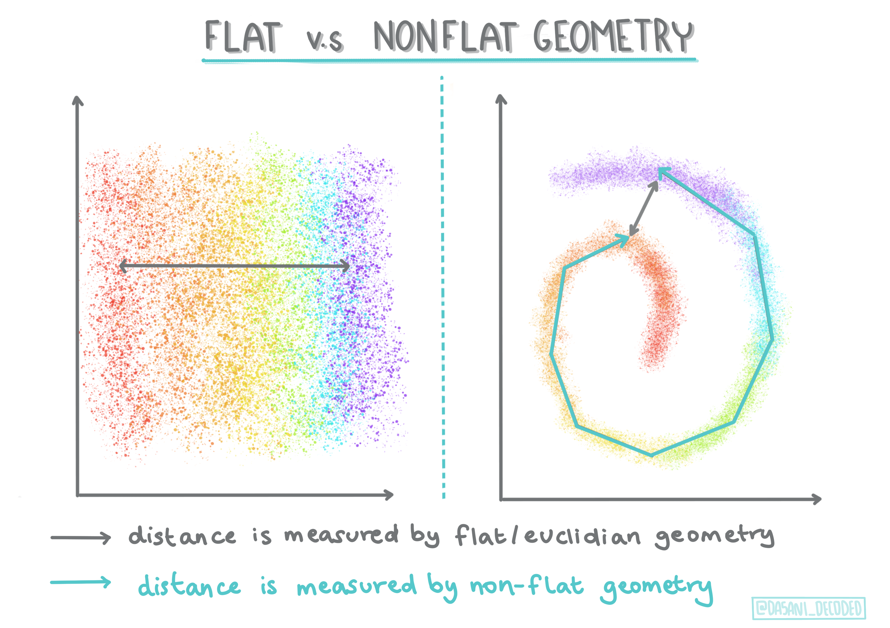
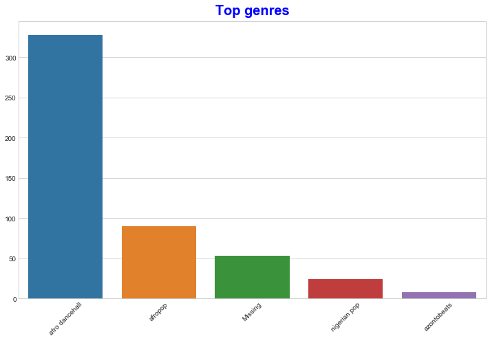
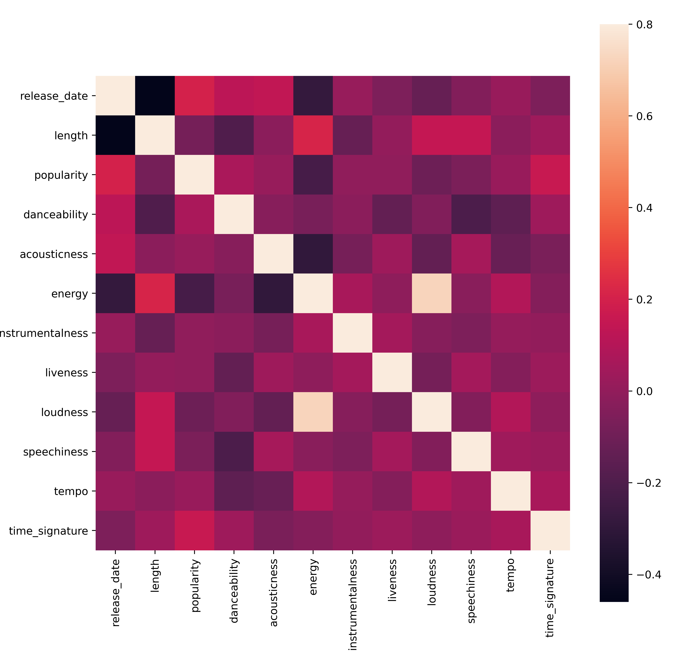
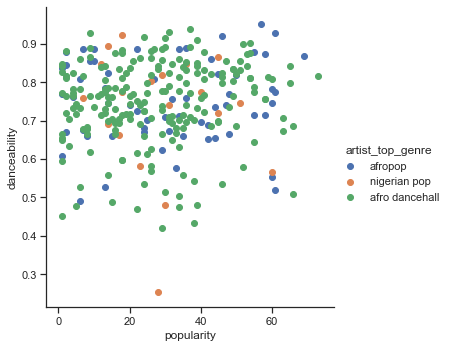

<!--
CO_OP_TRANSLATOR_METADATA:
{
  "original_hash": "0ab69b161efd7a41d325ee28b29415d7",
  "translation_date": "2025-08-29T17:08:46+00:00",
  "source_file": "5-Clustering/1-Visualize/README.md",
  "language_code": "mr"
}
-->
# क्लस्टरिंगची ओळख

क्लस्टरिंग ही [अनसुपरवाइज्ड लर्निंग](https://wikipedia.org/wiki/Unsupervised_learning) प्रकारातील एक पद्धत आहे ज्यामध्ये डेटासेट लेबल नसलेला किंवा त्याचे इनपुट्स पूर्वनिर्धारित आउटपुट्सशी जुळलेले नसतात असे गृहीत धरले जाते. ही पद्धत विविध अल्गोरिदम वापरून लेबल नसलेल्या डेटामधून गट तयार करते आणि डेटामधील नमुन्यांनुसार गट तयार करते.

[](https://youtu.be/ty2advRiWJM "PSquare द्वारे No One Like You")

> 🎥 वरील प्रतिमेवर क्लिक करा व्हिडिओसाठी. क्लस्टरिंगसह मशीन लर्निंग शिकत असताना, काही नायजेरियन डान्स हॉल ट्रॅक्सचा आनंद घ्या - PSquare चा 2014 मधील हा गाणं खूप लोकप्रिय आहे.

## [पूर्व-व्याख्यान क्विझ](https://gray-sand-07a10f403.1.azurestaticapps.net/quiz/27/)

### परिचय

[क्लस्टरिंग](https://link.springer.com/referenceworkentry/10.1007%2F978-0-387-30164-8_124) डेटा एक्सप्लोरेशनसाठी खूप उपयुक्त आहे. चला पाहूया की नायजेरियन प्रेक्षक संगीत कसे वापरतात यामध्ये ट्रेंड्स आणि नमुने शोधण्यात ते मदत करू शकते का.

✅ क्लस्टरिंगच्या उपयोगांबद्दल विचार करण्यासाठी एक मिनिट घ्या. वास्तविक जीवनात, क्लस्टरिंग तेव्हा होते जेव्हा तुमच्याकडे कपड्यांचा ढीग असतो आणि तुम्हाला तुमच्या कुटुंबातील सदस्यांचे कपडे वेगळे करायचे असतात 🧦👕👖🩲. डेटा सायन्समध्ये, क्लस्टरिंग वापरकर्त्याच्या पसंतींचा विश्लेषण करताना किंवा कोणत्याही लेबल नसलेल्या डेटासेटच्या वैशिष्ट्ये ठरवताना होते. एका प्रकारे, क्लस्टरिंग गोंधळाचा अर्थ लावण्यास मदत करते, जसे की मोज्यांच्या ड्रॉवरसारखे.

[](https://youtu.be/esmzYhuFnds "क्लस्टरिंगची ओळख")

> 🎥 वरील प्रतिमेवर क्लिक करा व्हिडिओसाठी: MIT चे जॉन गुट्टाग क्लस्टरिंगची ओळख करून देतात.

व्यावसायिक सेटिंगमध्ये, क्लस्टरिंगचा उपयोग बाजार विभागणीसाठी, कोणत्या वयोगटाने कोणती उत्पादने खरेदी केली यासारख्या गोष्टी ठरवण्यासाठी केला जाऊ शकतो. आणखी एक उपयोग म्हणजे अनियमितता शोधणे, कदाचित क्रेडिट कार्ड व्यवहारांच्या डेटासेटमधून फसवणूक शोधण्यासाठी. किंवा तुम्ही वैद्यकीय स्कॅनच्या बॅचमधून ट्यूमर ठरवण्यासाठी क्लस्टरिंग वापरू शकता.

✅ बँकिंग, ई-कॉमर्स किंवा व्यवसाय सेटिंगमध्ये तुम्ही 'इन द वाइल्ड' क्लस्टरिंग कसे अनुभवले आहे याचा विचार करा.

> 🎓 मनोरंजकपणे, क्लस्टर विश्लेषणाची सुरुवात 1930 च्या दशकात मानववंशशास्त्र आणि मानसशास्त्राच्या क्षेत्रातून झाली. तुम्ही कल्पना करू शकता की ते कसे वापरले गेले असेल?

याशिवाय, तुम्ही शोध परिणाम गटबद्ध करण्यासाठी वापरू शकता - उदाहरणार्थ, खरेदी लिंक, प्रतिमा किंवा पुनरावलोकने. जेव्हा तुमच्याकडे मोठा डेटासेट असतो ज्याला तुम्ही कमी करायचे असते आणि ज्यावर तुम्हाला अधिक सखोल विश्लेषण करायचे असते तेव्हा क्लस्टरिंग उपयुक्त ठरते, त्यामुळे इतर मॉडेल्स तयार करण्यापूर्वी डेटा शिकण्यासाठी ही पद्धत वापरली जाऊ शकते.

✅ एकदा तुमचा डेटा क्लस्टर्समध्ये आयोजित केला की, तुम्ही त्याला क्लस्टर आयडी असाइन करता, आणि ही पद्धत डेटासेटची गोपनीयता जपण्यासाठी उपयुक्त ठरू शकते; तुम्ही क्लस्टर आयडीद्वारे डेटा पॉइंटचा संदर्भ देऊ शकता, क्लस्टरमधील अधिक उघडपणे ओळखण्यायोग्य डेटा ऐवजी. तुम्ही क्लस्टर आयडीचा संदर्भ देण्याऐवजी क्लस्टरमधील इतर घटकांचा संदर्भ देण्याचे इतर कारणे विचार करू शकता का?

क्लस्टरिंग तंत्रांचा सखोल अभ्यास या [लर्न मॉड्यूल](https://docs.microsoft.com/learn/modules/train-evaluate-cluster-models?WT.mc_id=academic-77952-leestott) मध्ये करा.

## क्लस्टरिंगसह सुरुवात

[Scikit-learn मोठ्या प्रमाणात पद्धती](https://scikit-learn.org/stable/modules/clustering.html) क्लस्टरिंग करण्यासाठी ऑफर करते. तुम्ही कोणती पद्धत निवडता ते तुमच्या उपयोगाच्या प्रकरणावर अवलंबून असेल. दस्तऐवजानुसार, प्रत्येक पद्धतीचे विविध फायदे आहेत. Scikit-learn द्वारे समर्थित पद्धती आणि त्यांच्या योग्य उपयोग प्रकरणांचे एक साधे तक्ते येथे आहे:

| पद्धतीचे नाव                  | उपयोग प्रकरण                                                               |
| :--------------------------- | :--------------------------------------------------------------------- |
| K-Means                      | सामान्य उद्देश, इंडक्टिव                                             |
| Affinity propagation         | अनेक, असमान क्लस्टर्स, इंडक्टिव                                       |
| Mean-shift                   | अनेक, असमान क्लस्टर्स, इंडक्टिव                                       |
| Spectral clustering          | काही, समान क्लस्टर्स, ट्रान्सडक्टिव                                       |
| Ward hierarchical clustering | अनेक, मर्यादित क्लस्टर्स, ट्रान्सडक्टिव                               |
| Agglomerative clustering     | अनेक, मर्यादित, नॉन-युक्लिडियन अंतर, ट्रान्सडक्टिव               |
| DBSCAN                       | नॉन-फ्लॅट भूमिती, असमान क्लस्टर्स, ट्रान्सडक्टिव                       |
| OPTICS                       | नॉन-फ्लॅट भूमिती, असमान क्लस्टर्स, बदलणारी घनता, ट्रान्सडक्टिव |
| Gaussian mixtures            | फ्लॅट भूमिती, इंडक्टिव                                               |
| BIRCH                        | मोठा डेटासेट आउटलायर्ससह, इंडक्टिव                                 |

> 🎓 क्लस्टर्स कसे तयार करतो हे डेटापॉइंट्सना गटांमध्ये कसे गोळा करतो यावर खूप अवलंबून असते. चला काही शब्दसंग्रह समजून घेऊया:
>
> 🎓 ['ट्रान्सडक्टिव' वि. 'इंडक्टिव'](https://wikipedia.org/wiki/Transduction_(machine_learning))
> 
> ट्रान्सडक्टिव इनफरन्स हे विशिष्ट चाचणी प्रकरणांशी जुळणाऱ्या निरीक्षित प्रशिक्षण प्रकरणांमधून प्राप्त होते. इंडक्टिव इनफरन्स हे प्रशिक्षण प्रकरणांमधून प्राप्त होते जे सामान्य नियमांशी जुळते आणि नंतर चाचणी प्रकरणांवर लागू केले जाते.
> 
> उदाहरण: कल्पना करा की तुमच्याकडे फक्त अंशतः लेबल असलेला डेटासेट आहे. काही गोष्टी 'रेकॉर्ड्स', काही 'सीडीज', आणि काही रिक्त आहेत. तुमचे काम रिक्त जागांसाठी लेबल्स प्रदान करणे आहे. जर तुम्ही इंडक्टिव दृष्टिकोन निवडला, तर तुम्ही 'रेकॉर्ड्स' आणि 'सीडीज' शोधण्यासाठी मॉडेल प्रशिक्षण द्याल आणि तुमच्या लेबल नसलेल्या डेटावर ती लेबल्स लागू कराल. ही पद्धत 'कॅसेट्स' असलेल्या गोष्टी वर्गीकृत करण्यात अडचणीत येईल. ट्रान्सडक्टिव दृष्टिकोन, दुसरीकडे, अशा अज्ञात डेटाचा अधिक प्रभावीपणे हाताळतो कारण तो समान वस्तू गटबद्ध करण्यासाठी कार्य करतो आणि नंतर गटाला लेबल लागू करतो. या प्रकरणात, क्लस्टर्स 'गोल संगीत गोष्टी' आणि 'चौरस संगीत गोष्टी' प्रतिबिंबित करू शकतात.
> 
> 🎓 ['नॉन-फ्लॅट' वि. 'फ्लॅट' भूमिती](https://datascience.stackexchange.com/questions/52260/terminology-flat-geometry-in-the-context-of-clustering)
> 
> गणितीय शब्दसंग्रहातून प्राप्त, नॉन-फ्लॅट वि. फ्लॅट भूमिती म्हणजे पॉइंट्समधील अंतर मोजण्याचे उपाय 'फ्लॅट' ([युक्लिडियन](https://wikipedia.org/wiki/Euclidean_geometry)) किंवा 'नॉन-फ्लॅट' (नॉन-युक्लिडियन) भूमितीय पद्धतीने.
>
>'फ्लॅट' या संदर्भात युक्लिडियन भूमितीला संदर्भित करते (ज्याचा काही भाग 'प्लेन' भूमिती म्हणून शिकवला जातो), आणि नॉन-फ्लॅट नॉन-युक्लिडियन भूमितीला संदर्भित करते. मशीन लर्निंगशी भूमितीचा काय संबंध आहे? गणितावर आधारित दोन क्षेत्रे म्हणून, क्लस्टर्समधील पॉइंट्समधील अंतर मोजण्यासाठी एक सामान्य मार्ग असणे आवश्यक आहे, आणि ते 'फ्लॅट' किंवा 'नॉन-फ्लॅट' पद्धतीने केले जाऊ शकते, डेटाच्या स्वरूपावर अवलंबून. [युक्लिडियन अंतर](https://wikipedia.org/wiki/Euclidean_distance) दोन पॉइंट्समधील रेषेच्या लांबीने मोजले जाते. [नॉन-युक्लिडियन अंतर](https://wikipedia.org/wiki/Non-Euclidean_geometry) वक्रावर मोजले जाते. जर तुमचा डेटा, व्हिज्युअलाइज्ड, प्लेनवर अस्तित्वात नसल्यासारखा वाटत असेल, तर तुम्हाला त्याचा हाताळण्यासाठी विशेष अल्गोरिदम वापरण्याची आवश्यकता असू शकते.
>

> माहितीपट [दसानी मदीपल्ली](https://twitter.com/dasani_decoded) द्वारे
> 
> 🎓 ['अंतर'](https://web.stanford.edu/class/cs345a/slides/12-clustering.pdf)
> 
> क्लस्टर्स त्यांच्या अंतर मॅट्रिक्सद्वारे परिभाषित केले जातात, उदा. पॉइंट्समधील अंतर. हे अंतर काही प्रकारे मोजले जाऊ शकते. युक्लिडियन क्लस्टर्स पॉइंट व्हॅल्यूजच्या सरासरीने परिभाषित केले जातात आणि त्यामध्ये 'सेंट्रॉइड' किंवा मध्य पॉइंट असतो. त्यामुळे अंतर त्या सेंट्रॉइडपर्यंतच्या अंतराने मोजले जाते. नॉन-युक्लिडियन अंतर 'क्लस्ट्रॉइड्स' संदर्भित करते, इतर पॉइंट्सच्या जवळचा पॉइंट. क्लस्ट्रॉइड्स विविध प्रकारे परिभाषित केले जाऊ शकतात.
> 
> 🎓 ['मर्यादित'](https://wikipedia.org/wiki/Constrained_clustering)
> 
> [मर्यादित क्लस्टरिंग](https://web.cs.ucdavis.edu/~davidson/Publications/ICDMTutorial.pdf) या अनसुपरवाइज्ड पद्धतीमध्ये 'सेमी-सुपरवाइज्ड' लर्निंग आणते. पॉइंट्समधील संबंध 'कॅनॉट लिंक' किंवा 'मस्ट-लिंक' म्हणून फ्लॅग केले जातात त्यामुळे डेटासेटवर काही नियम लागू केले जातात.
>
>उदाहरण: जर एखाद्या अल्गोरिदमला लेबल नसलेल्या किंवा अर्ध-लेबल असलेल्या डेटाच्या बॅचवर मुक्तपणे सोडले गेले तर ते तयार केलेले क्लस्टर्स खराब गुणवत्तेचे असू शकतात. वरील उदाहरणात, क्लस्टर्स 'गोल संगीत गोष्टी', 'चौरस संगीत गोष्टी', 'त्रिकोणी गोष्टी' आणि 'कुकीज' गटबद्ध करू शकतात. जर काही मर्यादा दिल्या गेल्या, किंवा नियम ("आयटम प्लास्टिकचा बनलेला असावा", "आयटम संगीत तयार करण्यास सक्षम असावा") हे अल्गोरिदमला चांगले निवड करण्यास मदत करू शकते.
> 
> 🎓 'घनता'
> 
> 'गोंधळलेला' डेटा 'घन' मानला जातो. त्याच्या प्रत्येक क्लस्टर्समधील पॉइंट्समधील अंतर, तपासणीवर, अधिक किंवा कमी घन, किंवा 'गर्दी' असू शकते आणि त्यामुळे या डेटाचे योग्य क्लस्टरिंग पद्धतीने विश्लेषण करणे आवश्यक आहे. [हा लेख](https://www.kdnuggets.com/2020/02/understanding-density-based-clustering.html) असमान क्लस्टर घनता असलेल्या गोंधळलेल्या डेटासेटचा शोध घेण्यासाठी K-Means क्लस्टरिंग वि. HDBSCAN अल्गोरिदम वापरण्याचा फरक दाखवतो.

## क्लस्टरिंग अल्गोरिदम

क्लस्टरिंगसाठी 100 हून अधिक अल्गोरिदम आहेत, आणि त्यांचा उपयोग डेटाच्या स्वरूपावर अवलंबून असतो. चला काही प्रमुख अल्गोरिदम्सबद्दल चर्चा करूया:

- **हायरार्किकल क्लस्टरिंग**. जर एखाद्या वस्तूचे वर्गीकरण जवळच्या वस्तूशी त्याच्या जवळीकतेनुसार केले गेले, तर क्लस्टर्स त्यांच्या सदस्यांच्या इतर वस्तूंशी अंतरावर आधारित तयार केले जातात. Scikit-learn चे agglomerative क्लस्टरिंग हायरार्किकल आहे.

   
   > माहितीपट [दसानी मदीपल्ली](https://twitter.com/dasani_decoded) द्वारे

- **सेंट्रॉइड क्लस्टरिंग**. ही लोकप्रिय पद्धत 'k', किंवा तयार करायच्या क्लस्टर्सची संख्या निवडण्याची आवश्यकता असते, त्यानंतर अल्गोरिदम क्लस्टरचा मध्य पॉइंट ठरवतो आणि त्या पॉइंटभोवती डेटा गोळा करतो. [K-means क्लस्टरिंग](https://wikipedia.org/wiki/K-means_clustering) सेंट्रॉइड क्लस्टरिंगचा लोकप्रिय प्रकार आहे. मध्य पॉइंट जवळच्या सरासरीने ठरवला जातो, त्यामुळे नाव. क्लस्टरपासूनचे चौरस अंतर कमी केले जाते.

   
   > माहितीपट [दसानी मदीपल्ली](https://twitter.com/dasani_decoded) द्वारे

- **वितरण-आधारित क्लस्टरिंग**. सांख्यिकी मॉडेलिंगवर आधारित, वितरण-आधारित क्लस्टरिंग क्लस्टरमध्ये डेटा पॉइंट असण्याची शक्यता ठरवण्यावर केंद्रित असते आणि त्यानुसार त्याला असाइन करते. Gaussian मिश्रण पद्धती या प्रकारात येतात.

- **घनता-आधारित क्लस्टरिंग**. डेटा पॉइंट्स त्यांच्या घनतेनुसार, किंवा एकमेकांभोवती गटबद्ध केल्यावर क्लस्टर्समध्ये असाइन केले जातात. गटापासून दूर असलेले डेटा पॉइंट्स आउटलायर्स किंवा गोंधळ मानले जातात. DBSCAN, Mean-shift आणि OPTICS या प्रकारात येतात.

- **ग्रिड-आधारित क्लस्टरिंग**. बहु-आयामी डेटासेटसाठी, एक ग्रिड तयार केला जातो आणि डेटा ग्रिडच्या सेल्समध्ये विभागला जातो, त्यामुळे क्लस्टर्स तयार होतात.

## व्यायाम - तुमचा डेटा क्लस्टर करा

क्लस्टरिंग ही पद्धत योग्य व्हिज्युअलायझेशनने खूप मदत होते, त्यामुळे चला आपल्या संगीत डेटाचे व्हिज्युअलायझेशन करून सुरुवात करूया. हा व्यायाम आपल्याला ठरवण्यास मदत करेल की या डेटाच्या स्वरूपासाठी क्लस्टरिंगच्या पद्धतींपैकी कोणती सर्वात प्रभावीपणे वापरावी.

1. या फोल्डरमधील [_notebook.ipynb_](https://github.com/microsoft/ML-For-Beginners/blob/main/5-Clustering/1-Visualize/notebook.ipynb) फाइल उघडा.

1. चांगल्या डेटा व्हिज्युअलायझेशनसाठी `Seaborn` पॅकेज आयात करा.

    ```python
    !pip install seaborn
    ```

1. [_nigerian-songs.csv_](https://github.com/microsoft/ML-For-Beginners/blob/main/5-Clustering/data/nigerian-songs.csv) मधून गाण्यांचा डेटा जोडा. गाण्यांबद्दल काही डेटासह एक डेटा फ्रेम लोड करा. लायब्ररी आयात करून आणि डेटा डंप करून हा डेटा एक्सप्लोर करण्यासाठी तयार व्हा:

    ```python
    import matplotlib.pyplot as plt
    import pandas as pd
    
    df = pd.read_csv("../data/nigerian-songs.csv")
    df.head()
    ```

    डेटाच्या पहिल्या काही ओळी तपासा:

    |     | नाव                     | अल्बम                        | कलाकार              | कलाकाराचा टॉप शैली | रिलीज तारीख | लांबी | लोकप्रियता | नृत्यक्षमता | ध्वनिकी | ऊर्जा | वाद्यत्व | जिवंतपणा | आवाज | भाषणपणा | टेम्पो   | वेळ सिग्नेचर |
    | --- | ------------------------ | ----------------
| 2   | LITT!                    | LITT!                        | AYLØ                | इंडी r&b        | 2018         | 207758 | 40         | 0.836        | 0.272        | 0.564  | 0.000537         | 0.11     | -7.127   | 0.0424      | 130.005 | 4              |
| 3   | Confident / Feeling Cool | Enjoy Your Life              | Lady Donli          | नायजेरियन पॉप   | 2019         | 175135 | 14         | 0.894        | 0.798        | 0.611  | 0.000187         | 0.0964   | -4.961   | 0.113       | 111.087 | 4              |
| 4   | wanted you               | rare.                        | Odunsi (The Engine) | अफ्रोपॉप         | 2018         | 152049 | 25         | 0.702        | 0.116        | 0.833  | 0.91             | 0.348    | -6.044   | 0.0447      | 105.115 | 4              |

1. `info()` कॉल करून डेटाफ्रेमबद्दल काही माहिती मिळवा:

    ```python
    df.info()
    ```

   आउटपुट असे दिसते:

    ```output
    <class 'pandas.core.frame.DataFrame'>
    RangeIndex: 530 entries, 0 to 529
    Data columns (total 16 columns):
     #   Column            Non-Null Count  Dtype  
    ---  ------            --------------  -----  
     0   name              530 non-null    object 
     1   album             530 non-null    object 
     2   artist            530 non-null    object 
     3   artist_top_genre  530 non-null    object 
     4   release_date      530 non-null    int64  
     5   length            530 non-null    int64  
     6   popularity        530 non-null    int64  
     7   danceability      530 non-null    float64
     8   acousticness      530 non-null    float64
     9   energy            530 non-null    float64
     10  instrumentalness  530 non-null    float64
     11  liveness          530 non-null    float64
     12  loudness          530 non-null    float64
     13  speechiness       530 non-null    float64
     14  tempo             530 non-null    float64
     15  time_signature    530 non-null    int64  
    dtypes: float64(8), int64(4), object(4)
    memory usage: 66.4+ KB
    ```

1. `isnull()` कॉल करून आणि त्याची बेरीज 0 असल्याची खात्री करून null मूल्ये पुन्हा तपासा:

    ```python
    df.isnull().sum()
    ```

    चांगले दिसत आहे:

    ```output
    name                0
    album               0
    artist              0
    artist_top_genre    0
    release_date        0
    length              0
    popularity          0
    danceability        0
    acousticness        0
    energy              0
    instrumentalness    0
    liveness            0
    loudness            0
    speechiness         0
    tempo               0
    time_signature      0
    dtype: int64
    ```

1. डेटा वर्णन करा:

    ```python
    df.describe()
    ```

    |       | release_date | length      | popularity | danceability | acousticness | energy   | instrumentalness | liveness | loudness  | speechiness | tempo      | time_signature |
    | ----- | ------------ | ----------- | ---------- | ------------ | ------------ | -------- | ---------------- | -------- | --------- | ----------- | ---------- | -------------- |
    | count | 530          | 530         | 530        | 530          | 530          | 530      | 530              | 530      | 530       | 530         | 530        | 530            |
    | mean  | 2015.390566  | 222298.1698 | 17.507547  | 0.741619     | 0.265412     | 0.760623 | 0.016305         | 0.147308 | -4.953011 | 0.130748    | 116.487864 | 3.986792       |
    | std   | 3.131688     | 39696.82226 | 18.992212  | 0.117522     | 0.208342     | 0.148533 | 0.090321         | 0.123588 | 2.464186  | 0.092939    | 23.518601  | 0.333701       |
    | min   | 1998         | 89488       | 0          | 0.255        | 0.000665     | 0.111    | 0                | 0.0283   | -19.362   | 0.0278      | 61.695     | 3              |
    | 25%   | 2014         | 199305      | 0          | 0.681        | 0.089525     | 0.669    | 0                | 0.07565  | -6.29875  | 0.0591      | 102.96125  | 4              |
    | 50%   | 2016         | 218509      | 13         | 0.761        | 0.2205       | 0.7845   | 0.000004         | 0.1035   | -4.5585   | 0.09795     | 112.7145   | 4              |
    | 75%   | 2017         | 242098.5    | 31         | 0.8295       | 0.403        | 0.87575  | 0.000234         | 0.164    | -3.331    | 0.177       | 125.03925  | 4              |
    | max   | 2020         | 511738      | 73         | 0.966        | 0.954        | 0.995    | 0.91             | 0.811    | 0.582     | 0.514       | 206.007    | 5              |

> 🤔 जर आपण क्लस्टरिंगसह काम करत असू, जे एक अनसुपरवाइज्ड पद्धत आहे ज्यासाठी लेबल केलेल्या डेटाची आवश्यकता नाही, तर आपण लेबलसह हा डेटा का दाखवत आहोत? डेटा एक्सप्लोरेशन टप्प्यात, ते उपयुक्त ठरतात, परंतु क्लस्टरिंग अल्गोरिदम कार्य करण्यासाठी ते आवश्यक नाहीत. तुम्ही कॉलम हेडर्स काढून टाकू शकता आणि कॉलम क्रमांकाने डेटाचा संदर्भ घेऊ शकता.

डेटाच्या सामान्य मूल्यांकडे पहा. लक्षात घ्या की लोकप्रियता '0' असू शकते, ज्यामुळे असे गाणी दिसतात ज्यांना कोणतेही रँकिंग नाही. चला ती लवकरच काढून टाकूया.

1. बारप्लॉट वापरून सर्वात लोकप्रिय शैली शोधा:

    ```python
    import seaborn as sns
    
    top = df['artist_top_genre'].value_counts()
    plt.figure(figsize=(10,7))
    sns.barplot(x=top[:5].index,y=top[:5].values)
    plt.xticks(rotation=45)
    plt.title('Top genres',color = 'blue')
    ```

    

✅ तुम्हाला अधिक टॉप मूल्ये पाहायची असल्यास, टॉप `[:5]` मोठ्या मूल्यामध्ये बदला किंवा सर्व पाहण्यासाठी ते काढून टाका.

लक्षात घ्या, जेव्हा टॉप शैली 'Missing' म्हणून वर्णन केली जाते, याचा अर्थ Spotify ने ती वर्गीकृत केली नाही, त्यामुळे ती काढून टाकूया.

1. गहाळ डेटा फिल्टर करून काढून टाका:

    ```python
    df = df[df['artist_top_genre'] != 'Missing']
    top = df['artist_top_genre'].value_counts()
    plt.figure(figsize=(10,7))
    sns.barplot(x=top.index,y=top.values)
    plt.xticks(rotation=45)
    plt.title('Top genres',color = 'blue')
    ```

    आता शैली पुन्हा तपासा:

    

1. आतापर्यंत, टॉप तीन शैली या डेटासेटमध्ये वर्चस्व गाजवतात. चला `afro dancehall`, `afropop`, आणि `nigerian pop` वर लक्ष केंद्रित करूया, तसेच डेटासेट फिल्टर करून 0 लोकप्रियता मूल्य असलेले काहीही काढून टाका (याचा अर्थ डेटासेटमध्ये लोकप्रियतेसह वर्गीकृत केले गेले नाही आणि आमच्या उद्देशासाठी ते आवाज मानले जाऊ शकते):

    ```python
    df = df[(df['artist_top_genre'] == 'afro dancehall') | (df['artist_top_genre'] == 'afropop') | (df['artist_top_genre'] == 'nigerian pop')]
    df = df[(df['popularity'] > 0)]
    top = df['artist_top_genre'].value_counts()
    plt.figure(figsize=(10,7))
    sns.barplot(x=top.index,y=top.values)
    plt.xticks(rotation=45)
    plt.title('Top genres',color = 'blue')
    ```

1. तपासा की डेटा कोणत्याही विशेष प्रकारे मजबूतपणे संबंधित आहे का:

    ```python
    corrmat = df.corr(numeric_only=True)
    f, ax = plt.subplots(figsize=(12, 9))
    sns.heatmap(corrmat, vmax=.8, square=True)
    ```

    

    `energy` आणि `loudness` यांच्यातील एकमेव मजबूत संबंध आहे, जे फारसे आश्चर्यकारक नाही, कारण जोरात संगीत सहसा खूप ऊर्जावान असते. अन्यथा, संबंध तुलनेने कमकुवत आहेत. या डेटामधून क्लस्टरिंग अल्गोरिदम काय बनवू शकतो हे पाहणे मनोरंजक असेल.

    > 🎓 लक्षात ठेवा की संबंध कारणाचा अर्थ लावत नाही! आमच्याकडे संबंधाचा पुरावा आहे परंतु कारणाचा पुरावा नाही. [एक मनोरंजक वेबसाइट](https://tylervigen.com/spurious-correlations) काही व्हिज्युअल्स देते जे या मुद्द्यावर जोर देतात.

या डेटासेटमध्ये गाण्याच्या लोकप्रियता आणि डान्सेबिलिटीच्या कथित स्तराभोवती काही एकत्रीकरण आहे का? एक FacetGrid दर्शवते की एकाग्र वर्तुळे रेखाटली जातात, शैलीच्या बाबतीत फरक न करता. नायजेरियन चव या शैलीसाठी डान्सेबिलिटीच्या विशिष्ट स्तरावर एकत्रित होते का?

✅ वेगवेगळे डेटा पॉइंट्स (energy, loudness, speechiness) आणि अधिक किंवा वेगळ्या संगीत शैली वापरून पहा. तुम्ही काय शोधू शकता? डेटाच्या सामान्य पसरलेल्या पॉइंट्स पाहण्यासाठी `df.describe()` टेबलकडे पहा.

### व्यायाम - डेटा वितरण

लोकप्रियतेच्या आधारे डान्सेबिलिटीच्या धारणा या तीन शैलींमध्ये महत्त्वपूर्णपणे वेगळ्या आहेत का?

1. दिलेल्या x आणि y अक्षांवर लोकप्रियता आणि डान्सेबिलिटीसाठी आमच्या टॉप तीन शैलींच्या डेटाचे वितरण तपासा.

    ```python
    sns.set_theme(style="ticks")
    
    g = sns.jointplot(
        data=df,
        x="popularity", y="danceability", hue="artist_top_genre",
        kind="kde",
    )
    ```

    तुम्ही एकाग्र वर्तुळ शोधू शकता जे एक सामान्य एकत्रीकरण बिंदू दर्शवतात, पॉइंट्सचे वितरण दर्शवतात.

    > 🎓 लक्षात घ्या की या उदाहरणात KDE (Kernel Density Estimate) ग्राफ वापरला जातो जो सतत संभाव्यता घनता वक्र वापरून डेटा दर्शवतो. हे एकाधिक वितरणांसह काम करताना डेटा समजून घेण्यास अनुमती देते.

    सामान्यतः, लोकप्रियता आणि डान्सेबिलिटीच्या बाबतीत तीन शैली सैलपणे संरेखित होतात. या सैल-संरेखित डेटामध्ये क्लस्टर ठरवणे एक आव्हान असेल:

    

1. स्कॅटर प्लॉट तयार करा:

    ```python
    sns.FacetGrid(df, hue="artist_top_genre", height=5) \
       .map(plt.scatter, "popularity", "danceability") \
       .add_legend()
    ```

    त्याच अक्षांवरील स्कॅटरप्लॉट एकसारखा एकत्रीकरण नमुना दर्शवतो.

    

सामान्यतः, क्लस्टरिंगसाठी, तुम्ही डेटा क्लस्टर दर्शवण्यासाठी स्कॅटरप्लॉट्स वापरू शकता, त्यामुळे व्हिज्युअलायझेशनचा हा प्रकार मास्टर करणे खूप उपयुक्त आहे. पुढील धड्यात, आम्ही हा फिल्टर केलेला डेटा घेऊ आणि k-means क्लस्टरिंग वापरून या डेटामध्ये गट शोधू जे मनोरंजक प्रकारे ओव्हरलॅप होतात.

---

## 🚀चॅलेंज

पुढील धड्याच्या तयारीसाठी, तुम्ही शोधू शकता आणि उत्पादन वातावरणात वापरू शकता अशा विविध क्लस्टरिंग अल्गोरिदम्सबद्दल चार्ट तयार करा. क्लस्टरिंग कोणत्या प्रकारच्या समस्यांचे निराकरण करण्याचा प्रयत्न करत आहे?

## [पोस्ट-लेक्चर क्विझ](https://gray-sand-07a10f403.1.azurestaticapps.net/quiz/28/)

## पुनरावलोकन आणि स्व-अभ्यास

क्लस्टरिंग अल्गोरिदम लागू करण्यापूर्वी, जसे आपण शिकले आहे, तुमच्या डेटासेटच्या स्वरूपाची समजून घेणे चांगली कल्पना आहे. या विषयावर अधिक वाचा [येथे](https://www.kdnuggets.com/2019/10/right-clustering-algorithm.html)

[हा उपयुक्त लेख](https://www.freecodecamp.org/news/8-clustering-algorithms-in-machine-learning-that-all-data-scientists-should-know/) तुम्हाला विविध क्लस्टरिंग अल्गोरिदम्स वेगवेगळ्या डेटा आकारांनुसार कसे वागतात हे समजावून सांगतो.

## असाइनमेंट

[क्लस्टरिंगसाठी इतर व्हिज्युअलायझेशन शोधा](assignment.md)

---

**अस्वीकरण**:  
हा दस्तऐवज AI भाषांतर सेवा [Co-op Translator](https://github.com/Azure/co-op-translator) चा वापर करून भाषांतरित करण्यात आला आहे. आम्ही अचूकतेसाठी प्रयत्नशील असलो तरी, कृपया लक्षात घ्या की स्वयंचलित भाषांतरांमध्ये त्रुटी किंवा अचूकतेचा अभाव असू शकतो. मूळ भाषेतील दस्तऐवज हा अधिकृत स्रोत मानला जावा. महत्त्वाच्या माहितीसाठी व्यावसायिक मानवी भाषांतराची शिफारस केली जाते. या भाषांतराचा वापर केल्यामुळे उद्भवणाऱ्या कोणत्याही गैरसमज किंवा चुकीच्या अर्थासाठी आम्ही जबाबदार राहणार नाही.