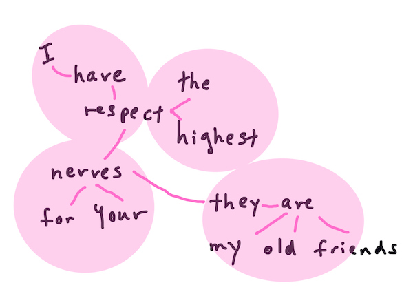

<!--
CO_OP_TRANSLATOR_METADATA:
{
  "original_hash": "6534e145d52a3890590d27be75386e5d",
  "translation_date": "2025-08-29T18:19:11+00:00",
  "source_file": "6-NLP/2-Tasks/README.md",
  "language_code": "mr"
}
-->
# सामान्य नैसर्गिक भाषा प्रक्रिया कार्ये आणि तंत्रे

बहुतेक *नैसर्गिक भाषा प्रक्रिया* कार्यांसाठी, प्रक्रिया करायच्या मजकुराचे तुकडे करणे, त्याचे विश्लेषण करणे आणि परिणाम नियम व डेटासेटसह संग्रहित किंवा क्रॉस-रेफरन्स करणे आवश्यक असते. या कार्यांमुळे प्रोग्रामरला मजकुरातील _अर्थ_, _उद्देश_ किंवा फक्त शब्दांची _वारंवारता_ समजण्याची क्षमता मिळते.

## [पूर्व-व्याख्यान प्रश्नमंजुषा](https://gray-sand-07a10f403.1.azurestaticapps.net/quiz/33/)

मजकुरावर प्रक्रिया करण्यासाठी वापरल्या जाणाऱ्या सामान्य तंत्रांचा शोध घेऊया. मशीन लर्निंगसह एकत्रितपणे, ही तंत्रे तुम्हाला मोठ्या प्रमाणात मजकुराचे कार्यक्षमतेने विश्लेषण करण्यात मदत करतात. मात्र, ML लागू करण्यापूर्वी, NLP तज्ञांना येणाऱ्या समस्यांचे समजून घेऊया.

## NLP मध्ये सामान्य कार्ये

तुम्ही काम करत असलेल्या मजकुराचे विश्लेषण करण्याचे वेगवेगळे मार्ग आहेत. तुम्ही काही कार्ये करू शकता आणि या कार्यांद्वारे तुम्हाला मजकुराचे आकलन होऊन निष्कर्ष काढता येतात. ही कार्ये सहसा एका क्रमाने केली जातात.

### टोकनायझेशन

बहुतेक NLP अल्गोरिदमने करायचे पहिले काम म्हणजे मजकुराचे टोकन किंवा शब्दांमध्ये विभाजन करणे. हे सोपे वाटत असले तरी, विरामचिन्हे आणि वेगवेगळ्या भाषांचे शब्द व वाक्य विभाजक विचारात घेणे कठीण होऊ शकते. तुम्हाला विभाजन निश्चित करण्यासाठी विविध पद्धती वापराव्या लागू शकतात.


> **Pride and Prejudice** मधील एका वाक्याचे टोकनायझेशन. माहितीग्राफिक [Jen Looper](https://twitter.com/jenlooper) यांनी तयार केले.

### एम्बेडिंग्ज

[शब्द एम्बेडिंग्ज](https://wikipedia.org/wiki/Word_embedding) म्हणजे तुमच्या मजकुराच्या डेटाला संख्यात्मक स्वरूपात रूपांतरित करण्याचा एक मार्ग आहे. एम्बेडिंग्ज अशा प्रकारे केली जातात की समान अर्थ असलेले किंवा एकत्र वापरलेले शब्द एकत्र गटबद्ध होतात.


> "I have the highest respect for your nerves, they are my old friends." - **Pride and Prejudice** मधील एका वाक्याचे शब्द एम्बेडिंग्ज. माहितीग्राफिक [Jen Looper](https://twitter.com/jenlooper) यांनी तयार केले.

✅ [हा मनोरंजक टूल](https://projector.tensorflow.org/) वापरून शब्द एम्बेडिंग्जसह प्रयोग करा. एका शब्दावर क्लिक केल्यास समान शब्दांचे गट दिसतात: 'toy' 'disney', 'lego', 'playstation', आणि 'console' सोबत गटबद्ध होते.

### पार्सिंग आणि पार्ट-ऑफ-स्पीच टॅगिंग

टोकन केलेल्या प्रत्येक शब्दाला पार्ट-ऑफ-स्पीच म्हणून टॅग करता येते - संज्ञा, क्रियापद किंवा विशेषण. वाक्य `the quick red fox jumped over the lazy brown dog` मध्ये POS टॅगिंग असे असू शकते: fox = संज्ञा, jumped = क्रियापद.


> **Pride and Prejudice** मधील एका वाक्याचे पार्सिंग. माहितीग्राफिक [Jen Looper](https://twitter.com/jenlooper) यांनी तयार केले.

पार्सिंग म्हणजे वाक्यातील कोणते शब्द एकमेकांशी संबंधित आहेत हे ओळखणे - उदाहरणार्थ `the quick red fox jumped` हे विशेषण-संज्ञा-क्रियापद अनुक्रम आहे जे `lazy brown dog` अनुक्रमापासून वेगळे आहे.

### शब्द आणि वाक्यांश वारंवारता

मोठ्या प्रमाणात मजकुराचे विश्लेषण करताना प्रत्येक शब्द किंवा वाक्यांशाची वारंवारता आणि त्याचे किती वेळा दिसते याचा शब्दकोश तयार करणे उपयुक्त ठरते. वाक्य `the quick red fox jumped over the lazy brown dog` मध्ये the ची शब्द वारंवारता 2 आहे.

आता आपण शब्दांची वारंवारता मोजण्यासाठी एक उदाहरण मजकुर पाहूया. रुडयार्ड किपलिंगच्या The Winners कवितेत खालील कडवे आहे:

```output
What the moral? Who rides may read.
When the night is thick and the tracks are blind
A friend at a pinch is a friend, indeed,
But a fool to wait for the laggard behind.
Down to Gehenna or up to the Throne,
He travels the fastest who travels alone.
```

वारंवारता केस सेंसिटिव्ह किंवा केस इनसेंसिटिव्ह असू शकते. उदाहरणार्थ, `a friend` ची वारंवारता 2 आहे, `the` ची वारंवारता 6 आहे, आणि `travels` ची वारंवारता 2 आहे.

### एन-ग्राम्स

मजकुराला निश्चित लांबीच्या शब्दांच्या अनुक्रमांमध्ये विभाजित करता येते, एक शब्द (युनिग्राम), दोन शब्द (बायग्राम्स), तीन शब्द (ट्रायग्राम्स) किंवा कोणत्याही संख्येचे शब्द (एन-ग्राम्स).

उदाहरणार्थ, `the quick red fox jumped over the lazy brown dog` मध्ये एन-ग्राम स्कोअर 2 असल्यास खालील एन-ग्राम्स तयार होतात:

1. the quick  
2. quick red  
3. red fox  
4. fox jumped  
5. jumped over  
6. over the  
7. the lazy  
8. lazy brown  
9. brown dog  

याला वाक्यावर स्लाइडिंग बॉक्स म्हणून पाहणे सोपे होईल. येथे 3 शब्दांच्या एन-ग्राम्ससाठी स्लाइडिंग बॉक्स आहे, प्रत्येक वाक्यात एन-ग्राम ठळक आहे:

1.   <u>**the quick red**</u> fox jumped over the lazy brown dog  
2.   the **<u>quick red fox</u>** jumped over the lazy brown dog  
3.   the quick **<u>red fox jumped</u>** over the lazy brown dog  
4.   the quick red **<u>fox jumped over</u>** the lazy brown dog  
5.   the quick red fox **<u>jumped over the</u>** lazy brown dog  
6.   the quick red fox jumped **<u>over the lazy</u>** brown dog  
7.   the quick red fox jumped over <u>**the lazy brown**</u> dog  
8.   the quick red fox jumped over the **<u>lazy brown dog</u>**  


> एन-ग्राम मूल्य 3: माहितीग्राफिक [Jen Looper](https://twitter.com/jenlooper) यांनी तयार केले.

### संज्ञा वाक्यांश काढणे

बहुतेक वाक्यांमध्ये एक संज्ञा असते जी वाक्याचा विषय किंवा वस्तू असते. इंग्रजीमध्ये, ती सहसा 'a', 'an', किंवा 'the' ने ओळखता येते. वाक्याचा अर्थ समजून घेण्याचा प्रयत्न करताना 'संज्ञा वाक्यांश काढणे' हे NLP मध्ये सामान्य कार्य आहे.

✅ वाक्यात "I cannot fix on the hour, or the spot, or the look or the words, which laid the foundation. It is too long ago. I was in the middle before I knew that I had begun.", तुम्ही संज्ञा वाक्यांश ओळखू शकता का?

वाक्यात `the quick red fox jumped over the lazy brown dog` दोन संज्ञा वाक्यांश आहेत: **quick red fox** आणि **lazy brown dog**.

### भावना विश्लेषण

वाक्य किंवा मजकुराचे विश्लेषण करून त्याची भावना, म्हणजेच *सकारात्मक* किंवा *नकारात्मक* कशी आहे हे ठरवता येते. भावना *ध्रुवता* आणि *वस्तुनिष्ठता/विषयवस्तु* यामध्ये मोजली जाते. ध्रुवता -1.0 ते 1.0 (नकारात्मक ते सकारात्मक) आणि 0.0 ते 1.0 (सर्वात वस्तुनिष्ठ ते सर्वात विषयवस्तु) मध्ये मोजली जाते.

✅ नंतर तुम्ही शिकाल की भावना ठरवण्यासाठी मशीन लर्निंग वापरण्याचे वेगवेगळे मार्ग आहेत, पण एक मार्ग म्हणजे मानव तज्ञाने सकारात्मक किंवा नकारात्मक म्हणून वर्गीकृत केलेल्या शब्द आणि वाक्यांशांची यादी असणे आणि त्या मॉडेलला मजकुरावर लागू करणे. तुम्हाला काही परिस्थितीत हे कसे कार्य करेल आणि काही परिस्थितीत कमी कार्यक्षम असेल हे दिसते का?

### शब्दरूप बदलणे

शब्दरूप बदलणे तुम्हाला एखाद्या शब्दाचे एकवचनी किंवा अनेकवचनी रूप मिळविण्यास सक्षम करते.

### लेमॅटायझेशन

*लेमा* म्हणजे शब्दांचा मूळ किंवा मुख्य शब्द, उदाहरणार्थ *flew*, *flies*, *flying* यांचा लेमा म्हणजे क्रियापद *fly*.

NLP संशोधकांसाठी उपयुक्त डेटाबेस उपलब्ध आहेत, विशेषतः:

### वर्डनेट

[वर्डनेट](https://wordnet.princeton.edu/) हा शब्दांचा, समानार्थी शब्दांचा, विरुद्धार्थी शब्दांचा आणि अनेक भाषांमधील प्रत्येक शब्दासाठी अनेक तपशीलांचा डेटाबेस आहे. भाषांतर, स्पेल चेकर्स किंवा कोणत्याही प्रकारचे भाषा टूल्स तयार करताना हे अत्यंत उपयुक्त आहे.

## NLP लायब्ररी

सुदैवाने, तुम्हाला ही सर्व तंत्रे स्वतः तयार करण्याची गरज नाही, कारण उत्कृष्ट Python लायब्ररी उपलब्ध आहेत ज्या नैसर्गिक भाषा प्रक्रिया किंवा मशीन लर्निंगमध्ये विशेष नसलेल्या विकसकांसाठी अधिक सुलभ बनवतात. पुढील धड्यांमध्ये याचे अधिक उदाहरणे समाविष्ट आहेत, पण येथे तुम्हाला पुढील कार्यासाठी मदत करणारी काही उपयुक्त उदाहरणे शिकायला मिळतील.

### व्यायाम - `TextBlob` लायब्ररी वापरणे

TextBlob नावाची लायब्ररी वापरूया कारण ती या प्रकारच्या कार्यांसाठी उपयुक्त API समाविष्ट करते. TextBlob "[NLTK](https://nltk.org) आणि [pattern](https://github.com/clips/pattern) च्या मजबूत आधारावर उभी आहे आणि दोघांसोबत चांगले कार्य करते." त्याच्या API मध्ये मोठ्या प्रमाणात ML समाविष्ट आहे.

> टीप: TextBlob साठी एक उपयुक्त [Quick Start](https://textblob.readthedocs.io/en/dev/quickstart.html#quickstart) मार्गदर्शक उपलब्ध आहे जो अनुभवी Python विकसकांसाठी शिफारस केलेला आहे.

संज्ञा वाक्यांश ओळखण्याचा प्रयत्न करताना, TextBlob संज्ञा वाक्यांश शोधण्यासाठी अनेक पर्याय ऑफर करते.

1. `ConllExtractor` पाहा.

    ```python
    from textblob import TextBlob
    from textblob.np_extractors import ConllExtractor
    # import and create a Conll extractor to use later 
    extractor = ConllExtractor()
    
    # later when you need a noun phrase extractor:
    user_input = input("> ")
    user_input_blob = TextBlob(user_input, np_extractor=extractor)  # note non-default extractor specified
    np = user_input_blob.noun_phrases                                    
    ```

    > येथे काय चालले आहे? [ConllExtractor](https://textblob.readthedocs.io/en/dev/api_reference.html?highlight=Conll#textblob.en.np_extractors.ConllExtractor) म्हणजे "एक संज्ञा वाक्यांश एक्स्ट्रॅक्टर जो ConLL-2000 प्रशिक्षण कॉर्पससह प्रशिक्षित चंक पार्सिंग वापरतो." ConLL-2000 म्हणजे Computational Natural Language Learning च्या 2000 परिषद. प्रत्येक वर्षी परिषदेत एक कठीण NLP समस्या सोडवण्यासाठी कार्यशाळा आयोजित केली जात असे, आणि 2000 मध्ये ती संज्ञा चंकिंग होती. एक मॉडेल Wall Street Journal वर प्रशिक्षित केले गेले, "sections 15-18 प्रशिक्षण डेटा म्हणून (211727 टोकन्स) आणि section 20 चाचणी डेटा म्हणून (47377 टोकन्स)." तुम्ही वापरलेल्या प्रक्रियांचा [इथे](https://www.clips.uantwerpen.be/conll2000/chunking/) आणि [परिणाम](https://ifarm.nl/erikt/research/np-chunking.html) पाहू शकता.

### आव्हान - NLP सह तुमच्या बॉटमध्ये सुधारणा करणे

मागील धड्यात तुम्ही एक साधा Q&A बॉट तयार केला. आता, तुम्ही Marvin ला थोडा अधिक सहानुभूतीपूर्ण बनवणार आहात, तुमच्या इनपुटचे विश्लेषण करून भावना ठरवणार आणि त्या भावनेशी जुळणारा प्रतिसाद देणार. तुम्हाला `noun_phrase` ओळखून त्या विषयावर अधिक इनपुट विचारावे लागेल.

तुमच्या बॉटला अधिक चांगले संवाद साधण्यासाठी तयार करताना पायऱ्या:

1. वापरकर्त्याला बॉटशी संवाद कसा साधायचा याबद्दल सूचना प्रिंट करा  
2. लूप सुरू करा  
   1. वापरकर्ता इनपुट स्वीकारा  
   2. वापरकर्त्याने exit विचारल्यास, exit करा  
   3. वापरकर्ता इनपुट प्रक्रिया करा आणि योग्य भावना प्रतिसाद ठरवा  
   4. जर भावना मध्ये संज्ञा वाक्यांश आढळला, तर त्याचे अनेकवचनी रूप तयार करा आणि त्या विषयावर अधिक इनपुट विचारावे  
   5. प्रतिसाद प्रिंट करा  
3. पायरी 2 वर परत जा  

TextBlob वापरून भावना ठरवण्यासाठी कोड स्निपेट येथे आहे. लक्षात घ्या की फक्त चार *ग्रेडियंट्स* भावना प्रतिसाद आहेत (तुम्हाला हवे असल्यास अधिक असू शकतात):

```python
if user_input_blob.polarity <= -0.5:
  response = "Oh dear, that sounds bad. "
elif user_input_blob.polarity <= 0:
  response = "Hmm, that's not great. "
elif user_input_blob.polarity <= 0.5:
  response = "Well, that sounds positive. "
elif user_input_blob.polarity <= 1:
  response = "Wow, that sounds great. "
```

नमुन्याच्या आउटपुटसाठी येथे काही उदाहरणे आहेत (वापरकर्ता इनपुट > ने सुरू होणाऱ्या ओळींवर आहे):

```output
Hello, I am Marvin, the friendly robot.
You can end this conversation at any time by typing 'bye'
After typing each answer, press 'enter'
How are you today?
> I am ok
Well, that sounds positive. Can you tell me more?
> I went for a walk and saw a lovely cat
Well, that sounds positive. Can you tell me more about lovely cats?
> cats are the best. But I also have a cool dog
Wow, that sounds great. Can you tell me more about cool dogs?
> I have an old hounddog but he is sick
Hmm, that's not great. Can you tell me more about old hounddogs?
> bye
It was nice talking to you, goodbye!
```

कार्याचे एक संभाव्य समाधान [इथे](https://github.com/microsoft/ML-For-Beginners/blob/main/6-NLP/2-Tasks/solution/bot.py) आहे.

✅ ज्ञान तपासणी

1. तुम्हाला वाटते का की सहानुभूतीपूर्ण प्रतिसाद एखाद्याला बॉटने त्यांना खरोखर समजले असे वाटण्यास 'फसवू' शकतील?  
2. संज्ञा वाक्यांश ओळखल्याने बॉट अधिक 'विश्वसनीय' वाटतो का?  
3. वाक्यातून 'संज्ञा वाक्यांश' काढणे का उपयुक्त ठरेल?

---

मागील ज्ञान तपासणीतील बॉट अंमलात आणा आणि मित्रावर चाचणी करा. तो त्यांना फसवू शकतो का? तुम्ही तुमचा बॉट अधिक 'विश्वसनीय' बनवू शकता का?

## 🚀आव्हान

मागील ज्ञान तपासणीतील कार्य घ्या आणि ते अंमलात आणण्याचा प्रयत्न करा. बॉट मित्रावर चाचणी करा. तो त्यांना फसवू शकतो का? तुम्ही तुमचा बॉट अधिक 'विश्वसनीय' बनवू शकता का?

## [व्याख्यानानंतर प्रश्नमंजुषा](https://gray-sand-07a10f403.1.azurestaticapps.net/quiz/34/)

## पुनरावलोकन आणि स्व-अभ्यास

पुढील काही धड्यांमध्ये तुम्ही भावना विश्लेषणाबद्दल अधिक शिकाल. [KDNuggets](https://www.kdnuggets.com/tag/nlp) वरच्या लेखांमध्ये या मनोरंजक तंत्राचा अभ्यास करा.

## असाइनमेंट 

[बॉटला उत्तर देण्यास तयार करा](assignment.md)

---

**अस्वीकरण**:  
हा दस्तऐवज AI भाषांतर सेवा [Co-op Translator](https://github.com/Azure/co-op-translator) वापरून भाषांतरित करण्यात आला आहे. आम्ही अचूकतेसाठी प्रयत्नशील असलो तरी, कृपया लक्षात ठेवा की स्वयंचलित भाषांतरांमध्ये त्रुटी किंवा अचूकतेचा अभाव असू शकतो. मूळ भाषेतील दस्तऐवज हा अधिकृत स्रोत मानला जावा. महत्त्वाच्या माहितीसाठी व्यावसायिक मानवी भाषांतराची शिफारस केली जाते. या भाषांतराचा वापर करून निर्माण होणाऱ्या कोणत्याही गैरसमज किंवा चुकीच्या अर्थासाठी आम्ही जबाबदार राहणार नाही.