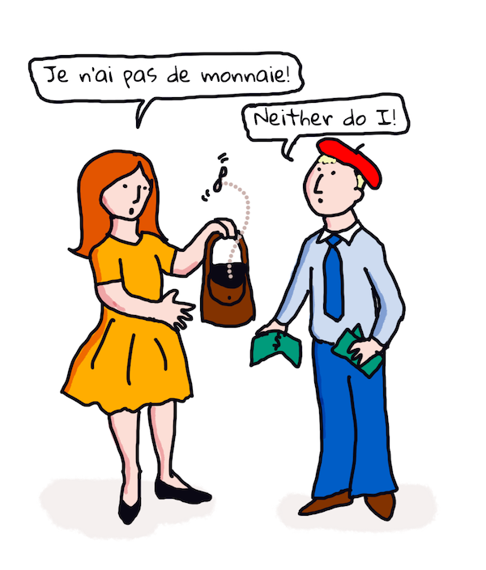

<!--
CO_OP_TRANSLATOR_METADATA:
{
  "original_hash": "6396d5d8617572cd2ac1de74fb0deb22",
  "translation_date": "2025-08-29T18:32:58+00:00",
  "source_file": "6-NLP/3-Translation-Sentiment/README.md",
  "language_code": "mr"
}
-->
# मशीन लर्निंगसह भाषांतर आणि भावना विश्लेषण

मागील धड्यांमध्ये तुम्ही `TextBlob` वापरून एक साधा बॉट कसा तयार करायचा हे शिकले, जो ML च्या मदतीने नामफ्रासेस काढणे यासारखी मूलभूत NLP कामे करतो. संगणकीय भाषाशास्त्रातील आणखी एक महत्त्वाचे आव्हान म्हणजे एका भाषेतून दुसऱ्या भाषेत वाक्याचे अचूक _भाषांतर_ करणे.

## [पूर्व-व्याख्यान प्रश्नमंजुषा](https://gray-sand-07a10f403.1.azurestaticapps.net/quiz/35/)

भाषांतर हे एक कठीण काम आहे, कारण जगात हजारो भाषा आहेत आणि प्रत्येक भाषेचे व्याकरणाचे नियम वेगळे असू शकतात. एक पद्धत म्हणजे एका भाषेच्या व्याकरणाच्या नियमांना (उदा. इंग्रजी) एका भाषाविरहित संरचनेत रूपांतरित करणे आणि नंतर ती दुसऱ्या भाषेत परत रूपांतरित करणे. या पद्धतीत खालील टप्पे असतात:

1. **ओळख**. इनपुट भाषेतील शब्दांना नाम, क्रियापद इत्यादींमध्ये वर्गीकृत करणे.
2. **भाषांतर तयार करणे**. लक्ष्य भाषेतील स्वरूपात प्रत्येक शब्दाचे थेट भाषांतर तयार करणे.

### उदाहरण वाक्य, इंग्रजी ते आयरिश

'इंग्रजी'त, वाक्य _I feel happy_ तीन शब्दांमध्ये आहे:

- **विषय** (I)
- **क्रियापद** (feel)
- **विशेषण** (happy)

पण 'आयरिश' भाषेत, हेच वाक्य खूप वेगळ्या व्याकरणात्मक रचनेत असते - "*happy*" किंवा "*sad*" सारख्या भावना तुमच्यावर *आहेत* असे व्यक्त केल्या जातात.

इंग्रजी वाक्य `I feel happy` आयरिशमध्ये `Tá athas orm` असे होईल. *शाब्दिक* भाषांतर असेल `Happy is upon me`.

आयरिश भाषिक जेव्हा इंग्रजीत भाषांतर करतो, तेव्हा तो `I feel happy` असे म्हणतो, `Happy is upon me` असे नाही, कारण त्याला वाक्याचा अर्थ समजतो, जरी शब्द आणि वाक्यरचना वेगळी असली तरी.

आयरिश वाक्याची औपचारिक रचना अशी आहे:

- **क्रियापद** (Tá किंवा is)
- **विशेषण** (athas, किंवा happy)
- **विषय** (orm, किंवा upon me)

## भाषांतर

साधा भाषांतर प्रोग्राम वाक्यरचनेकडे दुर्लक्ष करून फक्त शब्दांचे भाषांतर करू शकतो.

✅ जर तुम्ही प्रौढ वयात दुसरी (किंवा तिसरी किंवा अधिक) भाषा शिकली असेल, तर तुम्ही कदाचित तुमच्या मूळ भाषेत विचार करून, संकल्पना डोक्यातून शब्दशः दुसऱ्या भाषेत भाषांतरित करून बोलण्यास सुरुवात केली असेल. हेच साधे भाषांतर संगणक प्रोग्राम करतात. प्रवाहीपणा मिळवण्यासाठी या टप्प्यापलीकडे जाणे महत्त्वाचे आहे!

साध्या भाषांतरामुळे चुकीची (आणि कधी कधी विनोदी) भाषांतरे होतात: `I feel happy` चे शाब्दिक भाषांतर आयरिशमध्ये `Mise bhraitheann athas` असे होते. याचा अर्थ (शाब्दिक) `me feel happy` असा होतो आणि ते वैध आयरिश वाक्य नाही. जरी इंग्रजी आणि आयरिश या दोन शेजारील बेटांवर बोलल्या जाणाऱ्या भाषा असल्या तरी, त्या खूप वेगळ्या व्याकरण रचनांसह आहेत.

> तुम्ही आयरिश भाषिक परंपरांबद्दल काही व्हिडिओ पाहू शकता, जसे की [हा व्हिडिओ](https://www.youtube.com/watch?v=mRIaLSdRMMs)

### मशीन लर्निंग पद्धती

आत्तापर्यंत, तुम्ही नैसर्गिक भाषा प्रक्रिया करण्यासाठी औपचारिक नियम पद्धतीबद्दल शिकला आहात. आणखी एक पद्धत म्हणजे शब्दांचा अर्थ दुर्लक्ष करून, _मशीन लर्निंग वापरून पॅटर्न शोधणे_. जर तुमच्याकडे मूळ आणि लक्ष्य भाषांमध्ये भरपूर मजकूर (*corpus*) असेल, तर हे भाषांतरात उपयुक्त ठरू शकते.

उदाहरणार्थ, *Pride and Prejudice* या जेन ऑस्टेनने 1813 मध्ये लिहिलेल्या प्रसिद्ध इंग्रजी कादंबरीचा विचार करा. जर तुम्ही ही कादंबरी इंग्रजीत आणि तिचे *फ्रेंच* भाषांतर वाचले, तर तुम्ही एका भाषेतील वाक्ये दुसऱ्या भाषेत *रूढीप्रमाणे* भाषांतरित झालेली ओळखू शकता. तुम्ही हे लगेचच करून पाहणार आहात.

उदाहरणार्थ, इंग्रजी वाक्य `I have no money` चे शाब्दिक भाषांतर फ्रेंचमध्ये `Je n'ai pas de monnaie` असे होईल. "Monnaie" हा एक गोंधळात टाकणारा फ्रेंच शब्द आहे, कारण 'money' आणि 'monnaie' समानार्थी नाहीत. एक चांगले भाषांतर असेल `Je n'ai pas d'argent`, कारण ते अधिक चांगल्या प्रकारे व्यक्त करते की तुमच्याकडे पैसे नाहीत (तर 'monnaie' म्हणजे 'सुटे पैसे').



> प्रतिमा [Jen Looper](https://twitter.com/jenlooper) यांची आहे

जर एखाद्या ML मॉडेलकडे मानवी भाषांतरांचा पुरेसा डेटा असेल, तर ते आधीच्या तज्ञ मानवी भाषांतरांमधील सामान्य पॅटर्न ओळखून भाषांतराची अचूकता सुधारू शकते.

### व्यायाम - भाषांतर

तुम्ही `TextBlob` वापरून वाक्यांचे भाषांतर करू शकता. **Pride and Prejudice** च्या प्रसिद्ध पहिल्या वाक्याचा प्रयत्न करा:

```python
from textblob import TextBlob

blob = TextBlob(
    "It is a truth universally acknowledged, that a single man in possession of a good fortune, must be in want of a wife!"
)
print(blob.translate(to="fr"))

```

`TextBlob` चांगले भाषांतर करते: "C'est une vérité universellement reconnue, qu'un homme célibataire en possession d'une bonne fortune doit avoir besoin d'une femme!".

हे म्हणता येईल की TextBlob चे भाषांतर 1932 च्या V. Leconte आणि Ch. Pressoir यांच्या फ्रेंच भाषांतरापेक्षा अधिक अचूक आहे:

"C'est une vérité universelle qu'un célibataire pourvu d'une belle fortune doit avoir envie de se marier, et, si peu que l'on sache de son sentiment à cet egard, lorsqu'il arrive dans une nouvelle résidence, cette idée est si bien fixée dans l'esprit de ses voisins qu'ils le considèrent sur-le-champ comme la propriété légitime de l'une ou l'autre de leurs filles."

या प्रकरणात, ML च्या मदतीने केलेले भाषांतर मानवी भाषांतरापेक्षा चांगले आहे, कारण मानवी भाषांतरात मूळ लेखकाच्या शब्दांमध्ये अनावश्यक बदल केले गेले आहेत.

> येथे काय चालले आहे? आणि TextBlob भाषांतरात इतके चांगले का आहे? कारण, TextBlob मागे Google Translate वापरतो, जो एक प्रगत AI आहे आणि लाखो वाक्ये पारखून कार्यासाठी सर्वोत्तम स्ट्रिंग्स अंदाज लावतो. येथे काहीही मॅन्युअल होत नाही आणि तुम्हाला `blob.translate` वापरण्यासाठी इंटरनेट कनेक्शन आवश्यक आहे.

✅ आणखी काही वाक्ये वापरून पाहा. कोण चांगले आहे, ML की मानवी भाषांतर? कोणत्या प्रकरणांमध्ये?

## भावना विश्लेषण

मशीन लर्निंग चांगले कार्य करू शकणारे आणखी एक क्षेत्र म्हणजे भावना विश्लेषण. भावना ओळखण्यासाठी एक गैर-ML पद्धत म्हणजे 'सकारात्मक' आणि 'नकारात्मक' शब्द आणि वाक्ये ओळखणे. नंतर, नवीन मजकूर दिल्यास, सकारात्मक, नकारात्मक आणि तटस्थ शब्दांचे एकूण मूल्य मोजून एकूण भावना ओळखणे.

ही पद्धत सहज फसवली जाऊ शकते, जसे तुम्ही Marvin टास्कमध्ये पाहिले असेल - वाक्य `Great, that was a wonderful waste of time, I'm glad we are lost on this dark road` हे एक उपरोधिक, नकारात्मक भावना असलेले वाक्य आहे, पण साधा अल्गोरिदम 'great', 'wonderful', 'glad' यांना सकारात्मक आणि 'waste', 'lost', 'dark' यांना नकारात्मक म्हणून ओळखतो. या विरोधाभासी शब्दांमुळे एकूण भावना गोंधळात पडते.

✅ थोडा वेळ थांबा आणि विचार करा की आपण माणूस म्हणून उपरोध कसा व्यक्त करतो. आवाजातील चढ-उतार यामध्ये मोठी भूमिका बजावतो. "Well, that film was awesome" हे वाक्य वेगवेगळ्या पद्धतीने म्हणण्याचा प्रयत्न करा आणि तुमचा आवाज अर्थ कसा व्यक्त करतो हे शोधा.

### ML पद्धती

ML पद्धतीत नकारात्मक आणि सकारात्मक मजकूर - ट्वीट्स, चित्रपट पुनरावलोकने किंवा जिथे मानवी स्कोअर आणि लेखी मत दिले गेले आहे असे काहीही - मॅन्युअली गोळा करावे लागते. नंतर NLP तंत्रांचा वापर करून मते आणि स्कोअर्सवर प्रक्रिया केली जाते, ज्यामुळे पॅटर्न दिसून येतात (उदा., सकारात्मक चित्रपट पुनरावलोकनांमध्ये 'Oscar worthy' हा शब्द नकारात्मक पुनरावलोकनांपेक्षा जास्त वेळा दिसतो, किंवा सकारात्मक रेस्टॉरंट पुनरावलोकनांमध्ये 'gourmet' हा शब्द 'disgusting' पेक्षा जास्त वेळा दिसतो).

> ⚖️ **उदाहरण**: समजा तुम्ही एखाद्या राजकारण्याच्या कार्यालयात काम करता आणि काही नवीन कायद्यावर चर्चा होत आहे. नागरिक कार्यालयाला त्या कायद्याच्या समर्थनार्थ किंवा विरोधात ईमेल पाठवतात. समजा तुम्हाला त्या ईमेल्स वाचून दोन गटांमध्ये वर्गीकृत करायचे आहे - *साठी* आणि *विरुद्ध*. जर खूप ईमेल्स असतील, तर तुम्हाला सर्व वाचण्यात अडचण येईल. जर एखादा बॉट सर्व ईमेल्स वाचून त्यांचा अर्थ समजून घेतला आणि प्रत्येक ईमेल कोणत्या गटात आहे हे सांगितले, तर किती सोपे होईल ना?
> 
> हे साध्य करण्यासाठी मशीन लर्निंगचा वापर करता येईल. तुम्ही मॉडेलला काही *विरुद्ध* ईमेल्स आणि काही *साठी* ईमेल्ससह प्रशिक्षण द्याल. मॉडेल काही शब्द आणि वाक्ये *विरुद्ध* किंवा *साठी* ईमेल्समध्ये जास्त वेळा दिसतात हे ओळखेल, *पण त्याला मजकूराचा अर्थ समजणार नाही*, फक्त विशिष्ट शब्द आणि पॅटर्न जास्त वेळा दिसतात हे ओळखेल. तुम्ही मॉडेलला अशा ईमेल्ससह चाचणी करू शकता, जे तुम्ही प्रशिक्षणासाठी वापरले नाहीत, आणि पाहू शकता की ते तुमच्यासारखेच निष्कर्ष काढते का. एकदा तुम्हाला मॉडेलच्या अचूकतेबद्दल खात्री पटली की, तुम्ही भविष्यातील ईमेल्स प्रक्रिया करू शकता, प्रत्येक ईमेल वाचण्याची गरज न पडता.

✅ ही प्रक्रिया तुम्ही मागील धड्यांमध्ये वापरलेल्या प्रक्रियांसारखी वाटते का?

## व्यायाम - भावनिक वाक्ये

भावना *polarity* -1 ते 1 मध्ये मोजली जाते, म्हणजे -1 सर्वात नकारात्मक भावना आहे, आणि 1 सर्वात सकारात्मक. भावना 0 - 1 स्कोअरने वस्तुनिष्ठता (0) आणि व्यक्तिनिष्ठता (1) यासाठीही मोजली जाते.

जेन ऑस्टेनच्या *Pride and Prejudice* कडे पुन्हा एकदा पाहा. हा मजकूर [Project Gutenberg](https://www.gutenberg.org/files/1342/1342-h/1342-h.htm) येथे उपलब्ध आहे. खालील नमुना पुस्तकातील पहिल्या आणि शेवटच्या वाक्यांचे भावना विश्लेषण करणारा एक लहान प्रोग्राम दाखवतो आणि त्याचा भावना polarity आणि व्यक्तिनिष्ठता/वस्तुनिष्ठता स्कोअर प्रदर्शित करतो.

तुम्ही `TextBlob` लायब्ररी (वर वर्णन केलेली) वापरून `sentiment` ठरवू शकता (तुम्हाला स्वतःचा भावना कॅल्क्युलेटर लिहायची गरज नाही) पुढील कार्यात.

```python
from textblob import TextBlob

quote1 = """It is a truth universally acknowledged, that a single man in possession of a good fortune, must be in want of a wife."""

quote2 = """Darcy, as well as Elizabeth, really loved them; and they were both ever sensible of the warmest gratitude towards the persons who, by bringing her into Derbyshire, had been the means of uniting them."""

sentiment1 = TextBlob(quote1).sentiment
sentiment2 = TextBlob(quote2).sentiment

print(quote1 + " has a sentiment of " + str(sentiment1))
print(quote2 + " has a sentiment of " + str(sentiment2))
```

तुम्हाला खालील आउटपुट दिसते:

```output
It is a truth universally acknowledged, that a single man in possession of a good fortune, must be in want # of a wife. has a sentiment of Sentiment(polarity=0.20952380952380953, subjectivity=0.27142857142857146)

Darcy, as well as Elizabeth, really loved them; and they were
     both ever sensible of the warmest gratitude towards the persons
      who, by bringing her into Derbyshire, had been the means of
      uniting them. has a sentiment of Sentiment(polarity=0.7, subjectivity=0.8)
```

## आव्हान - भावना polarity तपासा

तुमचे कार्य म्हणजे भावना polarity वापरून ठरवणे की *Pride and Prejudice* मध्ये पूर्णपणे सकारात्मक वाक्ये नकारात्मक वाक्यांपेक्षा जास्त आहेत का. या कार्यासाठी, तुम्ही गृहीत धरू शकता की 1 किंवा -1 चा polarity स्कोअर पूर्णपणे सकारात्मक किंवा नकारात्मक आहे.

**पायऱ्या:**

1. [Pride and Prejudice](https://www.gutenberg.org/files/1342/1342-h/1342-h.htm) ची प्रत .txt फाईल म्हणून डाउनलोड करा. फाईलच्या सुरुवातीस आणि शेवटी असलेला मेटाडेटा काढून टाका, फक्त मूळ मजकूर ठेवा.
2. Python मध्ये फाईल उघडा आणि मजकूर स्ट्रिंग म्हणून काढा.
3. पुस्तकाच्या स्ट्रिंगसह TextBlob तयार करा.
4. पुस्तकातील प्रत्येक वाक्य एका लूपमध्ये विश्लेषित करा.
   1. जर polarity 1 किंवा -1 असेल, तर वाक्य सकारात्मक किंवा नकारात्मक संदेशांच्या यादीत साठवा.
5. शेवटी, सर्व सकारात्मक वाक्ये आणि नकारात्मक वाक्ये (वेगवेगळी) आणि त्यांची संख्या प्रिंट करा.

येथे एक नमुना [solution](https://github.com/microsoft/ML-For-Beginners/blob/main/6-NLP/3-Translation-Sentiment/solution/notebook.ipynb) आहे.

✅ ज्ञान तपासणी

1. भावना वाक्यात वापरलेल्या शब्दांवर आधारित आहे, पण कोडला *शब्द समजतात का*?
2. तुम्हाला भावना polarity अचूक वाटते का, किंवा दुसऱ्या शब्दांत, तुम्ही स्कोअर्सशी *सहमत* आहात का?
   1. विशेषतः, तुम्ही खालील वाक्यांच्या पूर्णपणे **सकारात्मक** polarity शी सहमत आहात का?
      * “What an excellent father you have, girls!” said she, when the door was shut.
      * “Your examination of Mr. Darcy is over, I presume,” said Miss Bingley; “and pray what is the result?” “I am perfectly convinced by it that Mr. Darcy has no defect.
      * How wonderfully these sort of things occur!
      * I have the greatest dislike in the world to that sort of thing.
      * Charlotte is an excellent manager, I dare say.
      * “This is delightful indeed!
      * I am so happy!
      * Your idea of the ponies is delightful.
   2. पुढील 3 वाक्यांना पूर्णपणे सकारात्मक भावना दिली गेली, पण बारकाईने वाचल्यावर ती सकारात्मक वाक्ये नाहीत. भावना विश्लेषणाला ती सकारात्मक वाक्ये का वाटली?
      * Happy shall I be, when his stay at Netherfield is over!” “I wish I could say anything to comfort you,” replied Elizabeth; “but it is wholly out of my power.
      * If I could but see you as happy!
      * Our distress, my dear Lizzy, is very great.
   3. तुम्ही खालील वाक्यांच्या पूर्णपणे **नकारात्मक** polarity शी सहमत आहात का?
      - Everybody is disgusted with his pride.
      - “I should like to know how he behaves among strangers.” “You shall hear then—but prepare yourself for something very dreadful.
      - The pause was to Elizabeth’s feelings dreadful.
      - It would be dreadful!

✅ जेन ऑस्टेनचे कोणतेही चाहते समजतील की ती तिच्या पुस्तकांमध्ये इंग्लिश रीजेंसी समाजाच्या हास्यास्पद पैलूंवर टीका करण्यासाठी वापरते. *Pride and Prejudice* मधील मुख्य पात्र एलिझाबेथ बेनेट (लेखिकेसारखीच) एक तीव्र सामाजिक निरीक्षक आहे आणि तिची भाषा अनेकदा सूक्ष्मतेने भरलेली असते. अगदी मिस्टर डार्सी (कथेतील प्रेम पात्र) देखील एलिझाबेथच्या खेळकर आणि चिडवणाऱ्या भाषेचा उल्लेख करतो: "I have had the pleasure of your acquaintance long enough to know that you find great enjoyment in occasionally professing opinions which in fact are not your own."

---

## 🚀आव्हान

तुम्ही Marvin ला वापरकर्त्याच्या इनपुटमधून इतर वैशिष्ट्ये काढून आणखी चांगले बनवू शकता का?

## [व्याख्यानानंतरची प्रश्नमंजुषा](https://gray-sand-07a10f403.1.azurestaticapps.net/quiz/36/)

## पुनरावलोकन आणि स्व-अभ्यास
पाठ्यापासून भावना काढण्यासाठी अनेक पद्धती आहेत. या तंत्राचा उपयोग करणाऱ्या व्यावसायिक अनुप्रयोगांचा विचार करा. तसेच, हे कसे चुकू शकते याचाही विचार करा. भावना विश्लेषण करणाऱ्या प्रगत आणि एंटरप्राइझ-रेडी प्रणालींबद्दल अधिक वाचा, जसे की [Azure Text Analysis](https://docs.microsoft.com/azure/cognitive-services/Text-Analytics/how-tos/text-analytics-how-to-sentiment-analysis?tabs=version-3-1?WT.mc_id=academic-77952-leestott). वरील "Pride and Prejudice" वाक्ये काही तपासा आणि ती सूक्ष्मता ओळखू शकते का ते पाहा.

## असाइनमेंट

[Poetic license](assignment.md)

---

**अस्वीकरण**:  
हा दस्तऐवज AI भाषांतर सेवा [Co-op Translator](https://github.com/Azure/co-op-translator) चा वापर करून भाषांतरित करण्यात आला आहे. आम्ही अचूकतेसाठी प्रयत्नशील असलो तरी, कृपया लक्षात घ्या की स्वयंचलित भाषांतरांमध्ये त्रुटी किंवा अचूकतेचा अभाव असू शकतो. मूळ भाषेतील दस्तऐवज हा अधिकृत स्रोत मानला जावा. महत्त्वाच्या माहितीसाठी व्यावसायिक मानवी भाषांतराची शिफारस केली जाते. या भाषांतराचा वापर केल्यामुळे उद्भवणाऱ्या कोणत्याही गैरसमज किंवा चुकीच्या अर्थासाठी आम्ही जबाबदार राहणार नाही.