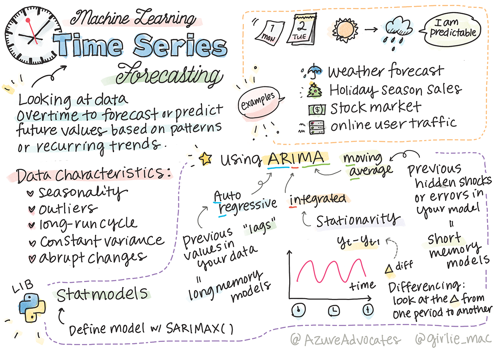
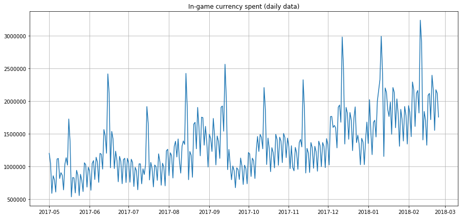
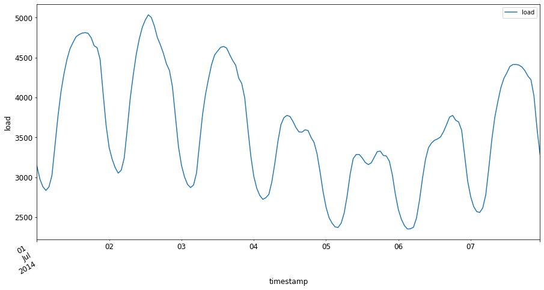

<!--
CO_OP_TRANSLATOR_METADATA:
{
  "original_hash": "3150d40f36a77857316ecaed5f31e856",
  "translation_date": "2025-08-29T17:01:56+00:00",
  "source_file": "7-TimeSeries/1-Introduction/README.md",
  "language_code": "mr"
}
-->
# टाइम सिरीज अंदाजाची ओळख



> स्केच नोट: [Tomomi Imura](https://www.twitter.com/girlie_mac)

या धड्यात आणि पुढील धड्यात तुम्ही टाइम सिरीज अंदाजाबद्दल थोडं शिकाल, जे मशीन लर्निंग वैज्ञानिकांच्या कौशल्यात एक महत्त्वाचा आणि उपयुक्त भाग आहे, पण इतर विषयांइतकं प्रसिद्ध नाही. टाइम सिरीज अंदाज म्हणजे एक प्रकारचा 'क्रिस्टल बॉल': एखाद्या व्हेरिएबलच्या (जसे की किंमत) मागील कामगिरीच्या आधारे, तुम्ही त्याची भविष्यातील संभाव्य किंमत अंदाज करू शकता.

[](https://youtu.be/cBojo1hsHiI "टाइम सिरीज अंदाजाची ओळख")

> 🎥 टाइम सिरीज अंदाजाबद्दल व्हिडिओ पाहण्यासाठी वरील प्रतिमेवर क्लिक करा

## [पूर्व-व्याख्यान प्रश्नमंजूषा](https://gray-sand-07a10f403.1.azurestaticapps.net/quiz/41/)

किंमती, इन्व्हेंटरी आणि पुरवठा साखळी समस्यांवर थेट उपयोग असल्यामुळे हे क्षेत्र व्यवसायासाठी उपयुक्त आणि मनोरंजक आहे. जरी भविष्यातील कामगिरी अधिक चांगल्या प्रकारे अंदाज करण्यासाठी डीप लर्निंग तंत्र वापरण्यास सुरुवात झाली असली तरी, टाइम सिरीज अंदाज अजूनही पारंपरिक मशीन लर्निंग तंत्रांनी खूप प्रभावित आहे.

> पेन स्टेटचा उपयुक्त टाइम सिरीज अभ्यासक्रम [येथे](https://online.stat.psu.edu/stat510/lesson/1) सापडतो.

## ओळख

समजा तुम्ही स्मार्ट पार्किंग मीटरचा एक संच व्यवस्थापित करता, जो वेळोवेळी किती वेळा वापरला जातो आणि किती वेळासाठी याचा डेटा प्रदान करतो.

> मीटरच्या मागील कामगिरीच्या आधारे, पुरवठा आणि मागणीच्या नियमांनुसार त्याची भविष्यातील किंमत अंदाज करता येईल का?

तुमचं लक्ष्य साध्य करण्यासाठी कधी कृती करायची हे अचूकपणे अंदाज करणं हे एक आव्हान आहे, ज्यावर टाइम सिरीज अंदाजाद्वारे काम करता येईल. व्यस्त वेळेत पार्किंग स्पॉट शोधत असलेल्या लोकांना जास्त शुल्क आकारणं त्यांना आनंदी करणार नाही, पण रस्ते स्वच्छ करण्यासाठी महसूल निर्माण करण्याचा हा एक खात्रीशीर मार्ग असेल!

चला, टाइम सिरीज अल्गोरिदमच्या काही प्रकारांचा अभ्यास करूया आणि डेटा स्वच्छ आणि तयार करण्यासाठी एक नोटबुक सुरू करूया. तुम्ही विश्लेषण करणार असलेला डेटा GEFCom2014 अंदाज स्पर्धेतून घेतला आहे. यात 2012 ते 2014 दरम्यान 3 वर्षांच्या तासागणिक वीज वापर आणि तापमान मूल्यांचा समावेश आहे. वीज वापर आणि तापमानाच्या ऐतिहासिक पॅटर्न्सच्या आधारे, तुम्ही वीज वापराचे भविष्यातील मूल्य अंदाज करू शकता.

या उदाहरणात, तुम्ही फक्त ऐतिहासिक वीज वापर डेटा वापरून एक वेळ पायरी पुढे अंदाज कसा करायचा ते शिकाल. मात्र, सुरुवात करण्यापूर्वी, पडद्यामागे काय चाललं आहे ते समजून घेणं उपयुक्त ठरेल.

## काही संज्ञा

'टाइम सिरीज' हा शब्द ऐकताना, तुम्हाला त्याचा वेगवेगळ्या संदर्भांमध्ये उपयोग समजून घेणं आवश्यक आहे.

🎓 **टाइम सिरीज**

गणितात, "टाइम सिरीज म्हणजे वेळेच्या क्रमाने अनुक्रमित (किंवा सूचीबद्ध किंवा ग्राफ केलेले) डेटा पॉइंट्सची मालिका. सर्वसामान्यपणे, टाइम सिरीज म्हणजे वेळेच्या समान अंतरावर घेतलेला अनुक्रम." टाइम सिरीजचं एक उदाहरण म्हणजे [Dow Jones Industrial Average](https://wikipedia.org/wiki/Time_series) चा दैनिक बंद मूल्य. टाइम सिरीज प्लॉट्स आणि सांख्यिकीय मॉडेलिंगचा उपयोग सिग्नल प्रोसेसिंग, हवामान अंदाज, भूकंप अंदाज आणि इतर क्षेत्रांमध्ये वारंवार केला जातो, जिथे घटना घडतात आणि डेटा पॉइंट्स वेळोवेळी प्लॉट करता येतात.

🎓 **टाइम सिरीज विश्लेषण**

टाइम सिरीज विश्लेषण म्हणजे वरील उल्लेखित टाइम सिरीज डेटाचं विश्लेषण. टाइम सिरीज डेटा वेगवेगळ्या स्वरूपात असू शकतो, ज्यात 'इंटरप्टेड टाइम सिरीज' समाविष्ट आहे, जे एखाद्या टाइम सिरीजच्या विकासामध्ये एखाद्या अडथळा आणणाऱ्या घटनेच्या आधी आणि नंतरच्या पॅटर्न्स शोधतं. टाइम सिरीजसाठी आवश्यक असलेलं विश्लेषण डेटाच्या स्वरूपावर अवलंबून असतं. टाइम सिरीज डेटा स्वतःच संख्यांची किंवा अक्षरांची मालिका असू शकतो.

विश्लेषणासाठी विविध पद्धती वापरल्या जातात, ज्यात फ्रिक्वेन्सी-डोमेन आणि टाइम-डोमेन, रेषीय आणि गैर-रेषीय, आणि अधिक समाविष्ट आहेत. [येथे अधिक जाणून घ्या](https://www.itl.nist.gov/div898/handbook/pmc/section4/pmc4.htm) या प्रकारच्या डेटाचं विश्लेषण कसं करायचं.

🎓 **टाइम सिरीज अंदाज**

टाइम सिरीज अंदाज म्हणजे मागील गोळा केलेल्या डेटाच्या पॅटर्न्सच्या आधारे भविष्यातील मूल्यांचा अंदाज करण्यासाठी मॉडेलचा उपयोग. जरी टाइम सिरीज डेटाचं अन्वेषण करण्यासाठी रिग्रेशन मॉडेल्स वापरणं शक्य असलं तरी, अशा डेटाचं विश्लेषण विशेष प्रकारच्या मॉडेल्सद्वारे चांगल्या प्रकारे केलं जातं.

टाइम सिरीज डेटा म्हणजे क्रमाने व्यवस्थित निरीक्षणांची यादी, जी रेषीय रिग्रेशनद्वारे विश्लेषण करता येणाऱ्या डेटापेक्षा वेगळी आहे. सर्वात सामान्य मॉडेल म्हणजे ARIMA, ज्याचा अर्थ "Autoregressive Integrated Moving Average" आहे.

[ARIMA मॉडेल्स](https://online.stat.psu.edu/stat510/lesson/1/1.1) "सध्याच्या मूल्याला मागील मूल्ये आणि मागील अंदाज त्रुटींसोबत जोडतात." हे टाइम-डोमेन डेटाचं विश्लेषण करण्यासाठी सर्वात योग्य आहेत, जिथे डेटा वेळोवेळी क्रमाने असतो.

> ARIMA मॉडेल्सचे अनेक प्रकार आहेत, ज्याबद्दल तुम्ही [येथे](https://people.duke.edu/~rnau/411arim.htm) अधिक जाणून घेऊ शकता आणि पुढील धड्यात तुम्ही त्यावर काम कराल.

पुढील धड्यात, तुम्ही [Univariate Time Series](https://itl.nist.gov/div898/handbook/pmc/section4/pmc44.htm) वापरून ARIMA मॉडेल तयार कराल, जे एका व्हेरिएबलवर लक्ष केंद्रित करतं, ज्याचं मूल्य वेळोवेळी बदलतं. अशा प्रकारच्या डेटाचं एक उदाहरण म्हणजे [हा डेटासेट](https://itl.nist.gov/div898/handbook/pmc/section4/pmc4411.htm), जो Mauna Loa Observatory मध्ये मासिक CO2 एकाग्रता नोंदवतो:

|  CO2   | YearMonth | Year  | Month |
| :----: | :-------: | :---: | :---: |
| 330.62 |  1975.04  | 1975  |   1   |
| 331.40 |  1975.13  | 1975  |   2   |
| 331.87 |  1975.21  | 1975  |   3   |
| 333.18 |  1975.29  | 1975  |   4   |
| 333.92 |  1975.38  | 1975  |   5   |
| 333.43 |  1975.46  | 1975  |   6   |
| 331.85 |  1975.54  | 1975  |   7   |
| 330.01 |  1975.63  | 1975  |   8   |
| 328.51 |  1975.71  | 1975  |   9   |
| 328.41 |  1975.79  | 1975  |  10   |
| 329.25 |  1975.88  | 1975  |  11   |
| 330.97 |  1975.96  | 1975  |  12   |

✅ या डेटासेटमध्ये वेळोवेळी बदलणारा व्हेरिएबल ओळखा.

## टाइम सिरीज डेटाचे विचार करण्यायोग्य गुणधर्म

टाइम सिरीज डेटा पाहताना, तुम्हाला [काही गुणधर्म](https://online.stat.psu.edu/stat510/lesson/1/1.1) दिसू शकतात, ज्यांचा विचार करणे आणि त्यांना कमी करणे आवश्यक आहे, जेणेकरून त्याचे पॅटर्न्स चांगल्या प्रकारे समजता येतील. जर तुम्ही टाइम सिरीज डेटाला 'सिग्नल' म्हणून विचार करत असाल, ज्याचं तुम्हाला विश्लेषण करायचं आहे, तर हे गुणधर्म 'नॉईज' म्हणून विचार करता येतील. सांख्यिकीय तंत्रांचा उपयोग करून तुम्हाला हे 'नॉईज' कमी करावं लागेल.

टाइम सिरीजसोबत काम करण्यासाठी तुम्हाला खालील संकल्पना माहित असणे आवश्यक आहे:

🎓 **ट्रेंड्स**

ट्रेंड्स म्हणजे वेळोवेळी मोजता येणारी वाढ किंवा घट. [अधिक वाचा](https://machinelearningmastery.com/time-series-trends-in-python). टाइम सिरीजच्या संदर्भात, ट्रेंड्स कसे वापरायचे आणि आवश्यक असल्यास कसे काढायचे याबद्दल आहे.

🎓 **[सीझनॅलिटी](https://machinelearningmastery.com/time-series-seasonality-with-python/)**

सीझनॅलिटी म्हणजे कालांतराने होणारे चढ-उतार, जसे की सुट्टीच्या काळातील विक्रीवर होणारा परिणाम. [येथे पहा](https://itl.nist.gov/div898/handbook/pmc/section4/pmc443.htm) की वेगवेगळ्या प्रकारचे प्लॉट्स डेटामधील सीझनॅलिटी कशी दर्शवतात.

🎓 **आउटलायर्स**

आउटलायर्स म्हणजे मानक डेटा व्हेरिएन्सपासून खूप दूर असलेले डेटा पॉइंट्स.

🎓 **लांब-कालावधीचा चक्र**

सीझनॅलिटीपासून स्वतंत्र, डेटा लांब-कालावधीचा चक्र दर्शवू शकतो, जसे की आर्थिक मंदी जी एका वर्षापेक्षा जास्त काळ टिकते.

🎓 **सतत व्हेरिएन्स**

काही डेटा वेळोवेळी सतत चढ-उतार दर्शवतो, जसे की दिवस आणि रात्रीचा ऊर्जा वापर.

🎓 **अचानक बदल**

डेटा अचानक बदल दर्शवू शकतो, ज्यासाठी अधिक विश्लेषण आवश्यक असू शकतं. उदाहरणार्थ, COVID मुळे व्यवसाय अचानक बंद झाल्यामुळे डेटामध्ये बदल झाले.

✅ येथे एक [टाइम सिरीज प्लॉट](https://www.kaggle.com/kashnitsky/topic-9-part-1-time-series-analysis-in-python) आहे, जो काही वर्षांमध्ये दैनिक इन-गेम करन्सी खर्च दर्शवतो. तुम्ही वरील सूचीतील कोणतेही गुणधर्म या डेटामध्ये ओळखू शकता का?



## व्यायाम - वीज वापर डेटा वापरून सुरुवात करा

चला, मागील वापराच्या आधारे भविष्यातील वीज वापराचा अंदाज करण्यासाठी टाइम सिरीज मॉडेल तयार करूया.

> या उदाहरणातील डेटा GEFCom2014 अंदाज स्पर्धेतून घेतला आहे. यात 2012 ते 2014 दरम्यान 3 वर्षांच्या तासागणिक वीज वापर आणि तापमान मूल्यांचा समावेश आहे.
>
> Tao Hong, Pierre Pinson, Shu Fan, Hamidreza Zareipour, Alberto Troccoli आणि Rob J. Hyndman, "Probabilistic energy forecasting: Global Energy Forecasting Competition 2014 and beyond", International Journal of Forecasting, vol.32, no.3, pp 896-913, July-September, 2016.

1. या धड्याच्या `working` फोल्डरमध्ये, _notebook.ipynb_ फाइल उघडा. डेटा लोड आणि व्हिज्युअलाइझ करण्यात मदत करणाऱ्या लायब्ररीज जोडा.

    ```python
    import os
    import matplotlib.pyplot as plt
    from common.utils import load_data
    %matplotlib inline
    ```

    लक्षात ठेवा, तुम्ही समाविष्ट केलेल्या `common` फोल्डरमधील फाइल्स वापरत आहात, ज्या तुमचं वातावरण सेट करतात आणि डेटा डाउनलोड हाताळतात.

2. पुढे, `load_data()` आणि `head()` कॉल करून डेटा डेटा फ्रेम म्हणून तपासा:

    ```python
    data_dir = './data'
    energy = load_data(data_dir)[['load']]
    energy.head()
    ```

    तुम्हाला दिसेल की दोन कॉलम आहेत, जे तारीख आणि वीज वापर दर्शवतात:

    |                     |  load  |
    | :-----------------: | :----: |
    | 2012-01-01 00:00:00 | 2698.0 |
    | 2012-01-01 01:00:00 | 2558.0 |
    | 2012-01-01 02:00:00 | 2444.0 |
    | 2012-01-01 03:00:00 | 2402.0 |
    | 2012-01-01 04:00:00 | 2403.0 |

3. आता, `plot()` कॉल करून डेटा प्लॉट करा:

    ```python
    energy.plot(y='load', subplots=True, figsize=(15, 8), fontsize=12)
    plt.xlabel('timestamp', fontsize=12)
    plt.ylabel('load', fontsize=12)
    plt.show()
    ```

    

4. आता, 2014 च्या जुलै महिन्याचा पहिला आठवडा प्लॉट करा, `energy` मध्ये `[from date]: [to date]` पॅटर्न म्हणून इनपुट प्रदान करून:

    ```python
    energy['2014-07-01':'2014-07-07'].plot(y='load', subplots=True, figsize=(15, 8), fontsize=12)
    plt.xlabel('timestamp', fontsize=12)
    plt.ylabel('load', fontsize=12)
    plt.show()
    ```

    

    एक सुंदर प्लॉट! या प्लॉट्सकडे पाहा आणि तुम्ही वरील सूचीतील कोणतेही गुणधर्म ओळखू शकता का ते तपासा. डेटा व्हिज्युअलाइझ करून आपण काय निष्कर्ष काढू शकतो?

पुढील धड्यात, तुम्ही ARIMA मॉडेल तयार करून काही अंदाज तयार कराल.

---

## 🚀चॅलेंज

तुम्ही विचार करू शकता अशा सर्व उद्योग आणि चौकशीच्या क्षेत्रांची यादी तयार करा, ज्यांना टाइम सिरीज अंदाजाचा फायदा होईल. तुम्ही या तंत्रांचा उपयोग कला, अर्थमिती, पर्यावरणशास्त्र, किरकोळ विक्री, उद्योग, वित्त अशा क्षेत्रांमध्ये कसा होईल याचा विचार करू शकता का? आणखी कुठे?

## [व्याख्यानानंतरची प्रश्नमंजूषा](https://gray-sand-07a10f403.1.azurestaticapps.net/quiz/42/)

## पुनरावलोकन आणि स्व-अभ्यास

जरी आम्ही येथे त्यांचा समावेश करणार नाही, तरी क्लासिक टाइम सिरीज अंदाज पद्धतींना सुधारण्यासाठी कधीकधी न्यूरल नेटवर्क्सचा उपयोग केला जातो. [या लेखात](https://medium.com/microsoftazure/neural-networks-for-forecasting-financial-and-economic-time-series-6aca370ff412) त्याबद्दल अधिक वाचा.

## असाइनमेंट

[अधिक टाइम सिरीज व्हिज्युअलाइझ करा](assignment.md)

---

**अस्वीकरण**:  
हा दस्तऐवज AI भाषांतर सेवा [Co-op Translator](https://github.com/Azure/co-op-translator) वापरून भाषांतरित करण्यात आला आहे. आम्ही अचूकतेसाठी प्रयत्नशील असलो तरी, कृपया लक्षात ठेवा की स्वयंचलित भाषांतरे त्रुटी किंवा अचूकतेच्या अभावाने युक्त असू शकतात. मूळ भाषेतील दस्तऐवज हा अधिकृत स्रोत मानला जावा. महत्त्वाच्या माहितीसाठी, व्यावसायिक मानवी भाषांतराची शिफारस केली जाते. या भाषांतराचा वापर करून उद्भवलेल्या कोणत्याही गैरसमज किंवा चुकीच्या अर्थासाठी आम्ही जबाबदार राहणार नाही.