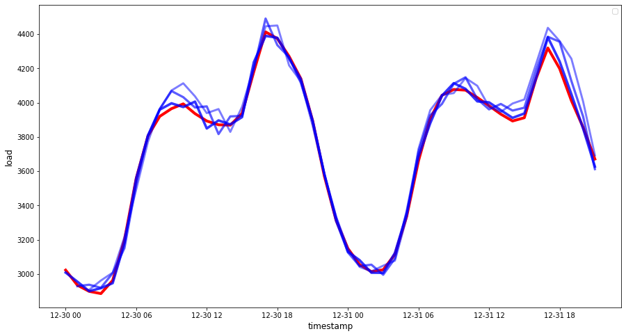

<!--
CO_OP_TRANSLATOR_METADATA:
{
  "original_hash": "2f400075e003e749fdb0d6b3b4787a99",
  "translation_date": "2025-08-29T16:57:00+00:00",
  "source_file": "7-TimeSeries/2-ARIMA/README.md",
  "language_code": "mr"
}
-->
# ARIMA वापरून टाइम सिरीज अंदाज

मागील धड्यात, तुम्ही टाइम सिरीज अंदाजाबद्दल थोडं शिकला आणि एका कालावधीत विद्युत लोडच्या चढ-उतारांचे डेटा सेट लोड केले.

[](https://youtu.be/IUSk-YDau10 "ARIMA ची ओळख")

> 🎥 वरील प्रतिमेवर क्लिक करा: ARIMA मॉडेल्सची संक्षिप्त ओळख. उदाहरण R मध्ये दिले आहे, परंतु संकल्पना सार्वत्रिक आहेत.

## [पूर्व-व्याख्यान प्रश्नमंजूषा](https://gray-sand-07a10f403.1.azurestaticapps.net/quiz/43/)

## परिचय

या धड्यात, तुम्ही [ARIMA: *A*uto*R*egressive *I*ntegrated *M*oving *A*verage](https://wikipedia.org/wiki/Autoregressive_integrated_moving_average) वापरून मॉडेल्स तयार करण्याचा एक विशिष्ट मार्ग शोधाल. ARIMA मॉडेल्स विशेषतः [non-stationarity](https://wikipedia.org/wiki/Stationary_process) दर्शवणाऱ्या डेटासाठी उपयुक्त आहेत.

## सामान्य संकल्पना

ARIMA वापरण्यासाठी, तुम्हाला काही संकल्पना माहित असणे आवश्यक आहे:

- 🎓 **स्टेशनॅरिटी**. सांख्यिकी संदर्भात, स्टेशनॅरिटी म्हणजे डेटा ज्याचे वितरण वेळेत बदलल्यावर बदलत नाही. नॉन-स्टेशनरी डेटा, मग, ट्रेंडमुळे चढ-उतार दर्शवतो ज्याचे विश्लेषण करण्यासाठी त्याचे रूपांतर करणे आवश्यक आहे. उदाहरणार्थ, हंगामीपणा डेटामध्ये चढ-उतार आणू शकतो आणि 'हंगामी-डिफरन्सिंग' प्रक्रियेद्वारे काढून टाकला जाऊ शकतो.

- 🎓 **[डिफरन्सिंग](https://wikipedia.org/wiki/Autoregressive_integrated_moving_average#Differencing)**. सांख्यिकी संदर्भात, डिफरन्सिंग म्हणजे नॉन-स्टेशनरी डेटा स्टेशनरी बनवण्यासाठी त्याचा नॉन-कॉन्स्टंट ट्रेंड काढून टाकण्याची प्रक्रिया. "डिफरन्सिंग टाइम सिरीजच्या पातळीतील बदल काढून टाकते, ट्रेंड आणि हंगामीपणा काढून टाकते आणि परिणामी टाइम सिरीजचा सरासरी स्थिर करते." [Shixiong et al यांचे पेपर](https://arxiv.org/abs/1904.07632)

## टाइम सिरीजच्या संदर्भात ARIMA

ARIMA च्या भागांचे विश्लेषण करून पाहूया जेणेकरून ते टाइम सिरीज मॉडेल करण्यात कसे मदत करते आणि त्यावर अंदाज कसा लावता येतो हे समजेल.

- **AR - ऑटोरेग्रेसिव्हसाठी**. ऑटोरेग्रेसिव्ह मॉडेल्स, नावाप्रमाणेच, तुमच्या डेटामधील मागील मूल्यांचे विश्लेषण करण्यासाठी 'मागे' पाहतात आणि त्यांच्याबद्दल गृहितके मांडतात. या मागील मूल्यांना 'लॅग्स' म्हणतात. उदाहरणार्थ, मासिक पेन्सिल विक्री दर्शवणारा डेटा. प्रत्येक महिन्याची विक्री एकूण डेटासेटमधील 'इव्हॉल्विंग व्हेरिएबल' मानली जाईल. हे मॉडेल असे तयार केले जाते की "इव्हॉल्विंग व्हेरिएबल ऑफ इंटरेस्ट त्याच्या स्वतःच्या लॅग्ड (म्हणजे, पूर्वीच्या) मूल्यांवर रिग्रेस केले जाते." [विकिपीडिया](https://wikipedia.org/wiki/Autoregressive_integrated_moving_average)

- **I - इंटिग्रेटेडसाठी**. 'ARMA' मॉडेल्ससारखेच, ARIMA मधील 'I' त्याच्या *[इंटिग्रेटेड](https://wikipedia.org/wiki/Order_of_integration)* पैलूला संदर्भित करते. नॉन-स्टेशनरी काढून टाकण्यासाठी डिफरन्सिंग स्टेप्स लागू केल्यावर डेटा 'इंटिग्रेटेड' होतो.

- **MA - मूव्हिंग अॅव्हरेजसाठी**. या मॉडेलचा [मूव्हिंग-अॅव्हरेज](https://wikipedia.org/wiki/Moving-average_model) पैलू आउटपुट व्हेरिएबलला संदर्भित करतो जो लॅग्सच्या वर्तमान आणि मागील मूल्यांचे निरीक्षण करून ठरवला जातो.

सारांश: ARIMA टाइम सिरीज डेटाच्या विशेष स्वरूपाशी शक्य तितके जवळून जुळणारे मॉडेल तयार करण्यासाठी वापरले जाते.

## व्यायाम - ARIMA मॉडेल तयार करा

या धड्याच्या [_/working_](https://github.com/microsoft/ML-For-Beginners/tree/main/7-TimeSeries/2-ARIMA/working) फोल्डरमध्ये जा आणि [_notebook.ipynb_](https://github.com/microsoft/ML-For-Beginners/blob/main/7-TimeSeries/2-ARIMA/working/notebook.ipynb) फाइल शोधा.

1. `statsmodels` Python लायब्ररी लोड करण्यासाठी नोटबुक चालवा; तुम्हाला ARIMA मॉडेल्ससाठी याची आवश्यकता असेल.

1. आवश्यक लायब्ररी लोड करा.

1. आता, डेटा प्लॉट करण्यासाठी उपयुक्त आणखी काही लायब्ररी लोड करा:

    ```python
    import os
    import warnings
    import matplotlib.pyplot as plt
    import numpy as np
    import pandas as pd
    import datetime as dt
    import math

    from pandas.plotting import autocorrelation_plot
    from statsmodels.tsa.statespace.sarimax import SARIMAX
    from sklearn.preprocessing import MinMaxScaler
    from common.utils import load_data, mape
    from IPython.display import Image

    %matplotlib inline
    pd.options.display.float_format = '{:,.2f}'.format
    np.set_printoptions(precision=2)
    warnings.filterwarnings("ignore") # specify to ignore warning messages
    ```

1. `/data/energy.csv` फाइलमधून डेटा Pandas डेटा फ्रेममध्ये लोड करा आणि त्यावर नजर टाका:

    ```python
    energy = load_data('./data')[['load']]
    energy.head(10)
    ```

1. जानेवारी 2012 ते डिसेंबर 2014 पर्यंत उपलब्ध ऊर्जा डेटा प्लॉट करा. मागील धड्यात आपण हा डेटा पाहिल्यामुळे काही आश्चर्य वाटणार नाही:

    ```python
    energy.plot(y='load', subplots=True, figsize=(15, 8), fontsize=12)
    plt.xlabel('timestamp', fontsize=12)
    plt.ylabel('load', fontsize=12)
    plt.show()
    ```

    आता, मॉडेल तयार करूया!

### प्रशिक्षण आणि चाचणी डेटासेट तयार करा

आता तुमचा डेटा लोड झाला आहे, त्यामुळे तुम्ही तो ट्रेन आणि टेस्ट सेटमध्ये विभाजित करू शकता. तुम्ही तुमच्या ट्रेन सेटवर मॉडेल प्रशिक्षण द्याल. नेहमीप्रमाणे, मॉडेल प्रशिक्षण पूर्ण झाल्यानंतर, तुम्ही टेस्ट सेट वापरून त्याची अचूकता मूल्यांकन कराल. ट्रेनिंग सेटमधून टेस्ट सेट नंतरच्या कालावधीचा समावेश करतो याची खात्री करणे आवश्यक आहे जेणेकरून मॉडेलला भविष्यातील कालावधीची माहिती मिळणार नाही.

1. सप्टेंबर 1 ते ऑक्टोबर 31, 2014 पर्यंत दोन महिन्यांचा कालावधी ट्रेनिंग सेटसाठी वाटप करा. टेस्ट सेटमध्ये नोव्हेंबर 1 ते डिसेंबर 31, 2014 चा दोन महिन्यांचा कालावधी समाविष्ट असेल:

    ```python
    train_start_dt = '2014-11-01 00:00:00'
    test_start_dt = '2014-12-30 00:00:00'
    ```

    हा डेटा ऊर्जा वापराचा दैनिक उपभोग दर्शवतो, त्यामुळे एक मजबूत हंगामी नमुना आहे, परंतु उपभोग अलीकडील दिवसांतील उपभोगाशी सर्वाधिक समान आहे.

1. फरकांचे व्हिज्युअलायझेशन करा:

    ```python
    energy[(energy.index < test_start_dt) & (energy.index >= train_start_dt)][['load']].rename(columns={'load':'train'}) \
        .join(energy[test_start_dt:][['load']].rename(columns={'load':'test'}), how='outer') \
        .plot(y=['train', 'test'], figsize=(15, 8), fontsize=12)
    plt.xlabel('timestamp', fontsize=12)
    plt.ylabel('load', fontsize=12)
    plt.show()
    ```

    

    त्यामुळे, डेटा प्रशिक्षणासाठी तुलनेने छोट्या विंडोचा वापर पुरेसा असावा.

    > टीप: आम्ही ARIMA मॉडेल फिट करण्यासाठी वापरत असलेल्या फंक्शनमध्ये फिटिंग दरम्यान इन-सॅम्पल व्हॅलिडेशन वापरले जाते, त्यामुळे आम्ही व्हॅलिडेशन डेटा वगळू.

### प्रशिक्षणासाठी डेटा तयार करा

आता, तुम्हाला तुमचा डेटा फिल्टर आणि स्केल करून प्रशिक्षणासाठी तयार करणे आवश्यक आहे. तुमच्या डेटासेटला फक्त आवश्यक कालावधी आणि स्तंभ समाविष्ट करण्यासाठी फिल्टर करा आणि डेटा 0,1 अंतरात प्रोजेक्ट करण्यासाठी स्केलिंग करा.

1. मूळ डेटासेट फिल्टर करा जेणेकरून फक्त वरील नमूद कालावधी प्रति सेट आणि फक्त आवश्यक 'load' स्तंभ आणि तारीख समाविष्ट असेल:

    ```python
    train = energy.copy()[(energy.index >= train_start_dt) & (energy.index < test_start_dt)][['load']]
    test = energy.copy()[energy.index >= test_start_dt][['load']]

    print('Training data shape: ', train.shape)
    print('Test data shape: ', test.shape)
    ```

    तुम्ही डेटाचा आकार पाहू शकता:

    ```output
    Training data shape:  (1416, 1)
    Test data shape:  (48, 1)
    ```

1. डेटा (0, 1) श्रेणीत स्केल करा.

    ```python
    scaler = MinMaxScaler()
    train['load'] = scaler.fit_transform(train)
    train.head(10)
    ```

1. मूळ डेटा आणि स्केल केलेला डेटा व्हिज्युअलायझेशन करा:

    ```python
    energy[(energy.index >= train_start_dt) & (energy.index < test_start_dt)][['load']].rename(columns={'load':'original load'}).plot.hist(bins=100, fontsize=12)
    train.rename(columns={'load':'scaled load'}).plot.hist(bins=100, fontsize=12)
    plt.show()
    ```

    

    > मूळ डेटा

    

    > स्केल केलेला डेटा

1. आता तुम्ही स्केल केलेला डेटा कॅलिब्रेट केला आहे, तुम्ही टेस्ट डेटा स्केल करू शकता:

    ```python
    test['load'] = scaler.transform(test)
    test.head()
    ```

### ARIMA लागू करा

आता ARIMA लागू करण्याची वेळ आली आहे! तुम्ही यापूर्वी स्थापित केलेल्या `statsmodels` लायब्ररीचा वापर कराल.

आता तुम्हाला काही पायऱ्या फॉलो कराव्या लागतील:

   1. `SARIMAX()` कॉल करून मॉडेल परिभाषित करा आणि मॉडेल पॅरामीटर्स: p, d, आणि q पॅरामीटर्स, आणि P, D, आणि Q पॅरामीटर्स पास करा.
   2. `fit()` फंक्शन कॉल करून ट्रेनिंग डेटासाठी मॉडेल तयार करा.
   3. `forecast()` फंक्शन कॉल करून अंदाज तयार करा आणि अंदाज लावण्यासाठी स्टेप्स (होरायझन) निर्दिष्ट करा.

> 🎓 हे सर्व पॅरामीटर्स कशासाठी आहेत? ARIMA मॉडेलमध्ये 3 पॅरामीटर्स असतात जे टाइम सिरीजचे मुख्य पैलू मॉडेल करण्यात मदत करतात: हंगामीपणा, ट्रेंड, आणि आवाज. हे पॅरामीटर्स आहेत:

`p`: मॉडेलच्या ऑटो-रेग्रेसिव्ह पैलूसाठी संबंधित पॅरामीटर, जो *मागील* मूल्यांचा समावेश करतो.
`d`: मॉडेलच्या इंटिग्रेटेड भागाशी संबंधित पॅरामीटर, जो टाइम सिरीजवर लागू करावयाच्या *डिफरन्सिंग* (🎓 डिफरन्सिंग लक्षात ठेवा 👆?) च्या प्रमाणावर परिणाम करतो.
`q`: मॉडेलच्या मूव्हिंग-अॅव्हरेज भागाशी संबंधित पॅरामीटर.

> टीप: जर तुमच्या डेटामध्ये हंगामी पैलू असेल - जो या डेटामध्ये आहे - , तर आपण हंगामी ARIMA मॉडेल (SARIMA) वापरतो. अशा परिस्थितीत तुम्हाला आणखी एक पॅरामीटर्स सेट वापरावे लागेल: `P`, `D`, आणि `Q` जे `p`, `d`, आणि `q` प्रमाणेच असोसिएशन वर्णन करतात, परंतु मॉडेलच्या हंगामी घटकांशी संबंधित आहेत.

1. तुमचा प्राधान्य होरायझन मूल्य सेट करा. चला 3 तासांचा प्रयत्न करूया:

    ```python
    # Specify the number of steps to forecast ahead
    HORIZON = 3
    print('Forecasting horizon:', HORIZON, 'hours')
    ```

    ARIMA मॉडेलच्या पॅरामीटर्ससाठी सर्वोत्तम मूल्ये निवडणे आव्हानात्मक असू शकते कारण ते काहीसे व्यक्तिनिष्ठ आणि वेळखाऊ आहे. तुम्ही [`pyramid` लायब्ररी](https://alkaline-ml.com/pmdarima/0.9.0/modules/generated/pyramid.arima.auto_arima.html) मधील `auto_arima()` फंक्शन वापरण्याचा विचार करू शकता.

1. सध्या चांगले मॉडेल शोधण्यासाठी काही मॅन्युअल निवडी करून पहा.

    ```python
    order = (4, 1, 0)
    seasonal_order = (1, 1, 0, 24)

    model = SARIMAX(endog=train, order=order, seasonal_order=seasonal_order)
    results = model.fit()

    print(results.summary())
    ```

    निकालांची एक टेबल प्रिंट केली जाते.

तुम्ही तुमचं पहिलं मॉडेल तयार केलं आहे! आता आपण त्याचे मूल्यांकन करण्याचा मार्ग शोधणे आवश्यक आहे.

### तुमच्या मॉडेलचे मूल्यांकन करा

तुमच्या मॉडेलचे मूल्यांकन करण्यासाठी, तुम्ही तथाकथित `walk forward` व्हॅलिडेशन करू शकता. प्रत्यक्षात, टाइम सिरीज मॉडेल्स प्रत्येक वेळी नवीन डेटा उपलब्ध झाल्यावर पुन्हा प्रशिक्षण दिले जातात. यामुळे मॉडेलला प्रत्येक वेळेच्या टप्प्यावर सर्वोत्तम अंदाज लावता येतो.

या तंत्राचा वापर करून टाइम सिरीजच्या सुरुवातीपासून, ट्रेनिंग डेटासेटवर मॉडेल प्रशिक्षण द्या. मग पुढील वेळ टप्प्यावर अंदाज तयार करा. अंदाज ज्ञात मूल्याच्या विरुद्ध मूल्यांकन केला जातो. ट्रेनिंग सेट नंतर ज्ञात मूल्य समाविष्ट करण्यासाठी विस्तारित केला जातो आणि प्रक्रिया पुन्हा केली जाते.

> टीप: अधिक कार्यक्षम प्रशिक्षणासाठी तुम्ही ट्रेनिंग सेट विंडो निश्चित ठेवावी जेणेकरून प्रत्येक वेळी तुम्ही ट्रेनिंग सेटमध्ये नवीन निरीक्षण जोडता, तुम्ही सेटच्या सुरुवातीपासून निरीक्षण काढता.

ही प्रक्रिया मॉडेल प्रत्यक्षात कशी कार्य करेल याचे अधिक मजबूत अंदाज प्रदान करते. तथापि, इतकी मॉडेल्स तयार करण्याच्या संगणकीय खर्चासह येते. जर डेटा लहान असेल किंवा मॉडेल सोपे असेल तर हे स्वीकार्य आहे, परंतु मोठ्या प्रमाणावर समस्या होऊ शकते.

टाइम सिरीज मॉडेल मूल्यांकनासाठी वॉक-फॉरवर्ड व्हॅलिडेशन हे सर्वोत्तम मानक आहे आणि तुमच्या स्वतःच्या प्रकल्पांसाठी शिफारस केली जाते.

1. प्रत्येक HORIZON स्टेपसाठी टेस्ट डेटा पॉइंट तयार करा.

    ```python
    test_shifted = test.copy()

    for t in range(1, HORIZON+1):
        test_shifted['load+'+str(t)] = test_shifted['load'].shift(-t, freq='H')

    test_shifted = test_shifted.dropna(how='any')
    test_shifted.head(5)
    ```

    |            |          | load | load+1 | load+2 |
    | ---------- | -------- | ---- | ------ | ------ |
    | 2014-12-30 | 00:00:00 | 0.33 | 0.29   | 0.27   |
    | 2014-12-30 | 01:00:00 | 0.29 | 0.27   | 0.27   |
    | 2014-12-30 | 02:00:00 | 0.27 | 0.27   | 0.30   |
    | 2014-12-30 | 03:00:00 | 0.27 | 0.30   | 0.41   |
    | 2014-12-30 | 04:00:00 | 0.30 | 0.41   | 0.57   |

    डेटा त्याच्या होरायझन पॉइंटनुसार आडव्या दिशेने शिफ्ट केला जातो.

1. स्लाइडिंग विंडो पद्धतीचा वापर करून टेस्ट डेटावर अंदाज तयार करा, टेस्ट डेटाच्या लांबीच्या आकारात लूप करा:

    ```python
    %%time
    training_window = 720 # dedicate 30 days (720 hours) for training

    train_ts = train['load']
    test_ts = test_shifted

    history = [x for x in train_ts]
    history = history[(-training_window):]

    predictions = list()

    order = (2, 1, 0)
    seasonal_order = (1, 1, 0, 24)

    for t in range(test_ts.shape[0]):
        model = SARIMAX(endog=history, order=order, seasonal_order=seasonal_order)
        model_fit = model.fit()
        yhat = model_fit.forecast(steps = HORIZON)
        predictions.append(yhat)
        obs = list(test_ts.iloc[t])
        # move the training window
        history.append(obs[0])
        history.pop(0)
        print(test_ts.index[t])
        print(t+1, ': predicted =', yhat, 'expected =', obs)
    ```

    तुम्ही प्रशिक्षण होताना पाहू शकता:

    ```output
    2014-12-30 00:00:00
    1 : predicted = [0.32 0.29 0.28] expected = [0.32945389435989236, 0.2900626678603402, 0.2739480752014323]

    2014-12-30 01:00:00
    2 : predicted = [0.3  0.29 0.3 ] expected = [0.2900626678603402, 0.2739480752014323, 0.26812891674127126]

    2014-12-30 02:00:00
    3 : predicted = [0.27 0.28 0.32] expected = [0.2739480752014323, 0.26812891674127126, 0.3025962399283795]
    ```

1. अंदाज वास्तविक लोडशी तुलना करा:

    ```python
    eval_df = pd.DataFrame(predictions, columns=['t+'+str(t) for t in range(1, HORIZON+1)])
    eval_df['timestamp'] = test.index[0:len(test.index)-HORIZON+1]
    eval_df = pd.melt(eval_df, id_vars='timestamp', value_name='prediction', var_name='h')
    eval_df['actual'] = np.array(np.transpose(test_ts)).ravel()
    eval_df[['prediction', 'actual']] = scaler.inverse_transform(eval_df[['prediction', 'actual']])
    eval_df.head()
    ```

    आउटपुट
    |     |            | timestamp | h   | prediction | actual   |
    | --- | ---------- | --------- | --- | ---------- | -------- |
    | 0   | 2014-12-30 | 00:00:00  | t+1 | 3,008.74   | 3,023.00 |
    | 1   | 2014-12-30 | 01:00:00  | t+1 | 2,955.53   | 2,935.00 |
    | 2   | 2014-12-30 | 02:00:00  | t+1 | 2,900.17   | 2,899.00 |
    | 3   | 2014-12-30 | 03:00:00  | t+1 | 2,917.69   | 2,886.00 |
    | 4   | 2014-12-30 | 04:00:00  | t+1 | 2,946.99   | 2,963.00 |

    तासागणिक डेटाचा अंदाज, वास्तविक लोडशी तुलना करा. हे किती अचूक आहे?

### मॉडेलची अचूकता तपासा

तुमच्या सर्व अंदाजांवर मॉडेलची mean absolute percentage error (MAPE) तपासून त्याची अचूकता तपासा.
> **🧮 गणित दाखवा**
>
> 
>
> [MAPE](https://www.linkedin.com/pulse/what-mape-mad-msd-time-series-allameh-statistics/) वापरून अंदाज अचूकता दाखवली जाते, जी वरील सूत्राने परिभाषित केलेली आहे. प्रत्यक्ष आणि अंदाजित यामधील फरक प्रत्यक्षावर विभागला जातो.

"या गणनेतील पूर्णांक मूल्य प्रत्येक अंदाजित वेळेसाठी जमा केले जाते आणि फिट केलेल्या बिंदूंच्या संख्येने n विभागले जाते." [wikipedia](https://wikipedia.org/wiki/Mean_absolute_percentage_error)
1. कोडमध्ये समीकरण व्यक्त करा:

    ```python
    if(HORIZON > 1):
        eval_df['APE'] = (eval_df['prediction'] - eval_df['actual']).abs() / eval_df['actual']
        print(eval_df.groupby('h')['APE'].mean())
    ```

1. एका टप्प्याचा MAPE काढा:

    ```python
    print('One step forecast MAPE: ', (mape(eval_df[eval_df['h'] == 't+1']['prediction'], eval_df[eval_df['h'] == 't+1']['actual']))*100, '%')
    ```

    एका टप्प्याचा अंदाज MAPE:  0.5570581332313952 %

1. बहु-टप्पा अंदाजाचा MAPE प्रिंट करा:

    ```python
    print('Multi-step forecast MAPE: ', mape(eval_df['prediction'], eval_df['actual'])*100, '%')
    ```

    ```output
    Multi-step forecast MAPE:  1.1460048657704118 %
    ```

    एक चांगला कमी आकडा सर्वोत्तम आहे: लक्षात ठेवा की 10 चा MAPE असलेला अंदाज 10% ने चुकतो.

1. पण नेहमीप्रमाणे, अशा प्रकारचे अचूकतेचे मोजमाप दृश्य स्वरूपात पाहणे सोपे असते, म्हणून चला ते प्लॉट करूया:

    ```python
     if(HORIZON == 1):
        ## Plotting single step forecast
        eval_df.plot(x='timestamp', y=['actual', 'prediction'], style=['r', 'b'], figsize=(15, 8))

    else:
        ## Plotting multi step forecast
        plot_df = eval_df[(eval_df.h=='t+1')][['timestamp', 'actual']]
        for t in range(1, HORIZON+1):
            plot_df['t+'+str(t)] = eval_df[(eval_df.h=='t+'+str(t))]['prediction'].values

        fig = plt.figure(figsize=(15, 8))
        ax = plt.plot(plot_df['timestamp'], plot_df['actual'], color='red', linewidth=4.0)
        ax = fig.add_subplot(111)
        for t in range(1, HORIZON+1):
            x = plot_df['timestamp'][(t-1):]
            y = plot_df['t+'+str(t)][0:len(x)]
            ax.plot(x, y, color='blue', linewidth=4*math.pow(.9,t), alpha=math.pow(0.8,t))

        ax.legend(loc='best')

    plt.xlabel('timestamp', fontsize=12)
    plt.ylabel('load', fontsize=12)
    plt.show()
    ```

    

🏆 एक अतिशय छान प्लॉट, जो चांगल्या अचूकतेसह मॉडेल दर्शवतो. छान काम केले!

---

## 🚀चॅलेंज

टाइम सिरीज मॉडेलची अचूकता तपासण्याचे विविध मार्ग शोधा. या धड्यात आपण MAPE वर चर्चा केली आहे, पण तुम्ही इतर कोणते पद्धती वापरू शकता? त्यांचा अभ्यास करा आणि त्यावर टिपण्या लिहा. [येथे](https://otexts.com/fpp2/accuracy.html) एक उपयुक्त दस्तऐवज सापडू शकतो.

## [पाठानंतरचा क्विझ](https://gray-sand-07a10f403.1.azurestaticapps.net/quiz/44/)

## पुनरावलोकन आणि स्व-अभ्यास

या धड्यात ARIMA सह टाइम सिरीज अंदाजाचे फक्त मूलभूत गोष्टींचा समावेश आहे. [या रिपॉझिटरी](https://microsoft.github.io/forecasting/) आणि त्यातील विविध मॉडेल प्रकारांचा अभ्यास करून टाइम सिरीज मॉडेल तयार करण्याचे इतर मार्ग जाणून घेण्यासाठी तुमचे ज्ञान वाढवा.

## असाइनमेंट

[एक नवीन ARIMA मॉडेल](assignment.md)

---

**अस्वीकरण**:  
हा दस्तऐवज AI भाषांतर सेवा [Co-op Translator](https://github.com/Azure/co-op-translator) चा वापर करून भाषांतरित करण्यात आला आहे. आम्ही अचूकतेसाठी प्रयत्नशील असलो तरी कृपया लक्षात ठेवा की स्वयंचलित भाषांतरे त्रुटी किंवा अचूकतेच्या अभावाने युक्त असू शकतात. मूळ भाषेतील दस्तऐवज हा अधिकृत स्रोत मानला जावा. महत्त्वाच्या माहितीसाठी व्यावसायिक मानवी भाषांतराची शिफारस केली जाते. या भाषांतराचा वापर करून उद्भवलेल्या कोणत्याही गैरसमज किंवा चुकीच्या अर्थासाठी आम्ही जबाबदार राहणार नाही.