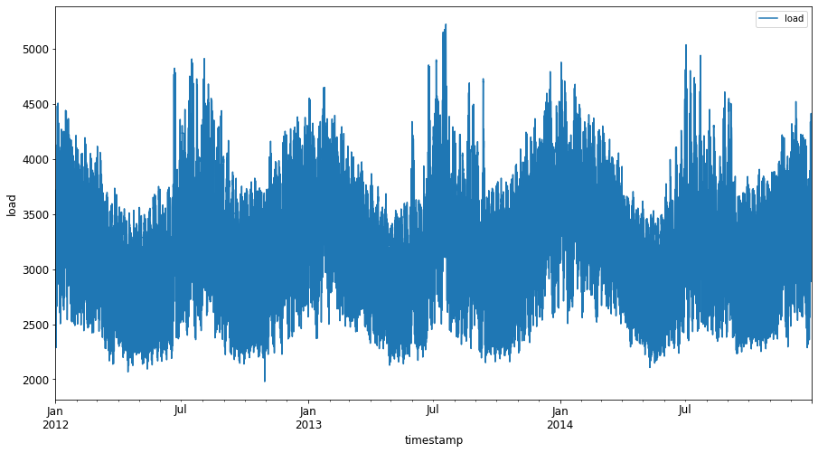
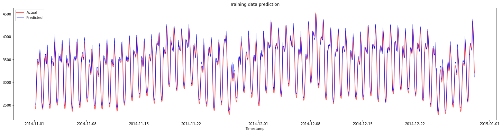
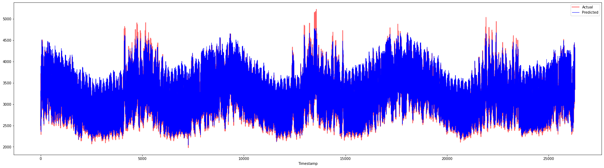

<!--
CO_OP_TRANSLATOR_METADATA:
{
  "original_hash": "f80e513b3279869e7661e3190cc83076",
  "translation_date": "2025-08-29T17:05:36+00:00",
  "source_file": "7-TimeSeries/3-SVR/README.md",
  "language_code": "mr"
}
-->
# टाइम सिरीज फोरकास्टिंग विथ सपोर्ट व्हेक्टर रिग्रेसर

मागील धड्यात, तुम्ही ARIMA मॉडेलचा वापर करून टाइम सिरीज प्रेडिक्शन कसे करायचे ते शिकलात. आता तुम्ही सपोर्ट व्हेक्टर रिग्रेसर मॉडेलकडे पाहणार आहात, जे सतत डेटा प्रेडिक्ट करण्यासाठी वापरले जाणारे एक रिग्रेसर मॉडेल आहे.

## [प्री-लेक्चर क्विझ](https://gray-sand-07a10f403.1.azurestaticapps.net/quiz/51/) 

## परिचय

या धड्यात, तुम्ही [**SVM**: **S**upport **V**ector **M**achine](https://en.wikipedia.org/wiki/Support-vector_machine) चा वापर करून रिग्रेशनसाठी, किंवा **SVR: Support Vector Regressor** साठी मॉडेल तयार करण्याचा एक विशिष्ट मार्ग शोधाल.

### टाइम सिरीजच्या संदर्भात SVR [^1]

टाइम सिरीज प्रेडिक्शनमध्ये SVR चे महत्त्व समजून घेण्यापूर्वी, तुम्हाला खालील महत्त्वाच्या संकल्पना माहित असणे आवश्यक आहे:

- **रिग्रेशन:** दिलेल्या इनपुट्सच्या संचावरून सतत मूल्ये प्रेडिक्ट करण्यासाठीचा सुपरवाइज्ड लर्निंग तंत्र. यामध्ये फीचर स्पेसमध्ये जास्तीत जास्त डेटा पॉइंट्स असलेली वक्र (किंवा रेषा) बसवण्याचा विचार केला जातो. [अधिक माहितीसाठी येथे क्लिक करा](https://en.wikipedia.org/wiki/Regression_analysis).
- **सपोर्ट व्हेक्टर मशीन (SVM):** वर्गीकरण, रिग्रेशन आणि आउटलाईयर डिटेक्शनसाठी वापरले जाणारे सुपरवाइज्ड मशीन लर्निंग मॉडेल. हे मॉडेल फीचर स्पेसमधील एक हायपरप्लेन आहे, जे वर्गीकरणाच्या बाबतीत सीमा म्हणून कार्य करते, आणि रिग्रेशनच्या बाबतीत सर्वोत्तम-फिट रेषा म्हणून कार्य करते. SVM मध्ये, डेटासेटला जास्त डिमेन्शन्सच्या स्पेसमध्ये ट्रान्सफॉर्म करण्यासाठी सामान्यतः कर्नल फंक्शनचा वापर केला जातो, ज्यामुळे ते सहजपणे विभाजनीय होतात. [SVM बद्दल अधिक माहितीसाठी येथे क्लिक करा](https://en.wikipedia.org/wiki/Support-vector_machine).
- **सपोर्ट व्हेक्टर रिग्रेसर (SVR):** SVM चा एक प्रकार, जो जास्तीत जास्त डेटा पॉइंट्स असलेली सर्वोत्तम फिट रेषा (SVM च्या बाबतीत हायपरप्लेन) शोधतो.

### SVR का? [^1]

मागील धड्यात तुम्ही ARIMA बद्दल शिकलात, जे टाइम सिरीज डेटासाठी फोरकास्टिंगसाठी एक अत्यंत यशस्वी सांख्यिकीय रेषीय पद्धत आहे. मात्र, अनेक वेळा टाइम सिरीज डेटामध्ये *नॉन-लिनिअरिटी* असते, जी रेषीय मॉडेल्सद्वारे मॅप केली जाऊ शकत नाही. अशा परिस्थितीत, रिग्रेशन टास्कसाठी डेटामधील नॉन-लिनिअरिटी विचारात घेण्याची SVM ची क्षमता SVR ला टाइम सिरीज फोरकास्टिंगमध्ये यशस्वी बनवते.

## व्यायाम - SVR मॉडेल तयार करा

डेटा तयार करण्यासाठी सुरुवातीची काही पावले मागील धड्यातील [ARIMA](https://github.com/microsoft/ML-For-Beginners/tree/main/7-TimeSeries/2-ARIMA) प्रमाणेच आहेत.

या धड्यातील [_/working_](https://github.com/microsoft/ML-For-Beginners/tree/main/7-TimeSeries/3-SVR/working) फोल्डर उघडा आणि [_notebook.ipynb_](https://github.com/microsoft/ML-For-Beginners/blob/main/7-TimeSeries/3-SVR/working/notebook.ipynb) फाईल शोधा. [^2]

1. नोटबुक चालवा आणि आवश्यक लायब्ररी इम्पोर्ट करा: [^2]

   ```python
   import sys
   sys.path.append('../../')
   ```

   ```python
   import os
   import warnings
   import matplotlib.pyplot as plt
   import numpy as np
   import pandas as pd
   import datetime as dt
   import math
   
   from sklearn.svm import SVR
   from sklearn.preprocessing import MinMaxScaler
   from common.utils import load_data, mape
   ```

2. `/data/energy.csv` फाईलमधून डेटा Pandas डेटाफ्रेममध्ये लोड करा आणि त्यावर नजर टाका: [^2]

   ```python
   energy = load_data('../../data')[['load']]
   ```

3. जानेवारी 2012 ते डिसेंबर 2014 पर्यंतचा सर्व उपलब्ध ऊर्जा डेटा प्लॉट करा: [^2]

   ```python
   energy.plot(y='load', subplots=True, figsize=(15, 8), fontsize=12)
   plt.xlabel('timestamp', fontsize=12)
   plt.ylabel('load', fontsize=12)
   plt.show()
   ```

   

   आता, आपले SVR मॉडेल तयार करूया.

### प्रशिक्षण आणि चाचणी डेटासेट तयार करा

आता तुमचा डेटा लोड झाला आहे, त्यामुळे तुम्ही तो ट्रेन आणि टेस्ट सेट्समध्ये विभाजित करू शकता. त्यानंतर, तुम्ही डेटा रेशेप करून टाइम-स्टेप आधारित डेटासेट तयार कराल, जे SVR साठी आवश्यक आहे. तुम्ही तुमचे मॉडेल ट्रेन सेटवर ट्रेन कराल. मॉडेलचे प्रशिक्षण पूर्ण झाल्यानंतर, तुम्ही ट्रेनिंग सेट, टेस्टिंग सेट आणि नंतर पूर्ण डेटासेटवर त्याची अचूकता तपासाल, जेणेकरून एकूण कामगिरी पाहता येईल. तुम्हाला हे सुनिश्चित करायचे आहे की टेस्ट सेट ट्रेनिंग सेटच्या नंतरच्या कालावधीचा समावेश करतो, जेणेकरून मॉडेल भविष्यातील कालावधीची माहिती मिळवू शकणार नाही [^2] (याला *ओव्हरफिटिंग* म्हणतात).

1. 1 सप्टेंबर ते 31 ऑक्टोबर 2014 या दोन महिन्यांच्या कालावधीला ट्रेनिंग सेटसाठी वाटप करा. टेस्ट सेटमध्ये 1 नोव्हेंबर ते 31 डिसेंबर 2014 या दोन महिन्यांचा कालावधी समाविष्ट असेल: [^2]

   ```python
   train_start_dt = '2014-11-01 00:00:00'
   test_start_dt = '2014-12-30 00:00:00'
   ```

2. फरकांचे व्हिज्युअलायझेशन करा: [^2]

   ```python
   energy[(energy.index < test_start_dt) & (energy.index >= train_start_dt)][['load']].rename(columns={'load':'train'}) \
       .join(energy[test_start_dt:][['load']].rename(columns={'load':'test'}), how='outer') \
       .plot(y=['train', 'test'], figsize=(15, 8), fontsize=12)
   plt.xlabel('timestamp', fontsize=12)
   plt.ylabel('load', fontsize=12)
   plt.show()
   ```

   

### प्रशिक्षणासाठी डेटा तयार करा

आता, तुम्हाला तुमच्या डेटावर फिल्टरिंग आणि स्केलिंग करून प्रशिक्षणासाठी तयार करायचे आहे. तुमच्या डेटासेटला फक्त आवश्यक कालावधी आणि कॉलम्स समाविष्ट करण्यासाठी फिल्टर करा, आणि डेटा 0,1 या श्रेणीत प्रोजेक्ट करण्यासाठी स्केल करा.

1. मूळ डेटासेट फिल्टर करा, ज्यामध्ये फक्त वरील नमूद कालावधी आणि 'load' कॉलमसह तारीख समाविष्ट असेल: [^2]

   ```python
   train = energy.copy()[(energy.index >= train_start_dt) & (energy.index < test_start_dt)][['load']]
   test = energy.copy()[energy.index >= test_start_dt][['load']]
   
   print('Training data shape: ', train.shape)
   print('Test data shape: ', test.shape)
   ```

   ```output
   Training data shape:  (1416, 1)
   Test data shape:  (48, 1)
   ```

2. ट्रेनिंग डेटा (0, 1) श्रेणीत स्केल करा: [^2]

   ```python
   scaler = MinMaxScaler()
   train['load'] = scaler.fit_transform(train)
   ```

4. आता, टेस्टिंग डेटा स्केल करा: [^2]

   ```python
   test['load'] = scaler.transform(test)
   ```

### टाइम-स्टेप्ससह डेटा तयार करा [^1]

SVR साठी, तुम्ही इनपुट डेटा `[batch, timesteps]` स्वरूपात ट्रान्सफॉर्म करता. त्यामुळे, तुम्ही विद्यमान `train_data` आणि `test_data` असे रेशेप करता की एक नवीन डिमेन्शन तयार होईल, जे टाइमस्टेप्सला संदर्भित करते.

```python
# Converting to numpy arrays
train_data = train.values
test_data = test.values
```

या उदाहरणासाठी, आपण `timesteps = 5` घेतो. त्यामुळे, मॉडेलसाठी इनपुट म्हणजे पहिल्या 4 टाइमस्टेप्सचा डेटा असेल, आणि आउटपुट म्हणजे 5व्या टाइमस्टेपचा डेटा असेल.

```python
timesteps=5
```

नेस्टेड लिस्ट कॉम्प्रिहेन्शन वापरून ट्रेनिंग डेटा 2D टेन्सरमध्ये रूपांतरित करणे:

```python
train_data_timesteps=np.array([[j for j in train_data[i:i+timesteps]] for i in range(0,len(train_data)-timesteps+1)])[:,:,0]
train_data_timesteps.shape
```

```output
(1412, 5)
```

टेस्टिंग डेटा 2D टेन्सरमध्ये रूपांतरित करणे:

```python
test_data_timesteps=np.array([[j for j in test_data[i:i+timesteps]] for i in range(0,len(test_data)-timesteps+1)])[:,:,0]
test_data_timesteps.shape
```

```output
(44, 5)
```

ट्रेनिंग आणि टेस्टिंग डेटामधून इनपुट्स आणि आउटपुट्स निवडणे:

```python
x_train, y_train = train_data_timesteps[:,:timesteps-1],train_data_timesteps[:,[timesteps-1]]
x_test, y_test = test_data_timesteps[:,:timesteps-1],test_data_timesteps[:,[timesteps-1]]

print(x_train.shape, y_train.shape)
print(x_test.shape, y_test.shape)
```

```output
(1412, 4) (1412, 1)
(44, 4) (44, 1)
```

### SVR लागू करा [^1]

आता, SVR लागू करण्याची वेळ आली आहे. या अंमलबजावणीबद्दल अधिक वाचण्यासाठी, तुम्ही [या डक्युमेंटेशनचा](https://scikit-learn.org/stable/modules/generated/sklearn.svm.SVR.html) संदर्भ घेऊ शकता. आमच्या अंमलबजावणीसाठी, आम्ही खालील पायऱ्या अनुसरतो:

1. `SVR()` कॉल करून आणि मॉडेल हायपरपॅरामिटर्स: kernel, gamma, c आणि epsilon पास करून मॉडेल परिभाषित करा.
2. `fit()` फंक्शन कॉल करून ट्रेनिंग डेटासाठी मॉडेल तयार करा.
3. `predict()` फंक्शन कॉल करून प्रेडिक्शन करा.

आता आपण SVR मॉडेल तयार करूया. येथे आपण [RBF कर्नल](https://scikit-learn.org/stable/modules/svm.html#parameters-of-the-rbf-kernel) वापरतो, आणि हायपरपॅरामिटर्स gamma, C आणि epsilon अनुक्रमे 0.5, 10 आणि 0.05 सेट करतो.

```python
model = SVR(kernel='rbf',gamma=0.5, C=10, epsilon = 0.05)
```

#### ट्रेनिंग डेटावर मॉडेल फिट करा [^1]

```python
model.fit(x_train, y_train[:,0])
```

```output
SVR(C=10, cache_size=200, coef0=0.0, degree=3, epsilon=0.05, gamma=0.5,
    kernel='rbf', max_iter=-1, shrinking=True, tol=0.001, verbose=False)
```

#### मॉडेल प्रेडिक्शन करा [^1]

```python
y_train_pred = model.predict(x_train).reshape(-1,1)
y_test_pred = model.predict(x_test).reshape(-1,1)

print(y_train_pred.shape, y_test_pred.shape)
```

```output
(1412, 1) (44, 1)
```

तुम्ही तुमचे SVR तयार केले आहे! आता आपण त्याचे मूल्यांकन करूया.

### तुमच्या मॉडेलचे मूल्यांकन करा [^1]

मूल्यांकनासाठी, प्रथम आपण डेटा आपल्या मूळ स्केलवर परत स्केल करू. त्यानंतर, कामगिरी तपासण्यासाठी, आपण मूळ आणि प्रेडिक्टेड टाइम सिरीज प्लॉट करणार आहोत, आणि MAPE परिणाम देखील प्रिंट करणार आहोत.

प्रेडिक्टेड आणि मूळ आउटपुट स्केल करा:

```python
# Scaling the predictions
y_train_pred = scaler.inverse_transform(y_train_pred)
y_test_pred = scaler.inverse_transform(y_test_pred)

print(len(y_train_pred), len(y_test_pred))
```

```python
# Scaling the original values
y_train = scaler.inverse_transform(y_train)
y_test = scaler.inverse_transform(y_test)

print(len(y_train), len(y_test))
```

#### ट्रेनिंग आणि टेस्टिंग डेटावर मॉडेलची कामगिरी तपासा [^1]

आम्ही आमच्या प्लॉटच्या x-अक्षावर दाखवण्यासाठी डेटासेटमधून टाइमस्टॅम्प्स काढतो. लक्षात घ्या की आम्ही पहिल्या ```timesteps-1``` मूल्यांचा वापर पहिल्या आउटपुटसाठी इनपुट म्हणून करतो, त्यामुळे आउटपुटसाठी टाइमस्टॅम्प्स त्यानंतर सुरू होतील.

```python
train_timestamps = energy[(energy.index < test_start_dt) & (energy.index >= train_start_dt)].index[timesteps-1:]
test_timestamps = energy[test_start_dt:].index[timesteps-1:]

print(len(train_timestamps), len(test_timestamps))
```

```output
1412 44
```

ट्रेनिंग डेटासाठी प्रेडिक्शन प्लॉट करा:

```python
plt.figure(figsize=(25,6))
plt.plot(train_timestamps, y_train, color = 'red', linewidth=2.0, alpha = 0.6)
plt.plot(train_timestamps, y_train_pred, color = 'blue', linewidth=0.8)
plt.legend(['Actual','Predicted'])
plt.xlabel('Timestamp')
plt.title("Training data prediction")
plt.show()
```



ट्रेनिंग डेटासाठी MAPE प्रिंट करा:

```python
print('MAPE for training data: ', mape(y_train_pred, y_train)*100, '%')
```

```output
MAPE for training data: 1.7195710200875551 %
```

टेस्टिंग डेटासाठी प्रेडिक्शन प्लॉट करा:

```python
plt.figure(figsize=(10,3))
plt.plot(test_timestamps, y_test, color = 'red', linewidth=2.0, alpha = 0.6)
plt.plot(test_timestamps, y_test_pred, color = 'blue', linewidth=0.8)
plt.legend(['Actual','Predicted'])
plt.xlabel('Timestamp')
plt.show()
```


टेस्टिंग डेटासाठी MAPE प्रिंट करा:

```python
print('MAPE for testing data: ', mape(y_test_pred, y_test)*100, '%')
```

```output
MAPE for testing data:  1.2623790187854018 %
```

🏆 तुम्हाला टेस्टिंग डेटासेटवर खूप चांगला परिणाम मिळाला आहे!

### पूर्ण डेटासेटवर मॉडेलची कामगिरी तपासा [^1]

```python
# Extracting load values as numpy array
data = energy.copy().values

# Scaling
data = scaler.transform(data)

# Transforming to 2D tensor as per model input requirement
data_timesteps=np.array([[j for j in data[i:i+timesteps]] for i in range(0,len(data)-timesteps+1)])[:,:,0]
print("Tensor shape: ", data_timesteps.shape)

# Selecting inputs and outputs from data
X, Y = data_timesteps[:,:timesteps-1],data_timesteps[:,[timesteps-1]]
print("X shape: ", X.shape,"\nY shape: ", Y.shape)
```

```output
Tensor shape:  (26300, 5)
X shape:  (26300, 4) 
Y shape:  (26300, 1)
```

```python
# Make model predictions
Y_pred = model.predict(X).reshape(-1,1)

# Inverse scale and reshape
Y_pred = scaler.inverse_transform(Y_pred)
Y = scaler.inverse_transform(Y)
```

```python
plt.figure(figsize=(30,8))
plt.plot(Y, color = 'red', linewidth=2.0, alpha = 0.6)
plt.plot(Y_pred, color = 'blue', linewidth=0.8)
plt.legend(['Actual','Predicted'])
plt.xlabel('Timestamp')
plt.show()
```



```python
print('MAPE: ', mape(Y_pred, Y)*100, '%')
```

```output
MAPE:  2.0572089029888656 %
```

🏆 खूप छान प्लॉट्स, जे चांगल्या अचूकतेसह मॉडेल दर्शवतात. उत्तम कामगिरी!

---

## 🚀चॅलेंज

- मॉडेल तयार करताना हायपरपॅरामिटर्स (gamma, C, epsilon) बदलून पहा आणि टेस्टिंग डेटावर मूल्यांकन करा, कोणता हायपरपॅरामिटर्सचा संच सर्वोत्तम परिणाम देतो ते पाहा. या हायपरपॅरामिटर्सबद्दल अधिक जाणून घेण्यासाठी, तुम्ही [येथे](https://scikit-learn.org/stable/modules/svm.html#parameters-of-the-rbf-kernel) वाचू शकता.
- मॉडेलसाठी वेगवेगळ्या कर्नल फंक्शन्सचा वापर करून पहा आणि त्यांच्या कामगिरीचे विश्लेषण करा. उपयुक्त डक्युमेंट [येथे](https://scikit-learn.org/stable/modules/svm.html#kernel-functions) सापडू शकते.
- मॉडेल प्रेडिक्शनसाठी `timesteps` साठी वेगवेगळ्या मूल्यांचा वापर करून पहा.

## [पोस्ट-लेक्चर क्विझ](https://gray-sand-07a10f403.1.azurestaticapps.net/quiz/52/)

## पुनरावलोकन आणि स्व-अभ्यास

हा धडा टाइम सिरीज फोरकास्टिंगसाठी SVR च्या अनुप्रयोगाची ओळख करून देण्यासाठी होता. SVR बद्दल अधिक वाचण्यासाठी, तुम्ही [या ब्लॉगचा](https://www.analyticsvidhya.com/blog/2020/03/support-vector-regression-tutorial-for-machine-learning/) संदर्भ घेऊ शकता. [scikit-learn वरील डक्युमेंटेशन](https://scikit-learn.org/stable/modules/svm.html) SVMs बद्दल, [SVRs](https://scikit-learn.org/stable/modules/svm.html#regression) आणि इतर अंमलबजावणी तपशील जसे की वेगवेगळ्या [कर्नल फंक्शन्स](https://scikit-learn.org/stable/modules/svm.html#kernel-functions) याबद्दल अधिक सविस्तर स्पष्टीकरण देते.

## असाइनमेंट

[नवीन SVR मॉडेल](assignment.md)

## क्रेडिट्स

[^1]: या विभागातील मजकूर, कोड आणि आउटपुट [@AnirbanMukherjeeXD](https://github.com/AnirbanMukherjeeXD) यांनी योगदान दिले.
[^2]: या विभागातील मजकूर, कोड आणि आउटपुट [ARIMA](https://github.com/microsoft/ML-For-Beginners/tree/main/7-TimeSeries/2-ARIMA) वरून घेतले.

---

**अस्वीकरण**:  
हा दस्तऐवज AI भाषांतर सेवा [Co-op Translator](https://github.com/Azure/co-op-translator) वापरून भाषांतरित करण्यात आला आहे. आम्ही अचूकतेसाठी प्रयत्नशील असलो तरी कृपया लक्षात ठेवा की स्वयंचलित भाषांतरे त्रुटी किंवा अचूकतेच्या अभावाने युक्त असू शकतात. मूळ भाषेतील दस्तऐवज हा अधिकृत स्रोत मानला जावा. महत्त्वाच्या माहितीसाठी व्यावसायिक मानवी भाषांतराची शिफारस केली जाते. या भाषांतराचा वापर करून उद्भवलेल्या कोणत्याही गैरसमज किंवा चुकीच्या अर्थासाठी आम्ही जबाबदार राहणार नाही.