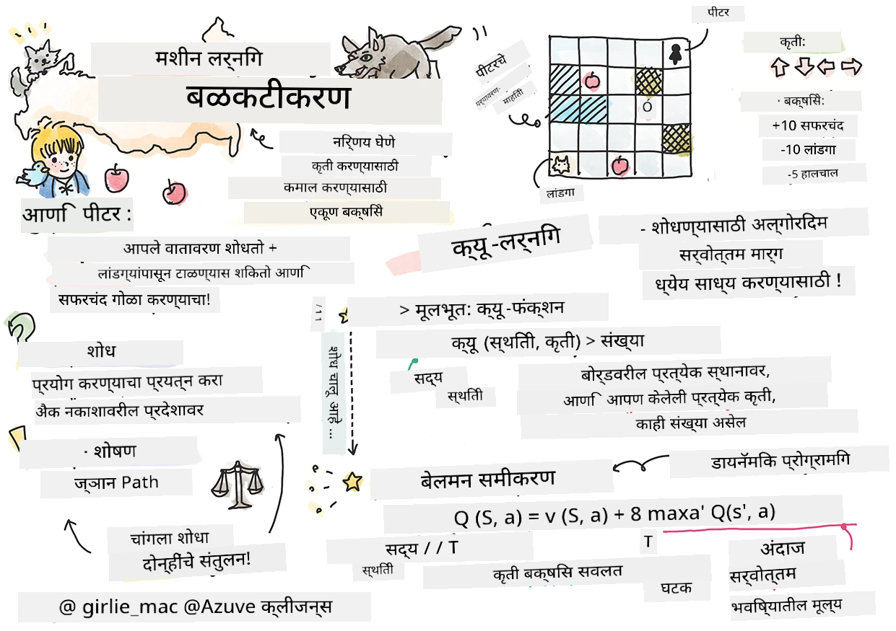
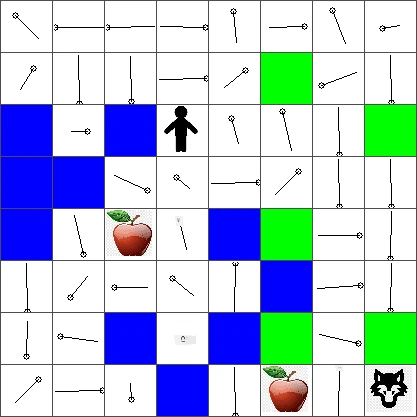

# बळकटीकरण शिक्षण आणि क्‍यू-लर्निंगची ओळख


> स्केच नोट [Tomomi Imura](https://www.twitter.com/girlie_mac) यांची

बळकटीकरण शिक्षणामध्ये तीन महत्त्वाच्या संकल्पना असतात: एजंट, काही स्टेट्स, आणि प्रत्येक स्टेटसाठी क्रियांचा संच. एखाद्या विशिष्ट स्टेटमध्ये एखादे क्रिया केल्यावर एजंटला पारितोषिक मिळते. पुन्हा कल्पना करा संगणक खेळ सुपर मारियो. तुम्ही मारियो आहात, तुम्ही एका खेळाच्या स्तरावर आहात, एका दऱ्या कडेला उभे आहात. तुमच्या वर नाणे आहे. तुम्ही मारियो आहात, खेळाच्या एका विशिष्ट स्थितीवर... ही तुमची स्थिती आहे. उजवीकडे एक पाऊल चालण्याने (एक क्रिया) तुम्हाला दऱ्या पार नेईल आणि त्यास कमी संख्यात्मक गुण मिळतील. मात्र, उडी मारण्याचा बटण दाबल्यास तुम्हाला एक गुण मिळेल आणि तुम्ही जिवंत राहाल. हा सकारात्मक परिणाम आहे आणि त्याला सकारात्मक संख्यात्मक गुण मिळायला हवेत.

बळकटीकरण शिक्षण आणि सिम्युलेटर (खेळ) वापरून, तुम्ही खेळ कसा खेळायचा हे शिकू शकता ज्यामुळे जिंकण्याचा उद्दिष्ट जास्तीत जास्त जिवंत राहणे आणि शक्य तितके गुण मिळवणे होय.

[](https://www.youtube.com/watch?v=lDq_en8RNOo)

> 🎥 वरील प्रतिमेवर क्लिक करा Dmitry यांचे बळकटीकरण शिक्षणावरील चर्चा ऐकण्यासाठी

## [प्रास्ताविक क्विझ](https://ff-quizzes.netlify.app/en/ml/)

## पूर्वअट व सेटअप

या धड्यात, आपण पायथनमध्ये काही कोड वापरून प्रयोग करू. आपण या धड्याचा Jupyter Notebook कोड तुमच्या संगणकावर किंवा क्लाउडवर चालवू शकता.

आपण [धड्याचा नोटबुक](https://github.com/microsoft/ML-For-Beginners/blob/main/8-Reinforcement/1-QLearning/notebook.ipynb) उघडू शकता आणि या धड्याला पूर्ण करू शकता.

> **नोट:** जर आपण हा कोड क्लाउडमधून उघडत असाल, तर [`rlboard.py`](https://github.com/microsoft/ML-For-Beginners/blob/main/8-Reinforcement/1-QLearning/rlboard.py) फाईल देखील डाउनलोड करावी लागेल, जी नोटबुक कोडमध्ये वापरली जाते. ती नोटबुक साठी खात्री करा की त्याच फोल्डरमध्ये आहे.

## ओळख

या धड्यात, आपण **[Peter and the Wolf](https://en.wikipedia.org/wiki/Peter_and_the_Wolf)** या जगाचा अभ्यास करणार आहोत, जो रशियन संगीतकार [Sergei Prokofiev](https://en.wikipedia.org/wiki/Sergei_Prokofiev) यांच्या संगीत फेयरी टेलवर आधारित आहे. आपण **बळकटीकरण शिक्षण** वापरून Peter ला त्याच्या आजूबाजूच्या परिसरात शोध घेऊ देऊ, स्वादिष्ट सफरचंद गोळा करू देऊ आणि लांडग्याशी होणारी भेट टाळू देऊ.

**बळकटीकरण शिक्षण** (RL) ही एक शिकण्याची पद्धत आहे जी आपल्याला अनेक प्रयोग करून एखाद्या **एजंट** चा काही **परिसर** मध्ये सर्वोत्तम वागणूक शिकण्याची संधी देते. या पर्यावरणातील एजंटला एक **लक्ष्य** असावे, जे एका **पारितोषिक फंक्शन** द्वारा परिभाषित केले जाते.

## परिसर

सोपेपणासाठी, चला Peter चा जग हा `width` x `height` आकाराचा चौरस फळीचा बोर्ड मानूया, खालीलप्रमाणे:


या बोर्डमधील प्रत्येक सेल्युलर किंवा  कोष्टकापैकी एक:

* **भूमी**, जिथे Peter आणि इतर प्राणी चालू शकतात.
* **पाणी**, ज्यावर निश्चितच चालता येत नाही.
* एक **झाड** किंवा **गवत**, जिथे आराम करता येतो.
* एक **सफरचंद**, जे Peter ला अन्न मिळवण्यासाठी आनंददायक ठरते.
* एक **लांडगा**, जो धोकादायक आहे आणि टाळावा लागतो.

एक स्वतंत्र पायथन मॉड्यूल आहे, [`rlboard.py`](https://github.com/microsoft/ML-For-Beginners/blob/main/8-Reinforcement/1-QLearning/rlboard.py), ज्यामध्ये या परिसराबरोबर काम करण्याचा कोड आहे. कारण हा कोड आपल्या संकल्पना समजण्यासाठी महत्त्वाचा नाही, आपण हा मॉड्यूल आयात करू आणि नमुना बोर्ड तयार करण्यासाठी वापरू (कोड ब्लॉक 1):

```python
from rlboard import *

width, height = 8,8
m = Board(width,height)
m.randomize(seed=13)
m.plot()
```

हा कोड वरील आसपासच्या परिसराचा चित्रपट प्रिंट करेल असा अपेक्षित आहे.

## क्रिया आणि धोरण

आपल्या उदाहरणात, Peter चे लक्ष्य एक सफरचंद शोधणे आहे, तर लांडगा आणि इतर अडथळे टाळणे आहे. यासाठी, तो अगदी चालत फिरत सफरचंद शोधण्याचा प्रयत्न करेल.

त्यामुळे, कोणत्याही स्थितीत, तो खालीलपैकी एक क्रिया निवडू शकतो: वर, खालून, डावीकडे आणि उजवीकडे.

आपण त्या क्रिया एक शब्दकोश (डिक्शनरी) म्हणून परिभाषित करू आणि त्यांना संदर्भित कोऑर्डिनेट बदलांच्या जोड्यांशी नकाशित करू. उदाहरणार्थ, उजवीकडे वळणे (`R`) म्हणजे जोड (1,0) असेल. (कोड ब्लॉक 2):

```python
actions = { "U" : (0,-1), "D" : (0,1), "L" : (-1,0), "R" : (1,0) }
action_idx = { a : i for i,a in enumerate(actions.keys()) }
```

सारांश म्हणून, या परिस्थितीची धोरण आणि लक्ष्य अशी आहे:

- **धोरण**, आपल्या एजंटचे (Peter) एक तथाकथित **पॉलिसी** द्वारा परिभाषित केले जाते. पॉलिसी ही एक फंक्शन आहे जी कोणत्याही स्थितीत क्रिया परत करते. आपल्या प्रकरणात, समस्येची स्थिती बोर्डने प्रदर्शित केली जाते, ज्यामध्ये प्लेयरची सद्यस्थिती समाविष्ट आहे.

- **लक्ष्य**, बळकटीकरण शिक्षणाचे अंतिम उद्दिष्ट एक चांगले धोरण शिकणे आहे जे आपल्याला समस्या परिणामकारकपणे सोडवण्याची परवानगी देईल. परंतु तत्त्वतः, सर्वात सोपा धोरण जो **रँडम वॉक** म्हणतात तो मानूया.

## रँडम वॉक

आपल्या समस्या प्रथम रँडम वॉक धोरण अंमलात आणून सोडवूया. रँडम वॉकमध्ये आपण पुढील क्रिया परवानगी दिलेल्या क्रियांमधून अनियमितपणे निवडू, जोपर्यंत सफरचंद दिसत नाही (कोड ब्लॉक 3).

1. खालील कोड वापरून रँडम वॉक कार्यान्वित करा:

    ```python
    def random_policy(m):
        return random.choice(list(actions))
    
    def walk(m,policy,start_position=None):
        n = 0 # पावलांची संख्या
        # प्रारंभिक स्थान सेट करा
        if start_position:
            m.human = start_position 
        else:
            m.random_start()
        while True:
            if m.at() == Board.Cell.apple:
                return n # यशस्वी!
            if m.at() in [Board.Cell.wolf, Board.Cell.water]:
                return -1 # लांडगाने खाल्लं किंवा बुडालं
            while True:
                a = actions[policy(m)]
                new_pos = m.move_pos(m.human,a)
                if m.is_valid(new_pos) and m.at(new_pos)!=Board.Cell.water:
                    m.move(a) # प्रत्यक्ष हालचाल करा
                    break
            n+=1
    
    walk(m,random_policy)
    ```

    `walk` ची कॉल संबंधित मार्गाची लांबी परत करावी, जी एक धावणीतून दुसऱ्या धावणीत बदलू शकते.

1. चालण्याचा प्रयोग अनेक वेळा (उदा., 100 वेळा) चालवा आणि परिणामी आकडेवारी प्रिंट करा (कोड ब्लॉक 4):

    ```python
    def print_statistics(policy):
        s,w,n = 0,0,0
        for _ in range(100):
            z = walk(m,policy)
            if z<0:
                w+=1
            else:
                s += z
                n += 1
        print(f"Average path length = {s/n}, eaten by wolf: {w} times")
    
    print_statistics(random_policy)
    ```

    लक्षात ठेवा की एका मार्गाची सरासरी लांबी सुमारे 30-40 पावले आहे, जे खूप आहे, कारण जवळपासच्या सफरचंदापर्यंतचा सरासरी अंतर सुमारे 5-6 पावले आहे.

    आपण पाहू शकता की रँडम वॉक चालताना Peter ची हालचाल कशी दिसते:

    

## पारितोषिक फंक्शन

आपली धोरण अधिक बुद्धिमान करण्यासाठी, आपल्याला हे समजून घ्यावे लागेल कोणती हालचाल इतरांपेक्षा "चांगली" आहे. यासाठी, आपल्याला आपले लक्ष्य परिभाषित करावे लागेल.

लक्ष्य एका **पारितोषिक फंक्शन**च्या संदर्भाने परिभाषित केले जाऊ शकते, जे प्रत्येक स्थितीसाठी काही गुण परत करते. संख्या जितकी जास्त तितकी पारितोषिक फंक्शन चांगले आहे. (कोड ब्लॉक 5)

```python
move_reward = -0.1
goal_reward = 10
end_reward = -10

def reward(m,pos=None):
    pos = pos or m.human
    if not m.is_valid(pos):
        return end_reward
    x = m.at(pos)
    if x==Board.Cell.water or x == Board.Cell.wolf:
        return end_reward
    if x==Board.Cell.apple:
        return goal_reward
    return move_reward
```

पारितोषिक फंक्शन्स बद्दल एक रसपूर्ण गोष्ट म्हणजे बहुतेक केसेस मध्ये, *आपल्याला गेमच्या शेवटीच मोठे पारितोषिक मिळते*. याचा अर्थ आपला अल्गोरिदम "चांगल्या" पावलांची आठवण ठेवायला पाहिजे जे शेवटी सकारात्मक पारितोषिकाकडे नेतात आणि त्यांचे महत्त्व वाढवायला पाहिजे. त्याचप्रमाणे, सर्व हालचाली ज्या वाईट परिणांमांकडे नेतात त्यांना टाळले पाहिजे.

## क्‍यू-लर्निंग

एक अल्गोरिदम जो आपण येथे चर्चा करू ते म्हणजे **क्‍यू-लर्निंग**. या अल्गोरिदममध्ये, धोरण एका फंक्शन (किंवा डेटा स्ट्रक्चर) द्वारे परिभाषित केले जाते ज्याला **Q-टेबल** म्हणतात. हे दिलेल्या स्थितीतील प्रत्येक क्रियेची "चांगलीपणा" नोंदवते.

ते Q-टेबल म्हणून ओळखले जाते कारण ते बहुतेकवेळी टेबल किंवा मल्टि-डायमेंशनल अरे म्हणून सादर करणे सोपे असते. आपला बोर्ड `width` x `height` परिमाणांचा आहे, त्यामुळे आपण Q-टेबल numpy अरेच्या रूपात `width` x `height` x `len(actions)` आकाराने सादर करू शकतो: (कोड ब्लॉक 6)

```python
Q = np.ones((width,height,len(actions)),dtype=np.float)*1.0/len(actions)
```

आपण सर्व Q-टेबलचे मूल्ये सारखी ठेवलात, आमच्या बाबतीत - 0.25. हे "रँडम वॉक" धोरणाशी जुळते, कारण प्रत्येक स्थितीत सर्व हालचाल समान चांगल्या असतात. आपण Q-टेबलला `m.plot(Q)` वापरून बोर्डवर दिसवू शकतो.


प्रत्येक सेल्युलरच्या मध्यभागी एक "बाण" आहे जो प्राधान्य दिलेल्या दिशेची सूचना करतो. सर्व दिशा समान असल्यामुळे, एक बिंदू दर्शविला जातो.

आता आपल्याला सिम्युलेशन चालवून आपला परिसर शोधून नवीन Q-टेबल मूल्ये शिकणे आवश्यक आहे, ज्यामुळे सफरचंद शोधण्याचा मार्ग वेगाने मिळेल.

## क्‍यू-लर्निंगचा सार: बेलमन समीकरण

जेव्हा आपण हालचाल सुरू करतो, प्रत्येक क्रियेला संबंधित पारितोषिक मिळते, म्हणजे आपल्याला थेट सर्वात जास्त तत्काळ पारितोषिकानुसार पुढील क्रिया निवडता येईल. परंतु, बहुतेक स्थितीत ही हालचाल आपले लक्ष्य (सफरचंद गाठणे) साध्य करणार नाही, त्यामुळे सहज ठरवता येत नाही कोणती दिशा चांगली आहे.

> लक्षात ठेवा की तत्काळ परिणाम महत्त्वाचा नाही, परंतु अंतिम परिणाम जो सिम्युलेशनच्या शेवटी मिळेल तो महत्त्वाचा आहे.

या विलंबित पारितोषिकासाठी विचार करण्यासाठी, आपल्याला **[डायनॅमिक प्रोग्रॅमिंग](https://en.wikipedia.org/wiki/Dynamic_programming)** च्या तत्त्वांचा वापर करावा लागेल, जे आपल्याला पुनरावृत्तीचा वापर करून समस्या विचारण्याची परवानगी देतात.

समजा आपण आताच्या स्थिती *s* वर आहोत, आणि पुढील स्थिती *s'* कडे चालायचे आहे. असे केल्यास, आपल्याला तत्काळ पारितोषिक *r(s,a)* मिळेल, जे पारितोषिक फंक्शनने व्याख्यित आहे, आणि भविष्यातील काही पारितोषिकही मिळेल. आपण समजून घेऊ की आपला Q-टेबल प्रत्येक क्रियेची "आकर्षकता" योग्य रीतीने दर्शवतो, तर स्थिती *s'* मध्ये आपण अशी क्रिया *a* निवडू ज्याची किंमत *Q(s',a')* सर्वाधिक असेल. त्यामुळे स्थिती *s* वर मिळणारे सर्वोत्तम भविष्यातील पारितोषिक `max`<sub>a'</sub>*Q(s',a')* (येथे सर्व शक्य क्रिया *a'* वरून सर्वाधिक मूल्य निवडले जाते) असेल.

हे आपल्याला **बेलमन सूत्र** देते, जे स्थिती *s*, क्रिया *a* साठी Q-टेबलचे मूल्य कसे गणना करावे ते सांगते:


इथे γ हे **डिस्काउंट फॅक्टर** आहे जे ठरवते की आपण वर्तमान पारितोषिक किती प्रमाणात भविष्याच्या पारितोषिकापेक्षा जास्त महत्व देऊ इच्छिता.

## शिक्षण अल्गोरिदम

मागील समीकरणानुसार, आपण आता आपला शिक्षण अल्गोरिदमचे छद्म-कोड लिहू शकतो:

* सर्व स्थिती आणि क्रिया साठी Q-टेबल Q समान किमतीने आरंभ करा
* शिक्षण गती α ← 1 सेट करा
* अनेक वेळा सिम्युलेशन पुन्हा पुन्हा चालवा
   1. यादृच्छिक स्थितीत सुरू करा
   1. पुन्हा सांगा
        1. स्थिती *s* वरील क्रिया *a* निवडा
        2. क्रिया अंमलात आणा आणि नवीन स्थिती *s'* वर जा
        3. जर आपण गेम संपण्याच्या स्थितीवर पोहोचलो, किंवा एकूण पारितोषिक खूप कमी असेल - सिम्युलेशन थांबवा  
        4. नवीन स्थितीत पारितोषिक *r* गणना करा
        5. बेलमन समीकरणानुसार Q-फंक्शन अद्ययावत करा: *Q(s,a)* ← *(1-α)Q(s,a)+α(r+γ max<sub>a'</sub>Q(s',a'))*
        6. *s* ← *s'*
        7. एकूण पारितोषिक अद्ययावत करा आणि α कमी करा.

## उपयोग vs. अन्वेषण

वर दिलेल्या अल्गोरिदममध्ये, आपण तपशीलवार सांगितले नाही की टप्पा 2.1 मध्ये क्रिया कशी निवडायची. जर आपण यादृच्छिकपणे क्रिया निवडत असाल, तर आपण पर्यावरणाचा अनियमित **अन्वेषण** करणार आहोत, आणि बहुधा आपण वारंवार मरणार आहोत तसेच ज्या भागात आपण निघणार नाही, तिथे गुणांकन करू शकु. एक पर्यायी पद्धत म्हणजे आधीच ज्ञात असलेल्या Q-टेबल मूल्यांचा **उपयोग** करून सर्वोत्तम क्रिया (जिचे Q-मूल्य जास्त आहे) निवडणे. परंतु यामुळे आपण इतर स्थिती अन्वेषण करू शकणार नाही आणि कदाचित आपण सर्वोत्तम समाधान सापडणार नाही.

त्यामुळे, सर्वोत्तम पद्धत म्हणजे अन्वेषण आणि उपयोग यांच्यात संतुलन साधणे. हे असे करता येते की स्थिती *s* वरील क्रिया Q-टेबलमधील मूल्यांची प्रमाणानुसार निवडली जाते. सुरुवातीला, जेव्हा Q-टेबल मुळे सर्व मूल्य समान असतात, तेव्हा ही निवड रँडम असेल, पण जसे आपण पर्यावरणाबद्दल अधिक शिकू, आपल्याला अधिक शक्यता असेल की आपण आदर्श मार्गाचा अवलंब करू, तसेच एजंटला थोड्या वेळा अन्वेषित मार्ग निवडण्याची संधी देऊ.

## पायथन अंमलबजावणी

आपण आता शिक्षण अल्गोरिदम अंमलात आणण्यास तयार आहोत. त्याआधी, आपल्याला एक फंक्शन हवे जे Q-टेबलमधील कोणत्याही संख्यांना संबंधित क्रियांसाठी संभाव्यता व्हेक्टरमध्ये रूपांतरित करेल.

1. `probs()` नावाचे फंक्शन तयार करा:

    ```python
    def probs(v,eps=1e-4):
        v = v-v.min()+eps
        v = v/v.sum()
        return v
    ```

    आपण मूळ व्हेक्टरमध्ये काही `eps` घालतो ज्यामुळे सुरुवातीला सर्व घटक समान असताना 0 ने भागाकार टाळता येते.

5000 प्रयोगांद्वारे, ज्याला **epochs** म्हणतात, हा अल्गोरिदम चालवा: (कोड ब्लॉक 8)
```python
    for epoch in range(5000):
    
        # प्रारंभिक बिंदू निवडा
        m.random_start()
        
        # सफर सुरु करा
        n=0
        cum_reward = 0
        while True:
            x,y = m.human
            v = probs(Q[x,y])
            a = random.choices(list(actions),weights=v)[0]
            dpos = actions[a]
            m.move(dpos,check_correctness=False) # आम्ही खेळाडूला बोर्डच्या बाहेर जाण्याची परवानगी देतो, ज्यामुळे एपिसोड समाप्त होतो
            r = reward(m)
            cum_reward += r
            if r==end_reward or cum_reward < -1000:
                lpath.append(n)
                break
            alpha = np.exp(-n / 10e5)
            gamma = 0.5
            ai = action_idx[a]
            Q[x,y,ai] = (1 - alpha) * Q[x,y,ai] + alpha * (r + gamma * Q[x+dpos[0], y+dpos[1]].max())
            n+=1
```

हा अल्गोरिदम चालवल्यानंतर, Q-टेबल अद्ययावत होईल ज्यामुळे प्रत्येक पावलाच्या वेगळ्या क्रियांना आकर्षकता स्पष्ट होईल. आपण Q-टेबलसाठी एका व्हेक्टरचे प्लॉट करून दाखवू शकतो जे प्रत्येक सेल्युलरवर इच्छित निर्देश दर्शवेल. सोपेसाठी, आम्ही बाणाच्या टोकाऐवजी एक लहान वर्तुळ रेखाटतो.



## धोरण तपासणी

Q-टेबलमध्ये प्रत्येक क्रियेची आकर्षकता सूचीबद्ध असल्यामुळे, याचा वापर करून आपल्याला आपल्या जगात प्रभावी मार्ग चालवता येतो. सर्वात सोप्या प्रकरणात, आपण सर्वाधिक Q-टेबल मूल्य असलेल्या क्रियेला निवडू शकतो: (कोड ब्लॉक 9)

```python
def qpolicy_strict(m):
        x,y = m.human
        v = probs(Q[x,y])
        a = list(actions)[np.argmax(v)]
        return a

walk(m,qpolicy_strict)
```


> आपण वरील कोड काही वेळा चालवण्याचा प्रयत्न केला तर कधी कधी तो "थांबतो" असं तुम्हाला दिसू शकतं, आणि तुम्हाला त्याला थांबवण्यासाठी नोटबुकमध्ये STOP बटन दाबावं लागतं. हे असं होतं कारण असे परिस्थिती असू शकतात जिथे दोन अवस्था परस्परांच्या अनुकूल Q-मूल्याच्या संदर्भात "सूचित" करतात, अशा स्थितीत एजंट त्या अवस्थांमध्ये अनंतकाळ हालचाल करत राहतो.

## 🚀आव्हान

> **कार्य 1:** `walk` फंक्शनमध्ये मार्गाची कमाल लांबी काही निश्चित स्टेपपर्यंत (उदा., १००) मर्यादित करा, आणि वरील कोडमध्ये कधीकधी हा मूल्य परत येते ते पाहा.

> **कार्य 2:** `walk` फंक्शनमध्ये असे बदल करा की ते आधी जिथे गेले आहे तेथे परत जाऊ नये. यामुळे `walk` मध्ये लूप होण्यापासून टाळता येईल, परंतु एजंट काही ठिकाणी "अडकून" जाऊ शकतो ज्यापासून तो सुटू शकत नाही.

## नेव्हिगेशन

चांगली नेव्हिगेशन धोरण म्हणजे जशी आपण प्रशिक्षणादरम्यान वापरली होती, ज्यामध्ये उपभोग आणि शोध दोन्हींचा समावेश आहे. या धोरणानुसार, आपण प्रत्येक क्रिया ठरलेल्या शक्यतेने निवडू, जी Q-टेबलमधील मूल्यांशी प्रमाणित आहे. या धोरणामुळेही एजंट कधी कधी आधीच शोधलेल्या स्थितीकडे परत येऊ शकतो, पण खालील कोडमधून दिसते की परिणामी इच्छित ठिकाणापर्यंतचा सरासरी मार्ग खूपच कमी होतो (लक्षात ठेवा `print_statistics` हे सिम्युलेशन १०० वेळा चालवते): (कोड ब्लॉक १०)

```python
def qpolicy(m):
        x,y = m.human
        v = probs(Q[x,y])
        a = random.choices(list(actions),weights=v)[0]
        return a

print_statistics(qpolicy)
```

हा कोड चालवल्यानंतर, तुम्हाला पूर्वीपेक्षा खूपच कमी सरासरी मार्ग लांबी मिळेल, अंदाजे ३-६ च्या दरम्यान.

## शिक्षण प्रक्रियेची तपासणी

जसे आपण म्हणालो, शिक्षण प्रक्रिया म्हणजे समस्येच्या संरचनेबद्दल मिळालेल्या ज्ञानाचा शोध आणि उपभोग यांचा समतोल आहे. आपण पाहिले की शिकण्याचे निकाल (एजंटला उद्दिष्टाचा लहान मार्ग शोधण्यास मदत करण्याची क्षमता) सुधारली आहे, परंतु शिक्षण प्रक्रियेदरम्यान सरासरी मार्गाची लांबी कशी वागते हे पाहणे देखील मनोरंजक आहे:


शिकण्याचा सारांश असा करता येईल:

- **सरासरी मार्गाची लांबी वाढते**. येथे आपण पाहतो की सुरुवातीला सरासरी मार्ग लांबतो. कदाचित कारण असं की जेव्हा आपल्याला वातावरणाबद्दल काहीच माहिती नसते, तेव्हा आपण वाईट स्थितींमध्ये, जसे पाणी किंवा लांडगा, अडकू शकतो. जसे आपण अधिक शिकतो आणि हे ज्ञान वापरायला सुरुवात करतो, आपण वातावरण अधिक काळ तपासू शकतो, परंतु आपल्याला सफरचंदी कुठे आहेत हे चांगलं माहितच नसतं.

- **जसे आपल्याला अधिक ज्ञान होते तसंच मार्गाचा लांबी कमी होते**. एकदा आपण भरपूर शिकल्यावर, एजंटसाठी उद्दिष्ट गाठणं सोपं होतं आणि मार्गाची लांबी कमी होऊ लागते. तरीही, आपण शोधासाठी उघडे आहोत, त्यामुळे आपण चांगल्या मार्गापासून कधी कधी विचलित होतो आणि नवीन पर्याय शोधतो, ज्यामुळे मार्ग अनुकूलतेपेक्षा थोडा लांब होतो.

- **लांबी अचानक वाढते**. या ग्राफवर आणखी एक गोष्ट आपण पाहतो ती म्हणजे काही ठिकाणी लांबी अचानक वाढली. हे प्रक्रियेच्या संयोगात्मक स्वरूपाचे संकेत आहे, आणि आपण वाटतं काही वेळेस Q-टेबलचे गुणाकार नवीन मुल्यांनी बदलून त्याचे नुकसान करू शकतो. प्रशिक्षणाच्या शेवटी उदाहरणार्थ, आपण Q-टेबलचे मूल्य लहान प्रमाणातच सुधारतो, हे कमीत कमी करावे.

एकूणच, हे लक्षात ठेवणं महत्त्वाचं आहे की शिकण्याच्या प्रक्रियेचा यश आणि गुणवत्ता अनेक घटकांवर अवलंबून असते, जसे शिक्षण दर, शिक्षण दराचा घट, आणि सूट घटक. यांना अनेकदा **हायपरपॅरामीटर्स** म्हणतात, जे प्रशिक्षणादरम्यान ऑप्टिमाइझ होणाऱ्या **पॅरामीटर्स** (उदा. Q-टेबल गुणाकार) यांतून वेगळे आहेत. उत्तम हायपरपॅरामीटर मूल्य शोधण्याच्या प्रक्रियेला **हायपरपॅरामीटर ऑप्टिमायझेशन** म्हणतात, आणि हे स्वतंत्र विषय आहे.

## [व्याख्यानानंतरची क्विझ](https://ff-quizzes.netlify.app/en/ml/)

## असाइनमेंट 
[अधिक वास्तववादी जग](assignment.md)

---

<!-- CO-OP TRANSLATOR DISCLAIMER START -->
**अस्वीकरण**:
हा दस्तऐवज AI भाषांतर सेवा [Co-op Translator](https://github.com/Azure/co-op-translator) चा वापर करून अनुवादित केला आहे. जरी आम्ही अचूकतेसाठी प्रयत्न करतो, तरी कृपया लक्षात घ्या की स्वयंचलित भाषांतरांमध्ये त्रुटी किंवा अचूकतेची कमतरता असू शकते. मूळ दस्तऐवज त्याच्या मूळ भाषेत अधिकृत स्रोत मानला पाहिजे. महत्त्वाची माहिती असल्यास, व्यावसायिक मानवी भाषांतराची शिफारस केली जाते. या भाषांतराच्या वापरामुळे उद्भवणाऱ्या कोणत्याही गैरसमज किंवा चुकीच्या अर्थलावणीसाठी आम्ही जबाबदार नाही.
<!-- CO-OP TRANSLATOR DISCLAIMER END -->