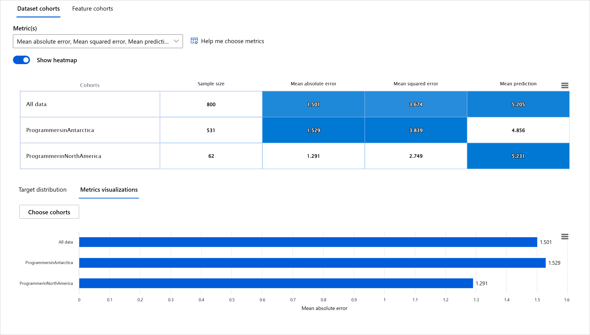

<!--
CO_OP_TRANSLATOR_METADATA:
{
  "original_hash": "ba0f6e1019351351c8ee4c92867b6a0b",
  "translation_date": "2025-08-29T17:24:33+00:00",
  "source_file": "9-Real-World/2-Debugging-ML-Models/README.md",
  "language_code": "mr"
}
-->
# पोस्टस्क्रिप्ट: मशीन लर्निंगमध्ये जबाबदार AI डॅशबोर्ड घटकांचा वापर करून मॉडेल डीबगिंग

## [पूर्व-व्याख्यान क्विझ](https://gray-sand-07a10f403.1.azurestaticapps.net/quiz/5/)

## परिचय

मशीन लर्निंग आपल्या दैनंदिन जीवनावर प्रभाव टाकते. AI आता आरोग्यसेवा, वित्त, शिक्षण, रोजगार यांसारख्या महत्त्वाच्या प्रणालींमध्ये प्रवेश करत आहे, ज्या आपल्याला वैयक्तिक तसेच सामाजिक पातळीवर प्रभावित करतात. उदाहरणार्थ, आरोग्य निदान किंवा फसवणूक शोधण्यासारख्या दैनंदिन निर्णय प्रक्रियेत प्रणाली आणि मॉडेल्स सहभागी असतात. परिणामी, AI मधील प्रगती आणि त्याचा वेगाने होणारा स्वीकार यामुळे समाजाच्या अपेक्षा बदलत आहेत आणि त्यासोबतच नियमांमध्येही बदल होत आहेत. आपण वारंवार पाहतो की AI प्रणाली अपेक्षांवर खरे उतरत नाहीत, नवीन आव्हाने निर्माण करतात, आणि सरकार AI उपायांवर नियमन लागू करत आहेत. त्यामुळे हे मॉडेल्स सर्वांसाठी न्याय्य, विश्वासार्ह, समावेशक, पारदर्शक आणि जबाबदार परिणाम देतात की नाही हे विश्लेषित करणे महत्त्वाचे आहे.

या अभ्यासक्रमात, आपण अशा व्यावहारिक साधनांचा अभ्यास करू जे मॉडेलमध्ये जबाबदार AI संबंधित समस्या आहेत का हे तपासण्यासाठी वापरले जाऊ शकतात. पारंपरिक मशीन लर्निंग डीबगिंग तंत्रे प्रामुख्याने एकत्रित अचूकता किंवा सरासरी त्रुटी हानी यांसारख्या परिमाणांवर आधारित असतात. कल्पना करा की आपण ज्या डेटाचा वापर करून हे मॉडेल तयार करत आहात त्यामध्ये विशिष्ट लोकसंख्येचा अभाव आहे, जसे की वंश, लिंग, राजकीय दृष्टिकोन, धर्म, किंवा काही लोकसंख्येचे प्रमाण जास्त आहे. जर मॉडेलचे आउटपुट काही लोकसंख्येला प्राधान्य देण्यासाठी व्याख्या केले गेले असेल तर काय? यामुळे संवेदनशील वैशिष्ट्य गटांचे अति किंवा कमी प्रतिनिधित्व होऊ शकते, ज्यामुळे मॉडेलमध्ये न्याय, समावेश किंवा विश्वासार्हतेच्या समस्या निर्माण होऊ शकतात. आणखी एक घटक म्हणजे, मशीन लर्निंग मॉडेल्स "ब्लॅक बॉक्स" मानले जातात, ज्यामुळे मॉडेलच्या अंदाजामागील कारणे समजणे आणि स्पष्ट करणे कठीण होते. जेव्हा डेटा सायंटिस्ट्स आणि AI विकसकांकडे मॉडेलचे न्याय किंवा विश्वासार्हता तपासण्यासाठी पुरेशी साधने नसतात, तेव्हा त्यांना या सर्व आव्हानांचा सामना करावा लागतो.

या धड्यात, आपण आपल्या मॉडेल्सचे डीबगिंग शिकाल:

- **त्रुटी विश्लेषण**: आपल्या डेटाच्या वितरणामध्ये जिथे मॉडेलमध्ये उच्च त्रुटी दर आहेत तेथे ओळखणे.
- **मॉडेल विहंगावलोकन**: विविध डेटा गटांमध्ये तुलना करून मॉडेलच्या कार्यक्षमतेतील विसंगती शोधणे.
- **डेटा विश्लेषण**: जिथे डेटा अति किंवा कमी प्रमाणात सादर केला जातो तेथे तपासणे, ज्यामुळे मॉडेल एका लोकसंख्येला दुसऱ्याच्या तुलनेत प्राधान्य देऊ शकतो.
- **वैशिष्ट्य महत्त्व**: जागतिक किंवा स्थानिक स्तरावर कोणती वैशिष्ट्ये मॉडेलच्या अंदाजांना चालना देत आहेत हे समजून घेणे.

## पूर्वअट

पूर्वअटी म्हणून, कृपया [विकसकांसाठी जबाबदार AI साधने](https://www.microsoft.com/ai/ai-lab-responsible-ai-dashboard) पुनरावलोकन करा.

> 

## त्रुटी विश्लेषण

पारंपरिक मॉडेल कार्यक्षमता मेट्रिक्स अचूकता मोजण्यासाठी प्रामुख्याने योग्य विरुद्ध अयोग्य अंदाजांवर आधारित गणना असतात. उदाहरणार्थ, जर एखाद्या मॉडेलने 89% वेळा अचूक अंदाज लावला आणि त्रुटी हानी 0.001 आहे, तर ते चांगले कार्य मानले जाऊ शकते. परंतु त्रुटी नेहमीच आपल्या मूळ डेटासेटमध्ये समान रीतीने वितरित नसतात. आपल्याला 89% मॉडेल अचूकता स्कोअर मिळू शकतो, परंतु असे आढळते की डेटाच्या विशिष्ट भागांमध्ये मॉडेल 42% वेळा अयशस्वी होत आहे. विशिष्ट डेटा गटांमध्ये या अपयशाच्या पद्धतींमुळे न्याय किंवा विश्वासार्हतेच्या समस्या उद्भवू शकतात. ज्या भागांमध्ये मॉडेल चांगले कार्य करत आहे किंवा नाही हे समजून घेणे आवश्यक आहे. ज्या डेटा भागांमध्ये मॉडेलमध्ये जास्त अचूकता नसते, ते महत्त्वाचे डेटा लोकसंख्येचे प्रतिनिधित्व करू शकतात.

RAI डॅशबोर्डवरील त्रुटी विश्लेषण घटक विविध गटांमध्ये मॉडेल अपयश कसे वितरित केले जाते हे ट्री व्हिज्युअलायझेशनद्वारे दर्शविते. हे आपल्या डेटासेटमधील ज्या भागांमध्ये जास्त त्रुटी दर आहे तेथे वैशिष्ट्ये किंवा क्षेत्रे ओळखण्यासाठी उपयुक्त आहे. जिथे मॉडेलच्या अचूकतेत त्रुटी आहेत, तिथून आपण मूळ कारण तपासण्यास सुरुवात करू शकता. आपण डेटा गट तयार करून त्यावर विश्लेषण करू शकता. हे डेटा गट डीबगिंग प्रक्रियेत मदत करतात, जसे की एक गट चांगले कार्य करत असताना दुसऱ्या गटात का त्रुटी आहेत हे शोधणे.

ट्री मॅपवरील दृश्य निर्देशक समस्या क्षेत्रे जलद ओळखण्यात मदत करतात. उदाहरणार्थ, ट्री नोडचा गडद लाल रंग जितका जास्त असेल, तितका त्रुटी दर जास्त असेल.

हीट मॅप हे आणखी एक व्हिज्युअलायझेशन फंक्शन आहे, जे वापरकर्त्यांना एक किंवा दोन वैशिष्ट्यांचा वापर करून त्रुटी दर तपासण्यासाठी उपयुक्त ठरते, ज्यामुळे संपूर्ण डेटासेट किंवा गटांमध्ये मॉडेल त्रुटींचे योगदानकर्ता शोधता येतात.

त्रुटी विश्लेषण वापरा जेव्हा आपल्याला:

* मॉडेल अपयश कसे वितरित केले जाते हे डेटासेट आणि विविध इनपुट व वैशिष्ट्य परिमाणांमध्ये सखोल समजून घ्यायचे आहे.
* एकत्रित कार्यक्षमता मेट्रिक्सचे विश्लेषण करून त्रुटी गट शोधायचे आहेत, ज्यामुळे लक्ष्यित सुधारणा पावले उचलता येतील.

## मॉडेल विहंगावलोकन

मशीन लर्निंग मॉडेलची कार्यक्षमता मूल्यांकन करण्यासाठी त्याच्या वर्तनाचा सर्वसमावेशक आढावा घेणे आवश्यक आहे. हे एकापेक्षा जास्त मेट्रिक्स (जसे की त्रुटी दर, अचूकता, रीकॉल, प्रिसिजन, किंवा MAE) पुनरावलोकन करून साध्य केले जाऊ शकते, ज्यामुळे कार्यक्षमतेतील विसंगती शोधता येतात. एक मेट्रिक चांगले दिसू शकते, परंतु दुसऱ्या मेट्रिकमध्ये अचूकतेतील त्रुटी उघड होऊ शकतात. याशिवाय, संपूर्ण डेटासेट किंवा गटांमध्ये मेट्रिक्सची तुलना केल्याने मॉडेल चांगले कार्य करत आहे की नाही हे स्पष्ट होते. हे विशेषतः संवेदनशील आणि असंवेदनशील वैशिष्ट्यांमध्ये (उदा., रुग्णाचा वंश, लिंग, किंवा वय) मॉडेलची कार्यक्षमता पाहण्यासाठी महत्त्वाचे आहे, ज्यामुळे मॉडेलमध्ये संभाव्य अन्याय उघड होतो.

RAI डॅशबोर्डवरील मॉडेल विहंगावलोकन घटक केवळ गटांमधील डेटा प्रतिनिधित्वाच्या कार्यक्षमता मेट्रिक्सचे विश्लेषण करण्यात मदत करत नाही, तर विविध गटांमध्ये मॉडेलच्या वर्तनाची तुलना करण्याची क्षमता देखील देते.

घटकाची वैशिष्ट्य-आधारित विश्लेषण कार्यक्षमता वापरकर्त्यांना विशिष्ट वैशिष्ट्यांमध्ये डेटा उपगट कमी करण्यास अनुमती देते, ज्यामुळे सूक्ष्म स्तरावर विसंगती ओळखता येतात. उदाहरणार्थ, डॅशबोर्डमध्ये वापरकर्त्याद्वारे निवडलेल्या वैशिष्ट्यासाठी (उदा., *"time_in_hospital < 3"* किंवा *"time_in_hospital >= 7"*) स्वयंचलितपणे गट तयार करण्याची अंतर्गत बुद्धिमत्ता आहे. यामुळे वापरकर्त्याला मोठ्या डेटा गटातून विशिष्ट वैशिष्ट्य वेगळे करण्यास आणि ते मॉडेलच्या त्रुटीपूर्ण परिणामांचे मुख्य प्रभावक आहे का हे पाहण्यास अनुमती मिळते.

मॉडेल विहंगावलोकन घटक दोन प्रकारच्या विसंगती मेट्रिक्सला समर्थन देते:

**मॉडेल कार्यक्षमतेतील विसंगती**: या मेट्रिक्सचा संच डेटा उपगटांमध्ये निवडलेल्या कार्यक्षमता मेट्रिकच्या मूल्यांमधील विसंगती (फरक) मोजतो. काही उदाहरणे:

* अचूकता दरातील विसंगती
* त्रुटी दरातील विसंगती
* प्रिसिजनमधील विसंगती
* रीकॉलमधील विसंगती
* सरासरी त्रुटी (MAE) मधील विसंगती

**निवड दरातील विसंगती**: हा मेट्रिक उपगटांमधील निवड दरातील (अनुकूल अंदाज) फरक मोजतो. याचे एक उदाहरण म्हणजे कर्ज मंजुरी दरातील विसंगती. निवड दर म्हणजे प्रत्येक वर्गातील डेटा पॉइंट्सचा अंश जो 1 म्हणून वर्गीकृत केला जातो (बायनरी वर्गीकरणामध्ये) किंवा अंदाज मूल्यांचे वितरण (प्रगतीशील विश्लेषणामध्ये).

## डेटा विश्लेषण

> "जर तुम्ही डेटा पुरेसा छळलात, तर तो काहीही कबूल करेल" - रोनाल्ड कोस

हे विधान अतिशयोक्तीपूर्ण वाटते, परंतु हे खरे आहे की डेटा कोणत्याही निष्कर्षाला समर्थन देण्यासाठी हाताळला जाऊ शकतो. कधी कधी अशी हाताळणी अनवधानाने होते. माणूस म्हणून, आपल्याकडे सर्वांनाच पूर्वग्रह असतो, आणि डेटा तयार करताना आपण पूर्वग्रह कधी आणतो हे जाणून घेणे कठीण असते. AI आणि मशीन लर्निंगमध्ये न्याय सुनिश्चित करणे हे एक गुंतागुंतीचे आव्हान आहे.

डेटा पारंपरिक मॉडेल कार्यक्षमता मेट्रिक्ससाठी एक मोठा अंध भाग आहे. आपल्याकडे उच्च अचूकता स्कोअर असू शकतात, परंतु याचा अर्थ असा नाही की आपल्या डेटासेटमध्ये अंतर्निहित डेटा पूर्वग्रह नाही. उदाहरणार्थ, जर एखाद्या कंपनीतील कार्यकारी पदांवरील महिलांचे प्रमाण 27% आणि पुरुषांचे प्रमाण 73% असेल, तर या डेटावर प्रशिक्षित केलेले नोकरी जाहिरात AI मॉडेल वरिष्ठ पदांसाठी प्रामुख्याने पुरुष प्रेक्षकांना लक्ष्य करू शकते. डेटामधील हा असमतोल मॉडेलच्या अंदाजाला एका लिंगाला प्राधान्य देण्यासाठी वाकवतो. यामुळे AI मॉडेलमध्ये लिंग पूर्वग्रह असल्याचे दिसून येते, जे न्यायाच्या समस्येचे निदर्शक आहे.

RAI डॅशबोर्डवरील डेटा विश्लेषण घटक डेटासेटमध्ये जिथे अति-प्रतिनिधित्व किंवा कमी-प्रतिनिधित्व आहे तेथे ओळखण्यात मदत करतो. डेटा असमतोल किंवा विशिष्ट डेटा गटाच्या प्रतिनिधित्वाच्या अभावामुळे त्रुटी आणि न्यायाच्या समस्यांचे मूळ कारण शोधण्यात हे वापरकर्त्यांना मदत करते. यामुळे वापरकर्त्यांना अंदाजित आणि वास्तविक परिणाम, त्रुटी गट, आणि विशिष्ट वैशिष्ट्यांवर आधारित डेटासेट व्हिज्युअलायझ करण्याची क्षमता मिळते. कधी कधी कमी प्रतिनिधित्व असलेला डेटा गट शोधल्याने असेही दिसून येते की मॉडेल चांगले शिकत नाही, म्हणूनच अचूकतेतील त्रुटी जास्त आहेत. डेटा पूर्वग्रह असलेले मॉडेल केवळ न्यायाच्या समस्येचे निदर्शक नाही, तर ते समावेशक किंवा विश्वासार्ह नाही हे देखील दर्शवते.

डेटा विश्लेषण वापरा जेव्हा आपल्याला:

* विविध फिल्टर निवडून आपला डेटासेट विविध परिमाणांमध्ये (गटांमध्ये) विभागायचा आहे.
* विविध गट आणि वैशिष्ट्य गटांमध्ये आपल्या डेटासेटचे वितरण समजून घ्यायचे आहे.
* न्याय, त्रुटी विश्लेषण, आणि कारणात्मकता (डॅशबोर्डच्या इतर घटकांमधून प्राप्त) संबंधित निष्कर्ष आपल्या डेटासेटच्या वितरणामुळे आहेत का हे ठरवायचे आहे.
* प्रतिनिधित्वाच्या समस्यांमुळे, लेबल आवाज, वैशिष्ट्य आवाज, लेबल पूर्वग्रह, आणि तत्सम घटकांमुळे उद्भवलेल्या त्रुटी कमी करण्यासाठी कोणत्या भागांमध्ये अधिक डेटा गोळा करायचा आहे हे ठरवायचे आहे.

## मॉडेल समज

मशीन लर्निंग मॉडेल्स "ब्लॅक बॉक्स" असल्याने, मॉडेलच्या अंदाजांना चालना देणारी प्रमुख डेटा वैशिष्ट्ये समजणे आव्हानात्मक ठरते. मॉडेलने विशिष्ट अंदाज का लावला हे समजावून सांगणे महत्त्वाचे आहे. उदाहरणार्थ, जर एखाद्या AI प्रणालीने अंदाज लावला की मधुमेह असलेल्या रुग्णाला 30 दिवसांच्या आत पुन्हा रुग्णालयात दाखल होण्याचा धोका आहे, तर त्या अंदाजामागील आधारभूत डेटा प्रदान करणे आवश्यक आहे. आधारभूत डेटा निर्देशक असल्याने पारदर्शकता निर्माण होते, ज्यामुळे डॉक्टर किंवा रुग्णालये माहितीपूर्ण निर्णय घेऊ शकतात. याशिवाय, एखाद्या रुग्णासाठी मॉडेलने विशिष्ट अंदाज का लावला हे स्पष्ट करण्याची क्षमता आरोग्य नियमांशी जबाबदारी सुनिश्चित करते. जेव्हा मशीन लर्निंग मॉडेल्स लोकांच्या जीवनावर परिणाम करणाऱ्या पद्धतींमध्ये वापरले जातात, तेव्हा मॉडेलच्या वर्तनावर परिणाम करणारे घटक समजून घेणे आणि स्पष्ट करणे महत्त्वाचे ठरते. मॉडेल समज आणि स्पष्टता खालील परिस्थितींमध्ये प्रश्नांची उत्तरे देण्यास मदत करते:

* मॉडेल डीबगिंग: माझ्या मॉडेलने ही चूक का केली? मी माझे मॉडेल कसे सुधारू शकतो?
* मानव-AI सहकार्य: मी मॉडेलच्या निर्णयांवर कसे विश्वास ठेवू शकतो?
* नियामक अनुपालन: माझे मॉडेल कायदेशीर आवश्यकता पूर्ण करते का?

RAI डॅशबोर्डवरील वैशिष्ट्य महत्त्व घटक आपल्याला डीबगिंग करण्यास आणि मॉडेल अंदाज कसे करतो याचे सर्वसमावेशक समज मिळविण्यास मदत करतो. मशीन लर्निंग व्यावसायिक आणि निर्णय घेणाऱ्यांसाठी हे एक उपयुक्त साधन आहे, जे मॉडेलच्या वर्तनावर परिणाम करणाऱ्या वैशिष्ट्यांचे पुरावे स्पष्ट करण्यासाठी आणि दाखवण्यासाठी उपयुक्त ठरते. यानंतर, वापरकर्ते जागतिक आणि स्थानिक स्पष्टीकरणे दोन्ही शोधू शकतात, ज्यामुळे कोणती वैशिष्ट्ये मॉडेलच्या अंदाजांना चालना देतात हे सत्यापित करता येते. जागतिक स्पष्टीकरणे मॉडेलच्या एकूण अंदाजांवर परिणाम करणाऱ्या शीर्ष वैशिष्ट्यांची यादी करतात. स्थानिक स्पष्टीकरणे विशिष्ट प्रकरणासाठी मॉडेलच्या अंदाजामागील वैशिष्ट्ये दर्शवितात. स्थानिक स्पष्टीकरणे तपासणे किंवा विशिष्ट प्रकरण डीबगिंगमध्ये उपयुक्त ठरते, ज्यामुळे मॉडेलने अचूक किंवा अचूक नसलेला अंदाज का लावला हे समजून घेता येते.

* जागतिक स्पष्टीकरणे: उदाहरणार्थ, मधुमेह रुग्णालय पुन्हा प्रवेश मॉडेलच्या एकूण वर्तनावर कोणती वैशिष्ट्ये परिणाम करतात?
* स्थानिक स्पष्टीकरणे: उदाहरणार्थ, 60 वर्षांपेक्षा जास्त वयाच्या आणि पूर्वीच्या रुग्णालयात दाखल झालेल्या मधुमेह रुग्णाला 30 दिवसांच्या आत पुन्हा रुग्णालयात दाखल होण्याचा किंवा न होण्याचा अंदाज का लावला गेला?

विविध गटांमध्ये मॉडेलच्या कार्यक्षमतेचे परीक्षण करताना, वैशिष्ट्य महत्त्व हे दर्शवते की गटांमध्ये वैशिष्ट्याचा प्रभाव किती आहे. मॉडेलच्या त्र
- **अतिशय किंवा कमी प्रतिनिधित्व**. कल्पना अशी आहे की एखादा विशिष्ट गट एखाद्या व्यवसायात दिसत नाही, आणि कोणतीही सेवा किंवा कार्य जे हे पुढे चालू ठेवते ते नुकसान पोहोचवण्यास योगदान देते.

### Azure RAI डॅशबोर्ड

[Azure RAI डॅशबोर्ड](https://learn.microsoft.com/en-us/azure/machine-learning/concept-responsible-ai-dashboard?WT.mc_id=aiml-90525-ruyakubu) हे ओपन-सोर्स टूल्सवर आधारित आहे जे प्रमुख शैक्षणिक संस्थांनी आणि संस्थांनी विकसित केले आहे, ज्यामध्ये Microsoft चा समावेश आहे. हे डेटा वैज्ञानिक आणि AI विकसकांना मॉडेलचे वर्तन अधिक चांगल्या प्रकारे समजून घेण्यासाठी, AI मॉडेलमधील अवांछनीय समस्या शोधण्यासाठी आणि कमी करण्यासाठी उपयुक्त आहे.

- RAI डॅशबोर्ड [डॉक्युमेंट्स](https://learn.microsoft.com/en-us/azure/machine-learning/how-to-responsible-ai-dashboard?WT.mc_id=aiml-90525-ruyakubu) तपासून वेगवेगळ्या घटकांचा वापर कसा करायचा ते शिका.

- Azure Machine Learning मध्ये अधिक जबाबदार AI परिस्थिती डिबग करण्यासाठी काही RAI डॅशबोर्ड [नमुन्य नोटबुक्स](https://github.com/Azure/RAI-vNext-Preview/tree/main/examples/notebooks) तपासा.

---
## 🚀 आव्हान

सांख्यिकीय किंवा डेटा पक्षपात टाळण्यासाठी, आपल्याला खालील गोष्टी करणे आवश्यक आहे:

- प्रणालींवर काम करणाऱ्या लोकांमध्ये विविध पार्श्वभूमी आणि दृष्टिकोन असणे
- आपल्या समाजातील विविधता प्रतिबिंबित करणाऱ्या डेटासेट्समध्ये गुंतवणूक करणे
- पक्षपात ओळखण्यासाठी आणि तो घडल्यावर सुधारण्यासाठी चांगल्या पद्धती विकसित करणे

मॉडेल तयार करणे आणि वापरण्याच्या वास्तविक जीवनातील परिस्थितींबद्दल विचार करा जिथे अन्याय स्पष्ट आहे. आणखी काय विचारात घ्यायला हवे?

## [व्याख्यानानंतरचा क्विझ](https://gray-sand-07a10f403.1.azurestaticapps.net/quiz/6/)
## पुनरावलोकन आणि स्व-अभ्यास

या धड्यात, तुम्ही मशीन लर्निंगमध्ये जबाबदार AI समाविष्ट करण्याचे काही व्यावहारिक टूल्स शिकले आहेत.

या कार्यशाळेचे निरीक्षण करा आणि विषयांमध्ये अधिक खोलवर जा:

- जबाबदार AI डॅशबोर्ड: Besmira Nushi आणि Mehrnoosh Sameki द्वारे प्रत्यक्षात RAI कार्यान्वित करण्यासाठी एक-स्टॉप शॉप

> 🎥 वरील प्रतिमेवर क्लिक करा: Besmira Nushi आणि Mehrnoosh Sameki द्वारे जबाबदार AI डॅशबोर्ड: प्रत्यक्षात RAI कार्यान्वित करण्यासाठी एक-स्टॉप शॉप

जबाबदार AI आणि अधिक विश्वासार्ह मॉडेल तयार करण्याबद्दल अधिक जाणून घेण्यासाठी खालील साहित्याचा संदर्भ घ्या:

- ML मॉडेल्स डिबग करण्यासाठी Microsoft चे RAI डॅशबोर्ड टूल्स: [जबाबदार AI टूल्स संसाधने](https://aka.ms/rai-dashboard)

- जबाबदार AI टूलकिट एक्सप्लोर करा: [Github](https://github.com/microsoft/responsible-ai-toolbox)

- Microsoft चे RAI संसाधन केंद्र: [जबाबदार AI संसाधने – Microsoft AI](https://www.microsoft.com/ai/responsible-ai-resources?activetab=pivot1%3aprimaryr4)

- Microsoft चा FATE संशोधन गट: [FATE: AI मध्ये न्याय, जबाबदारी, पारदर्शकता आणि नैतिकता - Microsoft Research](https://www.microsoft.com/research/theme/fate/)

## असाइनमेंट

[RAI डॅशबोर्ड एक्सप्लोर करा](assignment.md)

---

**अस्वीकरण**:  
हा दस्तऐवज AI भाषांतर सेवा [Co-op Translator](https://github.com/Azure/co-op-translator) वापरून भाषांतरित करण्यात आला आहे. आम्ही अचूकतेसाठी प्रयत्नशील असलो तरी कृपया लक्षात ठेवा की स्वयंचलित भाषांतरे त्रुटी किंवा अचूकतेच्या अभावाने युक्त असू शकतात. मूळ भाषेतील दस्तऐवज हा अधिकृत स्रोत मानला जावा. महत्त्वाच्या माहितीसाठी व्यावसायिक मानवी भाषांतराची शिफारस केली जाते. या भाषांतराचा वापर करून उद्भवलेल्या कोणत्याही गैरसमज किंवा चुकीच्या अर्थासाठी आम्ही जबाबदार राहणार नाही.