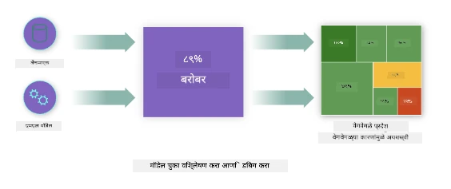
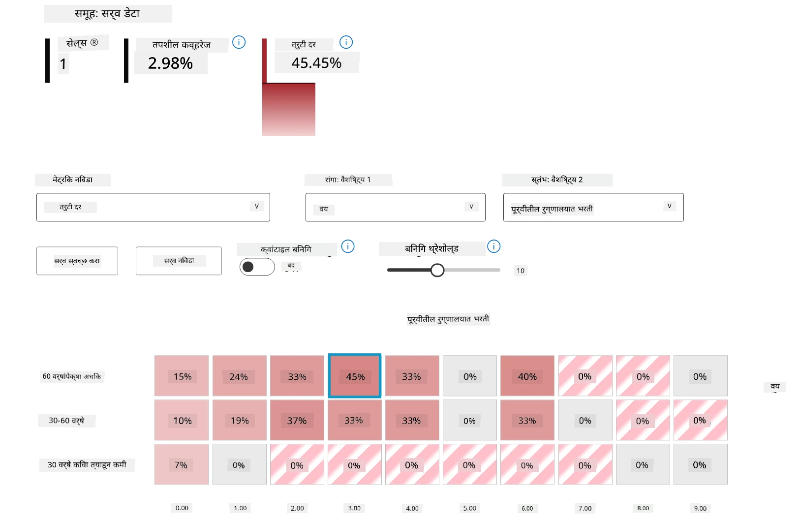
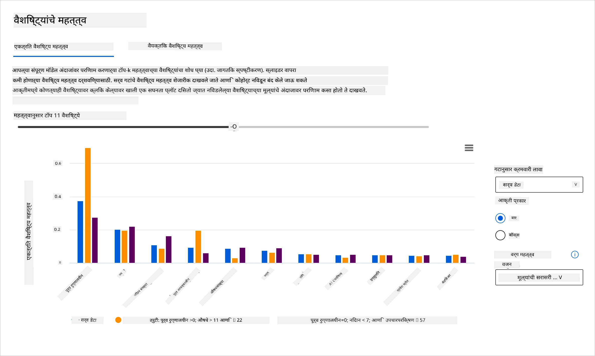
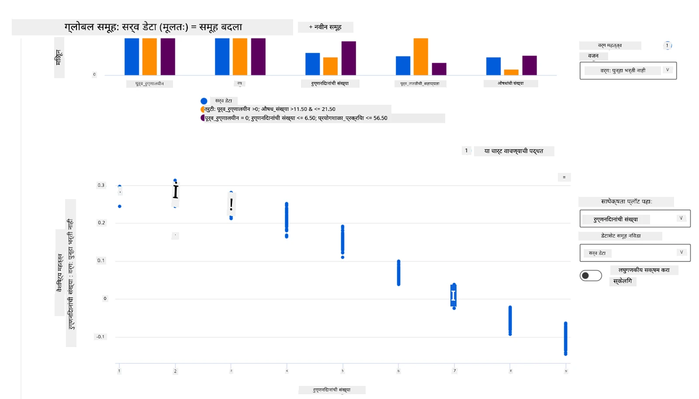

# पोस्टस्क्रिप्ट: जबाबदार AI डॅशबोर्ड घटकांचा वापर करून मशीन लर्निंगमधील मॉडेल डीबगिंग
 

## [पूर्व-व्याख्यान क्विझ](https://ff-quizzes.netlify.app/en/ml/)
 
## परिचय

मशीन लर्निंग आमच्या दैनंदिन आयुष्यात प्रभाव पाडते. AI काही अत्यंत महत्त्वाच्या प्रणालींमध्ये आपलं स्थान निर्माण करत आहे ज्या व्यक्ती म्हणून आम्हाला तसेच समाजाला प्रभावित करतात, जसे की आरोग्यसेवा, वित्त, शिक्षण, आणि रोजगार. उदाहरणार्थ, सिस्टम आणि मॉडेल्स दैनंदिन निर्णय घेण्याच्या कार्यांमध्ये सामील आहेत, जसे की आरोग्य सेवा निदान किंवा फसवणूक शोधणे. परिणामी, AI मधील प्रगती आणि वेगवान स्वीकारासोबत सामाजिक अपेक्षा विकसित होत आहेत आणि वाढत्या नियमांशी प्रतिसाद दिला जात आहे. आम्ही सतत असे भाग पाहतो जिथे AI सिस्टम अपेक्षा पूर्ण करत नाहीत; ते नवीन आव्हाने उभे करतात; आणि सरकार AI सोल्यूशन्सवर नियम लावत आहे. म्हणून, या मॉडेल्सचे विश्लेषण करणे महत्त्वाचे आहे जेणेकरून ते प्रत्येकासाठी न्याय्य, विश्वासार्ह, समावेशक, पारदर्शक आणि जबाबदार निकाल देऊ शकतील.

या अभ्यासक्रमात, आपण अशा प्रायोगिक साधनांकडे पाहणार आहोत जे वापरून मॉडेलमध्ये जबाबदार AI समस्या आहेत का याचे मूल्यांकन करता येते. पारंपरिक मशीन लर्निंग डीबगिंग तंत्रे मुख्यतः संख्यात्मक गणनांवर आधारित असतात जसे की एकत्रित अचूकता किंवा सरासरी त्रुटी तोटा. कल्पना करा जेव्हा तुम्ही वापरत असलेल्या डेटामध्ये काही लोकसंख्याशास्त्रीय घटक जसे की वंश, लिंग, राजकीय दृष्टीकोन, धर्म नसतील किंवा अशा घटकांचे असमतोल प्रतिनिधित्व असेल तर काय होईल? मॉडेलच्या आऊटपुटचे काही लोकसंख्याकीय गटांना प्राधान्य देणारे स्पष्टीकरण कसे मिळेल? हे संवेदनशील वैशिष्ट्य गटांचा अतिप्रतीन किंवा कमी प्रतिनिधित्व घडवू शकते ज्यामुळे मॉडेलमध्ये न्याय्यपणा, समावेशन किंवा विश्वासार्हतेच्या समस्या उद्भवू शकतात. आणखी एक बाब म्हणजे मशीन लर्निंग मॉडेल्स काळ्या पेट्या म्हणून गणले जातात, ज्यामुळे मॉडेलच्या भविष्यवाण्याचे काय कारण आहे हे समजणे आणि स्पष्ट करणे कठीण होते. हे सर्व डेटा सायंटिस्ट्स आणि AI विकसकांना भेडसावणारी आव्हाने आहेत जेव्हा त्यांच्याकडे योग्य साधने नसतात मॉडेलचे न्याय्यपणा किंवा विश्वासार्हता तपासण्यासाठी.

या धड्यामध्ये, तुम्हाला खालील गोष्टींबद्दल डीबगिंग शिकवले जाईल:

-	**त्रुटी विश्लेषण**: तुमच्या डेटाच्या वितरणात जिथे मॉडेलचे त्रुटी दर जास्त आहेत ते ओळखा.
-	**मॉडेल पुनरावलोकन**: वेगवेगळ्या डेटा गटांमध्ये तुलना करून तुमच्या मॉडेलच्या कामगिरीत असणाऱ्या फरकांचा शोध घ्या.
-	**डेटा विश्लेषण**: तुमच्या डेटामध्ये कोणत्या ठिकाणी काही डेटा लोकसंख्या गटांचे ओव्हर किंवा अंडर-प्रतिनिधित्व आहे का याचा तपास करा ज्यामुळे मॉडेल कोणत्याही एका डेटा लोकसंख्या गटाला प्राधान्य देण्याची शक्यता आहे.
-	**वैशिष्ट्य महत्त्व**: जागतिक किंवा स्थानिक पातळीवर कोणती वैशिष्ट्ये तुमच्या मॉडेलच्या भविष्यवाण्यांना प्रभावित करत आहेत हे समजून घ्या.

## पूर्वापेक्षा

कृपया पूर्वापेक्षाप्रमाणे [Answer AI साधने विकसकांसाठी](https://www.microsoft.com/ai/ai-lab-responsible-ai-dashboard) या पुनरावलोकन घ्या

> 

## त्रुटी विश्लेषण

पारंपरिक मॉडेल कामगिरी मोजण्यासाठी वापरल्या जाणाऱ्या अचूकता मापन सरासरी चुकीच्या आणि योग्य अंदाजांवर आधारित गणना असतात. उदाहरणार्थ, 0.001 त्रुटी तोट्याने ८९% अचूक असल्याचे ठरवणे चांगली कामगिरी मानली जाऊ शकते. त्रुटी समस्थानिकरित्या तुमच्या मूळ डेटासेटमधून विभागल्या जात नाहीत. ८९% मॉडेल अचूकता प्राप्त होताना, काही डेटा भागांमध्ये ४२% वेळा मॉडेल अपयशी ठरू शकते. विशिष्ट डेटा गटांमधले अपयशाचे नमुने न्याय्यपणा किंवा विश्वासार्हतेच्या समस्यांना हाताळू शकतात. मॉडेल जिथे चांगली कामगिरी करत आहे आणि जिथे नाही, हे समजून घेणे गरजेचे आहे. जिथे मॉडेलमध्ये चुकांची संख्या जास्त आहे त्या डेटामध्ये महत्त्वाचा डेटा लोकसंख्या गट असू शकतो.

RAI डॅशबोर्डवरील त्रुटी विश्लेषण घटक विविध गटांमध्ये मॉडेल अपयश कसे विभागले आहे हे वृक्ष दर्शनाद्वारे दर्शवितो. हे तुमच्या डेटासेटमध्ये जिथे त्रुटी दर जास्त असतो अशा वैशिष्ट्ये किंवा भाग ओळखण्यासाठी उपयुक्त आहे. जास्तीत जास्त मॉडेल चुका कुठून येत आहेत हे पाहून मूळ कारणाबद्दल तपासणी सुरू करू शकता. तुम्ही विश्लेषणासाठी डेटाचा गट तयार करू शकता. हे डेटा गट डीबगिंग प्रक्रियेत मदत करतात ज्यामुळे कळते का मॉडेल एका गटात चांगले काम करत आहे पण दुसर्‍यामध्ये चुकांसह आहे.

वृक्ष नकाशावरील दृश्य निर्देशक समस्याग्रस्त भाग त्वरीत शोधायला मदत करतात. उदाहरणार्थ, ज्या वृक्ष नोडला जास्त गडद लाल रंग आहे, त्या ठिकाणी त्रुटी दर जास्त आहे.

हीट मॅप अजून एक दृश्य फंक्शनॅलिटी आहे ज्याचा वापर वापरकर्ते एका किंवा दोन वैशिष्ट्यांचा वापर करून त्रुटी दर तपासण्यासाठी करू शकतात, ज्यामुळे तुमच्या डेटासेट किंवा गटांमध्ये मॉडेलच्या त्रुटींमध्ये योगदान देणारे भाग शोधता येतात.

जेव्हा तुम्हाला:

* डेटासेट आणि अनेक इनपुट व वैशिष्ट्य परिमाणांमध्ये मॉडेल अपयश कसे विभागले आहे हे सखोल समजून घ्यायचे आहे.
* एकत्रित कामगिरी मेट्रिक्स विश्लेषण करून आपोआप चुकीचे गट शोधायचे आहेत जे उपचारात्मक कृतीसाठी मार्गदर्शक ठरतील.

* अचूकता दरातील भेद
* त्रुटी दरातील भेद
* तपशिलातील भेद
* पुनर्प्राप्तीतील भेद

डेटा विश्लेषण वापरा जेव्हा तुम्हाला:

* वेगवेगळ्या फिल्टर्स निवडून तुमचा डेटासेट वेगवेगळ्या मितींमध्ये (किंवा गटांमध्ये) विभाजित करून तपासायचा असेल.
* विविध गट आणि वैशिष्ट्य गटांमध्ये तुमच्या डेटासेटचे वितरण समजून घ्यायचे असेल.
* तुमच्या निष्कर्षांची (न्याय्यतेसंबंधित, त्रुटी विश्लेषण, आणि कारणात्मकता) मूलभूत कारणे डेटासेटच्या वितरणावर आधारित आहेत की नाही हे ठरवायचे असेल.
* प्रतिनिधित्वाच्या समस्यांमुळे, एल्बल आवाज, वैशिष्ट्य आवाज, लेबल पूर्वग्रह यांसारख्या कारणांमुळे येणाऱ्या त्रुटी कमी करण्यासाठी कुठे अधिक डेटा गोळा करावा हे ठरवायचे असेल.

## मॉडेल समजावून सांगणे

मशीन लर्निंग मॉडेल्स बहुतेक काळा डबा असतात. कोणती मुख्य डेटा वैशिष्ट्ये मॉडेलचे भविष्यवाणी चालवतात हे समजून घेणे कठीण असते. एखाद्या मॉडेलने विशिष्ट भविष्यवाणी का केली हे स्पष्ट करणे महत्त्वाचे आहे. उदाहरणार्थ, जर एखाद्या AI प्रणालीने सूचित केले की डायबेटिक रुग्णाला ३० दिवसांच्या आत हॉस्पिटलमध्ये पुन्हा दाखल होण्याचा धोका आहे, तर त्याने त्याच्या भविष्यवाणीला काय समर्थन पुरवणारे डेटा आहे ते देखील देता यावे. समर्थन करणाऱ्या डेटा निर्देशकांनी पारदर्शकता आणते ज्यामुळे डॉक्टर किंवा रुग्णालय योग्य निर्णय घेऊ शकतात. तसेच एखाद्या रुग्णासाठी मॉडेलने भविष्यवाणी का केली आणि काय कारण होते हे स्पष्ट करण्यासशक्य असल्यास आरोग्य नियमांकडे जबाबदारीदेखील येते. लोकांच्या जीवनावर परिणाम करणाऱ्या मशीन लर्निंग मॉडेलसाठी मॉडेलचे वर्तन काय प्रभावित करते हे समजणे आणि स्पष्ट करणे अत्यंत आवश्यक आहे. मॉडेल स्पष्टता आणि समजणारी क्षमता खालील परिस्थितींसाठी उपयुक्त आहेत:

* मॉडेल डीबगिंग: माझ्या मॉडेलने ही चूक का केली? मॉडेल मी कसे सुधारू?
* मानवी - AI सहकार्य: मी कसे मॉडेलच्या निर्णयांवर विश्वास ठेवू शकतो आणि त्यांना समजू शकतो?
* नियामक अनुपालन: माझे मॉडेल कायदेशीर आवश्यकतांची पूर्तता करते का?

RAI डॅशबोर्डचा वैशिष्ट्य महत्त्व घटक तुम्हाला डीबगिंग करण्यात आणि समस्यांची संपूर्ण समज प्राप्त करण्यात मदत करतो की मॉडेल कसे भविष्यवाणी करतो. हे मशीन लर्निंग व्यावसायिक आणि निर्णय घेणाऱ्यांसाठी देखील उपयुक्त साधन आहे जे मॉडेलच्या वर्तनावर परिणाम करणाऱ्या वैशिष्ट्यांचे पुरावे स्पष्ट करतात आणि कायदेशीर अनुपालनासाठी दाखवू शकतात. वापरकर्ते जागतिक आणि स्थानिक स्पष्टीकरणे तपासू शकतात ज्यात कोणती वैशिष्ट्ये मॉडेलची भविष्यवाणी चालवतात हे तपासले जाते. जागतिक स्पष्टीकरणांमध्ये मॉडेलच्या एकूण भविष्यवाणीवर परिणाम करणाऱ्या महत्त्वाच्या वैशिष्ट्यांची यादी असते. स्थानिक स्पष्टीकरणे दर्शवतात की एखाद्या विशिष्ट प्रकरणासाठी कोणती वैशिष्ट्ये मॉडेलने भविष्यवाणी करताना वापरली. स्थानिक स्पष्टीकरणांचे मूल्यांकन डीबगिंग किंवा विशिष्ट प्रकरणाच्या ऑडिटिंगसाठी उपयुक्त आहे, ज्यामुळे समजायला आणि समजावून सांगायला मदत होते की मॉडेलने अचूक किंवा चुकीचे भविष्यवाणी का केली.

* जागतिक स्पष्टीकरणे: उदाहरणार्थ, डायबेटीस हॉस्पिटल रीडमिशन मॉडेलच्या एकूण वर्तनावर कोणती वैशिष्ट्ये परिणाम करतात?
* स्थानिक स्पष्टीकरणे: उदाहरणार्थ, ६० वर्षांहून वर वयस्कर आणि पुर्वी हॉस्पिटलमध्ये दाखल झालेल्या डायबेटिक रुग्णाला ३० दिवसांत रीडमिट होणार की नाही यासाठी मॉडेलने का भविष्यवाणी केली?

विविध गटांमध्ये मॉडेलची कामगिरी तपासण्याच्या डीबगिंग प्रक्रियेत, वैशिष्ट्य महत्त्व दर्शवते की एखाद्या वैशिष्ट्याचा गटांमध्ये कितपत परिणाम होतो. हे मॉडेलच्या त्रुटीपूर्ण भविष्यवाण्यांमध्ये वैशिष्ट्यांच्या प्रभावामध्ये फरक दर्शवते. वैशिष्ट्य महत्त्व घटक दर्शवू शकतो की कोणत्या वैशिष्ट्यांच्या मूल्यांनी मॉडेलच्या निकालावर सकारात्मक किंवा नकारात्मक परिणाम झाला. उदाहरणार्थ, जर मॉडेलने चुकीची भविष्यवाणी केली असेल तर घटक तुम्हाला तपशीलात जाऊन त्या भविष्यवाणीचे कारण असलेल्या वैशिष्ट्ये किंवा मूल्ये शोधण्याची क्षमता देतो. हा तपशील डीबगिंगसाठीच नाही तर ऑडिटिंगमध्ये पारदर्शकता आणि जबाबदारी साकारण्यासाठी उपयुक्त आहे. शेवटी, हा घटक न्याय्यतेच्या समस्या शोधण्यात मदत करतो. उदाहरणार्थ, जर एखाद्या संवेदनशील वैशिष्ट्य जसे की जाती वा लिंग याचा मॉडेलच्या भविष्यवाणीवर जोरदार प्रभाव असेल, तर हे मॉडेलमध्ये वंशीय वा लिंगाचा पूर्वग्रह असल्याचे संकेत असू शकतात.

समजावून सांगण्याचा वापर करा जेव्हा तुम्हाला:

* तुमच्या AI प्रणालीच्या भविष्यवाण्या किती विश्वासार्ह आहेत हे ठरवायचे असेल आणि काय वैशिष्ट्ये जास्त महत्त्वाची आहेत ते समजून घ्यायचे असेल.
* प्रथम तुमचा मॉडेल समजून घेऊन डीबगिंग व त्यानंतर मॉडेल निरोगी वैशिष्ट्यांचा वापर करत आहे की खोटे संबंध ओळखत आहे हे शोधायचे असेल.
* मॉडेल भविष्यवाणी संवेदनशील वैशिष्ट्यांवर करत आहे की त्याच्याशी उच्च संबंध असलेल्या वैशिष्ट्यांवर करत आहे हे समजून न्याय्यतेतील संभाव्य स्रोत शोधायचे असेल.
* स्थानिक स्पष्टीकरणे तयार करून तुमच्या मॉडेलच्या निर्णयांवर वापरकर्त्यांचा विश्वास वाढवायचा असेल.
* AI प्रणालीचा कायदेशीर ऑडिट पूर्ण करायचा असेल, ज्यामध्ये मॉडेलसची पडताळणी आणि मॉडेल निर्णयांचा माणसांवर होणारा परिणाम तपासायचा असेल.

## निष्कर्ष

सर्व RAI डॅशबोर्ड घटक प्रायोगिक साधने आहेत ज्यामुळे तुम्ही अशा मशीन लर्निंग मॉडेल तयार करू शकता जे समाजासाठी कमी हानिकारक आणि अधिक विश्वासार्ह असतील. हे मानवी अधिकारांवर होणाऱ्या धोक्यांची, विशिष्ट गटांना जीवनाच्या संधींपासून वगळण्याच्या किंवा भेदभावाच्या धोरणांची आणि शारीरिक किंवा मानसोपचारिक आघाताच्या धोका टाळण्यास मदत करते. हे तुमच्या मॉडेलच्या निर्णयांमध्ये पारदर्शकता आणण्यासाठी स्थानिक स्पष्टीकरणे तयार करून विश्वास वाढविण्यास देखील मदत करते. संभाव्य धोके खालीलप्रमाणे वर्गीकृत करता येतात:

- **वाटप**: उदाहरणार्थ, जर एखाद्या लिंग किंवा वंशाला दुसर्‍याच्या तुलनेत प्राधान्य दिले जात असेल.
- **सेवेची गुणवत्ता**: जर एका विशिष्ट परिस्थितीसाठी डेटा ट्रेन केला जात असे आणि वास्तविकता अधिक गुंतागुंतीची असे, तर ते कमी गुणवत्तेची सेवा देते.
- **चित्रपटबद्धी**: एखाद्या गटाशी पूर्वनिर्धारित गुणधर्म जोडणे.

- **निंदन**. कुणीतरी किंवा कोणत्यातरी गोष्टीवर अन्यायकारकपणे टीका करणे व लेबल लावणे.
- **अतिवादी किंवा अल्पविस्तारित प्रतिनिधित्व**. ही कल्पना आहे की एक विशिष्ट गट एखाद्या विशिष्ट व्यवसायात दिसत नाही, आणि कोणतीही सेवा किंवा कार्य जे याला प्रोत्साहन देते ते नुकसान करण्यास कारणीभूत आहे.

### Azure RAI डॅशबोर्ड
 
[Azure RAI डॅशबोर्ड](https://learn.microsoft.com/en-us/azure/machine-learning/concept-responsible-ai-dashboard?WT.mc_id=aiml-90525-ruyakubu) हे आघाडीच्या अकादमिक संस्था आणि Microsoft सह विविध संस्था विकसित केलेल्या मुक्त-स्रोत साधनांवर आधारित आहे आणि हे डेटासायंटिस्ट आणि AI विकसकांना मॉडेलच्या वर्तनास अधिक समजून घेण्यासाठी, AI मॉडेलमधील नापसंतीजनक समस्या शोधण्यासाठी आणि कमी करण्यासाठी मदत करतात.

- RAI डॅशबोर्डच्या विविध घटकांचा वापर कसा करावयाचा हे जाणून घेण्यासाठी [डॉक्युमेंट्स](https://learn.microsoft.com/en-us/azure/machine-learning/how-to-responsible-ai-dashboard?WT.mc_id=aiml-90525-ruyakubu) तपासा.

- Azure Machine Learning मध्ये अधिक जबाबदार AI परिस्थिति डिबग करण्यासाठी काही RAI डॅशबोर्ड [सॅम्पल नोटबुक्स](https://github.com/Azure/RAI-vNext-Preview/tree/main/examples/notebooks) तपासा.
  
---
## 🚀 आव्हान 
 
आकडेमोड किंवा डेटामध्ये पूर्वग्रह टाळण्यासाठी, आपण: 

- सिस्टिम्सवर काम करणाऱ्या लोकांमध्ये विविध पार्श्वभूमी आणि दृष्टिकोन असावेत 
- आमच्या समाजाच्या विविधतेचे प्रतिबिंबित करणाऱ्या डेटासेटमध्ये गुंतवणूक करावी 
- पूर्वग्रह आढळल्यावर तो शोधून काढण्यासाठी आणि दुरुस्त करण्यासाठी चांगल्या पद्धती विकसित कराव्यात 

वास्तविक आयुष्यातील अशा परिस्थितीबद्दल विचार करा जिथे मॉडेल तयार करणे आणि वापरण्यात अन्याय स्पष्ट दिसतो. आणखी काय विचारात घ्यावे? 

## [व्याख्यानानंतर क्विझ](https://ff-quizzes.netlify.app/en/ml/)
## पुनरावलोकन & स्वअध्ययन 
 
या धड्यात तुम्ही जबाबदार AI मशीन लर्निंगमध्ये समाविष्ट करण्यासंबंधी काही व्यावहारिक साधने शिकली आहेत.  

या विषयांवर सखोल जाणून घेण्यासाठी हा कार्यशाळा पहा: 

- जबाबदार AI डॅशबोर्ड: व्यवहारात RAI कार्यान्वित करण्यासाठी एकाच ठिकाणी सुविधा, लेखक: Besmira Nushi आणि Mehrnoosh Sameki

> 🎥 व्हिडिओसाठी वरिल प्रतिमा क्लिक करा: जबाबदार AI डॅशबोर्ड: व्यवहारात RAI कार्यान्वित करण्यासाठी एकाच ठिकाणी सुविधा, Besmira Nushi आणि Mehrnoosh Sameki यांसह
 
जबाबदार AI आणि विश्वासार्ह मॉडेल कसे तयार करायचे याबद्दल अधिक जाणून घेण्यासाठी खालील स्रोतांचा वापर करा: 

- Microsoft चे ML मॉडेल डिबग करण्यासाठी RAI डॅशबोर्ड साधने: [Responsible AI tools resources](https://aka.ms/rai-dashboard)

- Responsible AI टूलकिट एक्सप्लोर करा: [Github](https://github.com/microsoft/responsible-ai-toolbox)

- Microsoft चे RAI रिसोर्स सेंटर: [Responsible AI Resources – Microsoft AI](https://www.microsoft.com/ai/responsible-ai-resources?activetab=pivot1%3aprimaryr4) 

- Microsoft चा FATE संशोधन गट: [FATE: Fairness, Accountability, Transparency, and Ethics in AI - Microsoft Research](https://www.microsoft.com/research/theme/fate/) 

## कार्यप्रणाली

[RAI डॅशबोर्ड एक्सप्लोर करा](assignment.md)

---

<!-- CO-OP TRANSLATOR DISCLAIMER START -->
**अस्वीकरण**:
हा दस्तऐवज AI भाषांतर सेवा [Co-op Translator](https://github.com/Azure/co-op-translator) चा वापर करून अनुवादित केला आहे. जरी आम्ही अचूकतेसाठी प्रयत्न करतो, तरी कृपया लक्षात घ्या की स्वयंचलित भाषांतरांमध्ये त्रुटी किंवा अचूकतेची कमतरता असू शकते. मूळ दस्तऐवज त्याच्या मूळ भाषेत अधिकृत स्रोत मानला पाहिजे. महत्त्वाची माहिती असल्यास, व्यावसायिक मानवी भाषांतराची शिफारस केली जाते. या भाषांतराच्या वापरामुळे उद्भवणाऱ्या कोणत्याही गैरसमज किंवा चुकीच्या अर्थलावणीसाठी आम्ही जबाबदार नाही.
<!-- CO-OP TRANSLATOR DISCLAIMER END -->