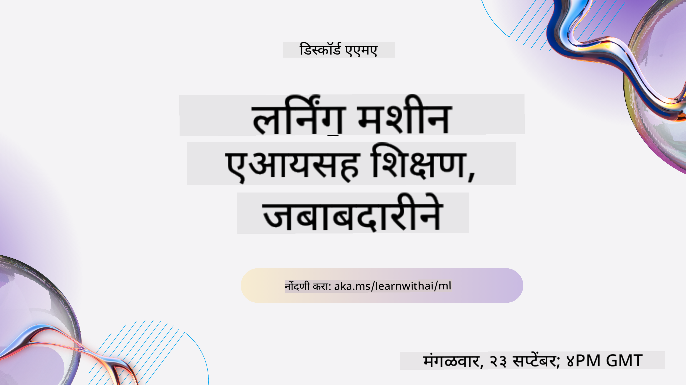

<!--
CO_OP_TRANSLATOR_METADATA:
{
  "original_hash": "7a13afb3674838f557d61f8d67e4d5f8",
  "translation_date": "2025-10-24T09:02:12+00:00",
  "source_file": "README.md",
  "language_code": "mr"
}
-->

### 🌐 बहुभाषिक समर्थन

#### GitHub Action द्वारे समर्थित (स्वयंचलित आणि नेहमी अद्ययावत)

<!-- CO-OP TRANSLATOR LANGUAGES TABLE START -->
[Arabic](../ar/README.md) | [Bengali](../bn/README.md) | [Bulgarian](../bg/README.md) | [Burmese (Myanmar)](../my/README.md) | [Chinese (Simplified)](../zh/README.md) | [Chinese (Traditional, Hong Kong)](../hk/README.md) | [Chinese (Traditional, Macau)](../mo/README.md) | [Chinese (Traditional, Taiwan)](../tw/README.md) | [Croatian](../hr/README.md) | [Czech](../cs/README.md) | [Danish](../da/README.md) | [Dutch](../nl/README.md) | [Estonian](../et/README.md) | [Finnish](../fi/README.md) | [French](../fr/README.md) | [German](../de/README.md) | [Greek](../el/README.md) | [Hebrew](../he/README.md) | [Hindi](../hi/README.md) | [Hungarian](../hu/README.md) | [Indonesian](../id/README.md) | [Italian](../it/README.md) | [Japanese](../ja/README.md) | [Korean](../ko/README.md) | [Lithuanian](../lt/README.md) | [Malay](../ms/README.md) | [Marathi](./README.md) | [Nepali](../ne/README.md) | [Norwegian](../no/README.md) | [Persian (Farsi)](../fa/README.md) | [Polish](../pl/README.md) | [Portuguese (Brazil)](../br/README.md) | [Portuguese (Portugal)](../pt/README.md) | [Punjabi (Gurmukhi)](../pa/README.md) | [Romanian](../ro/README.md) | [Russian](../ru/README.md) | [Serbian (Cyrillic)](../sr/README.md) | [Slovak](../sk/README.md) | [Slovenian](../sl/README.md) | [Spanish](../es/README.md) | [Swahili](../sw/README.md) | [Swedish](../sv/README.md) | [Tagalog (Filipino)](../tl/README.md) | [Tamil](../ta/README.md) | [Thai](../th/README.md) | [Turkish](../tr/README.md) | [Ukrainian](../uk/README.md) | [Urdu](../ur/README.md) | [Vietnamese](../vi/README.md)
<!-- CO-OP TRANSLATOR LANGUAGES TABLE END -->

#### आमच्या समुदायात सामील व्हा

आमच्याकडे Discord वर AI शिकण्याची मालिका सुरू आहे, अधिक जाणून घ्या आणि 18 - 30 सप्टेंबर, 2025 दरम्यान [Learn with AI Series](https://aka.ms/learnwithai/discord) मध्ये सामील व्हा. तुम्हाला GitHub Copilot डेटा सायन्ससाठी कसे वापरायचे याबद्दल टिप्स आणि ट्रिक्स मिळतील.

# नवशिक्यांसाठी मशीन लर्निंग - अभ्यासक्रम

> 🌍 जगभर प्रवास करा आणि जागतिक संस्कृतींच्या माध्यमातून मशीन लर्निंग एक्सप्लोर करा 🌍

Microsoft मधील Cloud Advocates ने **मशीन लर्निंग** बद्दल 12 आठवड्यांचा, 26 धड्यांचा अभ्यासक्रम सादर केला आहे. या अभ्यासक्रमात, तुम्ही **क्लासिक मशीन लर्निंग** म्हणून ओळखल्या जाणाऱ्या गोष्टींबद्दल शिकाल, प्रामुख्याने Scikit-learn लायब्ररीचा वापर करून आणि डीप लर्निंग टाळून, जे आमच्या [AI for Beginners' अभ्यासक्रमात](https://aka.ms/ai4beginners) समाविष्ट आहे. या धड्यांना आमच्या ['Data Science for Beginners' अभ्यासक्रमासोबत](https://aka.ms/ds4beginners) जोडा!

जगभरातील डेटा वापरून या क्लासिक तंत्रांचा उपयोग करताना आमच्यासोबत प्रवास करा. प्रत्येक धड्यात धडा सुरू करण्यापूर्वी आणि नंतरचे क्विझ, धडा पूर्ण करण्यासाठी लेखी सूचना, एक उपाय, एक असाइनमेंट आणि बरेच काही समाविष्ट आहे. आमची प्रकल्प-आधारित पद्धत तुम्हाला शिकत असताना तयार करण्याची परवानगी देते, नवीन कौशल्ये 'स्थिर' होण्यासाठी सिद्ध झालेला मार्ग.

**✍️ आमच्या लेखकांचे मनःपूर्वक आभार** Jen Looper, Stephen Howell, Francesca Lazzeri, Tomomi Imura, Cassie Breviu, Dmitry Soshnikov, Chris Noring, Anirban Mukherjee, Ornella Altunyan, Ruth Yakubu आणि Amy Boyd

**🎨 आमच्या चित्रकारांचेही आभार** Tomomi Imura, Dasani Madipalli, आणि Jen Looper

**🙏 विशेष आभार 🙏 Microsoft Student Ambassador लेखक, समीक्षक, आणि सामग्री योगदानकर्त्यांचे**, विशेषतः Rishit Dagli, Muhammad Sakib Khan Inan, Rohan Raj, Alexandru Petrescu, Abhishek Jaiswal, Nawrin Tabassum, Ioan Samuila, आणि Snigdha Agarwal

**🤩 अतिरिक्त आभार Microsoft Student Ambassadors Eric Wanjau, Jasleen Sondhi, आणि Vidushi Gupta यांचे आमच्या R धड्यांसाठी!**

# सुरुवात कशी करावी

या चरणांचे अनुसरण करा:
1. **रेपॉजिटरी फोर्क करा**: या पृष्ठाच्या वरच्या उजव्या कोपऱ्यातील "Fork" बटणावर क्लिक करा.
2. **रेपॉजिटरी क्लोन करा**:   `git clone https://github.com/microsoft/ML-For-Beginners.git`

> [या अभ्यासक्रमासाठी सर्व अतिरिक्त संसाधने आमच्या Microsoft Learn संग्रहामध्ये शोधा](https://learn.microsoft.com/en-us/collections/qrqzamz1nn2wx3?WT.mc_id=academic-77952-bethanycheum)

> 🔧 **मदतीची गरज आहे?** आमच्या [Troubleshooting Guide](TROUBLESHOOTING.md) मध्ये इन्स्टॉलेशन, सेटअप आणि धडे चालवण्याशी संबंधित सामान्य समस्यांसाठी उपाय तपासा.

**[विद्यार्थी](https://aka.ms/student-page)**, हा अभ्यासक्रम वापरण्यासाठी, संपूर्ण रेपॉजिटरी तुमच्या स्वतःच्या GitHub खात्यावर फोर्क करा आणि स्वतः किंवा गटासह सराव करा:

- व्याख्यानापूर्वीचे क्विझ सुरू करा.
- व्याख्यान वाचा आणि प्रत्येक ज्ञान तपासणीवर थांबून विचार करा.
- धड्यांमधून समजून प्रकल्प तयार करण्याचा प्रयत्न करा, सोल्यूशन कोड चालवण्याऐवजी; तथापि, तो कोड प्रत्येक प्रकल्प-आधारित धड्याच्या `/solution` फोल्डरमध्ये उपलब्ध आहे.
- व्याख्यानानंतरचे क्विझ घ्या.
- चॅलेंज पूर्ण करा.
- असाइनमेंट पूर्ण करा.
- धड्यांचा गट पूर्ण केल्यानंतर, [Discussion Board](https://github.com/microsoft/ML-For-Beginners/discussions) ला भेट द्या आणि "लर्न आउट लाउड" करून योग्य PAT रुब्रिक भरा. 'PAT' म्हणजे प्रगती मूल्यांकन साधन आहे जे तुम्ही तुमच्या शिकण्याला पुढे नेण्यासाठी भरता. आपण एकत्र शिकू शकतो जेणेकरून आपण इतर PAT वर प्रतिक्रिया देखील देऊ शकता.

> पुढील अभ्यासासाठी, आम्ही या [Microsoft Learn](https://docs.microsoft.com/en-us/users/jenlooper-2911/collections/k7o7tg1gp306q4?WT.mc_id=academic-77952-leestott) मॉड्यूल्स आणि शिकण्याच्या मार्गांचे अनुसरण करण्याची शिफारस करतो.

**शिक्षकांनो**, आम्ही हा अभ्यासक्रम कसा वापरायचा याबद्दल [काही सूचना समाविष्ट केल्या आहेत](for-teachers.md).

---

## व्हिडिओ वॉकथ्रू

काही धडे लघु स्वरूपातील व्हिडिओ म्हणून उपलब्ध आहेत. तुम्हाला हे सर्व धड्यांमध्ये इन-लाइन सापडतील, किंवा [Microsoft Developer YouTube चॅनेलवरील ML for Beginners प्लेलिस्ट](https://aka.ms/ml-beginners-videos) वर क्लिक करून खालील प्रतिमेवर सापडतील.

---

## टीमला भेटा

**Gif by** [Mohit Jaisal](https://linkedin.com/in/mohitjaisal)

> 🎥 प्रकल्प आणि ते तयार करणाऱ्या लोकांबद्दल व्हिडिओसाठी वरील प्रतिमेवर क्लिक करा!

---

## शिक्षण पद्धती

हा अभ्यासक्रम तयार करताना आम्ही दोन शिक्षण पद्धतींचा अवलंब केला आहे: हे **प्रकल्प-आधारित** असल्याचे सुनिश्चित करणे आणि त्यात **वारंवार क्विझ** समाविष्ट करणे. याशिवाय, या अभ्यासक्रमाला एक सामान्य **थीम** आहे जी त्याला सुसंगतता देते.

सामग्री प्रकल्पांशी संरेखित असल्याचे सुनिश्चित करून, प्रक्रिया विद्यार्थ्यांसाठी अधिक आकर्षक बनते आणि संकल्पनांचे स्मरणशक्ती वाढते. याशिवाय, वर्गापूर्वीचा कमी-जोखीम क्विझ विद्यार्थ्याला विषय शिकण्याच्या उद्देशाने तयार करतो, तर वर्गानंतरचा दुसरा क्विझ पुढील स्मरणशक्ती सुनिश्चित करतो. हा अभ्यासक्रम लवचिक आणि मजेदार बनवण्यासाठी डिझाइन केला गेला आहे आणि तो पूर्ण किंवा अंशतः घेतला जाऊ शकतो. प्रकल्प लहान सुरू होतात आणि 12 आठवड्यांच्या चक्राच्या शेवटी अधिकाधिक जटिल होतात. या अभ्यासक्रमात ML च्या वास्तविक-जगातील अनुप्रयोगांवरील एक पोस्टस्क्रिप्ट देखील समाविष्ट आहे, ज्याचा अतिरिक्त क्रेडिट म्हणून किंवा चर्चेच्या आधारावर वापर केला जाऊ शकतो.

> आमचा [Code of Conduct](CODE_OF_CONDUCT.md), [Contributing](CONTRIBUTING.md), [Translation](TRANSLATIONS.md), आणि [Troubleshooting](TROUBLESHOOTING.md) मार्गदर्शक शोधा. आम्ही तुमच्या रचनात्मक अभिप्रायाचे स्वागत करतो!

## प्रत्येक धड्यात समाविष्ट आहे

- वैकल्पिक स्केच नोट
- वैकल्पिक पूरक व्हिडिओ
- व्हिडिओ वॉकथ्रू (काही धडे फक्त)
- [व्याख्यानापूर्वीचे वॉर्मअप क्विझ](https://ff-quizzes.netlify.app/en/ml/)
- लेखी धडा
- प्रकल्प-आधारित धड्यांसाठी, प्रकल्प कसा तयार करायचा याबद्दल चरण-दर-चरण मार्गदर्शक
- ज्ञान तपासणी
- एक चॅलेंज
- पूरक वाचन
- असाइनमेंट
- [व्याख्यानानंतरचे क्विझ](https://ff-quizzes.netlify.app/en/ml/)

> **भाषांबद्दल एक टीप**: हे धडे प्रामुख्याने Python मध्ये लिहिलेले आहेत, परंतु बरेच R मध्ये देखील उपलब्ध आहेत. R धडा पूर्ण करण्यासाठी, `/solution` फोल्डरमध्ये जा आणि R धडे शोधा. त्यात .rmd विस्तार समाविष्ट आहे जो **R Markdown** फाइलचे प्रतिनिधित्व करतो, ज्याला `Markdown document` मध्ये `code chunks` (R किंवा इतर भाषांचे) आणि `YAML header` (PDF सारख्या आउटपुट स्वरूपात मार्गदर्शन करणारे) एम्बेडिंग म्हणून सोप्या शब्दांत परिभाषित केले जाऊ शकते. अशा प्रकारे, डेटा सायन्ससाठी हे एक आदर्श लेखन फ्रेमवर्क म्हणून काम करते कारण ते तुम्हाला तुमचा कोड, त्याचे आउटपुट आणि तुमचे विचार Markdown मध्ये लिहिण्याची परवानगी देते. याशिवाय, R Markdown दस्तऐवज PDF, HTML किंवा Word सारख्या आउटपुट स्वरूपात प्रस्तुत केले जाऊ शकतात.

> **क्विझबद्दल एक टीप**: सर्व क्विझ [Quiz App folder](../../quiz-app) मध्ये समाविष्ट आहेत, एकूण 52 क्विझेस, प्रत्येकी तीन प्रश्नांसह. ते धड्यांमधून लिंक केलेले आहेत परंतु क्विझ अॅप स्थानिकरित्या चालवले जाऊ शकते; `quiz-app` फोल्डरमधील सूचनांचे अनुसरण करून स्थानिकरित्या होस्ट करा किंवा Azure वर तैनात करा.

| धडा क्रमांक |                             विषय                              |                   धडा गटबद्धी                   | शिकण्याचे उद्दिष्ट                                                                                                             |                                                              लिंक केलेला धडा                                                               |                        लेखक                        |
| :-----------: | :------------------------------------------------------------: | :-------------------------------------------------: | ------------------------------------------------------------------------------------------------------------------------------- | :--------------------------------------------------------------------------------------------------------------------------------------: | :--------------------------------------------------: |
|      01       |                मशीन लर्निंगची ओळख                |      [Introduction](1-Introduction/README.md)       | मशीन लर्निंगमागील मूलभूत संकल्पना जाणून घ्या                                                                                |                                             [Lesson](1-Introduction/1-intro-to-ML/README.md)                                             |                       मुहम्मद                       |
|      02       |                मशीन लर्निंगचा इतिहास                 |      [Introduction](1-Introduction/README.md)       | या क्षेत्रामागील इतिहास जाणून घ्या                                                                                         |                                            [Lesson](1-Introduction/2-history-of-ML/README.md)                                            |                     जेन आणि एमी                      |
|      03       |                 न्याय आणि मशीन लर्निंग                  |      [Introduction](1-Introduction/README.md)       | मशीन लर्निंग मॉडेल तयार करताना आणि लागू करताना विद्यार्थ्यांनी न्यायासंबंधी कोणते महत्त्वाचे तत्त्वज्ञानात्मक मुद्दे विचारात घ्यावे? |                                              [Lesson](1-Introduction/3-fairness/README.md)                                               |                        टोमोमी                        |
|      04       |                मशीन लर्निंगसाठी तंत्रे                 |      [Introduction](1-Introduction/README.md)       | मशीन लर्निंग मॉडेल तयार करण्यासाठी एमएल संशोधक कोणती तंत्रे वापरतात?                                                                       |                                          [Lesson](1-Introduction/4-techniques-of-ML/README.md)                                           |                    क्रिस आणि जेन                     |
|      05       |                   रिग्रेशनची ओळख                   |        [Regression](2-Regression/README.md)         | रिग्रेशन मॉडेलसाठी पायथन आणि स्काय-किट लर्न वापरण्यास प्रारंभ करा                                                                  |         [Python](2-Regression/1-Tools/README.md) • [R](../../2-Regression/1-Tools/solution/R/lesson_1.html)         |      जेन • एरिक वांजाऊ       |
|      06       |                उत्तर अमेरिकन भोपळ्याचे दर 🎃                |        [Regression](2-Regression/README.md)         | मशीन लर्निंगसाठी डेटा व्हिज्युअलाइझ करा आणि स्वच्छ करा                                                                                  |          [Python](2-Regression/2-Data/README.md) • [R](../../2-Regression/2-Data/solution/R/lesson_2.html)          |      जेन • एरिक वांजाऊ       |
|      07       |                उत्तर अमेरिकन भोपळ्याचे दर 🎃                |        [Regression](2-Regression/README.md)         | रेषीय आणि बहुपद रिग्रेशन मॉडेल तयार करा                                                                                   |        [Python](2-Regression/3-Linear/README.md) • [R](../../2-Regression/3-Linear/solution/R/lesson_3.html)        |      जेन आणि दिमित्री • एरिक वांजाऊ       |
|      08       |                उत्तर अमेरिकन भोपळ्याचे दर 🎃                |        [Regression](2-Regression/README.md)         | लॉजिस्टिक रिग्रेशन मॉडेल तयार करा                                                                                               |     [Python](2-Regression/4-Logistic/README.md) • [R](../../2-Regression/4-Logistic/solution/R/lesson_4.html)      |      जेन • एरिक वांजाऊ       |
|      09       |                          एक वेब अ‍ॅप 🔌                          |           [Web App](3-Web-App/README.md)            | तुमच्या प्रशिक्षित मॉडेलसाठी वेब अ‍ॅप तयार करा                                                                                       |                                                 [Python](3-Web-App/1-Web-App/README.md)                                                  |                         जेन                          |
|      10       |                 वर्गीकरणाची ओळख                 |    [Classification](4-Classification/README.md)     | तुमचा डेटा स्वच्छ करा, तयार करा आणि व्हिज्युअलाइझ करा; वर्गीकरणाची ओळख                                                            | [Python](4-Classification/1-Introduction/README.md) • [R](../../4-Classification/1-Introduction/solution/R/lesson_10.html)  | जेन आणि कॅसी • एरिक वांजाऊ |
|      11       |             स्वादिष्ट आशियाई आणि भारतीय पदार्थ 🍜             |    [Classification](4-Classification/README.md)     | वर्गीकरणकर्त्यांची ओळख                                                                                                     | [Python](4-Classification/2-Classifiers-1/README.md) • [R](../../4-Classification/2-Classifiers-1/solution/R/lesson_11.html) | जेन आणि कॅसी • एरिक वांजाऊ |
|      12       |             स्वादिष्ट आशियाई आणि भारतीय पदार्थ 🍜             |    [Classification](4-Classification/README.md)     | अधिक वर्गीकरणकर्ते                                                                                                                | [Python](4-Classification/3-Classifiers-2/README.md) • [R](../../4-Classification/3-Classifiers-2/solution/R/lesson_12.html) | जेन आणि कॅसी • एरिक वांजाऊ |
|      13       |             स्वादिष्ट आशियाई आणि भारतीय पदार्थ 🍜             |    [Classification](4-Classification/README.md)     | तुमच्या मॉडेलचा वापर करून शिफारस करणारा वेब अ‍ॅप तयार करा                                                                                    |                                              [Python](4-Classification/4-Applied/README.md)                                              |                         जेन                          |
|      14       |                   क्लस्टरिंगची ओळख                   |        [Clustering](5-Clustering/README.md)         | तुमचा डेटा स्वच्छ करा, तयार करा आणि व्हिज्युअलाइझ करा; क्लस्टरिंगची ओळख                                                                |         [Python](5-Clustering/1-Visualize/README.md) • [R](../../5-Clustering/1-Visualize/solution/R/lesson_14.html)         |      जेन • एरिक वांजाऊ       |
|      15       |              नायजेरियन संगीताची आवड शोधणे 🎧              |        [Clustering](5-Clustering/README.md)         | के-मीन्स क्लस्टरिंग पद्धत शोधा                                                                                           |           [Python](5-Clustering/2-K-Means/README.md) • [R](../../5-Clustering/2-K-Means/solution/R/lesson_15.html)           |      जेन • एरिक वांजाऊ       |
|      16       |        नैसर्गिक भाषा प्रक्रिया ओळख ☕️         |   [Natural language processing](6-NLP/README.md)    | एक सोपा बॉट तयार करून NLP बद्दल मूलभूत गोष्टी जाणून घ्या                                                                             |                                             [Python](6-NLP/1-Introduction-to-NLP/README.md)                                              |                       स्टीफन                        |
|      17       |                      सामान्य NLP कार्य ☕️                      |   [Natural language processing](6-NLP/README.md)    | भाषेच्या संरचनांशी व्यवहार करताना आवश्यक असलेल्या सामान्य कार्यांबद्दल समजून घेऊन तुमचे NLP ज्ञान वाढवा                          |                                                    [Python](6-NLP/2-Tasks/README.md)                                                     |                       स्टीफन                        |
|      18       |             भाषांतर आणि भावना विश्लेषण ♥️              |   [Natural language processing](6-NLP/README.md)    | जेन ऑस्टेनसह भाषांतर आणि भावना विश्लेषण                                                                             |                                            [Python](6-NLP/3-Translation-Sentiment/README.md)                                             |                       स्टीफन                        |
|      19       |                  युरोपमधील रोमँटिक हॉटेल्स ♥️                  |   [Natural language processing](6-NLP/README.md)    | हॉटेल पुनरावलोकनांसह भावना विश्लेषण 1                                                                                         |                                               [Python](6-NLP/4-Hotel-Reviews-1/README.md)                                                |                       स्टीफन                        |
|      20       |                  युरोपमधील रोमँटिक हॉटेल्स ♥️                  |   [Natural language processing](6-NLP/README.md)    | हॉटेल पुनरावलोकनांसह भावना विश्लेषण 2                                                                                         |                                               [Python](6-NLP/5-Hotel-Reviews-2/README.md)                                                |                       स्टीफन                        |
|      21       |            वेळ मालिका अंदाजाची ओळख             |        [Time series](7-TimeSeries/README.md)        | वेळ मालिका अंदाजाची ओळख                                                                                         |                                             [Python](7-TimeSeries/1-Introduction/README.md)                                              |                      फ्रान्सेस्का                       |
|      22       | ⚡️ जागतिक ऊर्जा वापर ⚡️ - ARIMA सह वेळ मालिका अंदाज |        [Time series](7-TimeSeries/README.md)        | ARIMA सह वेळ मालिका अंदाज                                                                                              |                                                 [Python](7-TimeSeries/2-ARIMA/README.md)                                                 |                      फ्रान्सेस्का                       |
|      23       |  ⚡️ जागतिक ऊर्जा वापर ⚡️ - SVR सह वेळ मालिका अंदाज  |        [Time series](7-TimeSeries/README.md)        | सपोर्ट व्हेक्टर रिग्रेसर सह वेळ मालिका अंदाज                                                                           |                                                  [Python](7-TimeSeries/3-SVR/README.md)                                                  |                       अनिर्बन                        |
|      24       |             पुनर्बलन शिक्षणाची ओळख             | [Reinforcement learning](8-Reinforcement/README.md) | Q-लर्निंगसह पुनर्बलन शिक्षणाची ओळख                                                                          |                                             [Python](8-Reinforcement/1-QLearning/README.md)                                              |                        दिमित्री                        |
|      25       |                 पीटरला लांडग्यापासून वाचवा! 🐺                  | [Reinforcement learning](8-Reinforcement/README.md) | पुनर्बलन शिक्षण जिम                                                                                                      |                                                [Python](8-Reinforcement/2-Gym/README.md)                                                 |                        दिमित्री                        |
|  Postscript   |            वास्तविक जगातील एमएल परिस्थिती आणि अनुप्रयोग            |      [ML in the Wild](9-Real-World/README.md)       | पारंपरिक एमएलचे मनोरंजक आणि उघड करणारे वास्तविक जगातील अनुप्रयोग                                                               |                                             [Lesson](9-Real-World/1-Applications/README.md)                                              |                         टीम                         |
|  Postscript   |            RAI डॅशबोर्ड वापरून एमएलमध्ये मॉडेल डीबगिंग          |      [ML in the Wild](9-Real-World/README.md)       | जबाबदार एआय डॅशबोर्ड घटक वापरून मशीन लर्निंगमध्ये मॉडेल डीबगिंग                                                              |                                             [Lesson](9-Real-World/2-Debugging-ML-Models/README.md)                                              |                         रूथ याकुब                       |

> [या कोर्ससाठी Microsoft Learn संग्रहात सर्व अतिरिक्त संसाधने शोधा](https://learn.microsoft.com/en-us/collections/qrqzamz1nn2wx3?WT.mc_id=academic-77952-bethanycheum)

## ऑफलाइन प्रवेश

तुम्ही [Docsify](https://docsify.js.org/#/) वापरून हे दस्तऐवजीकरण ऑफलाइन चालवू शकता. या रिपॉजिटरीला फोर्क करा, तुमच्या स्थानिक मशीनवर [Docsify इंस्टॉल करा](https://docsify.js.org/#/quickstart), आणि नंतर या रिपॉजिटरीच्या मूळ फोल्डरमध्ये `docsify serve` टाइप करा. वेबसाइट तुमच्या लोकलहोस्टवर पोर्ट 3000 वर चालवली जाईल: `localhost:3000`.

## PDFs

लिंक्ससह अभ्यासक्रमाचा पीडीएफ [येथे](https://microsoft.github.io/ML-For-Beginners/pdf/readme.pdf) शोधा.

## 🎒 इतर अभ्यासक्रम 

आमची टीम इतर अभ्यासक्रम तयार करते! तपासा:

<!-- CO-OP TRANSLATOR OTHER COURSES START -->
### Azure / Edge / MCP / Agents

---
 
### जनरेटिव एआय मालिका

[-9333EA?style=for-the-badge&labelColor=E5E7EB&color=9333EA)](https://github.com/microsoft/Generative-AI-for-beginners-dotnet?WT.mc_id=academic-105485-koreyst)
[-C084FC?style=for-the-badge&labelColor=E5E7EB&color=C084FC)](https://github.com/microsoft/generative-ai-for-beginners-java?WT.mc_id=academic-105485-koreyst)
[-E879F9?style=for-the-badge&labelColor=E5E7EB&color=E879F9)](https://github.com/microsoft/generative-ai-with-javascript?WT.mc_id=academic-105485-koreyst)

---
 
### मुख्य शिक्षण
  
  
  
  
  
  
  

---

### Copilot मालिका  
  
  
  
<!-- CO-OP TRANSLATOR OTHER COURSES END -->

## मदत मिळवा  

जर तुम्हाला अडचण येत असेल किंवा AI अ‍ॅप्स तयार करताना काही प्रश्न असतील, तर येथे सामील व्हा:  

  

जर तुम्हाला उत्पादनाबद्दल अभिप्राय द्यायचा असेल किंवा तयार करताना काही त्रुटी आढळल्या तर येथे भेट द्या:  

  

---

**अस्वीकरण**:  
हा दस्तऐवज AI भाषांतर सेवा [Co-op Translator](https://github.com/Azure/co-op-translator) वापरून भाषांतरित करण्यात आला आहे. आम्ही अचूकतेसाठी प्रयत्नशील असलो तरी, कृपयास लक्षात ठेवा की स्वयंचलित भाषांतरे त्रुटी किंवा अचूकतेच्या अभावासह असू शकतात. मूळ भाषेतील दस्तऐवज हा अधिकृत स्रोत मानला जावा. महत्त्वाच्या माहितीसाठी, व्यावसायिक मानवी भाषांतराची शिफारस केली जाते. या भाषांतराचा वापर करून उद्भवलेल्या कोणत्याही गैरसमज किंवा चुकीच्या अर्थासाठी आम्ही जबाबदार नाही.