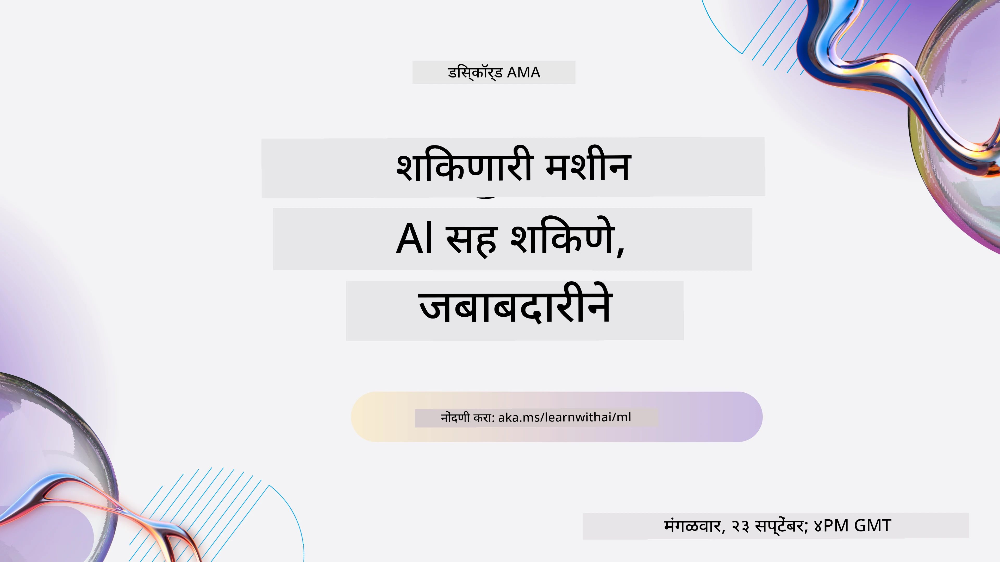
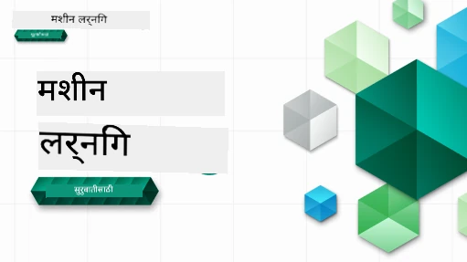

[](https://github.com/microsoft/ML-For-Beginners/blob/master/LICENSE)
[](https://GitHub.com/microsoft/ML-For-Beginners/graphs/contributors/)
[](https://GitHub.com/microsoft/ML-For-Beginners/issues/)
[](https://GitHub.com/microsoft/ML-For-Beginners/pulls/)
[](http://makeapullrequest.com)

[](https://GitHub.com/microsoft/ML-For-Beginners/watchers/)
[](https://GitHub.com/microsoft/ML-For-Beginners/network/)
[](https://GitHub.com/microsoft/ML-For-Beginners/stargazers/)

### 🌐 मल्टि-भाषा समर्थन

#### GitHub Action द्वारे समर्थन (स्वयंचलित आणि नेहमी अद्ययावत)

<!-- CO-OP TRANSLATOR LANGUAGES TABLE START -->
[Arabic](../ar/README.md) | [Bengali](../bn/README.md) | [Bulgarian](../bg/README.md) | [Burmese (Myanmar)](../my/README.md) | [Chinese (Simplified)](../zh-CN/README.md) | [Chinese (Traditional, Hong Kong)](../zh-HK/README.md) | [Chinese (Traditional, Macau)](../zh-MO/README.md) | [Chinese (Traditional, Taiwan)](../zh-TW/README.md) | [Croatian](../hr/README.md) | [Czech](../cs/README.md) | [Danish](../da/README.md) | [Dutch](../nl/README.md) | [Estonian](../et/README.md) | [Finnish](../fi/README.md) | [French](../fr/README.md) | [German](../de/README.md) | [Greek](../el/README.md) | [Hebrew](../he/README.md) | [Hindi](../hi/README.md) | [Hungarian](../hu/README.md) | [Indonesian](../id/README.md) | [Italian](../it/README.md) | [Japanese](../ja/README.md) | [Kannada](../kn/README.md) | [Khmer](../km/README.md) | [Korean](../ko/README.md) | [Lithuanian](../lt/README.md) | [Malay](../ms/README.md) | [Malayalam](../ml/README.md) | [Marathi](./README.md) | [Nepali](../ne/README.md) | [Nigerian Pidgin](../pcm/README.md) | [Norwegian](../no/README.md) | [Persian (Farsi)](../fa/README.md) | [Polish](../pl/README.md) | [Portuguese (Brazil)](../pt-BR/README.md) | [Portuguese (Portugal)](../pt-PT/README.md) | [Punjabi (Gurmukhi)](../pa/README.md) | [Romanian](../ro/README.md) | [Russian](../ru/README.md) | [Serbian (Cyrillic)](../sr/README.md) | [Slovak](../sk/README.md) | [Slovenian](../sl/README.md) | [Spanish](../es/README.md) | [Swahili](../sw/README.md) | [Swedish](../sv/README.md) | [Tagalog (Filipino)](../tl/README.md) | [Tamil](../ta/README.md) | [Telugu](../te/README.md) | [Thai](../th/README.md) | [Turkish](../tr/README.md) | [Ukrainian](../uk/README.md) | [Urdu](../ur/README.md) | [Vietnamese](../vi/README.md)

> **स्थानिक कॉपी करायला प्राधान्य देता?**
>
> या साठ्यामध्ये 50+ भाषा अनुवाद आहेत ज्यामुळे डाउनलोड आकार लक्षणीय वाढतो. भाषांतरांशिवाय क्लोन करण्यासाठी sparse checkout वापरा:
>
> **Bash / macOS / Linux:**
> ```bash
> git clone --filter=blob:none --sparse https://github.com/microsoft/ML-For-Beginners.git
> cd ML-For-Beginners
> git sparse-checkout set --no-cone '/*' '!translations' '!translated_images'
> ```
>
> **CMD (Windows):**
> ```cmd
> git clone --filter=blob:none --sparse https://github.com/microsoft/ML-For-Beginners.git
> cd ML-For-Beginners
> git sparse-checkout set --no-cone "/*" "!translations" "!translated_images"
> ```
>
> हे तुम्हाला कोर्स पूर्ण करण्यासाठी आवश्यक असलेल्या सर्व काही प्रदान करते, खूप जलद डाउनलोडसह.
<!-- CO-OP TRANSLATOR LANGUAGES TABLE END -->

#### आमच्या समुदायात सामील व्हा

[](https://discord.gg/nTYy5BXMWG)

आमच्याकडे डिसकॉर्ड मध्ये AI सह शिक्षण मालिकेतसुद्धा आहे, अधिक जाणून घ्या आणि आमच्यात सामील व्हा [Learn with AI Series](https://aka.ms/learnwithai/discord) १८ - ३० सप्टेंबर, २०२५ पासून. तुम्हाला GitHub Copilot वापरण्याचे टिप्स आणि ट्रिक्स मिळतील Data Science साठी.



# नवशिक्यांसाठी मशीन लर्निंग - एक अभ्यासक्रम

> 🌍 जगभर प्रवास करा जसे आपण जगातील संस्कृतींमधून मशीन लर्निंग शोधतो 🌍

Microsoft मधील Cloud Advocates आनंदाने 12 आठवड्यांचा, 26 धड्यांचा अभ्यासक्रम सादर करतात जो **मशीन लर्निंग** विषयी आहे. या अभ्यासक्रमात आपण जे काही कधीकधी **क्लासिक मशीन लर्निंग** म्हणतात, त्याबद्दल शिकलो, मुख्यत्वे Scikit-learn या लायब्ररीचा वापर करत आणि डीप लर्निंग टाळत, जी आमच्या [AI for Beginners' curriculum](https://aka.ms/ai4beginners) मध्ये कव्हर केली जाते. या धडे जोडून आमच्या ['Data Science for Beginners' curriculum](https://aka.ms/ds4beginners) सह शिका!

जगभरच्या वेगवेगळ्या भागांमधून डेटा वापरून आपण या क्लासिक तंत्रांचा वापर कसा करतो ते बघण्यासाठी आमच्यासोबत प्रवास करा. प्रत्येक धड्यात प्री-आणि पोस्ट-धडा क्विज, लेखी सूचना, एक उत्तर, एक असाइनमेंट आणि अनेक गोष्टी असतात. आमची प्रकल्प-आधारित शिकवण आपल्याला शिकत असताना तयार करण्यास अनुमती देते, जे नवीन कौशल्ये टिकाव धरायला पुरावा असतो.

**✍️ आमच्या लेखकांचे हार्दिक आभार** Jen Looper, Stephen Howell, Francesca Lazzeri, Tomomi Imura, Cassie Breviu, Dmitry Soshnikov, Chris Noring, Anirban Mukherjee, Ornella Altunyan, Ruth Yakubu आणि Amy Boyd यांना

**🎨 आमच्या चित्रकारांचे देखील आभार** Tomomi Imura, Dasani Madipalli आणि Jen Looper यांना

**🙏 खास आभार 🙏 आमच्या Microsoft Student Ambassador लेखक, लेखक समीक्षक, आणि कंटेंट योगदानकर्त्यांना**, विशेषतः Rishit Dagli, Muhammad Sakib Khan Inan, Rohan Raj, Alexandru Petrescu, Abhishek Jaiswal, Nawrin Tabassum, Ioan Samuila, आणि Snigdha Agarwal यांना

**🤩 Microsoft Student Ambassadors Eric Wanjau, Jasleen Sondhi, आणि Vidushi Gupta यांना आमच्या R धड्यांसाठी अतिरिक्त आभार!**

# सुरुवात कशी करावी

या स्टेप्सचे पालन करा:
1. **रिपॉझिटरी फोर्क करा**: या पृष्ठाच्या वरच्या उजव्या कोपऱ्यातील "Fork" बटणावर क्लिक करा.
2. **रिपॉझिटरी क्लोन करा**: `git clone https://github.com/microsoft/ML-For-Beginners.git`

> 💡 **त्वरित सुरुवात सूचना:** स्थानिकपणे Python सेटअप न करता ब्राउझरमध्ये सुरुवात करायची आहे का? तुमच्या फोर्कसाठी क्लाउड विकास वातावरण तयार करण्यासाठी [GitHub Codespaces](https://github.com/features/codespaces) वापरा. हिरव्या **Code** मेनूमध्ये जा, **Codespaces** निवडा, आणि एक codespace तयार करा; त्यामध्ये आवश्यकतेनुसार प्रत्येक धड्याच्या आवश्यक dependencies इंस्टॉल करा.

> [या कोर्ससाठी सर्व अतिरिक्त संसाधने आमच्या Microsoft Learn संग्रहात शोधा](https://learn.microsoft.com/en-us/collections/qrqzamz1nn2wx3?WT.mc_id=academic-77952-bethanycheum)

> 🔧 **मदतीची गरज आहे का?** सेटअप, स्थापनेशी संबंधित सामान्य समस्या आणि धडे चालवण्याबाबत उत्तरासाठी आमचा [Troubleshooting Guide](TROUBLESHOOTING.md) पहा.


**[विद्यार्थी](https://aka.ms/student-page)**, हा अभ्यासक्रम वापरण्यासाठी, संपूर्ण रिपॉझिटरी तुमच्या GitHub खात्यात फोर्क करा आणि व्यायाम स्वतः किंवा गटात पूर्ण करा:

- प्री-लेक्चर क्विज पासून सुरू करा.
- व्याख्यान वाचा आणि क्रियाकलाप पूर्ण करा, प्रत्येक ज्ञान तपासणीत थांबा आणि विचार करा.
- धडे समजून घेऊन प्रकल्प तयार करण्याचा प्रयत्न करा, फक्त सोडवणूक कोड चालवण्याऐवजी; तो कोड प्रत्येक प्रकल्प-आधारित धड्याच्या `/solution` फोल्डरमध्ये उपलब्ध आहे.
- पोस्ट-लेक्चर क्विज घ्या.
- आव्हान पूर्ण करा.
- असाइनमेंट पूर्ण करा.
- धडा समूह पूर्ण केल्यानंतर, [Discussion Board](https://github.com/microsoft/ML-For-Beginners/discussions) ला भेट द्या आणि योग्य PAT रूब्रिक भरून "उच्चार करत शिका". 'PAT' म्हणजे प्रगती मूल्यांकन साधन जे तुमच्या शिकण्याला पुढे नेण्यासाठी तुम्ही भरता. तुम्ही इतर PATs ला प्रतिक्रिया देखील देऊ शकता ज्याने आपण एकत्र शिकू.

> पुढील अभ्यासासाठी, आम्ही खालील [Microsoft Learn](https://docs.microsoft.com/en-us/users/jenlooper-2911/collections/k7o7tg1gp306q4?WT.mc_id=academic-77952-leestott) मॉड्यूल्स आणि लर्निंग पाथ्स अनुसरण करण्याची शिफारस करतो.

**शिक्षक**, या अभ्यासक्रमाचा वापर कसा करायचा याबद्दल आम्ही [काही सूचना](for-teachers.md) दिल्या आहेत.

---

## व्हिडिओ वॉकथ्रू

काही धडे छोट्या व्हिडिओ रूपात उपलब्ध आहेत. तुम्ही हे सर्व धडे ओळखीमध्ये किंवा [Microsoft Developer YouTube चॅनेलवरील ML for Beginners प्लेलिस्ट](https://aka.ms/ml-beginners-videos) मध्ये या खालील प्रतिमेवर क्लिक करून पाहू शकता.

[](https://aka.ms/ml-beginners-videos)

---

## टीमला भेटा

[](https://youtu.be/Tj1XWrDSYJU)

**जीआयएफ निर्माता:** [Mohit Jaisal](https://linkedin.com/in/mohitjaisal)

> 🎥 प्रकल्प आणि त्याचे निर्माता यांबद्दल व्हिडिओसाठी वरील प्रतिमेवर क्लिक करा!

---

## शैक्षणिक तत्वज्ञान

या अभ्यासक्रमाची निर्मिती करताना आम्ही दोन शैक्षणिक तत्त्वे निवडली: हस्तगत **प्रोजेक्ट-आधारित** असणे आणि **वारंवार क्विझ** असणे. याशिवाय, या अभ्यासक्रमाला एक सामान्य **थीम** दिली आहे जी त्याला एकत्र बांधते.

सामग्री प्रकल्पांशी संबंधित असल्याने, विद्यार्थ्यांसाठी प्रक्रिया अधिक मनोरंजक होते आणि संकल्पनांचा टिकाव वाढतो. वर्गापूर्वीचा कमी-दाबाचा क्विझ विद्यार्थ्याला विषय शिकण्याचा मानस तयार करतो, तर वर्गानंतरचा दुसरा क्विझ अधिक टिकाव सुनिश्चित करतो. हा अभ्यासक्रम लवचिक आणि मजेदार करण्यासाठी तयार करण्यात आला असून तो संपूर्ण किंवा भागांमध्ये घेतला जाऊ शकतो. प्रकल्प लहान सुरू होतात आणि 12 आठवड्यांच्या कालावधीत अधिक जटिल होतात. तसेच या अभ्यासक्रमात वास्तविक जगात ML च्या अनुप्रयोगांवर पोस्टस्क्रिप्ट आहे, ज्याचा वापर अतिरिक्त गुणांसाठी किंवा चर्चेसाठी करता येऊ शकतो.

> आमचा [Code of Conduct](CODE_OF_CONDUCT.md), [Contributing](CONTRIBUTING.md), [Translations](..), आणि [Troubleshooting](TROUBLESHOOTING.md) मार्गदर्शकांसाठी शोधा. तुमचा रचनात्मक अभिप्राय आम्ही स्वागत करतो!

## प्रत्येक धड्यात समाविष्ट आहे

- ऐच्छिक स्केच नोट
- ऐच्छिक पूरक व्हिडिओ
- व्हिडिओ वॉकथ्रू (काही धड्यांसाठीच)
- [प्री-लेक्चर वॉर्मअप क्विझ](https://ff-quizzes.netlify.app/en/ml/)
- लेखी धडा
- प्रोजेक्ट-आधारित धड्यांसाठी प्रकल्प कसा तयार करावा यावर टप्प्याटप्प्याने मार्गदर्शन
- ज्ञान तपासणी
- आव्हान
- पूरक वाचन
- असाइनमेंट
- [पोस्ट-लेक्चर क्विझ](https://ff-quizzes.netlify.app/en/ml/)

> **भाषांबद्दल एक टीप**: हे धडे मुख्यत्वे Python मध्ये लिहिलेले आहेत, पण बरीच R मध्ये देखील उपलब्ध आहेत. R धडा पूर्ण करण्यासाठी, `/solution` फोल्डरमध्ये जा आणि R धडे शोधा. त्यामध्ये .rmd विस्तार असतो जो **R Markdown** फाइल दर्शवितो ज्याचा अर्थ `कोड चंक` (R किंवा इतर भाषांचे) आणि `YAML हेडर` (`PDF` सारख्या आउटपुट कसे फॉरमॅट करायचे ते निर्देशित करणारा) एकत्रित करणारा Markdown डॉक्युमेंट आहे. त्यामुळे, तो डेटा सायन्ससाठी उत्तम लेखन फ्रेमवर्क आहे कारण यामध्ये तुम्ही तुमचा कोड, त्याचे आउटपुट आणि विचार Markdown मध्ये सहज लिहू शकता. शिवाय, R Markdown डॉक्युमेंट्स PDF, HTML, किंवा Word सारख्या आउटपुट स्वरूपांमध्ये हलवत येऊ शकतात.

> **क्विझबद्दल एक टीप**: सर्व क्विझ [Quiz App फोल्डर](../../quiz-app) मध्ये आहेत, एकूण 52 क्विझ प्रत्येक तीन प्रश्नांसह. ते धड्यांतून लिंक केलेले आहेत पण क्विझ ऍप लोकल चालवू शकतो; `quiz-app` फोल्डरमधील सूचनांचे पालन करा ज्याद्वारे तुम्ही लोकली होस्ट किंवा Azure वर डिप्लॉय करू शकता.

| Lesson Number |                             विषय                              |                   धडा गट                   | शिक्षण उद्दिष्टे                                                                                                             |                                                              लिंक केलेला धडा                                                               |                        लेखक                        |
| :-----------: | :------------------------------------------------------------: | :-------------------------------------------------: | ------------------------------------------------------------------------------------------------------------------------------- | :--------------------------------------------------------------------------------------------------------------------------------------: | :--------------------------------------------------: |
|      01       |                मशीन लर्निंग परिचय                |      [परिचय](1-Introduction/README.md)       | मशीन लर्निंगच्या मूलभूत संकल्पना शिका                                                                                |                                             [धडा](1-Introduction/1-intro-to-ML/README.md)                                             |                       मुहम्मद                       |
|      02       |                मशीन लर्निंगचा इतिहास                 |      [परिचय](1-Introduction/README.md)       | या क्षेत्राच्या इतिहासाबद्दल शिका                                                                                         |                                            [धडा](1-Introduction/2-history-of-ML/README.md)                                            |                     जेन आणि एमी                      |
|      03       |                 नीतिमत्ता आणि मशीन लर्निंग                  |      [परिचय](1-Introduction/README.md)       | मशीन लर्निंग मॉडेल तयार करताना आणि लागू करताना कोणते महत्त्वाचे तत्त्वज्ञान विषय विचारात घ्यावे? |                                              [धडा](1-Introduction/3-fairness/README.md)                                               |                        टोमोमी                        |
|      04       |                मशीन लर्निंगसाठी तंत्रे                 |      [परिचय](1-Introduction/README.md)       | मशीन लर्निंग संशोधक कोणती तंत्रे वापरतात?                                                                       |                                          [धडा](1-Introduction/4-techniques-of-ML/README.md)                                           |                    क्रिस आणि जेन                     |
|      05       |                   रिग्रेशनचे परिचय                   |        [रिग्रेशन](2-Regression/README.md)         | रिग्रेशन मॉडेलसाठी Python आणि Scikit-learn सह सुरुवात करा                                                                  |         [Python](2-Regression/1-Tools/README.md) • [R](../../2-Regression/1-Tools/solution/R/lesson_1.html)         |      जेन • एरिक वांजाऊ       |
|      06       |                उत्तर अमेरिकेतील भोपळा किमती 🎃                |        [रिग्रेशन](2-Regression/README.md)         | मशीन लर्निंगसाठी डेटा दृश्य आणि स्वच्छ करा                                                                                  |          [Python](2-Regression/2-Data/README.md) • [R](../../2-Regression/2-Data/solution/R/lesson_2.html)          |      जेन • एरिक वांजाऊ       |
|      07       |                उत्तर अमेरिकेतील भोपळा किमती 🎃                |        [रिग्रेशन](2-Regression/README.md)         | रेषीय आणि बहुपदीय रिग्रेशन मॉडेल तयार करा                                                                                   |        [Python](2-Regression/3-Linear/README.md) • [R](../../2-Regression/3-Linear/solution/R/lesson_3.html)        |      जेन आणि द्मित्री • एरिक वांजाऊ       |
|      08       |                उत्तर अमेरिकेतील भोपळा किमती 🎃                |        [रिग्रेशन](2-Regression/README.md)         | लॉजिस्टिक रिग्रेशन मॉडेल तयार करा                                                                                               |     [Python](2-Regression/4-Logistic/README.md) • [R](../../2-Regression/4-Logistic/solution/R/lesson_4.html)      |      जेन • एरिक वांजाऊ       |
|      09       |                          वेब अॅप 🔌                          |           [वेब अॅप](3-Web-App/README.md)            | आपल्या ट्रेन केलेल्या मॉडेलसाठी वेब अॅप तयार करा                                                                                       |                                                 [Python](3-Web-App/1-Web-App/README.md)                                                  |                         जेन                          |
|      10       |                 वर्गीकरणाचे परिचय                 |    [वर्गीकरण](4-Classification/README.md)     | आपला डेटा स्वच्छ करा, तयार करा आणि दृश्य करा; वर्गीकरणाचे परिचय                                                            | [Python](4-Classification/1-Introduction/README.md) • [R](../../4-Classification/1-Introduction/solution/R/lesson_10.html)  | जेन आणि कॅसी • एरिक वांजाऊ |
|      11       |             स्वादिष्ट आशियाई आणि भारतीय जेवण 🍜             |    [वर्गीकरण](4-Classification/README.md)     | वर्गीकरण करणाऱ्यांचे परिचय                                                                                                     | [Python](4-Classification/2-Classifiers-1/README.md) • [R](../../4-Classification/2-Classifiers-1/solution/R/lesson_11.html) | जेन आणि कॅसी • एरिक वांजाऊ |
|      12       |             स्वादिष्ट आशियाई आणि भारतीय जेवण 🍜             |    [वर्गीकरण](4-Classification/README.md)     | अधिक वर्गीकरण करणारे                                                                                                                | [Python](4-Classification/3-Classifiers-2/README.md) • [R](../../4-Classification/3-Classifiers-2/solution/R/lesson_12.html) | जेन आणि कॅसी • एरिक वांजाऊ |
|      13       |             स्वादिष्ट आशियाई आणि भारतीय जेवण 🍜             |    [वर्गीकरण](4-Classification/README.md)     | आपला मॉडेल वापरून रिकमेंडर वेब अॅप तयार करा                                                                                    |                                              [Python](4-Classification/4-Applied/README.md)                                              |                         जेन                          |
|      14       |                   क्लस्टरिंगचे परिचय                   |        [क्लस्टरिंग](5-Clustering/README.md)         | आपला डेटा स्वच्छ करा, तयार करा आणि दृश्य करा; क्लस्टरिंगचे परिचय                                                                |         [Python](5-Clustering/1-Visualize/README.md) • [R](../../5-Clustering/1-Visualize/solution/R/lesson_14.html)         |      जेन • एरिक वांजाऊ       |
|      15       |              नायजेरियन संगीताच्या आवडीनिवडींचा अभ्यास 🎧              |        [क्लस्टरिंग](5-Clustering/README.md)         | K-Means क्लस्टरिंग पद्धत एक्सप्लोर करा                                                                                           |           [Python](5-Clustering/2-K-Means/README.md) • [R](../../5-Clustering/2-K-Means/solution/R/lesson_15.html)           |      जेन • एरिक वांजाऊ       |
|      16       |        नैसर्गिक भाषा प्रक्रिया परिचय ☕️         |   [नैसर्गिक भाषा प्रक्रिया](6-NLP/README.md)    | एक सोपी बॉट बनवून NLP चे मूलभूत गोष्टी शिका                                                                             |                                             [Python](6-NLP/1-Introduction-to-NLP/README.md)                                              |                       स्टीफन                        |
|      17       |                      सामान्य NLP कार्ये ☕️                      |   [नैसर्गिक भाषा प्रक्रिया](6-NLP/README.md)    | भाषा रचनांसह काम करताना आवश्यक सामान्य कार्ये समजून आपल्या NLP ज्ञानाला सखोल करा                          |                                                    [Python](6-NLP/2-Tasks/README.md)                                                     |                       स्टीफन                        |
|      18       |             भाषांतर आणि भावना विश्लेषण ♥️              |   [नैसर्गिक भाषा प्रक्रिया](6-NLP/README.md)    | जेन ऑस्टेनसह भाषांतर आणि भावना विश्लेषण                                                                             |                                            [Python](6-NLP/3-Translation-Sentiment/README.md)                                             |                       स्टीफन                        |
|      19       |                  युरोपमधील रोमान्टिक हॉटेल्स ♥️                  |   [नैसर्गिक भाषा प्रक्रिया](6-NLP/README.md)    | हॉटेल पुनरावलोकनांवर भावना विश्लेषण 1                                                                                         |                                               [Python](6-NLP/4-Hotel-Reviews-1/README.md)                                                |                       स्टीफन                        |
|      20       |                  युरोपमधील रोमान्टिक हॉटेल्स ♥️                  |   [नैसर्गिक भाषा प्रक्रिया](6-NLP/README.md)    | हॉटेल पुनरावलोकनांवर भावना विश्लेषण 2                                                                                         |                                               [Python](6-NLP/5-Hotel-Reviews-2/README.md)                                                |                       स्टीफन                        |
|      21       |            टाइम सिरीज भाकीत परिचय             |        [टाइम सिरीज](7-TimeSeries/README.md)        | टाइम सिरीज भाकीताचे परिचय                                                                                         |                                             [Python](7-TimeSeries/1-Introduction/README.md)                                              |                      फ्रान्सेस्का                       |
|      22       | ⚡️ जागतिक ऊर्जा वापर ⚡️ - ARIMA सह टाइम सिरीज भाकीत |        [टाइम सिरीज](7-TimeSeries/README.md)        | ARIMA सह टाइम सिरीज भाकीत                                                                                              |                                                 [Python](7-TimeSeries/2-ARIMA/README.md)                                                 |                      फ्रान्सेस्का                       |
|      23       |  ⚡️ जागतिक ऊर्जा वापर ⚡️ - SVR सह टाइम सिरीज भाकीत  |        [टाइम सिरीज](7-TimeSeries/README.md)        | Support Vector Regressor सह टाइम सिरीज भाकीत                                                                           |                                                  [Python](7-TimeSeries/3-SVR/README.md)                                                  |                       अनिर्बन                        |
|      24       |             पुनर्बलन शिक्षण परिचय             | [पुनर्बलन शिक्षण](8-Reinforcement/README.md) | Q-लर्निंगसह पुनर्बलन शिक्षणाचा परिचय                                                                          |                                             [Python](8-Reinforcement/1-QLearning/README.md)                                              |                        द्मित्री                        |
|      25       |                 पीटरला वुल्फपासून वाचवा! 🐺                  | [पुनर्बलन शिक्षण](8-Reinforcement/README.md) | पुनर्बलन शिक्षण व्यायामशाळा                                                                                                      |                                                [Python](8-Reinforcement/2-Gym/README.md)                                                 |                        द्मित्री                        |
|  उपसंहार   |            वास्तविक जगातील ML परिस्थिती आणि अनुप्रयोग            |      [ML इन द वाइल्ड](9-Real-World/README.md)       | पारंपरिक ML चे मनोरंजक आणि उघडकीस आणणारे वास्तविक जगातील अनुप्रयोग                                                               |                                             [धडा](9-Real-World/1-Applications/README.md)                                              |                         टीम                         |
|  उपसंहार   |            RAI डॅशबोर्ड वापरून ML मध्ये मॉडेल डीबगिंग            |      [ML इन द वाइल्ड](9-Real-World/README.md)       | जबाबदार AI डॅशबोर्ड घटकांचा वापर करून मशीन लर्निंगमधील मॉडेल डीबगिंग                                                              |                                             [धडा](9-Real-World/2-Debugging-ML-Models/README.md)                                              |                     रूथ याकुबू                      |

> [या कोर्ससाठी सर्व अतिरिक्त संसाधने आमच्या Microsoft Learn संग्रहामध्ये शोधा](https://learn.microsoft.com/en-us/collections/qrqzamz1nn2wx3?WT.mc_id=academic-77952-bethanycheum)

## ऑफलाइन प्रवेश

तुम्ही [Docsify](https://docsify.js.org/#/) वापरून ही माहितीपत्रक ऑफलाइन चालवू शकता. या रेको फोर्क करा, आपल्या स्थानिक मशीनवर [Docsify इंस्टॉल करा](https://docsify.js.org/#/quickstart) आणि नंतर या रेकोच्या रूट फोल्डरमध्ये `docsify serve` टाइप करा. वेबसाइट तुमच्या लोकलहोस्टवर पोर्ट 3000 वर सेवा देईल: `localhost:3000`.

## PDF फायली

अभ्यासक्रमाचा PDF लिंकसहित येथे मिळवा [येथे](https://microsoft.github.io/ML-For-Beginners/pdf/readme.pdf).


## 🎒 इतर कोर्सेस 

आमचा संघ इतर कोर्सेस तयार करतो! तपासा:

<!-- CO-OP TRANSLATOR OTHER COURSES START -->
### LangChain
[](https://aka.ms/langchain4j-for-beginners)
[](https://aka.ms/langchainjs-for-beginners?WT.mc_id=m365-94501-dwahlin)
[](https://github.com/microsoft/langchain-for-beginners?WT.mc_id=m365-94501-dwahlin)
---

### Azure / Edge / MCP / Agents
[](https://github.com/microsoft/AZD-for-beginners?WT.mc_id=academic-105485-koreyst)
[](https://github.com/microsoft/edgeai-for-beginners?WT.mc_id=academic-105485-koreyst)
[](https://github.com/microsoft/mcp-for-beginners?WT.mc_id=academic-105485-koreyst)
[](https://github.com/microsoft/ai-agents-for-beginners?WT.mc_id=academic-105485-koreyst)

---
 
### जनरेटिव AI सिरीज
[](https://github.com/microsoft/generative-ai-for-beginners?WT.mc_id=academic-105485-koreyst)
[-9333EA?style=for-the-badge&labelColor=E5E7EB&color=9333EA)](https://github.com/microsoft/Generative-AI-for-beginners-dotnet?WT.mc_id=academic-105485-koreyst)
[-C084FC?style=for-the-badge&labelColor=E5E7EB&color=C084FC)](https://github.com/microsoft/generative-ai-for-beginners-java?WT.mc_id=academic-105485-koreyst)
[-E879F9?style=for-the-badge&labelColor=E5E7EB&color=E879F9)](https://github.com/microsoft/generative-ai-with-javascript?WT.mc_id=academic-105485-koreyst)

---
 
### कोर शिक्षण
[](https://aka.ms/ml-beginners?WT.mc_id=academic-105485-koreyst)
[](https://aka.ms/datascience-beginners?WT.mc_id=academic-105485-koreyst)
[](https://aka.ms/ai-beginners?WT.mc_id=academic-105485-koreyst)
[](https://github.com/microsoft/Security-101?WT.mc_id=academic-96948-sayoung)
[](https://aka.ms/webdev-beginners?WT.mc_id=academic-105485-koreyst)
[](https://aka.ms/iot-beginners?WT.mc_id=academic-105485-koreyst)
[](https://github.com/microsoft/xr-development-for-beginners?WT.mc_id=academic-105485-koreyst)

---
 
### Copilot सिरीज
[](https://aka.ms/GitHubCopilotAI?WT.mc_id=academic-105485-koreyst)
[](https://github.com/microsoft/mastering-github-copilot-for-dotnet-csharp-developers?WT.mc_id=academic-105485-koreyst)
[](https://github.com/microsoft/CopilotAdventures?WT.mc_id=academic-105485-koreyst)
<!-- CO-OP TRANSLATOR OTHER COURSES END -->

## मदत मिळवा

मशीन लर्निंग शिकत असताना किंवा AI अनुप्रयोग तयार करताना अडचण आल्यास किंवा प्रश्न असतील तर काळजी करू नका — मदत उपलब्ध आहे.

तुम्ही इतर शिकणाऱ्यांशी आणि विकसकांशी चर्चा करू शकता, प्रश्न विचारू शकता आणि तुमच्या कल्पना समुदायासोबत शेअर करू शकता.

- प्रश्न विचारण्यासाठी आणि इतरांसोबत शिकण्यासाठी समुदायामध्ये सहभागी व्हा
- मशीन लर्निंग संकल्पना आणि प्रकल्प कल्पनांवर चर्चा करा
- अनुभवी विकसकांकडून मार्गदर्शन मिळवा

एक सहायक समुदाय तुमचे कौशल्य वाढविण्यास आणि समस्या लवकर सोडविण्यास महान मार्ग आहे.

[Microsoft Foundry Discord Community](https://discord.gg/nTYy5BXMWG)

तुम्हाला बग्ज, त्रुटी किंवा सुधारणा सुचना आढळल्यास, तुम्ही या संचिकेत **इश्यू** उघडून समस्या नोंदवू शकता.

उत्पादनाबाबत अभिप्रायासाठी किंवा विद्यमान समुदाय पोस्ट शोधण्यासाठी, डेव्हलपर फोरम भेट द्या:

[](https://aka.ms/foundry/forum)

## अतिरिक्त शिकण्याचे सल्ले

- प्रत्येक धड्यानंतर नोटबुक पुन्हा पहा, ज्यामुळे चांगली समजेल.
- स्वतःसाठी अल्गोरिदम अंमलात आणण्याचा सराव करा.
- शिकलेल्या संकल्पनांचा वापर करून वास्तविक जगातील डेटासेट शोधा.

---

<!-- CO-OP TRANSLATOR DISCLAIMER START -->
**अस्वीकरण**:
हा दस्तऐवज AI भाषांतर सेवा [Co-op Translator](https://github.com/Azure/co-op-translator) चा वापर करून अनुवादित केला आहे. जरी आम्ही अचूकतेसाठी प्रयत्न करतो, तरी कृपया लक्षात घ्या की स्वयंचलित भाषांतरांमध्ये त्रुटी किंवा अचूकतेची कमतरता असू शकते. मूळ दस्तऐवज त्याच्या मूळ भाषेत अधिकृत स्रोत मानला पाहिजे. महत्त्वाची माहिती असल्यास, व्यावसायिक मानवी भाषांतराची शिफारस केली जाते. या भाषांतराच्या वापरामुळे उद्भवणाऱ्या कोणत्याही गैरसमज किंवा चुकीच्या अर्थलावणीसाठी आम्ही जबाबदार नाही.
<!-- CO-OP TRANSLATOR DISCLAIMER END -->