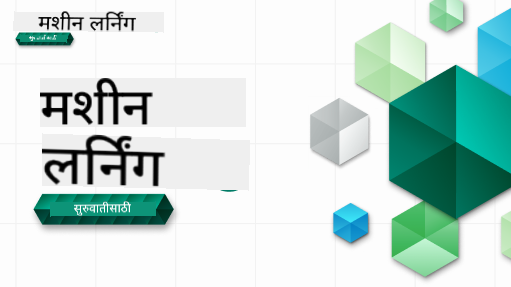

<!--
CO_OP_TRANSLATOR_METADATA:
{
  "original_hash": "a54f98da7bbee99ddc62a9e490eef7dc",
  "translation_date": "2025-09-29T21:51:27+00:00",
  "source_file": "README.md",
  "language_code": "mr"
}
-->

### 🌐 बहुभाषिक समर्थन

#### GitHub Action द्वारे समर्थित (स्वयंचलित आणि नेहमी अद्ययावत)

[French](../fr/README.md) | [Spanish](../es/README.md) | [German](../de/README.md) | [Russian](../ru/README.md) | [Arabic](../ar/README.md) | [Persian (Farsi)](../fa/README.md) | [Urdu](../ur/README.md) | [Chinese (Simplified)](../zh/README.md) | [Chinese (Traditional, Macau)](../mo/README.md) | [Chinese (Traditional, Hong Kong)](../hk/README.md) | [Chinese (Traditional, Taiwan)](../tw/README.md) | [Japanese](../ja/README.md) | [Korean](../ko/README.md) | [Hindi](../hi/README.md) | [Bengali](../bn/README.md) | [Marathi](./README.md) | [Nepali](../ne/README.md) | [Punjabi (Gurmukhi)](../pa/README.md) | [Portuguese (Portugal)](../pt/README.md) | [Portuguese (Brazil)](../br/README.md) | [Italian](../it/README.md) | [Polish](../pl/README.md) | [Turkish](../tr/README.md) | [Greek](../el/README.md) | [Thai](../th/README.md) | [Swedish](../sv/README.md) | [Danish](../da/README.md) | [Norwegian](../no/README.md) | [Finnish](../fi/README.md) | [Dutch](../nl/README.md) | [Hebrew](../he/README.md) | [Vietnamese](../vi/README.md) | [Indonesian](../id/README.md) | [Malay](../ms/README.md) | [Tagalog (Filipino)](../tl/README.md) | [Swahili](../sw/README.md) | [Hungarian](../hu/README.md) | [Czech](../cs/README.md) | [Slovak](../sk/README.md) | [Romanian](../ro/README.md) | [Bulgarian](../bg/README.md) | [Serbian (Cyrillic)](../sr/README.md) | [Croatian](../hr/README.md) | [Slovenian](../sl/README.md) | [Ukrainian](../uk/README.md) | [Burmese (Myanmar)](../my/README.md)

 #### आमच्या समुदायात सामील व्हा

आमच्याकडे Discord वर AI शिकण्याची मालिका सुरू आहे, अधिक जाणून घ्या आणि [Learn with AI Series](https://aka.ms/learnwithai/discord) मध्ये 18 - 30 सप्टेंबर, 2025 दरम्यान सामील व्हा. तुम्हाला GitHub Copilot डेटा सायन्ससाठी वापरण्याचे टिप्स आणि ट्रिक्स मिळतील.

# नवशिक्यांसाठी मशीन लर्निंग - अभ्यासक्रम

> 🌍 जगभर प्रवास करा आणि जागतिक संस्कृतींच्या माध्यमातून मशीन लर्निंग एक्सप्लोर करा 🌍

Microsoft मधील Cloud Advocates तुम्हाला **मशीन लर्निंग** वर आधारित 12 आठवड्यांचा, 26 धड्यांचा अभ्यासक्रम सादर करत आहेत. या अभ्यासक्रमात तुम्ही **क्लासिक मशीन लर्निंग** म्हणून ओळखल्या जाणाऱ्या गोष्टींबद्दल शिकाल, मुख्यतः Scikit-learn लायब्ररी वापरून आणि डीप लर्निंग टाळून, जे आमच्या [AI for Beginners' अभ्यासक्रमात](https://aka.ms/ai4beginners) समाविष्ट आहे. या धड्यांना आमच्या ['Data Science for Beginners' अभ्यासक्रमासह](https://aka.ms/ds4beginners) जोडा!

जगभरातील डेटा वापरून या क्लासिक तंत्रांचा उपयोग करताना आमच्यासोबत प्रवास करा. प्रत्येक धड्यात प्री-लेसन आणि पोस्ट-लेसन क्विझ, धडा पूर्ण करण्यासाठी लेखी सूचना, समाधान, असाइनमेंट आणि बरेच काही समाविष्ट आहे. आमची प्रोजेक्ट-आधारित पद्धती तुम्हाला शिकताना बांधण्याची परवानगी देते, नवीन कौशल्ये 'स्थिर' होण्यासाठी सिद्ध झालेला मार्ग.

**✍️ आमच्या लेखकांचे मनापासून आभार** Jen Looper, Stephen Howell, Francesca Lazzeri, Tomomi Imura, Cassie Breviu, Dmitry Soshnikov, Chris Noring, Anirban Mukherjee, Ornella Altunyan, Ruth Yakubu आणि Amy Boyd

**🎨 आमच्या चित्रकारांचे आभार** Tomomi Imura, Dasani Madipalli, आणि Jen Looper

**🙏 विशेष आभार 🙏 Microsoft Student Ambassador लेखक, समीक्षक आणि सामग्री योगदानकर्त्यांचे**, विशेषतः Rishit Dagli, Muhammad Sakib Khan Inan, Rohan Raj, Alexandru Petrescu, Abhishek Jaiswal, Nawrin Tabassum, Ioan Samuila, आणि Snigdha Agarwal

**🤩 अतिरिक्त आभार Microsoft Student Ambassadors Eric Wanjau, Jasleen Sondhi, आणि Vidushi Gupta आमच्या R धड्यांसाठी!**

# सुरुवात कशी करावी

या चरणांचे अनुसरण करा:
1. **रेपॉजिटरी फॉर्क करा**: या पृष्ठाच्या वरच्या उजव्या कोपऱ्यातील "Fork" बटणावर क्लिक करा.
2. **रेपॉजिटरी क्लोन करा**:   `git clone https://github.com/microsoft/ML-For-Beginners.git`

> [या अभ्यासक्रमासाठी सर्व अतिरिक्त संसाधने आमच्या Microsoft Learn संग्रहात शोधा](https://learn.microsoft.com/en-us/collections/qrqzamz1nn2wx3?WT.mc_id=academic-77952-bethanycheum)

**[विद्यार्थी](https://aka.ms/student-page)**, हा अभ्यासक्रम वापरण्यासाठी, संपूर्ण रेपो तुमच्या स्वतःच्या GitHub खात्यावर फॉर्क करा आणि स्वतः किंवा गटासह व्यायाम पूर्ण करा:

- प्री-लेक्चर क्विझने सुरुवात करा.
- लेक्चर वाचा आणि क्रियाकलाप पूर्ण करा, प्रत्येक ज्ञान तपासणीवर थांबा आणि विचार करा.
- धड्यांमधून समजून प्रोजेक्ट तयार करण्याचा प्रयत्न करा, समाधान कोड चालवण्याऐवजी; तथापि तो कोड प्रत्येक प्रोजेक्ट-आधारित धड्याच्या `/solution` फोल्डर्समध्ये उपलब्ध आहे.
- पोस्ट-लेक्चर क्विझ घ्या.
- आव्हान पूर्ण करा.
- असाइनमेंट पूर्ण करा.
- धड्यांचा गट पूर्ण केल्यानंतर, [चर्चा बोर्ड](https://github.com/microsoft/ML-For-Beginners/discussions) ला भेट द्या आणि योग्य PAT रुब्रिक भरून "शिकून" घ्या. 'PAT' म्हणजे प्रगती मूल्यांकन साधन आहे जे तुम्ही तुमच्या शिक्षणाला पुढे नेण्यासाठी भरता. आम्ही एकत्र शिकू शकतो यासाठी तुम्ही इतर PAT वर प्रतिक्रिया देखील देऊ शकता.

> पुढील अभ्यासासाठी, आम्ही या [Microsoft Learn](https://docs.microsoft.com/en-us/users/jenlooper-2911/collections/k7o7tg1gp306q4?WT.mc_id=academic-77952-leestott) मॉड्यूल्स आणि शिक्षण मार्गांचे अनुसरण करण्याची शिफारस करतो.

**शिक्षक**, आम्ही या अभ्यासक्रमाचा वापर कसा करायचा याबद्दल काही सूचना [समाविष्ट केल्या आहेत](for-teachers.md).

---

## व्हिडिओ वॉकथ्रू

काही धडे लघु स्वरूप व्हिडिओ म्हणून उपलब्ध आहेत. तुम्हाला हे सर्व धड्यांमध्ये इन-लाइन सापडतील किंवा [Microsoft Developer YouTube चॅनलवरील ML for Beginners प्लेलिस्ट](https://aka.ms/ml-beginners-videos) वर खालील प्रतिमेवर क्लिक करून सापडतील.

---

## टीमला भेटा

**Gif द्वारे** [Mohit Jaisal](https://linkedin.com/in/mohitjaisal)

> 🎥 वरच्या प्रतिमेवर क्लिक करा प्रकल्प आणि ते तयार करणाऱ्या लोकांबद्दल व्हिडिओसाठी!

---

## शिक्षण पद्धती

आम्ही हा अभ्यासक्रम तयार करताना दोन शिक्षण पद्धती स्वीकारल्या आहेत: हे **प्रोजेक्ट-आधारित** असल्याचे सुनिश्चित करणे आणि त्यात **वारंवार क्विझ** समाविष्ट करणे. याशिवाय, या अभ्यासक्रमाला एक सामान्य **थीम** आहे ज्यामुळे त्याला सुसंगतता मिळते.

सामग्री प्रोजेक्टशी संरेखित असल्याचे सुनिश्चित करून, प्रक्रिया विद्यार्थ्यांसाठी अधिक आकर्षक बनते आणि संकल्पनांचे धारणा वाढवली जाते. याशिवाय, वर्गाच्या आधी कमी-जोखीम क्विझ विद्यार्थ्याला विषय शिकण्याच्या हेतूने सेट करते, तर वर्गानंतर दुसरा क्विझ पुढील धारणा सुनिश्चित करतो. हा अभ्यासक्रम लवचिक आणि मजेदार बनवण्यासाठी डिझाइन केला गेला आहे आणि संपूर्ण किंवा अंशतः घेतला जाऊ शकतो. प्रकल्प लहान सुरू होतात आणि 12 आठवड्यांच्या चक्राच्या शेवटी अधिकाधिक जटिल होतात. या अभ्यासक्रमात ML च्या वास्तविक-जगातील अनुप्रयोगांवर एक पोस्टस्क्रिप्ट देखील समाविष्ट आहे, ज्याचा अतिरिक्त क्रेडिट म्हणून किंवा चर्चेचा आधार म्हणून वापर केला जाऊ शकतो.

> आमचा [Code of Conduct](CODE_OF_CONDUCT.md), [Contributing](CONTRIBUTING.md), आणि [Translation](TRANSLATIONS.md) मार्गदर्शक शोधा. आम्ही तुमच्या रचनात्मक अभिप्रायाचे स्वागत करतो!

## प्रत्येक धड्यात समाविष्ट आहे

- वैकल्पिक स्केच नोट
- वैकल्पिक पूरक व्हिडिओ
- व्हिडिओ वॉकथ्रू (काही धडे फक्त)
- [प्री-लेक्चर वॉर्मअप क्विझ](https://ff-quizzes.netlify.app/en/ml/)
- लेखी धडा
- प्रोजेक्ट-आधारित धड्यांसाठी, प्रोजेक्ट कसे तयार करायचे याबद्दल चरण-दर-चरण मार्गदर्शक
- ज्ञान तपासणी
- एक आव्हान
- पूरक वाचन
- असाइनमेंट
- [पोस्ट-लेक्चर क्विझ](https://ff-quizzes.netlify.app/en/ml/)

> **भाषांबद्दल एक टीप**: हे धडे प्रामुख्याने Python मध्ये लिहिलेले आहेत, परंतु अनेक R मध्ये देखील उपलब्ध आहेत. R धडा पूर्ण करण्यासाठी, `/solution` फोल्डरमध्ये जा आणि R धडे शोधा. त्यात .rmd विस्तार समाविष्ट आहे जो **R Markdown** फाइलचे प्रतिनिधित्व करतो ज्याला `Markdown document` मध्ये `code chunks` (R किंवा इतर भाषांचे) आणि `YAML header` (PDF सारख्या आउटपुट स्वरूपात कसे स्वरूपित करायचे याचे मार्गदर्शन करते) एम्बेडिंग म्हणून सोप्या शब्दात परिभाषित केले जाऊ शकते. त्यामुळे, डेटा सायन्ससाठी एक आदर्श लेखन फ्रेमवर्क म्हणून काम करते कारण ते तुमचा कोड, त्याचे आउटपुट आणि तुमचे विचार Markdown मध्ये लिहिण्याची परवानगी देते. याशिवाय, R Markdown दस्तऐवज PDF, HTML किंवा Word सारख्या आउटपुट स्वरूपात प्रस्तुत केले जाऊ शकतात.

> **क्विझबद्दल एक टीप**: सर्व क्विझ [Quiz App folder](../../quiz-app) मध्ये समाविष्ट आहेत, प्रत्येक तीन प्रश्नांसाठी 52 एकूण क्विझ. ते धड्यांमधून लिंक केलेले आहेत परंतु क्विझ अॅप स्थानिकरित्या चालवले जाऊ शकते; `quiz-app` फोल्डरमधील सूचनांचे अनुसरण करा स्थानिकरित्या होस्ट करण्यासाठी किंवा Azure वर तैनात करण्यासाठी.

| धडा क्रमांक |                             विषय                              |                   धड्यांचा गट                   | शिकण्याची उद्दिष्टे                                                                                                             |                                                              लिंक केलेला धडा                                                               |                        लेखक                        |
| :-----------: | :------------------------------------------------------------: | :-------------------------------------------------: | ------------------------------------------------------------------------------------------------------------------------------- | :--------------------------------------------------------------------------------------------------------------------------------------: | :--------------------------------------------------: |
|      01       |                मशीन लर्निंगची ओळख                |      [ओळख](1-Introduction/README.md)       | मशीन लर्निंगमागील मूलभूत संकल्पना जाणून घ्या                                                                                |                                             [धडा](1-Introduction/1-intro-to-ML/README.md)                                             |                       Muhammad                       |
|      02       |                मशीन लर्निंगचा इतिहास                 |      [ओळख](1-Introduction/README.md)       | या क्षेत्रामागील इतिहास जाणून घ्या                                                                                         |                                            [धडा](1-Introduction/2-history-of-ML/README.md)                                            |                     Jen आणि Amy                      |
|      03       |                 न्याय आणि मशीन लर्निंग                  |      [परिचय](1-Introduction/README.md)       | मशीन लर्निंग मॉडेल तयार करताना आणि लागू करताना विद्यार्थ्यांनी न्यायासंबंधी कोणते महत्त्वाचे तत्त्वज्ञानात्मक मुद्दे विचारात घ्यावे? |                                              [पाठ](1-Introduction/3-fairness/README.md)                                               |                        टोमोमी                        |
|      04       |                मशीन लर्निंगसाठी तंत्रज्ञान                 |      [परिचय](1-Introduction/README.md)       | मशीन लर्निंग संशोधक मॉडेल तयार करण्यासाठी कोणती तंत्रे वापरतात?                                                                       |                                          [पाठ](1-Introduction/4-techniques-of-ML/README.md)                                           |                    क्रिस आणि जेन                     |
|      05       |                   रिग्रेशनचा परिचय                   |        [रिग्रेशन](2-Regression/README.md)         | रिग्रेशन मॉडेलसाठी Python आणि Scikit-learn वापरण्यास सुरुवात करा                                                                  |         [Python](2-Regression/1-Tools/README.md) • [R](../../2-Regression/1-Tools/solution/R/lesson_1.html)         |      जेन • एरिक वंजाऊ       |
|      06       |                उत्तर अमेरिकन भोपळ्याचे दर 🎃                |        [रिग्रेशन](2-Regression/README.md)         | मशीन लर्निंगसाठी डेटा व्हिज्युअलाइझ करा आणि स्वच्छ करा                                                                                  |          [Python](2-Regression/2-Data/README.md) • [R](../../2-Regression/2-Data/solution/R/lesson_2.html)          |      जेन • एरिक वंजाऊ       |
|      07       |                उत्तर अमेरिकन भोपळ्याचे दर 🎃                |        [रिग्रेशन](2-Regression/README.md)         | रेषीय आणि बहुपद रिग्रेशन मॉडेल तयार करा                                                                                   |        [Python](2-Regression/3-Linear/README.md) • [R](../../2-Regression/3-Linear/solution/R/lesson_3.html)        |      जेन आणि दिमित्री • एरिक वंजाऊ       |
|      08       |                उत्तर अमेरिकन भोपळ्याचे दर 🎃                |        [रिग्रेशन](2-Regression/README.md)         | लॉजिस्टिक रिग्रेशन मॉडेल तयार करा                                                                                               |     [Python](2-Regression/4-Logistic/README.md) • [R](../../2-Regression/4-Logistic/solution/R/lesson_4.html)      |      जेन • एरिक वंजाऊ       |
|      09       |                          एक वेब अ‍ॅप 🔌                          |           [वेब अ‍ॅप](3-Web-App/README.md)            | प्रशिक्षित मॉडेल वापरण्यासाठी वेब अ‍ॅप तयार करा                                                                                       |                                                 [Python](3-Web-App/1-Web-App/README.md)                                                  |                         जेन                          |
|      10       |                 वर्गीकरणाचा परिचय                 |    [वर्गीकरण](4-Classification/README.md)     | तुमचा डेटा स्वच्छ करा, तयार करा आणि व्हिज्युअलाइझ करा; वर्गीकरणाचा परिचय                                                            | [Python](4-Classification/1-Introduction/README.md) • [R](../../4-Classification/1-Introduction/solution/R/lesson_10.html)  | जेन आणि कॅसी • एरिक वंजाऊ |
|      11       |             स्वादिष्ट आशियाई आणि भारतीय पदार्थ 🍜             |    [वर्गीकरण](4-Classification/README.md)     | वर्गीकरणकर्त्यांचा परिचय                                                                                                     | [Python](4-Classification/2-Classifiers-1/README.md) • [R](../../4-Classification/2-Classifiers-1/solution/R/lesson_11.html) | जेन आणि कॅसी • एरिक वंजाऊ |
|      12       |             स्वादिष्ट आशियाई आणि भारतीय पदार्थ 🍜             |    [वर्गीकरण](4-Classification/README.md)     | अधिक वर्गीकरणकर्ते                                                                                                                | [Python](4-Classification/3-Classifiers-2/README.md) • [R](../../4-Classification/3-Classifiers-2/solution/R/lesson_12.html) | जेन आणि कॅसी • एरिक वंजाऊ |
|      13       |             स्वादिष्ट आशियाई आणि भारतीय पदार्थ 🍜             |    [वर्गीकरण](4-Classification/README.md)     | तुमच्या मॉडेलचा वापर करून शिफारस करणारा वेब अ‍ॅप तयार करा                                                                                    |                                              [Python](4-Classification/4-Applied/README.md)                                              |                         जेन                          |
|      14       |                   क्लस्टरिंगचा परिचय                   |        [क्लस्टरिंग](5-Clustering/README.md)         | तुमचा डेटा स्वच्छ करा, तयार करा आणि व्हिज्युअलाइझ करा; क्लस्टरिंगचा परिचय                                                                |         [Python](5-Clustering/1-Visualize/README.md) • [R](../../5-Clustering/1-Visualize/solution/R/lesson_14.html)         |      जेन • एरिक वंजाऊ       |
|      15       |              नायजेरियन संगीताची आवड शोधणे 🎧              |        [क्लस्टरिंग](5-Clustering/README.md)         | K-Means क्लस्टरिंग पद्धत एक्सप्लोर करा                                                                                           |           [Python](5-Clustering/2-K-Means/README.md) • [R](../../5-Clustering/2-K-Means/solution/R/lesson_15.html)           |      जेन • एरिक वंजाऊ       |
|      16       |        नैसर्गिक भाषा प्रक्रिया परिचय ☕️         |   [नैसर्गिक भाषा प्रक्रिया](6-NLP/README.md)    | एक सोपा बॉट तयार करून NLP बद्दल मूलभूत गोष्टी शिका                                                                             |                                             [Python](6-NLP/1-Introduction-to-NLP/README.md)                                              |                       स्टीफन                        |
|      17       |                      सामान्य NLP कार्य ☕️                      |   [नैसर्गिक भाषा प्रक्रिया](6-NLP/README.md)    | भाषेच्या संरचनांशी व्यवहार करताना आवश्यक असलेल्या सामान्य कार्यांबद्दल समजून घेऊन तुमचे NLP ज्ञान वाढवा                          |                                                    [Python](6-NLP/2-Tasks/README.md)                                                     |                       स्टीफन                        |
|      18       |             भाषांतर आणि भावना विश्लेषण ♥️              |   [नैसर्गिक भाषा प्रक्रिया](6-NLP/README.md)    | जेन ऑस्टेनसह भाषांतर आणि भावना विश्लेषण                                                                             |                                            [Python](6-NLP/3-Translation-Sentiment/README.md)                                             |                       स्टीफन                        |
|      19       |                  युरोपमधील रोमँटिक हॉटेल्स ♥️                  |   [नैसर्गिक भाषा प्रक्रिया](6-NLP/README.md)    | हॉटेल पुनरावलोकनांसह भावना विश्लेषण 1                                                                                         |                                               [Python](6-NLP/4-Hotel-Reviews-1/README.md)                                                |                       स्टीफन                        |
|      20       |                  युरोपमधील रोमँटिक हॉटेल्स ♥️                  |   [नैसर्गिक भाषा प्रक्रिया](6-NLP/README.md)    | हॉटेल पुनरावलोकनांसह भावना विश्लेषण 2                                                                                         |                                               [Python](6-NLP/5-Hotel-Reviews-2/README.md)                                                |                       स्टीफन                        |
|      21       |            वेळ मालिका अंदाजाचा परिचय             |        [वेळ मालिका](7-TimeSeries/README.md)        | वेळ मालिका अंदाजाचा परिचय                                                                                         |                                             [Python](7-TimeSeries/1-Introduction/README.md)                                              |                      फ्रान्सेस्का                       |
|      22       | ⚡️ जागतिक वीज वापर ⚡️ - ARIMA सह वेळ मालिका अंदाज |        [वेळ मालिका](7-TimeSeries/README.md)        | ARIMA सह वेळ मालिका अंदाज                                                                                              |                                                 [Python](7-TimeSeries/2-ARIMA/README.md)                                                 |                      फ्रान्सेस्का                       |
|      23       |  ⚡️ जागतिक वीज वापर ⚡️ - SVR सह वेळ मालिका अंदाज  |        [वेळ मालिका](7-TimeSeries/README.md)        | सपोर्ट व्हेक्टर रिग्रेशनसह वेळ मालिका अंदाज                                                                           |                                                  [Python](7-TimeSeries/3-SVR/README.md)                                                  |                       अनिर्बन                        |
|      24       |             पुनर्बलन शिक्षणाचा परिचय             | [पुनर्बलन शिक्षण](8-Reinforcement/README.md) | Q-Learning सह पुनर्बलन शिक्षणाचा परिचय                                                                          |                                             [Python](8-Reinforcement/1-QLearning/README.md)                                              |                        दिमित्री                        |
|      25       |                 पीटरला लांडग्यापासून वाचवा! 🐺                  | [पुनर्बलन शिक्षण](8-Reinforcement/README.md) | पुनर्बलन शिक्षण जिम                                                                                                      |                                                [Python](8-Reinforcement/2-Gym/README.md)                                                 |                        दिमित्री                        |
|  Postscript   |            वास्तविक जगातील मशीन लर्निंग परिस्थिती आणि अनुप्रयोग            |      [ML in the Wild](9-Real-World/README.md)       | क्लासिकल मशीन लर्निंगचे मनोरंजक आणि उघड करणारे वास्तविक जगातील अनुप्रयोग                                                               |                                             [पाठ](9-Real-World/1-Applications/README.md)                                              |                         टीम                         |
|  Postscript   |            RAI डॅशबोर्ड वापरून मशीन लर्निंगमध्ये मॉडेल डीबगिंग          |      [ML in the Wild](9-Real-World/README.md)       | जबाबदार AI डॅशबोर्ड घटक वापरून मशीन लर्निंगमध्ये मॉडेल डीबगिंग                                                              |                                             [पाठ](9-Real-World/2-Debugging-ML-Models/README.md)                                              |                         रूथ याकुब                       |

> [या कोर्ससाठी Microsoft Learn संग्रहामध्ये सर्व अतिरिक्त संसाधने शोधा](https://learn.microsoft.com/en-us/collections/qrqzamz1nn2wx3?WT.mc_id=academic-77952-bethanycheum)

## ऑफलाइन प्रवेश

तुम्ही [Docsify](https://docsify.js.org/#/) वापरून ही दस्तऐवज ऑफलाइन चालवू शकता. या रेपोला फोर्क करा, तुमच्या स्थानिक मशीनवर [Docsify स्थापित करा](https://docsify.js.org/#/quickstart), आणि मग या रेपोच्या मूळ फोल्डरमध्ये `docsify serve` टाइप करा. वेबसाइट तुमच्या लोकलहोस्टवर पोर्ट 3000 वर चालवली जाईल: `localhost:3000`.

## PDFs

लिंक्ससह अभ्यासक्रमाचा PDF [इथे](https://microsoft.github.io/ML-For-Beginners/pdf/readme.pdf) शोधा.

## 🎒 इतर कोर्सेस 

आमची टीम इतर कोर्सेस तयार करते! पहा:

- [Edge AI for Beginners](https://aka.ms/edgeai-for-beginners)
- [AI Agents for Beginners](https://aka.ms/ai-agents-beginners)
- [Generative AI for Beginners](https://aka.ms/genai-beginners)
- [Generative AI for Beginners .NET](https://github.com/microsoft/Generative-AI-for-beginners-dotnet)
- [Generative AI with JavaScript](https://github.com/microsoft/generative-ai-with-javascript)
- [Generative AI with Java](https://github.com/microsoft/Generative-AI-for-beginners-java)
- [AI for Beginners](https://aka.ms/ai-beginners)
- [Data Science for Beginners](https://aka.ms/datascience-beginners)
- [ML for Beginners](https://aka.ms/ml-beginners)
- [Cybersecurity for Beginners](https://github.com/microsoft/Security-101) 
- [Web Dev for Beginners](https://aka.ms/webdev-beginners)
- [IoT for Beginners](https://aka.ms/iot-beginners)
- [XR Development for Beginners](https://github.com/microsoft/xr-development-for-beginners)
- [Mastering GitHub Copilot for Paired Programming](https://github.com/microsoft/Mastering-GitHub-Copilot-for-Paired-Programming)
- [Mastering GitHub Copilot for C#/.NET Developers](https://github.com/microsoft/mastering-github-copilot-for-dotnet-csharp-developers)
- [Choose Your Own Copilot Adventure](https://github.com/microsoft/CopilotAdventures)

---

**अस्वीकरण**:  
हा दस्तऐवज AI भाषांतर सेवा [Co-op Translator](https://github.com/Azure/co-op-translator) वापरून भाषांतरित करण्यात आला आहे. आम्ही अचूकतेसाठी प्रयत्नशील असलो तरी, कृपया लक्षात ठेवा की स्वयंचलित भाषांतरांमध्ये त्रुटी किंवा अचूकतेचा अभाव असू शकतो. मूळ भाषेतील दस्तऐवज हा अधिकृत स्रोत मानला जावा. महत्त्वाच्या माहितीसाठी व्यावसायिक मानवी भाषांतराची शिफारस केली जाते. या भाषांतराचा वापर करून उद्भवलेल्या कोणत्याही गैरसमज किंवा चुकीच्या अर्थासाठी आम्ही जबाबदार राहणार नाही.