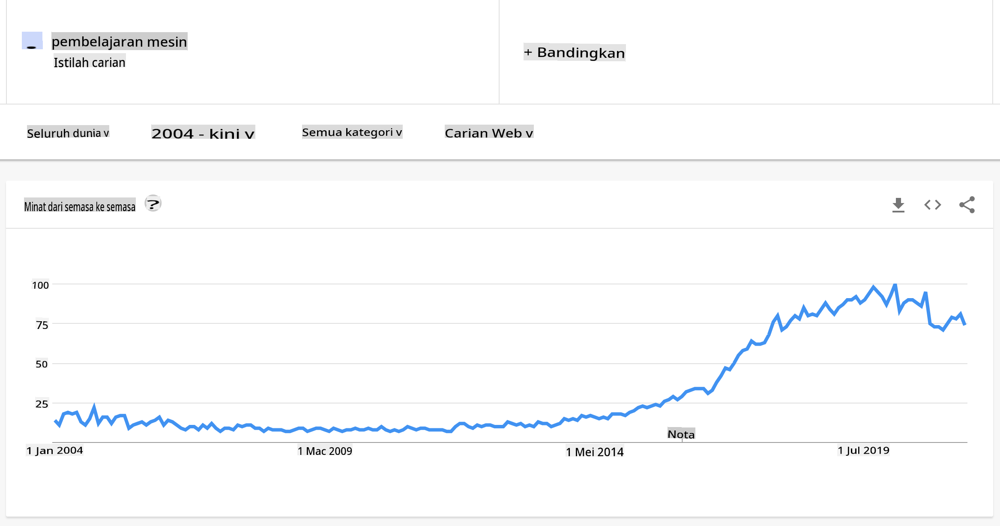

# Pengenalan kepada pembelajaran mesin

## [Kuiz pra-kuliah](https://gray-sand-07a10f403.1.azurestaticapps.net/quiz/1/)

---

> 🎥 Klik gambar di atas untuk video pendek yang melalui pelajaran ini.

Selamat datang ke kursus ini mengenai pembelajaran mesin klasik untuk pemula! Sama ada anda baru sahaja mengenali topik ini, atau seorang pengamal ML yang berpengalaman yang ingin mengasah kemahiran dalam bidang tertentu, kami gembira anda menyertai kami! Kami ingin mencipta tempat pelancaran yang mesra untuk kajian ML anda dan akan gembira untuk menilai, memberi maklum balas, dan memasukkan [maklum balas](https://github.com/microsoft/ML-For-Beginners/discussions) anda.

> 🎥 Klik gambar di atas untuk video: John Guttag dari MIT memperkenalkan pembelajaran mesin

---
## Memulakan dengan pembelajaran mesin

Sebelum memulakan kurikulum ini, anda perlu menyediakan komputer anda dan bersedia untuk menjalankan notebook secara tempatan.

- **Konfigurasi mesin anda dengan video-video ini**. Gunakan pautan berikut untuk belajar [cara memasang Python](https://youtu.be/CXZYvNRIAKM) dalam sistem anda dan [menyediakan penyunting teks](https://youtu.be/EU8eayHWoZg) untuk pembangunan.
- **Belajar Python**. Disyorkan juga untuk mempunyai pemahaman asas tentang [Python](https://docs.microsoft.com/learn/paths/python-language/?WT.mc_id=academic-77952-leestott), bahasa pengaturcaraan yang berguna untuk saintis data yang kami gunakan dalam kursus ini.
- **Belajar Node.js dan JavaScript**. Kami juga menggunakan JavaScript beberapa kali dalam kursus ini semasa membina aplikasi web, jadi anda perlu mempunyai [node](https://nodejs.org) dan [npm](https://www.npmjs.com/) dipasang, serta [Visual Studio Code](https://code.visualstudio.com/) tersedia untuk pembangunan Python dan JavaScript.
- **Buat akaun GitHub**. Oleh kerana anda menemui kami di [GitHub](https://github.com), anda mungkin sudah mempunyai akaun, tetapi jika tidak, buat satu dan kemudian fork kurikulum ini untuk digunakan sendiri. (Jangan lupa beri kami bintang, juga 😊)
- **Terokai Scikit-learn**. Biasakan diri dengan [Scikit-learn](https://scikit-learn.org/stable/user_guide.html), satu set perpustakaan ML yang kami rujuk dalam pelajaran ini.

---
## Apakah itu pembelajaran mesin?

Istilah 'pembelajaran mesin' adalah salah satu istilah yang paling popular dan sering digunakan pada masa kini. Terdapat kemungkinan besar anda pernah mendengar istilah ini sekurang-kurangnya sekali jika anda mempunyai sedikit pengetahuan tentang teknologi, tidak kira bidang apa yang anda ceburi. Mekanik pembelajaran mesin, bagaimanapun, adalah misteri bagi kebanyakan orang. Bagi pemula pembelajaran mesin, subjek ini kadang-kadang boleh terasa menggentarkan. Oleh itu, adalah penting untuk memahami apa sebenarnya pembelajaran mesin, dan belajar mengenainya langkah demi langkah, melalui contoh praktikal.

---
## Lengkung hype

> Google Trends menunjukkan 'lengkung hype' terbaru istilah 'pembelajaran mesin'

---
## Alam semesta yang misteri

Kita hidup dalam alam semesta yang penuh dengan misteri yang menakjubkan. Saintis hebat seperti Stephen Hawking, Albert Einstein, dan ramai lagi telah mengabdikan hidup mereka untuk mencari maklumat bermakna yang membongkar misteri dunia di sekitar kita. Ini adalah keadaan manusia untuk belajar: seorang kanak-kanak manusia belajar perkara baru dan membongkar struktur dunia mereka tahun demi tahun semasa mereka membesar menjadi dewasa.

---
## Otak kanak-kanak

Otak dan deria seorang kanak-kanak mengesan fakta persekitaran mereka dan secara beransur-ansur mempelajari corak tersembunyi kehidupan yang membantu kanak-kanak itu mencipta peraturan logik untuk mengenal pasti corak yang dipelajari. Proses pembelajaran otak manusia menjadikan manusia makhluk hidup yang paling canggih di dunia ini. Pembelajaran secara berterusan dengan menemui corak tersembunyi dan kemudian berinovasi pada corak tersebut membolehkan kita menjadi lebih baik dan lebih baik sepanjang hayat kita. Kapasiti pembelajaran dan keupayaan berkembang ini berkaitan dengan konsep yang dipanggil [keplastikan otak](https://www.simplypsychology.org/brain-plasticity.html). Secara cetek, kita boleh menarik beberapa persamaan motivasi antara proses pembelajaran otak manusia dan konsep pembelajaran mesin.

---
## Otak manusia

Otak [manusia](https://www.livescience.com/29365-human-brain.html) mengesan perkara dari dunia nyata, memproses maklumat yang diterima, membuat keputusan yang rasional, dan melaksanakan tindakan tertentu berdasarkan keadaan. Ini adalah apa yang kita panggil berkelakuan secara bijak. Apabila kita memprogramkan tiruan proses tingkah laku bijak kepada mesin, ia dipanggil kecerdasan buatan (AI).

---
## Beberapa istilah

Walaupun istilah-istilah ini boleh dikelirukan, pembelajaran mesin (ML) adalah subset penting kecerdasan buatan. **ML berkaitan dengan penggunaan algoritma khusus untuk mencari maklumat bermakna dan mencari corak tersembunyi dari data yang diterima untuk menyokong proses membuat keputusan yang rasional**.

---
## AI, ML, Pembelajaran Mendalam

> Diagram yang menunjukkan hubungan antara AI, ML, pembelajaran mendalam, dan sains data. Infografik oleh [Jen Looper](https://twitter.com/jenlooper) yang diilhamkan oleh [grafik ini](https://softwareengineering.stackexchange.com/questions/366996/distinction-between-ai-ml-neural-networks-deep-learning-and-data-mining)

---
## Konsep yang akan diliputi

Dalam kurikulum ini, kami akan meliputi hanya konsep asas pembelajaran mesin yang mesti diketahui oleh seorang pemula. Kami meliputi apa yang kami panggil 'pembelajaran mesin klasik' terutamanya menggunakan Scikit-learn, perpustakaan yang sangat baik yang digunakan oleh ramai pelajar untuk mempelajari asas-asas. Untuk memahami konsep yang lebih luas tentang kecerdasan buatan atau pembelajaran mendalam, pengetahuan asas yang kukuh tentang pembelajaran mesin adalah sangat diperlukan, dan oleh itu kami ingin menawarkannya di sini.

---
## Dalam kursus ini anda akan belajar:

- konsep asas pembelajaran mesin
- sejarah ML
- ML dan keadilan
- teknik ML regresi
- teknik ML klasifikasi
- teknik ML pengelompokan
- teknik pemprosesan bahasa semula jadi ML
- teknik ramalan siri masa ML
- pembelajaran pengukuhan
- aplikasi dunia sebenar untuk ML

---
## Apa yang tidak akan kami liputi

- pembelajaran mendalam
- rangkaian neural
- AI

Untuk pengalaman pembelajaran yang lebih baik, kami akan mengelakkan kerumitan rangkaian neural, 'pembelajaran mendalam' - pembinaan model berlapis-lapis menggunakan rangkaian neural - dan AI, yang akan kami bincangkan dalam kurikulum yang berbeza. Kami juga akan menawarkan kurikulum sains data yang akan datang untuk memberi tumpuan kepada aspek tersebut dalam bidang yang lebih besar ini.

---
## Mengapa belajar pembelajaran mesin?

Pembelajaran mesin, dari perspektif sistem, ditakrifkan sebagai penciptaan sistem automatik yang boleh belajar corak tersembunyi dari data untuk membantu dalam membuat keputusan yang bijak.

Motivasi ini secara longgar diilhamkan oleh cara otak manusia belajar perkara tertentu berdasarkan data yang diterima dari dunia luar.

✅ Fikirkan sejenak mengapa perniagaan ingin mencuba menggunakan strategi pembelajaran mesin berbanding mencipta enjin berasaskan peraturan yang ditetapkan.

---
## Aplikasi pembelajaran mesin

Aplikasi pembelajaran mesin kini hampir di mana-mana, dan sama banyak dengan data yang mengalir di sekitar masyarakat kita, yang dihasilkan oleh telefon pintar kita, peranti yang bersambung, dan sistem lain. Mengambil kira potensi besar algoritma pembelajaran mesin terkini, penyelidik telah meneroka keupayaannya untuk menyelesaikan masalah kehidupan sebenar yang multi-dimensi dan pelbagai disiplin dengan hasil yang sangat positif.

---
## Contoh ML yang diterapkan

**Anda boleh menggunakan pembelajaran mesin dalam banyak cara**:

- Untuk meramalkan kemungkinan penyakit dari sejarah perubatan atau laporan pesakit.
- Untuk memanfaatkan data cuaca untuk meramalkan peristiwa cuaca.
- Untuk memahami sentimen teks.
- Untuk mengesan berita palsu untuk menghentikan penyebaran propaganda.

Kewangan, ekonomi, sains bumi, penerokaan angkasa lepas, kejuruteraan bioperubatan, sains kognitif, dan bahkan bidang dalam kemanusiaan telah mengadaptasi pembelajaran mesin untuk menyelesaikan masalah berat pemprosesan data dalam bidang mereka.

---
## Kesimpulan

Pembelajaran mesin mengautomatikkan proses penemuan corak dengan mencari pandangan bermakna dari data dunia nyata atau data yang dihasilkan. Ia telah terbukti sangat berharga dalam perniagaan, kesihatan, dan aplikasi kewangan, antara lain.

Dalam masa terdekat, memahami asas pembelajaran mesin akan menjadi satu keperluan untuk orang dari mana-mana bidang kerana penerimaannya yang meluas.

---
# 🚀 Cabaran

Lukis, di atas kertas atau menggunakan aplikasi dalam talian seperti [Excalidraw](https://excalidraw.com/), pemahaman anda tentang perbezaan antara AI, ML, pembelajaran mendalam, dan sains data. Tambahkan beberapa idea tentang masalah yang baik untuk diselesaikan oleh setiap teknik ini.

# [Kuiz pasca-kuliah](https://gray-sand-07a10f403.1.azurestaticapps.net/quiz/2/)

---
# Kajian & Pembelajaran Kendiri

Untuk mengetahui lebih lanjut tentang cara anda boleh bekerja dengan algoritma ML di awan, ikuti [Laluan Pembelajaran](https://docs.microsoft.com/learn/paths/create-no-code-predictive-models-azure-machine-learning/?WT.mc_id=academic-77952-leestott) ini.

Ikuti [Laluan Pembelajaran](https://docs.microsoft.com/learn/modules/introduction-to-machine-learning/?WT.mc_id=academic-77952-leestott) tentang asas ML.

---
# Tugasan

[Mulakan dan berlari](assignment.md)

**Penafian**:
Dokumen ini telah diterjemahkan menggunakan perkhidmatan terjemahan AI berasaskan mesin. Walaupun kami berusaha untuk ketepatan, sila maklum bahawa terjemahan automatik mungkin mengandungi kesilapan atau ketidaktepatan. Dokumen asal dalam bahasa asalnya harus dianggap sebagai sumber yang berwibawa. Untuk maklumat kritikal, terjemahan manusia profesional adalah disyorkan. Kami tidak bertanggungjawab atas sebarang salah faham atau salah tafsir yang timbul daripada penggunaan terjemahan ini.