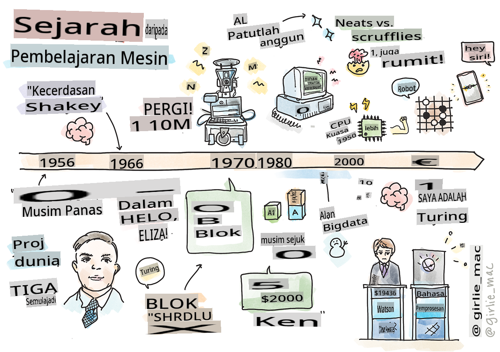
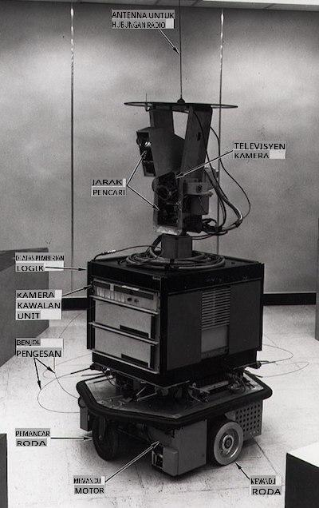

# Sejarah Pembelajaran Mesin

> Sketchnote oleh [Tomomi Imura](https://www.twitter.com/girlie_mac)

## [Kuiz Pra-Kuliah](https://gray-sand-07a10f403.1.azurestaticapps.net/quiz/3/)

---

> 🎥 Klik gambar di atas untuk video pendek yang membahas pelajaran ini.

Dalam pelajaran ini, kita akan menelusuri tonggak-tonggak penting dalam sejarah pembelajaran mesin dan kecerdasan buatan.

Sejarah kecerdasan buatan (AI) sebagai bidang sangat terkait dengan sejarah pembelajaran mesin, karena algoritma dan kemajuan komputasi yang mendasari ML berkontribusi pada pengembangan AI. Penting untuk diingat bahwa, meskipun bidang-bidang ini sebagai area penyelidikan yang berbeda mulai mengkristal pada tahun 1950-an, penemuan [algoritma, statistik, matematika, komputasi, dan teknis yang penting](https://wikipedia.org/wiki/Timeline_of_machine_learning) mendahului dan tumpang tindih dengan era ini. Faktanya, orang telah memikirkan pertanyaan-pertanyaan ini selama [ratusan tahun](https://wikipedia.org/wiki/History_of_artificial_intelligence): artikel ini membahas dasar intelektual historis dari gagasan 'mesin berpikir.'

---
## Penemuan Penting

- 1763, 1812 [Teorema Bayes](https://wikipedia.org/wiki/Bayes%27_theorem) dan pendahulunya. Teorema ini dan aplikasinya mendasari inferensi, menggambarkan probabilitas suatu peristiwa terjadi berdasarkan pengetahuan sebelumnya.
- 1805 [Teori Kuadrat Terkecil](https://wikipedia.org/wiki/Least_squares) oleh matematikawan Prancis Adrien-Marie Legendre. Teori ini, yang akan Anda pelajari dalam unit Regresi kami, membantu dalam pemasangan data.
- 1913 [Rantai Markov](https://wikipedia.org/wiki/Markov_chain), dinamai menurut matematikawan Rusia Andrey Markov, digunakan untuk menggambarkan urutan peristiwa yang mungkin terjadi berdasarkan keadaan sebelumnya.
- 1957 [Perceptron](https://wikipedia.org/wiki/Perceptron) adalah jenis pengklasifikasi linear yang ditemukan oleh psikolog Amerika Frank Rosenblatt yang mendasari kemajuan dalam pembelajaran mendalam.

---

- 1967 [Tetangga Terdekat](https://wikipedia.org/wiki/Nearest_neighbor) adalah algoritma yang awalnya dirancang untuk memetakan rute. Dalam konteks ML, algoritma ini digunakan untuk mendeteksi pola.
- 1970 [Backpropagation](https://wikipedia.org/wiki/Backpropagation) digunakan untuk melatih [jaringan saraf feedforward](https://wikipedia.org/wiki/Feedforward_neural_network).
- 1982 [Jaringan Saraf Rekuren](https://wikipedia.org/wiki/Recurrent_neural_network) adalah jaringan saraf buatan yang berasal dari jaringan saraf feedforward yang membuat grafik temporal.

✅ Lakukan sedikit penelitian. Tanggal-tanggal lain apa yang menonjol sebagai penting dalam sejarah ML dan AI?

---
## 1950: Mesin yang Berpikir

Alan Turing, seorang yang sangat luar biasa yang dipilih [oleh publik pada tahun 2019](https://wikipedia.org/wiki/Icons:_The_Greatest_Person_of_the_20th_Century) sebagai ilmuwan terbesar abad ke-20, dianggap membantu meletakkan dasar untuk konsep 'mesin yang dapat berpikir.' Dia berjuang dengan para penentang dan kebutuhannya sendiri untuk bukti empiris dari konsep ini sebagian dengan menciptakan [Tes Turing](https://www.bbc.com/news/technology-18475646), yang akan Anda jelajahi dalam pelajaran NLP kami.

---
## 1956: Proyek Penelitian Musim Panas Dartmouth

"Proyek Penelitian Musim Panas Dartmouth tentang kecerdasan buatan adalah acara penting untuk kecerdasan buatan sebagai bidang," dan di sinilah istilah 'kecerdasan buatan' diciptakan ([sumber](https://250.dartmouth.edu/highlights/artificial-intelligence-ai-coined-dartmouth)).

> Setiap aspek pembelajaran atau fitur kecerdasan lainnya pada prinsipnya dapat dijelaskan dengan sangat tepat sehingga mesin dapat dibuat untuk mensimulasikannya.

---

Peneliti utama, profesor matematika John McCarthy, berharap "untuk melanjutkan berdasarkan dugaan bahwa setiap aspek pembelajaran atau fitur kecerdasan lainnya pada prinsipnya dapat dijelaskan dengan sangat tepat sehingga mesin dapat dibuat untuk mensimulasikannya." Para peserta termasuk tokoh terkenal lainnya dalam bidang ini, Marvin Minsky.

Lokakarya ini dikreditkan dengan memulai dan mendorong beberapa diskusi termasuk "peningkatan metode simbolik, sistem yang berfokus pada domain terbatas (sistem ahli awal), dan sistem deduktif versus sistem induktif." ([sumber](https://wikipedia.org/wiki/Dartmouth_workshop)).

---
## 1956 - 1974: "Tahun-tahun emas"

Dari tahun 1950-an hingga pertengahan '70-an, optimisme tinggi bahwa AI dapat menyelesaikan banyak masalah. Pada tahun 1967, Marvin Minsky dengan yakin menyatakan bahwa "Dalam satu generasi ... masalah menciptakan 'kecerdasan buatan' akan secara substansial terpecahkan." (Minsky, Marvin (1967), Komputasi: Mesin Terbatas dan Tak Terbatas, Englewood Cliffs, N.J.: Prentice-Hall)

penelitian pemrosesan bahasa alami berkembang pesat, pencarian diperhalus dan dibuat lebih kuat, dan konsep 'dunia mikro' diciptakan, di mana tugas-tugas sederhana diselesaikan menggunakan instruksi bahasa sederhana.

---

Penelitian didanai dengan baik oleh lembaga pemerintah, kemajuan dibuat dalam komputasi dan algoritma, dan prototipe mesin cerdas dibangun. Beberapa mesin ini termasuk:

* [Shakey the robot](https://wikipedia.org/wiki/Shakey_the_robot), yang bisa bermanuver dan memutuskan cara melakukan tugas dengan 'cerdas'.

    
    > Shakey pada tahun 1972

---

* Eliza, 'chatterbot' awal, bisa bercakap-cakap dengan orang dan bertindak sebagai 'terapis' primitif. Anda akan belajar lebih banyak tentang Eliza dalam pelajaran NLP.

    
    > Versi Eliza, chatbot

---

* "Dunia blok" adalah contoh dunia mikro di mana blok dapat ditumpuk dan disortir, dan eksperimen dalam mengajar mesin untuk membuat keputusan dapat diuji. Kemajuan yang dibangun dengan pustaka seperti [SHRDLU](https://wikipedia.org/wiki/SHRDLU) membantu mendorong pemrosesan bahasa ke depan.

    

    > 🎥 Klik gambar di atas untuk video: Dunia blok dengan SHRDLU

---
## 1974 - 1980: "Musim Dingin AI"

Pada pertengahan 1970-an, menjadi jelas bahwa kompleksitas membuat 'mesin cerdas' telah diremehkan dan janjinya, mengingat kekuatan komputasi yang tersedia, telah dilebih-lebihkan. Pendanaan mengering dan kepercayaan pada bidang ini melambat. Beberapa masalah yang mempengaruhi kepercayaan termasuk:
---
- **Keterbatasan**. Kekuatan komputasi terlalu terbatas.
- **Ledakan kombinatorial**. Jumlah parameter yang perlu dilatih tumbuh secara eksponensial seiring dengan lebih banyak yang diminta dari komputer, tanpa evolusi paralel kekuatan dan kemampuan komputasi.
- **Kekurangan data**. Ada kekurangan data yang menghambat proses pengujian, pengembangan, dan penyempurnaan algoritma.
- **Apakah kita mengajukan pertanyaan yang tepat?**. Pertanyaan-pertanyaan yang diajukan mulai dipertanyakan. Peneliti mulai menghadapi kritik tentang pendekatan mereka:
  - Tes Turing dipertanyakan melalui, antara lain, teori 'ruang cina' yang berpendapat bahwa, "pemrograman komputer digital dapat membuatnya tampak memahami bahasa tetapi tidak dapat menghasilkan pemahaman nyata." ([sumber](https://plato.stanford.edu/entries/chinese-room/))
  - Etika memperkenalkan kecerdasan buatan seperti "terapis" ELIZA ke dalam masyarakat dipertanyakan.

---

Pada saat yang sama, berbagai aliran pemikiran AI mulai terbentuk. Sebuah dikotomi dibentuk antara praktik ["scruffy" vs. "neat AI"](https://wikipedia.org/wiki/Neats_and_scruffies). Laboratorium _scruffy_ mengubah program selama berjam-jam hingga mereka mendapatkan hasil yang diinginkan. Laboratorium _neat_ "berfokus pada logika dan pemecahan masalah formal". ELIZA dan SHRDLU adalah sistem _scruffy_ yang terkenal. Pada tahun 1980-an, ketika permintaan muncul untuk membuat sistem ML dapat direproduksi, pendekatan _neat_ secara bertahap menjadi yang terdepan karena hasilnya lebih dapat dijelaskan.

---
## Sistem Ahli 1980-an

Seiring berkembangnya bidang ini, manfaatnya bagi bisnis menjadi lebih jelas, dan pada tahun 1980-an demikian pula proliferasi 'sistem ahli'. "Sistem ahli adalah salah satu bentuk perangkat lunak kecerdasan buatan (AI) yang benar-benar berhasil pertama." ([sumber](https://wikipedia.org/wiki/Expert_system)).

Jenis sistem ini sebenarnya _hibrida_, terdiri sebagian dari mesin aturan yang mendefinisikan persyaratan bisnis, dan mesin inferensi yang memanfaatkan sistem aturan untuk menyimpulkan fakta baru.

Era ini juga melihat perhatian yang meningkat pada jaringan saraf.

---
## 1987 - 1993: AI 'Chill'

Proliferasi perangkat keras sistem ahli khusus memiliki efek yang tidak menguntungkan menjadi terlalu khusus. Munculnya komputer pribadi juga bersaing dengan sistem besar, khusus, dan terpusat ini. Demokratisasi komputasi telah dimulai, dan akhirnya membuka jalan bagi ledakan data besar modern.

---
## 1993 - 2011

Epok ini melihat era baru untuk ML dan AI untuk dapat memecahkan beberapa masalah yang disebabkan sebelumnya oleh kurangnya data dan kekuatan komputasi. Jumlah data mulai meningkat pesat dan menjadi lebih tersedia secara luas, untuk lebih baik dan lebih buruk, terutama dengan munculnya smartphone sekitar tahun 2007. Kekuatan komputasi berkembang secara eksponensial, dan algoritma berkembang seiring. Bidang ini mulai matang saat hari-hari bebas masa lalu mulai mengkristal menjadi disiplin yang benar.

---
## Sekarang

Saat ini pembelajaran mesin dan AI menyentuh hampir setiap bagian dari kehidupan kita. Era ini memerlukan pemahaman yang cermat tentang risiko dan potensi efek dari algoritma ini pada kehidupan manusia. Seperti yang dikatakan oleh Brad Smith dari Microsoft, "Teknologi informasi mengangkat isu-isu yang menyentuh inti perlindungan hak asasi manusia fundamental seperti privasi dan kebebasan berekspresi. Isu-isu ini meningkatkan tanggung jawab bagi perusahaan teknologi yang menciptakan produk-produk ini. Menurut pandangan kami, mereka juga memerlukan regulasi pemerintah yang bijaksana dan pengembangan norma-norma tentang penggunaan yang dapat diterima" ([sumber](https://www.technologyreview.com/2019/12/18/102365/the-future-of-ais-impact-on-society/)).

---

Masih harus dilihat apa yang akan terjadi di masa depan, tetapi penting untuk memahami sistem komputer ini dan perangkat lunak serta algoritma yang mereka jalankan. Kami berharap kurikulum ini akan membantu Anda untuk mendapatkan pemahaman yang lebih baik sehingga Anda dapat memutuskan sendiri.

> 🎥 Klik gambar di atas untuk video: Yann LeCun membahas sejarah pembelajaran mendalam dalam kuliah ini

---
## 🚀Tantangan

Gali salah satu momen sejarah ini dan pelajari lebih lanjut tentang orang-orang di baliknya. Ada karakter-karakter yang menarik, dan tidak ada penemuan ilmiah yang pernah diciptakan dalam kekosongan budaya. Apa yang Anda temukan?

## [Kuiz Pasca-Kuliah](https://gray-sand-07a10f403.1.azurestaticapps.net/quiz/4/)

---
## Tinjauan & Studi Mandiri

Berikut adalah item untuk ditonton dan didengarkan:

[Podcast ini di mana Amy Boyd membahas evolusi AI](http://runasradio.com/Shows/Show/739)

---

## Tugasan

[Buat garis masa](assignment.md)

**Penafian**:
Dokumen ini telah diterjemahkan menggunakan perkhidmatan terjemahan AI berasaskan mesin. Walaupun kami berusaha untuk ketepatan, sila ambil perhatian bahawa terjemahan automatik mungkin mengandungi kesilapan atau ketidaktepatan. Dokumen asal dalam bahasa asalnya harus dianggap sebagai sumber yang berwibawa. Untuk maklumat kritikal, terjemahan manusia profesional disyorkan. Kami tidak bertanggungjawab atas sebarang salah faham atau salah tafsir yang timbul daripada penggunaan terjemahan ini.