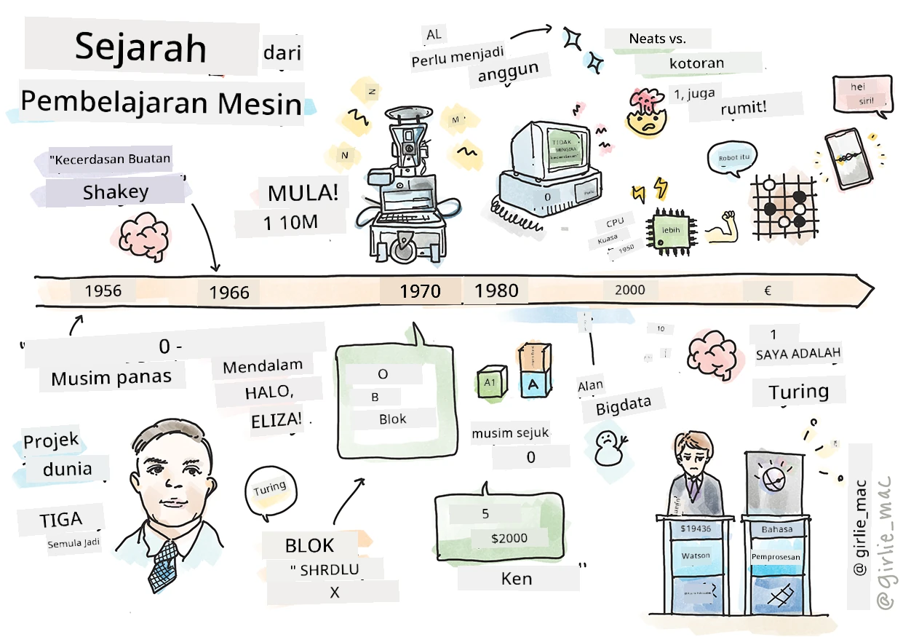
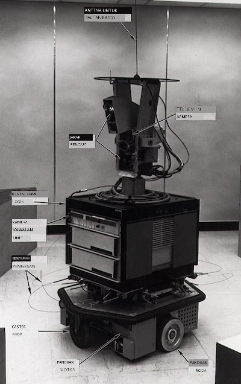
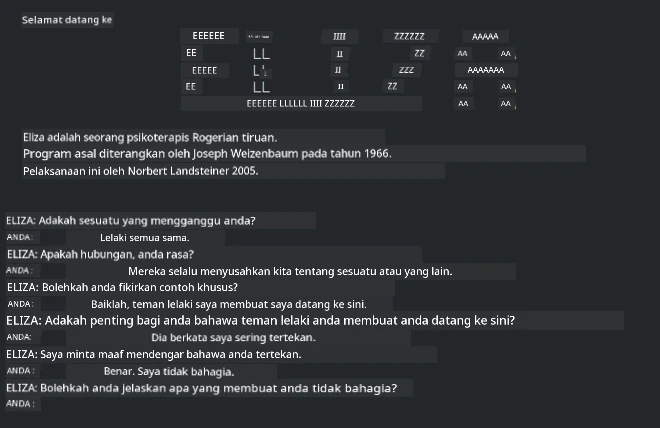

# Sejarah pembelajaran mesin

> Sketchnote oleh [Tomomi Imura](https://www.twitter.com/girlie_mac)

## [Kuiz pra-ceramah](https://ff-quizzes.netlify.app/en/ml/)

---

> 🎥 Klik imej di atas untuk video pendek yang membincangkan pelajaran ini.

Dalam pelajaran ini, kita akan mengkaji tonggak utama dalam sejarah pembelajaran mesin dan kecerdasan buatan.

Sejarah kecerdasan buatan (AI) sebagai satu bidang berkait rapat dengan sejarah pembelajaran mesin, kerana algoritma dan kemajuan pengiraan yang mendasari ML menyumbang kepada perkembangan AI. Adalah berguna untuk mengingati bahawa, walaupun bidang ini sebagai kawasan penyelidikan yang berbeza mula membentuk pada 1950-an, penemuan penting [algoritma, statistik, matematik, pengiraan dan teknikal](https://wikipedia.org/wiki/Timeline_of_machine_learning) telah wujud lebih awal dan bertindan dengan era ini. Malah, manusia telah memikirkan soalan ini selama [beratus-ratus tahun](https://wikipedia.org/wiki/History_of_artificial_intelligence): artikel ini membincangkan asas intelektual sejarah tentang idea 'mesin yang berfikir.'

---
## Penemuan penting

- 1763, 1812 [Teorem Bayes](https://wikipedia.org/wiki/Bayes%27_theorem) dan pendahulunya. Teorem ini dan aplikasinya mendasari inferens, menerangkan kebarangkalian sesuatu kejadian berdasarkan pengetahuan terdahulu.
- 1805 [Teori Kuadrat Terkecil](https://wikipedia.org/wiki/Least_squares) oleh ahli matematik Perancis Adrien-Marie Legendre. Teori ini, yang anda akan pelajari dalam unit Regresi kami, membantu dalam penyelarasan data.
- 1913 [Rantaian Markov](https://wikipedia.org/wiki/Markov_chain), dinamakan sempena ahli matematik Rusia Andrey Markov, digunakan untuk menerangkan urutan kejadian yang mungkin berdasarkan keadaan sebelumnya.
- 1957 [Perceptron](https://wikipedia.org/wiki/Perceptron) adalah sejenis pengelas linear yang dicipta oleh ahli psikologi Amerika Frank Rosenblatt yang mendasari kemajuan pembelajaran mendalam.

---

- 1967 [Jiran Terdekat](https://wikipedia.org/wiki/Nearest_neighbor) ialah algoritma yang direka asalnya untuk memetakan laluan. Dalam konteks ML ia digunakan untuk mengesan corak.
- 1970 [Backpropagation](https://wikipedia.org/wiki/Backpropagation) digunakan untuk melatih [rangkaian neural feedforward](https://wikipedia.org/wiki/Feedforward_neural_network).
- 1982 [Rangkaian Neural Berulang](https://wikipedia.org/wiki/Recurrent_neural_network) ialah rangkaian neural buatan yang berasal dari rangkaian neural feedforward yang menghasilkan graf temporal.

✅ Lakukan sedikit kajian. Apakah tarikh lain yang menonjol sebagai titik penting dalam sejarah ML dan AI?

---
## 1950: Mesin yang berfikir

Alan Turing, seorang insan yang sangat luar biasa yang telah dipilih [oleh orang ramai pada 2019](https://wikipedia.org/wiki/Icons:_The_Greatest_Person_of_the_20th_Century) sebagai saintis terhebat abad ke-20, dikreditkan sebagai membantu meletakkan asas untuk konsep 'mesin yang boleh berfikir.' Dia bergelut dengan orang yang skeptikal dan keperluannya sendiri untuk bukti empirik mengenai konsep ini sebahagiannya dengan mencipta [Ujian Turing](https://www.bbc.com/news/technology-18475646), yang akan anda pelajari dalam pelajaran NLP kami.

---
## 1956: Projek Penyelidikan Musim Panas Dartmouth

"Projek Penyelidikan Musim Panas Dartmouth mengenai kecerdasan buatan adalah kejadian penting untuk kecerdasan buatan sebagai satu bidang," dan di sinilah istilah 'kecerdasan buatan' dicipta ([sumber](https://250.dartmouth.edu/highlights/artificial-intelligence-ai-coined-dartmouth)).

> Setiap aspek pembelajaran atau ciri lain kecerdasan boleh dihuraikan dengan sangat tepat sehingga sebuah mesin boleh dibuat untuk menirunya.

---

Penyelia penyelidikan, profesor matematik John McCarthy, berharap "untuk meneruskan berdasarkan andaian bahawa setiap aspek pembelajaran atau ciri lain kecerdasan boleh dihuraikan dengan sangat tepat sehingga sebuah mesin boleh dibuat untuk menirunya." Peserta termasuk tokoh terkemuka lain dalam bidang ini, Marvin Minsky.

Bengkel tersebut dikreditkan memulakan dan menggalakkan beberapa perbincangan termasuk "kemunculan kaedah simbolik, sistem yang memfokuskan pada domain terhad (sistem pakar awal), dan sistem deduktif berbanding sistem induktif." ([sumber](https://wikipedia.org/wiki/Dartmouth_workshop)).

---
## 1956 - 1974: "Tahun-tahun emas"

Dari 1950-an hingga pertengahan 70-an, optimisme tinggi dengan harapan AI dapat menyelesaikan banyak masalah. Pada 1967, Marvin Minsky dengan yakin menyatakan bahawa "Dalam satu generasi... masalah mencipta 'kecerdasan buatan' akan diselesaikan dengan ketara." (Minsky, Marvin (1967), Computation: Finite and Infinite Machines, Englewood Cliffs, N.J.: Prentice-Hall)

Penyelidikan pemprosesan bahasa semula jadi berkembang pesat, carian dipertingkat dan dibuat lebih berkuasa, serta konsep 'mikro-dunia' dicipta, di mana tugas mudah diselesaikan menggunakan arahan bahasa biasa.

---

Penyelidikan dibiayai dengan baik oleh agensi kerajaan, kemajuan dibuat dalam pengiraan dan algoritma, dan prototaip mesin pintar dibina. Beberapa mesin ini termasuk:

* [Shakey robot](https://wikipedia.org/wiki/Shakey_the_robot), yang boleh bergerak dan membuat keputusan bagaimana melaksanakan tugas secara 'cerdik'.

    
    > Shakey pada 1972

---

* Eliza, 'chatterbot' awal, boleh berbual dengan orang dan bertindak sebagai 'terapis' primitif. Anda akan belajar lebih lanjut mengenai Eliza dalam pelajaran NLP.

    
    > Satu versi Eliza, chatbot

---

* "Dunia blok" adalah contoh mikro-dunia di mana blok boleh disusun dan diasingkan, dan eksperimen mengajar mesin membuat keputusan boleh diuji. Kemajuan yang dibina dengan perpustakaan seperti [SHRDLU](https://wikipedia.org/wiki/SHRDLU) membantu memajukan pemprosesan bahasa.

    

    > 🎥 Klik imej di atas untuk video: Dunia blok dengan SHRDLU

---
## 1974 - 1980: "Musim Sejuk AI"

Menjelang pertengahan 1970-an, menjadi jelas bahawa kerumitan membuat 'mesin pintar' telah diremehkan dan janjinya, memandangkan kuasa pengiraan yang ada, telah dibesar-besarkan. Pembiayaan kering dan keyakinan terhadap bidang ini berkurangan. Beberapa isu yang menjejaskan keyakinan termasuk:
---
- **Had**. Kuasa pengiraan terlalu terhad.
- **Letupan kombinatori**. Bilangan parameter yang perlu dilatih meningkat secara eksponen apabila komputer diminta lebih, tanpa evolusi selari dalam kuasa dan keupayaan pengiraan.
- **Kekurangan data**. Kekurangan data menyukarkan proses menguji, membangunkan dan memperincikan algoritma.
- **Adakah kita bertanya soalan yang betul?**. Soalan yang diajukan mula dipersoalkan. Penyelidik mula menerima kritikan tentang pendekatan mereka:
  - Ujian Turing dipersoalkan melalui, antara idea lain, 'teori bilik Cina' yang menyatakan, "pengaturcaraan komputer digital mungkin membuatnya nampak memahami bahasa tetapi tidak boleh menghasilkan pemahaman sebenar." ([sumber](https://plato.stanford.edu/entries/chinese-room/))
  - Etika memperkenalkan kecerdasan buatan seperti "terapis" ELIZA ke masyarakat dicabar.

---

Pada masa yang sama, pelbagai aliran pemikiran AI mula terbentuk. Dikotomi ditubuhkan antara amalan ["AI kucar-kacir" vs. "AI kemas"](https://wikipedia.org/wiki/Neats_and_scruffies). Makmal _kucar-kacir_ meminda program berjam-jam sehingga mencapai keputusan yang dikehendaki. Makmal _kemas_ "menumpukan pada logik dan penyelesaian masalah formal". ELIZA dan SHRDLU adalah sistem _kucar-kacir_ yang terkenal. Pada 1980-an, apabila keperluan untuk membuat sistem ML boleh diulang timbul, pendekatan _kemas_ secara perlahan mengambil alih kerana keputusannya lebih boleh dijelaskan.

---
## Sistem pakar 1980-an

Semasa bidang ini berkembang, manfaatnya kepada perniagaan menjadi jelas, dan pada 1980-an begitu juga penyebaran 'sistem pakar'. "Sistem pakar adalah antara bentuk perisian kecerdasan buatan (AI) yang benar-benar berjaya yang pertama." ([sumber](https://wikipedia.org/wiki/Expert_system)).

Jenis sistem ini sebenarnya _hibrid_, terdiri sebahagiannya daripada enjin peraturan yang menentukan keperluan perniagaan, dan enjin inferens yang menggunakan sistem peraturan untuk membuat kesimpulan fakta baru.

Era ini juga menyaksikan perhatian yang semakin meningkat terhadap rangkaian neural.

---
## 1987 - 1993: 'Chill' AI

Penyebaran perkakasan sistem pakar khusus mempunyai kesan malang menjadi terlalu khusus. Kebangkitan komputer peribadi juga bersaing dengan sistem besar, khusus, dan berpusat ini. Demokratisasi pengkomputeran telah bermula, dan akhirnya membuka jalan kepada ledakan data besar moden.

---
## 1993 - 2011

Era ini menyaksikan era baru bagi ML dan AI dapat menyelesaikan beberapa masalah yang disebabkan sebelum ini oleh kekurangan data dan kuasa pengiraan. Jumlah data mula meningkat dengan cepat dan menjadi lebih mudah didapati, baik dan buruk, terutamanya dengan kemunculan telefon pintar sekitar 2007. Kuasa pengiraan berkembang secara eksponen, dan algoritma juga berkembang seiring. Bidang ini mula matang apabila hari-hari bebas masa lalu mula membentuk disiplin sebenar.

---
## Kini

Hari ini pembelajaran mesin dan AI menyentuh hampir setiap aspek kehidupan kita. Era ini memanggil pemahaman berhati-hati tentang risiko dan kesan berpotensi algoritma ini ke atas kehidupan manusia. Seperti yang dinyatakan oleh Brad Smith dari Microsoft, "Teknologi maklumat menimbulkan isu yang menyentuh perlindungan hak asasi manusia asas seperti privasi dan kebebasan bersuara. Isu-isu ini meningkatkan tanggungjawab syarikat teknologi yang mencipta produk ini. Pada pandangan kami, ia juga memerlukan peraturan kerajaan yang berfikir dan pembangunan norma sekitar penggunaan yang boleh diterima" ([sumber](https://www.technologyreview.com/2019/12/18/102365/the-future-of-ais-impact-on-society/)).

---

Masih belum dapat dipastikan apa yang akan berlaku pada masa depan, tetapi penting untuk memahami sistem komputer ini dan perisian serta algoritma yang mereka jalankan. Kami berharap kurikulum ini akan membantu anda untuk lebih memahami supaya anda boleh membuat keputusan sendiri.

> 🎥 Klik imej di atas untuk video: Yann LeCun membincangkan sejarah pembelajaran mendalam dalam kuliah ini

---
## 🚀Cabaran

Selidiki salah satu daripada detik bersejarah ini dan pelajari lebih lanjut tentang orang di belakangnya. Terdapat watak-watak yang menarik, dan tiada penemuan saintifik pernah dicipta dalam vakum budaya. Apa yang anda temui?

## [Kuiz pasca-ceramah](https://ff-quizzes.netlify.app/en/ml/)

---
## Semakan & Belajar Sendiri

Berikut adalah item yang perlu ditonton dan didengar:

[Podcast ini di mana Amy Boyd membincangkan evolusi AI](http://runasradio.com/Shows/Show/739)

---

## Tugasan

[Cipta jadual masa](assignment.md)

---

<!-- CO-OP TRANSLATOR DISCLAIMER START -->
**Penafian**:
Dokumen ini telah diterjemahkan menggunakan perkhidmatan terjemahan AI [Co-op Translator](https://github.com/Azure/co-op-translator). Walaupun kami berusaha untuk ketepatan, sila ambil maklum bahawa terjemahan automatik mungkin mengandungi kesilapan atau ketidaktepatan. Dokumen asal dalam bahasa asalnya harus dianggap sebagai sumber yang sahih. Untuk maklumat penting, terjemahan oleh manusia profesional adalah disyorkan. Kami tidak bertanggungjawab terhadap sebarang salah faham atau salah tafsir yang timbul daripada penggunaan terjemahan ini.
<!-- CO-OP TRANSLATOR DISCLAIMER END -->