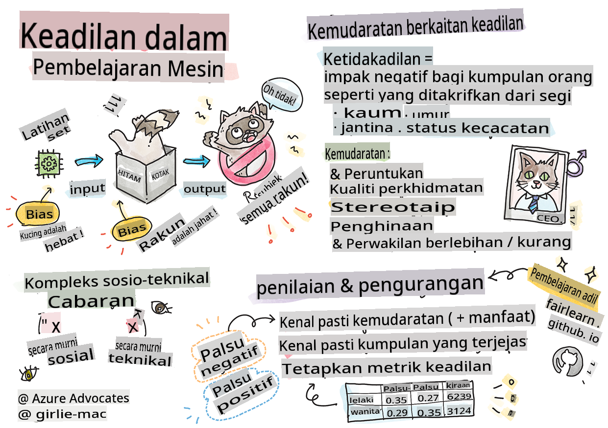

# Membina Penyelesaian Pembelajaran Mesin dengan AI Bertanggungjawab

> Sketchnote oleh [Tomomi Imura](https://www.twitter.com/girlie_mac)

## [Kuiz Pra-Kuliah](https://gray-sand-07a10f403.1.azurestaticapps.net/quiz/5/)
 
## Pengenalan

Dalam kurikulum ini, anda akan mula mengetahui bagaimana pembelajaran mesin boleh dan sedang mempengaruhi kehidupan seharian kita. Bahkan sekarang, sistem dan model terlibat dalam tugas membuat keputusan harian, seperti diagnosis kesihatan, kelulusan pinjaman atau mengesan penipuan. Oleh itu, adalah penting bahawa model-model ini berfungsi dengan baik untuk memberikan hasil yang boleh dipercayai. Sama seperti mana-mana aplikasi perisian, sistem AI akan terlepas jangkaan atau mempunyai hasil yang tidak diingini. Itulah sebabnya penting untuk memahami dan menjelaskan tingkah laku model AI.

Bayangkan apa yang boleh berlaku apabila data yang anda gunakan untuk membina model-model ini kekurangan demografi tertentu, seperti kaum, jantina, pandangan politik, agama, atau mewakili demografi tersebut secara tidak seimbang. Bagaimana pula apabila output model ditafsirkan untuk memihak kepada beberapa demografi? Apakah akibatnya untuk aplikasi tersebut? Selain itu, apa yang berlaku apabila model mempunyai hasil yang buruk dan membahayakan orang? Siapa yang bertanggungjawab atas tingkah laku sistem AI? Ini adalah beberapa soalan yang akan kita terokai dalam kurikulum ini.

Dalam pelajaran ini, anda akan:

- Meningkatkan kesedaran tentang kepentingan keadilan dalam pembelajaran mesin dan bahaya berkaitan keadilan.
- Menjadi biasa dengan amalan meneroka penyimpangan dan senario luar biasa untuk memastikan kebolehpercayaan dan keselamatan.
- Memahami keperluan untuk memberdayakan semua orang dengan merancang sistem yang inklusif.
- Meneroka betapa pentingnya melindungi privasi dan keselamatan data serta orang.
- Melihat kepentingan pendekatan kotak kaca untuk menjelaskan tingkah laku model AI.
- Berhati-hati bagaimana akauntabiliti penting untuk membina kepercayaan dalam sistem AI.

## Prasyarat

Sebagai prasyarat, sila ambil "Prinsip AI Bertanggungjawab" di Laluan Pembelajaran dan tonton video di bawah mengenai topik ini:

Ketahui lebih lanjut tentang AI Bertanggungjawab dengan mengikuti [Laluan Pembelajaran](https://docs.microsoft.com/learn/modules/responsible-ai-principles/?WT.mc_id=academic-77952-leestott)

> 🎥 Klik gambar di atas untuk video: Pendekatan Microsoft terhadap AI Bertanggungjawab

## Keadilan

Sistem AI harus melayan semua orang dengan adil dan mengelakkan mempengaruhi kumpulan orang yang serupa dengan cara yang berbeza. Sebagai contoh, apabila sistem AI memberikan panduan tentang rawatan perubatan, permohonan pinjaman, atau pekerjaan, mereka harus memberikan cadangan yang sama kepada semua orang dengan simptom, keadaan kewangan, atau kelayakan profesional yang serupa. Setiap daripada kita sebagai manusia membawa bias yang diwarisi yang mempengaruhi keputusan dan tindakan kita. Bias ini boleh menjadi jelas dalam data yang kita gunakan untuk melatih sistem AI. Manipulasi sedemikian kadang-kadang boleh berlaku secara tidak sengaja. Selalunya sukar untuk secara sedar mengetahui bila anda memperkenalkan bias dalam data.

**“Ketidakadilan”** merangkumi kesan negatif, atau “bahaya”, untuk sekumpulan orang, seperti yang ditakrifkan dari segi kaum, jantina, umur, atau status kecacatan. Bahaya berkaitan keadilan utama boleh diklasifikasikan sebagai:

- **Peruntukan**, jika jantina atau etnik sebagai contoh lebih disukai daripada yang lain.
- **Kualiti perkhidmatan**. Jika anda melatih data untuk satu senario tertentu tetapi realiti jauh lebih kompleks, ia membawa kepada perkhidmatan yang kurang baik. Sebagai contoh, dispenser sabun tangan yang tidak dapat mengesan orang dengan kulit gelap. [Rujukan](https://gizmodo.com/why-cant-this-soap-dispenser-identify-dark-skin-1797931773)
- **Penghinaan**. Untuk mengkritik dan melabel sesuatu atau seseorang secara tidak adil. Sebagai contoh, teknologi pelabelan imej secara salah melabelkan imej orang berkulit gelap sebagai gorila.
- **Perwakilan berlebihan atau kurang**. Idea bahawa kumpulan tertentu tidak dilihat dalam profesion tertentu, dan mana-mana perkhidmatan atau fungsi yang terus mempromosikan itu menyumbang kepada bahaya.
- **Stereotaip**. Mengaitkan kumpulan tertentu dengan atribut yang telah ditetapkan. Sebagai contoh, sistem terjemahan bahasa antara Bahasa Inggeris dan Turki mungkin mempunyai ketidaktepatan kerana perkataan dengan kaitan stereotaip kepada jantina.

> terjemahan ke Bahasa Turki

> terjemahan kembali ke Bahasa Inggeris

Apabila mereka bentuk dan menguji sistem AI, kita perlu memastikan bahawa AI adalah adil dan tidak diprogramkan untuk membuat keputusan yang bias atau diskriminasi, yang juga dilarang oleh manusia. Menjamin keadilan dalam AI dan pembelajaran mesin kekal sebagai cabaran sosio-teknikal yang kompleks.

### Kebolehpercayaan dan keselamatan

Untuk membina kepercayaan, sistem AI perlu boleh dipercayai, selamat, dan konsisten di bawah keadaan normal dan tidak dijangka. Adalah penting untuk mengetahui bagaimana sistem AI akan berkelakuan dalam pelbagai situasi, terutamanya apabila mereka adalah penyimpangan. Apabila membina penyelesaian AI, perlu ada fokus yang besar pada bagaimana menangani pelbagai keadaan yang mungkin dihadapi oleh penyelesaian AI. Sebagai contoh, kereta tanpa pemandu perlu meletakkan keselamatan orang sebagai keutamaan utama. Akibatnya, AI yang menggerakkan kereta perlu mempertimbangkan semua senario yang mungkin dihadapi oleh kereta seperti malam, ribut petir atau ribut salji, kanak-kanak berlari melintasi jalan, haiwan peliharaan, pembinaan jalan, dan sebagainya. Sejauh mana sistem AI boleh menangani pelbagai keadaan dengan boleh dipercayai dan selamat mencerminkan tahap antisipasi yang dipertimbangkan oleh saintis data atau pembangun AI semasa mereka bentuk atau menguji sistem.

> [🎥 Klik di sini untuk video: ](https://www.microsoft.com/videoplayer/embed/RE4vvIl)

### Inklusiviti

Sistem AI harus direka untuk melibatkan dan memberdayakan semua orang. Apabila mereka bentuk dan melaksanakan sistem AI, saintis data dan pembangun AI mengenal pasti dan menangani potensi halangan dalam sistem yang boleh secara tidak sengaja mengecualikan orang. Sebagai contoh, terdapat 1 bilion orang kurang upaya di seluruh dunia. Dengan kemajuan AI, mereka boleh mengakses pelbagai maklumat dan peluang dengan lebih mudah dalam kehidupan seharian mereka. Dengan menangani halangan, ia mewujudkan peluang untuk berinovasi dan membangunkan produk AI dengan pengalaman yang lebih baik yang memberi manfaat kepada semua orang.

> [🎥 Klik di sini untuk video: inklusiviti dalam AI](https://www.microsoft.com/videoplayer/embed/RE4vl9v)

### Keselamatan dan privasi

Sistem AI harus selamat dan menghormati privasi orang. Orang kurang mempercayai sistem yang meletakkan privasi, maklumat, atau nyawa mereka dalam risiko. Apabila melatih model pembelajaran mesin, kita bergantung pada data untuk menghasilkan hasil terbaik. Dalam berbuat demikian, asal usul data dan integriti mesti dipertimbangkan. Sebagai contoh, adakah data pengguna diserahkan atau tersedia secara awam? Seterusnya, semasa bekerja dengan data, adalah penting untuk membangunkan sistem AI yang boleh melindungi maklumat sulit dan menahan serangan. Apabila AI menjadi lebih meluas, melindungi privasi dan mengamankan maklumat peribadi dan perniagaan yang penting menjadi lebih kritikal dan kompleks. Isu privasi dan keselamatan data memerlukan perhatian yang sangat dekat untuk AI kerana akses kepada data adalah penting untuk sistem AI membuat ramalan dan keputusan yang tepat dan bermaklumat tentang orang.

> [🎥 Klik di sini untuk video: keselamatan dalam AI](https://www.microsoft.com/videoplayer/embed/RE4voJF)

- Sebagai industri kita telah membuat kemajuan yang ketara dalam Privasi & keselamatan, didorong secara signifikan oleh peraturan seperti GDPR (Peraturan Perlindungan Data Umum).
- Namun dengan sistem AI kita mesti mengakui ketegangan antara keperluan untuk lebih banyak data peribadi untuk menjadikan sistem lebih peribadi dan berkesan – dan privasi.
- Sama seperti kelahiran komputer yang disambungkan dengan internet, kita juga melihat peningkatan besar dalam bilangan isu keselamatan berkaitan AI.
- Pada masa yang sama, kita telah melihat AI digunakan untuk meningkatkan keselamatan. Sebagai contoh, kebanyakan pengimbas anti-virus moden dipacu oleh heuristik AI hari ini.
- Kita perlu memastikan bahawa proses Sains Data kita bercampur secara harmoni dengan amalan privasi dan keselamatan terkini.

### Ketelusan

Sistem AI harus dapat difahami. Bahagian penting dalam ketelusan adalah menjelaskan tingkah laku sistem AI dan komponennya. Meningkatkan pemahaman tentang sistem AI memerlukan pihak berkepentingan memahami bagaimana dan mengapa ia berfungsi supaya mereka boleh mengenal pasti potensi isu prestasi, kebimbangan keselamatan dan privasi, bias, amalan pengecualian, atau hasil yang tidak diingini. Kami juga percaya bahawa mereka yang menggunakan sistem AI harus jujur dan terus terang tentang bila, mengapa, dan bagaimana mereka memilih untuk menggunakan sistem tersebut. Serta had sistem yang mereka gunakan. Sebagai contoh, jika bank menggunakan sistem AI untuk menyokong keputusan pemberian pinjaman pengguna, adalah penting untuk memeriksa hasil dan memahami data mana yang mempengaruhi cadangan sistem. Kerajaan mula mengawal selia AI di seluruh industri, jadi saintis data dan organisasi mesti menjelaskan jika sistem AI memenuhi keperluan peraturan, terutamanya apabila terdapat hasil yang tidak diingini.

> [🎥 Klik di sini untuk video: ketelusan dalam AI](https://www.microsoft.com/videoplayer/embed/RE4voJF)

- Oleh kerana sistem AI sangat kompleks, sukar untuk memahami bagaimana ia berfungsi dan mentafsir hasilnya.
- Kekurangan pemahaman ini mempengaruhi cara sistem ini diurus, dioperasikan, dan didokumentasikan.
- Kekurangan pemahaman ini lebih penting mempengaruhi keputusan yang dibuat menggunakan hasil yang dihasilkan oleh sistem ini.

### Akauntabiliti

Orang yang mereka bentuk dan melaksanakan sistem AI mesti bertanggungjawab atas cara sistem mereka beroperasi. Keperluan untuk akauntabiliti adalah sangat penting dengan teknologi penggunaan sensitif seperti pengecaman wajah. Baru-baru ini, terdapat permintaan yang semakin meningkat untuk teknologi pengecaman wajah, terutamanya daripada organisasi penguatkuasaan undang-undang yang melihat potensi teknologi dalam penggunaan seperti mencari kanak-kanak yang hilang. Walau bagaimanapun, teknologi ini berpotensi digunakan oleh kerajaan untuk meletakkan kebebasan asas warganya dalam risiko dengan, sebagai contoh, membolehkan pengawasan berterusan individu tertentu. Oleh itu, saintis data dan organisasi perlu bertanggungjawab terhadap cara sistem AI mereka memberi kesan kepada individu atau masyarakat.

> 🎥 Klik gambar di atas untuk video: Amaran Pengawasan Massa Melalui Pengecaman Wajah

Akhirnya salah satu soalan terbesar untuk generasi kita, sebagai generasi pertama yang membawa AI kepada masyarakat, adalah bagaimana memastikan komputer akan tetap bertanggungjawab kepada orang dan bagaimana memastikan orang yang mereka bentuk komputer tetap bertanggungjawab kepada semua orang lain.

## Penilaian Kesan

Sebelum melatih model pembelajaran mesin, adalah penting untuk menjalankan penilaian kesan untuk memahami tujuan sistem AI; apa kegunaan yang dimaksudkan; di mana ia akan digunakan; dan siapa yang akan berinteraksi dengan sistem tersebut. Ini berguna untuk pengulas atau penguji yang menilai sistem untuk mengetahui faktor-faktor yang perlu dipertimbangkan semasa mengenal pasti potensi risiko dan akibat yang dijangka.

Berikut adalah bidang fokus apabila menjalankan penilaian kesan:

* **Kesan buruk terhadap individu**. Menyedari sebarang sekatan atau keperluan, penggunaan yang tidak disokong atau sebarang had yang diketahui yang menghalang prestasi sistem adalah penting untuk memastikan bahawa sistem tidak digunakan dengan cara yang boleh menyebabkan bahaya kepada individu.
* **Keperluan data**. Memahami bagaimana dan di mana sistem akan menggunakan data membolehkan pengulas meneroka sebarang keperluan data yang perlu anda perhatikan (contohnya, peraturan data GDPR atau HIPPA). Selain itu, periksa sama ada sumber atau kuantiti data mencukupi untuk latihan.
* **Ringkasan kesan**. Kumpulkan senarai potensi bahaya yang boleh timbul daripada menggunakan sistem. Sepanjang kitar hayat ML, semak jika isu yang dikenal pasti telah dikurangkan atau ditangani.
* **Matlamat yang berkenaan** untuk setiap enam prinsip teras. Nilai jika matlamat dari setiap prinsip dipenuhi dan jika terdapat sebarang jurang.

## Debugging dengan AI Bertanggungjawab

Sama seperti debugging aplikasi perisian, debugging sistem AI adalah proses yang perlu untuk mengenal pasti dan menyelesaikan isu dalam sistem. Terdapat banyak faktor yang akan mempengaruhi model tidak berfungsi seperti yang dijangkakan atau bertanggungjawab. Kebanyakan metrik prestasi model tradisional adalah agregat kuantitatif prestasi model, yang tidak mencukupi untuk menganalisis bagaimana model melanggar prinsip AI bertanggungjawab. Tambahan pula, model pembelajaran mesin adalah kotak hitam yang menjadikannya sukar untuk memahami apa yang mendorong hasilnya atau memberikan penjelasan apabila ia membuat kesilapan. Kemudian dalam kursus ini, kita akan belajar bagaimana menggunakan papan pemuka AI Bertanggungjawab untuk membantu debugging sistem AI. Papan pemuka menyediakan alat holistik untuk saintis data dan pembangun AI untuk melaksanakan:

* **Analisis ralat**. Untuk mengenal pasti taburan ralat model yang boleh menjejaskan keadilan atau kebolehpercayaan sistem.
* **Gambaran keseluruhan model**. Untuk menemui di mana terdapat perbezaan dalam prestasi model merentasi kohort data.
* **Analisis data**. Untuk memahami taburan data dan mengenal pasti sebarang potensi bias dalam data yang boleh membawa kepada isu keadilan, inklusiviti, dan kebolehpercayaan.
* **Kebolehfahaman model**. Untuk memahami apa yang mempengaruhi atau mempengaruhi ramalan model. Ini membantu dalam menjelaskan tingkah laku model, yang penting untuk ketelusan dan akauntabiliti.

## 🚀 Cabaran

Untuk mengelakkan bahaya daripada diperkenalkan pada awalnya, kita harus:

- mempunyai kepelbagaian latar belakang dan perspektif dalam kalangan orang yang bekerja pada sistem
- melabur dalam set data yang mencerminkan kepelbagaian masyarakat kita
- membangunkan kaedah yang lebih baik sepanjang kitar hayat pembelajaran mesin untuk mengesan dan membetulkan AI bertanggungjawab apabila ia berlaku

Fikirkan tentang senario kehidupan sebenar di mana ketidakpercayaan model jelas dalam pembinaan dan penggunaan model. Apa lagi yang harus kita pertimbangkan?

## [Kuiz Pasca-Kuliah](https://gray-sand-07a10f403.1.azurestaticapps.net/quiz/6/)
## Ulasan & Kajian Sendiri

Dalam pelajaran ini, anda telah mempelajari beberapa asas konsep keadilan dan ketidakadilan dalam pembelajaran mesin.

Tonton bengkel ini untuk mendalami topik:

- Dalam mengejar AI bertanggungjawab: Membawa prinsip kepada amalan oleh Besmira Nushi, Mehrnoosh Sameki dan Amit Sharma

> 🎥 Klik gambar di atas untuk video: Kotak Alat AI Bertanggungjawab: Kerangka sumber terbuka untuk membina AI bertanggungjawab oleh Besmira Nushi, Mehrnoosh Sameki, dan Amit Sharma

Juga, baca:

- Pusat sumber RAI Microsoft: [Sumber AI Bertanggungjawab – Microsoft AI](https://www.microsoft.com/ai/responsible-ai-resources?activetab=pivot1%3aprimaryr4)

- Kumpulan penyelidikan FATE Microsoft: [FATE: Keadilan, Akauntabiliti, Ketelusan, dan Etika dalam AI - Penyelidikan Microsoft](https://www.microsoft.com/research/theme/fate/)

Kotak Alat RAI:

- [Repositori GitHub Kotak Alat AI Bertanggungjawab](https://github.com/microsoft/responsible-ai-toolbox)

Baca tentang alat Azure Machine Learning untuk memastikan keadilan:

- [Azure Machine Learning](https://docs.microsoft.com/azure/machine-learning/concept-fairness-ml?WT.mc_id=academic-77952-leestott)

## Tugasan

[Terokai Kotak Alat RAI](assignment.md)

**Penafian**: 
Dokumen ini telah diterjemahkan menggunakan perkhidmatan terjemahan AI berasaskan mesin. Walaupun kami berusaha untuk ketepatan, sila ambil perhatian bahawa terjemahan automatik mungkin mengandungi kesilapan atau ketidaktepatan. Dokumen asal dalam bahasa asalnya harus dianggap sebagai sumber yang berwibawa. Untuk maklumat kritikal, terjemahan manusia profesional adalah disyorkan. Kami tidak bertanggungjawab ke atas sebarang salah faham atau salah tafsir yang timbul daripada penggunaan terjemahan ini.