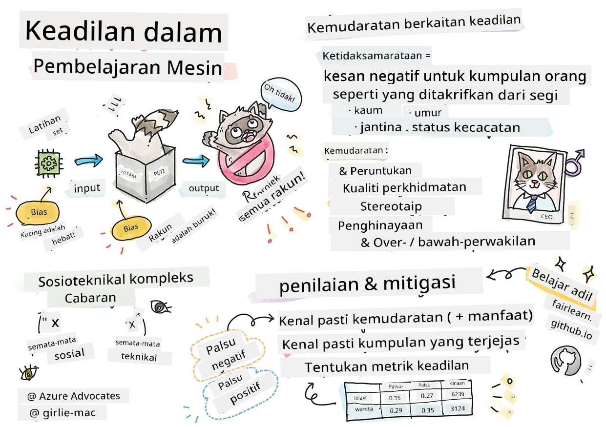

# Membina penyelesaian Pembelajaran Mesin dengan AI bertanggungjawab
 

> Sketchnote oleh [Tomomi Imura](https://www.twitter.com/girlie_mac)

## [Kuiz pra-ceramah](https://ff-quizzes.netlify.app/en/ml/)
 
## Pengenalan

Dalam kurikulum ini, anda akan mula menemui bagaimana pembelajaran mesin boleh dan sedang mempengaruhi kehidupan seharian kita. Malah sekarang, sistem dan model terlibat dalam tugasan membuat keputusan harian, seperti diagnosis penjagaan kesihatan, kelulusan pinjaman atau mengesan penipuan. Oleh itu, adalah penting bahawa model-model ini berfungsi dengan baik untuk menyediakan hasil yang boleh dipercayai. Sama seperti mana-mana aplikasi perisian, sistem AI akan gagal memenuhi jangkaan atau mempunyai hasil yang tidak diingini. Justeru itu, adalah penting untuk memahami dan menjelaskan tingkah laku model AI. 

Bayangkan apa yang boleh berlaku apabila data yang anda gunakan untuk membina model ini kekurangan demografi tertentu, seperti bangsa, jantina, pandangan politik, agama, atau secara tidak seimbang mewakili demografi tersebut. Bagaimana pula apabila output model ditafsirkan untuk memihak kepada sesetengah demografi? Apakah akibatnya untuk aplikasi tersebut? Selain itu, apa yang berlaku apabila model mempunyai hasil yang buruk dan membahayakan orang? Siapakah yang bertanggungjawab terhadap tingkah laku sistem AI? Ini adalah beberapa soalan yang akan kita terokai dalam kurikulum ini. 

Dalam pelajaran ini, anda akan: 

- Meningkatkan kesedaran anda tentang kepentingan keadilan dalam pembelajaran mesin dan kemudaratan berkaitan keadilan.
- Membiasakan diri dengan amalan meneroka outlier dan senario luar biasa untuk memastikan kebolehpercayaan dan keselamatan
- Memperoleh pemahaman tentang keperluan memberdayakan semua orang dengan mereka bentuk sistem inklusif
- Meneroka betapa pentingnya melindungi privasi dan keselamatan data dan orang
- Melihat kepentingan mempunyai pendekatan kotak kaca untuk menerangkan tingkah laku model AI
- Berhati-hati bagaimana akauntabiliti adalah penting untuk membina kepercayaan dalam sistem AI

## Prasyarat

Sebagai prasyarat, sila ambil Laluan Pembelajaran "Prinsip AI Bertanggungjawab" dan tonton video di bawah mengenai topik ini:

Ketahui lebih lanjut mengenai AI Bertanggungjawab dengan mengikuti [Laluan Pembelajaran ini](https://docs.microsoft.com/learn/modules/responsible-ai-principles/?WT.mc_id=academic-77952-leestott)

> 🎥 Klik imej di atas untuk video: Pendekatan Microsoft terhadap AI Bertanggungjawab

## Keadilan

Sistem AI harus melayan semua orang dengan adil dan mengelakkan daripada mempengaruhi kumpulan orang yang serupa dengan cara yang berbeza. Sebagai contoh, apabila sistem AI memberikan panduan mengenai rawatan perubatan, permohonan pinjaman, atau pekerjaan, mereka harus membuat cadangan yang sama kepada semua orang dengan simptom, keadaan kewangan, atau kelayakan profesional yang serupa. Setiap daripada kita sebagai manusia membawa bias yang diwarisi yang mempengaruhi keputusan dan tindakan kita. Bias ini boleh jelas dalam data yang kita gunakan untuk melatih sistem AI. Manipulasi sedemikian kadangkala berlaku tanpa disedari. Selalunya sukar untuk sedar apabila anda memperkenalkan bias dalam data. 

**“Ketidakadilan”** merangkumi impak negatif, atau “kemudaratan”, untuk kumpulan orang, seperti yang ditakrifkan berdasarkan bangsa, jantina, umur, atau status kecacatan. Kemudaratan berkaitan keadilan yang utama boleh diklasifikasikan sebagai: 

- **Peruntukan**, jika jantina atau etnik contohnya dipilih berbanding yang lain.
- **Kualiti perkhidmatan**. Jika anda melatih data untuk satu senario tertentu tetapi realiti adalah lebih kompleks, ia menghasilkan perkhidmatan yang berprestasi rendah. Contohnya, pelepas sabun tangan yang seolah-olah tidak dapat mengesan orang dengan kulit gelap. [Rujukan](https://gizmodo.com/why-cant-this-soap-dispenser-identify-dark-skin-1797931773)
- **Pencemaran nama baik**. Mengkritik dan melabel sesuatu atau seseorang dengan tidak adil. Contohnya, teknologi pelabelan imej telah terkenal kerana salah melabel imej orang berkulit gelap sebagai gorila.
- **Over- atau under- representasi**. Idea ini adalah bahawa sesetengah kumpulan tidak dilihat dalam profesion tertentu, dan mana-mana perkhidmatan atau fungsi yang terus mempromosikannya menyumbang kepada kemudaratan.
- **Stereotaip**. Mengaitkan kumpulan tertentu dengan atribut yang telah ditetapkan sebelumnya. Contohnya, sistem terjemahan bahasa antara Bahasa Inggeris dan Turki mungkin mempunyai ketidaktepatan disebabkan oleh kata-kata yang mempunyai kaitan stereotaip dengan jantina.

> terjemahan ke Turki

> terjemahan kembali ke Bahasa Inggeris

Apabila mereka bentuk dan menguji sistem AI, kita perlu memastikan AI adalah adil dan tidak diprogram untuk membuat keputusan berat sebelah atau diskriminasi, yang juga dilarang dilakukan oleh manusia. Menjamin keadilan dalam AI dan pembelajaran mesin kekal sebagai cabaran sosial teknikal yang kompleks. 

### Kebolehpercayaan dan keselamatan

Untuk membina kepercayaan, sistem AI perlu boleh dipercayai, selamat, dan konsisten di bawah keadaan normal dan tidak dijangka. Penting untuk mengetahui bagaimana sistem AI akan berkelakuan dalam pelbagai situasi, terutamanya apabila mereka adalah outlier. Apabila membina penyelesaian AI, perlu ada tumpuan besar pada cara menangani pelbagai keadaan yang mungkin ditemui oleh penyelesaian AI. Contohnya, kereta pandu sendiri perlu meletakkan keselamatan orang sebagai keutamaan utama. Akibatnya, AI yang menggerakkan kereta perlu mengambil kira semua senario yang mungkin dihadapi kereta seperti malam, ribut petir atau ribut salji, kanak-kanak berlari melintasi jalan, haiwan peliharaan, pembinaan jalan, dan sebagainya. Sejauh mana sistem AI dapat menangani pelbagai keadaan dengan boleh dipercayai dan selamat mencerminkan tahap jangkaan yang dipertimbangkan oleh saintis data atau pembangun AI semasa mereka bentuk atau menguji sistem itu.  

> [🎥 Klik di sini untuk video: ](https://www.microsoft.com/videoplayer/embed/RE4vvIl)

### Inklusiviti

Sistem AI perlu direka untuk melibatkan dan memberdayakan semua orang. Apabila mereka bentuk dan melaksanakan sistem AI, saintis data dan pembangun AI mengenal pasti dan menangani halangan yang mungkin ada dalam sistem yang boleh secara tidak sengaja mengecualikan orang. Contohnya, terdapat 1 bilion orang kurang upaya di seluruh dunia. Dengan kemajuan AI, mereka boleh mengakses pelbagai maklumat dan peluang dengan lebih mudah dalam kehidupan harian mereka. Dengan menangani halangan, ia mewujudkan peluang untuk berinovasi dan membangunkan produk AI dengan pengalaman yang lebih baik yang memberi manfaat kepada semua orang. 

> [🎥 Klik di sini untuk video: inklusiviti dalam AI](https://www.microsoft.com/videoplayer/embed/RE4vl9v)

### Keselamatan dan privasi 

Sistem AI perlu selamat dan menghormati privasi orang. Orang kurang mempercayai sistem yang meletakkan privasi, maklumat, atau nyawa mereka berisiko. Apabila melatih model pembelajaran mesin, kita bergantung pada data untuk menghasilkan hasil terbaik. Dalam melakukan itu, asal usul data dan integritinya mesti diambil kira. Contohnya, adakah data tersebut dihantar oleh pengguna atau tersedia secara awam? Seterusnya, semasa bekerja dengan data, adalah penting untuk membangunkan sistem AI yang dapat melindungi maklumat sulit dan menahan serangan. Dengan AI menjadi lebih meluas, melindungi privasi dan mengamankan maklumat peribadi dan perniagaan yang penting menjadi semakin kritikal dan kompleks. Isu privasi dan keselamatan data memerlukan perhatian khusus untuk AI kerana akses kepada data adalah penting untuk sistem AI membuat ramalan dan keputusan tepat dan berinformasi mengenai orang. 

> [🎥 Klik di sini untuk video: keselamatan dalam AI](https://www.microsoft.com/videoplayer/embed/RE4voJF)

- Sebagai industri, kita telah membuat kemajuan ketara dalam Privasi & keselamatan, didorong dengan ketara oleh peraturan seperti GDPR (Peraturan Perlindungan Data Umum). 
- Namun dengan sistem AI kita mesti mengakui ketegangan antara keperluan data peribadi yang lebih banyak untuk menjadikan sistem lebih peribadi dan berkesan – dan privasi. 
- Sama seperti dengan kelahiran komputer berhubung dengan internet, kita juga melihat peningkatan besar dalam jumlah isu keselamatan berkaitan AI. 
- Pada masa yang sama, kita telah melihat AI digunakan untuk meningkatkan keselamatan. Sebagai contoh, kebanyakan pengimbas anti-virus moden kini dipacu oleh heuristik AI. 
- Kita perlu memastikan bahawa proses Sains Data kita bergabung secara harmoni dengan amalan privasi dan keselamatan terkini. 

### Ketelusan
Sistem AI harus difahami. Bahagian penting ketelusan adalah menerangkan tingkah laku sistem AI dan komponennya. Meningkatkan pemahaman tentang sistem AI memerlukan pihak berkepentingan memahami bagaimana dan mengapa ia berfungsi supaya mereka dapat mengenal pasti isu prestasi yang berpotensi, kebimbangan keselamatan dan privasi, bias, amalan pengecualian, atau hasil yang tidak dijangka. Kami juga percaya bahawa mereka yang menggunakan sistem AI harus jujur dan terbuka mengenai bila, mengapa, dan bagaimana mereka memilih untuk menggunakannya. Serta had sistem yang mereka gunakan. Contohnya, jika sebuah bank menggunakan sistem AI untuk menyokong keputusan pemberian pinjaman pengguna, adalah penting untuk meneliti hasil dan memahami data mana yang mempengaruhi cadangan sistem. Kerajaan mula mengawal AI dalam pelbagai industri, jadi saintis data dan organisasi mesti menerangkan jika sistem AI memenuhi keperluan pengawalseliaan, terutama apabila terdapat hasil yang tidak diingini. 

> [🎥 Klik di sini untuk video: ketelusan dalam AI](https://www.microsoft.com/videoplayer/embed/RE4voJF)

- Kerana sistem AI sangat kompleks, sukar untuk memahami bagaimana ia berfungsi dan mentafsir hasilnya. 
- Kekurangan pemahaman ini mempengaruhi cara sistem ini diurus, dioperasikan, dan didokumentasikan. 
- Kekurangan pemahaman ini lebih penting mempengaruhi keputusan yang dibuat menggunakan hasil yang dihasilkan oleh sistem ini. 

### Akauntabiliti 
 
Orang yang mereka bentuk dan melaksanakan sistem AI mesti bertanggungjawab terhadap bagaimana sistem mereka beroperasi. Keperluan untuk akauntabiliti adalah sangat penting dengan teknologi penggunaan sensitif seperti pengecaman wajah. Baru-baru ini, terdapat permintaan yang semakin meningkat untuk teknologi pengecaman wajah, terutama dari organisasi penguatkuasaan undang-undang yang melihat potensi teknologi dalam penggunaan seperti mencari kanak-kanak hilang. Namun, teknologi ini berpotensi digunakan oleh kerajaan untuk meletakkan kebebasan asas warganya berisiko dengan, contohnya, membolehkan pengawasan berterusan terhadap individu tertentu. Oleh itu, saintis data dan organisasi perlu bertanggungjawab terhadap bagaimana sistem AI mereka memberi kesan kepada individu atau masyarakat.

> 🎥 Klik imej di atas untuk video: Amaran Pengawasan Massa Melalui Pengecaman Wajah 

Akhirnya satu daripada soalan terbesar untuk generasi kita, sebagai generasi pertama yang membawa AI ke masyarakat, ialah bagaimana memastikan komputer kekal bertanggungjawab kepada orang dan bagaimana memastikan orang yang mereka bentuk komputer kekal bertanggungjawab kepada semua orang lain.

## Penilaian impak

Sebelum melatih model pembelajaran mesin, adalah penting untuk menjalankan penilaian impak untuk memahami tujuan sistem AI; apakah penggunaan yang dimaksudkan; di mana ia akan digunakan; dan siapa yang akan berinteraksi dengan sistem. Ini berguna untuk penilai atau penguji menilai sistem supaya tahu faktor apa yang perlu dipertimbangkan apabila mengenal pasti risiko berpotensi dan akibat yang dijangkakan.

Berikut adalah bidang tumpuan apabila menjalankan penilaian impak:

* **Impak buruk ke atas individu**. Sedar tentang sebarang had atau keperluan, penggunaan yang tidak disokong atau sebarang had yang diketahui yang menghalang prestasi sistem adalah penting untuk memastikan sistem tidak digunakan dengan cara yang boleh membahayakan individu.
* **Keperluan data**. Memperoleh pemahaman tentang bagaimana dan di mana sistem akan menggunakan data membolehkan penilai meneroka sebarang keperluan data yang perlu diambil kira (contohnya, peraturan data GDPR atau HIPAA). Selain itu, periksa sama ada sumber atau kuantiti data mencukupi untuk latihan.
* **Ringkasan impak**. Kumpul senarai kemudaratan berpotensi yang boleh timbul daripada menggunakan sistem. Sepanjang kitaran hayat ML, semak jika isu yang dikenal pasti telah dikurangkan atau ditangani.
* **Matlamat yang boleh digunakan** untuk setiap prinsip teras yang enam. Nilai sama ada matlamat dari setiap prinsip telah dipenuhi dan jika terdapat sebarang jurang.

## Penyahpepijatan dengan AI bertanggungjawab  

Sama seperti menyahpepijat aplikasi perisian, penyahpepijatan sistem AI adalah proses yang perlu untuk mengenal pasti dan menyelesaikan isu dalam sistem. Terdapat banyak faktor yang boleh menyebabkan model tidak berprestasi seperti yang dijangka atau secara bertanggungjawab. Kebanyakan metrik prestasi model tradisional adalah agregat kuantitatif prestasi model, yang tidak mencukupi untuk menganalisis bagaimana model melanggar prinsip AI bertanggungjawab. Lebih-lebih lagi, model pembelajaran mesin adalah kotak hitam yang menyukarkan untuk memahami apa yang mendorong hasilnya atau memberikan penjelasan apabila ia melakukan kesilapan. Nanti dalam kursus ini, kita akan belajar bagaimana menggunakan papan pemuka AI bertanggungjawab untuk membantu menyahpepijat sistem AI. Papan pemuka menyediakan alat holistik untuk saintis data dan pembangun AI untuk melakukan:

* **Analisis ralat**. Untuk mengenal pasti taburan ralat model yang boleh menjejaskan keadilan atau kebolehpercayaan sistem.
* **Sorotan model**. Untuk menemui di mana terdapat ketidaksamaan dalam prestasi model merentasi kumpulan data.
* **Analisis data**. Untuk memahami taburan data dan mengenal pasti sebarang bias berpotensi dalam data yang boleh menyebabkan isu keadilan, inklusiviti, dan kebolehpercayaan.
* **Kebolehtafsiran model**. Untuk memahami apa yang mempengaruhi atau memberi kesan pada ramalan model. Ini membantu dalam menerangkan tingkah laku model, yang penting untuk ketelusan dan akauntabiliti.

## 🚀 Cabaran 
 
Untuk mencegah kemudaratan diperkenalkan pada mulanya, kita harus: 

- mempunyai kepelbagaian latar belakang dan perspektif dalam kalangan orang yang bekerja pada sistem 
- melabur dalam set data yang mencerminkan kepelbagaian masyarakat kita 
- membangunkan kaedah yang lebih baik sepanjang kitaran hayat pembelajaran mesin untuk mengesan dan membetulkan AI bertanggungjawab apabila ia berlaku 

Fikirkan tentang senario dalam kehidupan sebenar di mana ketidakpercayaan model jelas dalam pembinaan dan penggunaan model. Apa lagi yang perlu kita pertimbangkan? 

## [Kuiz pasca-ceramah](https://ff-quizzes.netlify.app/en/ml/)

## Ulasan & Kajian Kendiri 
 

Dalam pelajaran ini, anda telah mempelajari beberapa asas konsep keadilan dan ketidakadilan dalam pembelajaran mesin.  
 
Tonton bengkel ini untuk mendalami topik-topik berikut: 

- Mengejar AI yang bertanggungjawab: Membawa prinsip ke amalan oleh Besmira Nushi, Mehrnoosh Sameki dan Amit Sharma

> 🎥 Klik imej di atas untuk menonton video: RAI Toolbox: Rangka kerja sumber terbuka untuk membina AI yang bertanggungjawab oleh Besmira Nushi, Mehrnoosh Sameki, dan Amit Sharma

Juga, baca: 

- Pusat sumber RAI Microsoft: [Sumber AI Bertanggungjawab – Microsoft AI](https://www.microsoft.com/ai/responsible-ai-resources?activetab=pivot1%3aprimaryr4) 

- Kumpulan penyelidikan FATE Microsoft: [FATE: Keadilan, Akauntabiliti, Ketelusan, dan Etika dalam AI - Microsoft Research](https://www.microsoft.com/research/theme/fate/) 

Kotak Alat RAI: 

- [Repositori GitHub Kotak Alat AI Bertanggungjawab](https://github.com/microsoft/responsible-ai-toolbox)

Baca tentang alat Azure Machine Learning untuk memastikan keadilan:

- [Azure Machine Learning](https://docs.microsoft.com/azure/machine-learning/concept-fairness-ml?WT.mc_id=academic-77952-leestott) 

## Tugasan

[Terokai Kotak Alat RAI](assignment.md)

---

<!-- CO-OP TRANSLATOR DISCLAIMER START -->
**Penafian**:
Dokumen ini telah diterjemahkan menggunakan perkhidmatan terjemahan AI [Co-op Translator](https://github.com/Azure/co-op-translator). Walaupun kami berusaha untuk ketepatan, sila ambil maklum bahawa terjemahan automatik mungkin mengandungi kesilapan atau ketidaktepatan. Dokumen asal dalam bahasa asalnya harus dianggap sebagai sumber yang sahih. Untuk maklumat penting, terjemahan oleh manusia profesional adalah disyorkan. Kami tidak bertanggungjawab terhadap sebarang salah faham atau salah tafsir yang timbul daripada penggunaan terjemahan ini.
<!-- CO-OP TRANSLATOR DISCLAIMER END -->