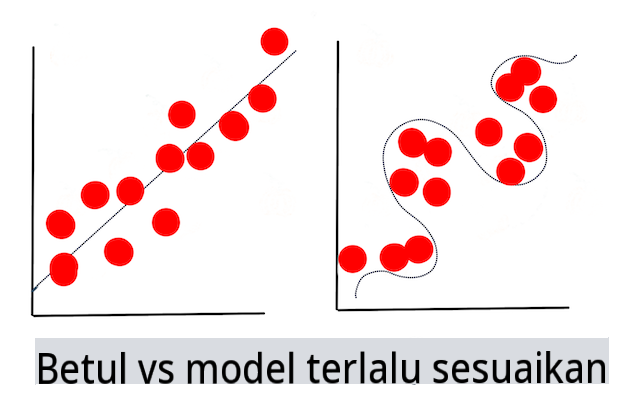

# Teknik Pembelajaran Mesin

Proses membangun, menggunakan, dan memelihara model pembelajaran mesin dan data yang mereka gunakan sangat berbeda dari banyak alur kerja pengembangan lainnya. Dalam pelajaran ini, kita akan mengurai proses tersebut, dan menjelaskan teknik utama yang perlu Anda ketahui. Anda akan:

- Memahami proses yang mendasari pembelajaran mesin pada tingkat tinggi.
- Menjelajahi konsep dasar seperti 'model', 'prediksi', dan 'data pelatihan'.

## [Kuis Pra-Kuliah](https://gray-sand-07a10f403.1.azurestaticapps.net/quiz/7/)

> 🎥 Klik gambar di atas untuk video singkat yang membahas pelajaran ini.

## Pengenalan

Secara garis besar, seni menciptakan proses pembelajaran mesin (ML) terdiri dari beberapa langkah:

1. **Tentukan pertanyaan**. Sebagian besar proses ML dimulai dengan mengajukan pertanyaan yang tidak dapat dijawab oleh program kondisional sederhana atau mesin berbasis aturan. Pertanyaan-pertanyaan ini sering kali berputar di sekitar prediksi berdasarkan kumpulan data.
2. **Kumpulkan dan siapkan data**. Untuk dapat menjawab pertanyaan Anda, Anda memerlukan data. Kualitas dan, kadang-kadang, kuantitas data Anda akan menentukan seberapa baik Anda dapat menjawab pertanyaan awal Anda. Visualisasi data adalah aspek penting dari fase ini. Fase ini juga mencakup pembagian data menjadi kelompok pelatihan dan pengujian untuk membangun model.
3. **Pilih metode pelatihan**. Tergantung pada pertanyaan Anda dan sifat data Anda, Anda perlu memilih bagaimana Anda ingin melatih model untuk mencerminkan data Anda dengan baik dan membuat prediksi yang akurat. Ini adalah bagian dari proses ML Anda yang membutuhkan keahlian khusus dan, sering kali, banyak percobaan.
4. **Latih model**. Menggunakan data pelatihan Anda, Anda akan menggunakan berbagai algoritma untuk melatih model agar mengenali pola dalam data. Model mungkin memanfaatkan bobot internal yang dapat disesuaikan untuk memprioritaskan bagian data tertentu daripada yang lain untuk membangun model yang lebih baik.
5. **Evaluasi model**. Anda menggunakan data yang belum pernah dilihat sebelumnya (data pengujian Anda) dari kumpulan yang dikumpulkan untuk melihat bagaimana kinerja model.
6. **Penyetelan parameter**. Berdasarkan kinerja model Anda, Anda dapat mengulangi proses menggunakan parameter yang berbeda, atau variabel, yang mengontrol perilaku algoritma yang digunakan untuk melatih model.
7. **Prediksi**. Gunakan input baru untuk menguji akurasi model Anda.

## Pertanyaan apa yang harus diajukan

Komputer sangat mahir dalam menemukan pola tersembunyi dalam data. Utilitas ini sangat membantu bagi para peneliti yang memiliki pertanyaan tentang domain tertentu yang tidak dapat dijawab dengan mudah dengan membuat mesin berbasis aturan kondisional. Diberikan tugas aktuaria, misalnya, seorang ilmuwan data mungkin dapat membangun aturan buatan tangan tentang kematian perokok vs non-perokok.

Namun, ketika banyak variabel lain dimasukkan ke dalam persamaan, model ML mungkin lebih efisien untuk memprediksi tingkat kematian di masa depan berdasarkan riwayat kesehatan masa lalu. Contoh yang lebih ceria mungkin adalah membuat prediksi cuaca untuk bulan April di lokasi tertentu berdasarkan data yang mencakup garis lintang, garis bujur, perubahan iklim, kedekatan dengan laut, pola aliran jet, dan lainnya.

✅ [Slide deck](https://www2.cisl.ucar.edu/sites/default/files/2021-10/0900%20June%2024%20Haupt_0.pdf) ini tentang model cuaca menawarkan perspektif historis untuk menggunakan ML dalam analisis cuaca.  

## Tugas Pra-Pembangunan

Sebelum mulai membangun model Anda, ada beberapa tugas yang perlu Anda selesaikan. Untuk menguji pertanyaan Anda dan membentuk hipotesis berdasarkan prediksi model, Anda perlu mengidentifikasi dan mengkonfigurasi beberapa elemen.

### Data

Untuk dapat menjawab pertanyaan Anda dengan kepastian apa pun, Anda memerlukan sejumlah data yang tepat. Ada dua hal yang perlu Anda lakukan pada titik ini:

- **Kumpulkan data**. Mengingat pelajaran sebelumnya tentang keadilan dalam analisis data, kumpulkan data Anda dengan hati-hati. Sadarilah sumber data ini, bias bawaan yang mungkin dimilikinya, dan dokumentasikan asal-usulnya.
- **Siapkan data**. Ada beberapa langkah dalam proses persiapan data. Anda mungkin perlu menggabungkan data dan menormalkannya jika berasal dari berbagai sumber. Anda dapat meningkatkan kualitas dan kuantitas data melalui berbagai metode seperti mengubah string menjadi angka (seperti yang kita lakukan dalam [Clustering](../../5-Clustering/1-Visualize/README.md)). Anda juga dapat menghasilkan data baru, berdasarkan yang asli (seperti yang kita lakukan dalam [Classification](../../4-Classification/1-Introduction/README.md)). Anda dapat membersihkan dan mengedit data (seperti yang akan kita lakukan sebelum pelajaran [Web App](../../3-Web-App/README.md)). Terakhir, Anda mungkin juga perlu mengacak dan mengocoknya, tergantung pada teknik pelatihan Anda.

✅ Setelah mengumpulkan dan memproses data Anda, luangkan waktu untuk melihat apakah bentuknya akan memungkinkan Anda menjawab pertanyaan yang dimaksud. Mungkin data tersebut tidak akan berkinerja baik dalam tugas yang diberikan, seperti yang kita temukan dalam pelajaran [Clustering](../../5-Clustering/1-Visualize/README.md)!

### Fitur dan Target

[Fitur](https://www.datasciencecentral.com/profiles/blogs/an-introduction-to-variable-and-feature-selection) adalah properti terukur dari data Anda. Dalam banyak dataset, itu diekspresikan sebagai tajuk kolom seperti 'tanggal', 'ukuran', atau 'warna'. Variabel fitur Anda, biasanya diwakili sebagai `X` dalam kode, mewakili variabel input yang akan digunakan untuk melatih model.

Target adalah hal yang Anda coba prediksi. Target biasanya diwakili sebagai `y` dalam kode, mewakili jawaban atas pertanyaan yang Anda coba ajukan dari data Anda: pada bulan Desember, warna **apa** labu yang akan paling murah? di San Francisco, lingkungan mana yang akan memiliki harga **real estate** terbaik? Kadang-kadang target juga disebut sebagai atribut label.

### Memilih variabel fitur Anda

🎓 **Pemilihan Fitur dan Ekstraksi Fitur** Bagaimana Anda tahu variabel mana yang harus dipilih saat membangun model? Anda mungkin akan melalui proses pemilihan fitur atau ekstraksi fitur untuk memilih variabel yang tepat untuk model yang paling berkinerja. Namun, mereka tidak sama: "Ekstraksi fitur membuat fitur baru dari fungsi fitur asli, sedangkan pemilihan fitur mengembalikan subset dari fitur." ([sumber](https://wikipedia.org/wiki/Feature_selection))

### Visualisasikan data Anda

Aspek penting dari alat ilmuwan data adalah kekuatan untuk memvisualisasikan data menggunakan beberapa pustaka yang sangat baik seperti Seaborn atau MatPlotLib. Mewakili data Anda secara visual mungkin memungkinkan Anda menemukan korelasi tersembunyi yang dapat Anda manfaatkan. Visualisasi Anda mungkin juga membantu Anda menemukan bias atau data yang tidak seimbang (seperti yang kita temukan dalam [Classification](../../4-Classification/2-Classifiers-1/README.md)).

### Membagi dataset Anda

Sebelum pelatihan, Anda perlu membagi dataset Anda menjadi dua atau lebih bagian dengan ukuran yang tidak sama yang masih mewakili data dengan baik.

- **Pelatihan**. Bagian dataset ini cocok dengan model Anda untuk melatihnya. Set ini merupakan mayoritas dari dataset asli.
- **Pengujian**. Dataset pengujian adalah kelompok data independen, sering kali dikumpulkan dari data asli, yang Anda gunakan untuk mengonfirmasi kinerja model yang dibangun.
- **Validasi**. Set validasi adalah kelompok contoh independen yang lebih kecil yang Anda gunakan untuk menyetel hyperparameter model, atau arsitektur, untuk meningkatkan model. Tergantung pada ukuran data Anda dan pertanyaan yang Anda ajukan, Anda mungkin tidak perlu membangun set ketiga ini (seperti yang kami catat dalam [Peramalan Deret Waktu](../../7-TimeSeries/1-Introduction/README.md)).

## Membangun model

Menggunakan data pelatihan Anda, tujuan Anda adalah membangun model, atau representasi statistik dari data Anda, menggunakan berbagai algoritma untuk **melatih**nya. Melatih model mengeksposnya ke data dan memungkinkan model membuat asumsi tentang pola yang dirasakannya, memvalidasi, dan menerima atau menolak.

### Tentukan metode pelatihan

Tergantung pada pertanyaan Anda dan sifat data Anda, Anda akan memilih metode untuk melatihnya. Melalui [dokumentasi Scikit-learn](https://scikit-learn.org/stable/user_guide.html) - yang kita gunakan dalam kursus ini - Anda dapat menjelajahi banyak cara untuk melatih model. Tergantung pada pengalaman Anda, Anda mungkin harus mencoba beberapa metode berbeda untuk membangun model terbaik. Anda kemungkinan besar akan melalui proses di mana ilmuwan data mengevaluasi kinerja model dengan memberinya data yang belum terlihat, memeriksa akurasi, bias, dan masalah penurunan kualitas lainnya, dan memilih metode pelatihan yang paling tepat untuk tugas yang ada.

### Melatih model

Dengan data pelatihan Anda, Anda siap untuk 'memasangkannya' untuk membuat model. Anda akan melihat bahwa di banyak pustaka ML Anda akan menemukan kode 'model.fit' - saat inilah Anda mengirimkan variabel fitur Anda sebagai array nilai (biasanya 'X') dan variabel target (biasanya 'y').

### Evaluasi model

Setelah proses pelatihan selesai (bisa memakan banyak iterasi, atau 'epoch', untuk melatih model besar), Anda akan dapat mengevaluasi kualitas model dengan menggunakan data pengujian untuk mengukur kinerjanya. Data ini adalah subset dari data asli yang belum pernah dianalisis oleh model sebelumnya. Anda dapat mencetak tabel metrik tentang kualitas model Anda.

🎓 **Pemasangan Model**

Dalam konteks pembelajaran mesin, pemasangan model mengacu pada akurasi fungsi dasar model saat mencoba menganalisis data yang tidak dikenalnya.

🎓 **Underfitting** dan **overfitting** adalah masalah umum yang menurunkan kualitas model, karena model cocok baik tidak cukup baik atau terlalu baik. Ini menyebabkan model membuat prediksi yang terlalu selaras atau terlalu longgar dengan data pelatihannya. Model yang overfit memprediksi data pelatihan terlalu baik karena telah mempelajari detail dan kebisingan data dengan terlalu baik. Model yang underfit tidak akurat karena tidak dapat menganalisis data pelatihannya maupun data yang belum pernah 'dilihatnya' dengan akurat.

> Infografik oleh [Jen Looper](https://twitter.com/jenlooper)

## Penyetelan parameter

Setelah pelatihan awal Anda selesai, amati kualitas model dan pertimbangkan untuk meningkatkannya dengan menyesuaikan 'hyperparameter'-nya. Baca lebih lanjut tentang prosesnya [dalam dokumentasi](https://docs.microsoft.com/en-us/azure/machine-learning/how-to-tune-hyperparameters?WT.mc_id=academic-77952-leestott).

## Prediksi

Ini adalah saat di mana Anda dapat menggunakan data yang benar-benar baru untuk menguji akurasi model Anda. Dalam pengaturan ML 'terapan', di mana Anda membangun aset web untuk menggunakan model dalam produksi, proses ini mungkin melibatkan pengumpulan input pengguna (misalnya, menekan tombol) untuk menetapkan variabel dan mengirimkannya ke model untuk inferensi, atau evaluasi.

Dalam pelajaran-pelajaran ini, Anda akan menemukan cara menggunakan langkah-langkah ini untuk mempersiapkan, membangun, menguji, mengevaluasi, dan memprediksi - semua gerakan seorang ilmuwan data dan lebih banyak lagi, saat Anda maju dalam perjalanan Anda untuk menjadi seorang insinyur ML 'full stack'.

---

## 🚀Tantangan

Buat bagan alur yang mencerminkan langkah-langkah seorang praktisi ML. Di mana Anda melihat diri Anda saat ini dalam proses? Di mana Anda memprediksi Anda akan menemukan kesulitan? Apa yang tampaknya mudah bagi Anda?

## [Kuis Pasca-Kuliah](https://gray-sand-07a10f403.1.azurestaticapps.net/quiz/8/)

## Tinjauan & Studi Mandiri

Cari wawancara dengan ilmuwan data yang membahas pekerjaan harian mereka secara online. Berikut [salah satunya](https://www.youtube.com/watch?v=Z3IjgbbCEfs).

## Tugas

[Wawancarai seorang ilmuwan data](assignment.md)

**Penafian**:
Dokumen ini telah diterjemahkan menggunakan perkhidmatan terjemahan AI berasaskan mesin. Walaupun kami berusaha untuk ketepatan, sila maklum bahawa terjemahan automatik mungkin mengandungi kesilapan atau ketidaktepatan. Dokumen asal dalam bahasa asalnya harus dianggap sebagai sumber yang berwibawa. Untuk maklumat penting, terjemahan manusia profesional disarankan. Kami tidak bertanggungjawab atas sebarang salah faham atau salah tafsir yang timbul daripada penggunaan terjemahan ini.