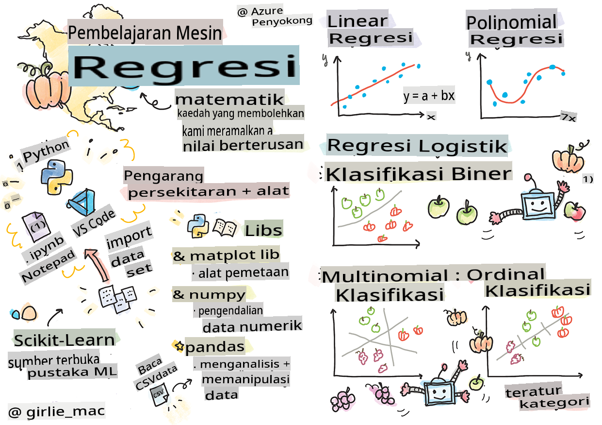
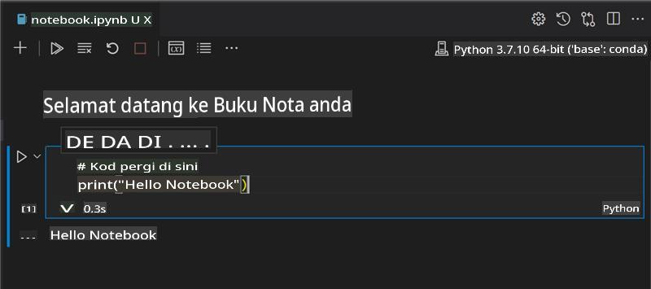
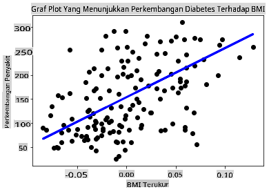

# Memulakan dengan Python dan Scikit-learn untuk model regresi



> Sketchnote oleh [Tomomi Imura](https://www.twitter.com/girlie_mac)

## [Kuiz pra-kuliah](https://gray-sand-07a10f403.1.azurestaticapps.net/quiz/9/)

> ### [Pelajaran ini tersedia dalam R!](../../../../2-Regression/1-Tools/solution/R/lesson_1.html)

## Pengenalan

Dalam empat pelajaran ini, anda akan belajar bagaimana untuk membina model regresi. Kami akan membincangkan apa kegunaannya sebentar lagi. Tetapi sebelum anda memulakan apa-apa, pastikan anda mempunyai alat yang betul untuk memulakan proses ini!

Dalam pelajaran ini, anda akan belajar bagaimana untuk:

- Mengkonfigurasi komputer anda untuk tugas pembelajaran mesin tempatan.
- Bekerja dengan Jupyter notebook.
- Menggunakan Scikit-learn, termasuk pemasangan.
- Meneroka regresi linear dengan latihan praktikal.

## Pemasangan dan konfigurasi

[](https://youtu.be/-DfeD2k2Kj0 "ML untuk pemula - Siapkan alat anda untuk membina model Pembelajaran Mesin")

> 🎥 Klik imej di atas untuk video pendek mengenai cara mengkonfigurasi komputer anda untuk ML.

1. **Pasang Python**. Pastikan [Python](https://www.python.org/downloads/) dipasang pada komputer anda. Anda akan menggunakan Python untuk banyak tugas sains data dan pembelajaran mesin. Kebanyakan sistem komputer sudah termasuk pemasangan Python. Terdapat juga [Pek Pengkodan Python](https://code.visualstudio.com/learn/educators/installers?WT.mc_id=academic-77952-leestott) yang berguna untuk memudahkan pemasangan bagi sesetengah pengguna.

   Sesetengah penggunaan Python memerlukan satu versi perisian, manakala yang lain memerlukan versi yang berbeza. Oleh itu, adalah berguna untuk bekerja dalam [persekitaran maya](https://docs.python.org/3/library/venv.html).

2. **Pasang Visual Studio Code**. Pastikan anda mempunyai Visual Studio Code dipasang pada komputer anda. Ikuti arahan ini untuk [memasang Visual Studio Code](https://code.visualstudio.com/) untuk pemasangan asas. Anda akan menggunakan Python dalam Visual Studio Code dalam kursus ini, jadi mungkin anda ingin menyemak cara [mengkonfigurasi Visual Studio Code](https://docs.microsoft.com/learn/modules/python-install-vscode?WT.mc_id=academic-77952-leestott) untuk pembangunan Python.

   > Biasakan diri dengan Python dengan bekerja melalui koleksi [modul Pembelajaran](https://docs.microsoft.com/users/jenlooper-2911/collections/mp1pagggd5qrq7?WT.mc_id=academic-77952-leestott)
   >
   > [](https://youtu.be/yyQM70vi7V8 "Siapkan Python dengan Visual Studio Code")
   >
   > 🎥 Klik imej di atas untuk video: menggunakan Python dalam VS Code.

3. **Pasang Scikit-learn**, dengan mengikuti [arahan ini](https://scikit-learn.org/stable/install.html). Memandangkan anda perlu memastikan bahawa anda menggunakan Python 3, adalah disyorkan agar anda menggunakan persekitaran maya. Perhatikan, jika anda memasang perpustakaan ini pada Mac M1, terdapat arahan khas pada halaman yang dipautkan di atas.

1. **Pasang Jupyter Notebook**. Anda perlu [memasang pakej Jupyter](https://pypi.org/project/jupyter/).

## Persekitaran pengarang ML anda

Anda akan menggunakan **notebook** untuk membangunkan kod Python anda dan mencipta model pembelajaran mesin. Jenis fail ini adalah alat biasa untuk saintis data, dan ia boleh dikenali dengan akhiran atau sambungan `.ipynb`.

Notebook adalah persekitaran interaktif yang membolehkan pembangun untuk menulis kod dan menambah nota serta menulis dokumentasi di sekitar kod yang sangat membantu untuk projek eksperimen atau berorientasikan penyelidikan.

[](https://youtu.be/7E-jC8FLA2E "ML untuk pemula - Siapkan Jupyter Notebooks untuk mula membina model regresi")

> 🎥 Klik imej di atas untuk video pendek mengenai latihan ini.

### Latihan - bekerja dengan notebook

Dalam folder ini, anda akan menemui fail _notebook.ipynb_.

1. Buka _notebook.ipynb_ dalam Visual Studio Code.

   Pelayan Jupyter akan bermula dengan Python 3+ dimulakan. Anda akan menemui kawasan notebook yang boleh `run`, potongan kod. Anda boleh menjalankan blok kod dengan memilih ikon yang kelihatan seperti butang main.

1. Pilih ikon `md` dan tambah sedikit markdown, dan teks berikut **# Selamat datang ke notebook anda**.

   Seterusnya, tambahkan sedikit kod Python.

1. Taip **print('hello notebook')** dalam blok kod.
1. Pilih anak panah untuk menjalankan kod.

   Anda sepatutnya melihat kenyataan yang dicetak:

    ```output
    hello notebook
    ```



Anda boleh menyisipkan kod anda dengan komen untuk mendokumentasikan notebook secara sendiri.

✅ Fikirkan sejenak tentang perbezaan antara persekitaran kerja pembangun web dan saintis data.

## Berfungsi dengan Scikit-learn

Sekarang Python telah disediakan dalam persekitaran tempatan anda, dan anda selesa dengan Jupyter notebook, mari kita sama-sama selesa dengan Scikit-learn (sebut `sci` as in `science`). Scikit-learn menyediakan [API yang luas](https://scikit-learn.org/stable/modules/classes.html#api-ref) untuk membantu anda melaksanakan tugas ML.

Menurut [laman web mereka](https://scikit-learn.org/stable/getting_started.html), "Scikit-learn adalah perpustakaan pembelajaran mesin sumber terbuka yang menyokong pembelajaran terkawal dan tidak terkawal. Ia juga menyediakan pelbagai alat untuk pemasangan model, prapemprosesan data, pemilihan model dan penilaian, serta banyak utiliti lain."

Dalam kursus ini, anda akan menggunakan Scikit-learn dan alat lain untuk membina model pembelajaran mesin untuk melaksanakan apa yang kita panggil tugas 'pembelajaran mesin tradisional'. Kami sengaja mengelakkan rangkaian neural dan pembelajaran mendalam, kerana ia lebih baik diliputi dalam kurikulum 'AI untuk Pemula' kami yang akan datang.

Scikit-learn memudahkan untuk membina model dan menilainya untuk digunakan. Ia terutama tertumpu pada penggunaan data berangka dan mengandungi beberapa set data sedia ada untuk digunakan sebagai alat pembelajaran. Ia juga termasuk model siap bina untuk pelajar mencuba. Mari kita terokai proses memuatkan data yang telah dibungkus dan menggunakan estimator yang dibina untuk model ML pertama dengan Scikit-learn dengan beberapa data asas.

## Latihan - notebook Scikit-learn pertama anda

> Tutorial ini diilhamkan oleh [contoh regresi linear](https://scikit-learn.org/stable/auto_examples/linear_model/plot_ols.html#sphx-glr-auto-examples-linear-model-plot-ols-py) di laman web Scikit-learn.

[](https://youtu.be/2xkXL5EUpS0 "ML untuk pemula - Projek Regresi Linear Pertama Anda dalam Python")

> 🎥 Klik imej di atas untuk video pendek mengenai latihan ini.

Dalam fail _notebook.ipynb_ yang berkaitan dengan pelajaran ini, kosongkan semua sel dengan menekan ikon 'tong sampah'.

Dalam bahagian ini, anda akan bekerja dengan set data kecil tentang diabetes yang dibina dalam Scikit-learn untuk tujuan pembelajaran. Bayangkan bahawa anda ingin menguji rawatan untuk pesakit diabetes. Model Pembelajaran Mesin mungkin membantu anda menentukan pesakit mana yang akan memberi tindak balas lebih baik kepada rawatan, berdasarkan kombinasi pembolehubah. Walaupun model regresi yang sangat asas, apabila divisualisasikan, mungkin menunjukkan maklumat tentang pembolehubah yang akan membantu anda mengatur percubaan klinikal teori anda.

✅ Terdapat banyak jenis kaedah regresi, dan yang mana satu anda pilih bergantung pada jawapan yang anda cari. Jika anda ingin meramalkan ketinggian yang mungkin untuk seseorang pada usia tertentu, anda akan menggunakan regresi linear, kerana anda mencari **nilai berangka**. Jika anda berminat untuk mengetahui sama ada jenis masakan harus dianggap vegan atau tidak, anda mencari **penugasan kategori** jadi anda akan menggunakan regresi logistik. Anda akan belajar lebih lanjut tentang regresi logistik kemudian. Fikirkan sedikit tentang beberapa soalan yang boleh anda tanya daripada data, dan kaedah mana yang lebih sesuai.

Mari kita mulakan tugas ini.

### Import perpustakaan

Untuk tugas ini, kita akan mengimport beberapa perpustakaan:

- **matplotlib**. Ia adalah alat [grafik yang berguna](https://matplotlib.org/) dan kita akan menggunakannya untuk mencipta plot garis.
- **numpy**. [numpy](https://numpy.org/doc/stable/user/whatisnumpy.html) adalah perpustakaan yang berguna untuk mengendalikan data berangka dalam Python.
- **sklearn**. Ini adalah perpustakaan [Scikit-learn](https://scikit-learn.org/stable/user_guide.html).

Import beberapa perpustakaan untuk membantu dengan tugas anda.

1. Tambah import dengan menaip kod berikut:

   ```python
   import matplotlib.pyplot as plt
   import numpy as np
   from sklearn import datasets, linear_model, model_selection
   ```

   Di atas anda mengimport `matplotlib`, `numpy` and you are importing `datasets`, `linear_model` and `model_selection` from `sklearn`. `model_selection` is used for splitting data into training and test sets.

### The diabetes dataset

The built-in [diabetes dataset](https://scikit-learn.org/stable/datasets/toy_dataset.html#diabetes-dataset) includes 442 samples of data around diabetes, with 10 feature variables, some of which include:

- age: age in years
- bmi: body mass index
- bp: average blood pressure
- s1 tc: T-Cells (a type of white blood cells)

✅ This dataset includes the concept of 'sex' as a feature variable important to research around diabetes. Many medical datasets include this type of binary classification. Think a bit about how categorizations such as this might exclude certain parts of a population from treatments.

Now, load up the X and y data.

> 🎓 Remember, this is supervised learning, and we need a named 'y' target.

In a new code cell, load the diabetes dataset by calling `load_diabetes()`. The input `return_X_y=True` signals that `X` will be a data matrix, and `y` akan menjadi sasaran regresi.

1. Tambah beberapa arahan cetak untuk menunjukkan bentuk matriks data dan elemen pertamanya:

    ```python
    X, y = datasets.load_diabetes(return_X_y=True)
    print(X.shape)
    print(X[0])
    ```

    Apa yang anda dapatkan sebagai respons adalah tuple. Apa yang anda lakukan adalah menetapkan dua nilai pertama tuple kepada `X` and `y` masing-masing. Ketahui lebih lanjut [mengenai tuple](https://wikipedia.org/wiki/Tuple).

    Anda boleh melihat bahawa data ini mempunyai 442 item yang dibentuk dalam tatasusunan 10 elemen:

    ```text
    (442, 10)
    [ 0.03807591  0.05068012  0.06169621  0.02187235 -0.0442235  -0.03482076
    -0.04340085 -0.00259226  0.01990842 -0.01764613]
    ```

    ✅ Fikirkan sedikit tentang hubungan antara data dan sasaran regresi. Regresi linear meramalkan hubungan antara ciri X dan pembolehubah sasaran y. Bolehkah anda mencari [sasaran](https://scikit-learn.org/stable/datasets/toy_dataset.html#diabetes-dataset) untuk set data diabetes dalam dokumentasi? Apakah yang ditunjukkan oleh set data ini, memandangkan sasaran tersebut?

2. Seterusnya, pilih sebahagian daripada set data ini untuk plot dengan memilih lajur ke-3 set data. Anda boleh melakukannya dengan menggunakan `:` operator to select all rows, and then selecting the 3rd column using the index (2). You can also reshape the data to be a 2D array - as required for plotting - by using `reshape(n_rows, n_columns)`. Jika salah satu parameter adalah -1, dimensi yang sepadan akan dikira secara automatik.

   ```python
   X = X[:, 2]
   X = X.reshape((-1,1))
   ```

   ✅ Pada bila-bila masa, cetak data untuk memeriksa bentuknya.

3. Sekarang anda mempunyai data yang sedia untuk diplot, anda boleh melihat sama ada mesin boleh membantu menentukan pemisahan logik antara nombor dalam set data ini. Untuk melakukan ini, anda perlu membahagikan kedua-dua data (X) dan sasaran (y) kepada set ujian dan latihan. Scikit-learn mempunyai cara yang mudah untuk melakukan ini; anda boleh membahagikan data ujian anda pada titik tertentu.

   ```python
   X_train, X_test, y_train, y_test = model_selection.train_test_split(X, y, test_size=0.33)
   ```

4. Sekarang anda bersedia untuk melatih model anda! Muatkan model regresi linear dan latihkannya dengan set latihan X dan y anda menggunakan `model.fit()`:

    ```python
    model = linear_model.LinearRegression()
    model.fit(X_train, y_train)
    ```

    ✅ `model.fit()` is a function you'll see in many ML libraries such as TensorFlow

5. Then, create a prediction using test data, using the function `predict()`. Ini akan digunakan untuk melukis garis antara kumpulan data

    ```python
    y_pred = model.predict(X_test)
    ```

6. Sekarang tiba masanya untuk menunjukkan data dalam plot. Matplotlib adalah alat yang sangat berguna untuk tugas ini. Cipta scatterplot semua data ujian X dan y, dan gunakan ramalan untuk melukis garis di tempat yang paling sesuai, antara kumpulan data model.

    ```python
    plt.scatter(X_test, y_test,  color='black')
    plt.plot(X_test, y_pred, color='blue', linewidth=3)
    plt.xlabel('Scaled BMIs')
    plt.ylabel('Disease Progression')
    plt.title('A Graph Plot Showing Diabetes Progression Against BMI')
    plt.show()
    ```

   

   ✅ Fikirkan sedikit tentang apa yang sedang berlaku di sini. Garis lurus berjalan melalui banyak titik kecil data, tetapi apa sebenarnya yang dilakukannya? Bolehkah anda melihat bagaimana anda sepatutnya boleh menggunakan garis ini untuk meramalkan di mana titik data baru yang belum dilihat patut ditempatkan dalam hubungan dengan paksi y plot? Cuba jelaskan kegunaan praktikal model ini.

Tahniah, anda telah membina model regresi linear pertama anda, mencipta ramalan dengannya, dan memaparkannya dalam plot!

---
## 🚀Cabaran

Plot pembolehubah yang berbeza daripada set data ini. Petunjuk: edit baris ini: `X = X[:,2]`. Memandangkan sasaran set data ini, apakah yang anda dapat temui tentang perkembangan penyakit diabetes?
## [Kuiz pasca-kuliah](https://gray-sand-07a10f403.1.azurestaticapps.net/quiz/10/)

## Ulasan & Kajian Sendiri

Dalam tutorial ini, anda bekerja dengan regresi linear mudah, dan bukannya regresi univariat atau multivariat. Baca sedikit tentang perbezaan antara kaedah ini, atau tonton [video ini](https://www.coursera.org/lecture/quantifying-relationships-regression-models/linear-vs-nonlinear-categorical-variables-ai2Ef)

Baca lebih lanjut tentang konsep regresi dan fikirkan tentang jenis soalan yang boleh dijawab oleh teknik ini. Ambil [tutorial ini](https://docs.microsoft.com/learn/modules/train-evaluate-regression-models?WT.mc_id=academic-77952-leestott) untuk mendalami pemahaman anda.

## Tugasan

[Set data yang berbeza](assignment.md)

**Penafian**:
Dokumen ini telah diterjemahkan menggunakan perkhidmatan terjemahan AI berasaskan mesin. Walaupun kami berusaha untuk ketepatan, sila maklum bahawa terjemahan automatik mungkin mengandungi kesilapan atau ketidaktepatan. Dokumen asal dalam bahasa asalnya harus dianggap sebagai sumber yang berwibawa. Untuk maklumat kritikal, terjemahan manusia profesional adalah disyorkan. Kami tidak bertanggungjawab atas sebarang salah faham atau salah tafsir yang timbul daripada penggunaan terjemahan ini.