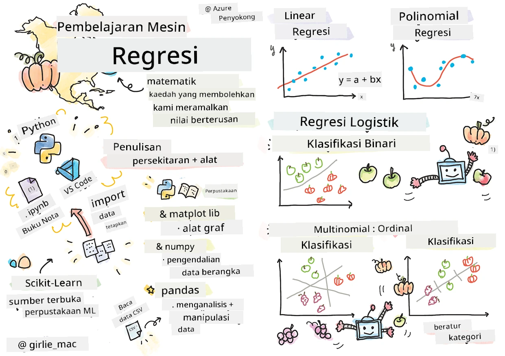
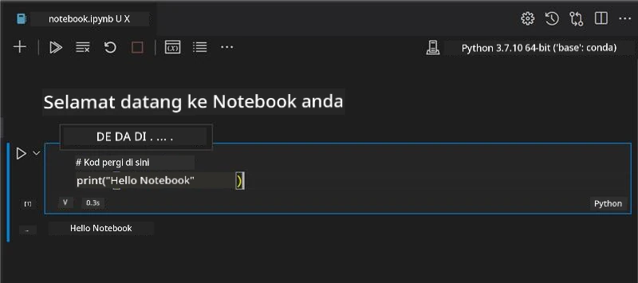
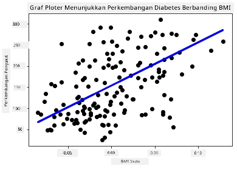

# Mulakan dengan Python dan Scikit-learn untuk model regresi



> Nota lakaran oleh [Tomomi Imura](https://www.twitter.com/girlie_mac)

## [Kuiz pra-ceramah](https://ff-quizzes.netlify.app/en/ml/)

> ### [Pelajaran ini tersedia dalam R!](../../../../2-Regression/1-Tools/solution/R/lesson_1.html)

## Pengenalan

Dalam empat pelajaran ini, anda akan menemui cara membina model regresi. Kami akan membincangkan kegunaannya sebentar lagi. Tetapi sebelum anda melakukan apa-apa, pastikan anda mempunyai alat yang betul untuk memulakan proses ini!

Dalam pelajaran ini, anda akan belajar bagaimana:

- Mengkonfigurasi komputer anda untuk tugasan pembelajaran mesin tempatan.
- Bekerja dengan Jupyter Notebooks.
- Menggunakan Scikit-learn, termasuk pemasangan.
- Meneroka regresi linear dengan latihan praktikal.

## Pemasangan dan konfigurasi

[](https://youtu.be/-DfeD2k2Kj0 "ML untuk pemula - Sediakan alat anda untuk membina model Pembelajaran Mesin")

> 🎥 Klik imej di atas untuk video pendek mengenai cara mengkonfigurasi komputer anda untuk ML.

1. **Pasang Python**. Pastikan [Python](https://www.python.org/downloads/) dipasang pada komputer anda. Anda akan menggunakan Python untuk banyak tugasan sains data dan pembelajaran mesin. Kebanyakan sistem komputer sudah termasuk pemasangan Python. Terdapat juga [Pakej Kod Python](https://code.visualstudio.com/learn/educators/installers?WT.mc_id=academic-77952-leestott) yang berguna untuk memudahkan penyediaan bagi sesetengah pengguna.

   Walau bagaimanapun, beberapa kegunaan Python memerlukan versi perisian yang berbeza. Oleh itu, adalah berguna untuk bekerja dalam [persekitaran maya](https://docs.python.org/3/library/venv.html).

2. **Pasang Visual Studio Code**. Pastikan Visual Studio Code dipasang pada komputer anda. Ikuti arahan ini untuk [memasang Visual Studio Code](https://code.visualstudio.com/) bagi pemasangan asas. Anda akan menggunakan Python dalam Visual Studio Code dalam kursus ini, jadi anda mungkin mahu mengasah kemahiran bagaimana untuk [mengkonfigurasi Visual Studio Code](https://docs.microsoft.com/learn/modules/python-install-vscode?WT.mc_id=academic-77952-leestott) untuk pembangunan Python.

   > Biasakan diri dengan Python dengan melalui koleksi [modul Pembelajaran](https://docs.microsoft.com/users/jenlooper-2911/collections/mp1pagggd5qrq7?WT.mc_id=academic-77952-leestott)
   >
   > [](https://youtu.be/yyQM70vi7V8 "Pasang Python dengan Visual Studio Code")
   >
   > 🎥 Klik imej di atas untuk video: menggunakan Python dalam VS Code.

3. **Pasang Scikit-learn**, dengan mengikuti [arahan ini](https://scikit-learn.org/stable/install.html). Oleh kerana anda perlu memastikan menggunakan Python 3, adalah disyorkan menggunakan persekitaran maya. Nota, jika anda memasang perpustakaan ini pada Mac M1, terdapat arahan khas di halaman pautan di atas.

1. **Pasang Jupyter Notebook**. Anda perlu [memasang pakej Jupyter](https://pypi.org/project/jupyter/).

## Persekitaran penulisan ML anda

Anda akan menggunakan **notebook** untuk membangunkan kod Python dan mencipta model pembelajaran mesin. Jenis fail ini adalah alat biasa untuk saintis data, dan ia boleh dikenali melalui akhiran atau sambungan `.ipynb`.

Notebook ialah persekitaran interaktif yang membolehkan pembangun menulis kod dan menambah nota serta dokumentasi di sekitar kod yang sangat membantu untuk projek eksperimen atau berorientasikan penyelidikan.

[](https://youtu.be/7E-jC8FLA2E "ML untuk pemula - Sediakan Jupyter Notebooks untuk mula membina model regresi")

> 🎥 Klik imej di atas untuk video pendek yang menunjukkan latihan ini.

### Latihan - bekerja dengan notebook

Dalam folder ini, anda akan menemui fail _notebook.ipynb_.

1. Buka _notebook.ipynb_ dalam Visual Studio Code.

   Pelayan Jupyter akan bermula dengan Python 3+ dimulakan. Anda akan menjumpai bahagian notebook yang boleh `run`, potongan kod. Anda boleh menjalankan blok kod dengan memilih ikon yang kelihatan seperti butang main.

1. Pilih ikon `md` dan tambahkan sedikit markdown, serta teks berikut **# Selamat datang ke notebook anda**.

   Seterusnya, tambah sedikit kod Python.

1. Taip **print('hello notebook')** dalam blok kod.
1. Pilih anak panah untuk menjalankan kod.

   Anda harus melihat pernyataan cetak:

    ```output
    hello notebook
    ```



Anda boleh menyelingi kod anda dengan komen untuk mendokumentasikan notebook secara sendiri.

✅ Fikirkan sekejap bagaimana persekitaran kerja pembangun web berbeza dengan persekitaran saintis data.

## Bersedia dengan Scikit-learn

Sekarang Python telah disediakan dalam persekitaran tempatan anda, dan anda sudah selesa dengan Jupyter Notebooks, mari kita juga biasa dengan Scikit-learn (sebut `sci` seperti dalam `science`). Scikit-learn menyediakan [API yang luas](https://scikit-learn.org/stable/modules/classes.html#api-ref) untuk membantu anda melaksanakan tugasan ML.

Menurut [laman web mereka](https://scikit-learn.org/stable/getting_started.html), "Scikit-learn adalah perpustakaan pembelajaran mesin sumber terbuka yang menyokong pembelajaran terpantau dan tidak terpantau. Ia juga menyediakan pelbagai alat untuk pemasangan model, prapengendalian data, pemilihan dan penilaian model, dan banyak utiliti lain."

Dalam kursus ini, anda akan menggunakan Scikit-learn dan alat lain untuk membina model pembelajaran mesin bagi melaksanakan apa yang kami panggil tugasan 'pembelajaran mesin tradisional'. Kami sengaja mengelakkan rangkaian neural dan pembelajaran mendalam kerana ia lebih sesuai dibincangkan dalam kurikulum 'AI untuk Pemula' yang akan datang.

Scikit-learn memudahkan pembangunan model dan penilaiannya untuk kegunaan. Ia terutamanya fokus pada penggunaan data berangka dan mengandungi beberapa set data siap guna sebagai alat pembelajaran. Ia juga termasuk model terbina khas untuk pelajar cuba. Mari kita teroka proses memuatkan data pra-pakej dan menggunakan penilai terbina dalam model ML pertama dengan Scikit-learn menggunakan data asas.

## Latihan - notebook Scikit-learn pertama anda

> Tutorial ini diilhamkan oleh [contoh regresi linear](https://scikit-learn.org/stable/auto_examples/linear_model/plot_ols.html#sphx-glr-auto-examples-linear-model-plot-ols-py) di laman web Scikit-learn.


[](https://youtu.be/2xkXL5EUpS0 "ML untuk pemula - Projek Regresi Linear Pertama anda dalam Python")

> 🎥 Klik imej di atas untuk video pendek yang menunjukkan latihan ini.

Dalam fail _notebook.ipynb_ yang berkaitan dengan pelajaran ini, bersihkan semua sel dengan menekan ikon 'tong sampah'.

Dalam seksyen ini, anda akan bekerja dengan set data kecil tentang diabetes yang dibina dalam Scikit-learn untuk tujuan pembelajaran. Bayangkan anda ingin menguji rawatan untuk pesakit diabetes. Model Pembelajaran Mesin mungkin membantu anda menentukan pesakit mana yang akan memberi tindak balas lebih baik kepada rawatan berdasarkan gabungan pembolehubah. Walaupun model regresi yang sangat asas, apabila divisualisasikan, mungkin menunjukkan maklumat tentang pembolehubah yang membantu anda mengatur ujian klinikal teori anda.

✅ Terdapat banyak jenis kaedah regresi, dan pilihan anda bergantung pada jawapan yang anda cari. Jika anda ingin meramalkan tinggi badan yang mungkin bagi seseorang pada umur tertentu, anda akan menggunakan regresi linear kerana anda mencari **nilai berangka**. Jika anda berminat untuk mengetahui sama ada jenis masakan dianggap vegan atau tidak, anda mencari **penentuan kategori**, jadi anda akan menggunakan regresi logistik. Anda akan belajar lebih lanjut tentang regresi logistik nanti. Fikirkan sedikit tentang beberapa soalan yang anda boleh ajukan kepada data, dan kaedah mana yang lebih sesuai.

Mari kita mula tugasan ini.

### Import perpustakaan

Untuk tugasan ini kita akan import beberapa perpustakaan:

- **matplotlib**. Ia ialah [alat graf](https://matplotlib.org/) yang berguna dan kami akan menggunakannya untuk membuat plot garis.
- **numpy**. [numpy](https://numpy.org/doc/stable/user/whatisnumpy.html) adalah perpustakaan berguna untuk mengendalikan data berangka dalam Python.
- **sklearn**. Ini adalah perpustakaan [Scikit-learn](https://scikit-learn.org/stable/user_guide.html).

Import beberapa perpustakaan untuk membantu anda dalam tugasan.

1. Tambahkan import dengan menaip kod berikut:

   ```python
   import matplotlib.pyplot as plt
   import numpy as np
   from sklearn import datasets, linear_model, model_selection
   ```

   Di atas anda mengimport `matplotlib`, `numpy` dan anda mengimport `datasets`, `linear_model` dan `model_selection` dari `sklearn`. `model_selection` digunakan untuk membahagikan data kepada set latihan dan ujian.

### Set data diabetes

Set data bawaan [diabetes](https://scikit-learn.org/stable/datasets/toy_dataset.html#diabetes-dataset) mengandungi 442 sampel data diabetes, dengan 10 pembolehubah ciri, beberapa daripadanya termasuk:

- umur: umur dalam tahun
- bmi: indeks jisim badan
- bp: tekanan darah purata
- s1 tc: Sel T (sejenis sel darah putih)

✅ Set data ini termasuk konsep 'jantina' sebagai pembolehubah ciri penting dalam penyelidikan diabetes. Banyak set data perubatan mengandungi klasifikasi binari seperti ini. Fikirkan sedikit bagaimana pengelasan seperti ini mungkin mengecualikan sebahagian populasi daripada rawatan.

Sekarang, muat naik data X dan y.

> 🎓 Ingat, ini adalah pembelajaran terpantau, dan kita perlu ada sasaran 'y' yang dinamakan.

Dalam sel kod baru, muat set data diabetes dengan memanggil `load_diabetes()`. Input `return_X_y=True` memberitahu bahawa `X` akan menjadi matriks data, dan `y` akan menjadi sasaran regresi.

1. Tambah beberapa perintah print untuk menunjukkan bentuk matriks data dan unsur pertamanya:

    ```python
    X, y = datasets.load_diabetes(return_X_y=True)
    print(X.shape)
    print(X[0])
    ```

    Apa yang anda dapat balik sebagai respons, ialah tuple. Anda sedang memberikan dua nilai pertama tuple kepada `X` dan `y` secara berasingan. Ketahui lebih lanjut [ mengenai tuple](https://wikipedia.org/wiki/Tuple).

    Anda boleh lihat data ini ada 442 item yang dibentuk dalam array 10 elemen:

    ```text
    (442, 10)
    [ 0.03807591  0.05068012  0.06169621  0.02187235 -0.0442235  -0.03482076
    -0.04340085 -0.00259226  0.01990842 -0.01764613]
    ```

    ✅ Fikirkan sedikit tentang hubungan antara data dan sasaran regresi. Regresi linear meramalkan hubungan antara ciri X dan pembolehubah sasaran y. Bolehkah anda temukan [sasaran](https://scikit-learn.org/stable/datasets/toy_dataset.html#diabetes-dataset) untuk set data diabetes dalam dokumentasi? Apakah yang dataset ini demonstrasikan, memandangkan sasaran itu?

2. Seterusnya, pilih sebahagian set data ini untuk dilukis dengan memilih lajur ke-3 dataset. Anda boleh lakukan ini dengan menggunakan operator `:` untuk memilih semua baris, dan kemudian memilih lajur ke-3 menggunakan indeks (2). Anda juga boleh bentuk semula data menjadi array 2D - seperti yang diperlukan untuk plot - dengan menggunakan `reshape(n_rows, n_columns)`. Jika salah satu parameter adalah -1, dimensi yang bersesuaian dikira secara automatik.

   ```python
   X = X[:, 2]
   X = X.reshape((-1,1))
   ```

   ✅ Pada bila-bila masa, cetak data untuk memeriksa bentuknya.

3. Sekarang data sudah sedia untuk dilukis, anda boleh lihat sama ada mesin boleh membantu menentukan pembahagian logik antara nombor dalam set data ini. Untuk ini, anda perlu membahagikan kedua-dua data (X) dan sasaran (y) kepada set ujian dan latihan. Scikit-learn ada cara mudah untuk melakukan ini; anda boleh membahagikan data ujian anda pada titik yang diberikan.

   ```python
   X_train, X_test, y_train, y_test = model_selection.train_test_split(X, y, test_size=0.33)
   ```

4. Sekarang anda bersedia untuk melatih model! Muat model regresi linear dan latih dengan set latihan X dan y menggunakan `model.fit()`:

    ```python
    model = linear_model.LinearRegression()
    model.fit(X_train, y_train)
    ```

    ✅ `model.fit()` adalah fungsi yang anda akan jumpa dalam banyak perpustakaan ML seperti TensorFlow

5. Kemudian, cipta ramalan menggunakan data ujian, dengan fungsi `predict()`. Ini akan digunakan untuk melukis garis antara kumpulan data

    ```python
    y_pred = model.predict(X_test)
    ```

6. Kini tiba masa untuk memaparkan data dalam plot. Matplotlib adalah alat yang sangat berguna untuk tugasan ini. Buat scatterplot semua data X dan y ujian, dan gunakan ramalan untuk melukis garis di tempat yang paling sesuai, antara kelompok data model.

    ```python
    plt.scatter(X_test, y_test,  color='black')
    plt.plot(X_test, y_pred, color='blue', linewidth=3)
    plt.xlabel('Scaled BMIs')
    plt.ylabel('Disease Progression')
    plt.title('A Graph Plot Showing Diabetes Progression Against BMI')
    plt.show()
    ```

   


   ✅ Fikirkan sedikit tentang apa yang sedang berlaku di sini. Garisan lurus sedang melintasi banyak titik data kecil, tetapi apa sebenarnya yang dilakukannya? Bolehkah anda lihat bagaimana anda sepatutnya dapat menggunakan garisan ini untuk meramalkan di mana titik data baru yang belum dilihat sepatutnya diletakkan berhubung dengan paksi y plot tersebut? Cuba nyatakan secara praktikal kegunaan model ini.

Tahniah, anda telah membina model regresi linear pertama anda, membuat ramalan dengannya, dan memaparkannya dalam plot!

---
## 🚀Cabaran

Plotkan pemboleh ubah yang berbeza dari dataset ini. Petunjuk: sunting baris ini: `X = X[:,2]`. Memandangkan sasaran dataset ini, apa yang anda dapat temui tentang perkembangan diabetes sebagai penyakit?
## [Kuiz pasca kuliah](https://ff-quizzes.netlify.app/en/ml/)

## Ulasan & Belajar Kendiri

Dalam tutorial ini, anda bekerja dengan regresi linear mudah, bukan regresi linear univariat atau berganda. Baca sedikit tentang perbezaan antara kaedah-kaedah ini, atau lihat [video ini](https://www.coursera.org/lecture/quantifying-relationships-regression-models/linear-vs-nonlinear-categorical-variables-ai2Ef)

Baca lebih lanjut tentang konsep regresi dan fikirkan tentang jenis soalan apa yang boleh dijawab oleh teknik ini. Ikuti [tutorial ini](https://docs.microsoft.com/learn/modules/train-evaluate-regression-models?WT.mc_id=academic-77952-leestott) untuk mendalami pemahaman anda.

## Tugasan

[Dataset yang berbeza](assignment.md)

---

<!-- CO-OP TRANSLATOR DISCLAIMER START -->
**Penafian**:
Dokumen ini telah diterjemahkan menggunakan perkhidmatan terjemahan AI [Co-op Translator](https://github.com/Azure/co-op-translator). Walaupun kami berusaha untuk ketepatan, sila ambil maklum bahawa terjemahan automatik mungkin mengandungi kesilapan atau ketidaktepatan. Dokumen asal dalam bahasa asalnya harus dianggap sebagai sumber yang sahih. Untuk maklumat penting, terjemahan oleh manusia profesional adalah disyorkan. Kami tidak bertanggungjawab terhadap sebarang salah faham atau salah tafsir yang timbul daripada penggunaan terjemahan ini.
<!-- CO-OP TRANSLATOR DISCLAIMER END -->