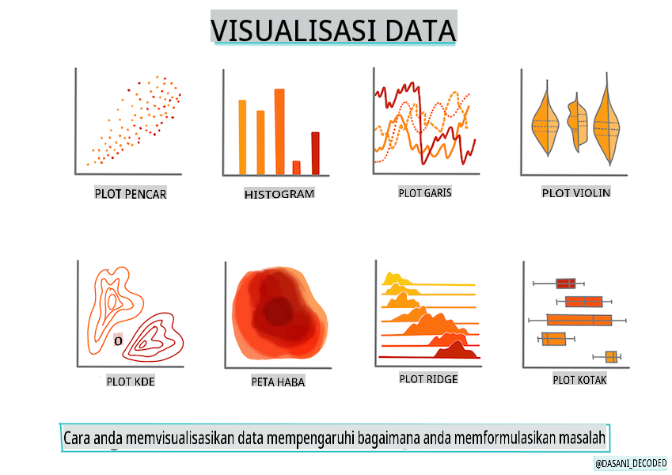
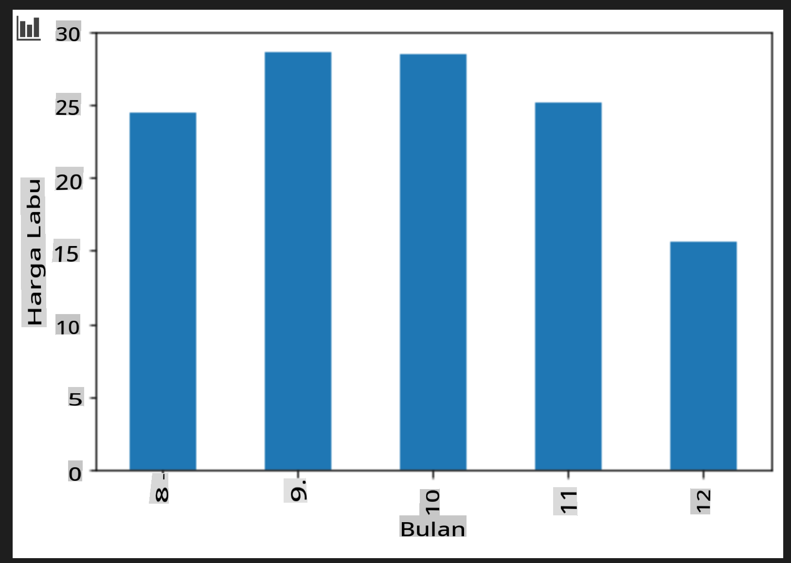

# Bina model regresi menggunakan Scikit-learn: menyediakan dan memvisualisasikan data



Infografik oleh [Dasani Madipalli](https://twitter.com/dasani_decoded)

## [Kuiz pra-kuliah](https://gray-sand-07a10f403.1.azurestaticapps.net/quiz/11/)

> ### [Pelajaran ini tersedia dalam R!](../../../../2-Regression/2-Data/solution/R/lesson_2.html)

## Pengenalan

Sekarang setelah Anda memiliki alat yang diperlukan untuk mulai membangun model pembelajaran mesin dengan Scikit-learn, Anda siap untuk mulai mengajukan pertanyaan pada data Anda. Saat Anda bekerja dengan data dan menerapkan solusi ML, sangat penting untuk memahami cara mengajukan pertanyaan yang tepat untuk benar-benar membuka potensi dataset Anda.

Dalam pelajaran ini, Anda akan belajar:

- Cara mempersiapkan data Anda untuk membangun model.
- Cara menggunakan Matplotlib untuk visualisasi data.

## Mengajukan pertanyaan yang tepat pada data Anda

Pertanyaan yang perlu Anda jawab akan menentukan jenis algoritma ML yang akan Anda gunakan. Dan kualitas jawaban yang Anda dapatkan sangat bergantung pada sifat data Anda.

Lihatlah [data](https://github.com/microsoft/ML-For-Beginners/blob/main/2-Regression/data/US-pumpkins.csv) yang disediakan untuk pelajaran ini. Anda dapat membuka file .csv ini di VS Code. Sekilas cepat segera menunjukkan bahwa ada kekosongan dan campuran data string dan numerik. Ada juga kolom aneh bernama 'Package' di mana datanya adalah campuran antara 'sacks', 'bins' dan nilai lainnya. Data tersebut, sebenarnya, agak berantakan.

[](https://youtu.be/5qGjczWTrDQ "ML untuk pemula - Cara Menganalisis dan Membersihkan Dataset")

> 🎥 Klik gambar di atas untuk video singkat tentang cara mempersiapkan data untuk pelajaran ini.

Faktanya, tidak umum diberikan dataset yang sepenuhnya siap digunakan untuk membuat model ML secara langsung. Dalam pelajaran ini, Anda akan belajar cara mempersiapkan dataset mentah menggunakan pustaka Python standar. Anda juga akan mempelajari berbagai teknik untuk memvisualisasikan data.

## Studi kasus: 'pasar labu'

Di folder ini, Anda akan menemukan file .csv di root `data` folder yang disebut [US-pumpkins.csv](https://github.com/microsoft/ML-For-Beginners/blob/main/2-Regression/data/US-pumpkins.csv) yang mencakup 1757 baris data tentang pasar untuk labu, diurutkan ke dalam grup berdasarkan kota. Ini adalah data mentah yang diekstraksi dari [Laporan Standar Pasar Terminal Tanaman Khusus](https://www.marketnews.usda.gov/mnp/fv-report-config-step1?type=termPrice) yang didistribusikan oleh Departemen Pertanian Amerika Serikat.

### Mempersiapkan data

Data ini berada di domain publik. Itu dapat diunduh dalam banyak file terpisah, per kota, dari situs web USDA. Untuk menghindari terlalu banyak file terpisah, kami telah menggabungkan semua data kota menjadi satu spreadsheet, sehingga kami telah _mempersiapkan_ data sedikit. Selanjutnya, mari kita lihat lebih dekat datanya.

### Data labu - kesimpulan awal

Apa yang Anda perhatikan tentang data ini? Anda sudah melihat bahwa ada campuran string, angka, kekosongan, dan nilai aneh yang perlu Anda pahami.

Pertanyaan apa yang dapat Anda ajukan dari data ini, menggunakan teknik Regresi? Bagaimana dengan "Memprediksi harga labu yang dijual selama bulan tertentu". Melihat kembali data, ada beberapa perubahan yang perlu Anda buat untuk membuat struktur data yang diperlukan untuk tugas tersebut.
## Latihan - analisis data labu

Mari gunakan [Pandas](https://pandas.pydata.org/), (nama tersebut adalah singkatan dari `Python Data Analysis`) alat yang sangat berguna untuk membentuk data, untuk menganalisis dan mempersiapkan data labu ini.

### Pertama, periksa tanggal yang hilang

Anda pertama-tama perlu mengambil langkah-langkah untuk memeriksa tanggal yang hilang:

1. Konversikan tanggal ke format bulan (ini adalah tanggal AS, jadi formatnya `MM/DD/YYYY`).
2. Ekstrak bulan ke kolom baru.

Buka file _notebook.ipynb_ di Visual Studio Code dan impor spreadsheet ke dataframe Pandas baru.

1. Gunakan fungsi `head()` untuk melihat lima baris pertama.

    ```python
    import pandas as pd
    pumpkins = pd.read_csv('../data/US-pumpkins.csv')
    pumpkins.head()
    ```

    ✅ Fungsi apa yang akan Anda gunakan untuk melihat lima baris terakhir?

1. Periksa apakah ada data yang hilang di dataframe saat ini:

    ```python
    pumpkins.isnull().sum()
    ```

    Ada data yang hilang, tetapi mungkin tidak akan menjadi masalah untuk tugas ini.

1. Untuk membuat dataframe Anda lebih mudah digunakan, pilih hanya kolom yang Anda butuhkan, menggunakan `loc` function which extracts from the original dataframe a group of rows (passed as first parameter) and columns (passed as second parameter). The expression `:` dalam kasus di bawah ini berarti "semua baris".

    ```python
    columns_to_select = ['Package', 'Low Price', 'High Price', 'Date']
    pumpkins = pumpkins.loc[:, columns_to_select]
    ```

### Kedua, tentukan harga rata-rata labu

Pikirkan tentang cara menentukan harga rata-rata labu dalam bulan tertentu. Kolom apa yang akan Anda pilih untuk tugas ini? Petunjuk: Anda memerlukan 3 kolom.

Solusi: ambil rata-rata dari kolom `Low Price` and `High Price` untuk mengisi kolom Price baru, dan konversikan kolom Date untuk hanya menunjukkan bulan. Untungnya, menurut pemeriksaan di atas, tidak ada data yang hilang untuk tanggal atau harga.

1. Untuk menghitung rata-rata, tambahkan kode berikut:

    ```python
    price = (pumpkins['Low Price'] + pumpkins['High Price']) / 2

    month = pd.DatetimeIndex(pumpkins['Date']).month

    ```

   ✅ Jangan ragu untuk mencetak data apa pun yang ingin Anda periksa menggunakan `print(month)`.

2. Sekarang, salin data yang telah dikonversi ke dataframe Pandas baru:

    ```python
    new_pumpkins = pd.DataFrame({'Month': month, 'Package': pumpkins['Package'], 'Low Price': pumpkins['Low Price'],'High Price': pumpkins['High Price'], 'Price': price})
    ```

    Mencetak dataframe Anda akan menunjukkan dataset yang bersih dan rapi di mana Anda dapat membangun model regresi baru Anda.

### Tapi tunggu! Ada sesuatu yang aneh di sini

Jika Anda melihat kolom `Package` column, pumpkins are sold in many different configurations. Some are sold in '1 1/9 bushel' measures, and some in '1/2 bushel' measures, some per pumpkin, some per pound, and some in big boxes with varying widths.

> Pumpkins seem very hard to weigh consistently

Digging into the original data, it's interesting that anything with `Unit of Sale` equalling 'EACH' or 'PER BIN' also have the `Package` type per inch, per bin, or 'each'. Pumpkins seem to be very hard to weigh consistently, so let's filter them by selecting only pumpkins with the string 'bushel' in their `Package`.

1. Tambahkan filter di bagian atas file, di bawah impor .csv awal:

    ```python
    pumpkins = pumpkins[pumpkins['Package'].str.contains('bushel', case=True, regex=True)]
    ```

    Jika Anda mencetak data sekarang, Anda dapat melihat bahwa Anda hanya mendapatkan sekitar 415 baris data yang berisi labu per gantang.

### Tapi tunggu! Ada satu hal lagi yang harus dilakukan

Apakah Anda memperhatikan bahwa jumlah gantang bervariasi per baris? Anda perlu menormalkan harga sehingga Anda menunjukkan harga per gantang, jadi lakukan beberapa perhitungan untuk menstandarkannya.

1. Tambahkan baris-baris ini setelah blok yang membuat dataframe new_pumpkins:

    ```python
    new_pumpkins.loc[new_pumpkins['Package'].str.contains('1 1/9'), 'Price'] = price/(1 + 1/9)

    new_pumpkins.loc[new_pumpkins['Package'].str.contains('1/2'), 'Price'] = price/(1/2)
    ```

✅ Menurut [The Spruce Eats](https://www.thespruceeats.com/how-much-is-a-bushel-1389308), berat satu gantang tergantung pada jenis produk, karena ini adalah pengukuran volume. "Satu gantang tomat, misalnya, seharusnya memiliki berat 56 pon... Daun dan sayuran mengambil lebih banyak ruang dengan berat lebih sedikit, sehingga satu gantang bayam hanya 20 pon." Semuanya cukup rumit! Mari kita tidak repot-repot dengan konversi gantang-ke-pon, dan sebaliknya harga per gantang. Semua studi tentang gantang labu ini, bagaimanapun, menunjukkan betapa pentingnya memahami sifat data Anda!

Sekarang, Anda dapat menganalisis harga per unit berdasarkan pengukuran gantang mereka. Jika Anda mencetak data sekali lagi, Anda dapat melihat bagaimana itu distandarkan.

✅ Apakah Anda memperhatikan bahwa labu yang dijual per setengah gantang sangat mahal? Bisakah Anda mengetahuinya? Petunjuk: labu kecil jauh lebih mahal daripada yang besar, mungkin karena ada lebih banyak lagi per gantang, mengingat ruang kosong yang tidak digunakan oleh satu labu pai besar.

## Strategi Visualisasi

Bagian dari peran ilmuwan data adalah menunjukkan kualitas dan sifat data yang mereka kerjakan. Untuk melakukan ini, mereka sering membuat visualisasi menarik, atau plot, grafik, dan diagram, yang menunjukkan berbagai aspek data. Dengan cara ini, mereka dapat secara visual menunjukkan hubungan dan celah yang sulit ditemukan.

[](https://youtu.be/SbUkxH6IJo0 "ML untuk pemula - Cara Memvisualisasikan Data dengan Matplotlib")

> 🎥 Klik gambar di atas untuk video singkat tentang cara memvisualisasikan data untuk pelajaran ini.

Visualisasi juga dapat membantu menentukan teknik pembelajaran mesin yang paling sesuai untuk data. Sebuah scatterplot yang tampaknya mengikuti garis, misalnya, menunjukkan bahwa data adalah kandidat yang baik untuk latihan regresi linier.

Salah satu pustaka visualisasi data yang bekerja dengan baik di notebook Jupyter adalah [Matplotlib](https://matplotlib.org/) (yang juga Anda lihat di pelajaran sebelumnya).

> Dapatkan lebih banyak pengalaman dengan visualisasi data di [tutorial ini](https://docs.microsoft.com/learn/modules/explore-analyze-data-with-python?WT.mc_id=academic-77952-leestott).

## Latihan - bereksperimen dengan Matplotlib

Cobalah membuat beberapa plot dasar untuk menampilkan dataframe baru yang baru saja Anda buat. Apa yang akan ditampilkan oleh plot garis dasar?

1. Impor Matplotlib di bagian atas file, di bawah impor Pandas:

    ```python
    import matplotlib.pyplot as plt
    ```

1. Jalankan ulang seluruh notebook untuk menyegarkan.
1. Di bagian bawah notebook, tambahkan sel untuk memplot data sebagai kotak:

    ```python
    price = new_pumpkins.Price
    month = new_pumpkins.Month
    plt.scatter(price, month)
    plt.show()
    ```

    

    Apakah ini plot yang berguna? Apakah ada yang mengejutkan Anda tentang itu?

    Ini tidak terlalu berguna karena semua yang ditampilkan hanyalah penyebaran titik-titik dalam bulan tertentu.

### Buatlah berguna

Untuk membuat grafik menampilkan data yang berguna, Anda biasanya perlu mengelompokkan data dengan cara tertentu. Mari coba membuat plot di mana sumbu y menunjukkan bulan dan data menunjukkan distribusi data.

1. Tambahkan sel untuk membuat grafik batang berkelompok:

    ```python
    new_pumpkins.groupby(['Month'])['Price'].mean().plot(kind='bar')
    plt.ylabel("Pumpkin Price")
    ```

    

    Ini adalah visualisasi data yang lebih berguna! Tampaknya menunjukkan bahwa harga tertinggi untuk labu terjadi pada bulan September dan Oktober. Apakah itu sesuai dengan harapan Anda? Mengapa atau mengapa tidak?

---

## 🚀Tantangan

Jelajahi berbagai jenis visualisasi yang ditawarkan oleh Matplotlib. Jenis mana yang paling sesuai untuk masalah regresi?

## [Kuiz pasca-kuliah](https://gray-sand-07a10f403.1.azurestaticapps.net/quiz/12/)

## Tinjauan & Studi Mandiri

Lihat berbagai cara untuk memvisualisasikan data. Buat daftar berbagai pustaka yang tersedia dan catat mana yang terbaik untuk jenis tugas tertentu, misalnya visualisasi 2D vs. visualisasi 3D. Apa yang Anda temukan?

## Tugas

[Mengeksplorasi visualisasi](assignment.md)

**Penafian**:
Dokumen ini telah diterjemahkan menggunakan perkhidmatan terjemahan AI berasaskan mesin. Walaupun kami berusaha untuk ketepatan, sila maklum bahawa terjemahan automatik mungkin mengandungi kesilapan atau ketidaktepatan. Dokumen asal dalam bahasa asalnya harus dianggap sebagai sumber yang berwibawa. Untuk maklumat kritikal, terjemahan manusia profesional disyorkan. Kami tidak bertanggungjawab atas sebarang salah faham atau salah tafsir yang timbul daripada penggunaan terjemahan ini.