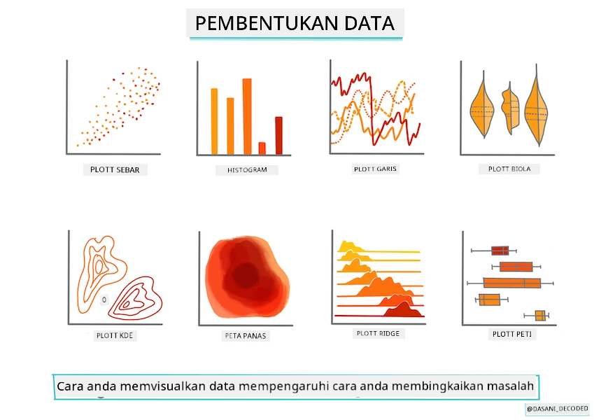
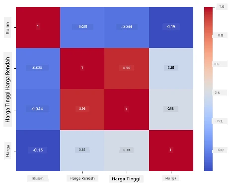

# Membina model regresi menggunakan Scikit-learn: menyediakan dan memvisualisasikan data



Infografik oleh [Dasani Madipalli](https://twitter.com/dasani_decoded)

## [Kuiz pra-ceramah](https://ff-quizzes.netlify.app/en/ml/)

> ### [Pengajaran ini tersedia dalam R!](../../../../2-Regression/2-Data/solution/R/lesson_2.html)

## Pengenalan

Sekarang bahawa anda telah menyediakan alat yang anda perlukan untuk mula menangani pembinaan model pembelajaran mesin dengan Scikit-learn, anda sudah bersedia untuk mula bertanya soalan tentang data anda. Semasa anda bekerja dengan data dan menggunakan penyelesaian ML, sangat penting untuk memahami cara bertanya soalan yang betul untuk membuka potensi dataset anda dengan betul.

Dalam pengajaran ini, anda akan belajar:

- Cara menyediakan data anda untuk pembinaan model.
- Cara menggunakan Matplotlib untuk visualisasi data.
- Cara menggunakan Seaborn untuk visualisasi data yang lebih ekspresif.

## Bertanya soalan yang betul mengenai data anda

Soalan yang anda perlukan untuk dijawab akan menentukan jenis algoritma ML yang akan anda gunakan. Dan kualiti jawapan yang anda terima akan sangat bergantung pada sifat data anda.

Lihat [data](https://github.com/microsoft/ML-For-Beginners/blob/main/2-Regression/data/US-pumpkins.csv) yang disediakan untuk pengajaran ini. Anda boleh membuka fail .csv ini dalam VS Code. Sekilas pandang segera menunjukkan terdapat ruang kosong dan campuran data rentetan dan berangka. Ada juga lajur aneh yang dipanggil 'Package' di mana datanya campuran antara 'sacks', 'bins' dan nilai lain. Malah, data itu agak berantakan.

[](https://youtu.be/5qGjczWTrDQ "ML untuk pemula - Cara Menganalisis dan Membersihkan Dataset")

> 🎥 Klik imej di atas untuk video pendek yang menunjukkan cara menyediakan data untuk pengajaran ini.

Hakikatnya, tidaklah biasa diberikan dataset yang sudah lengkap untuk terus digunakan membuat model ML dengan serta-merta. Dalam pengajaran ini, anda akan belajar cara menyediakan dataset mentah menggunakan perpustakaan Python standard. Anda juga akan belajar pelbagai teknik untuk memvisualisasikan data.

## Kajian kes: 'pasaran labu'

Dalam folder ini anda akan dapati fail .csv dalam folder root `data` yang dipanggil [US-pumpkins.csv](https://github.com/microsoft/ML-For-Beginners/blob/main/2-Regression/data/US-pumpkins.csv) yang mengandungi 1757 baris data tentang pasaran labu, diatur mengikut kumpulan mengikut bandar. Ini adalah data mentah yang diekstrak dari [Laporan Piawai Pasaran Terminal Tanaman Khas](https://www.marketnews.usda.gov/mnp/fv-report-config-step1?type=termPrice) yang diedarkan oleh Jabatan Pertanian Amerika Syarikat.

### Menyediakan data

Data ini adalah dalam domain awam. Ia boleh dimuat turun dalam banyak fail berasingan, mengikut bandar, dari laman web USDA. Untuk mengelakkan terlalu banyak fail berasingan, kami telah menggabungkan semua data bandar ke dalam satu helaian, jadi kami telah sedikit _menyediakan_ data itu. Seterusnya, mari kita lihat data dengan lebih dekat.

### Data labu - kesimpulan awal

Apa yang anda perhatikan tentang data ini? Anda sudah lihat bahawa terdapat campuran rentetan, nombor, ruang kosong dan nilai aneh yang perlu anda fahami.

Soalan apa yang boleh anda tanya mengenai data ini, menggunakan teknik Regresi? Bagaimana dengan "Ramalkan harga labu untuk dijual dalam bulan tertentu". Melihat semula data, ada beberapa perubahan yang anda perlu buat untuk mencipta struktur data yang diperlukan untuk tugasan ini.
## Latihan - analisis data labu

Mari gunakan [Pandas](https://pandas.pydata.org/), (nama bermaksud `Python Data Analysis`) alat yang sangat berguna untuk membentuk data, untuk menganalisis dan menyediakan data labu ini.

### Pertama, periksa tarikh yang hilang

Anda perlu mengambil langkah untuk memeriksa tarikh yang hilang:

1. Tukar tarikh kepada format bulan (ini adalah tarikh AS, jadi formatnya ialah `MM/DD/YYYY`).
2. Ekstrak bulan ke lajur baru.

Buka fail _notebook.ipynb_ dalam Visual Studio Code dan import helaian ke dalam dataframe Pandas baru.

1. Gunakan fungsi `head()` untuk melihat lima baris pertama.

    ```python
    import pandas as pd
    pumpkins = pd.read_csv('../data/US-pumpkins.csv')
    pumpkins.head()
    ```

    ✅ Fungsi apa yang akan anda gunakan untuk melihat lima baris terakhir?

1. Periksa jika ada data yang hilang dalam dataframe semasa:

    ```python
    pumpkins.isnull().sum()
    ```

    Ada data yang hilang, tetapi mungkin tidak menjadi masalah untuk tugasan ini.

1. Untuk memudahkan kerja dengan dataframe anda, pilih hanya lajur yang anda perlukan, menggunakan fungsi `loc` yang mengekstrak dari dataframe asal sekumpulan baris (parameter pertama) dan lajur (parameter kedua). Ungkapan `:` dalam kes ini bermaksud "semua baris".

    ```python
    columns_to_select = ['Package', 'Low Price', 'High Price', 'Date']
    pumpkins = pumpkins.loc[:, columns_to_select]
    ```

### Kedua, tentukan harga purata labu

Fikirkan bagaimana untuk menentukan harga purata labu dalam bulan tertentu. Lajur apa yang akan anda pilih untuk tugasan ini? Petunjuk: anda perlu 3 lajur.

Penyelesaian: ambil purata lajur `Low Price` dan `High Price` untuk mengisi lajur Harga yang baru, dan tukar lajur Tarikh supaya hanya menunjukkan bulan. Mujurlah, menurut pemeriksaan di atas, tiada data yang hilang untuk tarikh atau harga.

1. Untuk mengira purata, tambah kod berikut:

    ```python
    price = (pumpkins['Low Price'] + pumpkins['High Price']) / 2

    month = pd.DatetimeIndex(pumpkins['Date']).month

    ```

   ✅ Sila cetak apa-apa data yang anda ingin semak menggunakan `print(month)`.

2. Sekarang, salin data yang telah ditukar ke dataframe Pandas yang baru:

    ```python
    new_pumpkins = pd.DataFrame({'Month': month, 'Package': pumpkins['Package'], 'Low Price': pumpkins['Low Price'],'High Price': pumpkins['High Price'], 'Price': price})
    ```

    Mencetak dataframe anda akan menunjukkan dataset yang bersih dan kemas yang boleh anda bina model regresi baru.

### Tapi tunggu! Ada sesuatu yang pelik di sini

Jika anda lihat lajur `Package`, labu dijual dalam berbagai konfigurasi. Ada yang dijual dalam ukuran '1 1/9 bushel', ada yang '1/2 bushel', ada berdasarkan labu, ada pula berdasarkan paun, dan ada dalam kotak besar dengan lebar yang berbeza.

> Labu nampaknya sangat sukar untuk ditimbang secara konsisten

Menggali ke dalam data asal, menarik bahawa apa-apa dengan `Unit of Sale` sama dengan 'EACH' atau 'PER BIN' juga mempunyai jenis `Package` per inci, per bin, atau 'each'. Labu nampaknya sangat sukar ditimbang secara konsisten, jadi mari tapis mereka dengan memilih hanya labu dengan rentetan 'bushel' dalam lajur `Package`.

1. Tambah penapis di atas fail, di bawah import .csv yang awal:

    ```python
    pumpkins = pumpkins[pumpkins['Package'].str.contains('bushel', case=True, regex=True)]
    ```

    Jika anda cetak data sekarang, anda boleh lihat bahawa anda hanya mendapat sekitar 415 baris data yang mengandungi labu mengikut bushel.

### Tapi tunggu! Ada satu lagi perkara yang perlu dilakukan

Adakah anda perasan bahawa jumlah bushel berubah mengikut baris? Anda perlu menormalkan harga supaya anda menunjukkan harga per bushel, jadi buat sedikit pengiraan untuk menyesuaikan.

1. Tambah baris ini selepas blok yang mencipta dataframe new_pumpkins:

    ```python
    new_pumpkins.loc[new_pumpkins['Package'].str.contains('1 1/9'), 'Price'] = price/(1 + 1/9)

    new_pumpkins.loc[new_pumpkins['Package'].str.contains('1/2'), 'Price'] = price/(1/2)
    ```

✅ Menurut [The Spruce Eats](https://www.thespruceeats.com/how-much-is-a-bushel-1389308), berat bushel bergantung pada jenis hasil, kerana ia adalah ukuran isipadu. "Satu bushel tomato, contohnya, sepatutnya seberat 56 paun... Daun dan sayur hijau mengambil ruang lebih banyak dengan berat kurang, jadi satu bushel bayam hanya 20 paun." Ia agak rumit! Mari kita tidak fikirkan penukaran bushel ke paun, dan sebaliknya harga ikut bushel. Semua kajian tentang bushel labu ini menunjukkan betapa pentingnya faham sifat data anda!

Kini, anda boleh menganalisis harga per unit berdasarkan pengukuran bushel mereka. Jika anda cetak data sekali lagi, anda boleh nampak bagaimana ia dinormalisasikan.

✅ Adakah anda perhatikan bahawa labu yang dijual mengikut separuh bushel adalah sangat mahal? Bolehkah anda mengapa? Petunjuk: labu kecil jauh lebih mahal daripada yang besar, mungkin kerana ada lebih banyak bilangan labu kecil per bushel, memandangkan ruang yang tidak digunakan oleh satu labu pai berlubang yang besar.

## Strategi Visualisasi

Sebahagian daripada peranan saintis data adalah untuk menunjukkan kualiti dan sifat data yang mereka gunakan. Untuk melakukan ini, mereka sering menghasilkan visualisasi yang menarik, atau plot, graf, dan carta, yang menunjukkan aspek data yang berbeza. Dengan cara ini, mereka dapat menunjukkan secara visual hubungan dan jurang yang sukar ditemui dengan cara lain.

[](https://youtu.be/SbUkxH6IJo0 "ML untuk pemula - Cara Visualisasikan Data dengan Matplotlib")

> 🎥 Klik imej di atas untuk video pendek yang menunjukkan cara memvisualisasikan data untuk pengajaran ini.

Visualisasi juga boleh membantu menentukan teknik pembelajaran mesin yang paling sesuai untuk data. Sebuah scatterplot yang nampaknya mengikut sebuah garis, contohnya, menunjukkan bahawa data itu calon baik untuk latihan regresi linear.

Salah satu perpustakaan visualisasi data yang berfungsi baik dalam Jupyter notebooks adalah [Matplotlib](https://matplotlib.org/) (yang juga anda lihat dalam pengajaran sebelum ini).

> Dapatkan lebih banyak pengalaman dengan visualisasi data dalam [tutorial ini](https://docs.microsoft.com/learn/modules/explore-analyze-data-with-python?WT.mc_id=academic-77952-leestott).

## Latihan - cuba dengan Matplotlib

Cuba buat beberapa plot asas untuk memaparkan dataframe baru yang anda baru cipta. Apakah yang akan ditunjukkan oleh plot garis asas?

1. Import Matplotlib di bahagian atas fail, di bawah import Pandas:

    ```python
    import matplotlib.pyplot as plt
    ```

1. Jalankan semula keseluruhan notebook untuk memuat semula.
1. Di bawah notebook, tambah sel untuk plot data sebagai kotak:

    ```python
    price = new_pumpkins.Price
    month = new_pumpkins.Month
    plt.scatter(price, month)
    plt.show()
    ```

    

    Adakah ini plot yang berguna? Ada apa-apa yang mengejutkan anda?

    Ia tidak begitu berguna kerana ia hanya memaparkan data anda sebagai taburan titik dalam bulan tertentu.

### Jadikan ia berguna

Untuk mendapatkan carta yang memaparkan data berguna, anda biasanya perlu mengkelaskan data dengan cara tertentu. Mari cuba buat plot di mana paksi y menunjukkan bulan dan data menunjukkan taburan data.

1. Tambah sel untuk membuat carta bar berkumpulan:

    ```python
    new_pumpkins.groupby(['Month'])['Price'].mean().plot(kind='bar')
    plt.ylabel("Pumpkin Price")
    ```

    

    Ini adalah visualisasi data yang lebih berguna! Ia nampaknya menunjukkan harga tertinggi untuk labu berlaku pada bulan September dan Oktober. Adakah ini memenuhi jangkaan anda? Kenapa atau kenapa tidak?

## Latihan - cuba dengan Seaborn

Matplotlib amat berkuasa, tetapi ia boleh mengambil banyak kod untuk menghasilkan carta yang kemas. [Seaborn](https://seaborn.pydata.org/) adalah perpustakaan yang dibina _di atas_ Matplotlib dan direka untuk visualisasi data statistik. Ia berfungsi terus dengan dataframe Pandas, menggunakan gaya lalai yang menarik, dan membolehkan anda mencipta plot yang informatif dengan kod yang jauh lebih sedikit. Kerana Seaborn mengembalikan objek Matplotlib, anda masih boleh menggunakan segala yang anda sudah tahu tentang Matplotlib untuk melaras hasilnya.

> Jika anda belum memasang Seaborn, pasang ia dengan `pip install seaborn`.

1. Import Seaborn di atas notebook, di bawah import yang lain. Ia biasanya diimport sebagai `sns`:

    ```python
    import seaborn as sns
    ```

### Scatter plot untuk menunjukkan hubungan

Sebahagian besar meneroka data sebelum membina model adalah mencari _hubungan_ antara pembolehubah. [Scatter plot](https://en.wikipedia.org/wiki/Scatter_plot) adalah salah satu alat terbaik untuk ini: jika titik nampak mengikut garis, dua pembolehubah mungkin berkorelasi, yang merupakan tanda baik bahawa model regresi linear boleh berfungsi.

1. Buat semula scatter plot harga-ke-bulan tadi, kali ini menggunakan Seaborn [`relplot()`](https://seaborn.pydata.org/generated/seaborn.relplot.html) (plot hubungan), yang berfungsi terus dengan lajur dataframe anda:

    ```python
    sns.relplot(x="Price", y="Month", data=new_pumpkins)
    ```

    

    Perhatikan bagaimana anda serahkan _nama lajur_ dan dataframe, dan Seaborn menguruskan label paksi untuk anda.

2. Anda boleh bertukar kepada plot garis dengan menghantar `kind="line"`. Seaborn malah menggambar jalur berteduh yang menunjukkan interval keyakinan di sekitar garis:

    ```python
    sns.relplot(x="Price", y="Month", kind="line", data=new_pumpkins)
    ```

    

    Data ini agak bising, jadi plot garis bukanlah pilihan paling jelas di sini — tetapi ia menunjukkan betapa mudahnya menukar jenis carta dalam Seaborn.

### Carta bar untuk menunjukkan taburan


Sebelum ini anda mengelompokkan data secara manual untuk membuat carta bar dengan Matplotlib. Seaborn's [`catplot()`](https://seaborn.pydata.org/generated/seaborn.catplot.html) (grafik kategori) boleh melakukan pengelompokan dan agregasi untuk anda. Secara lalai `kind="bar"` menunjukkan purata setiap kategori bersama garisan hitam yang menunjukkan selang keyakinan.

1. Buat carta bar harga purata setiap bulan:

    ```python
    sns.catplot(x="Month", y="Price", data=new_pumpkins, kind="bar")
    ```

    

    Ini mengesahkan apa yang anda lihat dengan Matplotlib — harga memuncak sekitar September dan Oktober — tetapi Seaborn juga memvisualisasikan betapa banyak harga _bervariasi_ dalam setiap bulan.

### Heatmap untuk menunjukkan korelasi

Carta sebar membandingkan dua pemboleh ubah pada satu masa. Apabila anda mempunyai beberapa lajur berangka, [heatmap](https://en.wikipedia.org/wiki/Heat_map) membolehkan anda melihat kekuatan hubungan antara _setiap_ pasangan lajur pada satu masa. Ini adalah cara biasa untuk mengenal pasti ciri mana yang paling berkorelasi sebelum memilih apa yang hendak dimasukkan dalam model (dan jenis carta yang sama kemudiannya digunakan untuk memaparkan matriks kekeliruan dalam klasifikasi).

1. Bina matriks korelasi dengan Pandas, kemudian lukis dengan [`heatmap()`](https://seaborn.pydata.org/generated/seaborn.heatmap.html) Seaborn. Pilihan `annot=True` mencetak nilai korelasi pada setiap sel:

    ```python
    correlations = new_pumpkins[['Month', 'Low Price', 'High Price', 'Price']].corr()
    sns.heatmap(correlations, annot=True, cmap="coolwarm")
    ```

    

    Nilai yang hampir dengan `1` (atau `-1`) bermaksud lajur-lajur itu sangat berkorelasi _linear_. Perhatikan bagaimana `Low Price` dan `High Price` hampir berkorelasi sempurna. `Month`, sebaliknya, hanya menunjukkan korelasi linear lemah dengan harga — walaupun carta bar di atas menunjukkan puncak bermusim yang jelas pada bulan September dan Oktober. Itu adalah pengajaran penting: pekali korelasi hanya mengukur hubungan _garis lurus_, jadi ia boleh terlepas pola bermusim atau bukan linear. ✅ Kenapa berguna untuk melihat kedua-dua heatmap *dan* carta seperti carta bar sebelum memutuskan lajur mana yang hendak digunakan?

### Matplotlib atau Seaborn?

Kedua-dua perpustakaan adalah berbaloi untuk diketahui:

- **Matplotlib** memberi anda kawalan terperinci ke atas setiap elemen carta dan merupakan asas bagi hampir setiap perpustakaan plot Python lain.
- **Seaborn** menyediakan fungsi tahap tinggi dan tetapan menarik untuk carta statistik, berfungsi terus dengan dataframe, dan sering lebih cepat untuk analisis data eksploratori.

Aliran kerja biasa adalah menggunakan Seaborn untuk meneroka data dengan cepat, kemudian beralih ke Matplotlib apabila anda perlu mengubah suai butiran.

---

## 🚀Cabaran

Teroka pelbagai jenis visualisasi yang ditawarkan oleh Matplotlib dan Seaborn. Jenis manakah yang paling sesuai untuk masalah regresi?

## [Kuis pasca kuliah](https://ff-quizzes.netlify.app/en/ml/)

## Ulasan & Belajar Kendiri

Lihat pelbagai cara untuk memvisualisasikan data. Buat senarai perpustakaan yang ada dan catat yang mana paling sesuai untuk jenis tugas tertentu, contohnya visualisasi 2D berbanding visualisasi 3D. Apa yang anda temui?

## Tugasan

[Meneroka visualisasi](assignment.md)

---

<!-- CO-OP TRANSLATOR DISCLAIMER START -->
**Penafian**:
Dokumen ini telah diterjemahkan menggunakan perkhidmatan terjemahan AI [Co-op Translator](https://github.com/Azure/co-op-translator). Walaupun kami berusaha untuk ketepatan, sila ambil maklum bahawa terjemahan automatik mungkin mengandungi kesilapan atau ketidaktepatan. Dokumen asal dalam bahasa asalnya harus dianggap sebagai sumber yang sahih. Untuk maklumat penting, terjemahan oleh manusia profesional adalah disyorkan. Kami tidak bertanggungjawab terhadap sebarang salah faham atau salah tafsir yang timbul daripada penggunaan terjemahan ini.
<!-- CO-OP TRANSLATOR DISCLAIMER END -->