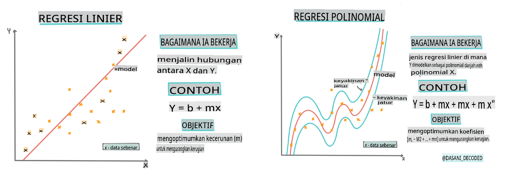
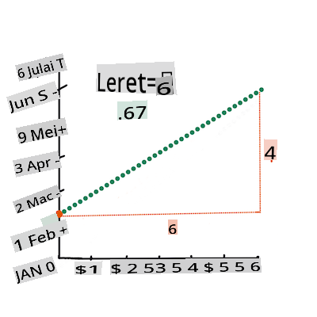

# Bina model regresi menggunakan Scikit-learn: regresi empat cara


> Infografik oleh [Dasani Madipalli](https://twitter.com/dasani_decoded)
## [Kuis pra-kuliah](https://gray-sand-07a10f403.1.azurestaticapps.net/quiz/13/)

> ### [Pelajaran ini tersedia dalam R!](../../../../2-Regression/3-Linear/solution/R/lesson_3.html)
### Pengenalan 

Sejauh ini, Anda telah menjelajahi apa itu regresi dengan data sampel yang dikumpulkan dari dataset harga labu yang akan kita gunakan sepanjang pelajaran ini. Anda juga telah memvisualisasikannya menggunakan Matplotlib.

Sekarang Anda siap untuk mendalami regresi untuk ML. Sementara visualisasi memungkinkan Anda memahami data, kekuatan sebenarnya dari Pembelajaran Mesin berasal dari _melatih model_. Model dilatih pada data historis untuk secara otomatis menangkap ketergantungan data, dan mereka memungkinkan Anda memprediksi hasil untuk data baru, yang belum pernah dilihat oleh model sebelumnya.

Dalam pelajaran ini, Anda akan mempelajari lebih lanjut tentang dua jenis regresi: _regresi linear dasar_ dan _regresi polinomial_, bersama dengan beberapa matematika yang mendasari teknik-teknik ini. Model-model tersebut akan memungkinkan kita memprediksi harga labu tergantung pada data input yang berbeda.

[](https://youtu.be/CRxFT8oTDMg "ML untuk pemula - Memahami Regresi Linear")

> 🎥 Klik gambar di atas untuk video singkat tentang regresi linear.

> Sepanjang kurikulum ini, kami mengasumsikan pengetahuan matematika minimal, dan berusaha membuatnya dapat diakses oleh siswa yang berasal dari bidang lain, jadi perhatikan catatan, 🧮 panggilan, diagram, dan alat bantu belajar lainnya untuk membantu pemahaman.

### Prasyarat

Anda seharusnya sudah familiar dengan struktur data labu yang kita periksa. Anda dapat menemukannya dimuat sebelumnya dan dibersihkan sebelumnya dalam file _notebook.ipynb_ pelajaran ini. Dalam file tersebut, harga labu ditampilkan per gantang dalam bingkai data baru. Pastikan Anda dapat menjalankan notebook ini dalam kernel di Visual Studio Code.

### Persiapan

Sebagai pengingat, Anda memuat data ini untuk menanyakan pertanyaan tentangnya. 

- Kapan waktu terbaik untuk membeli labu?
- Berapa harga yang bisa saya harapkan untuk satu kotak labu miniatur?
- Haruskah saya membelinya dalam keranjang setengah gantang atau dalam kotak 1 1/9 gantang?
Mari kita terus menggali data ini.

Dalam pelajaran sebelumnya, Anda membuat bingkai data Pandas dan mengisinya dengan bagian dari dataset asli, menstandarkan harga berdasarkan gantang. Dengan melakukan itu, Anda hanya bisa mengumpulkan sekitar 400 titik data dan hanya untuk bulan-bulan musim gugur.

Lihat data yang telah dimuat sebelumnya dalam notebook yang menyertai pelajaran ini. Data dimuat sebelumnya dan diagram pencar awal dibuat untuk menunjukkan data bulan. Mungkin kita bisa mendapatkan lebih banyak detail tentang sifat data dengan membersihkannya lebih lanjut.

## Garis regresi linear

Seperti yang Anda pelajari di Pelajaran 1, tujuan dari latihan regresi linear adalah untuk dapat memplot garis untuk:

- **Menunjukkan hubungan variabel**. Menunjukkan hubungan antara variabel
- **Membuat prediksi**. Membuat prediksi akurat tentang di mana titik data baru akan jatuh dalam hubungan dengan garis itu.
 
Biasanya **Regresi Kuadrat Terkecil** menggambar jenis garis ini. Istilah 'kuadrat terkecil' berarti semua titik data di sekitar garis regresi dikuadratkan dan kemudian dijumlahkan. Idealnya, jumlah akhir itu sekecil mungkin, karena kita menginginkan jumlah kesalahan yang rendah, atau `least-squares`. 

Kita melakukannya karena kita ingin memodelkan garis yang memiliki jarak kumulatif terkecil dari semua titik data kita. Kita juga mengkuadratkan istilah-istilah sebelum menjumlahkannya karena kita lebih peduli dengan besarnya daripada arahnya.

> **🧮 Tunjukkan matematika kepada saya** 
> 
> Garis ini, yang disebut _garis kecocokan terbaik_ dapat dinyatakan dengan [sebuah persamaan](https://en.wikipedia.org/wiki/Simple_linear_regression): 
> 
> ```
> Y = a + bX
> ```
>
> `X` is the 'explanatory variable'. `Y` is the 'dependent variable'. The slope of the line is `b` and `a` is the y-intercept, which refers to the value of `Y` when `X = 0`. 
>
>
>
> First, calculate the slope `b`. Infographic by [Jen Looper](https://twitter.com/jenlooper)
>
> In other words, and referring to our pumpkin data's original question: "predict the price of a pumpkin per bushel by month", `X` would refer to the price and `Y` would refer to the month of sale. 
>
>
>
> Calculate the value of Y. If you're paying around $4, it must be April! Infographic by [Jen Looper](https://twitter.com/jenlooper)
>
> The math that calculates the line must demonstrate the slope of the line, which is also dependent on the intercept, or where `Y` is situated when `X = 0`.
>
> You can observe the method of calculation for these values on the [Math is Fun](https://www.mathsisfun.com/data/least-squares-regression.html) web site. Also visit [this Least-squares calculator](https://www.mathsisfun.com/data/least-squares-calculator.html) to watch how the numbers' values impact the line.

## Correlation

One more term to understand is the **Correlation Coefficient** between given X and Y variables. Using a scatterplot, you can quickly visualize this coefficient. A plot with datapoints scattered in a neat line have high correlation, but a plot with datapoints scattered everywhere between X and Y have a low correlation.

A good linear regression model will be one that has a high (nearer to 1 than 0) Correlation Coefficient using the Least-Squares Regression method with a line of regression.

✅ Run the notebook accompanying this lesson and look at the Month to Price scatterplot. Does the data associating Month to Price for pumpkin sales seem to have high or low correlation, according to your visual interpretation of the scatterplot? Does that change if you use more fine-grained measure instead of `Month`, eg. *day of the year* (i.e. number of days since the beginning of the year)?

In the code below, we will assume that we have cleaned up the data, and obtained a data frame called `new_pumpkins`, similar to the following:

ID | Month | DayOfYear | Variety | City | Package | Low Price | High Price | Price
---|-------|-----------|---------|------|---------|-----------|------------|-------
70 | 9 | 267 | PIE TYPE | BALTIMORE | 1 1/9 bushel cartons | 15.0 | 15.0 | 13.636364
71 | 9 | 267 | PIE TYPE | BALTIMORE | 1 1/9 bushel cartons | 18.0 | 18.0 | 16.363636
72 | 10 | 274 | PIE TYPE | BALTIMORE | 1 1/9 bushel cartons | 18.0 | 18.0 | 16.363636
73 | 10 | 274 | PIE TYPE | BALTIMORE | 1 1/9 bushel cartons | 17.0 | 17.0 | 15.454545
74 | 10 | 281 | PIE TYPE | BALTIMORE | 1 1/9 bushel cartons | 15.0 | 15.0 | 13.636364

> The code to clean the data is available in [`notebook.ipynb`](../../../../2-Regression/3-Linear/notebook.ipynb). We have performed the same cleaning steps as in the previous lesson, and have calculated `DayOfYear` column menggunakan ekspresi berikut: 

```python
day_of_year = pd.to_datetime(pumpkins['Date']).apply(lambda dt: (dt-datetime(dt.year,1,1)).days)
```

Sekarang Anda memahami matematika di balik regresi linear, mari kita buat model Regresi untuk melihat apakah kita dapat memprediksi paket labu mana yang akan memiliki harga labu terbaik. Seseorang yang membeli labu untuk tambalan labu liburan mungkin menginginkan informasi ini untuk dapat mengoptimalkan pembelian paket labu untuk tambalan tersebut.

## Mencari Korelasi

[](https://youtu.be/uoRq-lW2eQo "ML untuk pemula - Mencari Korelasi: Kunci Regresi Linear")

> 🎥 Klik gambar di atas untuk video singkat tentang korelasi.

Dari pelajaran sebelumnya, Anda mungkin telah melihat bahwa harga rata-rata untuk bulan yang berbeda terlihat seperti ini:


Ini menunjukkan bahwa harus ada beberapa korelasi, dan kita dapat mencoba melatih model regresi linear untuk memprediksi hubungan antara `Month` and `Price`, or between `DayOfYear` and `Price`. Here is the scatter plot that shows the latter relationship:

 

Let's see if there is a correlation using the `corr` function:

```python
print(new_pumpkins['Month'].corr(new_pumpkins['Price']))
print(new_pumpkins['DayOfYear'].corr(new_pumpkins['Price']))
```

Sepertinya korelasinya cukup kecil, -0.15 oleh `Month` and -0.17 by the `DayOfMonth`, but there could be another important relationship. It looks like there are different clusters of prices corresponding to different pumpkin varieties. To confirm this hypothesis, let's plot each pumpkin category using a different color. By passing an `ax` parameter to the `scatter` plotting function kita bisa plot semua titik pada grafik yang sama:

```python
ax=None
colors = ['red','blue','green','yellow']
for i,var in enumerate(new_pumpkins['Variety'].unique()):
    df = new_pumpkins[new_pumpkins['Variety']==var]
    ax = df.plot.scatter('DayOfYear','Price',ax=ax,c=colors[i],label=var)
```

 

Penyelidikan kami menunjukkan bahwa variasi memiliki lebih banyak pengaruh pada harga keseluruhan daripada tanggal penjualan yang sebenarnya. Kita bisa melihat ini dengan diagram batang:

```python
new_pumpkins.groupby('Variety')['Price'].mean().plot(kind='bar')
```

 

Mari kita fokus untuk saat ini hanya pada satu variasi labu, 'jenis pai', dan lihat apa pengaruh tanggal terhadap harga:

```python
pie_pumpkins = new_pumpkins[new_pumpkins['Variety']=='PIE TYPE']
pie_pumpkins.plot.scatter('DayOfYear','Price') 
```
 

Jika kita sekarang menghitung korelasi antara `Price` and `DayOfYear` using `corr` function, we will get something like `-0.27` - yang berarti melatih model prediktif masuk akal.

> Sebelum melatih model regresi linear, penting untuk memastikan bahwa data kita bersih. Regresi linear tidak bekerja dengan baik dengan nilai yang hilang, sehingga masuk akal untuk menghapus semua sel kosong:

```python
pie_pumpkins.dropna(inplace=True)
pie_pumpkins.info()
```

Pendekatan lain adalah mengisi nilai kosong tersebut dengan nilai rata-rata dari kolom yang sesuai.

## Regresi Linear Sederhana

[](https://youtu.be/e4c_UP2fSjg "ML untuk pemula - Regresi Linear dan Polinomial menggunakan Scikit-learn")

> 🎥 Klik gambar di atas untuk video singkat tentang regresi linear dan polinomial.

Untuk melatih model Regresi Linear kita, kita akan menggunakan perpustakaan **Scikit-learn**.

```python
from sklearn.linear_model import LinearRegression
from sklearn.metrics import mean_squared_error
from sklearn.model_selection import train_test_split
```

Kita mulai dengan memisahkan nilai input (fitur) dan output yang diharapkan (label) menjadi array numpy terpisah:

```python
X = pie_pumpkins['DayOfYear'].to_numpy().reshape(-1,1)
y = pie_pumpkins['Price']
```

> Perhatikan bahwa kita harus melakukan `reshape` pada data input agar paket Regresi Linear memahaminya dengan benar. Regresi Linear mengharapkan array 2D sebagai input, di mana setiap baris dari array sesuai dengan vektor fitur input. Dalam kasus kita, karena kita hanya memiliki satu input - kita memerlukan array dengan bentuk N×1, di mana N adalah ukuran dataset.

Kemudian, kita perlu membagi data menjadi dataset pelatihan dan pengujian, sehingga kita dapat memvalidasi model kita setelah pelatihan:

```python
X_train, X_test, y_train, y_test = train_test_split(X, y, test_size=0.2, random_state=0)
```

Akhirnya, melatih model Regresi Linear yang sebenarnya hanya membutuhkan dua baris kode. Kita mendefinisikan `LinearRegression` object, and fit it to our data using the `fit` method:

```python
lin_reg = LinearRegression()
lin_reg.fit(X_train,y_train)
```

`LinearRegression` object after `fit`-ting contains all the coefficients of the regression, which can be accessed using `.coef_` property. In our case, there is just one coefficient, which should be around `-0.017`. It means that prices seem to drop a bit with time, but not too much, around 2 cents per day. We can also access the intersection point of the regression with Y-axis using `lin_reg.intercept_` - it will be around `21` dalam kasus kita, yang menunjukkan harga di awal tahun.

Untuk melihat seberapa akurat model kita, kita bisa memprediksi harga pada dataset pengujian, dan kemudian mengukur seberapa dekat prediksi kita dengan nilai yang diharapkan. Ini bisa dilakukan menggunakan metrik mean square error (MSE), yang merupakan rata-rata dari semua perbedaan kuadrat antara nilai yang diharapkan dan yang diprediksi.

```python
pred = lin_reg.predict(X_test)

mse = np.sqrt(mean_squared_error(y_test,pred))
print(f'Mean error: {mse:3.3} ({mse/np.mean(pred)*100:3.3}%)')
```

Kesalahan kita tampaknya sekitar 2 poin, yaitu ~17%. Tidak terlalu bagus. Indikator lain dari kualitas model adalah **koefisien determinasi**, yang dapat diperoleh seperti ini:

```python
score = lin_reg.score(X_train,y_train)
print('Model determination: ', score)
```
Jika nilainya 0, itu berarti model tidak memperhitungkan data input, dan bertindak sebagai *prediktor linear terburuk*, yang hanya merupakan nilai rata-rata dari hasil. Nilai 1 berarti kita dapat memprediksi semua output yang diharapkan dengan sempurna. Dalam kasus kita, koefisiennya sekitar 0.06, yang cukup rendah.

Kita juga bisa memplot data uji bersama dengan garis regresi untuk lebih melihat bagaimana regresi bekerja dalam kasus kita:

```python
plt.scatter(X_test,y_test)
plt.plot(X_test,pred)
```


## Regresi Polinomial

Jenis lain dari Regresi Linear adalah Regresi Polinomial. Sementara kadang-kadang ada hubungan linear antara variabel - semakin besar labu dalam volume, semakin tinggi harga - kadang-kadang hubungan ini tidak bisa diplot sebagai bidang atau garis lurus. 

✅ Berikut adalah [beberapa contoh lagi](https://online.stat.psu.edu/stat501/lesson/9/9.8) data yang bisa menggunakan Regresi Polinomial

Lihat lagi hubungan antara Tanggal dan Harga. Apakah diagram pencar ini tampak seperti harus dianalisis dengan garis lurus? Bukankah harga bisa berfluktuasi? Dalam hal ini, Anda bisa mencoba regresi polinomial.

✅ Polinomial adalah ekspresi matematika yang mungkin terdiri dari satu atau lebih variabel dan koefisien

Regresi polinomial menciptakan garis melengkung untuk lebih cocok dengan data non-linear. Dalam kasus kita, jika kita menyertakan variabel `DayOfYear` kuadrat ke dalam data input, kita harus bisa menyesuaikan data kita dengan kurva parabola, yang akan memiliki minimum pada titik tertentu dalam tahun tersebut.

Scikit-learn menyertakan [API pipeline](https://scikit-learn.org/stable/modules/generated/sklearn.pipeline.make_pipeline.html?highlight=pipeline#sklearn.pipeline.make_pipeline) yang membantu untuk menggabungkan langkah-langkah pemrosesan data yang berbeda bersama-sama. Sebuah **pipeline** adalah rantai **estimators**. Dalam kasus kita, kita akan membuat pipeline yang pertama menambahkan fitur polinomial ke model kita, dan kemudian melatih regresi:

```python
from sklearn.preprocessing import PolynomialFeatures
from sklearn.pipeline import make_pipeline

pipeline = make_pipeline(PolynomialFeatures(2), LinearRegression())

pipeline.fit(X_train,y_train)
```

Menggunakan `PolynomialFeatures(2)` means that we will include all second-degree polynomials from the input data. In our case it will just mean `DayOfYear`<sup>2</sup>, but given two input variables X and Y, this will add X<sup>2</sup>, XY and Y<sup>2</sup>. We may also use higher degree polynomials if we want.

Pipelines can be used in the same manner as the original `LinearRegression` object, i.e. we can `fit` the pipeline, and then use `predict` to get the prediction results. Here is the graph showing test data, and the approximation curve:


Using Polynomial Regression, we can get slightly lower MSE and higher determination, but not significantly. We need to take into account other features!

> You can see that the minimal pumpkin prices are observed somewhere around Halloween. How can you explain this? 

🎃 Congratulations, you just created a model that can help predict the price of pie pumpkins. You can probably repeat the same procedure for all pumpkin types, but that would be tedious. Let's learn now how to take pumpkin variety into account in our model!

## Categorical Features

In the ideal world, we want to be able to predict prices for different pumpkin varieties using the same model. However, the `Variety` column is somewhat different from columns like `Month`, because it contains non-numeric values. Such columns are called **categorical**.

[](https://youtu.be/DYGliioIAE0 "ML for beginners - Categorical Feature Predictions with Linear Regression")

> 🎥 Click the image above for a short video overview of using categorical features.

Here you can see how average price depends on variety:


To take variety into account, we first need to convert it to numeric form, or **encode** it. There are several way we can do it:

* Simple **numeric encoding** will build a table of different varieties, and then replace the variety name by an index in that table. This is not the best idea for linear regression, because linear regression takes the actual numeric value of the index, and adds it to the result, multiplying by some coefficient. In our case, the relationship between the index number and the price is clearly non-linear, even if we make sure that indices are ordered in some specific way.
* **One-hot encoding** will replace the `Variety` column by 4 different columns, one for each variety. Each column will contain `1` if the corresponding row is of a given variety, and `0` sebaliknya. Ini berarti akan ada empat koefisien dalam regresi linear, satu untuk setiap variasi labu, yang bertanggung jawab atas "harga awal" (atau lebih tepatnya "harga tambahan") untuk variasi tersebut.

Kode di bawah ini menunjukkan bagaimana kita bisa one-hot encode variasi:

```python
pd.get_dummies(new_pumpkins['Variety'])
```

 ID | FAIRYTALE | MINIATURE | MIXED HEIRLOOM VARIETIES | PIE TYPE
----|-----------|-----------|--------------------------|----------
70 | 0 | 0 | 0 | 1
71 | 0 | 0 | 0 | 1
... | ... | ... | ... | ...
1738 | 0 | 1 | 0 | 0
1739 | 0 | 1 | 0 | 0
1740 | 0 | 1 | 0 | 0
1741 | 0 | 1 | 0 | 0
1742 | 0 | 1 | 0 | 0

Untuk melatih regresi linear menggunakan variasi one-hot encoded sebagai input, kita hanya perlu menginisialisasi data `X` and `y` dengan benar:

```python
X = pd.get_dummies(new_pumpkins['Variety'])
y = new_pumpkins['Price']
```

Sisa kode sama seperti yang kita gunakan di atas untuk melatih Regresi Linear. Jika Anda mencobanya, Anda akan melihat bahwa mean squared error hampir sama, tetapi kita mendapatkan koefisien determinasi yang jauh lebih tinggi (~77%). Untuk mendapatkan prediksi yang lebih akurat, kita bisa mempertimbangkan lebih banyak fitur kategorikal, serta fitur numerik, seperti `Month` or `DayOfYear`. To get one large array of features, we can use `join`:

```python
X = pd.get_dummies(new_pumpkins['Variety']) \
        .join(new_pumpkins['Month']) \
        .join(pd.get_dummies(new_pumpkins['City'])) \
        .join(pd.get_dummies(new_pumpkins['Package']))
y = new_pumpkins['Price']
```

Di sini kita juga mempertimbangkan `City` and `Package` type, yang memberi kita MSE 2.84 (10%), dan determinasi 0.94!

## Menggabungkan semuanya

Untuk membuat model terbaik, kita bisa menggunakan data gabungan (satu-hot encoded categorical + numeric) dari contoh di atas bersama dengan Regresi Polinomial. Berikut adalah kode lengkapnya untuk kenyamanan Anda:

```python
# set up training data
X = pd.get_dummies(new_pumpkins['Variety']) \
        .join(new_pumpkins['Month']) \
        .join(pd.get_dummies(new_pumpkins['City'])) \
        .join(pd.get_dummies(new_pumpkins['Package']))
y = new_pumpkins['Price']

# make train-test split
X_train, X_test, y_train, y_test = train_test_split(X, y, test_size=0.2, random_state=0)

# setup and train the pipeline
pipeline = make_pipeline(PolynomialFeatures(2), LinearRegression())
pipeline.fit(X_train,y_train)

# predict results for test data
pred = pipeline.predict(X_test)

# calculate MSE and determination
mse = np.sqrt(mean_squared_error(y_test,pred))
print(f'Mean error: {mse:3.3} ({mse/np.mean(pred)*100:3.3}%)')

score = pipeline.score(X_train,y_train)
print('Model determination: ', score)
```

Ini harus memberi kita koefisien determinasi terbaik hampir 97%, dan MSE=2.23 (~8% kesalahan prediksi).

| Model | MSE | Determinasi |
|-------|-----|-------------|
| `DayOfYear` Linear | 2.77 (17.2%) | 0.07 |
| `DayOfYear` Polynomial | 2.73 (17.0%) | 0.08 |
| `Variety` Linear | 5.24 (19.7%) | 0.77 |
| Semua fitur Linear | 2.84 (10.5%) | 0.94 |
| Semua fitur Polinomial | 2.23 (8.25%) | 0.97 |

🏆 Kerja bagus! Anda membuat empat model Regresi dalam satu pelajaran, dan meningkatkan kualitas model hingga 97%. Di bagian akhir tentang Regresi, Anda akan belajar tentang Regresi Logistik untuk menentukan kategori.

---
## 🚀Tantangan

Uji beberapa variabel berbeda dalam notebook ini untuk melihat bagaimana korelasi sesuai dengan akurasi model.

## [Kuis pasca-kuliah](https://gray-sand-07a10f403.1.azurestaticapps.net/quiz/14/)

## Tinjauan & Studi Mandiri

Dalam pelajaran ini kita belajar tentang Regresi Linear. Ada jenis Regresi penting lainnya. Baca tentang teknik Stepwise, Ridge, Lasso, dan Elasticnet. Kursus yang bagus untuk belajar lebih lanjut adalah [Kursus Pembelajaran Statistik Stanford](https://online.stanford.edu/courses/sohs-ystatslearning-statistical-learning)

## Tugas 

[Membangun Model](assignment.md)

**Penafian**: 
Dokumen ini telah diterjemahkan menggunakan perkhidmatan terjemahan AI berasaskan mesin. Walaupun kami berusaha untuk ketepatan, sila maklum bahawa terjemahan automatik mungkin mengandungi kesilapan atau ketidaktepatan. Dokumen asal dalam bahasa asalnya harus dianggap sebagai sumber yang berwibawa. Untuk maklumat kritikal, terjemahan manusia profesional adalah disyorkan. Kami tidak bertanggungjawab atas sebarang salah faham atau salah tafsir yang timbul daripada penggunaan terjemahan ini.