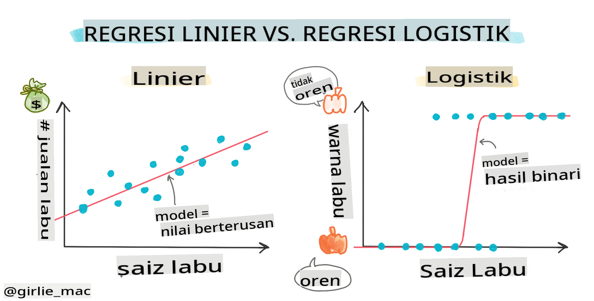
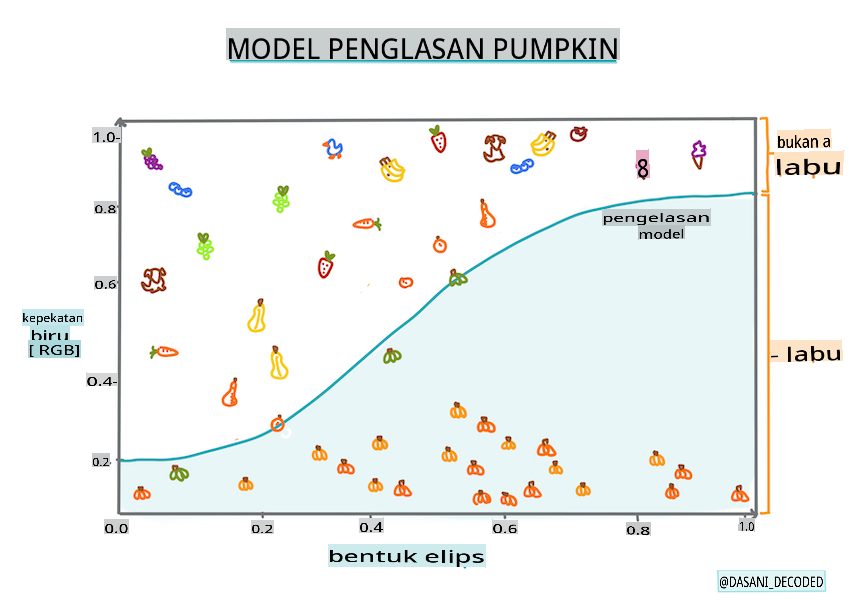
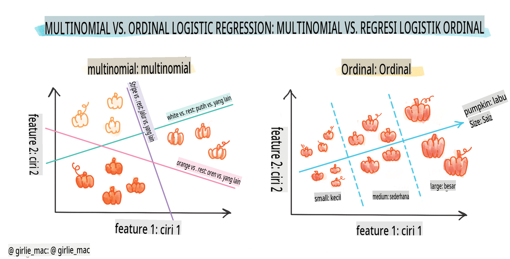
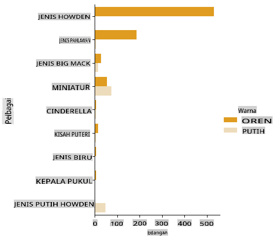
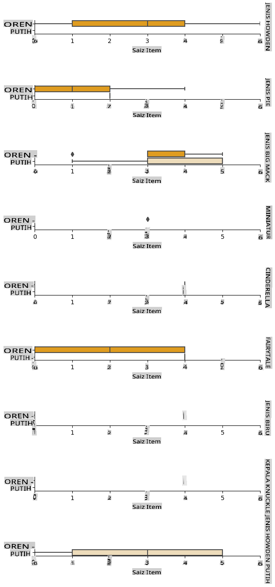
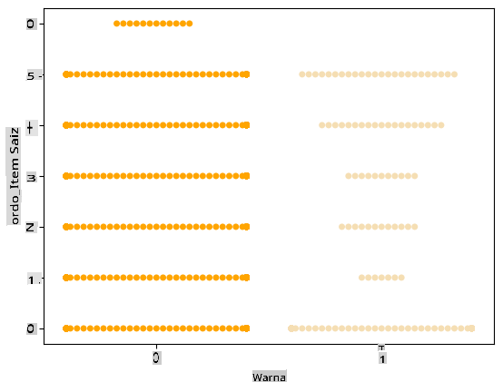
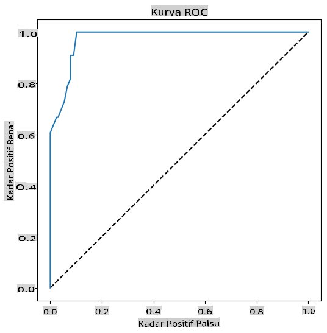

# Regresi Logistik untuk Meramal Kategori



## [Kuiz Pra-Kuliah](https://gray-sand-07a10f403.1.azurestaticapps.net/quiz/15/)

> ### [Pelajaran ini tersedia dalam R!](../../../../2-Regression/4-Logistic/solution/R/lesson_4.html)

## Pengenalan

Dalam pelajaran terakhir mengenai Regresi ini, salah satu teknik dasar _klasik_ ML, kita akan melihat Regresi Logistik. Anda akan menggunakan teknik ini untuk menemukan pola untuk meramal kategori biner. Apakah permen ini coklat atau tidak? Apakah penyakit ini menular atau tidak? Apakah pelanggan ini akan memilih produk ini atau tidak?

Dalam pelajaran ini, Anda akan belajar:

- Perpustakaan baru untuk visualisasi data
- Teknik untuk regresi logistik

✅ Perdalam pemahaman Anda tentang bekerja dengan jenis regresi ini di [modul Pembelajaran ini](https://docs.microsoft.com/learn/modules/train-evaluate-classification-models?WT.mc_id=academic-77952-leestott)

## Prasyarat

Setelah bekerja dengan data labu, kita sekarang cukup akrab untuk menyadari bahwa ada satu kategori biner yang bisa kita kerjakan: `Color`.

Mari kita bangun model regresi logistik untuk meramal bahwa, mengingat beberapa variabel, _warna apa yang kemungkinan besar dari labu yang diberikan_ (oranye 🎃 atau putih 👻).

> Mengapa kita membicarakan klasifikasi biner dalam pelajaran tentang regresi? Hanya untuk kenyamanan linguistik, karena regresi logistik adalah [sebenarnya metode klasifikasi](https://scikit-learn.org/stable/modules/linear_model.html#logistic-regression), meskipun berbasis linear. Pelajari cara lain untuk mengklasifikasikan data dalam kelompok pelajaran berikutnya.

## Definisikan pertanyaan

Untuk tujuan kita, kita akan menyatakannya sebagai biner: 'Putih' atau 'Tidak Putih'. Ada juga kategori 'bergaris' dalam dataset kita, tetapi ada sedikit contohnya, jadi kita tidak akan menggunakannya. Itu hilang setelah kita menghapus nilai null dari dataset, bagaimanapun juga.

> 🎃 Fakta menyenangkan, kadang-kadang kita menyebut labu putih sebagai 'labu hantu'. Mereka tidak mudah diukir, jadi mereka tidak sepopuler yang oranye tetapi mereka terlihat keren! Jadi kita juga bisa merumuskan ulang pertanyaan kita sebagai: 'Hantu' atau 'Bukan Hantu'. 👻

## Tentang regresi logistik

Regresi logistik berbeda dari regresi linear, yang telah Anda pelajari sebelumnya, dalam beberapa cara penting.

[](https://youtu.be/KpeCT6nEpBY "ML untuk pemula - Memahami Regresi Logistik untuk Klasifikasi Pembelajaran Mesin")

> 🎥 Klik gambar di atas untuk video singkat tentang regresi logistik.

### Klasifikasi biner

Regresi logistik tidak menawarkan fitur yang sama seperti regresi linear. Yang pertama menawarkan prediksi tentang kategori biner ("putih atau tidak putih") sedangkan yang terakhir mampu meramal nilai berkelanjutan, misalnya mengingat asal labu dan waktu panen, _berapa banyak harganya akan naik_.


> Infografik oleh [Dasani Madipalli](https://twitter.com/dasani_decoded)

### Klasifikasi lainnya

Ada jenis regresi logistik lainnya, termasuk multinomial dan ordinal:

- **Multinomial**, yang melibatkan lebih dari satu kategori - "Oranye, Putih, dan Bergaris".
- **Ordinal**, yang melibatkan kategori berurutan, berguna jika kita ingin mengurutkan hasil kita secara logis, seperti labu kita yang diurutkan berdasarkan sejumlah ukuran terbatas (mini,sm,med,lg,xl,xxl).



### Variabel TIDAK HARUS berkorelasi

Ingat bagaimana regresi linear bekerja lebih baik dengan lebih banyak variabel yang berkorelasi? Regresi logistik adalah kebalikannya - variabelnya tidak harus sejajar. Itu bekerja untuk data ini yang memiliki korelasi yang agak lemah.

### Anda memerlukan banyak data bersih

Regresi logistik akan memberikan hasil yang lebih akurat jika Anda menggunakan lebih banyak data; dataset kecil kita tidak optimal untuk tugas ini, jadi ingatlah hal itu.

[](https://youtu.be/B2X4H9vcXTs "ML untuk pemula - Analisis dan Persiapan Data untuk Regresi Logistik")

> 🎥 Klik gambar di atas untuk video singkat tentang persiapan data untuk regresi linear

✅ Pikirkan tentang jenis data yang cocok untuk regresi logistik

## Latihan - bersihkan data

Pertama, bersihkan data sedikit, hilangkan nilai null dan pilih hanya beberapa kolom:

1. Tambahkan kode berikut:

    ```python
  
    columns_to_select = ['City Name','Package','Variety', 'Origin','Item Size', 'Color']
    pumpkins = full_pumpkins.loc[:, columns_to_select]

    pumpkins.dropna(inplace=True)
    ```

    Anda selalu dapat melihat sekilas dataframe baru Anda:

    ```python
    pumpkins.info
    ```

### Visualisasi - plot kategori

Sekarang Anda telah memuat [notebook awal](../../../../2-Regression/4-Logistic/notebook.ipynb) dengan data labu sekali lagi dan membersihkannya sehingga menyimpan dataset yang berisi beberapa variabel, termasuk `Color`. Mari kita visualisasikan dataframe dalam notebook menggunakan perpustakaan yang berbeda: [Seaborn](https://seaborn.pydata.org/index.html), yang dibangun di atas Matplotlib yang kita gunakan sebelumnya.

Seaborn menawarkan beberapa cara menarik untuk memvisualisasikan data Anda. Misalnya, Anda dapat membandingkan distribusi data untuk setiap `Variety` dan `Color` dalam plot kategori.

1. Buat plot seperti itu dengan menggunakan `catplot` function, using our pumpkin data `pumpkins`, dan tentukan pemetaan warna untuk setiap kategori labu (oranye atau putih):

    ```python
    import seaborn as sns
    
    palette = {
    'ORANGE': 'orange',
    'WHITE': 'wheat',
    }

    sns.catplot(
    data=pumpkins, y="Variety", hue="Color", kind="count",
    palette=palette, 
    )
    ```

    

    Dengan mengamati data, Anda dapat melihat bagaimana data Warna berkaitan dengan Variety.

    ✅ Mengingat plot kategori ini, eksplorasi menarik apa yang bisa Anda bayangkan?

### Praproses data: pengkodean fitur dan label
Dataset labu kita mengandung nilai string untuk semua kolomnya. Bekerja dengan data kategori adalah intuitif bagi manusia tetapi tidak untuk mesin. Algoritma pembelajaran mesin bekerja dengan baik dengan angka. Itulah mengapa pengkodean adalah langkah yang sangat penting dalam fase praproses data, karena memungkinkan kita untuk mengubah data kategori menjadi data numerik, tanpa kehilangan informasi apa pun. Pengkodean yang baik mengarah pada pembangunan model yang baik.

Untuk pengkodean fitur ada dua jenis pengkode utama:

1. Pengkode ordinal: cocok untuk variabel ordinal, yang merupakan variabel kategori di mana datanya mengikuti urutan logis, seperti kolom `Item Size` dalam dataset kita. Ini membuat pemetaan sehingga setiap kategori diwakili oleh angka, yang merupakan urutan kategori dalam kolom.

    ```python
    from sklearn.preprocessing import OrdinalEncoder

    item_size_categories = [['sml', 'med', 'med-lge', 'lge', 'xlge', 'jbo', 'exjbo']]
    ordinal_features = ['Item Size']
    ordinal_encoder = OrdinalEncoder(categories=item_size_categories)
    ```

2. Pengkode kategori: cocok untuk variabel nominal, yang merupakan variabel kategori di mana datanya tidak mengikuti urutan logis, seperti semua fitur yang berbeda dari `Item Size` dalam dataset kita. Ini adalah pengkodean satu-hot, yang berarti bahwa setiap kategori diwakili oleh kolom biner: variabel yang dikodekan sama dengan 1 jika labu termasuk dalam Variety tersebut dan 0 sebaliknya.

    ```python
    from sklearn.preprocessing import OneHotEncoder

    categorical_features = ['City Name', 'Package', 'Variety', 'Origin']
    categorical_encoder = OneHotEncoder(sparse_output=False)
    ```
Kemudian, `ColumnTransformer` digunakan untuk menggabungkan beberapa pengkode ke dalam satu langkah dan menerapkannya ke kolom yang sesuai.

```python
    from sklearn.compose import ColumnTransformer
    
    ct = ColumnTransformer(transformers=[
        ('ord', ordinal_encoder, ordinal_features),
        ('cat', categorical_encoder, categorical_features)
        ])
    
    ct.set_output(transform='pandas')
    encoded_features = ct.fit_transform(pumpkins)
```
Di sisi lain, untuk mengkode label, kita menggunakan kelas `LabelEncoder` dari scikit-learn, yang merupakan kelas utilitas untuk membantu menormalkan label sehingga hanya berisi nilai antara 0 dan n_classes-1 (di sini, 0 dan 1).

```python
    from sklearn.preprocessing import LabelEncoder

    label_encoder = LabelEncoder()
    encoded_label = label_encoder.fit_transform(pumpkins['Color'])
```
Setelah kita mengkode fitur dan label, kita dapat menggabungkannya ke dalam dataframe baru `encoded_pumpkins`.

```python
    encoded_pumpkins = encoded_features.assign(Color=encoded_label)
```
✅ Apa keuntungan menggunakan pengkode ordinal untuk kolom `Item Size` column?

### Analyse relationships between variables

Now that we have pre-processed our data, we can analyse the relationships between the features and the label to grasp an idea of how well the model will be able to predict the label given the features.
The best way to perform this kind of analysis is plotting the data. We'll be using again the Seaborn `catplot` function, to visualize the relationships between `Item Size`,  `Variety` dan `Color` dalam plot kategori. Untuk lebih memplot data kita akan menggunakan kolom `Item Size` column and the unencoded `Variety` yang telah dikodekan.

```python
    palette = {
    'ORANGE': 'orange',
    'WHITE': 'wheat',
    }
    pumpkins['Item Size'] = encoded_pumpkins['ord__Item Size']

    g = sns.catplot(
        data=pumpkins,
        x="Item Size", y="Color", row='Variety',
        kind="box", orient="h",
        sharex=False, margin_titles=True,
        height=1.8, aspect=4, palette=palette,
    )
    g.set(xlabel="Item Size", ylabel="").set(xlim=(0,6))
    g.set_titles(row_template="{row_name}")
```


### Gunakan plot swarm

Karena Warna adalah kategori biner (Putih atau Tidak), itu memerlukan 'pendekatan [khusus](https://seaborn.pydata.org/tutorial/categorical.html?highlight=bar) untuk visualisasi'. Ada cara lain untuk memvisualisasikan hubungan kategori ini dengan variabel lainnya.

Anda dapat memvisualisasikan variabel berdampingan dengan plot Seaborn.

1. Coba plot 'swarm' untuk menunjukkan distribusi nilai:

    ```python
    palette = {
    0: 'orange',
    1: 'wheat'
    }
    sns.swarmplot(x="Color", y="ord__Item Size", data=encoded_pumpkins, palette=palette)
    ```

    

**Perhatikan**: kode di atas mungkin menghasilkan peringatan, karena seaborn gagal mewakili jumlah titik data tersebut dalam plot swarm. Solusi yang mungkin adalah mengurangi ukuran penanda, dengan menggunakan parameter 'size'. Namun, perlu diketahui bahwa ini memengaruhi keterbacaan plot.


> **🧮 Tunjukkan Matematika**
>
> Regresi logistik bergantung pada konsep 'maximum likelihood' menggunakan [fungsi sigmoid](https://wikipedia.org/wiki/Sigmoid_function). Fungsi 'Sigmoid' pada plot terlihat seperti bentuk 'S'. Ini mengambil nilai dan memetakannya ke antara 0 dan 1. Kurvanya juga disebut 'kurva logistik'. Rumusnya terlihat seperti ini:
>
> 
>
> di mana titik tengah sigmoid berada pada titik 0 dari x, L adalah nilai maksimum kurva, dan k adalah kemiringan kurva. Jika hasil fungsi lebih dari 0,5, label yang dimaksud akan diberi kelas '1' dari pilihan biner. Jika tidak, itu akan diklasifikasikan sebagai '0'.

## Bangun model Anda

Membangun model untuk menemukan klasifikasi biner ini ternyata cukup mudah di Scikit-learn.

[](https://youtu.be/MmZS2otPrQ8 "ML untuk pemula - Regresi Logistik untuk klasifikasi data")

> 🎥 Klik gambar di atas untuk video singkat tentang membangun model regresi linear

1. Pilih variabel yang ingin Anda gunakan dalam model klasifikasi Anda dan bagi set pelatihan dan pengujian dengan memanggil `train_test_split()`:

    ```python
    from sklearn.model_selection import train_test_split
    
    X = encoded_pumpkins[encoded_pumpkins.columns.difference(['Color'])]
    y = encoded_pumpkins['Color']

    X_train, X_test, y_train, y_test = train_test_split(X, y, test_size=0.2, random_state=0)
    
    ```

2. Sekarang Anda dapat melatih model Anda, dengan memanggil `fit()` dengan data pelatihan Anda, dan mencetak hasilnya:

    ```python
    from sklearn.metrics import f1_score, classification_report 
    from sklearn.linear_model import LogisticRegression

    model = LogisticRegression()
    model.fit(X_train, y_train)
    predictions = model.predict(X_test)

    print(classification_report(y_test, predictions))
    print('Predicted labels: ', predictions)
    print('F1-score: ', f1_score(y_test, predictions))
    ```

    Lihatlah papan skor model Anda. Tidak buruk, mengingat Anda hanya memiliki sekitar 1000 baris data:

    ```output
                       precision    recall  f1-score   support
    
                    0       0.94      0.98      0.96       166
                    1       0.85      0.67      0.75        33
    
        accuracy                                0.92       199
        macro avg           0.89      0.82      0.85       199
        weighted avg        0.92      0.92      0.92       199
    
        Predicted labels:  [0 0 0 0 0 0 0 0 0 0 0 0 0 0 0 0 0 0 0 0 1 0 0 1 0 0 0 0 0 0 0 0 1 0 0 0 0
        0 0 0 0 0 1 0 1 0 0 1 0 0 0 0 0 1 0 1 0 1 0 1 0 0 0 0 0 0 0 0 0 0 0 0 0 0
        1 0 0 0 0 0 0 0 1 0 0 0 0 0 0 0 1 0 0 0 0 0 0 0 0 1 0 1 0 0 0 0 0 0 0 1 0
        0 0 0 0 0 0 0 0 0 0 0 0 0 0 0 0 0 0 0 0 0 1 0 0 0 0 0 0 0 0 1 0 0 0 1 1 0
        0 0 0 0 1 0 0 0 0 0 1 0 0 0 0 0 0 0 0 0 0 0 0 0 0 0 0 0 0 0 0 0 0 0 0 0 1
        0 0 0 1 0 0 0 0 0 0 0 0 1 1]
        F1-score:  0.7457627118644068
    ```

## Pemahaman yang lebih baik melalui matriks kebingungan

Meskipun Anda bisa mendapatkan laporan papan skor [istilah](https://scikit-learn.org/stable/modules/generated/sklearn.metrics.classification_report.html?highlight=classification_report#sklearn.metrics.classification_report) dengan mencetak item di atas, Anda mungkin bisa memahami model Anda dengan lebih mudah dengan menggunakan [matriks kebingungan](https://scikit-learn.org/stable/modules/model_evaluation.html#confusion-matrix) untuk membantu kita memahami bagaimana model bekerja.

> 🎓 Sebuah '[matriks kebingungan](https://wikipedia.org/wiki/Confusion_matrix)' (atau 'matriks kesalahan') adalah tabel yang mengungkapkan positif dan negatif sejati vs. palsu dari model Anda, sehingga mengukur akurasi prediksi.

1. Untuk menggunakan metrik kebingungan, panggil `confusion_matrix()`:

    ```python
    from sklearn.metrics import confusion_matrix
    confusion_matrix(y_test, predictions)
    ```

    Lihatlah matriks kebingungan model Anda:

    ```output
    array([[162,   4],
           [ 11,  22]])
    ```

Di Scikit-learn, Baris (sumbu 0) matriks kebingungan adalah label sebenarnya dan kolom (sumbu 1) adalah label yang diprediksi.

|       |   0   |   1   |
| :---: | :---: | :---: |
|   0   |  TN   |  FP   |
|   1   |  FN   |  TP   |

Apa yang terjadi di sini? Katakanlah model kita diminta untuk mengklasifikasikan labu antara dua kategori biner, kategori 'putih' dan kategori 'tidak putih'.

- Jika model Anda memprediksi labu sebagai tidak putih dan itu benar-benar termasuk dalam kategori 'tidak putih' kita menyebutnya negatif benar, ditunjukkan oleh angka kiri atas.
- Jika model Anda memprediksi labu sebagai putih dan itu benar-benar termasuk dalam kategori 'tidak putih' kita menyebutnya negatif palsu, ditunjukkan oleh angka kiri bawah.
- Jika model Anda memprediksi labu sebagai tidak putih dan itu benar-benar termasuk dalam kategori 'putih' kita menyebutnya positif palsu, ditunjukkan oleh angka kanan atas.
- Jika model Anda memprediksi labu sebagai putih dan itu benar-benar termasuk dalam kategori 'putih' kita menyebutnya positif benar, ditunjukkan oleh angka kanan bawah.

Seperti yang mungkin Anda duga, lebih disukai memiliki jumlah positif benar dan negatif benar yang lebih besar dan jumlah positif palsu dan negatif palsu yang lebih rendah, yang menyiratkan bahwa model bekerja lebih baik.

Bagaimana matriks kebingungan berkaitan dengan presisi dan recall? Ingat, laporan klasifikasi yang dicetak di atas menunjukkan presisi (0.85) dan recall (0.67).

Presisi = tp / (tp + fp) = 22 / (22 + 4) = 0.8461538461538461

Recall = tp / (tp + fn) = 22 / (22 + 11) = 0.6666666666666666

✅ Q: Menurut matriks kebingungan, bagaimana kinerja model? A: Tidak buruk; ada banyak negatif benar tetapi juga beberapa negatif palsu.

Mari kita tinjau kembali istilah yang kita lihat sebelumnya dengan bantuan pemetaan TP/TN dan FP/FN dari matriks kebingungan:

🎓 Presisi: TP/(TP + FP) Fraksi instance relevan di antara instance yang diambil (misalnya label mana yang dilabeli dengan baik)

🎓 Recall: TP/(TP + FN) Fraksi instance relevan yang diambil, apakah dilabeli dengan baik atau tidak

🎓 f1-score: (2 * presisi * recall)/(presisi + recall) Rata-rata tertimbang dari presisi dan recall, dengan yang terbaik adalah 1 dan yang terburuk adalah 0

🎓 Dukungan: Jumlah kejadian dari setiap label yang diambil

🎓 Akurasi: (TP + TN)/(TP + TN + FP + FN) Persentase label yang diprediksi dengan akurat untuk sebuah sampel.

🎓 Rata-rata Makro: Perhitungan rata-rata metrik yang tidak berbobot untuk setiap label, tanpa memperhitungkan ketidakseimbangan label.

🎓 Rata-rata Tertimbang: Perhitungan rata-rata metrik untuk setiap label, dengan memperhitungkan ketidakseimbangan label dengan menimbangnya berdasarkan dukungan mereka (jumlah instance sebenarnya untuk setiap label).

✅ Bisakah Anda memikirkan metrik mana yang harus Anda perhatikan jika Anda ingin model Anda mengurangi jumlah negatif palsu?

## Visualisasikan kurva ROC dari model ini

[](https://youtu.be/GApO575jTA0 "ML untuk pemula - Menganalisis Kinerja Regresi Logistik dengan Kurva ROC")

> 🎥 Klik gambar di atas untuk video singkat tentang kurva ROC

Mari kita lakukan satu visualisasi lagi untuk melihat yang disebut 'kurva ROC':

```python
from sklearn.metrics import roc_curve, roc_auc_score
import matplotlib
import matplotlib.pyplot as plt
%matplotlib inline

y_scores = model.predict_proba(X_test)
fpr, tpr, thresholds = roc_curve(y_test, y_scores[:,1])

fig = plt.figure(figsize=(6, 6))
plt.plot([0, 1], [0, 1], 'k--')
plt.plot(fpr, tpr)
plt.xlabel('False Positive Rate')
plt.ylabel('True Positive Rate')
plt.title('ROC Curve')
plt.show()
```

Menggunakan Matplotlib, plot [Receiving Operating Characteristic](https://scikit-learn.org/stable/auto_examples/model_selection/plot_roc.html?highlight=roc) atau ROC dari model. Kurva ROC sering digunakan untuk mendapatkan pandangan tentang output dari sebuah classifier dalam hal positif benar vs. positif palsu. "Kurva ROC biasanya menampilkan true positive rate pada sumbu Y, dan false positive rate pada sumbu X." Dengan demikian, kemiringan kurva dan ruang antara garis tengah dan kurva penting: Anda ingin kurva yang cepat naik dan melewati garis. Dalam kasus kita, ada positif palsu untuk memulai, dan kemudian garis naik dan melewati dengan benar:



Akhirnya, gunakan [`API roc_auc_score` dari Scikit-learn](https://scikit-learn.org/stable/modules/generated/sklearn.metrics.roc_auc_score.html?highlight=roc_auc#sklearn.metrics.roc_auc_score) untuk menghitung 'Area Under the Curve' (AUC) yang sebenarnya:

```python
auc = roc_auc_score(y_test,y_scores[:,1])
print(auc)
```
Hasilnya adalah `0.9749908725812341`. Mengingat bahwa AUC berkisar dari 0 hingga 1, Anda menginginkan skor yang besar, karena model yang 100% benar dalam prediksinya akan memiliki AUC sebesar 1; dalam kasus ini, model _cukup bagus_. 

Dalam pelajaran klasifikasi di masa depan, Anda akan belajar cara mengulangi untuk meningkatkan skor model Anda. Tetapi untuk saat ini, selamat! Anda telah menyelesaikan pelajaran regresi ini!

---
## 🚀Tantangan

Masih banyak lagi yang bisa dibahas mengenai regresi logistik! Tapi cara terbaik untuk belajar adalah dengan bereksperimen. Temukan dataset yang cocok untuk analisis jenis ini dan bangun model dengannya. Apa yang Anda pelajari? tip: coba [Kaggle](https://www.kaggle.com/search?q=logistic+regression+datasets) untuk dataset yang menarik.

## [Kuiz Pasca-Kuliah](https://gray-sand-07a10f403.1.azurestaticapps.net/quiz/16/)

## T

**Penafian**:
Dokumen ini telah diterjemahkan menggunakan perkhidmatan terjemahan AI berasaskan mesin. Walaupun kami berusaha untuk ketepatan, sila ambil perhatian bahawa terjemahan automatik mungkin mengandungi kesilapan atau ketidaktepatan. Dokumen asal dalam bahasa asalnya harus dianggap sebagai sumber yang berwibawa. Untuk maklumat kritikal, terjemahan manusia profesional adalah disyorkan. Kami tidak bertanggungjawab atas sebarang salah faham atau salah tafsir yang timbul daripada penggunaan terjemahan ini.