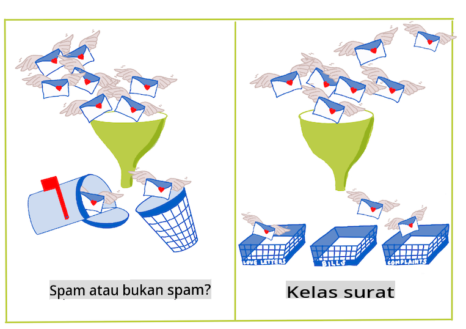
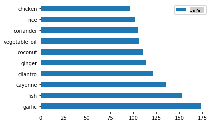
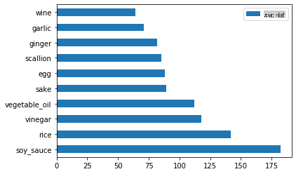
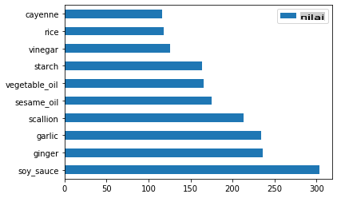
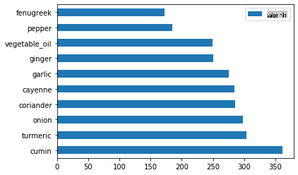
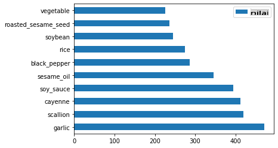

# Pengenalan kepada klasifikasi

Dalam empat pelajaran ini, anda akan meneroka fokus asas pembelajaran mesin klasik - _klasifikasi_. Kami akan melalui penggunaan pelbagai algoritma klasifikasi dengan set data tentang semua masakan hebat di Asia dan India. Harap anda lapar!


> Raikan masakan pan-Asia dalam pelajaran ini! Imej oleh [Jen Looper](https://twitter.com/jenlooper)

Klasifikasi adalah satu bentuk [pembelajaran berarah](https://wikipedia.org/wiki/Supervised_learning) yang banyak persamaannya dengan teknik regresi. Jika pembelajaran mesin adalah tentang meramal nilai atau nama kepada sesuatu dengan menggunakan set data, maka klasifikasi umumnya terbahagi kepada dua kumpulan: _klasifikasi binari_ dan _klasifikasi berbilang kelas_.

[](https://youtu.be/eg8DJYwdMyg "Pengenalan kepada klasifikasi")

Ingat:

- **Regresi linear** membantu anda meramal hubungan antara pembolehubah dan membuat ramalan tepat di mana titik data baru akan jatuh dalam hubungan dengan garis tersebut. Jadi, anda boleh meramal _berapa harga labu pada bulan September vs. Disember_, sebagai contoh.
- **Regresi logistik** membantu anda menemui "kategori binari": pada titik harga ini, _adakah labu ini oren atau tidak-oren_?

Klasifikasi menggunakan pelbagai algoritma untuk menentukan cara lain dalam menentukan label atau kelas sesuatu titik data. Mari kita bekerja dengan data masakan ini untuk melihat sama ada, dengan memerhatikan sekumpulan bahan, kita boleh menentukan asal usul masakannya.

## [Kuiz pra-ceramah](https://gray-sand-07a10f403.1.azurestaticapps.net/quiz/19/)

> ### [Pelajaran ini tersedia dalam R!](../../../../4-Classification/1-Introduction/solution/R/lesson_10.html)

### Pengenalan

Klasifikasi adalah salah satu aktiviti asas penyelidik pembelajaran mesin dan saintis data. Dari klasifikasi asas nilai binari ("adakah emel ini spam atau tidak?"), kepada klasifikasi dan segmentasi imej yang kompleks menggunakan visi komputer, adalah selalu berguna untuk dapat menyusun data ke dalam kelas dan bertanya soalan mengenainya.

Untuk menyatakan proses ini dengan cara yang lebih saintifik, kaedah klasifikasi anda mencipta model ramalan yang membolehkan anda memetakan hubungan antara pembolehubah input kepada pembolehubah output.



> Masalah binari vs. berbilang kelas untuk algoritma klasifikasi untuk diatasi. Infografik oleh [Jen Looper](https://twitter.com/jenlooper)

Sebelum memulakan proses membersihkan data, memvisualisasikannya, dan menyiapkannya untuk tugas ML kita, mari kita belajar sedikit tentang pelbagai cara pembelajaran mesin boleh digunakan untuk mengklasifikasikan data.

Diperoleh daripada [statistik](https://wikipedia.org/wiki/Statistical_classification), klasifikasi menggunakan pembelajaran mesin klasik menggunakan ciri-ciri, seperti `smoker`, `weight`, dan `age` untuk menentukan _kemungkinan mengembangkan penyakit X_. Sebagai teknik pembelajaran berarah yang serupa dengan latihan regresi yang anda lakukan sebelum ini, data anda dilabelkan dan algoritma ML menggunakan label tersebut untuk mengklasifikasikan dan meramal kelas (atau 'ciri-ciri') satu set data dan menetapkannya kepada satu kumpulan atau hasil.

✅ Luangkan masa sejenak untuk membayangkan set data tentang masakan. Apakah yang boleh dijawab oleh model berbilang kelas? Apakah yang boleh dijawab oleh model binari? Bagaimana jika anda ingin menentukan sama ada sesuatu masakan mungkin menggunakan fenugreek? Bagaimana jika anda ingin melihat jika, dengan pemberian beg runcit penuh dengan bunga lawang, artichoke, kembang kol, dan lobak pedas, anda boleh mencipta hidangan India yang tipikal?

[](https://youtu.be/GuTeDbaNoEU "Bakul misteri gila")

> 🎥 Klik imej di atas untuk video. Premis keseluruhan rancangan 'Chopped' adalah 'bakul misteri' di mana chef perlu membuat hidangan daripada pilihan bahan yang rawak. Pasti model ML akan membantu!

## Hello 'classifier'

Soalan yang ingin kita tanya tentang set data masakan ini sebenarnya adalah soalan **berbilang kelas**, kerana kita mempunyai beberapa masakan kebangsaan yang berpotensi untuk bekerja dengannya. Diberikan sekumpulan bahan, kelas manakah yang akan data ini sesuai?

Scikit-learn menawarkan beberapa algoritma yang berbeza untuk digunakan untuk mengklasifikasikan data, bergantung kepada jenis masalah yang anda ingin selesaikan. Dalam dua pelajaran seterusnya, anda akan belajar tentang beberapa algoritma ini.

## Latihan - bersihkan dan seimbangkan data anda

Tugas pertama yang perlu dilakukan, sebelum memulakan projek ini, adalah membersihkan dan **mengimbangkan** data anda untuk mendapatkan hasil yang lebih baik. Mulakan dengan fail _notebook.ipynb_ kosong di akar folder ini.

Perkara pertama yang perlu dipasang adalah [imblearn](https://imbalanced-learn.org/stable/). Ini adalah pakej Scikit-learn yang akan membolehkan anda mengimbangkan data dengan lebih baik (anda akan belajar lebih lanjut tentang tugas ini sebentar lagi).

1. Untuk memasang `imblearn`, jalankan `pip install`, seperti ini:

    ```python
    pip install imblearn
    ```

1. Import pakej yang anda perlukan untuk mengimport data anda dan memvisualisasikannya, juga import `SMOTE` dari `imblearn`.

    ```python
    import pandas as pd
    import matplotlib.pyplot as plt
    import matplotlib as mpl
    import numpy as np
    from imblearn.over_sampling import SMOTE
    ```

    Sekarang anda telah bersedia untuk membaca import data seterusnya.

1. Tugas seterusnya adalah untuk mengimport data:

    ```python
    df  = pd.read_csv('../data/cuisines.csv')
    ```

   Menggunakan `read_csv()` will read the content of the csv file _cusines.csv_ and place it in the variable `df`.

1. Semak bentuk data:

    ```python
    df.head()
    ```

   Lima baris pertama kelihatan seperti ini:

    ```output
    |     | Unnamed: 0 | cuisine | almond | angelica | anise | anise_seed | apple | apple_brandy | apricot | armagnac | ... | whiskey | white_bread | white_wine | whole_grain_wheat_flour | wine | wood | yam | yeast | yogurt | zucchini |
    | --- | ---------- | ------- | ------ | -------- | ----- | ---------- | ----- | ------------ | ------- | -------- | --- | ------- | ----------- | ---------- | ----------------------- | ---- | ---- | --- | ----- | ------ | -------- |
    | 0   | 65         | indian  | 0      | 0        | 0     | 0          | 0     | 0            | 0       | 0        | ... | 0       | 0           | 0          | 0                       | 0    | 0    | 0   | 0     | 0      | 0        |
    | 1   | 66         | indian  | 1      | 0        | 0     | 0          | 0     | 0            | 0       | 0        | ... | 0       | 0           | 0          | 0                       | 0    | 0    | 0   | 0     | 0      | 0        |
    | 2   | 67         | indian  | 0      | 0        | 0     | 0          | 0     | 0            | 0       | 0        | ... | 0       | 0           | 0          | 0                       | 0    | 0    | 0   | 0     | 0      | 0        |
    | 3   | 68         | indian  | 0      | 0        | 0     | 0          | 0     | 0            | 0       | 0        | ... | 0       | 0           | 0          | 0                       | 0    | 0    | 0   | 0     | 0      | 0        |
    | 4   | 69         | indian  | 0      | 0        | 0     | 0          | 0     | 0            | 0       | 0        | ... | 0       | 0           | 0          | 0                       | 0    | 0    | 0   | 0     | 1      | 0        |
    ```

1. Dapatkan maklumat tentang data ini dengan memanggil `info()`:

    ```python
    df.info()
    ```

    Output anda kelihatan seperti ini:

    ```output
    <class 'pandas.core.frame.DataFrame'>
    RangeIndex: 2448 entries, 0 to 2447
    Columns: 385 entries, Unnamed: 0 to zucchini
    dtypes: int64(384), object(1)
    memory usage: 7.2+ MB
    ```

## Latihan - belajar tentang masakan

Sekarang kerja mula menjadi lebih menarik. Mari kita temui pengedaran data, per masakan 

1. Plot data sebagai bar dengan memanggil `barh()`:

    ```python
    df.cuisine.value_counts().plot.barh()
    ```

    

    Terdapat bilangan masakan yang terhad, tetapi pengedaran data tidak sekata. Anda boleh membetulkannya! Sebelum berbuat demikian, teroka sedikit lagi. 

1. Ketahui berapa banyak data yang tersedia per masakan dan cetak:

    ```python
    thai_df = df[(df.cuisine == "thai")]
    japanese_df = df[(df.cuisine == "japanese")]
    chinese_df = df[(df.cuisine == "chinese")]
    indian_df = df[(df.cuisine == "indian")]
    korean_df = df[(df.cuisine == "korean")]
    
    print(f'thai df: {thai_df.shape}')
    print(f'japanese df: {japanese_df.shape}')
    print(f'chinese df: {chinese_df.shape}')
    print(f'indian df: {indian_df.shape}')
    print(f'korean df: {korean_df.shape}')
    ```

    output kelihatan seperti ini:

    ```output
    thai df: (289, 385)
    japanese df: (320, 385)
    chinese df: (442, 385)
    indian df: (598, 385)
    korean df: (799, 385)
    ```

## Menemui bahan-bahan

Sekarang anda boleh menggali lebih mendalam ke dalam data dan belajar apakah bahan-bahan tipikal per masakan. Anda harus membersihkan data berulang yang mencipta kekeliruan antara masakan, jadi mari kita belajar tentang masalah ini.

1. Cipta fungsi `create_ingredient()` dalam Python untuk mencipta dataframe bahan. Fungsi ini akan bermula dengan menjatuhkan lajur yang tidak berguna dan menyusun bahan mengikut kiraannya:

    ```python
    def create_ingredient_df(df):
        ingredient_df = df.T.drop(['cuisine','Unnamed: 0']).sum(axis=1).to_frame('value')
        ingredient_df = ingredient_df[(ingredient_df.T != 0).any()]
        ingredient_df = ingredient_df.sort_values(by='value', ascending=False,
        inplace=False)
        return ingredient_df
    ```

   Sekarang anda boleh menggunakan fungsi itu untuk mendapatkan idea tentang sepuluh bahan paling popular mengikut masakan.

1. Panggil `create_ingredient()` and plot it calling `barh()`:

    ```python
    thai_ingredient_df = create_ingredient_df(thai_df)
    thai_ingredient_df.head(10).plot.barh()
    ```

    

1. Lakukan perkara yang sama untuk data Jepun:

    ```python
    japanese_ingredient_df = create_ingredient_df(japanese_df)
    japanese_ingredient_df.head(10).plot.barh()
    ```

    

1. Sekarang untuk bahan-bahan Cina:

    ```python
    chinese_ingredient_df = create_ingredient_df(chinese_df)
    chinese_ingredient_df.head(10).plot.barh()
    ```

    

1. Plot bahan-bahan India:

    ```python
    indian_ingredient_df = create_ingredient_df(indian_df)
    indian_ingredient_df.head(10).plot.barh()
    ```

    

1. Akhir sekali, plot bahan-bahan Korea:

    ```python
    korean_ingredient_df = create_ingredient_df(korean_df)
    korean_ingredient_df.head(10).plot.barh()
    ```

    

1. Sekarang, jatuhkan bahan-bahan yang paling biasa yang mencipta kekeliruan antara masakan yang berbeza, dengan memanggil `drop()`: 

   Semua orang suka nasi, bawang putih dan halia!

    ```python
    feature_df= df.drop(['cuisine','Unnamed: 0','rice','garlic','ginger'], axis=1)
    labels_df = df.cuisine #.unique()
    feature_df.head()
    ```

## Imbangkan set data

Sekarang anda telah membersihkan data, gunakan [SMOTE](https://imbalanced-learn.org/dev/references/generated/imblearn.over_sampling.SMOTE.html) - "Teknik Over-sampling Minoriti Sintetik" - untuk mengimbangkannya.

1. Panggil `fit_resample()`, strategi ini menjana sampel baru dengan interpolasi.

    ```python
    oversample = SMOTE()
    transformed_feature_df, transformed_label_df = oversample.fit_resample(feature_df, labels_df)
    ```

    Dengan mengimbangkan data anda, anda akan mendapat hasil yang lebih baik apabila mengklasifikasikannya. Fikirkan tentang klasifikasi binari. Jika kebanyakan data anda adalah satu kelas, model ML akan meramalkan kelas itu dengan lebih kerap, hanya kerana terdapat lebih banyak data untuknya. Mengimbangkan data mengambil sebarang data yang tidak seimbang dan membantu menghilangkan ketidakseimbangan ini. 

1. Sekarang anda boleh menyemak bilangan label per bahan:

    ```python
    print(f'new label count: {transformed_label_df.value_counts()}')
    print(f'old label count: {df.cuisine.value_counts()}')
    ```

    Output anda kelihatan seperti ini:

    ```output
    new label count: korean      799
    chinese     799
    indian      799
    japanese    799
    thai        799
    Name: cuisine, dtype: int64
    old label count: korean      799
    indian      598
    chinese     442
    japanese    320
    thai        289
    Name: cuisine, dtype: int64
    ```

    Data ini kemas dan bersih, seimbang, dan sangat lazat! 

1. Langkah terakhir adalah menyimpan data yang seimbang, termasuk label dan ciri-ciri, ke dalam dataframe baru yang boleh dieksport ke dalam fail:

    ```python
    transformed_df = pd.concat([transformed_label_df,transformed_feature_df],axis=1, join='outer')
    ```

1. Anda boleh melihat data sekali lagi menggunakan `transformed_df.head()` and `transformed_df.info()`. Simpan salinan data ini untuk digunakan dalam pelajaran masa depan:

    ```python
    transformed_df.head()
    transformed_df.info()
    transformed_df.to_csv("../data/cleaned_cuisines.csv")
    ```

    CSV baru ini kini boleh didapati di folder data akar.

---

## 🚀Cabaran

Kurikulum ini mengandungi beberapa set data yang menarik. Gali melalui folder `data` dan lihat jika ada yang mengandungi set data yang sesuai untuk klasifikasi binari atau berbilang kelas? Apakah soalan yang akan anda tanya tentang set data ini?

## [Kuiz selepas ceramah](https://gray-sand-07a10f403.1.azurestaticapps.net/quiz/20/)

## Ulasan & Kajian Sendiri

Teroka API SMOTE. Apakah kes penggunaan yang terbaik digunakan? Apakah masalah yang diselesaikannya?

## Tugasan 

[Teroka kaedah klasifikasi](assignment.md)

**Penafian**:
Dokumen ini telah diterjemahkan menggunakan perkhidmatan terjemahan AI berasaskan mesin. Walaupun kami berusaha untuk ketepatan, sila maklum bahawa terjemahan automatik mungkin mengandungi kesilapan atau ketidaktepatan. Dokumen asal dalam bahasa asalnya harus dianggap sebagai sumber yang berwibawa. Untuk maklumat kritikal, terjemahan manusia profesional adalah disyorkan. Kami tidak bertanggungjawab atas sebarang salah faham atau salah tafsir yang timbul daripada penggunaan terjemahan ini.