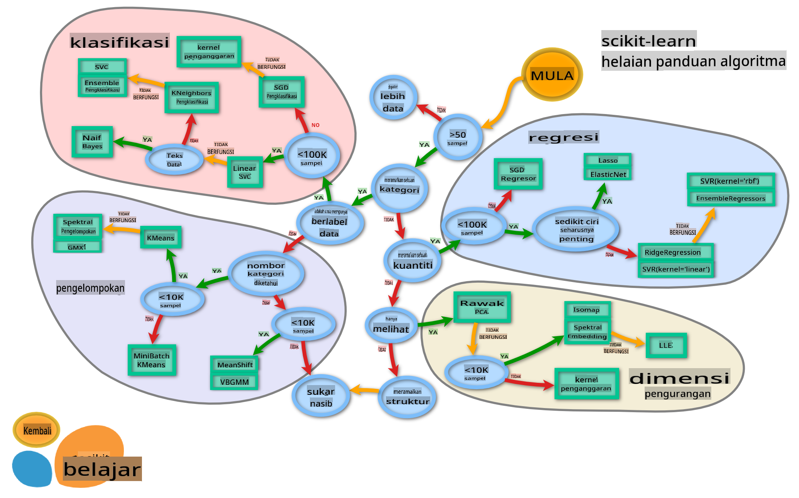

# Pengelasan Masakan 2

Dalam pelajaran pengelasan kedua ini, anda akan meneroka lebih banyak cara untuk mengelaskan data numerik. Anda juga akan belajar tentang kesan memilih satu pengelas berbanding yang lain.

## [Kuiz Pra-Kuliah](https://gray-sand-07a10f403.1.azurestaticapps.net/quiz/23/)

### Prasyarat

Kami menganggap bahawa anda telah menyelesaikan pelajaran sebelumnya dan mempunyai dataset yang dibersihkan dalam folder `data` anda yang dinamakan _cleaned_cuisines.csv_ di akar folder 4-pelajaran ini.

### Persiapan

Kami telah memuatkan fail _notebook.ipynb_ anda dengan dataset yang dibersihkan dan telah membahagikannya kepada dataframe X dan y, siap untuk proses pembinaan model.

## Peta pengelasan

Sebelumnya, anda telah belajar tentang pelbagai pilihan yang anda miliki ketika mengelaskan data menggunakan helaian cheat Microsoft. Scikit-learn menawarkan helaian cheat yang serupa tetapi lebih terperinci yang dapat membantu mempersempit pemilihan penganggar anda (istilah lain untuk pengelas):


> Tip: [kunjungi peta ini secara online](https://scikit-learn.org/stable/tutorial/machine_learning_map/) dan klik sepanjang jalan untuk membaca dokumentasi.

### Pelan

Peta ini sangat membantu apabila anda mempunyai pemahaman yang jelas tentang data anda, kerana anda boleh 'berjalan' sepanjang jalannya untuk membuat keputusan:

- Kami mempunyai >50 sampel
- Kami ingin meramalkan kategori
- Kami mempunyai data yang berlabel
- Kami mempunyai kurang dari 100K sampel
- ✨ Kami boleh memilih Linear SVC
- Jika itu tidak berfungsi, kerana kami mempunyai data numerik
    - Kami boleh mencuba ✨ KNeighbors Classifier 
      - Jika itu tidak berfungsi, cuba ✨ SVC dan ✨ Ensemble Classifiers

Ini adalah jalan yang sangat membantu untuk diikuti.

## Latihan - bahagikan data

Mengikuti jalan ini, kita harus memulakan dengan mengimport beberapa perpustakaan untuk digunakan.

1. Import perpustakaan yang diperlukan:

    ```python
    from sklearn.neighbors import KNeighborsClassifier
    from sklearn.linear_model import LogisticRegression
    from sklearn.svm import SVC
    from sklearn.ensemble import RandomForestClassifier, AdaBoostClassifier
    from sklearn.model_selection import train_test_split, cross_val_score
    from sklearn.metrics import accuracy_score,precision_score,confusion_matrix,classification_report, precision_recall_curve
    import numpy as np
    ```

1. Bahagikan data latihan dan ujian anda:

    ```python
    X_train, X_test, y_train, y_test = train_test_split(cuisines_feature_df, cuisines_label_df, test_size=0.3)
    ```

## Pengelas Linear SVC

Support-Vector clustering (SVC) adalah sebahagian daripada keluarga teknik ML Support-Vector machines (pelajari lebih lanjut mengenai ini di bawah). Dalam kaedah ini, anda boleh memilih 'kernel' untuk menentukan bagaimana mengelompokkan label. Parameter 'C' merujuk kepada 'regularization' yang mengatur pengaruh parameter. Kernel boleh menjadi salah satu dari [beberapa](https://scikit-learn.org/stable/modules/generated/sklearn.svm.SVC.html#sklearn.svm.SVC); di sini kita menetapkannya kepada 'linear' untuk memastikan kita memanfaatkan linear SVC. Kebarangkalian secara default adalah 'false'; di sini kita menetapkannya kepada 'true' untuk mengumpulkan anggaran kebarangkalian. Kami menetapkan keadaan rawak kepada '0' untuk mengocok data untuk mendapatkan kebarangkalian.

### Latihan - gunakan linear SVC

Mulakan dengan mencipta array pengelas. Anda akan menambah secara progresif ke dalam array ini semasa kita menguji. 

1. Mulakan dengan Linear SVC:

    ```python
    C = 10
    # Create different classifiers.
    classifiers = {
        'Linear SVC': SVC(kernel='linear', C=C, probability=True,random_state=0)
    }
    ```

2. Latih model anda menggunakan Linear SVC dan cetak laporan:

    ```python
    n_classifiers = len(classifiers)
    
    for index, (name, classifier) in enumerate(classifiers.items()):
        classifier.fit(X_train, np.ravel(y_train))
    
        y_pred = classifier.predict(X_test)
        accuracy = accuracy_score(y_test, y_pred)
        print("Accuracy (train) for %s: %0.1f%% " % (name, accuracy * 100))
        print(classification_report(y_test,y_pred))
    ```

    Hasilnya agak baik:

    ```output
    Accuracy (train) for Linear SVC: 78.6% 
                  precision    recall  f1-score   support
    
         chinese       0.71      0.67      0.69       242
          indian       0.88      0.86      0.87       234
        japanese       0.79      0.74      0.76       254
          korean       0.85      0.81      0.83       242
            thai       0.71      0.86      0.78       227
    
        accuracy                           0.79      1199
       macro avg       0.79      0.79      0.79      1199
    weighted avg       0.79      0.79      0.79      1199
    ```

## Pengelas K-Neighbors

K-Neighbors adalah sebahagian daripada keluarga kaedah ML "neighbors", yang boleh digunakan untuk pembelajaran yang diselia dan tidak diselia. Dalam kaedah ini, sejumlah titik yang telah ditetapkan dibuat dan data dikumpulkan di sekitar titik-titik ini supaya label yang digeneralisasi dapat diramalkan untuk data tersebut.

### Latihan - gunakan pengelas K-Neighbors

Pengelas sebelumnya bagus, dan berfungsi dengan baik dengan data, tetapi mungkin kita boleh mendapatkan ketepatan yang lebih baik. Cuba pengelas K-Neighbors.

1. Tambahkan satu baris ke array pengelas anda (tambahkan koma selepas item Linear SVC):

    ```python
    'KNN classifier': KNeighborsClassifier(C),
    ```

    Hasilnya sedikit lebih buruk:

    ```output
    Accuracy (train) for KNN classifier: 73.8% 
                  precision    recall  f1-score   support
    
         chinese       0.64      0.67      0.66       242
          indian       0.86      0.78      0.82       234
        japanese       0.66      0.83      0.74       254
          korean       0.94      0.58      0.72       242
            thai       0.71      0.82      0.76       227
    
        accuracy                           0.74      1199
       macro avg       0.76      0.74      0.74      1199
    weighted avg       0.76      0.74      0.74      1199
    ```

    ✅ Pelajari tentang [K-Neighbors](https://scikit-learn.org/stable/modules/neighbors.html#neighbors)

## Pengelas Support Vector

Pengelas Support-Vector adalah sebahagian daripada keluarga [Support-Vector Machine](https://wikipedia.org/wiki/Support-vector_machine) kaedah ML yang digunakan untuk tugas pengelasan dan regresi. SVMs "memetakan contoh latihan kepada titik di ruang" untuk memaksimumkan jarak antara dua kategori. Data seterusnya dipetakan ke dalam ruang ini supaya kategori mereka dapat diramalkan.

### Latihan - gunakan pengelas Support Vector

Mari cuba mendapatkan ketepatan yang sedikit lebih baik dengan pengelas Support Vector.

1. Tambahkan koma selepas item K-Neighbors, dan kemudian tambahkan baris ini:

    ```python
    'SVC': SVC(),
    ```

    Hasilnya sangat baik!

    ```output
    Accuracy (train) for SVC: 83.2% 
                  precision    recall  f1-score   support
    
         chinese       0.79      0.74      0.76       242
          indian       0.88      0.90      0.89       234
        japanese       0.87      0.81      0.84       254
          korean       0.91      0.82      0.86       242
            thai       0.74      0.90      0.81       227
    
        accuracy                           0.83      1199
       macro avg       0.84      0.83      0.83      1199
    weighted avg       0.84      0.83      0.83      1199
    ```

    ✅ Pelajari tentang [Support-Vectors](https://scikit-learn.org/stable/modules/svm.html#svm)

## Pengelas Ensemble

Mari ikuti jalan ini hingga ke akhir, walaupun ujian sebelumnya cukup baik. Mari cuba beberapa 'Pengelas Ensemble', khususnya Random Forest dan AdaBoost:

```python
  'RFST': RandomForestClassifier(n_estimators=100),
  'ADA': AdaBoostClassifier(n_estimators=100)
```

Hasilnya sangat baik, terutama untuk Random Forest:

```output
Accuracy (train) for RFST: 84.5% 
              precision    recall  f1-score   support

     chinese       0.80      0.77      0.78       242
      indian       0.89      0.92      0.90       234
    japanese       0.86      0.84      0.85       254
      korean       0.88      0.83      0.85       242
        thai       0.80      0.87      0.83       227

    accuracy                           0.84      1199
   macro avg       0.85      0.85      0.84      1199
weighted avg       0.85      0.84      0.84      1199

Accuracy (train) for ADA: 72.4% 
              precision    recall  f1-score   support

     chinese       0.64      0.49      0.56       242
      indian       0.91      0.83      0.87       234
    japanese       0.68      0.69      0.69       254
      korean       0.73      0.79      0.76       242
        thai       0.67      0.83      0.74       227

    accuracy                           0.72      1199
   macro avg       0.73      0.73      0.72      1199
weighted avg       0.73      0.72      0.72      1199
```

✅ Pelajari tentang [Pengelas Ensemble](https://scikit-learn.org/stable/modules/ensemble.html)

Kaedah Pembelajaran Mesin ini "menggabungkan ramalan beberapa penganggar asas" untuk meningkatkan kualiti model. Dalam contoh kita, kita menggunakan Random Trees dan AdaBoost. 

- [Random Forest](https://scikit-learn.org/stable/modules/ensemble.html#forest), kaedah purata, membina 'hutan' 'pokok keputusan' yang disuntik dengan kebetulan untuk mengelakkan overfitting. Parameter n_estimators ditetapkan kepada jumlah pokok.

- [AdaBoost](https://scikit-learn.org/stable/modules/generated/sklearn.ensemble.AdaBoostClassifier.html) memadankan pengelas ke dataset dan kemudian memadankan salinan pengelas tersebut ke dataset yang sama. Ia memberi tumpuan kepada berat item yang salah dikelaskan dan menyesuaikan padanan untuk pengelas seterusnya untuk membetulkan.

---

## 🚀Cabaran

Setiap teknik ini mempunyai sejumlah besar parameter yang boleh anda ubah. Kajilah parameter default masing-masing dan fikirkan apa yang akan berlaku jika parameter ini diubah untuk kualiti model.

## [Kuiz Pasca-Kuliah](https://gray-sand-07a10f403.1.azurestaticapps.net/quiz/24/)

## Ulasan & Kajian Sendiri

Terdapat banyak jargon dalam pelajaran ini, jadi luangkan masa sebentar untuk menyemak [senarai ini](https://docs.microsoft.com/dotnet/machine-learning/resources/glossary?WT.mc_id=academic-77952-leestott) istilah yang berguna!

## Tugasan 

[Parameter play](assignment.md)

**Penafian**:
Dokumen ini telah diterjemahkan menggunakan perkhidmatan terjemahan AI berasaskan mesin. Walaupun kami berusaha untuk ketepatan, sila ambil perhatian bahawa terjemahan automatik mungkin mengandungi kesilapan atau ketidaktepatan. Dokumen asal dalam bahasa asalnya harus dianggap sebagai sumber yang berwibawa. Untuk maklumat kritikal, terjemahan manusia profesional adalah disyorkan. Kami tidak bertanggungjawab atas sebarang salah faham atau salah tafsir yang timbul daripada penggunaan terjemahan ini.