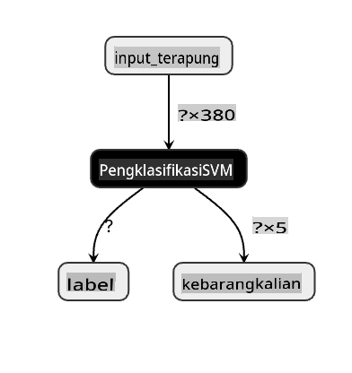
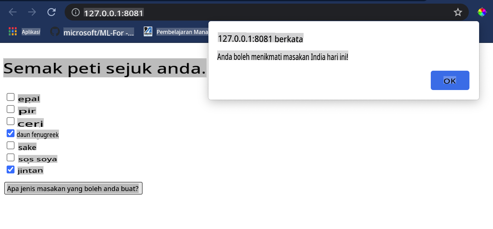

# Bina Aplikasi Web Pencadang Masakan

Dalam pelajaran ini, anda akan membina model klasifikasi menggunakan beberapa teknik yang telah anda pelajari dalam pelajaran sebelumnya dan dengan dataset masakan yang lazat yang digunakan sepanjang siri ini. Selain itu, anda akan membina aplikasi web kecil untuk menggunakan model yang disimpan, memanfaatkan runtime web Onnx.

Salah satu kegunaan praktikal pembelajaran mesin yang paling berguna adalah membina sistem cadangan, dan anda boleh mengambil langkah pertama ke arah itu hari ini!

[](https://youtu.be/17wdM9AHMfg "Applied ML")

> 🎥 Klik gambar di atas untuk video: Jen Looper membina aplikasi web menggunakan data masakan yang diklasifikasikan

## [Kuiz pra-kuliah](https://gray-sand-07a10f403.1.azurestaticapps.net/quiz/25/)

Dalam pelajaran ini, anda akan belajar:

- Cara membina model dan menyimpannya sebagai model Onnx
- Cara menggunakan Netron untuk memeriksa model
- Cara menggunakan model anda dalam aplikasi web untuk inferens

## Bina model anda

Membina sistem ML yang diterapkan adalah bahagian penting dalam memanfaatkan teknologi ini untuk sistem perniagaan anda. Anda boleh menggunakan model dalam aplikasi web anda (dan dengan itu menggunakannya dalam konteks luar talian jika diperlukan) dengan menggunakan Onnx.

Dalam [pelajaran sebelumnya](../../3-Web-App/1-Web-App/README.md), anda telah membina model Regresi tentang penampakan UFO, "dipickle" dan menggunakannya dalam aplikasi Flask. Walaupun seni bina ini sangat berguna untuk diketahui, ia adalah aplikasi Python full-stack, dan keperluan anda mungkin termasuk penggunaan aplikasi JavaScript.

Dalam pelajaran ini, anda boleh membina sistem asas berasaskan JavaScript untuk inferens. Pertama, bagaimanapun, anda perlu melatih model dan menukarnya untuk digunakan dengan Onnx.

## Latihan - latih model klasifikasi

Pertama, latih model klasifikasi menggunakan dataset masakan yang telah dibersihkan yang kita gunakan.

1. Mulakan dengan mengimport perpustakaan yang berguna:

    ```python
    !pip install skl2onnx
    import pandas as pd 
    ```

    Anda memerlukan '[skl2onnx](https://onnx.ai/sklearn-onnx/)' untuk membantu menukar model Scikit-learn anda kepada format Onnx.

1. Kemudian, bekerja dengan data anda dengan cara yang sama seperti yang anda lakukan dalam pelajaran sebelumnya, dengan membaca fail CSV menggunakan `read_csv()`:

    ```python
    data = pd.read_csv('../data/cleaned_cuisines.csv')
    data.head()
    ```

1. Keluarkan dua lajur pertama yang tidak diperlukan dan simpan data yang tinggal sebagai 'X':

    ```python
    X = data.iloc[:,2:]
    X.head()
    ```

1. Simpan label sebagai 'y':

    ```python
    y = data[['cuisine']]
    y.head()
    
    ```

### Mulakan rutin latihan

Kami akan menggunakan perpustakaan 'SVC' yang mempunyai ketepatan yang baik.

1. Import perpustakaan yang sesuai dari Scikit-learn:

    ```python
    from sklearn.model_selection import train_test_split
    from sklearn.svm import SVC
    from sklearn.model_selection import cross_val_score
    from sklearn.metrics import accuracy_score,precision_score,confusion_matrix,classification_report
    ```

1. Pisahkan set latihan dan ujian:

    ```python
    X_train, X_test, y_train, y_test = train_test_split(X,y,test_size=0.3)
    ```

1. Bina model Klasifikasi SVC seperti yang anda lakukan dalam pelajaran sebelumnya:

    ```python
    model = SVC(kernel='linear', C=10, probability=True,random_state=0)
    model.fit(X_train,y_train.values.ravel())
    ```

1. Sekarang, uji model anda, memanggil `predict()`:

    ```python
    y_pred = model.predict(X_test)
    ```

1. Cetak laporan klasifikasi untuk memeriksa kualiti model:

    ```python
    print(classification_report(y_test,y_pred))
    ```

    Seperti yang kita lihat sebelum ini, ketepatan adalah baik:

    ```output
                    precision    recall  f1-score   support
    
         chinese       0.72      0.69      0.70       257
          indian       0.91      0.87      0.89       243
        japanese       0.79      0.77      0.78       239
          korean       0.83      0.79      0.81       236
            thai       0.72      0.84      0.78       224
    
        accuracy                           0.79      1199
       macro avg       0.79      0.79      0.79      1199
    weighted avg       0.79      0.79      0.79      1199
    ```

### Tukar model anda kepada Onnx

Pastikan untuk melakukan penukaran dengan nombor Tensor yang betul. Dataset ini mempunyai 380 bahan yang disenaraikan, jadi anda perlu mencatatkan nombor itu dalam `FloatTensorType`:

1. Tukar menggunakan nombor tensor 380.

    ```python
    from skl2onnx import convert_sklearn
    from skl2onnx.common.data_types import FloatTensorType
    
    initial_type = [('float_input', FloatTensorType([None, 380]))]
    options = {id(model): {'nocl': True, 'zipmap': False}}
    ```

1. Buat onx dan simpan sebagai fail **model.onnx**:

    ```python
    onx = convert_sklearn(model, initial_types=initial_type, options=options)
    with open("./model.onnx", "wb") as f:
        f.write(onx.SerializeToString())
    ```

    > Perhatikan, anda boleh memasukkan [pilihan](https://onnx.ai/sklearn-onnx/parameterized.html) dalam skrip penukaran anda. Dalam kes ini, kami memasukkan 'nocl' untuk menjadi Benar dan 'zipmap' untuk menjadi Palsu. Oleh kerana ini adalah model klasifikasi, anda mempunyai pilihan untuk mengeluarkan ZipMap yang menghasilkan senarai kamus (tidak diperlukan). `nocl` refers to class information being included in the model. Reduce your model's size by setting `nocl` to 'True'. 

Running the entire notebook will now build an Onnx model and save it to this folder.

## View your model

Onnx models are not very visible in Visual Studio code, but there's a very good free software that many researchers use to visualize the model to ensure that it is properly built. Download [Netron](https://github.com/lutzroeder/Netron) and  open your model.onnx file. You can see your simple model visualized, with its 380 inputs and classifier listed:



Netron is a helpful tool to view your models.

Now you are ready to use this neat model in a web app. Let's build an app that will come in handy when you look in your refrigerator and try to figure out which combination of your leftover ingredients you can use to cook a given cuisine, as determined by your model.

## Build a recommender web application

You can use your model directly in a web app. This architecture also allows you to run it locally and even offline if needed. Start by creating an `index.html` file in the same folder where you stored your `model.onnx` fail.

1. Dalam fail ini _index.html_, tambahkan markup berikut:

    ```html
    <!DOCTYPE html>
    <html>
        <header>
            <title>Cuisine Matcher</title>
        </header>
        <body>
            ...
        </body>
    </html>
    ```

1. Sekarang, bekerja dalam tag `body`, tambahkan sedikit markup untuk menunjukkan senarai kotak semak yang mencerminkan beberapa bahan:

    ```html
    <h1>Check your refrigerator. What can you create?</h1>
            <div id="wrapper">
                <div class="boxCont">
                    <input type="checkbox" value="4" class="checkbox">
                    <label>apple</label>
                </div>
            
                <div class="boxCont">
                    <input type="checkbox" value="247" class="checkbox">
                    <label>pear</label>
                </div>
            
                <div class="boxCont">
                    <input type="checkbox" value="77" class="checkbox">
                    <label>cherry</label>
                </div>
    
                <div class="boxCont">
                    <input type="checkbox" value="126" class="checkbox">
                    <label>fenugreek</label>
                </div>
    
                <div class="boxCont">
                    <input type="checkbox" value="302" class="checkbox">
                    <label>sake</label>
                </div>
    
                <div class="boxCont">
                    <input type="checkbox" value="327" class="checkbox">
                    <label>soy sauce</label>
                </div>
    
                <div class="boxCont">
                    <input type="checkbox" value="112" class="checkbox">
                    <label>cumin</label>
                </div>
            </div>
            <div style="padding-top:10px">
                <button onClick="startInference()">What kind of cuisine can you make?</button>
            </div> 
    ```

    Perhatikan bahawa setiap kotak semak diberi nilai. Ini mencerminkan indeks di mana bahan itu ditemui mengikut dataset. Epal, sebagai contoh, dalam senarai abjad ini, menduduki lajur kelima, jadi nilainya adalah '4' kerana kita mula mengira pada 0. Anda boleh merujuk kepada [lembaran ramuan](../../../../4-Classification/data/ingredient_indexes.csv) untuk mengetahui indeks bahan tertentu.

    Meneruskan kerja anda dalam fail index.html, tambahkan blok skrip di mana model dipanggil selepas penutupan akhir `</div>`.

1. Pertama, import [Onnx Runtime](https://www.onnxruntime.ai/):

    ```html
    <script src="https://cdn.jsdelivr.net/npm/onnxruntime-web@1.9.0/dist/ort.min.js"></script> 
    ```

    > Onnx Runtime digunakan untuk membolehkan menjalankan model Onnx anda di pelbagai platform perkakasan, termasuk pengoptimuman dan API untuk digunakan.

1. Setelah Runtime ada, anda boleh memanggilnya:

    ```html
    <script>
        const ingredients = Array(380).fill(0);
        
        const checks = [...document.querySelectorAll('.checkbox')];
        
        checks.forEach(check => {
            check.addEventListener('change', function() {
                // toggle the state of the ingredient
                // based on the checkbox's value (1 or 0)
                ingredients[check.value] = check.checked ? 1 : 0;
            });
        });

        function testCheckboxes() {
            // validate if at least one checkbox is checked
            return checks.some(check => check.checked);
        }

        async function startInference() {

            let atLeastOneChecked = testCheckboxes()

            if (!atLeastOneChecked) {
                alert('Please select at least one ingredient.');
                return;
            }
            try {
                // create a new session and load the model.
                
                const session = await ort.InferenceSession.create('./model.onnx');

                const input = new ort.Tensor(new Float32Array(ingredients), [1, 380]);
                const feeds = { float_input: input };

                // feed inputs and run
                const results = await session.run(feeds);

                // read from results
                alert('You can enjoy ' + results.label.data[0] + ' cuisine today!')

            } catch (e) {
                console.log(`failed to inference ONNX model`);
                console.error(e);
            }
        }
               
    </script>
    ```

Dalam kod ini, terdapat beberapa perkara yang berlaku:

1. Anda mencipta array 380 nilai yang mungkin (1 atau 0) untuk ditetapkan dan dihantar ke model untuk inferens, bergantung pada sama ada kotak semak bahan dicentang.
2. Anda mencipta array kotak semak dan cara untuk menentukan sama ada mereka dicentang dalam `init` function that is called when the application starts. When a checkbox is checked, the `ingredients` array is altered to reflect the chosen ingredient.
3. You created a `testCheckboxes` function that checks whether any checkbox was checked.
4. You use `startInference` function when the button is pressed and, if any checkbox is checked, you start inference.
5. The inference routine includes:
   1. Setting up an asynchronous load of the model
   2. Creating a Tensor structure to send to the model
   3. Creating 'feeds' that reflects the `float_input` input that you created when training your model (you can use Netron to verify that name)
   4. Sending these 'feeds' to the model and waiting for a response

## Test your application

Open a terminal session in Visual Studio Code in the folder where your index.html file resides. Ensure that you have [http-server](https://www.npmjs.com/package/http-server) installed globally, and type `http-server` pada arahan. Sebuah localhost harus dibuka dan anda boleh melihat aplikasi web anda. Periksa apa masakan yang disarankan berdasarkan pelbagai bahan:



Tahniah, anda telah mencipta aplikasi web 'cadangan' dengan beberapa medan. Luangkan sedikit masa untuk membina sistem ini!
## 🚀Cabaran

Aplikasi web anda sangat minimal, jadi teruskan membina dengan menggunakan bahan dan indeks mereka dari data [ingredient_indexes](../../../../4-Classification/data/ingredient_indexes.csv). Kombinasi rasa apa yang berfungsi untuk mencipta hidangan kebangsaan tertentu?

## [Kuiz pasca-kuliah](https://gray-sand-07a10f403.1.azurestaticapps.net/quiz/26/)

## Ulasan & Kajian Kendiri

Walaupun pelajaran ini hanya menyentuh tentang kegunaan mencipta sistem cadangan untuk bahan makanan, kawasan aplikasi ML ini sangat kaya dengan contoh. Baca lebih lanjut tentang bagaimana sistem ini dibina:

- https://www.sciencedirect.com/topics/computer-science/recommendation-engine
- https://www.technologyreview.com/2014/08/25/171547/the-ultimate-challenge-for-recommendation-engines/
- https://www.technologyreview.com/2015/03/23/168831/everything-is-a-recommendation/

## Tugasan

[Bina cadangan baru](assignment.md)

**Penafian**: 
Dokumen ini telah diterjemahkan menggunakan perkhidmatan terjemahan AI berasaskan mesin. Walaupun kami berusaha untuk ketepatan, sila maklum bahawa terjemahan automatik mungkin mengandungi kesilapan atau ketidaktepatan. Dokumen asal dalam bahasa asalnya harus dianggap sebagai sumber berwibawa. Untuk maklumat penting, terjemahan manusia profesional disarankan. Kami tidak bertanggungjawab atas sebarang salah faham atau salah tafsir yang timbul daripada penggunaan terjemahan ini.