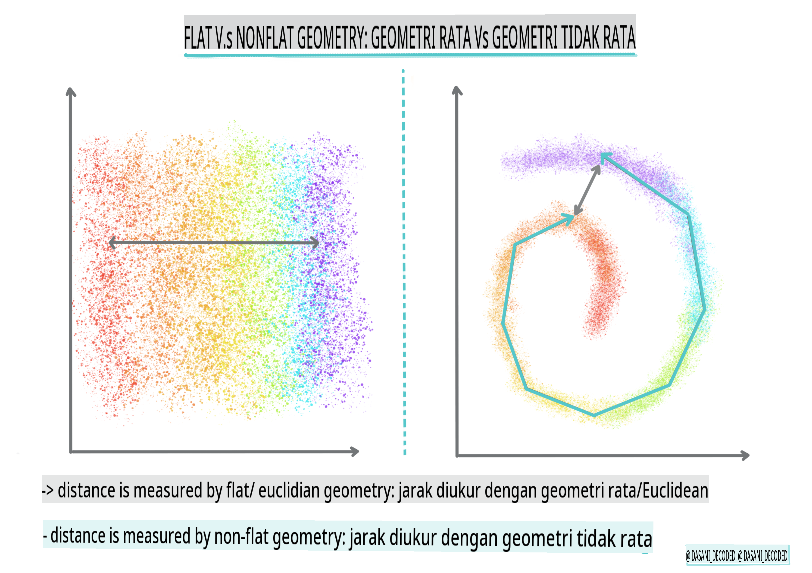
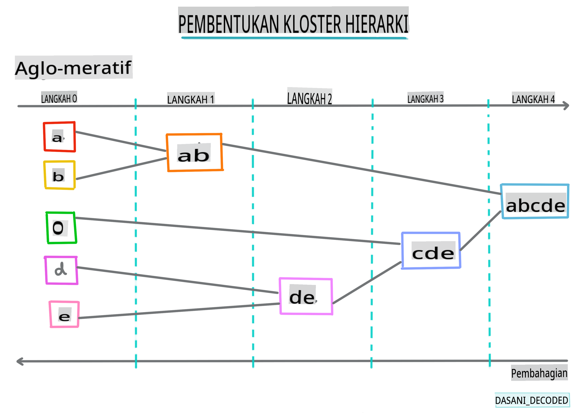
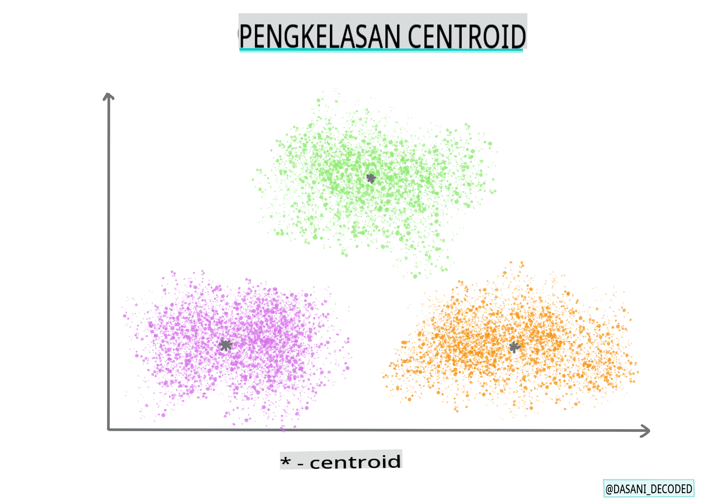

# Pengenalan kepada pengelompokan

Pegelompokan adalah sejenis [Pembelajaran Tanpa Pengawasan](https://wikipedia.org/wiki/Unsupervised_learning) yang menganggap bahawa satu set data tidak dilabel atau inputnya tidak dipadankan dengan output yang telah ditetapkan. Ia menggunakan pelbagai algoritma untuk menyusun data yang tidak dilabel dan menyediakan pengelompokan mengikut corak yang ditemui dalam data tersebut.

[](https://youtu.be/ty2advRiWJM "No One Like You oleh PSquare")

> 🎥 Klik gambar di atas untuk video. Semasa anda mempelajari pembelajaran mesin dengan pengelompokan, nikmati beberapa lagu Dance Hall Nigeria - ini adalah lagu yang sangat dihargai dari tahun 2014 oleh PSquare.
## [Kuiz sebelum kuliah](https://gray-sand-07a10f403.1.azurestaticapps.net/quiz/27/)
### Pengenalan

[Pegelompokan](https://link.springer.com/referenceworkentry/10.1007%2F978-0-387-30164-8_124) sangat berguna untuk penerokaan data. Mari kita lihat jika ia dapat membantu menemui tren dan corak dalam cara penonton Nigeria menikmati muzik.

✅ Luangkan masa sebentar untuk memikirkan kegunaan pengelompokan. Dalam kehidupan sebenar, pengelompokan berlaku setiap kali anda mempunyai timbunan pakaian dan perlu menyusun pakaian ahli keluarga anda 🧦👕👖🩲. Dalam sains data, pengelompokan berlaku apabila cuba menganalisis pilihan pengguna, atau menentukan ciri-ciri mana-mana set data yang tidak dilabel. Pengelompokan, dalam cara tertentu, membantu memahami kekacauan, seperti laci stokin.

[](https://youtu.be/esmzYhuFnds "Pengenalan kepada Pengelompokan")

> 🎥 Klik gambar di atas untuk video: John Guttag dari MIT memperkenalkan pengelompokan

Dalam suasana profesional, pengelompokan boleh digunakan untuk menentukan perkara seperti segmentasi pasaran, menentukan kumpulan umur yang membeli barangan tertentu, sebagai contoh. Kegunaan lain mungkin adalah pengesanan anomali, mungkin untuk mengesan penipuan daripada set data transaksi kad kredit. Atau anda mungkin menggunakan pengelompokan untuk menentukan tumor dalam sekumpulan imbasan perubatan.

✅ Fikir sebentar tentang bagaimana anda mungkin pernah menemui pengelompokan 'di alam liar', dalam perbankan, e-dagang, atau perniagaan.

> 🎓 Menariknya, analisis pengelompokan berasal dari bidang Antropologi dan Psikologi pada tahun 1930-an. Bolehkah anda bayangkan bagaimana ia mungkin digunakan?

Sebagai alternatif, anda boleh menggunakannya untuk mengelompokkan hasil carian - melalui pautan membeli-belah, imej, atau ulasan, sebagai contoh. Pengelompokan berguna apabila anda mempunyai set data yang besar yang anda ingin kurangkan dan di mana anda ingin melakukan analisis yang lebih terperinci, jadi teknik ini boleh digunakan untuk mempelajari tentang data sebelum model lain dibina.

✅ Setelah data anda disusun dalam kelompok, anda memberikan Id kelompok kepadanya, dan teknik ini boleh berguna apabila mengekalkan privasi set data; anda boleh merujuk kepada titik data dengan id kelompoknya, dan bukannya dengan data yang lebih mendedahkan. Bolehkah anda memikirkan sebab-sebab lain mengapa anda akan merujuk kepada Id kelompok dan bukannya elemen lain dalam kelompok untuk mengenalpastinya?

Mendalami pemahaman anda tentang teknik pengelompokan dalam [modul Pembelajaran](https://docs.microsoft.com/learn/modules/train-evaluate-cluster-models?WT.mc_id=academic-77952-leestott) ini.
## Bermula dengan pengelompokan

[Scikit-learn menawarkan pelbagai kaedah](https://scikit-learn.org/stable/modules/clustering.html) untuk melaksanakan pengelompokan. Jenis yang anda pilih akan bergantung pada kes penggunaan anda. Menurut dokumentasi, setiap kaedah mempunyai pelbagai manfaat. Berikut adalah jadual ringkas kaedah yang disokong oleh Scikit-learn dan kes penggunaan yang sesuai:

| Nama kaedah                  | Kes penggunaan                                                               |
| :--------------------------- | :--------------------------------------------------------------------- |
| K-Means                      | tujuan umum, induktif                                             |
| Penyebaran afiniti           | banyak, kelompok tidak sekata, induktif                                       |
| Mean-shift                   | banyak, kelompok tidak sekata, induktif                                       |
| Pengelompokan spektral       | beberapa, kelompok sekata, transduktif                                       |
| Pengelompokan hierarki Ward  | banyak, kelompok terhad, transduktif                               |
| Pengelompokan aglomeratif    | banyak, terhad, jarak bukan Euclidean, transduktif               |
| DBSCAN                       | geometri bukan rata, kelompok tidak sekata, transduktif                       |
| OPTICS                       | geometri bukan rata, kelompok tidak sekata dengan ketumpatan berubah, transduktif |
| Campuran Gaussian            | geometri rata, induktif                                               |
| BIRCH                        | set data besar dengan outlier, induktif                                 |

> 🎓 Bagaimana kita mencipta kelompok banyak bergantung pada bagaimana kita mengumpulkan titik data ke dalam kumpulan. Mari kita huraikan beberapa istilah:
>
> 🎓 ['Transduktif' vs. 'induktif'](https://wikipedia.org/wiki/Transduction_(machine_learning))
> 
> Inferens transduktif diperoleh daripada kes latihan yang diperhatikan yang memetakan kepada kes ujian tertentu. Inferens induktif diperoleh daripada kes latihan yang memetakan kepada peraturan umum yang hanya kemudian digunakan pada kes ujian.
> 
> Contoh: Bayangkan anda mempunyai set data yang hanya dilabel sebahagiannya. Beberapa perkara adalah 'rekod', beberapa 'cd', dan beberapa kosong. Tugas anda adalah menyediakan label untuk yang kosong. Jika anda memilih pendekatan induktif, anda akan melatih model yang mencari 'rekod' dan 'cd', dan menggunakan label tersebut pada data yang tidak dilabel. Pendekatan ini akan menghadapi kesukaran untuk mengklasifikasikan perkara yang sebenarnya 'kaset'. Pendekatan transduktif, sebaliknya, menangani data yang tidak diketahui ini dengan lebih berkesan kerana ia berusaha untuk mengelompokkan item yang serupa bersama-sama dan kemudian memberikan label kepada kumpulan. Dalam kes ini, kelompok mungkin mencerminkan 'perkara muzik bulat' dan 'perkara muzik segi empat'.
> 
> 🎓 ['Geometri bukan rata' vs. 'rata'](https://datascience.stackexchange.com/questions/52260/terminology-flat-geometry-in-the-context-of-clustering)
> 
> Berasal daripada istilah matematik, geometri bukan rata vs. rata merujuk kepada ukuran jarak antara titik dengan kaedah geometri 'rata' ([Euclidean](https://wikipedia.org/wiki/Euclidean_geometry)) atau 'bukan rata' (bukan Euclidean).
>
>'Rata' dalam konteks ini merujuk kepada geometri Euclidean (sebahagian daripadanya diajar sebagai geometri 'pesawat'), dan bukan rata merujuk kepada geometri bukan Euclidean. Apa kaitannya geometri dengan pembelajaran mesin? Nah, sebagai dua bidang yang berakar pada matematik, mesti ada cara umum untuk mengukur jarak antara titik dalam kelompok, dan itu boleh dilakukan dengan cara 'rata' atau 'bukan rata', bergantung pada sifat data. [Jarak Euclidean](https://wikipedia.org/wiki/Euclidean_distance) diukur sebagai panjang segmen garis antara dua titik. [Jarak bukan Euclidean](https://wikipedia.org/wiki/Non-Euclidean_geometry) diukur sepanjang lengkung. Jika data anda, divisualisasikan, kelihatan tidak wujud pada satah, anda mungkin perlu menggunakan algoritma khusus untuk menanganinya.
>

> Infografik oleh [Dasani Madipalli](https://twitter.com/dasani_decoded)
> 
> 🎓 ['Jarak'](https://web.stanford.edu/class/cs345a/slides/12-clustering.pdf)
> 
> Kelompok ditakrifkan oleh matriks jaraknya, contohnya jarak antara titik. Jarak ini boleh diukur dalam beberapa cara. Kelompok Euclidean ditakrifkan oleh purata nilai titik, dan mengandungi 'centroid' atau titik pusat. Jarak diukur dengan jarak ke centroid tersebut. Jarak bukan Euclidean merujuk kepada 'clustroids', titik terdekat dengan titik lain. Clustroids seterusnya boleh ditakrifkan dalam pelbagai cara.
> 
> 🎓 ['Terhad'](https://wikipedia.org/wiki/Constrained_clustering)
> 
> [Pengelompokan Terhad](https://web.cs.ucdavis.edu/~davidson/Publications/ICDMTutorial.pdf) memperkenalkan pembelajaran 'semi-supervised' ke dalam kaedah tanpa pengawasan ini. Hubungan antara titik ditandakan sebagai 'tidak boleh paut' atau 'mesti paut' jadi beberapa peraturan dipaksa ke atas set data.
>
>Contoh: Jika algoritma dilepaskan pada sekumpulan data yang tidak dilabel atau separa dilabel, kelompok yang dihasilkan mungkin berkualiti rendah. Dalam contoh di atas, kelompok mungkin mengelompokkan 'perkara muzik bulat' dan 'perkara muzik segi empat' dan 'perkara segi tiga' dan 'biskut'. Jika diberikan beberapa kekangan, atau peraturan untuk diikuti ("item mesti diperbuat daripada plastik", "item perlu dapat menghasilkan muzik") ini boleh membantu 'mengekang' algoritma untuk membuat pilihan yang lebih baik.
> 
> 🎓 'Ketumpatan'
> 
> Data yang 'berisik' dianggap 'padat'. Jarak antara titik dalam setiap kelompoknya mungkin terbukti, apabila diperiksa, lebih atau kurang padat, atau 'sesak' dan oleh itu data ini perlu dianalisis dengan kaedah pengelompokan yang sesuai. [Artikel ini](https://www.kdnuggets.com/2020/02/understanding-density-based-clustering.html) menunjukkan perbezaan antara menggunakan pengelompokan K-Means vs. algoritma HDBSCAN untuk meneroka set data yang berisik dengan ketumpatan kelompok yang tidak sekata.

## Algoritma pengelompokan

Terdapat lebih 100 algoritma pengelompokan, dan penggunaannya bergantung pada sifat data yang ada. Mari kita bincangkan beberapa yang utama:

- **Pengelompokan hierarki**. Jika objek diklasifikasikan mengikut jaraknya dengan objek berdekatan, dan bukan dengan yang lebih jauh, kelompok dibentuk berdasarkan jarak anggotanya dengan objek lain. Pengelompokan aglomeratif Scikit-learn adalah hierarki.

   
   > Infografik oleh [Dasani Madipalli](https://twitter.com/dasani_decoded)

- **Pengelompokan centroid**. Algoritma popular ini memerlukan pilihan 'k', atau bilangan kelompok untuk dibentuk, selepas itu algoritma menentukan titik pusat kelompok dan mengumpulkan data di sekitar titik tersebut. [Pengelompokan K-means](https://wikipedia.org/wiki/K-means_clustering) adalah versi pengelompokan centroid yang popular. Pusatnya ditentukan oleh min terdekat, oleh itu namanya. Jarak kuasa dua dari kelompok diminimumkan.

   
   > Infografik oleh [Dasani Madipalli](https://twitter.com/dasani_decoded)

- **Pengelompokan berasaskan pengedaran**. Berdasarkan pemodelan statistik, pengelompokan berasaskan pengedaran berpusat pada menentukan kebarangkalian bahawa titik data tergolong dalam kelompok, dan menugaskannya dengan sewajarnya. Kaedah campuran Gaussian tergolong dalam jenis ini.

- **Pengelompokan berasaskan ketumpatan**. Titik data ditugaskan kepada kelompok berdasarkan ketumpatannya, atau pengelompokan di sekitar satu sama lain. Titik data yang jauh dari kumpulan dianggap sebagai outlier atau bunyi. DBSCAN, Mean-shift dan OPTICS tergolong dalam jenis pengelompokan ini.

- **Pengelompokan berasaskan grid**. Untuk set data berbilang dimensi, grid dicipta dan data dibahagikan di antara sel grid, dengan itu mencipta kelompok.

## Latihan - mengelompokkan data anda

Pengelompokan sebagai teknik sangat dibantu oleh visualisasi yang betul, jadi mari kita mulakan dengan memvisualisasikan data muzik kita. Latihan ini akan membantu kita memutuskan kaedah pengelompokan yang paling berkesan untuk digunakan berdasarkan sifat data ini.

1. Buka fail [_notebook.ipynb_](https://github.com/microsoft/ML-For-Beginners/blob/main/5-Clustering/1-Visualize/notebook.ipynb) dalam folder ini.

1. Import pakej `Seaborn` untuk visualisasi data yang baik.

    ```python
    !pip install seaborn
    ```

1. Lampirkan data lagu dari [_nigerian-songs.csv_](https://github.com/microsoft/ML-For-Beginners/blob/main/5-Clustering/data/nigerian-songs.csv). Muatkan dataframe dengan beberapa data tentang lagu-lagu tersebut. Bersedia untuk meneroka data ini dengan mengimport perpustakaan dan mengeluarkan data:

    ```python
    import matplotlib.pyplot as plt
    import pandas as pd
    
    df = pd.read_csv("../data/nigerian-songs.csv")
    df.head()
    ```

    Semak beberapa baris pertama data:

    |     | nama                     | album                        | artis              | genre_teratas_artis | tarikh_keluar | panjang | populariti | kebolehdansaan | keakustikan | tenaga | keinstrumentalan | kesegaran | kelantangan | keceritaan | tempo   | tanda_waktu |
    | --- | ------------------------ | ---------------------------- | ------------------- | ---------------- | ------------ | ------ | ---------- | ------------ | ------------ | ------ | ---------------- | -------- | -------- | ----------- | ------- | -------------- |
    | 0   | Sparky                   | Mandy & The Jungle           | Cruel Santino       | r&b alternatif  | 2019         | 144000 | 48         | 0.666        | 0.851        | 0.42   | 0.534            | 0.11     | -6.699   | 0.0829      | 133.015 | 5              |
    | 1   | shuga rush               | EVERYTHING YOU HEARD IS TRUE | Odunsi (The Engine) | afropop          | 2020         | 89488  | 30         | 0.71         | 0.0822       | 0.683  | 0.000169         | 0.101    | -5.64    | 0.36        | 129.993 | 3              |
    | 2   | LITT!                    | LITT!                        | AYLØ                | indie r&b        | 2018         | 207758 | 40         | 0.836        | 0.272        | 0.564  | 0.000537         | 0.11     | -7.127   | 0.0424      | 130.005 | 4              |
    | 3   | Confident / Feeling Cool | Enjoy Your Life              | Lady Donli          | pop Nigeria     | 2019         | 175135 | 14         | 0.894        | 0.798        | 0.611  | 0.000187         | 0.0964   | -4.961   | 0.113       | 111.087 | 4              |
    | 4   | wanted you               | rare.                        | Odunsi (The Engine) | afropop          | 2018         | 152049 | 25         | 0.702        | 0.116        | 0.833  | 0.91             | 0.348    | -6.044   | 0.0447      | 105.115 | 4              |

1. Dapatkan beberapa maklumat tentang dataframe, dengan memanggil `info()`:

    ```python
    df.info()
    ```

   Outputnya kelihatan seperti ini:

    ```output
    <class 'pandas.core.frame.DataFrame'>
    RangeIndex: 530 entries, 0 to 529
    Data columns (total 16 columns):
     #   Column            Non-Null Count  Dtype  
    ---  ------            --------------  -----  
     0   name              530 non-null    object 
     1   album             530 non-null    object 
     2   artist            530 non-null    object 
     3   artist_top_genre  530 non-null    object 
     4   release_date      530 non-null    int64  
     5   length            530 non-null    int64  
     6   popularity        530 non-null    int64  
     7   danceability      530 non-null    float64
     8   acousticness      530 non-null    float64
     9   energy            530 non-null    float64
     10  instrumentalness  530 non-null    float64
     11  liveness          530 non-null    float64
     12  loudness          530 non-null    float64
     13  speechiness       530 non-null    float64
     14  tempo             530 non-null    float64
     15  time_signature    530 non-null    int64  
    dtypes: float64(8), int64(4), object(4)
    memory usage: 66.4+ KB
    ```

1. Periksa semula untuk nilai null, dengan memanggil `isnull()` dan mengesahkan jumlahnya adalah 0:

    ```python
    df.isnull().sum()
    ```

    Kelihatan baik:

    ```output
    name                0
    album               0
    artist              0
    artist_top_genre    0
    release_date        0
    length              0
    popularity          0
    danceability        0
    acousticness        0
    energy              0
    instrumentalness    0
    liveness            0
    loudness            0
    speechiness         0
    tempo               0
    time_signature      0
    dtype: int64
    ```

1. Huraikan data:

    ```python
    df.describe()
    ```

    |       | tarikh_keluar | panjang      | populariti | kebolehdansaan | keakustikan | tenaga   | keinstrumentalan | kesegaran | kelantangan  | keceritaan | tempo      | tanda_waktu |
    | ----- | ------------ | ----------- | ---------- | ------------ | ------------ | -------- | ---------------- | -------- | --------- | ----------- | ---------- | -------------- |
    | count | 530          | 530         | 530        | 530          | 530          | 530      | 530              | 530      | 530       | 530         | 530        | 530            |
    | mean  | 2015.390566  | 222298.1698 | 17.507547  | 0.741619     | 0.265412     | 0.760623 | 0.016305         | 0.147308 | -4.953011 | 0.130748    | 116.487864 | 3.986792       |
    | std   | 3.131688     | 39696.82226 | 18.992212  | 0.117522     | 0.208342     | 0.148533 | 0.090321         | 0.123588 | 2.464186  | 0.092939    | 23.518601  | 0.333701       |
    | min   | 1998         | 89488       | 0          | 0.255        | 0.000665     | 0.111    | 0                | 0.0283   | -19.362   | 0.0278      | 61.695     | 3              |
    | 25%  
## [Kuiz selepas kuliah](https://gray-sand-07a10f403.1.azurestaticapps.net/quiz/28/)

## Kajian & Pembelajaran Sendiri

Sebelum anda menggunakan algoritma pengelompokan, seperti yang telah kita pelajari, adalah idea yang baik untuk memahami sifat dataset anda. Baca lebih lanjut mengenai topik ini [di sini](https://www.kdnuggets.com/2019/10/right-clustering-algorithm.html)

[Artikel yang berguna ini](https://www.freecodecamp.org/news/8-clustering-algorithms-in-machine-learning-that-all-data-scientists-should-know/) membimbing anda melalui pelbagai cara yang berbeza bagaimana algoritma pengelompokan berkelakuan, diberikan bentuk data yang berbeza.

## Tugasan

[Selidiki visualisasi lain untuk pengelompokan](assignment.md)

**Penafian**: 
Dokumen ini telah diterjemahkan menggunakan perkhidmatan terjemahan AI berasaskan mesin. Walaupun kami berusaha untuk ketepatan, sila maklum bahawa terjemahan automatik mungkin mengandungi kesilapan atau ketidaktepatan. Dokumen asal dalam bahasa asalnya harus dianggap sebagai sumber yang berwibawa. Untuk maklumat kritikal, terjemahan manusia profesional adalah disyorkan. Kami tidak bertanggungjawab ke atas sebarang salah faham atau salah tafsir yang timbul daripada penggunaan terjemahan ini.