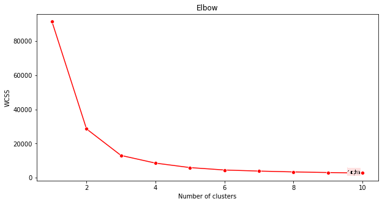
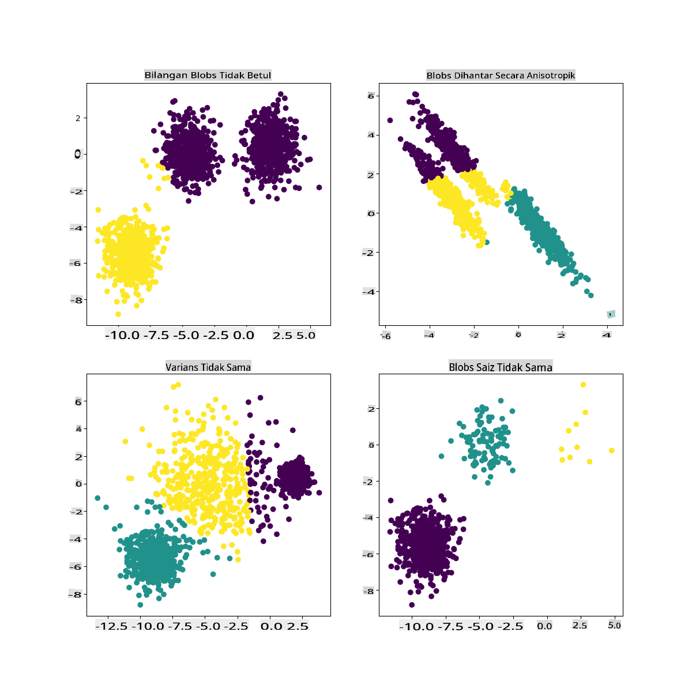

# Pengelompokan K-Means

## [Kuiz Pra-kuliah](https://gray-sand-07a10f403.1.azurestaticapps.net/quiz/29/)

Dalam pelajaran ini, anda akan belajar cara membuat kluster menggunakan Scikit-learn dan dataset musik Nigeria yang anda impor sebelumnya. Kita akan membahas dasar-dasar K-Means untuk Pengelompokan. Ingatlah bahwa, seperti yang telah anda pelajari dalam pelajaran sebelumnya, ada banyak cara untuk bekerja dengan kluster dan metode yang anda gunakan tergantung pada data anda. Kita akan mencoba K-Means karena ini adalah teknik pengelompokan yang paling umum. Mari kita mulai!

Istilah-istilah yang akan anda pelajari:

- Skor Silhouette
- Metode Elbow
- Inertia
- Variansi

## Pengenalan

[Pemgumpulan K-Means](https://wikipedia.org/wiki/K-means_clustering) adalah metode yang berasal dari domain pemrosesan sinyal. Metode ini digunakan untuk membagi dan mengelompokkan data menjadi 'k' kluster menggunakan serangkaian observasi. Setiap observasi berfungsi untuk mengelompokkan titik data yang diberikan ke 'mean' terdekatnya, atau titik tengah dari sebuah kluster.

Kluster-kluster tersebut dapat divisualisasikan sebagai [diagram Voronoi](https://wikipedia.org/wiki/Voronoi_diagram), yang mencakup sebuah titik (atau 'benih') dan wilayah yang sesuai.


> infografis oleh [Jen Looper](https://twitter.com/jenlooper)

Proses pengelompokan K-Means [dijalankan dalam tiga langkah](https://scikit-learn.org/stable/modules/clustering.html#k-means):

1. Algoritma memilih sejumlah k-titik tengah dengan mengambil sampel dari dataset. Setelah itu, algoritma melakukan iterasi:
    1. Menugaskan setiap sampel ke centroid terdekat.
    2. Membuat centroid baru dengan mengambil nilai rata-rata dari semua sampel yang ditugaskan ke centroid sebelumnya.
    3. Kemudian, menghitung perbedaan antara centroid baru dan lama dan mengulangi hingga centroid stabil.

Salah satu kelemahan menggunakan K-Means adalah anda perlu menetapkan 'k', yaitu jumlah centroid. Untungnya, 'metode elbow' membantu memperkirakan nilai awal yang baik untuk 'k'. Anda akan mencobanya sebentar lagi.

## Prasyarat

Anda akan bekerja dalam file [_notebook.ipynb_](https://github.com/microsoft/ML-For-Beginners/blob/main/5-Clustering/2-K-Means/notebook.ipynb) dari pelajaran ini yang mencakup impor data dan pembersihan awal yang anda lakukan pada pelajaran sebelumnya.

## Latihan - persiapan

Mulailah dengan melihat kembali data lagu.

1. Buat boxplot, panggil `boxplot()` untuk setiap kolom:

    ```python
    plt.figure(figsize=(20,20), dpi=200)
    
    plt.subplot(4,3,1)
    sns.boxplot(x = 'popularity', data = df)
    
    plt.subplot(4,3,2)
    sns.boxplot(x = 'acousticness', data = df)
    
    plt.subplot(4,3,3)
    sns.boxplot(x = 'energy', data = df)
    
    plt.subplot(4,3,4)
    sns.boxplot(x = 'instrumentalness', data = df)
    
    plt.subplot(4,3,5)
    sns.boxplot(x = 'liveness', data = df)
    
    plt.subplot(4,3,6)
    sns.boxplot(x = 'loudness', data = df)
    
    plt.subplot(4,3,7)
    sns.boxplot(x = 'speechiness', data = df)
    
    plt.subplot(4,3,8)
    sns.boxplot(x = 'tempo', data = df)
    
    plt.subplot(4,3,9)
    sns.boxplot(x = 'time_signature', data = df)
    
    plt.subplot(4,3,10)
    sns.boxplot(x = 'danceability', data = df)
    
    plt.subplot(4,3,11)
    sns.boxplot(x = 'length', data = df)
    
    plt.subplot(4,3,12)
    sns.boxplot(x = 'release_date', data = df)
    ```

    Data ini agak bising: dengan mengamati setiap kolom sebagai boxplot, anda dapat melihat outlier.

    

Anda bisa melalui dataset dan menghapus outlier ini, tetapi itu akan membuat data cukup minimal.

1. Untuk saat ini, pilih kolom mana yang akan anda gunakan untuk latihan pengelompokan. Pilih yang memiliki rentang yang serupa dan kodekan kolom `artist_top_genre` sebagai data numerik:

    ```python
    from sklearn.preprocessing import LabelEncoder
    le = LabelEncoder()
    
    X = df.loc[:, ('artist_top_genre','popularity','danceability','acousticness','loudness','energy')]
    
    y = df['artist_top_genre']
    
    X['artist_top_genre'] = le.fit_transform(X['artist_top_genre'])
    
    y = le.transform(y)
    ```

1. Sekarang anda perlu memilih berapa banyak kluster yang akan ditargetkan. Anda tahu ada 3 genre lagu yang kami ambil dari dataset, jadi mari coba 3:

    ```python
    from sklearn.cluster import KMeans
    
    nclusters = 3 
    seed = 0
    
    km = KMeans(n_clusters=nclusters, random_state=seed)
    km.fit(X)
    
    # Predict the cluster for each data point
    
    y_cluster_kmeans = km.predict(X)
    y_cluster_kmeans
    ```

Anda melihat array yang dicetak dengan kluster yang diprediksi (0, 1, atau 2) untuk setiap baris dataframe.

1. Gunakan array ini untuk menghitung 'skor silhouette':

    ```python
    from sklearn import metrics
    score = metrics.silhouette_score(X, y_cluster_kmeans)
    score
    ```

## Skor Silhouette

Carilah skor silhouette yang mendekati 1. Skor ini bervariasi dari -1 hingga 1, dan jika skornya 1, kluster tersebut padat dan terpisah dengan baik dari kluster lain. Nilai mendekati 0 mewakili kluster yang tumpang tindih dengan sampel yang sangat dekat dengan batas keputusan kluster tetangga. [(Sumber)](https://dzone.com/articles/kmeans-silhouette-score-explained-with-python-exam)

Skor kita adalah **.53**, jadi tepat di tengah. Ini menunjukkan bahwa data kita tidak terlalu cocok untuk jenis pengelompokan ini, tetapi mari kita lanjutkan.

### Latihan - membangun model

1. Impor `KMeans` dan mulai proses pengelompokan.

    ```python
    from sklearn.cluster import KMeans
    wcss = []
    
    for i in range(1, 11):
        kmeans = KMeans(n_clusters = i, init = 'k-means++', random_state = 42)
        kmeans.fit(X)
        wcss.append(kmeans.inertia_)
    
    ```

    Ada beberapa bagian di sini yang perlu dijelaskan.

    > 🎓 range: Ini adalah iterasi dari proses pengelompokan

    > 🎓 random_state: "Menentukan penghasil angka acak untuk inisialisasi centroid." [Sumber](https://scikit-learn.org/stable/modules/generated/sklearn.cluster.KMeans.html#sklearn.cluster.KMeans)

    > 🎓 WCSS: "within-cluster sums of squares" mengukur jarak rata-rata kuadrat dari semua titik dalam sebuah kluster ke centroid kluster. [Sumber](https://medium.com/@ODSC/unsupervised-learning-evaluating-clusters-bd47eed175ce). 

    > 🎓 Inertia: Algoritma K-Means berusaha memilih centroid untuk meminimalkan 'inertia', "ukuran seberapa koheren kluster secara internal." [Sumber](https://scikit-learn.org/stable/modules/clustering.html). Nilainya ditambahkan ke variabel wcss pada setiap iterasi.

    > 🎓 k-means++: Dalam [Scikit-learn](https://scikit-learn.org/stable/modules/clustering.html#k-means) anda dapat menggunakan optimasi 'k-means++', yang "menginisialisasi centroid agar (secara umum) jauh dari satu sama lain, menghasilkan kemungkinan hasil yang lebih baik daripada inisialisasi acak.

### Metode Elbow

Sebelumnya, anda menduga bahwa, karena anda menargetkan 3 genre lagu, anda harus memilih 3 kluster. Tetapi apakah itu benar?

1. Gunakan 'metode elbow' untuk memastikannya.

    ```python
    plt.figure(figsize=(10,5))
    sns.lineplot(x=range(1, 11), y=wcss, marker='o', color='red')
    plt.title('Elbow')
    plt.xlabel('Number of clusters')
    plt.ylabel('WCSS')
    plt.show()
    ```

    Gunakan variabel `wcss` yang anda buat pada langkah sebelumnya untuk membuat grafik yang menunjukkan di mana 'tikungan' pada elbow, yang menunjukkan jumlah kluster yang optimal. Mungkin memang **3**!

    

## Latihan - menampilkan kluster

1. Cobalah prosesnya lagi, kali ini menetapkan tiga kluster, dan tampilkan kluster sebagai scatterplot:

    ```python
    from sklearn.cluster import KMeans
    kmeans = KMeans(n_clusters = 3)
    kmeans.fit(X)
    labels = kmeans.predict(X)
    plt.scatter(df['popularity'],df['danceability'],c = labels)
    plt.xlabel('popularity')
    plt.ylabel('danceability')
    plt.show()
    ```

1. Periksa akurasi model:

    ```python
    labels = kmeans.labels_
    
    correct_labels = sum(y == labels)
    
    print("Result: %d out of %d samples were correctly labeled." % (correct_labels, y.size))
    
    print('Accuracy score: {0:0.2f}'. format(correct_labels/float(y.size)))
    ```

    Akurasi model ini tidak terlalu bagus, dan bentuk kluster memberi anda petunjuk mengapa. 

    

    Data ini terlalu tidak seimbang, terlalu sedikit berkorelasi dan ada terlalu banyak varians antara nilai kolom untuk dikelompokkan dengan baik. Faktanya, kluster yang terbentuk mungkin sangat dipengaruhi atau bias oleh tiga kategori genre yang kita definisikan di atas. Itu adalah proses pembelajaran!

    Dalam dokumentasi Scikit-learn, anda dapat melihat bahwa model seperti ini, dengan kluster yang tidak terlalu jelas, memiliki masalah 'varians':

    
    > Infografis dari Scikit-learn

## Variansi

Variansi didefinisikan sebagai "rata-rata dari perbedaan kuadrat dari Mean" [(Sumber)](https://www.mathsisfun.com/data/standard-deviation.html). Dalam konteks masalah pengelompokan ini, ini mengacu pada data yang angka-angka dalam dataset kita cenderung menyimpang terlalu jauh dari mean. 

✅ Ini adalah saat yang tepat untuk memikirkan semua cara anda dapat memperbaiki masalah ini. Mengubah data sedikit lebih banyak? Menggunakan kolom yang berbeda? Menggunakan algoritma yang berbeda? Petunjuk: Cobalah [menyelaraskan data anda](https://www.mygreatlearning.com/blog/learning-data-science-with-k-means-clustering/) untuk menormalkannya dan menguji kolom lain.

> Cobalah '[kalkulator varians](https://www.calculatorsoup.com/calculators/statistics/variance-calculator.php)' ini untuk memahami konsep ini lebih lanjut.

---

## 🚀Tantangan

Habiskan waktu dengan notebook ini, mengubah parameter. Bisakah anda meningkatkan akurasi model dengan membersihkan data lebih banyak (menghapus outlier, misalnya)? Anda dapat menggunakan bobot untuk memberikan bobot lebih pada sampel data tertentu. Apa lagi yang bisa anda lakukan untuk membuat kluster yang lebih baik?

Petunjuk: Cobalah untuk menyelaraskan data anda. Ada kode yang dikomentari dalam notebook yang menambahkan penskalaan standar untuk membuat kolom data lebih mirip satu sama lain dalam hal rentang. Anda akan menemukan bahwa meskipun skor silhouette turun, 'tikungan' dalam grafik elbow menjadi lebih halus. Ini karena membiarkan data tidak diskalakan memungkinkan data dengan varians lebih sedikit untuk membawa lebih banyak bobot. Baca lebih lanjut tentang masalah ini [di sini](https://stats.stackexchange.com/questions/21222/are-mean-normalization-and-feature-scaling-needed-for-k-means-clustering/21226#21226).

## [Kuiz Pasca-kuliah](https://gray-sand-07a10f403.1.azurestaticapps.net/quiz/30/)

## Tinjauan & Studi Mandiri

Lihatlah Simulator K-Means [seperti yang ini](https://user.ceng.metu.edu.tr/~akifakkus/courses/ceng574/k-means/). Anda dapat menggunakan alat ini untuk memvisualisasikan titik data sampel dan menentukan centroidnya. Anda dapat mengedit keacakan data, jumlah kluster, dan jumlah centroid. Apakah ini membantu anda mendapatkan gambaran tentang bagaimana data dapat dikelompokkan?

Juga, lihat [handout ini tentang K-Means](https://stanford.edu/~cpiech/cs221/handouts/kmeans.html) dari Stanford.

## Tugas

[Cobalah metode pengelompokan yang berbeda](assignment.md)

**Penafian**:
Dokumen ini telah diterjemahkan menggunakan perkhidmatan terjemahan AI berasaskan mesin. Walaupun kami berusaha untuk ketepatan, sila ambil perhatian bahawa terjemahan automatik mungkin mengandungi kesilapan atau ketidaktepatan. Dokumen asal dalam bahasa asalnya harus dianggap sebagai sumber yang berwibawa. Untuk maklumat kritikal, terjemahan manusia profesional adalah disyorkan. Kami tidak bertanggungjawab atas sebarang salah faham atau salah tafsir yang timbul daripada penggunaan terjemahan ini.