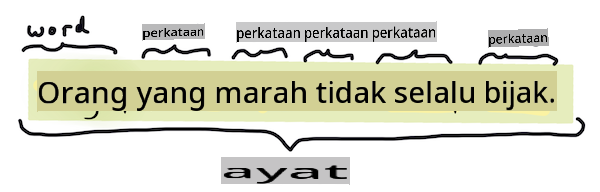
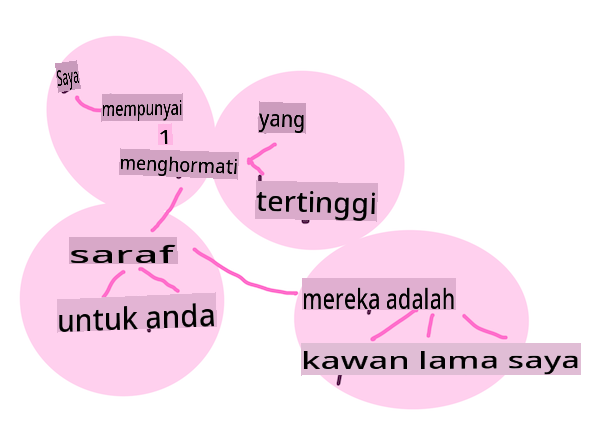
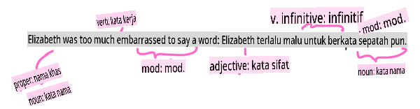

# Tugas dan Teknik Pemprosesan Bahasa Semulajadi yang Biasa

Untuk kebanyakan tugas *pemprosesan bahasa semulajadi*, teks yang hendak diproses mesti dipecahkan, diperiksa, dan hasilnya disimpan atau dirujuk silang dengan peraturan dan set data. Tugas-tugas ini membolehkan pengaturcara untuk mendapatkan _makna_ atau _niat_ atau hanya _kekerapan_ istilah dan kata dalam teks.

## [Kuiz pra-kuliah](https://gray-sand-07a10f403.1.azurestaticapps.net/quiz/33/)

Mari kita terokai teknik-teknik biasa yang digunakan dalam memproses teks. Digabungkan dengan pembelajaran mesin, teknik-teknik ini membantu anda menganalisis sejumlah besar teks dengan efisien. Sebelum menerapkan ML kepada tugas-tugas ini, mari kita fahami masalah yang dihadapi oleh pakar NLP.

## Tugas biasa dalam NLP

Terdapat pelbagai cara untuk menganalisis teks yang anda sedang kerjakan. Terdapat tugas-tugas yang boleh anda lakukan dan melalui tugas-tugas ini anda dapat memahami teks dan membuat kesimpulan. Biasanya anda menjalankan tugas-tugas ini secara berurutan.

### Tokenisasi

Mungkin perkara pertama yang perlu dilakukan oleh kebanyakan algoritma NLP adalah memecahkan teks kepada token, atau kata-kata. Walaupun ini kedengaran mudah, perlu mengambil kira tanda baca dan pembatas kata dan ayat dari pelbagai bahasa boleh membuatnya rumit. Anda mungkin perlu menggunakan pelbagai kaedah untuk menentukan sempadan.


> Tokenisasi ayat dari **Pride and Prejudice**. Infografik oleh [Jen Looper](https://twitter.com/jenlooper)

### Embeddings

[Word embeddings](https://wikipedia.org/wiki/Word_embedding) adalah cara untuk menukar data teks anda secara numerik. Embeddings dilakukan dengan cara supaya kata-kata yang mempunyai makna serupa atau kata-kata yang digunakan bersama berkumpul bersama.


> "I have the highest respect for your nerves, they are my old friends." - Word embeddings untuk ayat dalam **Pride and Prejudice**. Infografik oleh [Jen Looper](https://twitter.com/jenlooper)

✅ Cuba [alat menarik ini](https://projector.tensorflow.org/) untuk bereksperimen dengan word embeddings. Mengklik pada satu kata menunjukkan kumpulan kata-kata yang serupa: 'toy' berkumpul dengan 'disney', 'lego', 'playstation', dan 'console'.

### Parsing & Tagging Bahagian Ucapan

Setiap kata yang telah ditokenkan boleh ditandakan sebagai bahagian ucapan - kata nama, kata kerja, atau kata sifat. Ayat `the quick red fox jumped over the lazy brown dog` mungkin ditandakan POS sebagai fox = kata nama, jumped = kata kerja.



> Parsing ayat dari **Pride and Prejudice**. Infografik oleh [Jen Looper](https://twitter.com/jenlooper)

Parsing adalah mengenali kata-kata yang berkaitan antara satu sama lain dalam satu ayat - sebagai contoh `the quick red fox jumped` adalah urutan kata sifat-kata nama-kata kerja yang berasingan dari urutan `lazy brown dog`.  

### Kekerapan Kata dan Frasa

Prosedur yang berguna apabila menganalisis sejumlah besar teks adalah membina kamus setiap kata atau frasa yang menarik dan seberapa kerap ia muncul. Frasa `the quick red fox jumped over the lazy brown dog` mempunyai kekerapan kata 2 untuk the.

Mari kita lihat contoh teks di mana kita mengira kekerapan kata. Puisi Rudyard Kipling The Winners mengandungi ayat berikut:

```output
What the moral? Who rides may read.
When the night is thick and the tracks are blind
A friend at a pinch is a friend, indeed,
But a fool to wait for the laggard behind.
Down to Gehenna or up to the Throne,
He travels the fastest who travels alone.
```

Oleh kerana kekerapan frasa boleh tidak sensitif huruf besar atau sensitif huruf besar seperti yang diperlukan, frasa `a friend` has a frequency of 2 and `the` has a frequency of 6, and `travels` adalah 2.

### N-grams

Teks boleh dipecahkan kepada urutan kata dengan panjang yang ditetapkan, satu kata (unigram), dua kata (bigrams), tiga kata (trigrams) atau sebarang bilangan kata (n-grams).

Sebagai contoh `the quick red fox jumped over the lazy brown dog` dengan skor n-gram 2 menghasilkan n-grams berikut:

1. the quick 
2. quick red 
3. red fox
4. fox jumped 
5. jumped over 
6. over the 
7. the lazy 
8. lazy brown 
9. brown dog

Ia mungkin lebih mudah untuk membayangkannya sebagai kotak gelongsor di atas ayat. Ini adalah untuk n-grams 3 kata, n-gram adalah tebal dalam setiap ayat:

1.   <u>**the quick red**</u> fox jumped over the lazy brown dog
2.   the **<u>quick red fox</u>** jumped over the lazy brown dog
3.   the quick **<u>red fox jumped</u>** over the lazy brown dog
4.   the quick red **<u>fox jumped over</u>** the lazy brown dog
5.   the quick red fox **<u>jumped over the</u>** lazy brown dog
6.   the quick red fox jumped **<u>over the lazy</u>** brown dog
7.   the quick red fox jumped over <u>**the lazy brown**</u> dog
8.   the quick red fox jumped over the **<u>lazy brown dog</u>**


> Nilai N-gram 3: Infografik oleh [Jen Looper](https://twitter.com/jenlooper)

### Ekstraksi Frasa Kata Nama

Dalam kebanyakan ayat, terdapat kata nama yang menjadi subjek, atau objek ayat. Dalam bahasa Inggeris, ia sering boleh dikenal pasti sebagai mempunyai 'a' atau 'an' atau 'the' sebelum ia. Mengenal pasti subjek atau objek ayat dengan 'mengekstrak frasa kata nama' adalah tugas biasa dalam NLP apabila cuba memahami makna ayat.

✅ Dalam ayat "I cannot fix on the hour, or the spot, or the look or the words, which laid the foundation. It is too long ago. I was in the middle before I knew that I had begun.", bolehkah anda mengenal pasti frasa kata nama?

Dalam ayat `the quick red fox jumped over the lazy brown dog` terdapat 2 frasa kata nama: **quick red fox** dan **lazy brown dog**.

### Analisis Sentimen

Satu ayat atau teks boleh dianalisis untuk sentimen, atau betapa *positif* atau *negatif* ia. Sentimen diukur dalam *polariti* dan *objektiviti/subjektiviti*. Polariti diukur dari -1.0 hingga 1.0 (negatif ke positif) dan 0.0 hingga 1.0 (paling objektif ke paling subjektif).

✅ Kemudian anda akan belajar bahawa terdapat pelbagai cara untuk menentukan sentimen menggunakan pembelajaran mesin, tetapi satu cara adalah mempunyai senarai kata dan frasa yang dikategorikan sebagai positif atau negatif oleh pakar manusia dan menerapkan model itu kepada teks untuk mengira skor polariti. Bolehkah anda melihat bagaimana ini berfungsi dalam beberapa keadaan dan kurang baik dalam keadaan lain?

### Infleksi

Infleksi membolehkan anda mengambil satu kata dan mendapatkan bentuk tunggal atau jamak kata tersebut.

### Lematisasi

*Lema* adalah akar atau kata kepala untuk satu set kata, contohnya *flew*, *flies*, *flying* mempunyai lema kata kerja *fly*.

Terdapat juga pangkalan data yang berguna untuk penyelidik NLP, terutamanya:

### WordNet

[WordNet](https://wordnet.princeton.edu/) adalah pangkalan data kata, sinonim, antonim dan banyak butiran lain untuk setiap kata dalam pelbagai bahasa. Ia sangat berguna apabila cuba membina terjemahan, pemeriksa ejaan, atau alat bahasa dari sebarang jenis.

## Perpustakaan NLP

Nasib baik, anda tidak perlu membina semua teknik ini sendiri, kerana terdapat perpustakaan Python yang sangat baik yang menjadikannya lebih mudah diakses oleh pembangun yang tidak pakar dalam pemprosesan bahasa semulajadi atau pembelajaran mesin. Pelajaran seterusnya termasuk lebih banyak contoh ini, tetapi di sini anda akan belajar beberapa contoh berguna untuk membantu anda dengan tugas seterusnya.

### Latihan - menggunakan `TextBlob` library

Let's use a library called TextBlob as it contains helpful APIs for tackling these types of tasks. TextBlob "stands on the giant shoulders of [NLTK](https://nltk.org) and [pattern](https://github.com/clips/pattern), and plays nicely with both." It has a considerable amount of ML embedded in its API.

> Note: A useful [Quick Start](https://textblob.readthedocs.io/en/dev/quickstart.html#quickstart) guide is available for TextBlob that is recommended for experienced Python developers 

When attempting to identify *noun phrases*, TextBlob offers several options of extractors to find noun phrases. 

1. Take a look at `ConllExtractor`.

    ```python
    from textblob import TextBlob
    from textblob.np_extractors import ConllExtractor
    # import and create a Conll extractor to use later 
    extractor = ConllExtractor()
    
    # later when you need a noun phrase extractor:
    user_input = input("> ")
    user_input_blob = TextBlob(user_input, np_extractor=extractor)  # note non-default extractor specified
    np = user_input_blob.noun_phrases                                    
    ```

    > Apa yang berlaku di sini? [ConllExtractor](https://textblob.readthedocs.io/en/dev/api_reference.html?highlight=Conll#textblob.en.np_extractors.ConllExtractor) adalah "Pengestrak frasa kata nama yang menggunakan parsing chunk yang dilatih dengan korpus latihan ConLL-2000." ConLL-2000 merujuk kepada Persidangan Pembelajaran Bahasa Semulajadi Komputasi tahun 2000. Setiap tahun persidangan tersebut mengadakan bengkel untuk menangani masalah NLP yang sukar, dan pada tahun 2000 ia adalah chunking kata nama. Model ini dilatih pada Wall Street Journal, dengan "bahagian 15-18 sebagai data latihan (211727 token) dan bahagian 20 sebagai data ujian (47377 token)". Anda boleh melihat prosedur yang digunakan [di sini](https://www.clips.uantwerpen.be/conll2000/chunking/) dan [hasilnya](https://ifarm.nl/erikt/research/np-chunking.html).

### Cabaran - meningkatkan bot anda dengan NLP

Dalam pelajaran sebelumnya anda membina bot Q&A yang sangat mudah. Sekarang, anda akan membuat Marvin lebih simpatik dengan menganalisis input anda untuk sentimen dan mencetak respons yang sesuai dengan sentimen tersebut. Anda juga perlu mengenal pasti `noun_phrase` dan bertanya mengenainya.

Langkah-langkah anda semasa membina bot perbualan yang lebih baik:

1. Cetak arahan yang memberi nasihat kepada pengguna cara berinteraksi dengan bot
2. Mulakan gelung 
   1. Terima input pengguna
   2. Jika pengguna meminta untuk keluar, maka keluar
   3. Proses input pengguna dan tentukan respons sentimen yang sesuai
   4. Jika frasa kata nama dikesan dalam sentimen, jamakkan ia dan minta input lanjut mengenai topik tersebut
   5. Cetak respons
3. kembali ke langkah 2

Berikut adalah snippet kod untuk menentukan sentimen menggunakan TextBlob. Perhatikan hanya terdapat empat *gradien* respons sentimen (anda boleh mempunyai lebih banyak jika anda suka):

```python
if user_input_blob.polarity <= -0.5:
  response = "Oh dear, that sounds bad. "
elif user_input_blob.polarity <= 0:
  response = "Hmm, that's not great. "
elif user_input_blob.polarity <= 0.5:
  response = "Well, that sounds positive. "
elif user_input_blob.polarity <= 1:
  response = "Wow, that sounds great. "
```

Berikut adalah beberapa output contoh untuk membimbing anda (input pengguna adalah pada baris yang bermula dengan >):

```output
Hello, I am Marvin, the friendly robot.
You can end this conversation at any time by typing 'bye'
After typing each answer, press 'enter'
How are you today?
> I am ok
Well, that sounds positive. Can you tell me more?
> I went for a walk and saw a lovely cat
Well, that sounds positive. Can you tell me more about lovely cats?
> cats are the best. But I also have a cool dog
Wow, that sounds great. Can you tell me more about cool dogs?
> I have an old hounddog but he is sick
Hmm, that's not great. Can you tell me more about old hounddogs?
> bye
It was nice talking to you, goodbye!
```

Satu penyelesaian yang mungkin untuk tugas ini adalah [di sini](https://github.com/microsoft/ML-For-Beginners/blob/main/6-NLP/2-Tasks/solution/bot.py)

✅ Semak Pengetahuan

1. Adakah anda fikir respons yang simpatik akan 'menipu' seseorang untuk berfikir bahawa bot sebenarnya memahami mereka?
2. Adakah mengenal pasti frasa kata nama menjadikan bot lebih 'boleh dipercayai'?
3. Mengapa mengekstrak 'frasa kata nama' dari ayat merupakan perkara yang berguna untuk dilakukan?

---

Laksanakan bot dalam semak pengetahuan sebelumnya dan uji pada seorang rakan. Bolehkah ia menipu mereka? Bolehkah anda menjadikan bot anda lebih 'boleh dipercayai'?

## 🚀Cabaran

Ambil satu tugas dalam semak pengetahuan sebelumnya dan cuba melaksanakannya. Uji bot pada seorang rakan. Bolehkah ia menipu mereka? Bolehkah anda menjadikan bot anda lebih 'boleh dipercayai'?

## [Kuiz pasca-kuliah](https://gray-sand-07a10f403.1.azurestaticapps.net/quiz/34/)

## Kajian & Kajian Kendiri

Dalam beberapa pelajaran berikutnya, anda akan belajar lebih lanjut mengenai analisis sentimen. Selidiki teknik menarik ini dalam artikel seperti ini di [KDNuggets](https://www.kdnuggets.com/tag/nlp)

## Tugasan 

[Buat bot bercakap balik](assignment.md)

**Penafian**:
Dokumen ini telah diterjemahkan menggunakan perkhidmatan terjemahan AI berasaskan mesin. Walaupun kami berusaha untuk ketepatan, sila maklum bahawa terjemahan automatik mungkin mengandungi kesilapan atau ketidaktepatan. Dokumen asal dalam bahasa asalnya harus dianggap sebagai sumber yang berwibawa. Untuk maklumat kritikal, terjemahan manusia profesional disyorkan. Kami tidak bertanggungjawab atas sebarang salah faham atau salah tafsir yang timbul daripada penggunaan terjemahan ini.