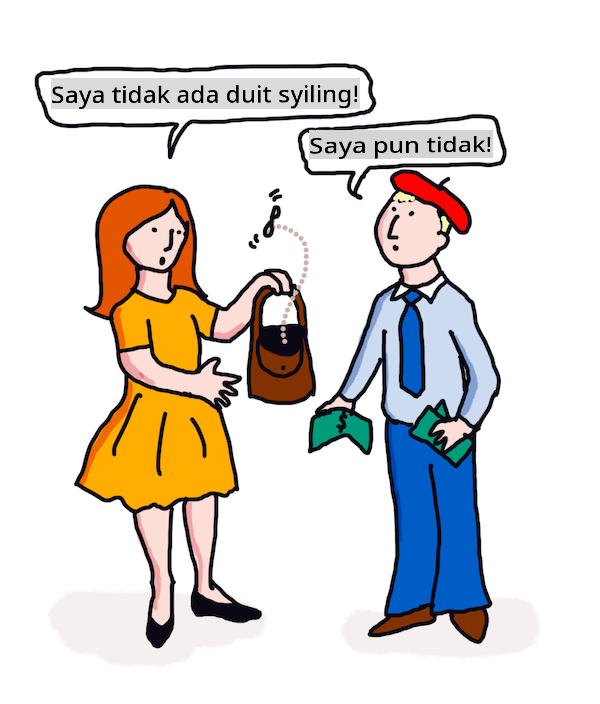

# Terjemahan dan analisis sentimen dengan ML

Dalam pelajaran sebelumnya, anda telah belajar bagaimana membangun bot dasar menggunakan `TextBlob`, sebuah perpustakaan yang menyematkan ML di balik layar untuk melakukan tugas NLP dasar seperti ekstraksi frasa kata benda. Tantangan penting lainnya dalam linguistik komputasional adalah terjemahan _tepat_ dari sebuah kalimat dari satu bahasa lisan atau tulisan ke bahasa lain.

## [Kuis pra-kuliah](https://gray-sand-07a10f403.1.azurestaticapps.net/quiz/35/)

Terjemahan adalah masalah yang sangat sulit karena ada ribuan bahasa dan masing-masing bisa memiliki aturan tata bahasa yang sangat berbeda. Salah satu pendekatan adalah mengubah aturan tata bahasa formal dari satu bahasa, seperti Bahasa Inggris, menjadi struktur yang tidak bergantung pada bahasa, dan kemudian menerjemahkannya dengan mengubah kembali ke bahasa lain. Pendekatan ini berarti anda akan mengambil langkah-langkah berikut:

1. **Identifikasi**. Mengidentifikasi atau menandai kata-kata dalam bahasa input menjadi kata benda, kata kerja, dll.
2. **Buat terjemahan**. Menghasilkan terjemahan langsung dari setiap kata dalam format bahasa target.

### Contoh kalimat, Inggris ke Irlandia

Dalam 'Bahasa Inggris', kalimat _I feel happy_ terdiri dari tiga kata dalam urutan:

- **subjek** (I)
- **kata kerja** (feel)
- **kata sifat** (happy)

Namun, dalam bahasa 'Irlandia', kalimat yang sama memiliki struktur tata bahasa yang sangat berbeda - emosi seperti "*happy*" atau "*sad*" diungkapkan sebagai berada *di atas* anda.

Frasa Bahasa Inggris `I feel happy` dalam bahasa Irlandia akan menjadi `Tá athas orm`. Terjemahan *harfiah* akan menjadi `Happy is upon me`.

Seorang penutur bahasa Irlandia yang menerjemahkan ke Bahasa Inggris akan mengatakan `I feel happy`, bukan `Happy is upon me`, karena mereka memahami makna kalimat tersebut, meskipun kata-kata dan struktur kalimatnya berbeda.

Urutan formal untuk kalimat dalam bahasa Irlandia adalah:

- **kata kerja** (Tá atau is)
- **kata sifat** (athas, atau happy)
- **subjek** (orm, atau upon me)

## Terjemahan

Program terjemahan naif mungkin hanya menerjemahkan kata-kata, mengabaikan struktur kalimat.

✅ Jika anda telah belajar bahasa kedua (atau ketiga atau lebih) sebagai orang dewasa, anda mungkin mulai dengan berpikir dalam bahasa asli anda, menerjemahkan konsep kata demi kata dalam kepala anda ke bahasa kedua, dan kemudian mengucapkan terjemahan anda. Ini mirip dengan apa yang dilakukan program komputer terjemahan naif. Penting untuk melewati fase ini untuk mencapai kefasihan!

Terjemahan naif mengarah pada terjemahan buruk (dan kadang-kadang lucu): `I feel happy` diterjemahkan secara harfiah menjadi `Mise bhraitheann athas` dalam bahasa Irlandia. Itu berarti (secara harfiah) `me feel happy` dan bukan kalimat yang valid dalam bahasa Irlandia. Meskipun Bahasa Inggris dan Irlandia adalah bahasa yang digunakan di dua pulau yang berdekatan, mereka adalah bahasa yang sangat berbeda dengan struktur tata bahasa yang berbeda.

> Anda dapat menonton beberapa video tentang tradisi linguistik Irlandia seperti [yang ini](https://www.youtube.com/watch?v=mRIaLSdRMMs)

### Pendekatan pembelajaran mesin

Sejauh ini, anda telah belajar tentang pendekatan aturan formal untuk pemrosesan bahasa alami. Pendekatan lain adalah mengabaikan makna kata-kata, dan _sebaliknya menggunakan pembelajaran mesin untuk mendeteksi pola_. Ini dapat bekerja dalam terjemahan jika anda memiliki banyak teks (sebuah *corpus*) atau teks-teks (*corpora*) dalam bahasa asal dan target.

Misalnya, pertimbangkan kasus *Pride and Prejudice*, novel terkenal berbahasa Inggris yang ditulis oleh Jane Austen pada tahun 1813. Jika anda membaca buku tersebut dalam bahasa Inggris dan terjemahan manusia dari buku tersebut dalam bahasa *Prancis*, anda dapat mendeteksi frasa dalam satu yang diterjemahkan secara _idiomatis_ ke dalam yang lain. Anda akan melakukannya sebentar lagi.

Misalnya, ketika sebuah frasa bahasa Inggris seperti `I have no money` diterjemahkan secara harfiah ke dalam bahasa Prancis, itu mungkin menjadi `Je n'ai pas de monnaie`. "Monnaie" adalah 'false cognate' Prancis yang rumit, karena 'money' dan 'monnaie' tidak sinonim. Terjemahan yang lebih baik yang mungkin dibuat oleh manusia adalah `Je n'ai pas d'argent`, karena lebih baik menyampaikan makna bahwa anda tidak memiliki uang (daripada 'loose change' yang merupakan makna 'monnaie').



> Gambar oleh [Jen Looper](https://twitter.com/jenlooper)

Jika model ML memiliki cukup banyak terjemahan manusia untuk membangun model, model tersebut dapat meningkatkan akurasi terjemahan dengan mengidentifikasi pola umum dalam teks yang telah diterjemahkan sebelumnya oleh penutur manusia ahli dari kedua bahasa.

### Latihan - terjemahan

Anda dapat menggunakan `TextBlob` untuk menerjemahkan kalimat. Cobalah kalimat pertama yang terkenal dari **Pride and Prejudice**:

```python
from textblob import TextBlob

blob = TextBlob(
    "It is a truth universally acknowledged, that a single man in possession of a good fortune, must be in want of a wife!"
)
print(blob.translate(to="fr"))

```

`TextBlob` melakukan pekerjaan yang cukup baik dalam terjemahan: "C'est une vérité universellement reconnue, qu'un homme célibataire en possession d'une bonne fortune doit avoir besoin d'une femme!". 

Dapat dikatakan bahwa terjemahan TextBlob jauh lebih tepat, sebenarnya, daripada terjemahan Prancis tahun 1932 dari buku oleh V. Leconte dan Ch. Pressoir:

"C'est une vérité universelle qu'un célibataire pourvu d'une belle fortune doit avoir envie de se marier, et, si peu que l'on sache de son sentiment à cet egard, lorsqu'il arrive dans une nouvelle résidence, cette idée est si bien fixée dans l'esprit de ses voisins qu'ils le considèrent sur-le-champ comme la propriété légitime de l'une ou l'autre de leurs filles."

Dalam kasus ini, terjemahan yang diinformasikan oleh ML melakukan pekerjaan yang lebih baik daripada penerjemah manusia yang secara tidak perlu menambahkan kata-kata dalam mulut penulis asli untuk 'kejelasan'.

> Apa yang terjadi di sini? dan mengapa TextBlob begitu bagus dalam terjemahan? Nah, di balik layar, itu menggunakan Google translate, sebuah AI canggih yang mampu menganalisis jutaan frasa untuk memprediksi rangkaian terbaik untuk tugas yang sedang dikerjakan. Tidak ada yang manual di sini dan anda memerlukan koneksi internet untuk menggunakan `blob.translate`.

✅ Try some more sentences. Which is better, ML or human translation? In which cases?

## Sentiment analysis

Another area where machine learning can work very well is sentiment analysis. A non-ML approach to sentiment is to identify words and phrases which are 'positive' and 'negative'. Then, given a new piece of text, calculate the total value of the positive, negative and neutral words to identify the overall sentiment. 

This approach is easily tricked as you may have seen in the Marvin task - the sentence `Great, that was a wonderful waste of time, I'm glad we are lost on this dark road` adalah kalimat dengan sentimen sarkastik dan negatif, tetapi algoritma sederhana mendeteksi 'great', 'wonderful', 'glad' sebagai positif dan 'waste', 'lost' dan 'dark' sebagai negatif. Sentimen keseluruhan dipengaruhi oleh kata-kata yang bertentangan ini.

✅ Berhenti sejenak dan pikirkan tentang bagaimana kita menyampaikan sarkasme sebagai penutur manusia. Intonasi memainkan peran besar. Cobalah mengatakan frasa "Well, that film was awesome" dengan berbagai cara untuk menemukan bagaimana suara anda menyampaikan makna.

### Pendekatan ML

Pendekatan ML adalah dengan mengumpulkan secara manual teks-teks negatif dan positif - tweet, atau ulasan film, atau apa pun di mana manusia telah memberikan skor *dan* pendapat tertulis. Kemudian teknik NLP dapat diterapkan pada pendapat dan skor, sehingga pola muncul (misalnya, ulasan film positif cenderung memiliki frasa 'Oscar worthy' lebih sering daripada ulasan film negatif, atau ulasan restoran positif mengatakan 'gourmet' jauh lebih sering daripada 'disgusting').

> ⚖️ **Contoh**: Jika anda bekerja di kantor seorang politikus dan ada beberapa undang-undang baru yang sedang diperdebatkan, konstituen mungkin menulis ke kantor dengan email mendukung atau email menentang undang-undang baru tersebut. Misalkan anda ditugaskan untuk membaca email-email tersebut dan memilahnya menjadi 2 tumpukan, *untuk* dan *menentang*. Jika ada banyak email, anda mungkin kewalahan mencoba membaca semuanya. Bukankah akan lebih baik jika sebuah bot bisa membaca semuanya untuk anda, memahaminya dan memberi tahu anda di tumpukan mana setiap email harus ditempatkan? 
> 
> Salah satu cara untuk mencapai itu adalah dengan menggunakan Pembelajaran Mesin. Anda akan melatih model dengan sebagian email *menentang* dan sebagian email *untuk*. Model akan cenderung mengaitkan frasa dan kata-kata dengan sisi menentang dan sisi untuk, *tetapi tidak akan memahami konten apa pun*, hanya bahwa kata-kata dan pola tertentu lebih mungkin muncul dalam email *menentang* atau *untuk*. Anda bisa mengujinya dengan beberapa email yang tidak anda gunakan untuk melatih model, dan melihat apakah model tersebut sampai pada kesimpulan yang sama dengan anda. Kemudian, setelah anda puas dengan akurasi model, anda bisa memproses email-email di masa depan tanpa harus membaca masing-masing.

✅ Apakah proses ini terdengar seperti proses yang telah anda gunakan dalam pelajaran sebelumnya?

## Latihan - kalimat sentimental

Sentimen diukur dengan *polaritas* -1 hingga 1, yang berarti -1 adalah sentimen paling negatif, dan 1 adalah yang paling positif. Sentimen juga diukur dengan skor 0 - 1 untuk objektivitas (0) dan subjektivitas (1).

Lihat lagi pada *Pride and Prejudice* karya Jane Austen. Teks tersebut tersedia di sini di [Project Gutenberg](https://www.gutenberg.org/files/1342/1342-h/1342-h.htm). Contoh di bawah ini menunjukkan program pendek yang menganalisis sentimen dari kalimat pertama dan terakhir dari buku tersebut dan menampilkan polaritas sentimen dan skor subjektivitas/objektivitasnya.

Anda harus menggunakan perpustakaan `TextBlob` (dijelaskan di atas) untuk menentukan `sentimen` (anda tidak perlu menulis kalkulator sentimen sendiri) dalam tugas berikut.

```python
from textblob import TextBlob

quote1 = """It is a truth universally acknowledged, that a single man in possession of a good fortune, must be in want of a wife."""

quote2 = """Darcy, as well as Elizabeth, really loved them; and they were both ever sensible of the warmest gratitude towards the persons who, by bringing her into Derbyshire, had been the means of uniting them."""

sentiment1 = TextBlob(quote1).sentiment
sentiment2 = TextBlob(quote2).sentiment

print(quote1 + " has a sentiment of " + str(sentiment1))
print(quote2 + " has a sentiment of " + str(sentiment2))
```

Anda melihat output berikut:

```output
It is a truth universally acknowledged, that a single man in possession of a good fortune, must be in want # of a wife. has a sentiment of Sentiment(polarity=0.20952380952380953, subjectivity=0.27142857142857146)

Darcy, as well as Elizabeth, really loved them; and they were
     both ever sensible of the warmest gratitude towards the persons
      who, by bringing her into Derbyshire, had been the means of
      uniting them. has a sentiment of Sentiment(polarity=0.7, subjectivity=0.8)
```

## Tantangan - periksa polaritas sentimen

Tugas anda adalah menentukan, menggunakan polaritas sentimen, apakah *Pride and Prejudice* memiliki lebih banyak kalimat yang benar-benar positif daripada yang benar-benar negatif. Untuk tugas ini, anda dapat mengasumsikan bahwa skor polaritas 1 atau -1 adalah benar-benar positif atau negatif.

**Langkah-langkah:**

1. Unduh [salinan Pride and Prejudice](https://www.gutenberg.org/files/1342/1342-h/1342-h.htm) dari Project Gutenberg sebagai file .txt. Hapus metadata di awal dan akhir file, hanya menyisakan teks asli
2. Buka file dalam Python dan ekstrak isinya sebagai string
3. Buat TextBlob menggunakan string buku
4. Analisis setiap kalimat dalam buku dalam sebuah loop
   1. Jika polaritasnya 1 atau -1, simpan kalimat tersebut dalam array atau daftar pesan positif atau negatif
5. Pada akhirnya, cetak semua kalimat positif dan kalimat negatif (secara terpisah) dan jumlah masing-masing.

Berikut adalah [solusi contoh](https://github.com/microsoft/ML-For-Beginners/blob/main/6-NLP/3-Translation-Sentiment/solution/notebook.ipynb).

✅ Pemeriksaan Pengetahuan

1. Sentimen didasarkan pada kata-kata yang digunakan dalam kalimat, tetapi apakah kode *memahami* kata-kata tersebut?
2. Apakah anda berpikir bahwa polaritas sentimen akurat, atau dengan kata lain, apakah anda *setuju* dengan skor tersebut?
   1. Secara khusus, apakah anda setuju atau tidak setuju dengan polaritas **positif** absolut dari kalimat berikut?
      * “What an excellent father you have, girls!” said she, when the door was shut.
      * “Your examination of Mr. Darcy is over, I presume,” said Miss Bingley; “and pray what is the result?” “I am perfectly convinced by it that Mr. Darcy has no defect.
      * How wonderfully these sort of things occur!
      * I have the greatest dislike in the world to that sort of thing.
      * Charlotte is an excellent manager, I dare say.
      * “This is delightful indeed!
      * I am so happy!
      * Your idea of the ponies is delightful.
   2. Tiga kalimat berikut diberi skor dengan sentimen positif absolut, tetapi setelah dibaca lebih dekat, mereka bukan kalimat positif. Mengapa analisis sentimen berpikir mereka adalah kalimat positif?
      * Happy shall I be, when his stay at Netherfield is over!” “I wish I could say anything to comfort you,” replied Elizabeth; “but it is wholly out of my power.
      * If I could but see you as happy!
      * Our distress, my dear Lizzy, is very great.
   3. Apakah anda setuju atau tidak setuju dengan polaritas **negatif** absolut dari kalimat berikut?
      - Everybody is disgusted with his pride.
      - “I should like to know how he behaves among strangers.” “You shall hear then—but prepare yourself for something very dreadful.
      - The pause was to Elizabeth’s feelings dreadful.
      - It would be dreadful!

✅ Setiap penggemar Jane Austen akan memahami bahwa dia sering menggunakan bukunya untuk mengkritik aspek-aspek yang lebih konyol dari masyarakat Regency Inggris. Elizabeth Bennett, karakter utama dalam *Pride and Prejudice*, adalah pengamat sosial yang tajam (seperti penulis) dan bahasanya sering kali sangat bernuansa. Bahkan Mr. Darcy (cinta dalam cerita) mencatat penggunaan bahasa Elizabeth yang bermain-main dan menggoda: "I have had the pleasure of your acquaintance long enough to know that you find great enjoyment in occasionally professing opinions which in fact are not your own."

---

## 🚀Tantangan

Bisakah anda membuat Marvin lebih baik dengan mengekstraksi fitur lain dari input pengguna?

## [Kuis pasca-kuliah](https://gray-sand-07a10f403.1.azurestaticapps.net/quiz/36/)

## Tinjauan & Studi Mandiri

Ada banyak cara untuk mengekstraksi sentimen dari teks. Pikirkan tentang aplikasi bisnis yang mungkin menggunakan teknik ini. Pikirkan tentang bagaimana itu bisa salah. Baca lebih lanjut tentang sistem canggih yang siap digunakan di perusahaan yang menganalisis sentimen seperti [Azure Text Analysis](https://docs.microsoft.com/azure/cognitive-services/Text-Analytics/how-tos/text-analytics-how-to-sentiment-analysis?tabs=version-3-1?WT.mc_id=academic-77952-leestott). Uji beberapa kalimat Pride and Prejudice di atas dan lihat apakah ia dapat mendeteksi nuansa.

## Tugas 

[Lisensi puitis](assignment.md)

**Penafian**:
Dokumen ini telah diterjemahkan menggunakan perkhidmatan terjemahan AI berasaskan mesin. Walaupun kami berusaha untuk ketepatan, sila maklum bahawa terjemahan automatik mungkin mengandungi kesilapan atau ketidaktepatan. Dokumen asal dalam bahasa asalnya harus dianggap sebagai sumber yang berwibawa. Untuk maklumat kritikal, terjemahan manusia profesional adalah disyorkan. Kami tidak bertanggungjawab atas sebarang salah faham atau salah tafsir yang timbul daripada penggunaan terjemahan ini.