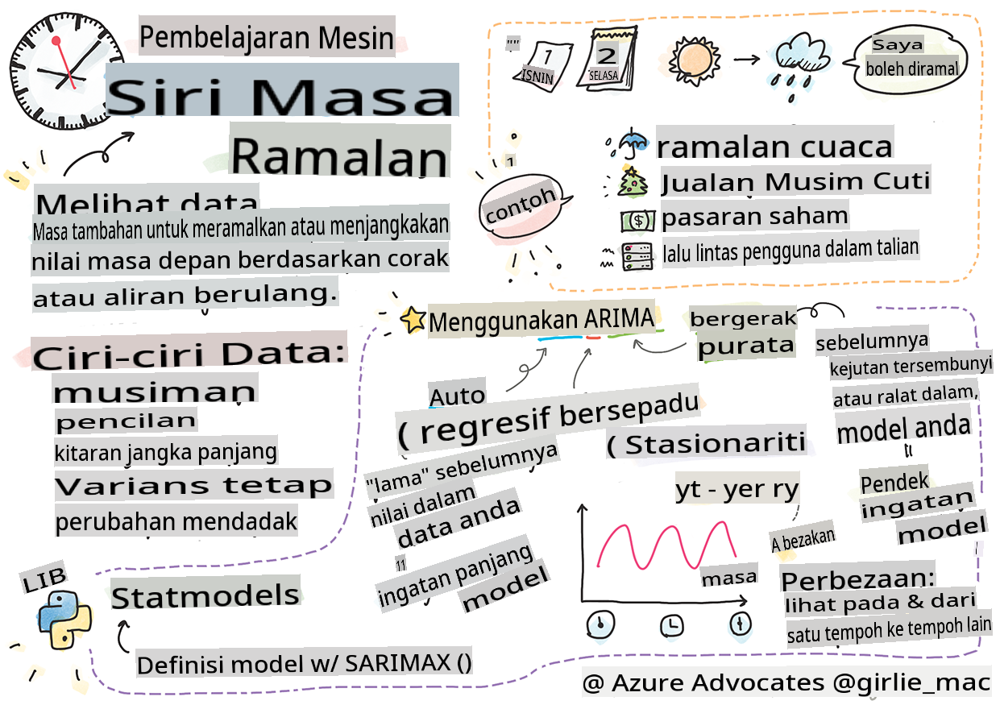
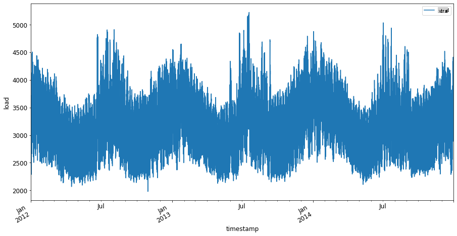
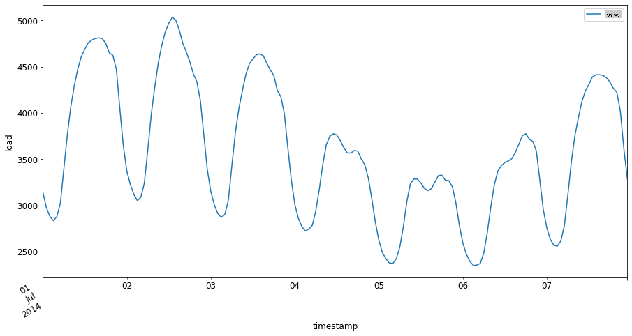

# Pengenalan kepada ramalan siri masa



> Sketchnote oleh [Tomomi Imura](https://www.twitter.com/girlie_mac)

Dalam pelajaran ini dan pelajaran berikutnya, anda akan mempelajari sedikit tentang ramalan siri masa, satu bahagian yang menarik dan berharga dalam repertoir seorang saintis ML yang kurang dikenali berbanding topik lain. Ramalan siri masa adalah sejenis 'bola kristal': berdasarkan prestasi lalu sesuatu pembolehubah seperti harga, anda boleh meramalkan nilai potensinya pada masa depan.

[](https://youtu.be/cBojo1hsHiI "Pengenalan kepada ramalan siri masa")

> 🎥 Klik imej di atas untuk video tentang ramalan siri masa

## [Kuiz pra-kuliah](https://gray-sand-07a10f403.1.azurestaticapps.net/quiz/41/)

Ia adalah bidang yang berguna dan menarik dengan nilai sebenar kepada perniagaan, memandangkan aplikasinya yang langsung kepada masalah penentuan harga, inventori, dan isu rantaian bekalan. Walaupun teknik pembelajaran mendalam telah mula digunakan untuk mendapatkan lebih banyak wawasan bagi meramalkan prestasi masa depan dengan lebih baik, ramalan siri masa tetap menjadi bidang yang banyak dimaklumkan oleh teknik ML klasik.

> Kurikulum siri masa yang berguna dari Penn State boleh didapati [di sini](https://online.stat.psu.edu/stat510/lesson/1)

## Pengenalan

Bayangkan anda menyelenggara satu rangkaian meter parkir pintar yang menyediakan data tentang seberapa kerap ia digunakan dan untuk berapa lama dari semasa ke semasa.

> Bagaimana jika anda boleh meramalkan, berdasarkan prestasi lalu meter tersebut, nilai masa depannya mengikut undang-undang penawaran dan permintaan?

Meramalkan dengan tepat bila untuk bertindak bagi mencapai matlamat anda adalah cabaran yang boleh ditangani oleh ramalan siri masa. Ia mungkin tidak menyenangkan orang ramai apabila dikenakan bayaran lebih tinggi pada masa sibuk ketika mereka mencari tempat parkir, tetapi ia adalah cara yang pasti untuk menjana pendapatan untuk membersihkan jalan!

Mari kita terokai beberapa jenis algoritma siri masa dan mulakan sebuah buku nota untuk membersihkan dan menyediakan beberapa data. Data yang akan anda analisis diambil dari pertandingan ramalan GEFCom2014. Ia terdiri daripada 3 tahun nilai beban elektrik dan suhu setiap jam antara 2012 dan 2014. Berdasarkan corak sejarah beban elektrik dan suhu, anda boleh meramalkan nilai masa depan beban elektrik.

Dalam contoh ini, anda akan belajar bagaimana untuk meramalkan satu langkah masa ke hadapan, hanya menggunakan data beban sejarah. Sebelum memulakan, bagaimanapun, adalah berguna untuk memahami apa yang berlaku di sebalik tabir.

## Beberapa definisi

Apabila menghadapi istilah 'siri masa' anda perlu memahami penggunaannya dalam beberapa konteks yang berbeza.

🎓 **Siri masa**

Dalam matematik, "siri masa adalah satu siri titik data yang diindeks (atau disenaraikan atau diplot) mengikut urutan masa. Selalunya, siri masa adalah urutan yang diambil pada titik masa yang sama jarak." Contoh siri masa adalah nilai penutupan harian [Dow Jones Industrial Average](https://wikipedia.org/wiki/Time_series). Penggunaan plot siri masa dan pemodelan statistik sering ditemui dalam pemprosesan isyarat, ramalan cuaca, ramalan gempa bumi, dan bidang lain di mana peristiwa berlaku dan titik data boleh diplot mengikut masa.

🎓 **Analisis siri masa**

Analisis siri masa adalah analisis data siri masa yang disebutkan di atas. Data siri masa boleh mengambil bentuk yang berbeza, termasuk 'siri masa terganggu' yang mengesan corak dalam evolusi siri masa sebelum dan selepas peristiwa yang mengganggu. Jenis analisis yang diperlukan untuk siri masa bergantung pada sifat data. Data siri masa itu sendiri boleh berbentuk siri nombor atau aksara.

Analisis yang akan dijalankan menggunakan pelbagai kaedah, termasuk domain frekuensi dan domain masa, linear dan tidak linear, dan banyak lagi. [Ketahui lebih lanjut](https://www.itl.nist.gov/div898/handbook/pmc/section4/pmc4.htm) tentang pelbagai cara untuk menganalisis jenis data ini.

🎓 **Ramalan siri masa**

Ramalan siri masa adalah penggunaan model untuk meramalkan nilai masa depan berdasarkan corak yang dipamerkan oleh data yang dikumpulkan sebelum ini seperti yang berlaku pada masa lalu. Walaupun mungkin untuk menggunakan model regresi untuk meneroka data siri masa, dengan indeks masa sebagai pembolehubah x pada plot, data sedemikian paling baik dianalisis menggunakan jenis model khas.

Data siri masa adalah senarai pemerhatian yang dipesan, tidak seperti data yang boleh dianalisis dengan regresi linear. Yang paling biasa adalah ARIMA, akronim yang bermaksud "Autoregressive Integrated Moving Average".

[Model ARIMA](https://online.stat.psu.edu/stat510/lesson/1/1.1) "mengaitkan nilai semasa siri kepada nilai masa lalu dan ralat ramalan masa lalu." Ia paling sesuai untuk menganalisis data domain masa, di mana data diatur mengikut masa.

> Terdapat beberapa jenis model ARIMA, yang boleh anda pelajari [di sini](https://people.duke.edu/~rnau/411arim.htm) dan yang akan anda sentuh dalam pelajaran seterusnya.

Dalam pelajaran seterusnya, anda akan membina model ARIMA menggunakan [Univariate Time Series](https://itl.nist.gov/div898/handbook/pmc/section4/pmc44.htm), yang menumpukan pada satu pembolehubah yang mengubah nilainya dari semasa ke semasa. Contoh jenis data ini adalah [set data ini](https://itl.nist.gov/div898/handbook/pmc/section4/pmc4411.htm) yang merekodkan kepekatan C02 bulanan di Observatori Mauna Loa:

|  CO2   | YearMonth | Year  | Month |
| :----: | :-------: | :---: | :---: |
| 330.62 |  1975.04  | 1975  |   1   |
| 331.40 |  1975.13  | 1975  |   2   |
| 331.87 |  1975.21  | 1975  |   3   |
| 333.18 |  1975.29  | 1975  |   4   |
| 333.92 |  1975.38  | 1975  |   5   |
| 333.43 |  1975.46  | 1975  |   6   |
| 331.85 |  1975.54  | 1975  |   7   |
| 330.01 |  1975.63  | 1975  |   8   |
| 328.51 |  1975.71  | 1975  |   9   |
| 328.41 |  1975.79  | 1975  |  10   |
| 329.25 |  1975.88  | 1975  |  11   |
| 330.97 |  1975.96  | 1975  |  12   |

✅ Kenal pasti pembolehubah yang berubah dari semasa ke semasa dalam set data ini

## Ciri-ciri data siri masa untuk dipertimbangkan

Apabila melihat data siri masa, anda mungkin perasan bahawa ia mempunyai [ciri-ciri tertentu](https://online.stat.psu.edu/stat510/lesson/1/1.1) yang perlu anda ambil kira dan kurangkan untuk lebih memahami coraknya. Jika anda menganggap data siri masa berpotensi memberikan 'isyarat' yang anda ingin analisis, ciri-ciri ini boleh dianggap sebagai 'bunyi'. Anda sering perlu mengurangkan 'bunyi' ini dengan mengimbangi beberapa ciri ini menggunakan beberapa teknik statistik.

Berikut adalah beberapa konsep yang anda perlu tahu untuk bekerja dengan siri masa:

🎓 **Tren**

Tren ditakrifkan sebagai peningkatan dan penurunan yang boleh diukur dari semasa ke semasa. [Baca lebih lanjut](https://machinelearningmastery.com/time-series-trends-in-python). Dalam konteks siri masa, ia adalah tentang cara menggunakan dan, jika perlu, menghapuskan tren dari siri masa anda.

🎓 **[Musim](https://machinelearningmastery.com/time-series-seasonality-with-python/)**

Musim ditakrifkan sebagai turun naik berkala, seperti lonjakan cuti yang mungkin mempengaruhi jualan, sebagai contoh. [Lihat](https://itl.nist.gov/div898/handbook/pmc/section4/pmc443.htm) bagaimana jenis plot yang berbeza memaparkan musim dalam data.

🎓 **Pelepasan**

Pelepasan adalah jauh dari varians data standard.

🎓 **Kitaran jangka panjang**

Bebas daripada musim, data mungkin memaparkan kitaran jangka panjang seperti kemerosotan ekonomi yang berlangsung lebih lama daripada setahun.

🎓 **Varians tetap**

Dari semasa ke semasa, sesetengah data memaparkan turun naik yang tetap, seperti penggunaan tenaga setiap hari dan malam.

🎓 **Perubahan mendadak**

Data mungkin memaparkan perubahan mendadak yang mungkin memerlukan analisis lanjut. Penutupan perniagaan secara mendadak akibat COVID, sebagai contoh, menyebabkan perubahan dalam data.

✅ Berikut adalah [contoh plot siri masa](https://www.kaggle.com/kashnitsky/topic-9-part-1-time-series-analysis-in-python) yang menunjukkan perbelanjaan mata wang dalam permainan harian selama beberapa tahun. Bolehkah anda mengenal pasti mana-mana ciri yang disenaraikan di atas dalam data ini?


## Latihan - bermula dengan data penggunaan kuasa

Mari kita mula mencipta model siri masa untuk meramalkan penggunaan kuasa masa depan berdasarkan penggunaan masa lalu.

> Data dalam contoh ini diambil dari pertandingan ramalan GEFCom2014. Ia terdiri daripada 3 tahun nilai beban elektrik dan suhu setiap jam antara 2012 dan 2014.
>
> Tao Hong, Pierre Pinson, Shu Fan, Hamidreza Zareipour, Alberto Troccoli dan Rob J. Hyndman, "Ramalan tenaga probabilistik: Pertandingan Ramalan Tenaga Global 2014 dan seterusnya", International Journal of Forecasting, vol.32, no.3, pp 896-913, Julai-September, 2016.

1. Dalam folder `working` pelajaran ini, buka fail _notebook.ipynb_. Mulakan dengan menambah perpustakaan yang akan membantu anda memuat dan memvisualisasikan data

    ```python
    import os
    import matplotlib.pyplot as plt
    from common.utils import load_data
    %matplotlib inline
    ```

    Perhatikan, anda menggunakan fail daripada `common` folder which set up your environment and handle downloading the data.

2. Next, examine the data as a dataframe calling `load_data()` and `head()` yang disertakan:

    ```python
    data_dir = './data'
    energy = load_data(data_dir)[['load']]
    energy.head()
    ```

    Anda dapat melihat bahawa terdapat dua lajur yang mewakili tarikh dan beban:

    |                     |  load  |
    | :-----------------: | :----: |
    | 2012-01-01 00:00:00 | 2698.0 |
    | 2012-01-01 01:00:00 | 2558.0 |
    | 2012-01-01 02:00:00 | 2444.0 |
    | 2012-01-01 03:00:00 | 2402.0 |
    | 2012-01-01 04:00:00 | 2403.0 |

3. Sekarang, plot data dengan memanggil `plot()`:

    ```python
    energy.plot(y='load', subplots=True, figsize=(15, 8), fontsize=12)
    plt.xlabel('timestamp', fontsize=12)
    plt.ylabel('load', fontsize=12)
    plt.show()
    ```

    

4. Sekarang, plot minggu pertama bulan Julai 2014, dengan memberikannya sebagai input kepada corak `energy` in `[from date]: [to date]`:

    ```python
    energy['2014-07-01':'2014-07-07'].plot(y='load', subplots=True, figsize=(15, 8), fontsize=12)
    plt.xlabel('timestamp', fontsize=12)
    plt.ylabel('load', fontsize=12)
    plt.show()
    ```

    

    Plot yang cantik! Lihatlah plot-plot ini dan lihat jika anda boleh menentukan mana-mana ciri yang disenaraikan di atas. Apa yang boleh kita simpulkan dengan memvisualisasikan data?

Dalam pelajaran seterusnya, anda akan mencipta model ARIMA untuk membuat beberapa ramalan.

---

## 🚀Cabaran

Buat senarai semua industri dan bidang kajian yang anda boleh fikirkan yang akan mendapat manfaat daripada ramalan siri masa. Bolehkah anda memikirkan aplikasi teknik-teknik ini dalam seni? Dalam Ekonometrik? Ekologi? Runcit? Industri? Kewangan? Di mana lagi?

## [Kuiz pasca-kuliah](https://gray-sand-07a10f403.1.azurestaticapps.net/quiz/42/)

## Tinjauan & Kajian Sendiri

Walaupun kita tidak akan membincangkannya di sini, rangkaian neural kadangkala digunakan untuk meningkatkan kaedah klasik ramalan siri masa. Baca lebih lanjut tentang mereka [dalam artikel ini](https://medium.com/microsoftazure/neural-networks-for-forecasting-financial-and-economic-time-series-6aca370ff412)

## Tugasan

[Visualisasikan lebih banyak siri masa](assignment.md)

**Penafian**:
Dokumen ini telah diterjemahkan menggunakan perkhidmatan terjemahan AI berasaskan mesin. Walaupun kami berusaha untuk ketepatan, sila maklum bahawa terjemahan automatik mungkin mengandungi kesilapan atau ketidaktepatan. Dokumen asal dalam bahasa asalnya harus dianggap sebagai sumber yang berwibawa. Untuk maklumat kritikal, terjemahan manusia profesional adalah disyorkan. Kami tidak bertanggungjawab atas sebarang salah faham atau salah tafsir yang timbul daripada penggunaan terjemahan ini.