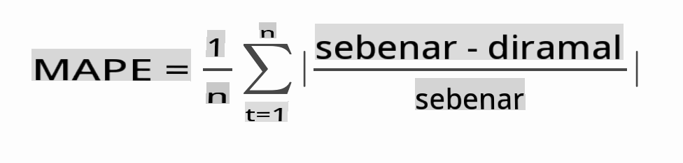

# Ramalan siri masa dengan ARIMA

Dalam pelajaran sebelumnya, anda telah mempelajari sedikit tentang ramalan siri masa dan memuat dataset yang menunjukkan turun naik beban elektrik dalam satu tempoh masa.

[](https://youtu.be/IUSk-YDau10 "Pengenalan kepada ARIMA")

> 🎥 Klik pada imej di atas untuk video: Pengenalan ringkas kepada model ARIMA. Contoh dilakukan dalam R, tetapi konsepnya adalah universal.

## [Kuiz pra-kuliah](https://gray-sand-07a10f403.1.azurestaticapps.net/quiz/43/)

## Pengenalan

Dalam pelajaran ini, anda akan menemui cara khusus untuk membina model dengan [ARIMA: *A*uto*R*egressive *I*ntegrated *M*oving *A*verage](https://wikipedia.org/wiki/Autoregressive_integrated_moving_average). Model ARIMA sangat sesuai untuk data yang menunjukkan [ketidakstasioner](https://wikipedia.org/wiki/Stationary_process).

## Konsep umum

Untuk dapat bekerja dengan ARIMA, terdapat beberapa konsep yang perlu anda ketahui:

- 🎓 **Stasioneriti**. Dari konteks statistik, stasioneriti merujuk kepada data yang taburannya tidak berubah apabila digeser dalam masa. Data yang tidak stasioner, kemudian, menunjukkan turun naik akibat tren yang mesti ditransformasikan untuk dianalisis. Musim, sebagai contoh, boleh memperkenalkan turun naik dalam data dan boleh dihapuskan melalui proses 'perbezaan bermusim'.

- 🎓 **[Perbezaan](https://wikipedia.org/wiki/Autoregressive_integrated_moving_average#Differencing)**. Membezakan data, sekali lagi dari konteks statistik, merujuk kepada proses mengubah data yang tidak stasioner untuk menjadikannya stasioner dengan menghapuskan tren yang tidak tetap. "Perbezaan menghapuskan perubahan dalam tahap siri masa, menghapuskan tren dan musim dan seterusnya menstabilkan purata siri masa." [Kertas oleh Shixiong et al](https://arxiv.org/abs/1904.07632)

## ARIMA dalam konteks siri masa

Mari kita huraikan bahagian-bahagian ARIMA untuk lebih memahami bagaimana ia membantu kita memodelkan siri masa dan membantu kita membuat ramalan terhadapnya.

- **AR - untuk AutoRegressive**. Model autoregressive, seperti namanya, melihat 'ke belakang' dalam masa untuk menganalisis nilai-nilai terdahulu dalam data anda dan membuat anggapan mengenainya. Nilai-nilai terdahulu ini dipanggil 'lags'. Contohnya ialah data yang menunjukkan jualan bulanan pensel. Jumlah jualan setiap bulan akan dianggap sebagai 'pembolehubah yang berkembang' dalam dataset. Model ini dibina kerana "pembolehubah yang berkembang menarik minat diregresi pada nilai terdahulunya sendiri (iaitu, nilai sebelumnya)." [wikipedia](https://wikipedia.org/wiki/Autoregressive_integrated_moving_average)

- **I - untuk Integrated**. Berbeza dengan model 'ARMA' yang serupa, 'I' dalam ARIMA merujuk kepada aspek *[terintegrasi](https://wikipedia.org/wiki/Order_of_integration)*. Data 'terintegrasi' apabila langkah-langkah perbezaan diterapkan untuk menghapuskan ketidakstasioner.

- **MA - untuk Moving Average**. Aspek [moving-average](https://wikipedia.org/wiki/Moving-average_model) model ini merujuk kepada pembolehubah output yang ditentukan dengan memerhati nilai semasa dan masa lalu lag.

Kesimpulan: ARIMA digunakan untuk membuat model sesuai dengan bentuk khas data siri masa seakrab mungkin.

## Latihan - bina model ARIMA

Buka folder [_/working_](https://github.com/microsoft/ML-For-Beginners/tree/main/7-TimeSeries/2-ARIMA/working) dalam pelajaran ini dan cari fail [_notebook.ipynb_](https://github.com/microsoft/ML-For-Beginners/blob/main/7-TimeSeries/2-ARIMA/working/notebook.ipynb).

1. Jalankan notebook untuk memuat perpustakaan `statsmodels` Python; anda akan memerlukannya untuk model ARIMA.

1. Muatkan perpustakaan yang diperlukan

1. Sekarang, muatkan beberapa perpustakaan lagi yang berguna untuk melukis data:

    ```python
    import os
    import warnings
    import matplotlib.pyplot as plt
    import numpy as np
    import pandas as pd
    import datetime as dt
    import math

    from pandas.plotting import autocorrelation_plot
    from statsmodels.tsa.statespace.sarimax import SARIMAX
    from sklearn.preprocessing import MinMaxScaler
    from common.utils import load_data, mape
    from IPython.display import Image

    %matplotlib inline
    pd.options.display.float_format = '{:,.2f}'.format
    np.set_printoptions(precision=2)
    warnings.filterwarnings("ignore") # specify to ignore warning messages
    ```

1. Muat data dari fail `/data/energy.csv` ke dalam dataframe Pandas dan lihat:

    ```python
    energy = load_data('./data')[['load']]
    energy.head(10)
    ```

1. Lukis semua data tenaga yang tersedia dari Januari 2012 hingga Disember 2014. Tidak sepatutnya ada kejutan kerana kita telah melihat data ini dalam pelajaran lepas:

    ```python
    energy.plot(y='load', subplots=True, figsize=(15, 8), fontsize=12)
    plt.xlabel('timestamp', fontsize=12)
    plt.ylabel('load', fontsize=12)
    plt.show()
    ```

    Sekarang, mari kita bina model!

### Buat dataset latihan dan ujian

Sekarang data anda telah dimuatkan, jadi anda boleh memisahkannya ke dalam set latihan dan ujian. Anda akan melatih model anda pada set latihan. Seperti biasa, selepas model selesai dilatih, anda akan menilai ketepatannya menggunakan set ujian. Anda perlu memastikan bahawa set ujian meliputi tempoh masa yang lebih lewat daripada set latihan untuk memastikan bahawa model tidak memperoleh maklumat daripada tempoh masa hadapan.

1. Peruntukkan tempoh dua bulan dari 1 September hingga 31 Oktober 2014 kepada set latihan. Set ujian akan merangkumi tempoh dua bulan dari 1 November hingga 31 Disember 2014:

    ```python
    train_start_dt = '2014-11-01 00:00:00'
    test_start_dt = '2014-12-30 00:00:00'
    ```

    Oleh kerana data ini mencerminkan penggunaan tenaga harian, terdapat corak bermusim yang kuat, tetapi penggunaan adalah paling serupa dengan penggunaan pada hari-hari yang lebih baru.

1. Visualisasikan perbezaannya:

    ```python
    energy[(energy.index < test_start_dt) & (energy.index >= train_start_dt)][['load']].rename(columns={'load':'train'}) \
        .join(energy[test_start_dt:][['load']].rename(columns={'load':'test'}), how='outer') \
        .plot(y=['train', 'test'], figsize=(15, 8), fontsize=12)
    plt.xlabel('timestamp', fontsize=12)
    plt.ylabel('load', fontsize=12)
    plt.show()
    ```

    

    Oleh itu, menggunakan jangka masa yang agak kecil untuk melatih data sepatutnya mencukupi.

    > Nota: Oleh kerana fungsi yang kita gunakan untuk menyesuaikan model ARIMA menggunakan pengesahan dalam-sampel semasa pemasangan, kita akan mengabaikan data pengesahan.

### Sediakan data untuk latihan

Sekarang, anda perlu menyediakan data untuk latihan dengan melakukan penapisan dan penskalaan data anda. Tapis dataset anda untuk hanya merangkumi tempoh masa dan lajur yang anda perlukan, dan penskalaan untuk memastikan data diproyeksikan dalam selang 0,1.

1. Tapis dataset asal untuk hanya merangkumi tempoh masa yang disebutkan di atas setiap set dan hanya termasuk lajur 'load' yang diperlukan serta tarikh:

    ```python
    train = energy.copy()[(energy.index >= train_start_dt) & (energy.index < test_start_dt)][['load']]
    test = energy.copy()[energy.index >= test_start_dt][['load']]

    print('Training data shape: ', train.shape)
    print('Test data shape: ', test.shape)
    ```

    Anda boleh melihat bentuk data:

    ```output
    Training data shape:  (1416, 1)
    Test data shape:  (48, 1)
    ```

1. Skala data untuk berada dalam julat (0, 1).

    ```python
    scaler = MinMaxScaler()
    train['load'] = scaler.fit_transform(train)
    train.head(10)
    ```

1. Visualisasikan data asal vs. data berskala:

    ```python
    energy[(energy.index >= train_start_dt) & (energy.index < test_start_dt)][['load']].rename(columns={'load':'original load'}).plot.hist(bins=100, fontsize=12)
    train.rename(columns={'load':'scaled load'}).plot.hist(bins=100, fontsize=12)
    plt.show()
    ```

    

    > Data asal

    

    > Data berskala

1. Sekarang bahawa anda telah menentukur data berskala, anda boleh menskala data ujian:

    ```python
    test['load'] = scaler.transform(test)
    test.head()
    ```

### Laksanakan ARIMA

Sudah tiba masanya untuk melaksanakan ARIMA! Anda kini akan menggunakan perpustakaan `statsmodels` yang anda pasang sebelum ini.

Sekarang anda perlu mengikuti beberapa langkah

   1. Tentukan model dengan memanggil `SARIMAX()` and passing in the model parameters: p, d, and q parameters, and P, D, and Q parameters.
   2. Prepare the model for the training data by calling the fit() function.
   3. Make predictions calling the `forecast()` function and specifying the number of steps (the `horizon`) to forecast.

> 🎓 What are all these parameters for? In an ARIMA model there are 3 parameters that are used to help model the major aspects of a time series: seasonality, trend, and noise. These parameters are:

`p`: the parameter associated with the auto-regressive aspect of the model, which incorporates *past* values.
`d`: the parameter associated with the integrated part of the model, which affects the amount of *differencing* (🎓 remember differencing 👆?) to apply to a time series.
`q`: the parameter associated with the moving-average part of the model.

> Note: If your data has a seasonal aspect - which this one does - , we use a seasonal ARIMA model (SARIMA). In that case you need to use another set of parameters: `P`, `D`, and `Q` which describe the same associations as `p`, `d`, and `q`, tetapi sepadan dengan komponen bermusim model.

1. Mulakan dengan menetapkan nilai horizon pilihan anda. Mari cuba 3 jam:

    ```python
    # Specify the number of steps to forecast ahead
    HORIZON = 3
    print('Forecasting horizon:', HORIZON, 'hours')
    ```

    Memilih nilai terbaik untuk parameter model ARIMA boleh menjadi mencabar kerana ia agak subjektif dan memerlukan masa. Anda mungkin mempertimbangkan untuk menggunakan `auto_arima()` function from the [`pyramid` library](https://alkaline-ml.com/pmdarima/0.9.0/modules/generated/pyramid.arima.auto_arima.html),

1. Buat masa ini cuba beberapa pilihan manual untuk mencari model yang baik.

    ```python
    order = (4, 1, 0)
    seasonal_order = (1, 1, 0, 24)

    model = SARIMAX(endog=train, order=order, seasonal_order=seasonal_order)
    results = model.fit()

    print(results.summary())
    ```

    Jadual keputusan dicetak.

Anda telah membina model pertama anda! Sekarang kita perlu mencari cara untuk menilainya.

### Menilai model anda

Untuk menilai model anda, anda boleh melakukan pengesahan `walk forward`. Dalam amalan, model siri masa dilatih semula setiap kali data baru tersedia. Ini membolehkan model membuat ramalan terbaik pada setiap langkah masa.

Bermula dari awal siri masa menggunakan teknik ini, latih model pada set data latihan. Kemudian buat ramalan pada langkah masa seterusnya. Ramalan dinilai terhadap nilai yang diketahui. Set latihan kemudian diperluas untuk merangkumi nilai yang diketahui dan proses diulang.

> Nota: Anda harus memastikan tetingkap set latihan tetap untuk latihan yang lebih cekap supaya setiap kali anda menambah pemerhatian baru pada set latihan, anda menghapuskan pemerhatian dari permulaan set.

Proses ini menyediakan anggaran yang lebih kukuh tentang bagaimana model akan berfungsi dalam amalan. Walau bagaimanapun, ia datang pada kos pengiraan untuk mencipta begitu banyak model. Ini boleh diterima jika data kecil atau model mudah, tetapi boleh menjadi isu pada skala besar.

Pengesahan 'walk-forward' adalah standard emas penilaian model siri masa dan disyorkan untuk projek anda sendiri.

1. Pertama, buat titik data ujian untuk setiap langkah HORIZON.

    ```python
    test_shifted = test.copy()

    for t in range(1, HORIZON+1):
        test_shifted['load+'+str(t)] = test_shifted['load'].shift(-t, freq='H')

    test_shifted = test_shifted.dropna(how='any')
    test_shifted.head(5)
    ```

    |            |          | load | load+1 | load+2 |
    | ---------- | -------- | ---- | ------ | ------ |
    | 2014-12-30 | 00:00:00 | 0.33 | 0.29   | 0.27   |
    | 2014-12-30 | 01:00:00 | 0.29 | 0.27   | 0.27   |
    | 2014-12-30 | 02:00:00 | 0.27 | 0.27   | 0.30   |
    | 2014-12-30 | 03:00:00 | 0.27 | 0.30   | 0.41   |
    | 2014-12-30 | 04:00:00 | 0.30 | 0.41   | 0.57   |

    Data digeser secara mendatar mengikut titik horizon.

1. Buat ramalan pada data ujian anda menggunakan pendekatan tetingkap gelongsor ini dalam gelung sepanjang panjang data ujian:

    ```python
    %%time
    training_window = 720 # dedicate 30 days (720 hours) for training

    train_ts = train['load']
    test_ts = test_shifted

    history = [x for x in train_ts]
    history = history[(-training_window):]

    predictions = list()

    order = (2, 1, 0)
    seasonal_order = (1, 1, 0, 24)

    for t in range(test_ts.shape[0]):
        model = SARIMAX(endog=history, order=order, seasonal_order=seasonal_order)
        model_fit = model.fit()
        yhat = model_fit.forecast(steps = HORIZON)
        predictions.append(yhat)
        obs = list(test_ts.iloc[t])
        # move the training window
        history.append(obs[0])
        history.pop(0)
        print(test_ts.index[t])
        print(t+1, ': predicted =', yhat, 'expected =', obs)
    ```

    Anda boleh melihat latihan berlaku:

    ```output
    2014-12-30 00:00:00
    1 : predicted = [0.32 0.29 0.28] expected = [0.32945389435989236, 0.2900626678603402, 0.2739480752014323]

    2014-12-30 01:00:00
    2 : predicted = [0.3  0.29 0.3 ] expected = [0.2900626678603402, 0.2739480752014323, 0.26812891674127126]

    2014-12-30 02:00:00
    3 : predicted = [0.27 0.28 0.32] expected = [0.2739480752014323, 0.26812891674127126, 0.3025962399283795]
    ```

1. Bandingkan ramalan dengan beban sebenar:

    ```python
    eval_df = pd.DataFrame(predictions, columns=['t+'+str(t) for t in range(1, HORIZON+1)])
    eval_df['timestamp'] = test.index[0:len(test.index)-HORIZON+1]
    eval_df = pd.melt(eval_df, id_vars='timestamp', value_name='prediction', var_name='h')
    eval_df['actual'] = np.array(np.transpose(test_ts)).ravel()
    eval_df[['prediction', 'actual']] = scaler.inverse_transform(eval_df[['prediction', 'actual']])
    eval_df.head()
    ```

    Output
    |     |            | timestamp | h   | prediction | actual   |
    | --- | ---------- | --------- | --- | ---------- | -------- |
    | 0   | 2014-12-30 | 00:00:00  | t+1 | 3,008.74   | 3,023.00 |
    | 1   | 2014-12-30 | 01:00:00  | t+1 | 2,955.53   | 2,935.00 |
    | 2   | 2014-12-30 | 02:00:00  | t+1 | 2,900.17   | 2,899.00 |
    | 3   | 2014-12-30 | 03:00:00  | t+1 | 2,917.69   | 2,886.00 |
    | 4   | 2014-12-30 | 04:00:00  | t+1 | 2,946.99   | 2,963.00 |

    Perhatikan ramalan data setiap jam, berbanding beban sebenar. Sejauh mana ketepatannya?

### Semak ketepatan model

Periksa ketepatan model anda dengan menguji ralat peratusan mutlak purata (MAPE) ke atas semua ramalan.

> **🧮 Tunjukkan saya matematik**
>
> 
>
>  [MAPE](https://www.linkedin.com/pulse/what-mape-mad-msd-time-series-allameh-statistics/) digunakan untuk menunjukkan ketepatan ramalan sebagai nisbah yang ditakrifkan oleh formula di atas. Perbezaan antara actual<sub>t</sub> dan predicted<sub>t</sub> dibahagikan dengan actual<sub>t</sub>. "Nilai mutlak dalam pengiraan ini dijumlahkan untuk setiap titik ramalan dalam masa dan dibahagikan dengan bilangan titik yang dipasangkan n." [wikipedia](https://wikipedia.org/wiki/Mean_absolute_percentage_error)

1. Nyatakan persamaan dalam kod:

    ```python
    if(HORIZON > 1):
        eval_df['APE'] = (eval_df['prediction'] - eval_df['actual']).abs() / eval_df['actual']
        print(eval_df.groupby('h')['APE'].mean())
    ```

1. Kira MAPE satu langkah:

    ```python
    print('One step forecast MAPE: ', (mape(eval_df[eval_df['h'] == 't+1']['prediction'], eval_df[eval_df['h'] == 't+1']['actual']))*100, '%')
    ```

    MAPE ramalan satu langkah:  0.5570581332313952 %

1. Cetak MAPE ramalan pelbagai langkah:

    ```python
    print('Multi-step forecast MAPE: ', mape(eval_df['prediction'], eval_df['actual'])*100, '%')
    ```

    ```output
    Multi-step forecast MAPE:  1.1460048657704118 %
    ```

    Nombor yang rendah adalah yang terbaik: pertimbangkan bahawa ramalan yang mempunyai MAPE 10 adalah meleset sebanyak 10%.

1. Tetapi seperti biasa, lebih mudah untuk melihat jenis ukuran ketepatan ini secara visual, jadi mari kita plotkannya:

    ```python
     if(HORIZON == 1):
        ## Plotting single step forecast
        eval_df.plot(x='timestamp', y=['actual', 'prediction'], style=['r', 'b'], figsize=(15, 8))

    else:
        ## Plotting multi step forecast
        plot_df = eval_df[(eval_df.h=='t+1')][['timestamp', 'actual']]
        for t in range(1, HORIZON+1):
            plot_df['t+'+str(t)] = eval_df[(eval_df.h=='t+'+str(t))]['prediction'].values

        fig = plt.figure(figsize=(15, 8))
        ax = plt.plot(plot_df['timestamp'], plot_df['actual'], color='red', linewidth=4.0)
        ax = fig.add_subplot(111)
        for t in range(1, HORIZON+1):
            x = plot_df['timestamp'][(t-1):]
            y = plot_df['t+'+str(t)][0:len(x)]
            ax.plot(x, y, color='blue', linewidth=4*math.pow(.9,t), alpha=math.pow(0.8,t))

        ax.legend(loc='best')

    plt.xlabel('timestamp', fontsize=12)
    plt.ylabel('load', fontsize=12)
    plt.show()
    ```

    

🏆 Plot yang sangat bagus, menunjukkan model dengan ketepatan yang baik. Syabas!

---

## 🚀Cabaran

Selidik cara untuk menguji ketepatan model Siri Masa. Kami menyentuh tentang MAPE dalam pelajaran ini, tetapi adakah terdapat kaedah lain yang boleh anda gunakan? Selidik dan anotasi mereka. Dokumen yang berguna boleh didapati [di sini](https://otexts.com/fpp2/accuracy.html)

## [Kuiz pasca-kuliah](https://gray-sand-07a10f403.1.azurestaticapps.net/quiz/44/)

## Kajian & Pembelajaran Sendiri

Pelajaran ini hanya menyentuh asas-asas Ramalan Siri Masa dengan ARIMA. Luangkan masa untuk mendalami pengetahuan anda dengan menyelidik [repositori ini](https://microsoft.github.io/forecasting/) dan jenis modelnya yang pelbagai untuk mempelajari cara lain membina model Siri Masa.

## Tugasan

[Model ARIMA baru](assignment.md)

**Penafian**: 
Dokumen ini telah diterjemahkan menggunakan perkhidmatan terjemahan AI berasaskan mesin. Walaupun kami berusaha untuk ketepatan, sila ambil perhatian bahawa terjemahan automatik mungkin mengandungi kesilapan atau ketidaktepatan. Dokumen asal dalam bahasa asalnya harus dianggap sebagai sumber yang berwibawa. Untuk maklumat penting, terjemahan manusia profesional disyorkan. Kami tidak bertanggungjawab atas sebarang salah faham atau salah tafsir yang timbul daripada penggunaan terjemahan ini.