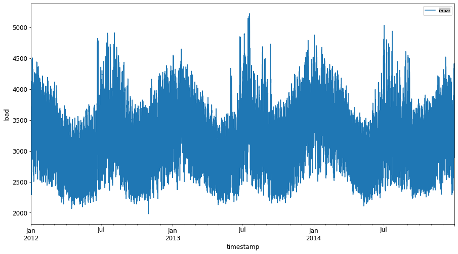
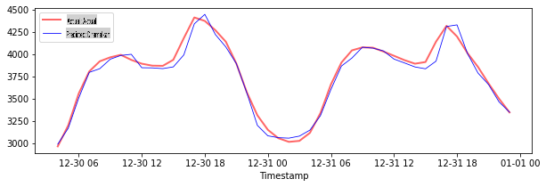

# Ramalan Siri Masa dengan Support Vector Regressor

Dalam pelajaran sebelumnya, anda telah belajar cara menggunakan model ARIMA untuk membuat ramalan siri masa. Sekarang anda akan melihat model Support Vector Regressor yang merupakan model regressor yang digunakan untuk meramalkan data berterusan.

## [Kuiz Pra-ceramah](https://gray-sand-07a10f403.1.azurestaticapps.net/quiz/51/) 

## Pengenalan

Dalam pelajaran ini, anda akan menemui cara khusus untuk membina model dengan [**SVM**: **S**upport **V**ector **M**achine](https://en.wikipedia.org/wiki/Support-vector_machine) untuk regresi, atau **SVR: Support Vector Regressor**. 

### SVR dalam konteks siri masa [^1]

Sebelum memahami kepentingan SVR dalam ramalan siri masa, berikut adalah beberapa konsep penting yang perlu anda ketahui:

- **Regresi:** Teknik pembelajaran terkawal untuk meramalkan nilai berterusan dari set input yang diberikan. Ideanya adalah untuk memadankan lengkung (atau garis) dalam ruang ciri yang mempunyai bilangan titik data maksimum. [Klik di sini](https://en.wikipedia.org/wiki/Regression_analysis) untuk maklumat lanjut.
- **Support Vector Machine (SVM):** Jenis model pembelajaran mesin terkawal yang digunakan untuk klasifikasi, regresi dan pengesanan pencilan. Model ini adalah hyperplane dalam ruang ciri, yang dalam kes klasifikasi bertindak sebagai sempadan, dan dalam kes regresi bertindak sebagai garis padanan terbaik. Dalam SVM, fungsi Kernel biasanya digunakan untuk mengubah set data ke ruang dengan bilangan dimensi yang lebih tinggi, supaya mereka dapat dipisahkan dengan mudah. [Klik di sini](https://en.wikipedia.org/wiki/Support-vector_machine) untuk maklumat lanjut mengenai SVM.
- **Support Vector Regressor (SVR):** Jenis SVM, untuk mencari garis padanan terbaik (yang dalam kes SVM adalah hyperplane) yang mempunyai bilangan titik data maksimum.

### Mengapa SVR? [^1]

Dalam pelajaran lepas anda belajar tentang ARIMA, yang merupakan kaedah statistik linear yang sangat berjaya untuk meramalkan data siri masa. Walau bagaimanapun, dalam banyak kes, data siri masa mempunyai *non-linearity*, yang tidak dapat dipetakan oleh model linear. Dalam kes sedemikian, keupayaan SVM untuk mempertimbangkan non-linearity dalam data untuk tugas regresi menjadikan SVR berjaya dalam ramalan siri masa.

## Latihan - bina model SVR

Langkah pertama untuk penyediaan data adalah sama seperti pelajaran sebelumnya mengenai [ARIMA](https://github.com/microsoft/ML-For-Beginners/tree/main/7-TimeSeries/2-ARIMA). 

Buka folder [_/working_](https://github.com/microsoft/ML-For-Beginners/tree/main/7-TimeSeries/3-SVR/working) dalam pelajaran ini dan cari fail [_notebook.ipynb_](https://github.com/microsoft/ML-For-Beginners/blob/main/7-TimeSeries/3-SVR/working/notebook.ipynb).[^2]

1. Jalankan notebook dan import perpustakaan yang diperlukan:  [^2]

   ```python
   import sys
   sys.path.append('../../')
   ```

   ```python
   import os
   import warnings
   import matplotlib.pyplot as plt
   import numpy as np
   import pandas as pd
   import datetime as dt
   import math
   
   from sklearn.svm import SVR
   from sklearn.preprocessing import MinMaxScaler
   from common.utils import load_data, mape
   ```

2. Muatkan data dari fail `/data/energy.csv` ke dalam dataframe Pandas dan lihat:  [^2]

   ```python
   energy = load_data('../../data')[['load']]
   ```

3. Plot semua data tenaga yang tersedia dari Januari 2012 hingga Disember 2014: [^2]

   ```python
   energy.plot(y='load', subplots=True, figsize=(15, 8), fontsize=12)
   plt.xlabel('timestamp', fontsize=12)
   plt.ylabel('load', fontsize=12)
   plt.show()
   ```

   

   Sekarang, mari bina model SVR kita.

### Buat dataset latihan dan ujian

Sekarang data anda dimuatkan, anda boleh memisahkannya ke dalam set latihan dan ujian. Kemudian anda akan mengubah bentuk data untuk mencipta dataset berdasarkan langkah masa yang diperlukan untuk SVR. Anda akan melatih model anda pada set latihan. Selepas model selesai latihan, anda akan menilai ketepatannya pada set latihan, set ujian dan kemudian keseluruhan dataset untuk melihat prestasi keseluruhan. Anda perlu memastikan bahawa set ujian meliputi tempoh masa yang lebih lewat dari set latihan untuk memastikan model tidak mendapat maklumat dari tempoh masa depan [^2] (situasi yang dikenali sebagai *Overfitting*).

1. Peruntukkan tempoh dua bulan dari 1 September hingga 31 Oktober 2014 ke set latihan. Set ujian akan merangkumi tempoh dua bulan dari 1 November hingga 31 Disember 2014: [^2]

   ```python
   train_start_dt = '2014-11-01 00:00:00'
   test_start_dt = '2014-12-30 00:00:00'
   ```

2. Visualisasikan perbezaannya: [^2]

   ```python
   energy[(energy.index < test_start_dt) & (energy.index >= train_start_dt)][['load']].rename(columns={'load':'train'}) \
       .join(energy[test_start_dt:][['load']].rename(columns={'load':'test'}), how='outer') \
       .plot(y=['train', 'test'], figsize=(15, 8), fontsize=12)
   plt.xlabel('timestamp', fontsize=12)
   plt.ylabel('load', fontsize=12)
   plt.show()
   ```

   


### Sediakan data untuk latihan

Sekarang, anda perlu menyediakan data untuk latihan dengan melakukan penapisan dan penskalaan data anda. Tapis dataset anda untuk hanya merangkumi tempoh masa dan lajur yang anda perlukan, dan penskalaan untuk memastikan data diproyeksikan dalam julat 0,1.

1. Tapis dataset asal untuk hanya merangkumi tempoh masa yang disebutkan di atas per set dan hanya termasuk lajur 'load' yang diperlukan serta tarikh: [^2]

   ```python
   train = energy.copy()[(energy.index >= train_start_dt) & (energy.index < test_start_dt)][['load']]
   test = energy.copy()[energy.index >= test_start_dt][['load']]
   
   print('Training data shape: ', train.shape)
   print('Test data shape: ', test.shape)
   ```

   ```output
   Training data shape:  (1416, 1)
   Test data shape:  (48, 1)
   ```
   
2. Skala data latihan untuk berada dalam julat (0, 1): [^2]

   ```python
   scaler = MinMaxScaler()
   train['load'] = scaler.fit_transform(train)
   ```
   
4. Sekarang, anda skala data ujian: [^2]

   ```python
   test['load'] = scaler.transform(test)
   ```

### Cipta data dengan langkah masa [^1]

Untuk SVR, anda mengubah input data menjadi bentuk `[batch, timesteps]`. So, you reshape the existing `train_data` and `test_data` supaya terdapat dimensi baru yang merujuk kepada langkah masa. 

```python
# Converting to numpy arrays
train_data = train.values
test_data = test.values
```

Untuk contoh ini, kita ambil `timesteps = 5`. Jadi, input kepada model adalah data untuk 4 langkah masa pertama, dan output akan menjadi data untuk langkah masa ke-5.

```python
timesteps=5
```

Menukar data latihan kepada tensor 2D menggunakan senarai bersarang:

```python
train_data_timesteps=np.array([[j for j in train_data[i:i+timesteps]] for i in range(0,len(train_data)-timesteps+1)])[:,:,0]
train_data_timesteps.shape
```

```output
(1412, 5)
```

Menukar data ujian kepada tensor 2D:

```python
test_data_timesteps=np.array([[j for j in test_data[i:i+timesteps]] for i in range(0,len(test_data)-timesteps+1)])[:,:,0]
test_data_timesteps.shape
```

```output
(44, 5)
```

 Memilih input dan output dari data latihan dan ujian:

```python
x_train, y_train = train_data_timesteps[:,:timesteps-1],train_data_timesteps[:,[timesteps-1]]
x_test, y_test = test_data_timesteps[:,:timesteps-1],test_data_timesteps[:,[timesteps-1]]

print(x_train.shape, y_train.shape)
print(x_test.shape, y_test.shape)
```

```output
(1412, 4) (1412, 1)
(44, 4) (44, 1)
```

### Laksanakan SVR [^1]

Sekarang, tiba masanya untuk melaksanakan SVR. Untuk membaca lebih lanjut mengenai pelaksanaan ini, anda boleh merujuk kepada [dokumentasi ini](https://scikit-learn.org/stable/modules/generated/sklearn.svm.SVR.html). Untuk pelaksanaan kita, kita ikut langkah-langkah ini:

  1. Tentukan model dengan memanggil `SVR()` and passing in the model hyperparameters: kernel, gamma, c and epsilon
  2. Prepare the model for the training data by calling the `fit()` function
  3. Make predictions calling the `predict()` function

Sekarang kita cipta model SVR. Di sini kita gunakan [RBF kernel](https://scikit-learn.org/stable/modules/svm.html#parameters-of-the-rbf-kernel), dan tetapkan hyperparameters gamma, C dan epsilon sebagai 0.5, 10 dan 0.05 masing-masing.

```python
model = SVR(kernel='rbf',gamma=0.5, C=10, epsilon = 0.05)
```

#### Latih model pada data latihan [^1]

```python
model.fit(x_train, y_train[:,0])
```

```output
SVR(C=10, cache_size=200, coef0=0.0, degree=3, epsilon=0.05, gamma=0.5,
    kernel='rbf', max_iter=-1, shrinking=True, tol=0.001, verbose=False)
```

#### Buat ramalan model [^1]

```python
y_train_pred = model.predict(x_train).reshape(-1,1)
y_test_pred = model.predict(x_test).reshape(-1,1)

print(y_train_pred.shape, y_test_pred.shape)
```

```output
(1412, 1) (44, 1)
```

Anda telah membina SVR anda! Sekarang kita perlu menilai ia.

### Nilai model anda [^1]

Untuk penilaian, pertama kita akan skala kembali data ke skala asal kita. Kemudian, untuk memeriksa prestasi, kita akan plot siri masa asal dan ramalan, dan juga cetak keputusan MAPE.

Skala data ramalan dan output asal:

```python
# Scaling the predictions
y_train_pred = scaler.inverse_transform(y_train_pred)
y_test_pred = scaler.inverse_transform(y_test_pred)

print(len(y_train_pred), len(y_test_pred))
```

```python
# Scaling the original values
y_train = scaler.inverse_transform(y_train)
y_test = scaler.inverse_transform(y_test)

print(len(y_train), len(y_test))
```

#### Periksa prestasi model pada data latihan dan ujian [^1]

Kita ekstrak cap waktu dari dataset untuk ditunjukkan pada paksi-x plot kita. Perhatikan bahawa kita menggunakan ```timesteps-1``` nilai pertama sebagai input untuk output pertama, jadi cap waktu untuk output akan bermula selepas itu.

```python
train_timestamps = energy[(energy.index < test_start_dt) & (energy.index >= train_start_dt)].index[timesteps-1:]
test_timestamps = energy[test_start_dt:].index[timesteps-1:]

print(len(train_timestamps), len(test_timestamps))
```

```output
1412 44
```

Plot ramalan untuk data latihan:

```python
plt.figure(figsize=(25,6))
plt.plot(train_timestamps, y_train, color = 'red', linewidth=2.0, alpha = 0.6)
plt.plot(train_timestamps, y_train_pred, color = 'blue', linewidth=0.8)
plt.legend(['Actual','Predicted'])
plt.xlabel('Timestamp')
plt.title("Training data prediction")
plt.show()
```


Cetak MAPE untuk data latihan

```python
print('MAPE for training data: ', mape(y_train_pred, y_train)*100, '%')
```

```output
MAPE for training data: 1.7195710200875551 %
```

Plot ramalan untuk data ujian

```python
plt.figure(figsize=(10,3))
plt.plot(test_timestamps, y_test, color = 'red', linewidth=2.0, alpha = 0.6)
plt.plot(test_timestamps, y_test_pred, color = 'blue', linewidth=0.8)
plt.legend(['Actual','Predicted'])
plt.xlabel('Timestamp')
plt.show()
```



Cetak MAPE untuk data ujian

```python
print('MAPE for testing data: ', mape(y_test_pred, y_test)*100, '%')
```

```output
MAPE for testing data:  1.2623790187854018 %
```

🏆 Anda mempunyai hasil yang sangat baik pada dataset ujian!

### Periksa prestasi model pada dataset penuh [^1]

```python
# Extracting load values as numpy array
data = energy.copy().values

# Scaling
data = scaler.transform(data)

# Transforming to 2D tensor as per model input requirement
data_timesteps=np.array([[j for j in data[i:i+timesteps]] for i in range(0,len(data)-timesteps+1)])[:,:,0]
print("Tensor shape: ", data_timesteps.shape)

# Selecting inputs and outputs from data
X, Y = data_timesteps[:,:timesteps-1],data_timesteps[:,[timesteps-1]]
print("X shape: ", X.shape,"\nY shape: ", Y.shape)
```

```output
Tensor shape:  (26300, 5)
X shape:  (26300, 4) 
Y shape:  (26300, 1)
```

```python
# Make model predictions
Y_pred = model.predict(X).reshape(-1,1)

# Inverse scale and reshape
Y_pred = scaler.inverse_transform(Y_pred)
Y = scaler.inverse_transform(Y)
```

```python
plt.figure(figsize=(30,8))
plt.plot(Y, color = 'red', linewidth=2.0, alpha = 0.6)
plt.plot(Y_pred, color = 'blue', linewidth=0.8)
plt.legend(['Actual','Predicted'])
plt.xlabel('Timestamp')
plt.show()
```


```python
print('MAPE: ', mape(Y_pred, Y)*100, '%')
```

```output
MAPE:  2.0572089029888656 %
```


🏆 Plot yang sangat bagus, menunjukkan model dengan ketepatan yang baik. Syabas!

---

## 🚀Cabaran

- Cuba ubah hyperparameters (gamma, C, epsilon) semasa mencipta model dan nilai pada data untuk melihat set hyperparameters mana yang memberikan hasil terbaik pada data ujian. Untuk mengetahui lebih lanjut mengenai hyperparameters ini, anda boleh merujuk kepada dokumen [di sini](https://scikit-learn.org/stable/modules/svm.html#parameters-of-the-rbf-kernel). 
- Cuba gunakan fungsi kernel yang berbeza untuk model dan analisis prestasi mereka pada dataset. Dokumen yang berguna boleh didapati [di sini](https://scikit-learn.org/stable/modules/svm.html#kernel-functions).
- Cuba gunakan nilai yang berbeza untuk `timesteps` untuk model melihat ke belakang untuk membuat ramalan.

## [Kuiz Pasca-ceramah](https://gray-sand-07a10f403.1.azurestaticapps.net/quiz/52/)

## Ulasan & Kajian Kendiri

Pelajaran ini adalah untuk memperkenalkan aplikasi SVR untuk Ramalan Siri Masa. Untuk membaca lebih lanjut mengenai SVR, anda boleh merujuk kepada [blog ini](https://www.analyticsvidhya.com/blog/2020/03/support-vector-regression-tutorial-for-machine-learning/). [Dokumentasi ini pada scikit-learn](https://scikit-learn.org/stable/modules/svm.html) menyediakan penjelasan yang lebih komprehensif mengenai SVM secara umum, [SVRs](https://scikit-learn.org/stable/modules/svm.html#regression) dan juga butiran pelaksanaan lain seperti pelbagai [fungsi kernel](https://scikit-learn.org/stable/modules/svm.html#kernel-functions) yang boleh digunakan, dan parameter mereka.

## Tugasan

[Sebuah model SVR baru](assignment.md)


## Kredit


[^1]: Teks, kod dan output dalam seksyen ini disumbangkan oleh [@AnirbanMukherjeeXD](https://github.com/AnirbanMukherjeeXD)
[^2]: Teks, kod dan output dalam seksyen ini diambil dari [ARIMA](https://github.com/microsoft/ML-For-Beginners/tree/main/7-TimeSeries/2-ARIMA)

**Penafian**:
Dokumen ini telah diterjemahkan menggunakan perkhidmatan terjemahan AI berasaskan mesin. Walaupun kami berusaha untuk ketepatan, sila ambil perhatian bahawa terjemahan automatik mungkin mengandungi kesilapan atau ketidaktepatan. Dokumen asal dalam bahasa asalnya harus dianggap sebagai sumber yang berwibawa. Untuk maklumat penting, terjemahan manusia profesional adalah disyorkan. Kami tidak bertanggungjawab atas sebarang salah faham atau salah tafsir yang timbul daripada penggunaan terjemahan ini.