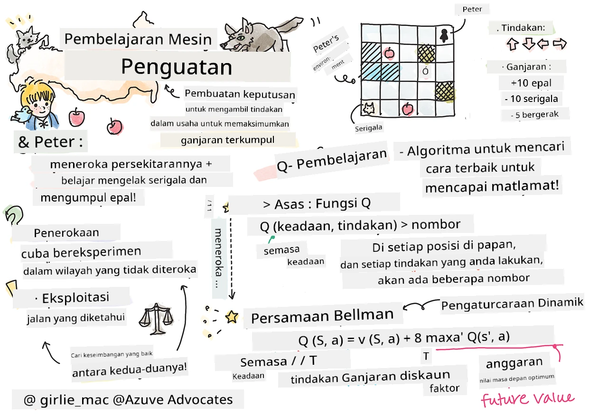

# Pengenalan kepada Pembelajaran Pengukuhan dan Q-Pembelajaran


> Sketchnote oleh [Tomomi Imura](https://www.twitter.com/girlie_mac)

Pembelajaran pengukuhan melibatkan tiga konsep penting: ejen, beberapa keadaan, dan satu set tindakan bagi setiap keadaan. Dengan melaksanakan satu tindakan dalam keadaan tertentu, ejen diberi ganjaran. Bayangkan sekali lagi permainan komputer Super Mario. Anda adalah Mario, anda berada dalam satu tingkat permainan, berdiri di tepi tebing. Di atas anda terdapat sebuah syiling. Anda sebagai Mario, dalam satu tingkat permainan, pada kedudukan tertentu ... itu adalah keadaan anda. Bergerak satu langkah ke kanan (tindakan) akan membawa anda ke tepi tebing, dan itu akan memberikan skor nombor yang rendah. Namun, menekan butang lompat akan membolehkan anda mendapat mata dan anda akan terus hidup. Itu adalah hasil yang positif dan harus memberikannya skor nombor positif.

Dengan menggunakan pembelajaran pengukuhan dan simulator (permainan), anda boleh belajar bagaimana untuk bermain permainan itu bagi memaksimumkan ganjaran iaitu terus hidup dan mendapatkan sebanyak mungkin mata.

[](https://www.youtube.com/watch?v=lDq_en8RNOo)

> 🎥 Klik imej di atas untuk mendengar Dmitry membincangkan Pembelajaran Pengukuhan

## [Kuis Pra-ceramah](https://ff-quizzes.netlify.app/en/ml/)

## Prasyarat dan Persediaan

Dalam pelajaran ini, kita akan bereksperimen dengan beberapa kod dalam Python. Anda harus dapat menjalankan kod Jupyter Notebook dari pelajaran ini, sama ada di komputer anda atau di awan.

Anda boleh membuka [notebook pelajaran](https://github.com/microsoft/ML-For-Beginners/blob/main/8-Reinforcement/1-QLearning/notebook.ipynb) dan melalui pelajaran ini untuk membina.

> **Nota:** Jika anda membuka kod ini dari awan, anda juga perlu memuat turun fail [`rlboard.py`](https://github.com/microsoft/ML-For-Beginners/blob/main/8-Reinforcement/1-QLearning/rlboard.py), yang digunakan dalam kod notebook. Letakkan di direktori yang sama dengan notebook.

## Pengenalan

Dalam pelajaran ini, kita akan meneroka dunia **[Peter dan Serigala](https://en.wikipedia.org/wiki/Peter_and_the_Wolf)**, diilhamkan oleh dongeng muzik oleh komposer Rusia, [Sergei Prokofiev](https://en.wikipedia.org/wiki/Sergei_Prokofiev). Kita akan menggunakan **Pembelajaran Pengukuhan** untuk membiarkan Peter meneroka persekitarannya, mengutip epal yang lazat dan mengelakkan bertemu serigala.

**Pembelajaran Pengukuhan** (RL) adalah teknik pembelajaran yang membolehkan kita mempelajari kelakuan optimum seorang **ejen** dalam sesuatu **persekitaran** dengan menjalankan banyak eksperimen. Seorang ejen dalam persekitaran ini harus mempunyai **matlamat**, yang ditakrifkan oleh **fungsi ganjaran**.

## Persekitaran

Untuk kesederhanaan, mari anggap dunia Peter adalah papan segi empat berukuran `lebar` x `tinggi`, seperti ini:


Setiap sel di papan ini boleh menjadi:

* **tanah**, di atasnya Peter dan makhluk lain boleh berjalan.
* **air**, di mana anda sudah tentu tidak boleh berjalan.
* **pokok** atau **rumput**, tempat anda boleh berehat.
* sebuah **epal**, yang mewakili sesuatu yang gembira Peter untuk menemukannya bagi memberikan makan pada dirinya.
* sebuah **serigala**, yang berbahaya dan harus dielakkan.

Terdapat modul Python berasingan, [`rlboard.py`](https://github.com/microsoft/ML-For-Beginners/blob/main/8-Reinforcement/1-QLearning/rlboard.py), yang mengandungi kod untuk bekerja dengan persekitaran ini. Oleh kerana kod ini tidak penting untuk memahami konsep kita, kita akan mengimport modul dan menggunakannya untuk membuat papan contoh (blok kod 1):

```python
from rlboard import *

width, height = 8,8
m = Board(width,height)
m.randomize(seed=13)
m.plot()
```

Kod ini harus mencetak gambar persekitaran yang serupa dengan yang di atas.

## Tindakan dan polisi

Dalam contoh kita, matlamat Peter adalah untuk dapat mencari epal, sambil mengelakkan serigala dan halangan lain. Untuk melakukan ini, dia boleh berjalan di sekeliling sehingga dia menemui epal.

Oleh itu, pada kedudukan mana-mana, dia boleh memilih antara salah satu tindakan berikut: atas, bawah, kiri dan kanan.

Kita akan mentakrifkan tindakan ini sebagai kamus, dan menghubungkannya dengan pasangan perubahan koordinat yang sepadan. Contohnya, bergerak ke kanan (`R`) akan bersamaan dengan pasangan `(1,0)`. (blok kod 2):

```python
actions = { "U" : (0,-1), "D" : (0,1), "L" : (-1,0), "R" : (1,0) }
action_idx = { a : i for i,a in enumerate(actions.keys()) }
```

Ringkasnya, strategi dan matlamat senario ini adalah seperti berikut:

- **Strategi**, ejen kita (Peter) ditakrifkan oleh apa yang dinamakan **polisi**. Polisi adalah fungsi yang mengembalikan tindakan pada mana-mana keadaan tertentu. Dalam kes kita, keadaan masalah diwakili oleh papan, termasuk kedudukan pemain semasa.

- **Matlamat**, pembelajaran pengukuhan adalah untuk akhirnya mempelajari polisi yang baik yang membolehkan kita menyelesaikan masalah dengan cekap. Namun sebagai asas, mari kita anggap polisi paling mudah dipanggil **jalan rawak**.

## Jalan Random

Mari kita selesaikan masalah kita dengan melaksanakan strategi jalan rawak. Dengan jalan rawak, kita akan memilih tindakan seterusnya secara rawak dari tindakan yang dibenarkan, sehingga kita mencapai epal (blok kod 3).

1. Laksanakan jalan rawak dengan kod di bawah:

    ```python
    def random_policy(m):
        return random.choice(list(actions))
    
    def walk(m,policy,start_position=None):
        n = 0 # bilangan langkah
        # tetapkan kedudukan awal
        if start_position:
            m.human = start_position 
        else:
            m.random_start()
        while True:
            if m.at() == Board.Cell.apple:
                return n # berjaya!
            if m.at() in [Board.Cell.wolf, Board.Cell.water]:
                return -1 # dimakan oleh serigala atau lemas
            while True:
                a = actions[policy(m)]
                new_pos = m.move_pos(m.human,a)
                if m.is_valid(new_pos) and m.at(new_pos)!=Board.Cell.water:
                    m.move(a) # lakukan langkah sebenar
                    break
            n+=1
    
    walk(m,random_policy)
    ```

    Panggilan kepada `walk` harus mengembalikan panjang laluan yang sepadan, yang boleh berubah-ubah dari satu larian ke larian lain.

1. Jalankan eksperimen jalanan ini beberapa kali (katakan, 100), dan cetak statistik hasilnya (blok kod 4):

    ```python
    def print_statistics(policy):
        s,w,n = 0,0,0
        for _ in range(100):
            z = walk(m,policy)
            if z<0:
                w+=1
            else:
                s += z
                n += 1
        print(f"Average path length = {s/n}, eaten by wolf: {w} times")
    
    print_statistics(random_policy)
    ```

    Perhatikan bahawa panjang purata laluan adalah kira-kira 30-40 langkah, yang agak banyak, memandangkan jarak purata ke epal terdekat adalah kira-kira 5-6 langkah.

    Anda juga boleh lihat bagaimana pergerakan Peter semasa jalan rawak:

    

## Fungsi ganjaran

Untuk menjadikan polisi kita lebih bijak, kita perlu faham tindakan mana yang "lebih baik" daripada yang lain. Untuk ini, kita perlu mendefinisikan matlamat kita.

Matlamat boleh ditakrifkan dari segi **fungsi ganjaran**, yang akan mengembalikan nilai skor untuk setiap keadaan. Semakin tinggi nombor, semakin baik fungsi ganjaran itu. (blok kod 5)

```python
move_reward = -0.1
goal_reward = 10
end_reward = -10

def reward(m,pos=None):
    pos = pos or m.human
    if not m.is_valid(pos):
        return end_reward
    x = m.at(pos)
    if x==Board.Cell.water or x == Board.Cell.wolf:
        return end_reward
    if x==Board.Cell.apple:
        return goal_reward
    return move_reward
```

Perkara yang menarik mengenai fungsi ganjaran adalah bahawa dalam kebanyakan kes, *kita hanya diberikan ganjaran yang ketara pada akhir permainan*. Ini bermakna algoritma kita harus ingat langkah "baik" yang membawa kepada ganjaran positif pada akhirnya, dan meningkatkan kepentingannya. Begitu juga, semua tindakan yang membawa kepada keputusan buruk harus dielakkan.

## Q-Pembelajaran

Algoritma yang akan kita bincangkan di sini dipanggil **Q-Pembelajaran**. Dalam algoritma ini, polisi ditakrifkan oleh fungsi (atau struktur data) yang dipanggil **Q-Jadual**. Ia merekodkan "kebaikan" setiap tindakan dalam keadaan tertentu.

Ia dinamakan Q-Jadual kerana sering mudah diwakili sebagai jadual, atau array berbilang dimensi. Oleh kerana papan kita mempunyai dimensi `lebar` x `tinggi`, kita boleh mewakilkan Q-Jadual menggunakan numpy array dengan bentuk `lebar` x `tinggi` x `len(actions)`: (blok kod 6)

```python
Q = np.ones((width,height,len(actions)),dtype=np.float)*1.0/len(actions)
```

Perhatikan bahawa kita memulakan semua nilai Q-Jadual dengan nilai yang sama, dalam kes kita - 0.25. Ini sepadan dengan polisi "jalan rawak", kerana semua tindakan dalam setiap keadaan adalah sama baiknya. Kita boleh menghantar Q-Jadual kepada fungsi `plot` untuk memvisualkan jadual pada papan: `m.plot(Q)`.


Di tengah setiap sel terdapat "anak panah" yang menunjukkan arah pergerakan pilihan. Oleh kerana semua arah adalah sama, satu titik dipaparkan.

Sekarang kita perlu menjalankan simulasi, meneroka persekitaran kita, dan mempelajari taburan nilai Q-Jadual yang lebih baik, yang akan membolehkan kita mencari jalan ke epal lebih cepat.

## Inti pati Q-Pembelajaran: Persamaan Bellman

Setelah kita mula bergerak, setiap tindakan akan mempunyai ganjaran yang sepadan, iaitu secara teori kita boleh memilih tindakan seterusnya berdasarkan ganjaran segera tertinggi. Namun, dalam kebanyakan keadaan, tindakan itu tidak akan mencapai matlamat kita untuk sampai ke epal, dan oleh itu kita tidak boleh segera memutuskan arah mana yang lebih baik.

> Ingat bahawa bukan hasil segera yang penting, tetapi hasil akhir, yang akan kita peroleh pada akhir simulasi.

Untuk mengambil kira ganjaran tertunda ini, kita perlu menggunakan prinsip **[pengaturcaraan dinamik](https://en.wikipedia.org/wiki/Dynamic_programming)**, yang membolehkan kita memikirkan masalah kita secara rekursif.

Andaikan kita kini berada di keadaan *s*, dan kita ingin bergerak ke keadaan seterusnya *s'*. Dengan melakukan ini, kita akan menerima ganjaran segera *r(s,a)*, yang ditakrifkan oleh fungsi ganjaran, ditambah sedikit ganjaran masa depan. Jika kita andaikan Q-Jadual kita mencerminkan dengan betul "daya tarik" setiap tindakan, maka pada keadaan *s'* kita akan memilih tindakan *a* yang bersamaan dengan nilai maksimum *Q(s',a')*. Oleh itu, ganjaran masa depan terbaik yang boleh kita perolehi pada keadaan *s* akan ditakrifkan sebagai `max`<sub>a'</sub>*Q(s',a')* (maksimum di sini dikira atas semua tindakan yang mungkin *a'* pada keadaan *s'*).

Ini memberikan **formula Bellman** untuk mengira nilai Q-Jadual pada keadaan *s*, bagi tindakan *a*:


Di sini γ adalah apa yang dinamakan **faktor diskaun** yang menentukan sejauh mana anda harus mengutamakan ganjaran semasa dibandingkan dengan ganjaran masa depan dan sebaliknya.

## Algoritma Pembelajaran

Berdasarkan persamaan di atas, kita kini boleh menulis pseudo-kod untuk algoritma pembelajaran kita:

* Inisialisasi Q-Jadual Q dengan nombor sama rata untuk semua keadaan dan tindakan
* Tetapkan kadar pembelajaran α ← 1
* Ulang simulasi banyak kali
   1. Mulakan di kedudukan rawak
   1. Ulang
        1. Pilih tindakan *a* pada keadaan *s*
        2. Laksanakan tindakan dengan bergerak ke keadaan baru *s'*
        3. Jika kita menemui kondisi tamat permainan, atau jumlah ganjaran terlalu kecil - keluar dari simulasi  
        4. Kira ganjaran *r* pada keadaan baru
        5. Kemas kini Fungsi Q menurut persamaan Bellman: *Q(s,a)* ← *(1-α)Q(s,a)+α(r+γ max<sub>a'</sub>Q(s',a'))*
        6. *s* ← *s'*
        7. Kemas kini jumlah ganjaran dan kurangkan α.

## Eksploitasi vs. Eksplorasi

Dalam algoritma di atas, kita tidak nyatakan bagaimana tepatnya kita harus memilih tindakan pada langkah 2.1. Jika kita memilih tindakan secara rawak, kita akan secara rawak **menjelajah** persekitaran, dan kita cukup mungkin untuk mati kerap serta menjelajah kawasan yang biasanya tidak kita lawati. Pendekatan alternatif adalah untuk **mengeksploitasi** nilai Q-Jadual yang sudah kita tahu, dan dengan itu memilih tindakan terbaik (dengan nilai Q-Jadual lebih tinggi) pada keadaan *s*. Namun, ini akan menghalang kita daripada meneroka keadaan lain, dan kemungkinan kita tidak akan menemui penyelesaian optimum.

Oleh itu, pendekatan terbaik adalah untuk mencari keseimbangan antara eksplorasi dan eksploitasi. Ini boleh dilakukan dengan memilih tindakan pada keadaan *s* dengan kebarangkalian yang berkadar dengan nilai dalam Q-Jadual. Pada mulanya, apabila nilai Q-Jadual semuanya sama, ia bersamaan dengan pemilihan rawak, tetapi apabila kita belajar lebih banyak tentang persekitaran kita, kita akan lebih cenderung mengikuti laluan optimum sambil membenarkan ejen memilih laluan yang belum diterokai sekali-sekala.

## Pelaksanaan dalam Python

Kini kita sudah bersedia untuk melaksanakan algoritma pembelajaran. Sebelum kita lakukan itu, kita juga perlu fungsi yang menukar nombor sebarang dalam Q-Jadual kepada vektor kebarangkalian bagi tindakan yang sepadan.

1. Buat fungsi `probs()`:

    ```python
    def probs(v,eps=1e-4):
        v = v-v.min()+eps
        v = v/v.sum()
        return v
    ```

    Kita tambah sedikit `eps` ke vektor asal untuk mengelakkan pembahagian dengan 0 dalam kes permulaan, apabila semua komponen vektor adalah seragam.

Jalankan algoritma pembelajaran melalui 5000 eksperimen, juga dipanggil **epok**: (blok kod 8)
```python
    for epoch in range(5000):
    
        # Pilih titik awal
        m.random_start()
        
        # Mulakan perjalanan
        n=0
        cum_reward = 0
        while True:
            x,y = m.human
            v = probs(Q[x,y])
            a = random.choices(list(actions),weights=v)[0]
            dpos = actions[a]
            m.move(dpos,check_correctness=False) # kami membenarkan pemain bergerak di luar papan, yang menamatkan episod
            r = reward(m)
            cum_reward += r
            if r==end_reward or cum_reward < -1000:
                lpath.append(n)
                break
            alpha = np.exp(-n / 10e5)
            gamma = 0.5
            ai = action_idx[a]
            Q[x,y,ai] = (1 - alpha) * Q[x,y,ai] + alpha * (r + gamma * Q[x+dpos[0], y+dpos[1]].max())
            n+=1
```

Selepas melaksanakan algoritma ini, Q-Jadual harus dikemas kini dengan nilai yang menentukan daya tarik tindakan yang berbeza di setiap langkah. Kita boleh cuba memvisualkan Q-Jadual dengan melukis vektor pada setiap sel yang akan menunjuk ke arah pergerakan yang diinginkan. Untuk kesederhanaan, kita lukis bulatan kecil menggantikan kepala anak panah.


## Memeriksa polisi

Oleh kerana Q-Jadual menyenaraikan "daya tarik" setiap tindakan pada setiap keadaan, agak mudah untuk menggunakannya untuk mentakrifkan navigasi yang berkesan dalam dunia kita. Dalam kes paling mudah, kita boleh memilih tindakan yang sepadan dengan nilai Q-Jadual tertinggi: (blok kod 9)

```python
def qpolicy_strict(m):
        x,y = m.human
        v = probs(Q[x,y])
        a = list(actions)[np.argmax(v)]
        return a

walk(m,qpolicy_strict)
```


> Jika anda mencuba kod di atas beberapa kali, anda mungkin perasan bahawa kadangkala ia "terhenti", dan anda perlu menekan butang STOP dalam notebook untuk mengganggu ia. Ini berlaku kerana mungkin terdapat situasi di mana dua keadaan "menunjuk" antara satu sama lain dari segi nilai Q-Optimum, dalam kes ini agen berakhir bergerak antara keadaan tersebut tanpa henti.

## 🚀Cabaran

> **Tugas 1:** Ubah fungsi `walk` untuk mengehadkan panjang maksimum laluan dengan sejumlah langkah tertentu (katakan, 100), dan lihat kod di atas mengembalikan nilai ini dari semasa ke semasa.

> **Tugas 2:** Ubah fungsi `walk` supaya ia tidak kembali ke tempat yang telah dikunjungi sebelum ini. Ini akan menghalang `walk` daripada berulang, namun, agen masih boleh terperangkap di lokasi yang tidak dapat ia lepaskan.

## Navigasi

Polisi navigasi yang lebih baik adalah yang kami guna semasa latihan, yang menggabungkan eksploitasi dan penerokaan. Dalam polisi ini, kita akan memilih setiap tindakan dengan kebarangkalian tertentu, berkadar dengan nilai dalam Q-Table. Strategi ini masih boleh menyebabkan agen kembali ke posisi yang telah diterokai, tetapi, seperti yang anda lihat dari kod di bawah, ia menghasilkan laluan purata yang sangat pendek ke lokasi dikehendaki (ingat bahawa `print_statistics` menjalankan simulasi 100 kali): (blok kod 10)

```python
def qpolicy(m):
        x,y = m.human
        v = probs(Q[x,y])
        a = random.choices(list(actions),weights=v)[0]
        return a

print_statistics(qpolicy)
```

Selepas menjalankan kod ini, anda sepatutnya mendapat panjang laluan purata yang jauh lebih kecil daripada sebelumnya, dalam julat 3-6.

## Menyelidik proses pembelajaran

Seperti yang telah disebut, proses pembelajaran adalah keseimbangan antara penerokaan dan eksploitasi pengetahuan yang diperoleh tentang struktur ruang masalah. Kami telah melihat bahawa hasil pembelajaran (keupayaan untuk membantu agen mencari laluan pendek ke matlamat) telah bertambah baik, tetapi menarik juga untuk melihat bagaimana panjang laluan purata bertindak semasa proses pembelajaran:


Pembelajaran boleh diringkaskan seperti berikut:

- **Panjang laluan purata meningkat**. Apa yang kita lihat di sini ialah pada mulanya, panjang laluan purata meningkat. Ini mungkin disebabkan fakta apabila kita tidak mengetahui apa-apa tentang persekitaran, kita cenderung terperangkap di keadaan buruk, air atau serigala. Apabila kita belajar lebih dan mula menggunakan pengetahuan ini, kita boleh meneroka persekitaran lebih lama, namun kita masih belum mengetahui lokasi epal dengan baik.

- **Panjang laluan berkurang, apabila kita belajar lebih banyak**. Setelah kita belajar cukup, menjadi lebih mudah untuk agen mencapai matlamat, dan panjang laluan mula berkurang. Namun, kita masih terbuka kepada penerokaan, jadi sering kali kita menyimpang daripada laluan terbaik, dan meneroka pilihan baru, menjadikan laluan lebih panjang daripada optimum.

- **Panjang meningkat dengan mendadak**. Apa yang juga kita perhatikan dalam graf ini ialah pada suatu ketika, panjang meningkat secara mendadak. Ini menunjukkan sifat stokastik proses ini, dan bahawa pada suatu ketika kita boleh "merosakkan" pekali Q-Table dengan menimpanya dengan nilai baru. Ini seharusnya diminimumkan dengan mengurangkan kadar pembelajaran (contohnya, menjelang akhir latihan, kita hanya menyesuaikan nilai Q-Table dengan nilai kecil).

Secara keseluruhan, penting untuk diingat bahawa kejayaan dan kualiti proses pembelajaran sangat bergantung pada parameter, seperti kadar pembelajaran, pengurangan kadar pembelajaran, dan faktor diskaun. Ini sering dipanggil **hyperparameter**, untuk membezakan mereka daripada **parameter**, yang kita optima semasa latihan (contohnya, pekali Q-Table). Proses mencari nilai hyperparameter terbaik dipanggil **pengoptimuman hyperparameter**, dan ia layak mendapat topik khas.

## [Kuiz selepas kuliah](https://ff-quizzes.netlify.app/en/ml/)

## Tugasan
[Dunia Lebih Realistik](assignment.md)

---

<!-- CO-OP TRANSLATOR DISCLAIMER START -->
**Penafian**:
Dokumen ini telah diterjemahkan menggunakan perkhidmatan terjemahan AI [Co-op Translator](https://github.com/Azure/co-op-translator). Walaupun kami berusaha untuk ketepatan, sila ambil maklum bahawa terjemahan automatik mungkin mengandungi kesilapan atau ketidaktepatan. Dokumen asal dalam bahasa asalnya harus dianggap sebagai sumber yang sahih. Untuk maklumat penting, terjemahan oleh manusia profesional adalah disyorkan. Kami tidak bertanggungjawab terhadap sebarang salah faham atau salah tafsir yang timbul daripada penggunaan terjemahan ini.
<!-- CO-OP TRANSLATOR DISCLAIMER END -->