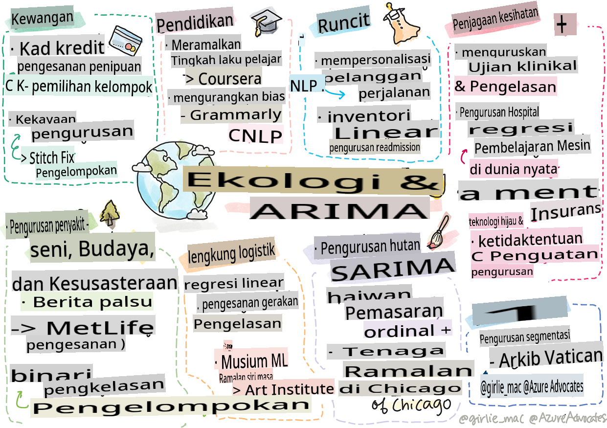

# Postscript: Pembelajaran Mesin di Dunia Nyata

> Sketchnote oleh [Tomomi Imura](https://www.twitter.com/girlie_mac)

Dalam kurikulum ini, anda telah mempelajari banyak cara untuk menyiapkan data untuk pelatihan dan membuat model pembelajaran mesin. Anda telah membangun serangkaian model regresi klasik, klastering, klasifikasi, pemrosesan bahasa alami, dan deret waktu. Selamat! Sekarang, anda mungkin bertanya-tanya apa tujuan semua ini... apa aplikasi dunia nyata untuk model-model ini?

Meskipun banyak minat dalam industri telah tertarik oleh AI, yang biasanya memanfaatkan pembelajaran mendalam, masih ada aplikasi berharga untuk model pembelajaran mesin klasik. Anda mungkin bahkan menggunakan beberapa aplikasi ini hari ini! Dalam pelajaran ini, anda akan menjelajahi bagaimana delapan industri dan domain materi pelajaran yang berbeda menggunakan jenis model ini untuk membuat aplikasi mereka lebih berkinerja, andal, cerdas, dan berharga bagi pengguna.

## [Kuis sebelum kuliah](https://gray-sand-07a10f403.1.azurestaticapps.net/quiz/49/)

## 💰 Keuangan

Sektor keuangan menawarkan banyak peluang untuk pembelajaran mesin. Banyak masalah di area ini dapat dimodelkan dan diselesaikan dengan menggunakan ML.

### Deteksi penipuan kartu kredit

Kami mempelajari tentang [k-means clustering](../../5-Clustering/2-K-Means/README.md) sebelumnya dalam kursus ini, tetapi bagaimana cara menggunakannya untuk menyelesaikan masalah terkait penipuan kartu kredit?

K-means clustering berguna selama teknik deteksi penipuan kartu kredit yang disebut **deteksi outlier**. Outlier, atau penyimpangan dalam pengamatan tentang satu set data, dapat memberi tahu kita apakah kartu kredit digunakan secara normal atau jika ada sesuatu yang tidak biasa terjadi. Seperti yang ditunjukkan dalam makalah yang ditautkan di bawah ini, anda dapat menyortir data kartu kredit menggunakan algoritma k-means clustering dan menetapkan setiap transaksi ke klaster berdasarkan seberapa besar penyimpangan yang muncul. Kemudian, anda dapat mengevaluasi klaster yang paling berisiko untuk transaksi penipuan versus yang sah.
[Referensi](https://citeseerx.ist.psu.edu/viewdoc/download?doi=10.1.1.680.1195&rep=rep1&type=pdf)

### Manajemen kekayaan

Dalam manajemen kekayaan, individu atau perusahaan menangani investasi atas nama klien mereka. Tugas mereka adalah mempertahankan dan menumbuhkan kekayaan dalam jangka panjang, sehingga penting untuk memilih investasi yang berkinerja baik.

Salah satu cara untuk mengevaluasi bagaimana kinerja investasi tertentu adalah melalui regresi statistik. [Regresi linear](../../2-Regression/1-Tools/README.md) adalah alat yang berharga untuk memahami bagaimana suatu dana berkinerja relatif terhadap beberapa tolok ukur. Kita juga dapat menyimpulkan apakah hasil regresi signifikan secara statistik atau tidak, atau seberapa besar pengaruhnya terhadap investasi klien. Anda bahkan dapat memperluas analisis anda menggunakan regresi berganda, di mana faktor risiko tambahan dapat diperhitungkan. Untuk contoh bagaimana ini akan bekerja untuk dana tertentu, lihat makalah di bawah ini tentang evaluasi kinerja dana menggunakan regresi.
[Referensi](http://www.brightwoodventures.com/evaluating-fund-performance-using-regression/)

## 🎓 Pendidikan

Sektor pendidikan juga merupakan area yang sangat menarik di mana ML dapat diterapkan. Ada masalah menarik yang harus dipecahkan seperti mendeteksi kecurangan pada ujian atau esai atau mengelola bias, disengaja atau tidak, dalam proses koreksi.

### Memprediksi perilaku siswa

[Coursera](https://coursera.com), penyedia kursus online terbuka, memiliki blog teknologi yang hebat di mana mereka membahas banyak keputusan teknis. Dalam studi kasus ini, mereka memplot garis regresi untuk mencoba mengeksplorasi korelasi antara rating NPS (Net Promoter Score) yang rendah dan retensi atau putus kursus.
[Referensi](https://medium.com/coursera-engineering/controlled-regression-quantifying-the-impact-of-course-quality-on-learner-retention-31f956bd592a)

### Mengurangi bias

[Grammarly](https://grammarly.com), asisten menulis yang memeriksa kesalahan ejaan dan tata bahasa, menggunakan sistem [pemrosesan bahasa alami](../../6-NLP/README.md) yang canggih di seluruh produknya. Mereka menerbitkan studi kasus menarik di blog teknologi mereka tentang bagaimana mereka menangani bias gender dalam pembelajaran mesin, yang anda pelajari dalam [pelajaran pengenalan tentang keadilan](../../1-Introduction/3-fairness/README.md).
[Referensi](https://www.grammarly.com/blog/engineering/mitigating-gender-bias-in-autocorrect/)

## 👜 Ritel

Sektor ritel pasti dapat memanfaatkan penggunaan ML, mulai dari menciptakan perjalanan pelanggan yang lebih baik hingga menyimpan inventaris dengan cara yang optimal.

### Memperpersonalisasi perjalanan pelanggan

Di Wayfair, perusahaan yang menjual barang-barang rumah tangga seperti furnitur, membantu pelanggan menemukan produk yang tepat untuk selera dan kebutuhan mereka sangat penting. Dalam artikel ini, insinyur dari perusahaan tersebut menjelaskan bagaimana mereka menggunakan ML dan NLP untuk "menampilkan hasil yang tepat bagi pelanggan". Secara khusus, Query Intent Engine mereka telah dibangun untuk menggunakan ekstraksi entitas, pelatihan klasifikasi, ekstraksi aset dan opini, serta penandaan sentimen pada ulasan pelanggan. Ini adalah contoh klasik bagaimana NLP bekerja dalam ritel online.
[Referensi](https://www.aboutwayfair.com/tech-innovation/how-we-use-machine-learning-and-natural-language-processing-to-empower-search)

### Manajemen inventaris

Perusahaan inovatif dan gesit seperti [StitchFix](https://stitchfix.com), layanan kotak yang mengirim pakaian kepada konsumen, sangat bergantung pada ML untuk rekomendasi dan manajemen inventaris. Tim styling mereka bekerja sama dengan tim merchandising mereka, sebenarnya: "salah satu ilmuwan data kami bermain-main dengan algoritma genetik dan menerapkannya pada pakaian untuk memprediksi apa yang akan menjadi pakaian yang sukses yang tidak ada hari ini. Kami membawa itu ke tim merchandise dan sekarang mereka dapat menggunakannya sebagai alat."
[Referensi](https://www.zdnet.com/article/how-stitch-fix-uses-machine-learning-to-master-the-science-of-styling/)

## 🏥 Perawatan Kesehatan

Sektor perawatan kesehatan dapat memanfaatkan ML untuk mengoptimalkan tugas penelitian dan juga masalah logistik seperti readmisi pasien atau menghentikan penyebaran penyakit.

### Mengelola uji klinis

Toksisitas dalam uji klinis adalah masalah besar bagi pembuat obat. Berapa banyak toksisitas yang dapat ditoleransi? Dalam studi ini, menganalisis berbagai metode uji klinis menghasilkan pengembangan pendekatan baru untuk memprediksi kemungkinan hasil uji klinis. Secara khusus, mereka dapat menggunakan random forest untuk menghasilkan [klasifikasi](../../4-Classification/README.md) yang dapat membedakan antara kelompok obat.
[Referensi](https://www.sciencedirect.com/science/article/pii/S2451945616302914)

### Manajemen readmisi rumah sakit

Perawatan rumah sakit mahal, terutama ketika pasien harus readmisi. Makalah ini membahas perusahaan yang menggunakan ML untuk memprediksi potensi readmisi menggunakan algoritma [klastering](../../5-Clustering/README.md). Klaster ini membantu analis untuk "menemukan kelompok readmisi yang mungkin memiliki penyebab yang sama".
[Referensi](https://healthmanagement.org/c/healthmanagement/issuearticle/hospital-readmissions-and-machine-learning)

### Manajemen penyakit

Pandemi baru-baru ini telah menyoroti cara-cara di mana pembelajaran mesin dapat membantu menghentikan penyebaran penyakit. Dalam artikel ini, anda akan mengenali penggunaan ARIMA, kurva logistik, regresi linear, dan SARIMA. "Pekerjaan ini adalah upaya untuk menghitung laju penyebaran virus ini dan dengan demikian memprediksi kematian, pemulihan, dan kasus yang dikonfirmasi, sehingga dapat membantu kita untuk mempersiapkan diri dengan lebih baik dan bertahan hidup."
[Referensi](https://www.ncbi.nlm.nih.gov/pmc/articles/PMC7979218/)

## 🌲 Ekologi dan Teknologi Hijau

Alam dan ekologi terdiri dari banyak sistem sensitif di mana interaksi antara hewan dan alam menjadi fokus. Penting untuk dapat mengukur sistem ini dengan akurat dan bertindak dengan tepat jika sesuatu terjadi, seperti kebakaran hutan atau penurunan populasi hewan.

### Manajemen hutan

Anda mempelajari tentang [Reinforcement Learning](../../8-Reinforcement/README.md) dalam pelajaran sebelumnya. Ini bisa sangat berguna ketika mencoba memprediksi pola di alam. Secara khusus, ini dapat digunakan untuk melacak masalah ekologi seperti kebakaran hutan dan penyebaran spesies invasif. Di Kanada, sekelompok peneliti menggunakan Reinforcement Learning untuk membangun model dinamika kebakaran hutan dari citra satelit. Menggunakan "spatially spreading process (SSP)" yang inovatif, mereka membayangkan kebakaran hutan sebagai "agen di setiap sel dalam lanskap." "Set tindakan yang dapat diambil api dari lokasi pada waktu tertentu termasuk menyebar ke utara, selatan, timur, atau barat atau tidak menyebar.

Pendekatan ini membalik pengaturan RL yang biasa karena dinamika Proses Keputusan Markov (MDP) yang sesuai adalah fungsi yang diketahui untuk penyebaran kebakaran segera." Baca lebih lanjut tentang algoritma klasik yang digunakan oleh kelompok ini di tautan di bawah.
[Referensi](https://www.frontiersin.org/articles/10.3389/fict.2018.00006/full)

### Pemantauan gerakan hewan

Sementara pembelajaran mendalam telah menciptakan revolusi dalam melacak gerakan hewan secara visual (anda dapat membuat [pelacak beruang kutub](https://docs.microsoft.com/learn/modules/build-ml-model-with-azure-stream-analytics/?WT.mc_id=academic-77952-leestott) anda sendiri di sini), ML klasik masih memiliki tempat dalam tugas ini.

Sensor untuk melacak gerakan hewan ternak dan IoT memanfaatkan jenis pemrosesan visual ini, tetapi teknik ML yang lebih dasar berguna untuk memproses data awal. Misalnya, dalam makalah ini, postur domba dipantau dan dianalisis menggunakan berbagai algoritma klasifikasi. Anda mungkin mengenali kurva ROC pada halaman 335.
[Referensi](https://druckhaus-hofmann.de/gallery/31-wj-feb-2020.pdf)

### ⚡️ Manajemen Energi

Dalam pelajaran kami tentang [peramalan deret waktu](../../7-TimeSeries/README.md), kami mengajukan konsep meteran parkir pintar untuk menghasilkan pendapatan bagi kota berdasarkan pemahaman tentang penawaran dan permintaan. Artikel ini membahas secara rinci bagaimana klastering, regresi, dan peramalan deret waktu digabungkan untuk membantu memprediksi penggunaan energi masa depan di Irlandia, berdasarkan meteran pintar.
[Referensi](https://www-cdn.knime.com/sites/default/files/inline-images/knime_bigdata_energy_timeseries_whitepaper.pdf)

## 💼 Asuransi

Sektor asuransi adalah sektor lain yang menggunakan ML untuk membangun dan mengoptimalkan model keuangan dan aktuaria yang layak.

### Manajemen Volatilitas

MetLife, penyedia asuransi jiwa, terbuka dengan cara mereka menganalisis dan mengurangi volatilitas dalam model keuangan mereka. Dalam artikel ini anda akan melihat visualisasi klasifikasi biner dan ordinal. Anda juga akan menemukan visualisasi peramalan.
[Referensi](https://investments.metlife.com/content/dam/metlifecom/us/investments/insights/research-topics/macro-strategy/pdf/MetLifeInvestmentManagement_MachineLearnedRanking_070920.pdf)

## 🎨 Seni, Budaya, dan Sastra

Dalam seni, misalnya dalam jurnalisme, ada banyak masalah menarik. Mendeteksi berita palsu adalah masalah besar karena terbukti mempengaruhi opini orang dan bahkan menjatuhkan demokrasi. Museum juga dapat memanfaatkan penggunaan ML dalam segala hal mulai dari menemukan hubungan antara artefak hingga perencanaan sumber daya.

### Deteksi berita palsu

Mendeteksi berita palsu telah menjadi permainan kucing dan tikus dalam media saat ini. Dalam artikel ini, peneliti menyarankan bahwa sistem yang menggabungkan beberapa teknik ML yang telah kita pelajari dapat diuji dan model terbaik diterapkan: "Sistem ini didasarkan pada pemrosesan bahasa alami untuk mengekstrak fitur dari data dan kemudian fitur-fitur ini digunakan untuk pelatihan pengklasifikasi pembelajaran mesin seperti Naive Bayes, Support Vector Machine (SVM), Random Forest (RF), Stochastic Gradient Descent (SGD), dan Logistic Regression (LR)."
[Referensi](https://www.irjet.net/archives/V7/i6/IRJET-V7I6688.pdf)

Artikel ini menunjukkan bagaimana menggabungkan berbagai domain ML dapat menghasilkan hasil yang menarik yang dapat membantu menghentikan penyebaran berita palsu dan menciptakan kerusakan nyata; dalam hal ini, dorongan utama adalah penyebaran rumor tentang pengobatan COVID yang memicu kekerasan massa.

### Museum ML

Museum berada di ambang revolusi AI di mana mengkatalogkan dan mendigitalkan koleksi serta menemukan hubungan antara artefak menjadi lebih mudah seiring dengan kemajuan teknologi. Proyek seperti [In Codice Ratio](https://www.sciencedirect.com/science/article/abs/pii/S0306457321001035#:~:text=1.,studies%20over%20large%20historical%20sources.) membantu membuka misteri koleksi yang tidak dapat diakses seperti Arsip Vatikan. Namun, aspek bisnis dari museum juga mendapat manfaat dari model ML.

Misalnya, Art Institute of Chicago membangun model untuk memprediksi apa yang diminati oleh audiens dan kapan mereka akan menghadiri pameran. Tujuannya adalah untuk menciptakan pengalaman pengunjung yang dipersonalisasi dan dioptimalkan setiap kali pengguna mengunjungi museum. "Selama tahun fiskal 2017, model tersebut memprediksi kehadiran dan penerimaan dengan akurasi dalam 1 persen, kata Andrew Simnick, wakil presiden senior di Art Institute."
[Reference](https://www.chicagobusiness.com/article/20180518/ISSUE01/180519840/art-institute-of-chicago-uses-data-to-make-exhibit-choices)

## 🏷 Pemasaran

### Segmentasi pelanggan

Strategi pemasaran yang paling berkesan menargetkan pelanggan dengan cara yang berbeza berdasarkan pelbagai pengelompokan. Dalam artikel ini, penggunaan algoritma Kluster dibincangkan untuk menyokong pemasaran yang berbeza. Pemasaran berbeza membantu syarikat meningkatkan pengiktirafan jenama, mencapai lebih ramai pelanggan, dan menjana lebih banyak wang.
[Reference](https://ai.inqline.com/machine-learning-for-marketing-customer-segmentation/)

## 🚀 Cabaran

Kenal pasti sektor lain yang mendapat manfaat daripada beberapa teknik yang anda pelajari dalam kurikulum ini, dan ketahui bagaimana ia menggunakan ML.

## [Kuiz selepas kuliah](https://gray-sand-07a10f403.1.azurestaticapps.net/quiz/50/)

## Ulasan & Kajian Kendiri

Pasukan sains data Wayfair mempunyai beberapa video menarik tentang bagaimana mereka menggunakan ML di syarikat mereka. Ia berbaloi untuk [dilihat](https://www.youtube.com/channel/UCe2PjkQXqOuwkW1gw6Ameuw/videos)!

## Tugasan

[Perburuan harta karun ML](assignment.md)

**Penafian**:
Dokumen ini telah diterjemahkan menggunakan perkhidmatan terjemahan AI berasaskan mesin. Walaupun kami berusaha untuk ketepatan, sila ambil perhatian bahawa terjemahan automatik mungkin mengandungi kesilapan atau ketidaktepatan. Dokumen asal dalam bahasa asalnya harus dianggap sebagai sumber yang berwibawa. Untuk maklumat kritikal, terjemahan manusia profesional adalah disyorkan. Kami tidak bertanggungjawab atas sebarang salah faham atau salah tafsir yang timbul daripada penggunaan terjemahan ini.