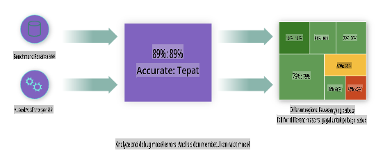
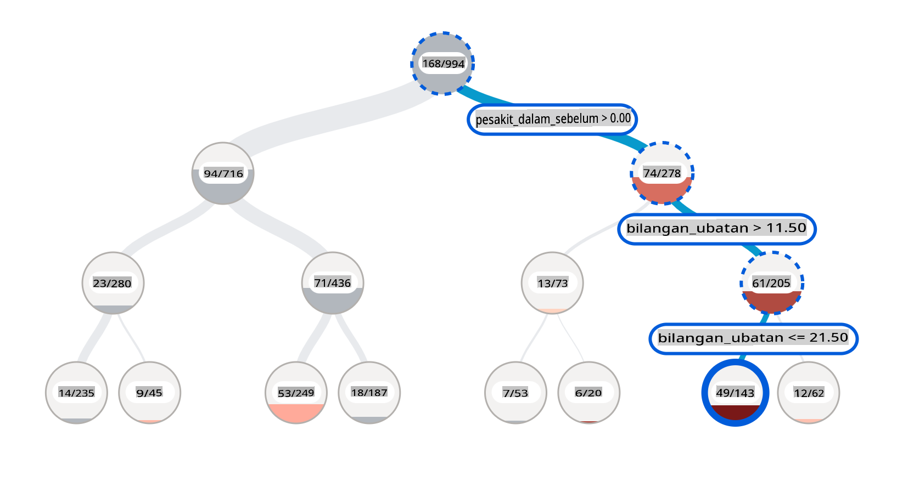
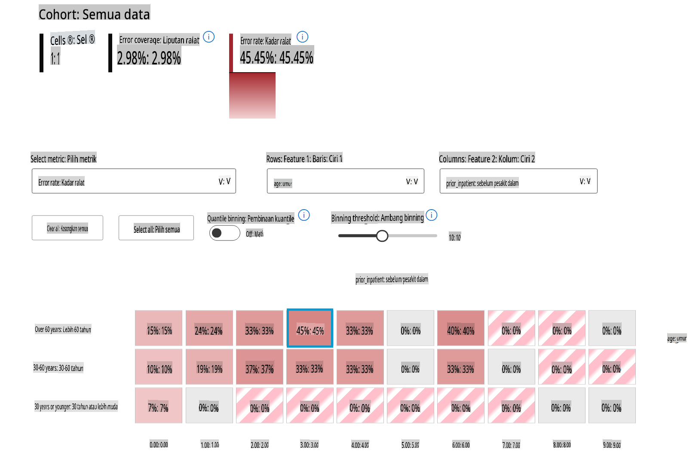
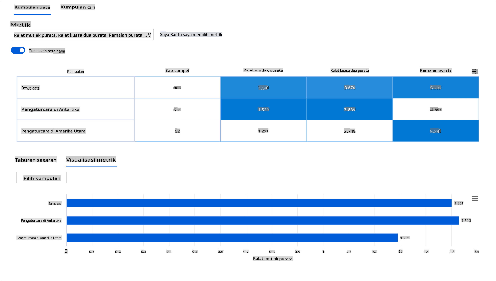
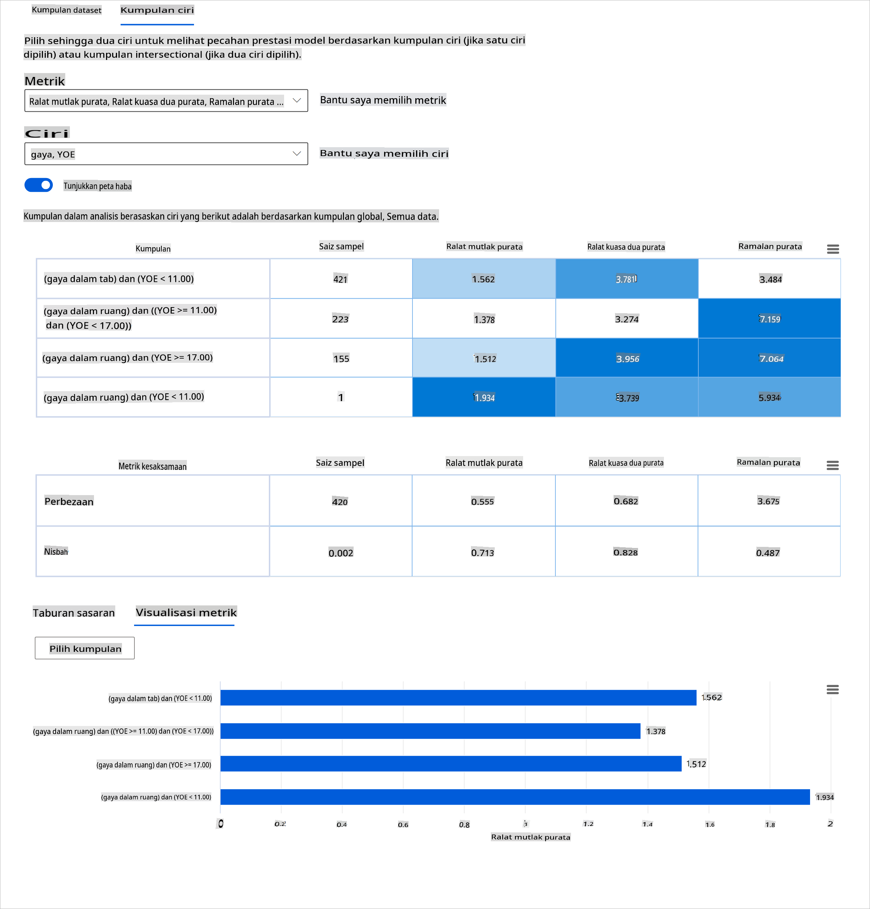
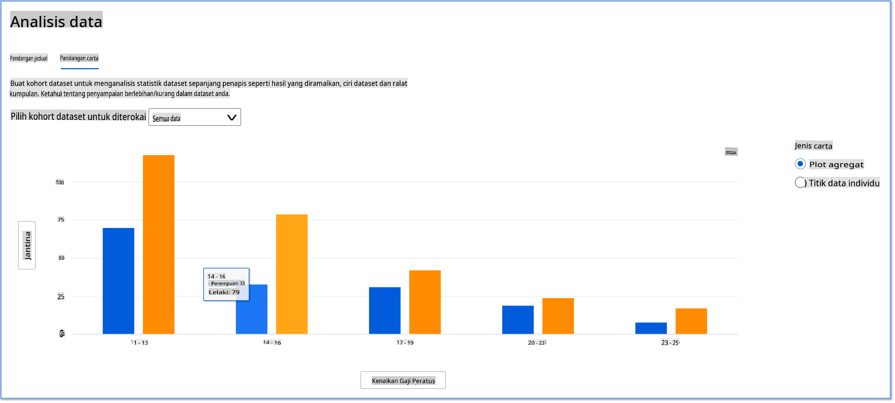
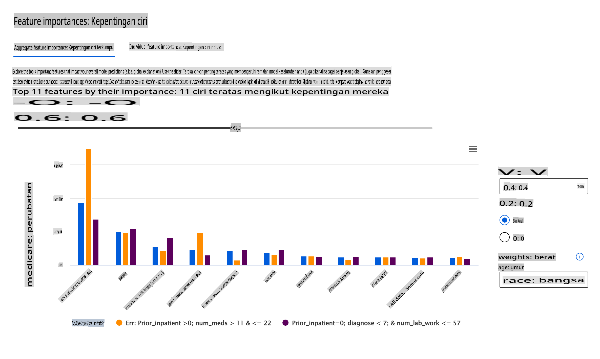
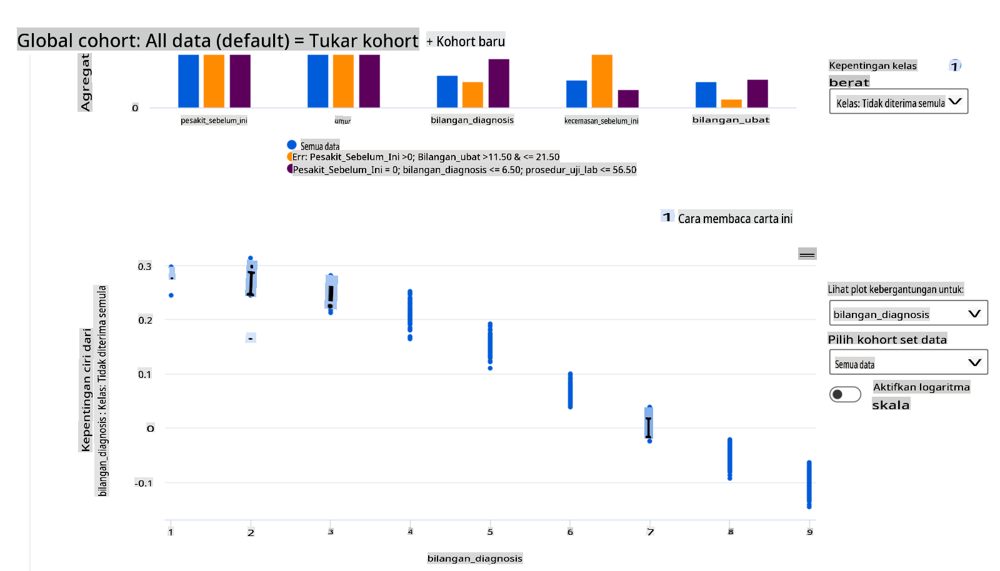

# Postscript: Debugging Model dalam Pembelajaran Mesin menggunakan Komponen Papan Pemuka AI Bertanggungjawab

## [Kuiz pra-ceramah](https://gray-sand-07a10f403.1.azurestaticapps.net/quiz/5/)

## Pengenalan

Pembelajaran mesin memberi kesan kepada kehidupan seharian kita. AI sedang menemui jalannya ke dalam beberapa sistem yang paling penting yang mempengaruhi kita sebagai individu serta masyarakat kita, dari penjagaan kesihatan, kewangan, pendidikan, dan pekerjaan. Contohnya, sistem dan model terlibat dalam tugas membuat keputusan harian, seperti diagnosis penjagaan kesihatan atau mengesan penipuan. Akibatnya, kemajuan dalam AI bersama dengan penerimaan yang dipercepatkan sedang dihadapi dengan harapan masyarakat yang berkembang dan peraturan yang semakin meningkat sebagai tindak balas. Kita sentiasa melihat kawasan di mana sistem AI terus gagal memenuhi jangkaan; mereka mendedahkan cabaran baru; dan kerajaan mula mengawal penyelesaian AI. Oleh itu, adalah penting bahawa model ini dianalisis untuk memberikan hasil yang adil, boleh dipercayai, inklusif, telus, dan bertanggungjawab untuk semua orang.

Dalam kurikulum ini, kita akan melihat alat praktikal yang boleh digunakan untuk menilai jika model mempunyai isu AI bertanggungjawab. Teknik debugging pembelajaran mesin tradisional cenderung berdasarkan pengiraan kuantitatif seperti ketepatan agregat atau purata kehilangan ralat. Bayangkan apa yang boleh berlaku apabila data yang anda gunakan untuk membina model ini kekurangan demografi tertentu, seperti kaum, jantina, pandangan politik, agama, atau secara tidak seimbang mewakili demografi tersebut. Bagaimana pula apabila output model ditafsirkan untuk memihak kepada beberapa demografi? Ini boleh memperkenalkan perwakilan berlebihan atau kurang kumpulan ciri sensitif ini yang mengakibatkan isu keadilan, keterangkuman, atau kebolehpercayaan daripada model. Faktor lain ialah, model pembelajaran mesin dianggap kotak hitam, yang menjadikannya sukar untuk memahami dan menerangkan apa yang memacu ramalan model. Semua ini adalah cabaran yang dihadapi oleh saintis data dan pembangun AI apabila mereka tidak mempunyai alat yang mencukupi untuk debug dan menilai keadilan atau kebolehpercayaan model.

Dalam pelajaran ini, anda akan mempelajari tentang debugging model anda menggunakan:

-	**Analisis Ralat**: mengenal pasti di mana dalam taburan data anda model mempunyai kadar ralat yang tinggi.
-	**Gambaran Keseluruhan Model**: melakukan analisis perbandingan merentasi kohort data yang berbeza untuk menemui perbezaan dalam metrik prestasi model anda.
-	**Analisis Data**: menyiasat di mana mungkin terdapat perwakilan berlebihan atau kurang data anda yang boleh mengubah model anda untuk memihak kepada satu demografi data berbanding yang lain.
-	**Kepentingan Ciri**: memahami ciri-ciri yang memacu ramalan model anda pada peringkat global atau peringkat tempatan.

## Prasyarat

Sebagai prasyarat, sila tinjau [Alat AI Bertanggungjawab untuk pembangun](https://www.microsoft.com/ai/ai-lab-responsible-ai-dashboard)

> 

## Analisis Ralat

Metrik prestasi model tradisional yang digunakan untuk mengukur ketepatan kebanyakannya adalah pengiraan berdasarkan ramalan betul vs salah. Sebagai contoh, menentukan bahawa model adalah tepat 89% masa dengan kehilangan ralat 0.001 boleh dianggap sebagai prestasi yang baik. Kesilapan selalunya tidak diedarkan secara seragam dalam set data asas anda. Anda mungkin mendapat skor ketepatan model 89% tetapi mendapati bahawa terdapat kawasan berbeza dalam data anda di mana model gagal 42% masa. Akibat daripada corak kegagalan ini dengan kumpulan data tertentu boleh membawa kepada isu keadilan atau kebolehpercayaan. Adalah penting untuk memahami kawasan di mana model berprestasi baik atau tidak. Kawasan data di mana terdapat banyak ketidaktepatan dalam model anda mungkin menjadi demografi data yang penting.

Komponen Analisis Ralat pada papan pemuka RAI menggambarkan bagaimana kegagalan model diedarkan merentasi pelbagai kohort dengan visualisasi pokok. Ini berguna dalam mengenal pasti ciri atau kawasan di mana terdapat kadar ralat yang tinggi dengan set data anda. Dengan melihat dari mana kebanyakan ketidaktepatan model datang, anda boleh mula menyiasat punca akar. Anda juga boleh mencipta kohort data untuk melakukan analisis. Kohort data ini membantu dalam proses debugging untuk menentukan mengapa prestasi model baik dalam satu kohort, tetapi salah dalam kohort lain.

Penunjuk visual pada peta pokok membantu dalam mencari kawasan masalah dengan lebih cepat. Sebagai contoh, semakin gelap warna merah pada nod pokok, semakin tinggi kadar ralat.

Peta haba adalah satu lagi fungsi visualisasi yang boleh digunakan pengguna dalam menyiasat kadar ralat menggunakan satu atau dua ciri untuk mencari penyumbang kepada kesilapan model merentasi keseluruhan set data atau kohort.

Gunakan analisis ralat apabila anda perlu:

* Mendapatkan pemahaman mendalam tentang bagaimana kegagalan model diedarkan merentasi set data dan merentasi beberapa dimensi input dan ciri.
* Memecahkan metrik prestasi agregat untuk secara automatik menemui kohort yang salah untuk memaklumkan langkah mitigasi yang disasarkan anda.

## Gambaran Keseluruhan Model

Menilai prestasi model pembelajaran mesin memerlukan pemahaman holistik tentang tingkah lakunya. Ini boleh dicapai dengan mengkaji lebih daripada satu metrik seperti kadar ralat, ketepatan, ingatan, ketepatan, atau MAE (Ralat Mutlak Purata) untuk mencari perbezaan antara metrik prestasi. Satu metrik prestasi mungkin kelihatan hebat, tetapi ketidaktepatan boleh didedahkan dalam metrik lain. Di samping itu, membandingkan metrik untuk perbezaan merentasi keseluruhan set data atau kohort membantu menjelaskan di mana model berprestasi baik atau tidak. Ini amat penting dalam melihat prestasi model di kalangan ciri sensitif vs tidak sensitif (contohnya, bangsa pesakit, jantina, atau umur) untuk mendedahkan potensi ketidakadilan yang mungkin ada pada model. Sebagai contoh, mendapati bahawa model lebih salah dalam kohort yang mempunyai ciri sensitif boleh mendedahkan potensi ketidakadilan yang mungkin ada pada model.

Komponen Gambaran Keseluruhan Model papan pemuka RAI membantu bukan sahaja dalam menganalisis metrik prestasi perwakilan data dalam kohort, tetapi ia memberi pengguna keupayaan untuk membandingkan tingkah laku model merentasi kohort yang berbeza.

Fungsi analisis berasaskan ciri komponen membolehkan pengguna mengecilkan subkumpulan data dalam ciri tertentu untuk mengenal pasti anomali pada tahap granular. Sebagai contoh, papan pemuka mempunyai kecerdasan terbina dalam untuk secara automatik menjana kohort untuk ciri yang dipilih pengguna (contohnya, *"time_in_hospital < 3"* atau *"time_in_hospital >= 7"*). Ini membolehkan pengguna mengasingkan ciri tertentu daripada kumpulan data yang lebih besar untuk melihat sama ada ia adalah pengaruh utama hasil yang salah model.

Komponen Gambaran Keseluruhan Model menyokong dua kelas metrik perbezaan:

**Perbezaan dalam prestasi model**: Set metrik ini mengira perbezaan (perbezaan) dalam nilai metrik prestasi yang dipilih merentasi subkumpulan data. Berikut adalah beberapa contoh:

* Perbezaan dalam kadar ketepatan
* Perbezaan dalam kadar ralat
* Perbezaan dalam ketepatan
* Perbezaan dalam ingatan
* Perbezaan dalam ralat mutlak purata (MAE)

**Perbezaan dalam kadar pemilihan**: Metrik ini mengandungi perbezaan dalam kadar pemilihan (ramalan yang menguntungkan) di kalangan subkumpulan. Contoh ini ialah perbezaan dalam kadar kelulusan pinjaman. Kadar pemilihan bermaksud pecahan titik data dalam setiap kelas yang diklasifikasikan sebagai 1 (dalam klasifikasi binari) atau taburan nilai ramalan (dalam regresi).

## Analisis Data

> "Jika anda menyeksa data cukup lama, ia akan mengaku apa sahaja" - Ronald Coase

Kenyataan ini kedengaran melampau, tetapi adalah benar bahawa data boleh dimanipulasi untuk menyokong apa-apa kesimpulan. Manipulasi sedemikian kadangkala boleh berlaku tanpa disedari. Sebagai manusia, kita semua mempunyai prasangka, dan selalunya sukar untuk mengetahui secara sedar apabila anda memperkenalkan prasangka dalam data. Menjamin keadilan dalam AI dan pembelajaran mesin tetap menjadi cabaran yang kompleks.

Data adalah titik buta yang besar untuk metrik prestasi model tradisional. Anda mungkin mempunyai skor ketepatan yang tinggi, tetapi ini tidak selalu mencerminkan bias data yang mendasari yang mungkin ada dalam set data anda. Sebagai contoh, jika set data pekerja mempunyai 27% wanita dalam jawatan eksekutif dalam syarikat dan 73% lelaki pada tahap yang sama, model AI pengiklanan pekerjaan yang dilatih pada data ini mungkin menyasarkan kebanyakan penonton lelaki untuk jawatan pekerjaan peringkat kanan. Mempunyai ketidakseimbangan ini dalam data mengubah ramalan model untuk memihak kepada satu jantina. Ini mendedahkan isu keadilan di mana terdapat bias jantina dalam model AI.

Komponen Analisis Data pada papan pemuka RAI membantu mengenal pasti kawasan di mana terdapat perwakilan berlebihan dan kurang dalam set data. Ia membantu pengguna mendiagnosis punca ralat dan isu keadilan yang diperkenalkan daripada ketidakseimbangan data atau kekurangan perwakilan kumpulan data tertentu. Ini memberi pengguna keupayaan untuk memvisualisasikan set data berdasarkan hasil yang diramalkan dan sebenar, kumpulan ralat, dan ciri khusus. Kadangkala menemui kumpulan data yang kurang diwakili juga boleh mendedahkan bahawa model tidak belajar dengan baik, oleh itu ketidaktepatan yang tinggi. Mempunyai model yang mempunyai bias data bukan sahaja isu keadilan tetapi menunjukkan bahawa model tidak inklusif atau boleh dipercayai.

Gunakan analisis data apabila anda perlu:

* Terokai statistik set data anda dengan memilih penapis yang berbeza untuk membahagikan data anda kepada dimensi yang berbeza (juga dikenali sebagai kohort).
* Fahami taburan set data anda merentasi kohort dan kumpulan ciri yang berbeza.
* Tentukan sama ada penemuan anda yang berkaitan dengan keadilan, analisis ralat, dan sebab-akibat (yang diperoleh daripada komponen papan pemuka lain) adalah hasil daripada taburan set data anda.
* Tentukan di kawasan mana untuk mengumpul lebih banyak data untuk mengurangkan ralat yang datang daripada isu perwakilan, hingar label, hingar ciri, bias label, dan faktor serupa.

## Kebolehfahaman Model

Model pembelajaran mesin cenderung menjadi kotak hitam. Memahami ciri data utama yang memacu ramalan model boleh menjadi mencabar. Adalah penting untuk memberikan ketelusan mengapa model membuat ramalan tertentu. Sebagai contoh, jika sistem AI meramalkan bahawa pesakit diabetes berisiko dimasukkan semula ke hospital dalam masa kurang daripada 30 hari, ia harus dapat memberikan data sokongan yang membawa kepada ramalannya. Mempunyai penunjuk data sokongan membawa ketelusan untuk membantu klinik atau hospital dapat membuat keputusan yang berpengetahuan. Di samping itu, dapat menerangkan mengapa model membuat ramalan untuk pesakit individu membolehkan akauntabiliti dengan peraturan kesihatan. Apabila anda menggunakan model pembelajaran mesin dengan cara yang mempengaruhi kehidupan orang, adalah penting untuk memahami dan menerangkan apa yang mempengaruhi tingkah laku model. Kebolehterangan dan kebolehfahaman model membantu menjawab soalan dalam senario seperti:

* Debug model: Mengapa model saya membuat kesilapan ini? Bagaimana saya boleh memperbaiki model saya?
* Kerjasama manusia-AI: Bagaimana saya boleh memahami dan mempercayai keputusan model?
* Pematuhan peraturan: Adakah model saya memenuhi keperluan undang-undang?

Komponen Kepentingan Ciri papan pemuka RAI membantu anda debug dan mendapatkan pemahaman yang komprehensif tentang bagaimana model membuat ramalan. Ia juga alat yang berguna untuk profesional pembelajaran mesin dan pembuat keputusan untuk menerangkan dan menunjukkan bukti ciri yang mempengaruhi tingkah laku model untuk pematuhan peraturan. Seterusnya, pengguna boleh meneroka kedua-dua penjelasan global dan tempatan untuk mengesahkan ciri yang memacu ramalan model. Penjelasan global menyenaraikan ciri teratas yang mempengaruhi ramalan keseluruhan model. Penjelasan tempatan memaparkan ciri yang membawa kepada ramalan model untuk kes individu. Keupayaan untuk menilai penjelasan tempatan juga berguna dalam debugging atau mengaudit kes tertentu untuk lebih memahami dan mentafsir mengapa model membuat ramalan yang tepat atau tidak tepat.

* Penjelasan global: Sebagai contoh, ciri apa yang mempengaruhi tingkah laku keseluruhan model kemasukan semula hospital diabetes?
* Penjelasan tempatan: Sebagai contoh, mengapa pesakit diabetes berumur lebih 60 tahun dengan kemasukan hospital sebelumnya diramalkan akan dimasukkan semula atau tidak dimasukkan semula dalam masa 30 hari kembali ke hospital?

Dalam proses debugging untuk memeriksa prestasi model merentasi kohort yang berbeza, Kepentingan Ciri menunjukkan tahap pengaruh ciri merentasi kohort. Ia membantu mendedahkan anomali apabila membandingkan tahap pengaruh ciri dalam memacu ramalan yang salah model. Komponen Kepentingan Ciri boleh menunjukkan nilai mana dalam ciri yang mempengaruhi secara positif atau negatif hasil model. Sebagai contoh, jika model membuat ramalan yang tidak tepat, komponen memberi anda keupayaan untuk menyelidiki dan mengenal pasti ciri atau nilai ciri yang memacu ramalan tersebut. Tahap perincian ini membantu bukan sahaja dalam debugging tetapi menyediakan ketelusan dan akauntabiliti dalam situasi audit. Akhirnya, komponen boleh membantu anda mengenal pasti isu keadilan. Sebagai ilustrasi, jika ciri sensitif seperti etnik atau jantina sangat mempengaruhi dalam memacu ramalan model, ini boleh menjadi tanda bias kaum atau jantina dalam model.

Gunakan kebolehfahaman apabila anda perlu:

* Tentukan sejauh mana ramalan sistem AI anda boleh dipercayai dengan memahami ciri yang paling penting untuk ramalan.
* Pendekatan debugging model anda dengan memahaminya terlebih dahulu dan mengenal pasti sama ada model menggunakan ciri yang sihat atau hanya korelasi palsu.
* Mendedahkan sumber potensi ketidakadilan dengan memahami sama ada model membuat ramalan berdasarkan ciri sensitif atau ciri yang sangat berkorelasi dengannya.
* Membina kepercayaan pengguna dalam keputusan model anda dengan menjana penjelasan tempatan untuk menggambarkan hasil mereka.
* Menyelesaikan audit peraturan sistem AI untuk mengesahkan model dan memantau kesan keputusan model terhadap manusia.

## Kesimpulan

Semua komponen papan pemuka RAI adalah alat praktikal untuk membantu anda membina model pembelajaran mesin yang kurang berbahaya dan lebih dipercayai kepada masyarakat. Ia meningkatkan pencegahan ancaman kepada hak asasi manusia; mendiskriminasi atau mengecualikan kumpulan tertentu daripada peluang hidup; dan risiko kecederaan fizikal atau psikologi. Ia juga membantu membina kepercayaan dalam keputusan model anda dengan menjana penjelasan tempatan untuk menggambarkan hasil mereka. Beberapa potensi bahaya boleh diklasifikasikan sebagai:

- **Peruntukan**, jika jantina atau etnik contohnya lebih diutamakan daripada yang lain.
- **Kualiti perkhidmatan**. Jika anda melatih data untuk satu senario tertentu tetapi realitinya jauh lebih kompleks, ia membawa kepada perkhidmatan yang kurang berprestasi.
- **Stereotaip**. Mengaitkan kumpulan tertentu dengan atribut yang telah ditetapkan.
- **Penghinaan**. Untuk mengkritik dan melabel sesuatu atau seseorang secara tidak adil.
- **Perwakilan berlebihan atau kurang**. Idea ini adalah bahawa kumpulan tertentu tidak dilihat dalam profesion tertentu, dan mana-mana perkhidmatan atau fungsi yang terus mempromosikannya menyumbang kepada bahaya.

### Papan pemuka Azure RAI

[Papan pemuka Azure RAI](https://learn.microsoft.com/en-us/azure/machine-learning/concept-responsible-ai-dashboard?WT.mc_id=aiml-90525-ruyakubu) dibina atas alat sumber terbuka yang dibangunkan oleh institusi akademik dan organisasi terkemuka termasuk Microsoft yang penting untuk saintis data dan pembangun AI untuk lebih memahami tingkah laku model, menemui dan mengurangkan isu yang tidak diingini daripada model AI.

- Pelajari cara menggunakan komponen yang berbeza dengan menyemak [dokumentasi papan pemuka RAI.](https://learn.microsoft.com/en-us/azure/machine-learning/how-to-responsible-ai-dashboard?WT.mc_id=aiml-90525-ruyakubu)

- Lihat beberapa [notebook sampel papan pemuka RAI](https://github.com/Azure/RAI-vNext-Preview/tree/main/examples/notebooks) untuk debugging lebih banyak senario AI bertanggungjawab dalam Pembelajaran Mesin Azure.

---
## 🚀 Cabaran

Untuk mengelakkan prasangka statistik atau data daripada diperkenalkan pada mulanya, kita harus:

- mempunyai kepelbagaian latar belakang dan perspektif di kalangan orang yang

**Penafian**:
Dokumen ini telah diterjemahkan menggunakan perkhidmatan terjemahan AI berasaskan mesin. Walaupun kami berusaha untuk ketepatan, sila ambil perhatian bahawa terjemahan automatik mungkin mengandungi kesilapan atau ketidaktepatan. Dokumen asal dalam bahasa asalnya harus dianggap sebagai sumber yang berwibawa. Untuk maklumat kritikal, terjemahan manusia profesional adalah disyorkan. Kami tidak bertanggungjawab atas sebarang salah faham atau salah tafsir yang timbul daripada penggunaan terjemahan ini.