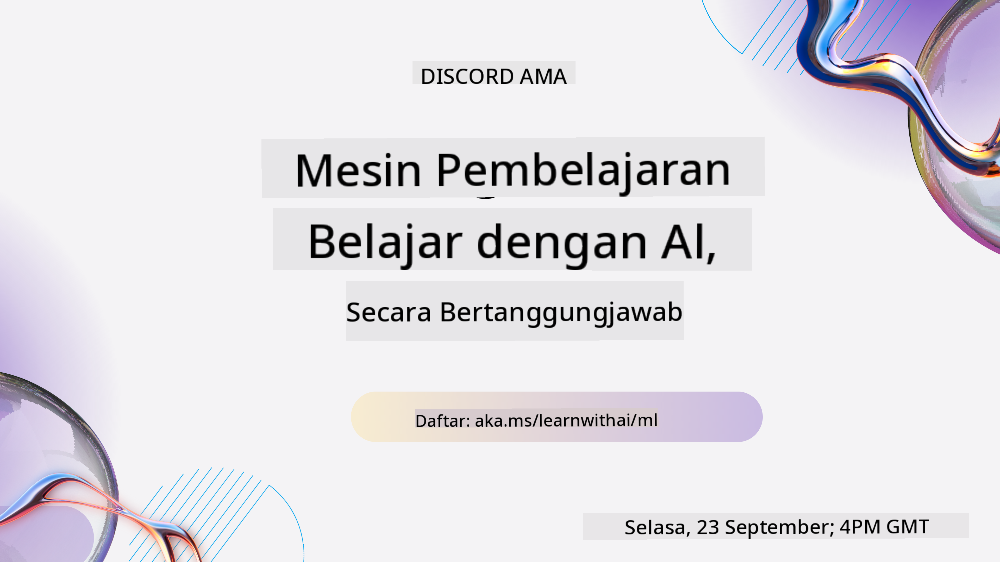
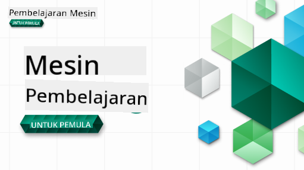

<!--
CO_OP_TRANSLATOR_METADATA:
{
  "original_hash": "c300f2380d9da91b7de8c707f69ce99b",
  "translation_date": "2025-12-19T11:39:43+00:00",
  "source_file": "README.md",
  "language_code": "ms"
}
-->

### 🌐 Sokongan Pelbagai Bahasa

#### Disokong melalui GitHub Action (Automatik & Sentiasa Dikemas Kini)

<!-- CO-OP TRANSLATOR LANGUAGES TABLE START -->
[Arabic](../ar/README.md) | [Bengali](../bn/README.md) | [Bulgarian](../bg/README.md) | [Burmese (Myanmar)](../my/README.md) | [Chinese (Simplified)](../zh/README.md) | [Chinese (Traditional, Hong Kong)](../hk/README.md) | [Chinese (Traditional, Macau)](../mo/README.md) | [Chinese (Traditional, Taiwan)](../tw/README.md) | [Croatian](../hr/README.md) | [Czech](../cs/README.md) | [Danish](../da/README.md) | [Dutch](../nl/README.md) | [Estonian](../et/README.md) | [Finnish](../fi/README.md) | [French](../fr/README.md) | [German](../de/README.md) | [Greek](../el/README.md) | [Hebrew](../he/README.md) | [Hindi](../hi/README.md) | [Hungarian](../hu/README.md) | [Indonesian](../id/README.md) | [Italian](../it/README.md) | [Japanese](../ja/README.md) | [Kannada](../kn/README.md) | [Korean](../ko/README.md) | [Lithuanian](../lt/README.md) | [Malay](./README.md) | [Malayalam](../ml/README.md) | [Marathi](../mr/README.md) | [Nepali](../ne/README.md) | [Nigerian Pidgin](../pcm/README.md) | [Norwegian](../no/README.md) | [Persian (Farsi)](../fa/README.md) | [Polish](../pl/README.md) | [Portuguese (Brazil)](../br/README.md) | [Portuguese (Portugal)](../pt/README.md) | [Punjabi (Gurmukhi)](../pa/README.md) | [Romanian](../ro/README.md) | [Russian](../ru/README.md) | [Serbian (Cyrillic)](../sr/README.md) | [Slovak](../sk/README.md) | [Slovenian](../sl/README.md) | [Spanish](../es/README.md) | [Swahili](../sw/README.md) | [Swedish](../sv/README.md) | [Tagalog (Filipino)](../tl/README.md) | [Tamil](../ta/README.md) | [Telugu](../te/README.md) | [Thai](../th/README.md) | [Turkish](../tr/README.md) | [Ukrainian](../uk/README.md) | [Urdu](../ur/README.md) | [Vietnamese](../vi/README.md)
<!-- CO-OP TRANSLATOR LANGUAGES TABLE END -->

#### Sertai Komuniti Kami

Kami mempunyai siri belajar dengan AI di Discord yang sedang berlangsung, ketahui lebih lanjut dan sertai kami di [Learn with AI Series](https://aka.ms/learnwithai/discord) dari 18 - 30 September, 2025. Anda akan mendapat petua dan trik menggunakan GitHub Copilot untuk Sains Data.

# Pembelajaran Mesin untuk Pemula - Kurikulum

> 🌍 Jelajah seluruh dunia sambil meneroka Pembelajaran Mesin melalui budaya dunia 🌍

Cloud Advocates di Microsoft dengan sukacitanya menawarkan kurikulum 12 minggu, 26 pelajaran yang membincangkan tentang **Pembelajaran Mesin**. Dalam kurikulum ini, anda akan belajar tentang apa yang kadang-kadang dipanggil **pembelajaran mesin klasik**, menggunakan terutamanya Scikit-learn sebagai perpustakaan dan mengelakkan pembelajaran mendalam, yang dibincangkan dalam kurikulum [AI untuk Pemula](https://aka.ms/ai4beginners) kami. Padankan pelajaran ini dengan kurikulum ['Sains Data untuk Pemula'](https://aka.ms/ds4beginners) kami juga!

Jelajah bersama kami ke seluruh dunia sambil menerapkan teknik klasik ini pada data dari pelbagai kawasan dunia. Setiap pelajaran termasuk kuiz sebelum dan selepas pelajaran, arahan bertulis untuk melengkapkan pelajaran, penyelesaian, tugasan, dan banyak lagi. Pedagogi berasaskan projek kami membolehkan anda belajar sambil membina, satu cara yang terbukti untuk kemahiran baru 'melekat'.

**✍️ Terima kasih yang tidak terhingga kepada penulis kami** Jen Looper, Stephen Howell, Francesca Lazzeri, Tomomi Imura, Cassie Breviu, Dmitry Soshnikov, Chris Noring, Anirban Mukherjee, Ornella Altunyan, Ruth Yakubu dan Amy Boyd

**🎨 Terima kasih juga kepada pelukis ilustrasi kami** Tomomi Imura, Dasani Madipalli, dan Jen Looper

**🙏 Terima kasih istimewa 🙏 kepada penulis, penyemak, dan penyumbang kandungan Microsoft Student Ambassador kami**, terutamanya Rishit Dagli, Muhammad Sakib Khan Inan, Rohan Raj, Alexandru Petrescu, Abhishek Jaiswal, Nawrin Tabassum, Ioan Samuila, dan Snigdha Agarwal

**🤩 Penghargaan tambahan kepada Microsoft Student Ambassadors Eric Wanjau, Jasleen Sondhi, dan Vidushi Gupta untuk pelajaran R kami!**

# Memulakan

Ikuti langkah-langkah ini:
1. **Fork Repositori**: Klik butang "Fork" di sudut kanan atas halaman ini.
2. **Clone Repositori**:   `git clone https://github.com/microsoft/ML-For-Beginners.git`

> [cari semua sumber tambahan untuk kursus ini dalam koleksi Microsoft Learn kami](https://learn.microsoft.com/en-us/collections/qrqzamz1nn2wx3?WT.mc_id=academic-77952-bethanycheum)

> 🔧 **Perlukan bantuan?** Semak [Panduan Penyelesaian Masalah](TROUBLESHOOTING.md) kami untuk penyelesaian isu biasa berkaitan pemasangan, persediaan, dan menjalankan pelajaran.

**[Pelajar](https://aka.ms/student-page)**, untuk menggunakan kurikulum ini, fork keseluruhan repo ke akaun GitHub anda sendiri dan lengkapkan latihan secara sendiri atau bersama kumpulan:

- Mulakan dengan kuiz pra-ceramah.
- Baca ceramah dan lengkapkan aktiviti, berhenti dan renungkan pada setiap pemeriksaan pengetahuan.
- Cuba cipta projek dengan memahami pelajaran dan bukannya hanya menjalankan kod penyelesaian; namun kod tersebut tersedia dalam folder `/solution` dalam setiap pelajaran berorientasikan projek.
- Ambil kuiz pasca-ceramah.
- Lengkapkan cabaran.
- Lengkapkan tugasan.
- Selepas melengkapkan kumpulan pelajaran, lawati [Papan Perbincangan](https://github.com/microsoft/ML-For-Beginners/discussions) dan "belajar secara terbuka" dengan mengisi rubrik PAT yang sesuai. 'PAT' adalah Alat Penilaian Kemajuan yang merupakan rubrik yang anda isi untuk memperdalam pembelajaran anda. Anda juga boleh memberi reaksi kepada PAT lain supaya kita boleh belajar bersama.

> Untuk kajian lanjut, kami mengesyorkan mengikuti modul dan laluan pembelajaran [Microsoft Learn](https://docs.microsoft.com/en-us/users/jenlooper-2911/collections/k7o7tg1gp306q4?WT.mc_id=academic-77952-leestott) ini.

**Guru**, kami telah [menyediakan beberapa cadangan](for-teachers.md) tentang cara menggunakan kurikulum ini.

---

## Video panduan

Beberapa pelajaran tersedia dalam bentuk video pendek. Anda boleh menemui semua ini secara dalam talian dalam pelajaran, atau di [senarai main ML for Beginners di saluran YouTube Microsoft Developer](https://aka.ms/ml-beginners-videos) dengan mengklik imej di bawah.

---

## Kenali Pasukan

**Gif oleh** [Mohit Jaisal](https://linkedin.com/in/mohitjaisal)

> 🎥 Klik imej di atas untuk video tentang projek dan orang yang menciptakannya!

---

## Pedagogi

Kami memilih dua prinsip pedagogi semasa membina kurikulum ini: memastikan ia berasaskan **projek praktikal** dan termasuk **kuiz kerap**. Selain itu, kurikulum ini mempunyai **tema** yang sama untuk memberikan kesatuan.

Dengan memastikan kandungan selaras dengan projek, proses pembelajaran menjadi lebih menarik untuk pelajar dan pengekalan konsep akan dipertingkatkan. Selain itu, kuiz berisiko rendah sebelum kelas menetapkan niat pelajar untuk mempelajari topik, manakala kuiz kedua selepas kelas memastikan pengekalan lebih lanjut. Kurikulum ini direka untuk fleksibel dan menyeronokkan dan boleh diambil secara keseluruhan atau sebahagian. Projek bermula kecil dan menjadi semakin kompleks menjelang akhir kitaran 12 minggu. Kurikulum ini juga termasuk posskrip mengenai aplikasi dunia sebenar ML, yang boleh digunakan sebagai kredit tambahan atau sebagai asas perbincangan.

> Dapatkan [Kod Etika](CODE_OF_CONDUCT.md), [Menyumbang](CONTRIBUTING.md), [Terjemahan](TRANSLATIONS.md), dan garis panduan [Penyelesaian Masalah](TROUBLESHOOTING.md) kami. Kami mengalu-alukan maklum balas membina anda!

## Setiap pelajaran termasuk

- sketchnote pilihan
- video tambahan pilihan
- video panduan (beberapa pelajaran sahaja)
- [kuiz pemanasan pra-ceramah](https://ff-quizzes.netlify.app/en/ml/)
- pelajaran bertulis
- untuk pelajaran berasaskan projek, panduan langkah demi langkah cara membina projek
- pemeriksaan pengetahuan
- cabaran
- bacaan tambahan
- tugasan
- [kuiz pasca-ceramah](https://ff-quizzes.netlify.app/en/ml/)

> **Nota tentang bahasa**: Pelajaran ini terutamanya ditulis dalam Python, tetapi banyak juga tersedia dalam R. Untuk melengkapkan pelajaran R, pergi ke folder `/solution` dan cari pelajaran R. Ia termasuk sambungan .rmd yang mewakili fail **R Markdown** yang boleh didefinisikan sebagai penggabungan `potongan kod` (R atau bahasa lain) dan `header YAML` (yang mengarahkan cara memformat output seperti PDF) dalam `dokumen Markdown`. Oleh itu, ia berfungsi sebagai rangka kerja penulisan contoh untuk sains data kerana ia membolehkan anda menggabungkan kod anda, outputnya, dan pemikiran anda dengan membenarkan anda menulisnya dalam Markdown. Selain itu, dokumen R Markdown boleh dihasilkan ke format output seperti PDF, HTML, atau Word.

> **Nota tentang kuiz**: Semua kuiz terkandung dalam [folder Aplikasi Kuiz](../../quiz-app), dengan jumlah 52 kuiz yang masing-masing mempunyai tiga soalan. Ia dipautkan dari dalam pelajaran tetapi aplikasi kuiz boleh dijalankan secara tempatan; ikut arahan dalam folder `quiz-app` untuk hos tempatan atau deploy ke Azure.

| Nombor Pelajaran |                             Topik                              |                   Pengelompokan Pelajaran                   | Objektif Pembelajaran                                                                                                             |                                                              Pelajaran Berkaitan                                                               |                        Penulis                        |
| :-----------: | :------------------------------------------------------------: | :-------------------------------------------------: | ------------------------------------------------------------------------------------------------------------------------------- | :--------------------------------------------------------------------------------------------------------------------------------------: | :--------------------------------------------------: |
|      01       |                Pengenalan kepada pembelajaran mesin                |      [Introduction](1-Introduction/README.md)       | Pelajari konsep asas di sebalik pembelajaran mesin                                                                                |                                             [Lesson](1-Introduction/1-intro-to-ML/README.md)                                             |                       Muhammad                       |
|      02       |                Sejarah pembelajaran mesin                 |      [Introduction](1-Introduction/README.md)       | Pelajari sejarah yang mendasari bidang ini                                                                                         |                                            [Lesson](1-Introduction/2-history-of-ML/README.md)                                            |                     Jen and Amy                      |
|      03       |                 Keadilan dan pembelajaran mesin                  |      [Introduction](1-Introduction/README.md)       | Apakah isu falsafah penting mengenai keadilan yang harus dipertimbangkan oleh pelajar ketika membina dan menggunakan model ML? |                                              [Lesson](1-Introduction/3-fairness/README.md)                                               |                        Tomomi                        |
|      04       |                Teknik untuk pembelajaran mesin                 |      [Introduction](1-Introduction/README.md)       | Apakah teknik yang digunakan oleh penyelidik ML untuk membina model ML?                                                                       |                                          [Lesson](1-Introduction/4-techniques-of-ML/README.md)                                           |                    Chris and Jen                     |
|      05       |                   Pengenalan kepada regresi                   |        [Regression](2-Regression/README.md)         | Mulakan dengan Python dan Scikit-learn untuk model regresi                                                                  |         [Python](2-Regression/1-Tools/README.md) • [R](../../2-Regression/1-Tools/solution/R/lesson_1.html)         |      Jen • Eric Wanjau       |
|      06       |                Harga labu Amerika Utara 🎃                |        [Regression](2-Regression/README.md)         | Visualisasikan dan bersihkan data sebagai persediaan untuk ML                                                                                  |          [Python](2-Regression/2-Data/README.md) • [R](../../2-Regression/2-Data/solution/R/lesson_2.html)          |      Jen • Eric Wanjau       |
|      07       |                Harga labu Amerika Utara 🎃                |        [Regression](2-Regression/README.md)         | Bina model regresi linear dan polinomial                                                                                   |        [Python](2-Regression/3-Linear/README.md) • [R](../../2-Regression/3-Linear/solution/R/lesson_3.html)        |      Jen and Dmitry • Eric Wanjau       |
|      08       |                Harga labu Amerika Utara 🎃                |        [Regression](2-Regression/README.md)         | Bina model regresi logistik                                                                                               |     [Python](2-Regression/4-Logistic/README.md) • [R](../../2-Regression/4-Logistic/solution/R/lesson_4.html)      |      Jen • Eric Wanjau       |
|      09       |                          Aplikasi Web 🔌                          |           [Web App](3-Web-App/README.md)            | Bina aplikasi web untuk menggunakan model yang telah dilatih                                                                                       |                                                 [Python](3-Web-App/1-Web-App/README.md)                                                  |                         Jen                          |
|      10       |                 Pengenalan kepada klasifikasi                 |    [Classification](4-Classification/README.md)     | Bersihkan, sediakan, dan visualisasikan data anda; pengenalan kepada klasifikasi                                                            | [Python](4-Classification/1-Introduction/README.md) • [R](../../4-Classification/1-Introduction/solution/R/lesson_10.html)  | Jen and Cassie • Eric Wanjau |
|      11       |             Masakan Asia dan India yang lazat 🍜             |    [Classification](4-Classification/README.md)     | Pengenalan kepada pengklasifikasi                                                                                                     | [Python](4-Classification/2-Classifiers-1/README.md) • [R](../../4-Classification/2-Classifiers-1/solution/R/lesson_11.html) | Jen and Cassie • Eric Wanjau |
|      12       |             Masakan Asia dan India yang lazat 🍜             |    [Classification](4-Classification/README.md)     | Lebih banyak pengklasifikasi                                                                                                                | [Python](4-Classification/3-Classifiers-2/README.md) • [R](../../4-Classification/3-Classifiers-2/solution/R/lesson_12.html) | Jen and Cassie • Eric Wanjau |
|      13       |             Masakan Asia dan India yang lazat 🍜             |    [Classification](4-Classification/README.md)     | Bina aplikasi web pencadangan menggunakan model anda                                                                                    |                                              [Python](4-Classification/4-Applied/README.md)                                              |                         Jen                          |
|      14       |                   Pengenalan kepada pengelompokan                   |        [Clustering](5-Clustering/README.md)         | Bersihkan, sediakan, dan visualisasikan data anda; Pengenalan kepada pengelompokan                                                                |         [Python](5-Clustering/1-Visualize/README.md) • [R](../../5-Clustering/1-Visualize/solution/R/lesson_14.html)         |      Jen • Eric Wanjau       |
|      15       |              Meneroka citarasa muzik Nigeria 🎧              |        [Clustering](5-Clustering/README.md)         | Terokai kaedah pengelompokan K-Means                                                                                           |           [Python](5-Clustering/2-K-Means/README.md) • [R](../../5-Clustering/2-K-Means/solution/R/lesson_15.html)           |      Jen • Eric Wanjau       |
|      16       |        Pengenalan kepada pemprosesan bahasa semula jadi ☕️         |   [Natural language processing](6-NLP/README.md)    | Pelajari asas-asas NLP dengan membina bot mudah                                                                             |                                             [Python](6-NLP/1-Introduction-to-NLP/README.md)                                              |                       Stephen                        |
|      17       |                      Tugas NLP biasa ☕️                      |   [Natural language processing](6-NLP/README.md)    | Mendalami pengetahuan NLP anda dengan memahami tugas biasa yang diperlukan apabila berurusan dengan struktur bahasa                          |                                                    [Python](6-NLP/2-Tasks/README.md)                                                     |                       Stephen                        |
|      18       |             Terjemahan dan analisis sentimen ♥️              |   [Natural language processing](6-NLP/README.md)    | Terjemahan dan analisis sentimen dengan Jane Austen                                                                             |                                            [Python](6-NLP/3-Translation-Sentiment/README.md)                                             |                       Stephen                        |
|      19       |                  Hotel romantik di Eropah ♥️                  |   [Natural language processing](6-NLP/README.md)    | Analisis sentimen dengan ulasan hotel 1                                                                                         |                                               [Python](6-NLP/4-Hotel-Reviews-1/README.md)                                                |                       Stephen                        |
|      20       |                  Hotel romantik di Eropah ♥️                  |   [Natural language processing](6-NLP/README.md)    | Analisis sentimen dengan ulasan hotel 2                                                                                         |                                               [Python](6-NLP/5-Hotel-Reviews-2/README.md)                                                |                       Stephen                        |
|      21       |            Pengenalan kepada ramalan siri masa             |        [Time series](7-TimeSeries/README.md)        | Pengenalan kepada ramalan siri masa                                                                                         |                                             [Python](7-TimeSeries/1-Introduction/README.md)                                              |                      Francesca                       |
|      22       | ⚡️ Penggunaan Kuasa Dunia ⚡️ - ramalan siri masa dengan ARIMA |        [Time series](7-TimeSeries/README.md)        | Ramalan siri masa dengan ARIMA                                                                                              |                                                 [Python](7-TimeSeries/2-ARIMA/README.md)                                                 |                      Francesca                       |
|      23       |  ⚡️ Penggunaan Kuasa Dunia ⚡️ - ramalan siri masa dengan SVR  |        [Time series](7-TimeSeries/README.md)        | Ramalan siri masa dengan Support Vector Regressor                                                                           |                                                  [Python](7-TimeSeries/3-SVR/README.md)                                                  |                       Anirban                        |
|      24       |             Pengenalan kepada pembelajaran penguatan             | [Reinforcement learning](8-Reinforcement/README.md) | Pengenalan kepada pembelajaran penguatan dengan Q-Learning                                                                          |                                             [Python](8-Reinforcement/1-QLearning/README.md)                                              |                        Dmitry                        |
|      25       |                 Bantu Peter elak serigala! 🐺                  | [Reinforcement learning](8-Reinforcement/README.md) | Pembelajaran penguatan Gym                                                                                                      |                                                [Python](8-Reinforcement/2-Gym/README.md)                                                 |                        Dmitry                        |
|  Postscript   |            Senario dan aplikasi ML dunia sebenar            |      [ML in the Wild](9-Real-World/README.md)       | Aplikasi dunia sebenar yang menarik dan mendedahkan ML klasik                                                               |                                             [Lesson](9-Real-World/1-Applications/README.md)                                              |                         Team                         |
|  Postscript   |            Penyahpepijatan Model dalam ML menggunakan papan pemuka RAI          |      [ML in the Wild](9-Real-World/README.md)       | Penyahpepijatan Model dalam Pembelajaran Mesin menggunakan komponen papan pemuka Responsible AI                                                              |                                             [Lesson](9-Real-World/2-Debugging-ML-Models/README.md)                                              |                         Ruth Yakubu                       |

> [cari semua sumber tambahan untuk kursus ini dalam koleksi Microsoft Learn kami](https://learn.microsoft.com/en-us/collections/qrqzamz1nn2wx3?WT.mc_id=academic-77952-bethanycheum)

## Akses luar talian

Anda boleh menjalankan dokumentasi ini secara luar talian dengan menggunakan [Docsify](https://docsify.js.org/#/). Fork repo ini, [pasang Docsify](https://docsify.js.org/#/quickstart) pada mesin tempatan anda, dan kemudian di folder root repo ini, taip `docsify serve`. Laman web akan dihidangkan pada port 3000 di localhost anda: `localhost:3000`.

## PDF

Cari pdf kurikulum dengan pautan [di sini](https://microsoft.github.io/ML-For-Beginners/pdf/readme.pdf).

## 🎒 Kursus Lain

Pasukan kami menghasilkan kursus lain! Lihat:

<!-- CO-OP TRANSLATOR OTHER COURSES START -->
### LangChain

---

### Azure / Edge / MCP / Agen

---
 
### Siri AI Generatif

[-9333EA?style=for-the-badge&labelColor=E5E7EB&color=9333EA)](https://github.com/microsoft/Generative-AI-for-beginners-dotnet?WT.mc_id=academic-105485-koreyst)
[-C084FC?style=for-the-badge&labelColor=E5E7EB&color=C084FC)](https://github.com/microsoft/generative-ai-for-beginners-java?WT.mc_id=academic-105485-koreyst)
[-E879F9?style=for-the-badge&labelColor=E5E7EB&color=E879F9)](https://github.com/microsoft/generative-ai-with-javascript?WT.mc_id=academic-105485-koreyst)

---
 
### Pembelajaran Teras

---
 
### Siri Copilot

<!-- CO-OP TRANSLATOR OTHER COURSES END -->

## Mendapatkan Bantuan

Jika anda tersekat atau mempunyai sebarang soalan tentang membina aplikasi AI. Sertai pelajar lain dan pembangun berpengalaman dalam perbincangan mengenai MCP. Ia adalah komuniti yang menyokong di mana soalan dialu-alukan dan pengetahuan dikongsi dengan bebas.

Jika anda mempunyai maklum balas produk atau ralat semasa membina, lawati:

---

<!-- CO-OP TRANSLATOR DISCLAIMER START -->
**Penafian**:  
Dokumen ini telah diterjemahkan menggunakan perkhidmatan terjemahan AI [Co-op Translator](https://github.com/Azure/co-op-translator). Walaupun kami berusaha untuk ketepatan, sila ambil maklum bahawa terjemahan automatik mungkin mengandungi kesilapan atau ketidaktepatan. Dokumen asal dalam bahasa asalnya harus dianggap sebagai sumber yang sahih. Untuk maklumat penting, terjemahan profesional oleh manusia adalah disyorkan. Kami tidak bertanggungjawab atas sebarang salah faham atau salah tafsir yang timbul daripada penggunaan terjemahan ini.
<!-- CO-OP TRANSLATOR DISCLAIMER END -->