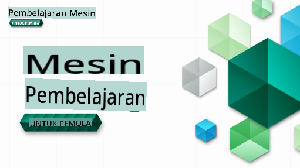

# Pembelajaran Mesin untuk Pemula - Kurikulum

> 🌍 Mari kita menjelajahi dunia sambil mempelajari Pembelajaran Mesin melalui budaya dunia 🌍

Advokat Cloud di Microsoft dengan senang hati menawarkan kurikulum selama 12 minggu, 26 pelajaran tentang **Pembelajaran Mesin**. Dalam kurikulum ini, Anda akan mempelajari apa yang kadang-kadang disebut sebagai **pembelajaran mesin klasik**, terutama menggunakan Scikit-learn sebagai pustaka dan menghindari pembelajaran mendalam, yang dibahas dalam [kurikulum AI untuk Pemula](https://aka.ms/ai4beginners). Pasangkan pelajaran ini dengan kurikulum ['Data Science untuk Pemula'](https://aka.ms/ds4beginners), juga!

Jelajahi dunia bersama kami saat kami menerapkan teknik klasik ini pada data dari berbagai wilayah di dunia. Setiap pelajaran mencakup kuis sebelum dan setelah pelajaran, instruksi tertulis untuk menyelesaikan pelajaran, solusi, tugas, dan banyak lagi. Pedagogi berbasis proyek kami memungkinkan Anda belajar sambil membangun, cara yang terbukti untuk membuat keterampilan baru 'melekat'.

**✍️ Terima kasih yang tulus kepada penulis kami** Jen Looper, Stephen Howell, Francesca Lazzeri, Tomomi Imura, Cassie Breviu, Dmitry Soshnikov, Chris Noring, Anirban Mukherjee, Ornella Altunyan, Ruth Yakubu, dan Amy Boyd

**🎨 Terima kasih juga kepada ilustrator kami** Tomomi Imura, Dasani Madipalli, dan Jen Looper

**🙏 Terima kasih khusus 🙏 kepada penulis, pengulas, dan kontributor konten Duta Mahasiswa Microsoft kami**, terutama Rishit Dagli, Muhammad Sakib Khan Inan, Rohan Raj, Alexandru Petrescu, Abhishek Jaiswal, Nawrin Tabassum, Ioan Samuila, dan Snigdha Agarwal

**🤩 Terima kasih ekstra kepada Duta Mahasiswa Microsoft Eric Wanjau, Jasleen Sondhi, dan Vidushi Gupta untuk pelajaran R kami!**

# Memulai

Ikuti langkah-langkah ini:
1. **Fork Repository**: Klik tombol "Fork" di sudut kanan atas halaman ini.
2. **Clone Repository**:   `git clone https://github.com/microsoft/ML-For-Beginners.git`

> [temukan semua sumber daya tambahan untuk kursus ini dalam koleksi Microsoft Learn kami](https://learn.microsoft.com/en-us/collections/qrqzamz1nn2wx3?WT.mc_id=academic-77952-bethanycheum)

**[Mahasiswa](https://aka.ms/student-page)**, untuk menggunakan kurikulum ini, fork seluruh repo ke akun GitHub Anda sendiri dan selesaikan latihan sendiri atau dengan kelompok:

- Mulailah dengan kuis sebelum kuliah.
- Baca kuliah dan selesaikan aktivitasnya, berhenti dan merenung pada setiap pemeriksaan pengetahuan.
- Cobalah membuat proyek dengan memahami pelajaran daripada menjalankan kode solusi; namun kode tersebut tersedia di folder `/solution` di setiap pelajaran yang berorientasi proyek.
- Ambil kuis setelah kuliah.
- Selesaikan tantangan.
- Selesaikan tugas.
- Setelah menyelesaikan kelompok pelajaran, kunjungi [Papan Diskusi](https://github.com/microsoft/ML-For-Beginners/discussions) dan "belajar dengan suara keras" dengan mengisi rubrik PAT yang sesuai. 'PAT' adalah Alat Penilaian Kemajuan yang merupakan rubrik yang Anda isi untuk melanjutkan pembelajaran Anda. Anda juga dapat bereaksi terhadap PAT lain sehingga kita bisa belajar bersama.

> Untuk studi lebih lanjut, kami merekomendasikan mengikuti modul dan jalur pembelajaran [Microsoft Learn](https://docs.microsoft.com/en-us/users/jenlooper-2911/collections/k7o7tg1gp306q4?WT.mc_id=academic-77952-leestott) ini.

**Guru**, kami telah [menyertakan beberapa saran](for-teachers.md) tentang cara menggunakan kurikulum ini.

---

## Video walkthroughs

Beberapa pelajaran tersedia dalam bentuk video pendek. Anda dapat menemukan semuanya di dalam pelajaran, atau di [daftar putar ML untuk Pemula di saluran YouTube Microsoft Developer](https://aka.ms/ml-beginners-videos) dengan mengklik gambar di bawah ini.

---

## Temui Tim

**Gif oleh** [Mohit Jaisal](https://linkedin.com/in/mohitjaisal)

> 🎥 Klik gambar di atas untuk video tentang proyek dan orang-orang yang membuatnya!

---

## Pedagogi

Kami telah memilih dua prinsip pedagogis saat membangun kurikulum ini: memastikan bahwa itu berbasis proyek **praktis** dan bahwa itu mencakup **kuis yang sering**. Selain itu, kurikulum ini memiliki **tema umum** untuk memberikan kohesi.

Dengan memastikan bahwa konten selaras dengan proyek, prosesnya menjadi lebih menarik bagi siswa dan retensi konsep akan ditingkatkan. Selain itu, kuis dengan risiko rendah sebelum kelas menetapkan niat siswa untuk mempelajari topik, sementara kuis kedua setelah kelas memastikan retensi lebih lanjut. Kurikulum ini dirancang agar fleksibel dan menyenangkan serta dapat diambil secara keseluruhan atau sebagian. Proyek dimulai dari yang kecil dan menjadi semakin kompleks pada akhir siklus 12 minggu. Kurikulum ini juga mencakup catatan tambahan tentang aplikasi dunia nyata dari ML, yang dapat digunakan sebagai kredit tambahan atau sebagai dasar untuk diskusi.

> Temukan [Kode Etik](CODE_OF_CONDUCT.md), [Kontribusi](CONTRIBUTING.md), dan panduan [Terjemahan](TRANSLATIONS.md) kami. Kami menyambut umpan balik konstruktif Anda!

## Setiap pelajaran mencakup

- sketchnote opsional
- video tambahan opsional
- video walkthrough (beberapa pelajaran saja)
- kuis pemanasan sebelum kuliah
- pelajaran tertulis
- untuk pelajaran berbasis proyek, panduan langkah demi langkah tentang cara membangun proyek
- pemeriksaan pengetahuan
- tantangan
- bacaan tambahan
- tugas
- kuis setelah kuliah

> **Catatan tentang bahasa**: Pelajaran ini terutama ditulis dalam Python, tetapi banyak juga yang tersedia dalam R. Untuk menyelesaikan pelajaran R, buka folder `/solution` dan cari pelajaran R. Mereka termasuk ekstensi .rmd yang merupakan file **R Markdown** yang dapat didefinisikan secara sederhana sebagai penyematan `code chunks` (dari R atau bahasa lain) dan `YAML header` (yang memandu cara memformat keluaran seperti PDF) dalam `Markdown document`. Dengan demikian, ini berfungsi sebagai kerangka kerja penulisan yang luar biasa untuk ilmu data karena memungkinkan Anda menggabungkan kode Anda, hasilnya, dan pemikiran Anda dengan memungkinkan Anda menuliskannya dalam Markdown. Selain itu, dokumen R Markdown dapat dirender ke format keluaran seperti PDF, HTML, atau Word.

> **Catatan tentang kuis**: Semua kuis terdapat dalam [folder Aplikasi Kuis](../../quiz-app), untuk total 52 kuis dengan tiga pertanyaan masing-masing. Mereka terhubung dari dalam pelajaran tetapi aplikasi kuis dapat dijalankan secara lokal; ikuti instruksi di folder `quiz-app` untuk menghosting secara lokal atau menyebarkan ke Azure.

| Nomor Pelajaran |                             Topik                              |                   Kelompok Pelajaran                   | Tujuan Pembelajaran                                                                                                             |                                                              Pelajaran Terkait                                                               |                        Penulis                        |
| :-----------: | :------------------------------------------------------------: | :-------------------------------------------------: | ------------------------------------------------------------------------------------------------------------------------------- | :--------------------------------------------------------------------------------------------------------------------------------------: | :--------------------------------------------------: |
|      01       |                Pengenalan pembelajaran mesin                |      [Pengenalan](1-Introduction/README.md)       | Pelajari konsep dasar di balik pembelajaran mesin                                                                                |                                             [Pelajaran](1-Introduction/1-intro-to-ML/README.md)                                             |                       Muhammad                       |
|      02       |                Sejarah pembelajaran mesin                 |      [Pengenalan](1-Introduction/README.md)       | Pelajari sejarah di balik bidang ini                                                                                         |                                            [Pelajaran](1-Introduction/2-history-of-ML/README.md)                                            |                     Jen dan Amy                      |
|      03       |                 Keadilan dan pembelajaran mesin                  |      [Pengenalan](1-Introduction/README.md)       | Apa saja isu filosofis penting seputar keadilan yang harus dipertimbangkan siswa saat membangun dan menerapkan model ML? |                                              [Pelajaran](1-Introduction/3-fairness/README.md)                                               |                        Tomomi                        |
|      04       |                Teknik untuk pembelajaran mesin                 |      [Introduction](1-Introduction/README.md)       | Teknik apa yang digunakan oleh peneliti ML untuk membina model ML?                                                                      |                                          [Lesson](1-Introduction/4-techniques-of-ML/README.md)                                           |                    Chris dan Jen                     |
|      05       |                   Pengenalan kepada regresi                   |        [Regression](2-Regression/README.md)         | Mulakan dengan Python dan Scikit-learn untuk model regresi                                                                  |         <ul><li>[Python](2-Regression/1-Tools/README.md)</li><li>[R](../../2-Regression/1-Tools/solution/R/lesson_1.html)</li></ul>         |      <ul><li>Jen</li><li>Eric Wanjau</li></ul>       |
|      06       |                Harga labu Amerika Utara 🎃                |        [Regression](2-Regression/README.md)         | Visualisasikan dan bersihkan data sebagai persiapan untuk ML                                                                                  |          <ul><li>[Python](2-Regression/2-Data/README.md)</li><li>[R](../../2-Regression/2-Data/solution/R/lesson_2.html)</li></ul>          |      <ul><li>Jen</li><li>Eric Wanjau</li></ul>       |
|      07       |                Harga labu Amerika Utara 🎃                |        [Regression](2-Regression/README.md)         | Bina model regresi linear dan polinomial                                                                                   |        <ul><li>[Python](2-Regression/3-Linear/README.md)</li><li>[R](../../2-Regression/3-Linear/solution/R/lesson_3.html)</li></ul>        |      <ul><li>Jen dan Dmitry</li><li>Eric Wanjau</li></ul>       |
|      08       |                Harga labu Amerika Utara 🎃                |        [Regression](2-Regression/README.md)         | Bina model regresi logistik                                                                                               |     <ul><li>[Python](2-Regression/4-Logistic/README.md) </li><li>[R](../../2-Regression/4-Logistic/solution/R/lesson_4.html)</li></ul>      |      <ul><li>Jen</li><li>Eric Wanjau</li></ul>       |
|      09       |                          Aplikasi Web 🔌                          |           [Web App](3-Web-App/README.md)            | Bina aplikasi web untuk menggunakan model yang telah dilatih                                                                                       |                                                 [Python](3-Web-App/1-Web-App/README.md)                                                  |                         Jen                          |
|      10       |                 Pengenalan kepada klasifikasi                 |    [Classification](4-Classification/README.md)     | Bersihkan, sediakan, dan visualisasikan data anda; pengenalan kepada klasifikasi                                                            | <ul><li> [Python](4-Classification/1-Introduction/README.md) </li><li>[R](../../4-Classification/1-Introduction/solution/R/lesson_10.html)  | <ul><li>Jen dan Cassie</li><li>Eric Wanjau</li></ul> |
|      11       |             Masakan Asia dan India yang lazat 🍜             |    [Classification](4-Classification/README.md)     | Pengenalan kepada pengelasan                                                                                                     | <ul><li> [Python](4-Classification/2-Classifiers-1/README.md)</li><li>[R](../../4-Classification/2-Classifiers-1/solution/R/lesson_11.html) | <ul><li>Jen dan Cassie</li><li>Eric Wanjau</li></ul> |
|      12       |             Masakan Asia dan India yang lazat 🍜             |    [Classification](4-Classification/README.md)     | Lebih banyak pengelasan                                                                                                                | <ul><li> [Python](4-Classification/3-Classifiers-2/README.md)</li><li>[R](../../4-Classification/3-Classifiers-2/solution/R/lesson_12.html) | <ul><li>Jen dan Cassie</li><li>Eric Wanjau</li></ul> |
|      13       |             Masakan Asia dan India yang lazat 🍜             |    [Classification](4-Classification/README.md)     | Bina aplikasi web cadangan menggunakan model anda                                                                                    |                                              [Python](4-Classification/4-Applied/README.md)                                              |                         Jen                          |
|      14       |                   Pengenalan kepada pengelompokan                   |        [Clustering](5-Clustering/README.md)         | Bersihkan, sediakan, dan visualisasikan data anda; Pengenalan kepada pengelompokan                                                                |         <ul><li> [Python](5-Clustering/1-Visualize/README.md)</li><li>[R](../../5-Clustering/1-Visualize/solution/R/lesson_14.html)         |      <ul><li>Jen</li><li>Eric Wanjau</li></ul>       |
|      15       |              Menjelajah Selera Muzik Nigeria 🎧              |        [Clustering](5-Clustering/README.md)         | Jelajahi kaedah pengelompokan K-Means                                                                                           |           <ul><li> [Python](5-Clustering/2-K-Means/README.md)</li><li>[R](../../5-Clustering/2-K-Means/solution/R/lesson_15.html)           |      <ul><li>Jen</li><li>Eric Wanjau</li></ul>       |
|      16       |        Pengenalan kepada pemprosesan bahasa semula jadi ☕️         |   [Natural language processing](6-NLP/README.md)    | Pelajari asas NLP dengan membina bot ringkas                                                                             |                                             [Python](6-NLP/1-Introduction-to-NLP/README.md)                                              |                       Stephen                        |
|      17       |                      Tugas Biasa dalam NLP ☕️                      |   [Natural language processing](6-NLP/README.md)    | Mendalami pengetahuan NLP dengan memahami tugas-tugas biasa yang diperlukan semasa mengendalikan struktur bahasa                          |                                                    [Python](6-NLP/2-Tasks/README.md)                                                     |                       Stephen                        |
|      18       |             Terjemahan dan analisis sentimen ♥️              |   [Natural language processing](6-NLP/README.md)    | Terjemahan dan analisis sentimen dengan Jane Austen                                                                             |                                            [Python](6-NLP/3-Translation-Sentiment/README.md)                                             |                       Stephen                        |
|      19       |                  Hotel romantik di Eropah ♥️                  |   [Natural language processing](6-NLP/README.md)    | Analisis sentimen dengan ulasan hotel 1                                                                                         |                                               [Python](6-NLP/4-Hotel-Reviews-1/README.md)                                                |                       Stephen                        |
|      20       |                  Hotel romantik di Eropah ♥️                  |   [Natural language processing](6-NLP/README.md)    | Analisis sentimen dengan ulasan hotel 2                                                                                         |                                               [Python](6-NLP/5-Hotel-Reviews-2/README.md)                                                |                       Stephen                        |
|      21       |            Pengenalan kepada ramalan siri masa             |        [Time series](7-TimeSeries/README.md)        | Pengenalan kepada ramalan siri masa                                                                                         |                                             [Python](7-TimeSeries/1-Introduction/README.md)                                              |                      Francesca                       |
|      22       | ⚡️ Penggunaan Tenaga Dunia ⚡️ - ramalan siri masa dengan ARIMA |        [Time series](7-TimeSeries/README.md)        | Ramalan siri masa dengan ARIMA                                                                                              |                                                 [Python](7-TimeSeries/2-ARIMA/README.md)                                                 |                      Francesca                       |
|      23       |  ⚡️ Penggunaan Tenaga Dunia ⚡️ - ramalan siri masa dengan SVR  |        [Time series](7-TimeSeries/README.md)        | Ramalan siri masa dengan Support Vector Regressor                                                                           |                                                  [Python](7-TimeSeries/3-SVR/README.md)                                                  |                       Anirban                        |
|      24       |             Pengenalan kepada pembelajaran pengukuhan             | [Reinforcement learning](8-Reinforcement/README.md) | Pengenalan kepada pembelajaran pengukuhan dengan Q-Learning                                                                          |                                             [Python](8-Reinforcement/1-QLearning/README.md)                                              |                        Dmitry                        |
|      25       |                 Bantu Peter mengelak serigala! 🐺                  | [Reinforcement learning](8-Reinforcement/README.md) | Pembelajaran pengukuhan Gym                                                                                                      |                                                [Python](8-Reinforcement/2-Gym/README.md)                                                 |                        Dmitry                        |
|  Postscript   |            Senario dan aplikasi ML di dunia sebenar            |      [ML in the Wild](9-Real-World/README.md)       | Aplikasi dunia sebenar yang menarik dan mendedahkan tentang ML klasik                                                               |                                             [Lesson](9-Real-World/1-Applications/README.md)                                              |                         Team                         |
|  Postscript   |            Debugging Model dalam ML menggunakan papan pemuka RAI          |      [ML in the Wild](9-Real-World/README.md)       | Debugging Model dalam Pembelajaran Mesin menggunakan komponen papan pemuka AI Bertanggungjawab                                                              |                                             [Lesson](9-Real-World/2-Debugging-ML-Models/README.md)                                              |                         Ruth Yakubu                       |

> [cari semua sumber tambahan untuk kursus ini dalam koleksi Microsoft Learn kami](https://learn.microsoft.com/en-us/collections/qrqzamz1nn2wx3?WT.mc_id=academic-77952-bethanycheum)

## Akses Luar Talian

Anda boleh menjalankan dokumentasi ini secara luar talian dengan menggunakan [Docsify](https://docsify.js.org/#/). Fork repo ini, [pasang Docsify](https://docsify.js.org/#/quickstart) pada mesin tempatan anda, dan kemudian dalam folder root repo ini, taipkan `docsify serve`. Laman web akan disediakan pada port 3000 di localhost anda: `localhost:3000`.

## PDF
Cari pdf kurikulum dengan pautan [di sini](https://microsoft.github.io/ML-For-Beginners/pdf/readme.pdf).

## Bantuan Diperlukan

Adakah anda ingin menyumbang terjemahan? Sila baca [panduan terjemahan kami](TRANSLATIONS.md) dan tambah isu berasaskan templat untuk menguruskan beban kerja [di sini](https://github.com/microsoft/ML-For-Beginners/issues).

## Kurikulum Lain

Pasukan kami menghasilkan kurikulum lain! Lihat:

- [AI untuk Pemula](https://aka.ms/ai4beginners)
- [Sains Data untuk Pemula](https://aka.ms/datascience-beginners)
- [**Versi 2.0 Baru** - Generative AI untuk Pemula](https://aka.ms/genai-beginners)
- [**BARU** Keselamatan Siber untuk Pemula](https://github.com/microsoft/Security-101??WT.mc_id=academic-96948-sayoung)
- [Pembangunan Web untuk Pemula](https://aka.ms/webdev-beginners)
- [IoT untuk Pemula](https://aka.ms/iot-beginners)
- [Pembelajaran Mesin untuk Pemula](https://aka.ms/ml4beginners)
- [Pembangunan XR untuk Pemula](https://aka.ms/xr-dev-for-beginners)
- [Menguasai GitHub Copilot untuk Pengaturcaraan Berpasangan AI](https://aka.ms/GitHubCopilotAI)

**Penafian**: 
Dokumen ini telah diterjemahkan menggunakan perkhidmatan terjemahan AI berasaskan mesin. Walaupun kami berusaha untuk ketepatan, sila ambil perhatian bahawa terjemahan automatik mungkin mengandungi kesilapan atau ketidaktepatan. Dokumen asal dalam bahasa asalnya harus dianggap sebagai sumber yang berwibawa. Untuk maklumat penting, terjemahan manusia profesional adalah disyorkan. Kami tidak bertanggungjawab atas sebarang salah faham atau salah tafsir yang timbul daripada penggunaan terjemahan ini.