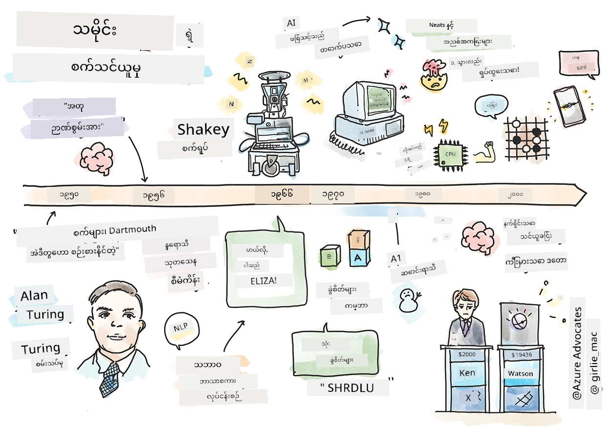
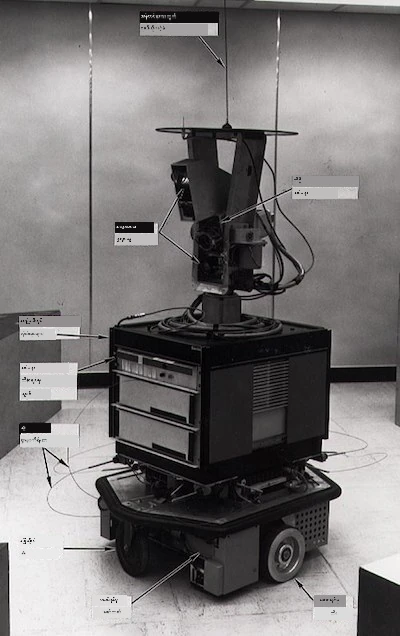
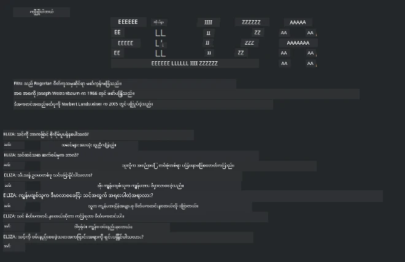

# စက်သင်ယူခြင်း၏ သမိုင်းကြောင်း

> စကက်ချန်နိုးကို [Tomomi Imura](https://www.twitter.com/girlie_mac) မှ ဖန်တီးသည်

## [မိတ်ဆက်ခန်းမမေးခွန်း](https://ff-quizzes.netlify.app/en/ml/)

---

> 🎥 ဒီသင်ခန်းစာကို လေ့လာရန် ဗီဒီယိုတိုကို အပေါ်ဓာတ်ပုံကို နှိပ်ပါ။

ဒီသင်ခန်းစာမှာ စက်သင်ယူခြင်းနဲ့ လူမှုပညာရပ်ဇာတိကျဇယားတစ်ခုဖြစ်တဲ့ အတုအယောင်ပါဝင်တဲ့ အတုအယောင်ဖြစ်မှုအရေးပါရာ ဖွံ့ဖြိုးမှုကို ဖြစ်ပေါ်လာသည့် အကြောင်းကြီးတစ်ခုချင်းစီကို လမ်းလျှောက်သွားမှာဖြစ်သည်။

လူမှုပညာရပ် (AI) ရဲ့ သမိုင်းကြောင်းသည် စက်သင်ယူခြင်း၏ သမိုင်းနှင့် ပေါင်းသင်းနေပြီး ML အခြေခံထားသော အယ်လ်ဂိုရစ်သမ်များနှင့် ကွန်ပျူတာတိုးတက်မှုများသည် AI ဖွံ့ဖြိုးရာတွင် အရေးပါပြီးဖြစ်သည်။ ဒီနယ်ပယ်များသည် 1950 တန်းက စတင်ပေါ်ထွက်ခဲ့ကြပေမယ့် အရေးကြီးသော [အယ်လ်ဂိုရစ် သမ်၊ သင်္ချာ၊ စာရင်းပညာနှင့် နည်းပညာရှာဖွေမှုများ](https://wikipedia.org/wiki/Timeline_of_machine_learning) ကို ဒီကာလမတိုင်ခင်တည်းကလည်း ရှိခဲ့ပြီး တချို့အချိန်အကွာအဝေးထဲမှ တူရိယာကြမ်းဖက်မှုများပါ စဉ်ဆက်မပြတ် ရှိနေခဲ့သည်။ အမှန်တကယ် လူတွေဟာ [ရာစုများကြာပြီး](https://wikipedia.org/wiki/History_of_artificial_intelligence) စိတ်ကူးထားသော 'စဉ်းစားတတ်သောစက်' အတွေးအခေါ်များအပေါ် ဆက်စပ်စဉ်းစားလာကြပြီး ဒီဆောင်းပါးသည် ထိုအတွေး၏ သမိုင်းကြောင်းတ္တိတင်အတွေးအခေါ်များကို ဆွေးနွေးသည်။

---
## ထူးခြားသော ရှာဖွေတွေ့ရှိမှုများ

- 1763, 1812 [Bayes သီအိုရီ](https://wikipedia.org/wiki/Bayes%27_theorem) နှင့် ၎င်း၏ ယခင်မျိုးဆက်များ။ ဤသီအိုရီနှင့် ၎င်း၏ အသုံးချမှုများသည် အခြေခံပြီး အဖြစ်တွေဖြစ်ပေါ်နိုင်မှုကို ရှာဖွေဖော်ပြသည်။
- 1805 ပြင်သစ်သင်္ချာပညာရှင် Adrien-Marie Legendre ၏ [အနည္းဆုံးစတုရန်းသီအိုရီ](https://wikipedia.org/wiki/Least_squares)။ ဤသီအိုရီသည် ဒေတာကို ကိုက်ညီစေရန် အထောက်အကူပြုသည်။
- 1913 ရုရှားသင်္ချာပညာရှင် Andrey Markov ၏ အမည်ပေါ်မူတည်၍ [Markov လမ်းကြောင်းများ](https://wikipedia.org/wiki/Markov_chain) သည် ယခင်အခြေအနေများပေါ်မူတည်၍ ဖြစ်နိုင်သောဖြစ်ရပ်များအဆက်အစပ်ကို ဖော်ပြရန်အသုံးပြုသည်။
- 1957 အမေရိကန်စိတ်ပညာရှင် Frank Rosenblatt မှ ဖန်တီးသော [Perceptron](https://wikipedia.org/wiki/Perceptron) သည် အကြောင်းအရာလိုက်ခွဲခြားရေးနည်းပညာတစ်မျိုးဖြစ်ပြီး နက်ရှိုင်းစိတ်ကွဲနည်းပညာ တိုးတက်မှုများ၏ အခြေခံဖြစ်သည်။

---

- 1967 [အနီးဆုံးအိမ်နှင့်စာရင်းစစ်ခြင်း](https://wikipedia.org/wiki/Nearest_neighbor) သည် စတင်က မောင်းနှင်လမ်းကြောင်းများ ချထားရန် ဖန်တီးခဲ့သော်လည်း ML တွင် ပုံစံများကို ရှာဖွေရန်အသုံးပြုသည်။
- 1970 [Backpropagation](https://wikipedia.org/wiki/Backpropagation) ကို [feedforward neural networks](https://wikipedia.org/wiki/Feedforward_neural_network) ကို လေ့ကျင့်ရေးအတွက် အသုံးပြုသည်။
- 1982 [Recurrent Neural Networks](https://wikipedia.org/wiki/Recurrent_neural_network) သည် feedforward neural networks မှ မူရင်းယူ၍ အချိန်ဆက်တိုက်သဏ္ဍာန်ရသော ကွန်ယက်များ ဖန်တီးသော အတုများဖြစ်သည်။

✅ သုတေသန တစိတ်တပိုင်းလုပ်ပါ။ ML နဲ့ AI ရဲ့ သမိုင်းမှာ အရေးကြီးတဲ့ နေ့ရက်တစ်ချို့က ဘာတွေလဲဆိုတာ ရှာဖွေကြည့်ပါ။

---
## 1950: စဉ်းစားတတ်သော စက်များ

Alan Turing, လူထုမှ 2019 ခုနှစ်တွင် [20 ရာစု၏ ထိပ်ဆုံး သိပ္ပံပညာရှင်ရင်း](https://wikipedia.org/wiki/Icons:_The_Greatest_Person_of_the_20th_Century) အဖြစ် မဲပေးထောက်ခံခဲ့သူ တစ်ဦးဖြစ်ပြီး၊ 'စဉ်းစားတတ်သောစက်' ဆိုသော အဓိပ္ပါယ် အခြေခံရန် အခြေခံထားသူတစ်ဦးအနေဖြင့် ကျွမ်းကျင်သူဖြစ်သည်။ သူသည် ယမကာများနှင့် မိမိအသက်သက်သေခံချက်ဖြစ်စေခြင်းလိုအပ်ချက်ကြားတွင် တစ်စိတ်တစ်ပိုင်းဖြစ်ပြီး [Turing စမ်းသပ်မှု](https://www.bbc.com/news/technology-18475646) ကို ဖန်တီးခဲ့သည်။ ၎င်းသည် ကျွန်တော်တို့ NLP သင်ခန်းစာများတွင် လေ့လာသွားမည်ဖြစ်သည်။

---
## 1956: Dartmouth နွေရာသီ သုတေသန စီမံကိန်း

"Dartmouth နွေရာသီ သုတေသန စီမံကိန်းသည် လူမှုပညာရပ်တစ်ခုအနေဖြင့် အရေးကြီးသော ရက်ခွင်တစ်ခုဖြစ်ပြီး လူမှုပညာရပ် ဆိုသော စကားလုံးကို ပထမဆုံးဖန်တီးခဲ့သည်။" ([ရင်းမြစ်](https://250.dartmouth.edu/highlights/artificial-intelligence-ai-coined-dartmouth))

> သင်ယူမှု၏ ဂဏန်းမတူသော အပါအဝင် လူမှုပညာရပ်၏ မည်သည့်အချက်အလက်တွင်မဆို တိကျစွာ ဖော်ပြနိုင်ပြီး၊ စက်တစ်စက်ဖြင့် အတုလုပ်နိုင်သည်။

---

ဦးဆောင်သုတေသနဆရာ John McCarthy သည် "သင်ယူမှု၏ မည်သည့်အချက်ကိုမဆို တိကျစွာဖော်ပြနိုင်သောကြောင့် စက်ဖြင့် အတုလုပ်နိုင်သည်" ဟူသော သီအိုရီပေါ်မူတည်၍ ရှေ့ဆက်၍ အလုပ်လုပ်မည်ဟု မျှော်လင့်ခဲ့သည်။ ပါဝင်သူများထဲတွင် Marvin Minsky ဟူသော နယ်ပယ်ကျော်ကြားသူတစ်ဦးပါဝင်ခဲ့သည်။

ဤအစည်းအဝေးသည် "သင်္ကေတသုံးနည်းလမ်းများ မြင့်တက်လာခြင်း၊ အကန့်အသတ်ရှိသော နယ်ပယ်များအတွင်း ဦးတည်သော စနစ်များ (အစောပိုင်း ကျွမ်းကျင်သူစနစ်များ) နှင့် ကုသိုလ်ရှာဖွေရေးစနစ်များနှင့် အညီအစပ်စနစ်များ" စသည်တို့ ဆွေးနွေးမှုများကို ဖြေဠာက်လျက်ရှိသည်။ ([ရင်းမြစ်](https://wikipedia.org/wiki/Dartmouth_workshop))

---
## 1956 - 1974: "ရွှေ့ရတီနှစ်များ"

1950 ခုနှစ်များမှ 1970s အလယ်အလတ်အထိ လူမှုပညာရပ်သည် ပြဿနာများကို ဖြေရှင်းနိုင်ကြောင်း မျှော်လင့်ချက်များ စိတ်ဓာတ်မြင့်မားခဲ့သည်။ 1967 ခုနှစ်တွင် Marvin Minsky က "တစ်မျိုးဆက်အတွင်း... 'လူမှုပညာရပ်' ဖန်တီးမှု ပြဿနာကို အဓိကအားဖြင့် ဖြေရှင်းလိမ့်မည်" ဟူ၍ ယုံကြည်စွာ ထုတ်ပြန်ခဲ့သည်။ (Minsky, Marvin (1967), Computation: Finite and Infinite Machines, Englewood Cliffs, N.J.: Prentice-Hall)

သဘာဝဘာသာစကားကို သုတေသန ပြုလုပ်ခြင်း ပျံ့နှံ့ခဲ့ပြီး ရှာဖွေမှုနည်းလမ်းအသစ်များ သာမာန်ဘာသာစကားညွှန်ကြားချက်များဖြင့် အလွယ်တကူ ပြီးမြောက်စေရန် စီမံကိန်းများ ဖန်တီးခဲ့သည်။

---

အစိုးရအဖွဲ့အစည်းများမှ စုံစုံလင်လင် ရန်ပုံငွေဖြင့် ထောက်ပံ့ခဲ့ပြီး ကွန်ပျူတာနှင့် အယ်လ်ဂိုရစ်သမ်များ အောင်မြင်မှုများ ရှိခဲ့သည်။ ၎င်းတို့ထဲမှာ အနည်းငယ်သော စက်များမှာ:

* [Shakey the robot](https://wikipedia.org/wiki/Shakey_the_robot) သည် လမ်းညွှန်ခြင်းနှင့် အလုပ်များကို 'အသိပညာ' ဖြင့် ဆုံးဖြတ်နိုင်သည်။

    
    > 1972 ခုနှစ်တွင် Shakey

---

* Eliza သည် ကျူးလွန်သူ 'စကားပြောစက်' တစ်ခုဖြစ်ပြီး လူများနှင့် စကားပြောဆက်ဆံခြင်းနှင့် အဓိက 'ကုထုံးပေးသူ' အဖြစ် ဆောင်ရွက်နိုင်သည်။ NLP သင်ခန်းစာများတွင် Eliza အကြောင်း များစွာ သိရှိသွားမည်။

    
    > Eliza ၏ ဗားရှင်းတစ်ခု၊ စကားပြောစက်တစ်ခု

---

* "Blocks world" သည် စက်များစွမ်းဆောင်ဆရာပြုရန် စားပွဲပျော်မြောက်မှု နှင့် စီစစ်ပေးမှုများ လုပ်ဆောင်နိုင်သော micro-world တစ်ခုဖြစ်ပြီး [SHRDLU](https://wikipedia.org/wiki/SHRDLU) ကဲ့သို့သော စာကြောင်းဖြန့်ဖြူးမှု ကို တိုးတက်စေမည့် စာကြောင်းခွဲတမ်းများ ဖန်တီးရန် အသုံးပြုခဲ့သည်။

    

    > 🎥 ဓာတ်ပုံအပေါ်ကို နှိပ်ပြီး ဗီဒီယိုကြည့်ရှုပါ: Blocks world with SHRDLU

---
## 1974 - 1980: "AI ဆောင်းရာသီ"

1970s အလယ်အတွင်း 'အသိပညာရှိစက်များ' ဖန်တီးရခြင်း၏ ရှုပ်ထွေးမှုကို မျှော်လင့်ချက်ထက် ပိုမိုနည်းနေပြီး ရန်ပုံငွေ သက်သာလျော့နည်းလာပြီ သက်သေအားလုံး ရှငျဆီးကြောင့် ယုံကြည်မှု လျော့နည်းလာခဲ့သည်။ ယုံကြည်မှု လျော့နည်းစေသည့် ကိစ္စအချို့မှာ:
---
- **ကန့်သတ်ချက်များ**။ ကွန်ပျူတာစွမ်းအား မလုံလောက်ခြင်း။
- **Combinatorial ပွင့်ပွင့်လင်းလင်းကြီးထွားမှု**။ ပိုမိုမေးမြန်းရန်အတွက် စနစ်လက်ရှိ လေ့ကျင့်ဆောင်ရွက် သည် parameter ပမာဏ ပျမ်းမျှအတိုင်း တိုးတက်မှုမရှိခြင်း။
- **ဒေတာမလုံလောက်ခြင်း**။ အယ်လ်ဂိုရစ်သမ်များ ကို စမ်းသပ်၊ ဖွံ့ဖြိုးမြှင့်တင်ခြင်းတွင် ဒေတာနည်းပါးမှုကြောင့် ချို့ယွင်းမှုဖြစ်ခဲ့သည်။
- **ကျွန်တော်တို့ မေးခွန်းမြန်မာဖို့မှန်သလား?**. မေးခွန်းများကို ခွဲခြားစစ်ဆေးရန် စတင်ခဲ့သည်။ သုတေသနဆရာများသည် မိမိနည်းလမ်းများအပေါ် အပြစ်တင်ခံရခြင်းရှိသည်။
  - Turing စမ်းသပ်မှုများသည် 'တရုတ်အခန်း သီအိုရီ' စနစ်ကဲ့သို့ အကြံပြုချက်တစ်ခုဖြင့် စိစစ်ခံရသည်၊ ဤအကြောင်းက "ဒစ်ဂျစ်တယ်ကွန်ပျူတာကို အစီအစဉ်ရေးခြင်းကဘာသာစကားကို နားလည်သဏ္ဍာန်လုပ်ပေးနိုင်သော်လည်း ကိုယ့်ခံနားလည်မှုကို မဖန်တီးနိုင်ပါ။" ([ရင်းမြစ်](https://plato.stanford.edu/entries/chinese-room/))
  - လူမှုအသိုင်းအဝိုင်းထဲမှ “ကုထုံးပေးသူ” ELIZA အဖွဲ့အစည်းများကို မူဝါဒသတ်မှတ်ခြင်း အပေါ်စိစစ်တင်ပြခြင်းရှိနေသည်။

---

တူတူအချိန်တွင် AI အတွေးအခေါ်အချို့ ဖွဲ့စည်းလာသည်။ ["ခွက်ဆွဲသော" နှင့် "စနစ်တကျ AI"] ပုံစံများကြား ရိုက်နှက်မှု ဖြစ်ပေါ်ခဲ့သည်။ _ခွက်ဆွဲသော_ လက်ရုံးနည်းစနစ်များသည် မိနစ်များစွာ ပြင်ဆင်ခဲ့သည်။ _စနစ်တကျ_ စက်ရုံများ သည်းခံစွာ သင်္ချာနှင့် အချက်ပြ ဟန်ချက်ညီကာ ပြဿနာများ ဖြေရှင်းရာတွင် ဦးတည်သည်။ ELIZA နဲ့ SHRDLU သည် _ခွက်ဆွဲသော_ စနစ်များ ဖြစ်သည်။ 1980s တွင် ML စနစ်များကို ထပ်မံထုတ်ပြန်နိုင်စေရန် လိုအပ်လာပြီး ယင်းအတွက် _စနစ်တကျ_ နည်းလမ်းများ အားသာမှု ရရှိလာသည်။

---
## 1980s စွမ်းကျင်သူ စနစ်များ

နယ်ပယ်တိုးတက်လာသည်နှင့်အမျှ စီးပွားရေးတွင် အသုံးအဆောင်ဖြစ်လာပြီး 1980s တွင် 'စွမ်းကျင်သူစနစ်' များ တိုးချဲ့ခဲ့သည်။ "စွမ်းကျင်သူစနစ်များသည် လူမှုပညာရပ် (AI) ဆော့ဖ်ဝဲအမျိုးအစား အောင်မြင်ပြီးစတင်သော ပုံစံများဖြစ်သည်။" ([ရင်းမြစ်](https://wikipedia.org/wiki/Expert_system))

၎င်းစနစ်များသည် ဟိုက်ဘရစ်အမျိုးအစားဖြစ်ပြီး တစ်စိတ်တစ်ပိုင်းမှာ စီးပွားရေးလိုအပ်ချက်များကို သိမ်းဆည်းထားသော စည်းမျဉ်းစနစ်ဖြစ်ပြီး နောက်တစ်စိတ်မှာ စည်းမျဉ်းစနစ်ကို အသုံးပြု၍ အချက်အလက်သစ်များကို ထုတ်ယူခွင့်ရသော စနစ်ဖြစ်သည်။

ဤအချိန်ကာလတွင် နယူးရယ်ကွန်ယက်များတွင် ပိုမိုစိတ်ဝင်စားလာသော အချိန်လည်းဖြစ်သည်။

---
## 1987 - 1993: AI 'အေးခဲမှု'

ကြီးမှုထူးခြားသည့် စွမ်းကျင်သူစနစ်များ ရုံးခွဲများ ဖြစ်လာသည်။ မိမိစီးပွားရေးကိုယ်ပိုင် ကွန်ပျူတာများ လည်း ဤကြီးမားပြီး အထူးပြုစနစ်များဖြင့် ယှဉ်ပြိုင်လာပါသည်။ ကွန်ပျူတာများကို လူသုံးများလာခြင်းက ကွန်ပျူတာဒေတာများ ပိုမိုကြီးပြင်းလာရန် များစွာ ခြေလှမ်းတိုးခဲ့သည်။

---
## 1993 - 2011

ဒီအချိန်ကာလတွင် ML နှင့် AI သည် ဒေတာနည်းပါးခြင်းနှင့် ကွန်ပျူတာစွမ်းအား ကန့်သတ်ချက်အရ ဖြစ်ပေါ်ခဲ့သော ပြဿနာများကို ဖြေရှင်းနိုင်ရန် အသစ်တစ်ခုချင်းစီ ကာလဖြစ်ခဲ့သည်။ ဒေတာ ပမာဏများမြန်ဆန်စွာတိုးပွားလာပြီး အသုံးပြုမှု ပိုမိုကျယ်ပြန့်လာခဲ့သည်။ အထူးသဖြင့် 2007 ခုနှစ်အနီးတွင် စမတ်ဖုန်းများပေါ်ပေါက်လာခဲ့သည်။ ကွန်ပျူတာစွမ်းအားသည် ပရိုက်မီတစ်သည့်ဖြစ်ပြီး အယ်လ်ဂိုရစ်သမ်များလည်း တိုးတက်ကောင်းမွန်လာသည်။ နယ်ပယ်သည် ကျွမ်းကျင်လာပြီး ယခင်自由自在သောကာလ သည် တကယ့်အတည်ပြုသော သင်တန်းရပ်ဖြစ်လာသည်။

---
## ယနေ့

ယနေ့စက်သင်ယူခြင်း နဲ့ AI သည် ကျွန်တော်တို့ဘဝ၏ များသော ရာထူးကို ထိန်းသိမ်းထားသည်။ ဒီအချိန်ကာလမှာ သက်ဆိုင်ရာ နည်းလမ်းများ အန္တရာယ်များနှင့် အကျိုးဆက်များကို သေချာ သိရှိရန် လိုအပ်သည်။ Microsoft ၏ Brad Smith က ပြောကြားခဲ့သလို "သတင်းအချက်အလက်နည်းပညာသည် မူဝါဒဆိုင်ရာ အခြေခံ အခွင့်အရေးများဖြစ်သည့် ကိုယ်ရေးကိုယ်တာရေးနှင့် အသံလွှင့်ခွင့်ကဲ့သို့ ဂရုပြုမှုအရေးကြီးသောကိစ္စများကို ဖြစ်ပေါ်စေသည်။ ၎င်းအချက်များသည် ထုတ်ကုန်များဖန်တီးသော နည်းပညာကုမ္ပဏီများ၏ တာဝန်ကို တင်မြှောက်သည်။ ကျွန်တော်တို့၏ အမြင်အရ ထိုသူတို့သည် အတည်ပြုခွင့်ရှိသော စီမံခန့်ခွဲမှုနှင့် သုံးစွဲမှုနည်းစနစ်များဖန်တီးရန် အစိုးရစီမံကိန်းတစ်ခုလိုအပ်ကြောင်းဖြစ်သည်။" ([ရင်းမြစ်](https://www.technologyreview.com/2019/12/18/102365/the-future-of-ais-impact-on-society/))

---

မနာလိုက်မနေပြီးတော့ နောက်လှည့်အခြေအနေမှာ ဘာတွေရှိမယ်ဆိုတာ သိသင့်သော်လည်း ဒီကွန်ပျူတာစနစ်များနဲ့ ၎င်းတို့ရဲ့ ဆော့ဖ်ဝဲနဲ့ အယ်လ်ဂိုရစ်သမ်များကို သိရှိနားလည်ခြင်းအရေးကြီးသည်။ ဒီသင်တန်းအစီအစဉ်သည် သင်များ ပိုမိုနားလည်ကောင်းစေရန် ကူညီနိုင်မည်ဟု မျှော်လင့်ပါတယ်။

> 🎥 ဓာတ်ပုံအထက်ကို နှိပ်၍ ဗီဒီယိုကြည့်ရှုပါ: Yann LeCun က သင်ခန်းစာတွင် နက်ရှိုင်းစိတ်ကွဲနည်းပညာ၏ သမိုင်းကို ဆွေးနွေးခြင်း

---
## 🚀 စိန်ခေါ်မှု

ဒီသမိုင်းဖြတ်သန်းဖြစ်ရပ်အချို့ကို စူးစမ်းပြီး နောက်ကွယ်က လူတွေအကြောင်းပို၍ လေ့လာပါ။ စိတ်ဝင်စားဖွယ်ကောင်းသော ဇာတ်ကောင်များ တွေ့ရှိရမည်ဖြစ်ပြီး သိပ္ပံရှာဖွေမှုသည် ယဉ်ကျေးမှုနယ်ပယ်ကအစရဲ႕ မရှိမျှပါ။

## [သင်ခန်းစာပြီးနောက် မေးခွန်းများ](https://ff-quizzes.netlify.app/en/ml/)

---
## ပြန်လည်ဆန်းစစ်ခြင်းနှင့် ကိုယ်တိုင်လေ့လာခြင်း

ဒီ့အတွက် စုံစမ်းကြည့်ရန်နှင့် နားထောင်ရန် ရှိသည်။

[Amy Boyd က လူမှုပညာ၏ ဖွံ့ဖြိုးတိုးတက်မှုကို ဆွေးနွေးသော ပေါ့ဒ်ကတ်](http://runasradio.com/Shows/Show/739)

---

## အလုပ်အမှု

[အချိန်ဇယားတစ်ခု ဖန်တီးပါ](assignment.md)

---

<!-- CO-OP TRANSLATOR DISCLAIMER START -->
**ပြောကြားချက်**
ဤစာတမ်းကို AI ဘာသာပြန်ဝန်ဆောင်မှု [Co-op Translator](https://github.com/Azure/co-op-translator) အသုံးပြု၍ ဘာသာပြန်ထားပါသည်။ ကျွန်ုပ်တို့သည် တိကျမှန်ကန်မှုအတွက် ကြိုးပမ်းနေသော်လည်း၊ စက်ကိရိယာဘာသာပြန်ခြင်းများတွင် အမှားများ သို့မဟုတ် မှားယွင်းချက်များ ပါဝင်နိုင်ကြောင်း သတိပြုပါရန် လိုအပ်ပါသည်။ မူလစာတမ်းကို မူရင်းဘာသာဖြင့်သာ ယုံကြည်စိတ်ချရသော အချက်အလက်အဖြစ် သတ်မှတ်သင့်သည်။ အရေးကြီးသည့် သတင်းအချက်အလက်များအတွက် ပရော်ဖက်ရှင်နယ် လူသားဘာသာပြန်သူဝန်ဆောင်မှုကို အကြံပြုပါသည်။ ဤဘာသာပြန်ချက်ကို အသုံးပြုခြင်းမှ ဖြစ်ပေါ်လာသော နားလည်မှုကွာခြားမှုများ သို့မဟုတ် မမှန်ကန်သော အသုံးပြုမှုများအတွက် ကျွန်ုပ်တို့ တာဝန်မခံပါ။
<!-- CO-OP TRANSLATOR DISCLAIMER END -->