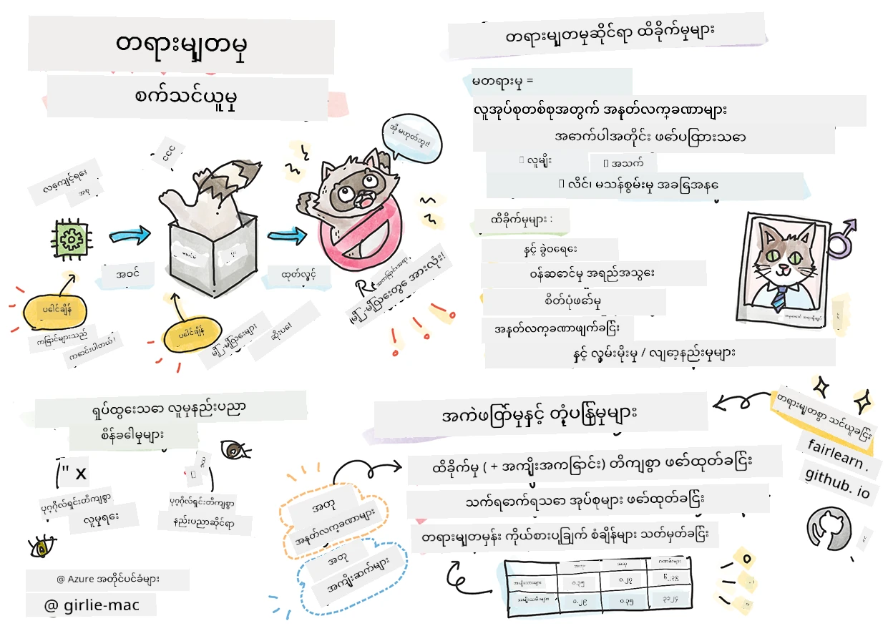

# တာဝန်ရှိသော AI ဖြင့် စက့်မှတ်လေ့လာမှု ဖြေရှင်းနည်းများ တည်ဆောက်ခြင်း
 

> [Tomomi Imura](https://www.twitter.com/girlie_mac) မှ စက့်မှတ်နိုတ်

## [သင်ခန်းစာမတိုင်မီ စစ်ဆေးမေးခွန်း](https://ff-quizzes.netlify.app/en/ml/)
 
## နိဒါန်း

ဒီသင်ရိုးမှာ၊ စက့်မှတ်လေ့လာမှု (Machine Learning) သည် ကျွန်တော်တို့၏ နေ့စဥ်ဘဝများကို ဘယ်လို သက်ရောက်နိုင်ပြီး သက်ရောက်နေသည်ကို စတင်ရှာဖွေ သင်ကြားမည်။ ယနေ့ဟာတောင် ကုမ္ပဏီစနစ်များနှင့် မော်ဒယ်များသည် နေ့စဥ် ဆုံးဖြတ်ချက်များ တာဝန်ယူရာတွင် ပါဝင်နေကြပြီး ကျန်းမာရေးဌာန ရောဂါသိမြင်ခြင်းများ ၊ ကျပ်ငွေ ခွင့်ပြုချက်များ သို့မဟုတ် လိမ်လည်မှုတွေ ရှာဖွေရေး စသည်ဖြင့် ပါဝင်သည်။ ထို့ကြောင့် အဲဒီမော်ဒယ်တွေက ယုံကြည်စိတ်ချရတဲ့ ရလဒ်တွေ ရရှိစေရန် ကောင်းစွာ အသုံးပြုနိုင်ဖို့ အရေးကြီးပါပဲ။ ဆော့ဖ်ဝဲလ်လ်လ်မှာ ဖြစ်နိုင်သလို AI စနစ်များလည်း မျှော်လင့်ချက်များကို မဖြည့်ဆည်းနိုင် ရလဒ် မမှန်ကန်ခြင်းတွေ ဖြစ်တတ်ပါတယ်။ ဒါကြောင့် AI မော်ဒယ်တစ်ခု၏ လုပ်ဆောင်ချက်များကို နားလည်ရန် နှင့် ရှင်းပြနိုင်ရန် နှစ်ပါးရှိခြင်းသည် အရေးကြီးပါသည်။

မော်ဒယ်ထားဆောက်ရာတွင် အသုံးပြုသော ဒေတာတွင် လူမျိုး၊ ကျားမ၊ နိုင်ငံရေး အမြင်၊ ဘာသာရေး သို့မဟုတ် အချို့ လူ့အုပ်စုများ ပြည့်စုံစွာ မပါဝင်ခြင်း သို့မဟုတ် မညီမျှစွာ ကိုယ်စားပြု ဖြစ်နေခြင်း ဖြစ်လာခဲ့ပါက ဘာတွေ ဖြစ်နိုင်မလဲဆိုတာ စဉ်းစားကြည့်ပါ။ မော်ဒယ်၏ ထွက်လာသော ရလဒ်သည် အချို့ လူမျိုးအုပ်စုများ အကျိုးပြုရန် အဓိပ္ပါယ် လျှင်ပါက အက်ပလီကေးရှင်းအတွက် ထိရောက်မှု ဘယ်လို ဖြစ်ကြမလဲ? ထို့ပြင် မော်ဒယ်တွင် မကောင်းစွာ ထွက်ရှိခြင်းများ ဖြစ်ပွားပြီး လူမှုကို ထိခိုက်စေပါက အဲဒီ AI စနစ်၏ လုပ်ဆောင်ချက်များအတွက် တာဝန်ရှိသူများမှာ ဘယ်သူများဖြစ်မလဲ? ဒီမေးခွန်းများကို ဒီသင်ရိုးမှာ ရှာဖွေပေးသွားမှာ ဖြစ်ပါတယ်။

ဒီသင်ခန်းစာမှာ မင်းတွေ လုပ်လို့ရမှာက

- စက့်မှတ်လေ့လာမှုတွင် တရားမျှတမှုပေါ် အာရုံစိုက်မှု မြှင့်တင်ခြင်းနှင့် တရားမျှတမှုဆိုင်ရာ ထိခိုက်မှုများကို နားလည်ခြင်း။
- ရေတွက်နိုင်စရာ မဟုတ်သော အကြောင်းအရာများနှင့် မလွဲမှားသော အခြေအနေများကို စူးစမ်းလေ့လာခြင်းဖြင့် ယုံကြည်စိတ်ချရမှုနှင့် လုံခြုံမှုကို အာမခံခြင်း။
- တစ်ဦးချင်းစီအားပါဝင်မှုရှိစေရန် စနစ်များကို ဒီဇိုင်းဆွဲခြင်းအားဖြင့် အားပေးပို့ဆောင် ဖွံ့ဖြိုးတိုးတက်မှု ရရှိစေရန် နားလည်မှု ရရှိခြင်း။
- ဒေတာနှင့် လူများ၏ လျှို့ဝှက်ရေးနှင့် လုံခြုံရေးကို ကာကွယ်ရန် အရေးကြီးမှု စူးစမ်းလေ့လာခြင်း။
- AI မော်ဒယ်၏ လုပ်ဆောင်ချက်များကို ရှင်းလင်း သော ကောင်တာ (glass box) နည်းလမ်းဖြင့် ရှင်းပြနိုင်သော အရေးပါမှုကို မြင်တွေ့ခြင်း။
- AI စနစ်များ၏ ယုံကြည်မှုကို တည်ဆောက်ရန် တာဝန်ယူမှု အသိအမှတ်ပြုမှု အရေးကြီးမှုအပေါ် သတိပြုခြင်း။

## ကြိုတင် အရည်အချင်း

ကြိုတင် အရည်အချင်းအနေနဲ့ "တာဝန်ရှိသော AI နိယာမများ" ရေးဖြေနက်ကို လေ့လာပြီး အောက်ဖော်ပြပါ ဗီဒီယိုကို ကြည့်ပါ။

ဒီ [Learning Path](https://docs.microsoft.com/learn/modules/responsible-ai-principles/?WT.mc_id=academic-77952-leestott) မှတဆင့် တာဝန်ရှိသော AI အကြောင်း ပိုမိုသိရှိနိုင်ပါသည်။

> 🎥 အထက်ဖော်ပြပါ ဓာတ်ပုံကို နှိပ်ကာ မိုက်ကရိုဆော့ဖ့စ်၏ တာဝန်ရှိသော AI နည်းလမ်း ဗီဒီယိုကို ကြည့်ရှုပါ

## တရားမျှတမှု

AI စနစ်များသည် လူတိုင်းအားတရားမျှတစွာ ကိုင်တွယ်ရမည် ဖြစ်ပြီး၊ လူအုပ်စုဆွဲတူညီသူများအား မတူကွဲပြားစေရန် မဖြစ်သင့်ပါ။ ဥပမာအားဖြင့် AI စနစ်များသည် ဆေးကုသမှု၊ ကျပ်ငွေနှင့် လျှောက်လွှာ၊ အလုပ်အကိုင်ဆိုင်ရာ ညွှန်ကြားမှုများ ပေးသောအခါ၊ တစ်ဦးချင်းစီ၏ ရောဂါ၊ ဘဏ္ဍာရေး အခြေအနေ သို့မဟုတ် အလုပ်အရည်အချင်း ပုံစံတူသူများအား တူညီသော အကြံပေးချက်များ ပေးရမည် ဖြစ်သည်။ လူတိုင်းတွင် မတူညီသော အမြင်များနှင့် ယဉ်ကျေးမှုလက္ခဏာများ ပါရှိပြီး သူတို့၏ ဆုံးဖြတ်ချက်များ၌ ထိခိုက်သက်ရောက်မှု ရှိသည်။ ဤနေရာတွင် ကျွန်ုပ်တို့ အသုံးပြု သော ဒေတာများ၌ ကြည့်ရှုရမည့် ကွဲပြားချက်များ ပါဝင်နိုင်ပြီး အကြောင်းတရားမရှိဘဲ ဖြစ်ပေါ်နိုင်သည့် အထင်အမြင်များ ဖြစ်နိုင်ပါသည်။ ဤအထင်အမြင်များကို သတိထားမိရလွယ်ခြင်း ခက်ခဲတတ်ပါသည်။

**"တရားမျှတမမှု"** ဟူသည် လူမျိုး၊ ကျားမ၊ အသက်အရွယ် သို့မဟုတ် မသန်စွမ်းမှုအခြေအနေ ကြောင့် ဖြစ်သည့် လူအုပ်စုအတွက် ဆိုးကျိုးများ သို့မှ "ထိခိုက်မှုများ" ကို ဆိုလိုသည်။ အဓိကတရားမျှတမှု ဆိုင်ရာ ထိခိုက်မှုများမှာ အောက်ပါအတိုင်း 分類 လုပ်နိုင်သည်။

- **ခွဲဝေပေးမှု**၊ ဥပမာတစ်ခုတွင် ကျားမ သို့လူမျိုးတစ်ခုကို အခြားတစ်ခုထက် ဦးစားပေးခြင်း။
- **ဝန်ဆောင်မှု အရည်အသွေး**။ အထူးအခြေအနေတစ်ခုအတွက် ဒေတာလေ့လာသော်လည်း အမှန်တကယ် ပိုမိုရှုပ်ထွေးမှုရှိသောကြောင့် ဝန်ဆောင်မှု ချို့ယွင်းမှု ဖြစ်ပေါ်ခြင်း။ ဥပမာအားဖြင့် အသားအရည် အနက်ရောင် လူများကို ခြေရာခံ၍ မရသော လက်ဆပ်မှုတူဆပ်ကပ်များ။ [Reference](https://gizmodo.com/why-cant-this-soap-dispenser-identify-dark-skin-1797931773)
- **အသိအမှတ်ပြုချိန်၌ ရိုက်ခတ်ခြင်း**။ တရားမျှတမူ ခံစားရစေသော နှိုးစက်မှုအနေဖြင့် တစ်စုံတစ်ခု သို့မဟုတ် လူတစ်ဦးကို မမှန်ကန်သောနည်းဖြင့် သတ်မှတ်ခြင်း။ ဥပမာ၊ သရုပ်ပုံ မှတ်တမ်း စနစ်သည် အနက်ရောင် အရောင်ရှိ လူများ၏ ဓာတ်ပုံများကို မိမိမိ မေးကားလိုအာဏာရသည့် လူကြီးမင်းများအဖြစ် မှတ်သားခြင်း။
- **မတူညီသော ကိုယ်စားပြုမှု**။ အသွင်အပြင် ဖြင့် တစ်စုတစ်စည်းကို အမြဲမမြင်ရခြင်း၊ အဲဒီဝန်ဆောင်မှု သို့မဟုတ် လုပ်ငန်းများသည် ထိုအကွာအဝေးကို ထိခိုက်စေခြင်း။
- **ရိုးရိုး ဖော်ပြချက် သဘောထား**။ သတ်မှတ်ထားသော အုပ်စုတစ်စုအား အထူးသတ်မှတ်ထားသော အင်္ဂါရပ်များစွာနှင့် ဆက်နွယ်စေခြင်း။ ဥပမာ၊ အင်္ဂလိပ်နှင့် တူရကီ ဘာသာပြန်စနစ်တွင် ကျားမ နှင့် 女 性 အကြောင်း တရားမျှတ မလိုက်ဖက်မှု ရှိခြင်း။

> တူရကီဘာသာသို့ ဘာသာပြန်ခြင်း

> အင်္ဂလိပ်ဘာသာ ပြန်ခြင်း

AI စနစ်များကို ဒီဇိုင်းဆွဲပြီး စမ်းသပ်ရာတွင် AI သည် တရားမျှတမှုရှိစေရန်၊ လူသားများကဲ့သို့ စွဲထောက်၍ ဆုံးဖြတ်ချက်ချမှုများ မပြုလုပ်ရန် အာမခံရမည်ဖြစ်သည်။ AI နှင့် စက့်မှတ်လေ့လာမှုတွင် တရားမျှတမှု အာမခံခြင်းသည် ရှုပ်ထွေးသော လူမှုနည်းပညာ အခက်အခဲတစ်ရပ် ဖြစ်နေဆဲဖြစ်သည်။

### ယုံကြည်စိတ်ချရမှုနှင့် လုံခြုံမှု

ယုံကြည်မှုတည်ဆောက်ရန် AI စနစ်များသည် ပုံမှန်နှင့် မမှန်းဆမိသော အခြေအနေများတွင် ယုံကြည်စိတ်ချရမည်၊ လုံခြုံရမည်၊ တပြိုင်နက် မပြောင်းလဲရပါ။ AI စနစ်များ စသည်ဖြင့် အမျိုးမျိုးသော အခြေအနေများတွင် မည်သို့ ပြုမူမည်ကို သိရှိထားရန် အရေးကြီးပါသည်၊ အထူးသဖြင့် အထူးသက်သက် အခြေအနေများဖြစ်သည်။ AI ဖြေရှင်းနည်းများ တည်ဆောက်စဉ်တွင်၊ AI ဖြေရှင်းနည်း ခံရသော အခြေအနေနွေများကို စိတ်အားထက်သန်စေသော အာရုံစိုက်မှု လိုအပ်ပါသည်။ ဥပမာအားဖြင့် မော်တော်ယာဉ် မောင်းသူ တစ်ယောက်သည် လူများ၏ လုံခြုံမှုကို ထိရောက်စွာ ထိန်းသိမ်းရမည်။ ထို့ကြောင့် မော်တော်ယာဉ်အတွင်း AI သွယ်ဝိုက်အရားများကို ညာညီသော ကာကွယ်မှုအတွက်၊ ညနေခင်း၊ မိုးရွာသည်၊ ကြမ်းတမ်းသောစက္ကူလျှပ်၊ ကလေးများလမ်းကို ဖြတ်သွားခြင်း၊ မိန်းမိသားစုများ၊ လမ်းတံတား ပြုပြင်မှု စသဖြင့် စနစ်အားလုံး အခြေအနေအမျိုးမျိုး ဖြတ်သန်းရမည့် အခြေအနေများအား ရေတွက်ဆင်ခြင်ရန်လိုအပ်သည်။ AI စနစ် တစ်ခုသည် အခြေအနေအမျိုးမျိုးကို ဘယ်လောက်တောင် ယုံကြည်စိတ်ချရစွာနှင့် လုံခြုံစွာ ကိုင်တွယ်နိုင်မည်ကို ဒေတာ သိပ္ပံပညာရှင် သို့ AI ဖွံ့ဖြိုးသူက စနစ် ဒီဇိုင်းဆွဲစဉ် သို့ စမ်းသပ်စဉ် တွက်ချက်ထားသည်ကို ပြသနိုင်သည်။

> [🎥 ဤနေရာ၌ ဗီဒီယိုကို နှိပ်ရန်: ](https://www.microsoft.com/videoplayer/embed/RE4vvIl)

### ပါဝင်ဆောင်ရွက်ခြင်း

AI စနစ်များကို လူတိုင်း ပါဝင်ဆောင်ရွက်နိုင်စေရန် ဒီဇိုင်းဆွဲသင့်သည်။ AI စနစ်များကို ဒီဇိုင်းဆွဲခြင်းနှင့် ဖွံ့ဖြိုးမှုတွင် ဒေတာ သိပ္ပံပညာရှင်များနှင့် AI ဖွံ့ဖြိုးသူများသည် လူများအား မဖြစ်မနေ ပိတ်ဆို့မှုဖြစ်နိုင်သော အခက်အခဲများကို သိရှိပြီး ရုပ်သိမ်း ဖြေရှင်းရန် ကြိုးစားကြသည်။ ဥပမာအားဖြင့် ကမ္ဘာလုံးဆိုင်ရာ မသန်စွမ်းသူများ ၁ဘီလံကျော်ရှိကြသည်။ AI တိုးတက်မှုကြောင့် သူတို့အတွက် နေ့စဥ်ဘဝမှာ အချက်အလက်များနှင့် အခွင့်အရေးများကို လွယ်ကူချောမွေ့စွာ ရရှိနိုင်သည်။ ပိတ်ဆို့မှုများကို ဖြေရှင်းခြင်းအားဖြင့် အားလုံးအတွက် အကျိုးပြုသော AI ထုတ်ကုန်များကို ဖန်တီးပေးနိုင်သော မျိုးဆက်အသစ် ဖြစ်လာသည်။

> [🎥 ဤနေရာ၌ ဗီဒီယိုကို နှိပ်ရန်: AI တွင် ပါဝင်ဆောင်ရွက်မှု](https://www.microsoft.com/videoplayer/embed/RE4vl9v)

### လုံခြုံမှုနှင့် လျှို့ဝှက်ရေး

AI စနစ်များသည် လုံခြုံစိတ်ချရပြီး လူများ၏ လျှို့ဝှက်ရေးကို လေးစားသင့်သည်။ လူများသည် ကိုယ်ပိုင်လျှို့ဝှက်ချက်များ၊ အချက်အလက်များ၊ သို့မဟုတ် ဘဝများ ပြဿနာဖြစ်စေရန် စနစ်များအား ယုံကြည်မှုနည်းသည်။ စက့်မှတ်လေ့လာမှု မော်ဒယ်များကို လေ့လာသင်ကြားစဉ်တွင် ဒေတာသည် အကောင်းဆုံးရလဒ် ရရှိစေရန် အခြေခံသည်။ အဲဒါ့ကြောင့် ဒေတာ၏ မူလကွဲပြားမှု နှင့် သမာဓိကို လေးစား စဉ်းစားရပါမည်။ ဥပမာအားဖြင့် ဒေတာသည် အသုံးပြုသူပေးသလား သို့မဟုတ် ပြည်သူလူထုဖွင့်ထားသလား? နောက်ထပ် အချက်မှာ ဒေတာကို ကိုင်တွယ်လုပ်ကိုင်ရာတွင် လျှို့ဝှက် သတင်းအချက်အလက်ကာကွယ်နိုင်ပြီး ထိခိုက်မှု ကာကွယ်နိုင်သော AI စနစ်များ ဖွံ့ဖြိုးရန် အရေးကြီးသည်။ AI တိုးတက်လာသည့် အချိန်တွင်၊ လျှို့ဝှက်ရေး ကာကွယ်မှုနှင့် လုပ်ငန်းအချက်အလက်အရေးကြီးသော ကိုယ်ပိုင် သတင်းအချက်အလက်များ ကာကွယ်မှုသည် ပိုမိုအရေးကြီးပြီး ရှုပ်ထွေးလာသည်။ ဒေတာ အကောက်ခွန်အသုံးပြုမှုများပြားသောကြောင့် AI တွင် လျှို့ဝှက်ရေးနှင့် ဒေတာလုံခြုံရေး ပြဿနာများကို အထူးသတိထား ရှိရမည်ဖြစ်သည်။

> [🎥 ဤနေရာ၌ ဗီဒီယိုကို နှိပ်ရန်: AI တွင် လုံခြုံမှု](https://www.microsoft.com/videoplayer/embed/RE4voJF)

- စက်မှုလုပ်ငန်းအနေနှင့် Privacy နှင့် လုံခြုံမှုတွင် အရေးပါသော တိုးတက်မှုများ ပြုလုပ်ခဲ့ပြီး၊ GDPR (ယေဘုယျ ဒေတာ ကာကွယ်ရေး စည်းမျဉ်း) ကဲ့သို့သော စည်းကမ်းချက်များက အထူးအားထားသည်။
- သို့သော် AI စနစ်များတွင် ပုဂ္ဂိုလ်ရေး ဒေတာများ ပိုမိုလိုအပ်သည့် တိုးလာမှုနှင့် Privacy တို့တွင် ဆန့်ကျင်မှု ရှိသည်ကို မှတ်သားထားရမည်။
- အင်တာနက်နှင့် ဆက်သွယ်ထားသော ကွန်ပျူတာများ ပေါ်ပေါက်ခဲ့သည့် နေရာတွင်လည်း AI နှင့် ပြဿနာ ကာကွယ်ရေး ပြဿနာများ တိုးများလာသည်ကို တွေ့ရှိရသည်။
- တစ်ပြိုင်နက် AI ကို ကာကွယ်ရေးတိုးတက်အောင် အသုံးပြုခြင်းလည်း ဖြစ်ပေါ်ပြီး၊ ယနေ့ခေတ် ယာယီဗီရပ်စ် စကင်နာများအများစုကို AI ရှာဖွေရေးနည်းပညာ မောင်းနှင်သည်။
- ဒေတာ သိပ္ပံလုပ်ငန်းစဉ်များကို မျက်နှာသာသော လျှို့ဝှက်ရေးနှင့် လုံခြုံရေး အသုံးပြုပြီး မရောမလွှဲအောင် အာမခံရမည်။

### ထွက်ပေါ်မှုပွင့်လင်းမှု
AI စနစ်များကို နားလည်နိုင်ရန် ဖြစ်ရမည်။ ထွက်ပေါ်မှုပွင့်လင်းမှု၏ အရေးကြီးသော အစိတ်အပိုင်းမှာ AI စနစ်နှင့် ၎င်း၏အစိတ်အပိုင်းများ၏ လုပ်ဆောင်ချက်ကို ရှင်းပြခြင်းဖြစ်သည်။ AI စနစ် နားလည်မှု မြှင့်တင်ရန် အကျိုးရှိကြောင်း သက်ဆိုင်သူများသည် ၎င်းတို့ ဘယ်လိုနှင့် ဘာကြောင့် လုပ်ဆောင်သည်ကို နားလည်ပြီး ဆောင်ရွက်မှု အရေးယူရာတွင် ဖြစ်ပေါ်နိုင်သော ထုတ်လုပ်မှု ပြဿနာများ၊ လုံခြုံရေးနှင့် လျှို့ဝှက်ရေး စိုးရိမ်ချက်များ၊ အကြွင်းမဲ့ခြင်း၊ ပိတ်ပင်ပစ်ခြင်းသို့မဟုတ် မမျှော်လင့်ထားသော ရလဒ်များကို ရှာဖွေနိုင်ရန်အတွက် ဖြစ်သည်။ AI စနစ်များကို အသုံးပြုသူများသည် AI စနစ် အသုံးပြုချိန်၊ ဘာကြောင့်၊ မည်သည့်နည်းဖြင့် အသုံးပြုကြောင်း နှင့် ၎င်းစနစ်၏ ကန့်သတ်ချက်များအကြောင်း သတင်းမှန် သက်သေပြရမည်ဟု ယုံကြည်ကြသည်။ ဥပမာအားဖြင့် ဘဏ်တစ်ခုသည် စားသုံးသူများ၏ ချေးငွေ ဆုံးဖြတ်ချက်များကို ထောက်ပံ့ရန် AI စနစ် အသုံးပြုပါက ရလဒ်များကို စစ်ဆေးပြီး မော်ဒယ်၏ အကြံပေးမှုများအပေါ် ဘယ်ဒေတာများ သက်ရောက်သည်ဆိုတာ နားလည်ရန် အရေးကြီးပါသည်။ အစိုးရများသည် စက်မှုလုပ်ငန်းအမျိုးမျိုးတွင် AI ကို စည်းကမ်းသည်မှာ စတင်ပြီး၊ ဒေတာ သိပ္ပံပညာရှင်များနှင့် အဖွဲ့အစည်းများသည် မလိုလားအပ်သော ရလဒ်ရှိသည်မှာ AI စနစ်သည် စည်းကမ်းချက်များနှင့် ကိုက်ညီနေခြင်းကို ရှင်းပြနိုင်ရမည်။

> [🎥 ဤနေရာ၌ ဗီဒီယိုကို နှိပ်ရန်: AI တွင် ထွက်ပေါ်မှုပြတ်သားမှု](https://www.microsoft.com/videoplayer/embed/RE4voJF)

- AI စနစ်များသည် ရှုပ်ထွေးမှုကြောင့် ၎င်းတို့ ဘယ်လို လုပ်ဆောင်ကြသည်ကို နားလည်ရန် နှင့် ရလဒ်များ ငြိမ်းချမ်းစွာ ဖတ်ရှုရန် ခက်ခဲသည်။
- ဒီ နားလည်မှုကမဲ့မှုသည် ဤစနစ်များကို မည်သို့ စီမံခန့်ခွဲ၊ လည်ပတ်၊ မှတ်တမ်းတင်သည်ကို သက်ရောက်စေသည်။
- ပိုမိုအရေးကြီးသည်မှာ ထိုနားလည်မှုမရှိခြင်းသည် ဤစနစ်များမှ ထုတ်လွှင့် ရလဒ်များ အသုံးပြုခြင်းမှ ဆုံးဖြတ်ချက်များကို သက်ရောက်စေသည်။

### တာဝန်ခံမှု
 
AI စနစ်များကို ဒီဇိုင်းဆွဲပြီး ဖြန့်ချိသည့် လူများသည် ၎င်းတို့သည် စနစ် မည်သည့်နည်းဖြင့် လည်ပတ်သည်ကို တာဝန်ယူရမည်။ မျက်နှာဖုံးစနစ်ကဲ့သို့ သံသရာများတွင် တာဝန်ယူမှုသည် အလွန်အရေးကြီးသည်။ မကြာသေးမီက မျက်နှာဖုံးစနစ် နည်းပညာအတွက် တိုးတက်လိုစိတ်ရှာဖွေရေး အပေါ် လုံခြုံမှု ဆရာများနှင့် တရားမျှတမှုကို တောင်းဆိုမှုများ မြင့်တက်လာသည်။ ဥပမာ၊ ဒဏ္ဍာရီဆုံးရှားနေသော ကလေးများရှာဖွေရေးတွင် ဥပေရာဏ်များ အကြီးစား အားထားသည့် နည်းပညာ ဖြစ်ပေမယ့် အစိုးရတချို့၌ မြို့ပြကြီးများကို ဆက်တိုက်ကြည့်ရှုမှု ခွင့်ပြု၍ နိုင်ငံသားများ၏ အခြေခံလွတ်လပ်ခွင့်များကို ထိခိုက်စေနိုင်သည်။ ဒါကြောင့် ဒေတာ သိပ္ပံပညာရှင်များနှင့် အဖွဲ့အစည်းများသည် ၎င်းတို့ AI စနစ်ရဲ့ လူမှု သို့ နယ်မြေ ပေါ်တွင် ထိရောက်မှုအတွက် တာဝန်ယူရပါမည်။

> 🎥 အထက်ပါ ဓာတ်ပုံကို နှိပ်ကာ မျက်နှာဖုံး စနစ်ကတဆင့် စ နေသည့် သတိပေးချက် ဗီဒီယိုကို ကြည့်ရှုပါ

နောက်ဆုံးတွင် ကျွန်တော်တို့ မျိုးဆက်အတွက် အကြီးမားဆုံး မေးခွန်းများထဲမှာ၊ ကွန်ပျူတာများကို လူတများအား တာဝန်ရှိစွာပြီး မြင်သာစေရန် နည်းလမ်းကို ဘယ်လိုသေချာစေရန်နှင့် ကွန်ပျူတာ ဒီဇိုင်နာတွေကလူတိုင်းအား တာဝန်ရှိစွာ ကောင်းကင်ဆောင်ရွက်ခံရမည်ကို ဘယ်လို သေချာအောင် လုပ်မလဲ ဆိုတာ ဖြစ်ပါတယ်။

## သက်ရောက်မှု ချေးရန် လေ့လာခြင်း

စက့်မှတ်လေ့လာမှု မော်ဒယ်ကို သင်ကြားခိုင်းရန် မပြုမီ AI စနစ်၏ ရည်ရွယ်ချက်၊ အသုံးချမည့် နေရာ၊ ၎င်းနှင့် ဆက်သွယ်မည့် လူများအား နားလည်ရန် သက်ရောက်မှု လေ့လာမှု ပြုလုပ်ခြင်း လိုအပ်သည်။  ဤအချက်များသည် စနစ်ကို စစ်ဆေးသူများ သို့မဟုတ် စမ်းသပ်သူများအား  သတိထားရမည့် အချက်များနှင့် ဖြစ်ပေါ်နိုင်သော အန္တရာယ်များအပေါ် ဆုံးဖြတ်ချက်ပြုရမှုအတွက် အထောက်အကူဖြစ်သည်။

အောက်ပါအချက်များသည် သက်ရောက်မှု လေ့လာမှု ပြုလုပ်သည့်အခါ အာရုံစိုက်ရမည့် နေရာများ ဖြစ်သည်။

* **ပုဂ္ဂိုလ်ရေး ဆိုးကျိုး သက်ရောက်မှု**။ စနစ်၏ လုပ်ဆောင်မှုကို ထိခိုက်စေနိုင်သော ကန့်သတ်ချက်များ၊ လိုအပ်ချက်များ၊ မပံ့ပိုးသည့် အသုံးပြုမှုများ သို့မဟုတ် သတိထားရမည့် ကန့်သတ်ချက်များရှိရှိမရှိ လူများအတွက် ဆိုးကျိုးဖြစ်စေခြင်း ရှောင်ကြဉ်ရန် အရေးကြီးသည်။
* **ဒေတာ လိုအပ်ချက်များ**။ စနစ်သည် ဒေတာကို မည်ကဲ့သို့၊ မည်နေရာတွင် အသုံးပြုမည်ကို နားလည်ခြင်းဖြင့် စနစ် စစ်ဆေးသူများသည် ဒေတာ အကောက်ချက်ထုတ်များ (ဥပမာ၊ GDPR သို့မဟုတ် HIPAA ဒေတာ စည်းမျဉ်းများ) ကို သတိပြုရန် ဝါသနာပါစေရန် အထောက်အကူပြုသည်။ ထို့အပြင် လေ့လာသင်ကြားရာတွင် ဒေတာ အရင်းအမြစ် သို့မဟုတ် ပမာဏ လိုအပ်ချက်များ တိတိကျကျ သေချာစေရန် စိစစ်နိုင်သည်။
* **သက်ရောက်မှု အကျဉ်း**။ စနစ်အသုံးပြုမှုကြောင့် ဖြစ်ပေါ်နိုင်သော ဆိုးကျိုးများ စာရင်းစုဆောင်းခြင်း။ စက့်မှတ်လေ့လာမှု ဘဝစဉ်လေးတွင် ထို ဘေးအန္တရာယ်များကို လျှော့ချရန် သို့ရင်ဆိုင်ရန် စစ်တမ်းသုံးသပ်မှု ပြုလုပ်သည်။
* **ဦးတည်ချက်များ** (principles) ခြောက်ချက် ပမာဏရောက်သည်ဖို့ တိုင်းတာခြင်း၊ နားလည်မှုရှိခြင်းနှင့် ပြဿနာများ အား စူးစမ်းစစ်ဆေးခြင်း။

## တာဝန်ရှိသော AI ဖြင့် အမှားရှာဖွေရေး

ဆော့ဖ်ဝဲလ် မှားယွင်းချက်များရှာဖွေရေးလိုသလို AI စနစ်မှားယွင်းချက်တွေ ရှာဖွေရေးလည်း လိုအပ်ပါတယ်။ မော်ဒယ်သည် မျှော်မှန်းထားသလို မလုပ်နိုင်ခြင်း ဆိုင်ရာ အကြောင်းအမျိုးမျိုး ရှိနိုင်ပြီး အများအားဖြင့် စံသတ်မှတ်ချက်များသာ အသုံးပြုထား သောကြောင့် တာဝန်ရှိသော AI နိယာမများ ကျော်လွှားမှုများကို ရှာဖွေရန် ခက်ခဲပါသည်။ ထို့ပြင် စက့်မှတ်လေ့လာမှု မော်ဒယ်သည် ရှင်းလင်းမှုမရှိသော Black Box ဖြစ်၍ ဤမော်ဒယ် ထွက်ရှိသော ရလဒ်၏ အကြောင်းရင်းကို နားလည်ရန် မလွယ်ကူ သာမန်အား AI စနစ် အမှား ပြုလွန်းသောအခါ ရှင်းပြရန် စိတ်ပူစရာ ဖြစ်တတ်သည်။ ဒီသင်ခန်းစာနောက်ပိုင်းတွင် တာဝန်ရှိသော AI dashboard ကို အသုံးပြုပြီး AI စနစ် မတော်တဆ ဖြစ်ပေါ်မှုများရှာဖွေနိုင်မည် ဖြစ်သည်။ Dashboard သည် ဒေတာ သိပ္ပံပညာရှင်များနှင့် AI ဖွံ့ဖြိုးသူများအတွက် အထွာကျယ်သောကိရိယာ ပေးစွမ်းသည်။

* **အမှားခွဲခြမ်းစိတ်ဖြာခြင်း**။ စနစ်၏ တရားမျှတမှု သို့ ယုံကြည်စိတ်ချရမှုကို ထိခိုက်စေသော မော်ဒယ်၏ အမှားဖြန့်ဖြူးမှုကို ရှာဖွေရန်။
* **မော်ဒယ် အကျဉ်းချုပ်**။ ဒေတာ အုပ်စုများပေါ် မော်ဒယ် ဆောင်ရွက်မှုအကြား ကွာခြားမှု ရှာဖွေရန်။
* **ဒေတာ ခွဲခြမ်းစိတ်ဖြာခြင်း**။ ဒေတာ ဖော်ပြချက် နားလည်ပြီး ဒေတာအတွင်း တရားမျှတမှု၊ ပါဝင်မှုနှင့် ယုံကြည်စိတ်ချရမှု ပြဿနာများ ဖြစ်ပေါ်ခြင်း ရှိမရှိ စစ်ဆေးရန်။
* **မော်ဒယ် ရှင်းလင်းနိုင်မှု**။ မော်ဒယ် ခန့်မှန်းချက်တို့ကို ဘယ်အရာများ ထိခိုက်သက်ရောက်စေသည်နားလည်ရန်။ ၎င်းသည် ထွက်ပေါ်မှုပြတ်သားမှုနှင့် တာဝန်ယူမှုအတွက် အရေးကြီးသည်။

## 🚀 စိန်ခေါ်မှု
 
ဆိုးကျိုးများ မဖြစ်ပေါ်စေရန် အောက်ပါအချက်များ ပြုလုပ်သင့်သည်။

- စနစ်ဖန်တီးသူများအတွင်း သဘာဝပိုင်းနှင့် အမြင်ပိုင်း မျိုးစုံခွဲဝေပေးရန်
- လူ့အသိုင်းအဝိုင်း မျိုးစုံ ကိုယ်စားပြုသော ဒေတာများတွင် ရင်းနှီးမြှုပ်နှံရန်
- တာဝန်ရှိသော AI လုပ်ငန်းစဉ်တွင် ရှာဖွေရေးနှင့် ပြင်ဆင်ရေးနည်းလမ်းများကို တိုးတက်စေရန်

မော်ဒယ် တည်ဆောက်ခြင်းနှင့် အသုံးပြုမှုများတွင် မယုံကြည်ခြင်း သက်သေပြသော ကိစ္စများကို စိတ်ထဲတွင် ထားပါ။ ဘယ်အရာတွေကို ထပ်မံစဉ်းစားသင့်မလဲ?

## [သင်ခန်းစာပြီးသည့်အခါ စစ်ဆေးမေးခွန်း](https://ff-quizzes.netlify.app/en/ml/)

## ပြန်လည်သုံးသပ်မှုနှင့် ကိုယ်တိုင်လေ့လာမှု
 

ဤသင်ခန်းစာ၌ သင်သည် စက်သင်ယူမှုတွင် မှန်ကန်မှုနှင့် မမှန်ကန်မှု အယူအဆတို့၏ အခြေခံအချက်များကို လေ့လာသင်ယူခဲ့ပါသည်။  
 
ဤအကြောင်းအရာများအား ပိုမိုနက်ရှိုင်းစွာ နားလည်ရန် မိမိဆွေးနွေးပွဲကို ကြည့်ရှုပါ။ 

- တာဝန်ထမ်းဆောင်နိုင်သော AI ရှာဖွေရေး: Besmira Nushi, Mehrnoosh Sameki နှင့် Amit Sharma တို့မှ မူဝါဒများကို လက်တွေ့အသုံးချခြင်း

> 🎥 ဤရုပ်ပုံအား နှိပ်၍ ဗွီဒီယိုကို ကြည့်ရှုနိုင်ပါသည် - RAI Toolbox: Besmira Nushi၊ Mehrnoosh Sameki နှင့် Amit Sharma တို့က တာဝန်ရှိသော AI ဖန်တီးရေးအတွက် open-source ကန့်သတ်တမ်းများ၏ ဖွဲ့စည်းပုံ

ထပ်မံဖတ်ရှုရန် - 

- Microsoft ၏ RAI အရင်းအမြစ်စင်တာ: [Responsible AI Resources – Microsoft AI](https://www.microsoft.com/ai/responsible-ai-resources?activetab=pivot1%3aprimaryr4) 

- Microsoft ၏ FATE သုတေသနအဖွဲ့: [FATE: Fairness, Accountability, Transparency, and Ethics in AI - Microsoft Research](https://www.microsoft.com/research/theme/fate/) 

RAI Toolbox: 

- [Responsible AI Toolbox GitHub သိမ်းဆည်းတိုက်](https://github.com/microsoft/responsible-ai-toolbox)

Azure Machine Learning ၏ မှန်ကန်မှုအာမခံမှု ကိရိယာများအကြောင်း ဖတ်ရှုပါ။

- [Azure Machine Learning](https://docs.microsoft.com/azure/machine-learning/concept-fairness-ml?WT.mc_id=academic-77952-leestott) 

## လေ့ကျင့်ခန်း

[RAI Toolbox စူးစမ်းလေ့လာရန်](assignment.md)

---

<!-- CO-OP TRANSLATOR DISCLAIMER START -->
**ပြောကြားချက်**
ဤစာတမ်းကို AI ဘာသာပြန်ဝန်ဆောင်မှု [Co-op Translator](https://github.com/Azure/co-op-translator) အသုံးပြု၍ ဘာသာပြန်ထားပါသည်။ ကျွန်ုပ်တို့သည် တိကျမှန်ကန်မှုအတွက် ကြိုးပမ်းနေသော်လည်း၊ စက်ကိရိယာဘာသာပြန်ခြင်းများတွင် အမှားများ သို့မဟုတ် မှားယွင်းချက်များ ပါဝင်နိုင်ကြောင်း သတိပြုပါရန် လိုအပ်ပါသည်။ မူလစာတမ်းကို မူရင်းဘာသာဖြင့်သာ ယုံကြည်စိတ်ချရသော အချက်အလက်အဖြစ် သတ်မှတ်သင့်သည်။ အရေးကြီးသည့် သတင်းအချက်အလက်များအတွက် ပရော်ဖက်ရှင်နယ် လူသားဘာသာပြန်သူဝန်ဆောင်မှုကို အကြံပြုပါသည်။ ဤဘာသာပြန်ချက်ကို အသုံးပြုခြင်းမှ ဖြစ်ပေါ်လာသော နားလည်မှုကွာခြားမှုများ သို့မဟုတ် မမှန်ကန်သော အသုံးပြုမှုများအတွက် ကျွန်ုပ်တို့ တာဝန်မခံပါ။
<!-- CO-OP TRANSLATOR DISCLAIMER END -->