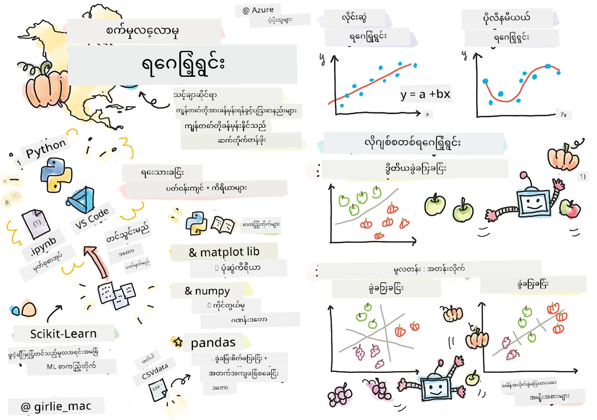
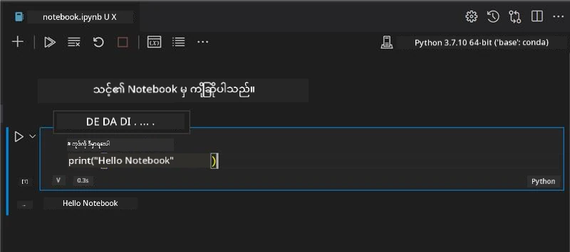
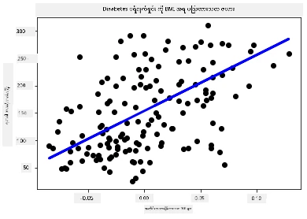

# Python နှင့် Scikit-learn ဖြင့် regression မော်ဒယ်များ စတင်ခြင်း



> Sketchnote ကို [Tomomi Imura](https://www.twitter.com/girlie_mac) ရေးသားသည်

## [မဟာသင်ကြားမှု မတိုင်မီ စစ်တမ်း](https://ff-quizzes.netlify.app/en/ml/)

> ### [ဒီသင်ခန်းစာကို R မှာလည်း ရနိုင်ပါတယ်!](../../../../2-Regression/1-Tools/solution/R/lesson_1.html)

## ကိုယ်ပွားပြောကြားချက်

ဒီသင်ခန်းစာ ၄ ခုတွင် regression မော်ဒယ်များ ဖန်တီးနည်းကို ရှာဖွေနိုင်မည်။ ၎င်းတို့ ဘာကြောင့်သုံးသည့်အကြောင်းကို မကြာမီတင်ပြပါမည်။ သင် တစုံတရာမလုပ်မီ မိမိတွင် လိုအပ်သောကိရိယာများရှိပြီး စတင်နိုင်ကြောင်း သေချာပါစေ။

ဒီသင်ခန်းစာတွင် သင် သင်ယူရမည့်အရာများမှာ -

- ဒေသိယ စက်ပညာဆိုင်ရာ တာဝန်များအတွက် သင့်ကွန်ပြူတာကို တပ်ဆင်ခြင်း။
- Jupyter Notebook များနှင့် လုပ်ကိုင်ခြင်း။
- Scikit-learn ကို သုံးခြင်း၊ ထည့်သွင်းတပ်ဆင်ခြင်းအပါအဝင်။
- လက်တွေ့လေ့ကျင့်မှုဖြင့် လိုင်းနေရေး regression ကို လေ့လာခြင်း။

## ထည့်သွင်းခြင်းများ နှင့် ပျိုးထောင်မှုများ

[](https://youtu.be/-DfeD2k2Kj0 "ML စတင်သင်ယူသူများအတွက် - မောင်းနှင်ရန်အတွက် လိုအပ်သောကိရိယာများ စတင်တပ်ဆင်ခြင်း")

> 🎥 ML အတွက် ကွန်ပြူတာတပ်ဆင်ခြင်း လုပ်ငန်းစဉ်တစ်ခုကို အနည်းငယ် ဗီဒီယိုအဖြစ် မြင်လိုပါက ပုံကို နှိပ်ပါ။

1. **Python ဖြည့်သွင်းပါ**။ သင့်တွင် [Python](https://www.python.org/downloads/) ထည့်သွင်းထားမှုရှိမရှိ စစ်ဆေးပါ။ သင်သည် ဒေတာသိပ္ပံနှင့် စက်သင်ယူမှု လုပ်ငန်းများအတွက် Python ကို အများကြီးအသုံးပြုမည်။ လက်ရှိကွန်ပြူတာစနစ်အများစုတွင် Python ထည့်သွင်းထားပြီးဖြစ်သည်။ အသုံးပြုသူတချို့အတွက် တပ်ဆင်မှု လွယ်ကူစေရန် [Python Coding Packs](https://code.visualstudio.com/learn/educators/installers?WT.mc_id=academic-77952-leestott) များလည်း ရရှိနိုင်ပါသည်။

   သို့သော် Python အသုံးပြုမှုအချို့တွင် ဆော့ဖ်ဝဲ version တစ်ခုနဲ့အသုံးပြုရန်လိုအပ်ပြီး၊ အခြားအသုံးပြုမှုများတွင် အခြား version လိုအပ်နိုင်သဖြင့် [virtual environment](https://docs.python.org/3/library/venv.html) တစ်ခုအတွင်း၌ လုပ်ဆောင်ခြင်း အထောက်အကူဖြစ်သည်။

2. **Visual Studio Code ထည့်သွင်းပါ**။ သင့်တွင် Visual Studio Code ထည့်သွင်းထားမှသာ သေချာပါစေနိုင်သည်။ [Visual Studio Code ထည့်သွင်းခြင်း](https://code.visualstudio.com/) အတွက် သင့်ဝက်ဘ်ဆိုဒ်မှ လမ်းညွှန်ချက်များကို ကျင့်သုံးပါ။ ဒီသင်ခန်းစာတွင် Visual Studio Code ဖြင့် Python ကို အသုံးပြုမည် ဖြစ်သောကြောင့် [Visual Studio Code ကို Python ဖန်တီးမှုအတွက် ပုံစံချထားခြင်း](https://docs.microsoft.com/learn/modules/python-install-vscode?WT.mc_id=academic-77952-leestott) နည်းလမ်းများကို သင်ယူလေ့လာနိုင်ပါသည်။

   > [Learn modules များ](https://docs.microsoft.com/users/jenlooper-2911/collections/mp1pagggd5qrq7?WT.mc_id=academic-77952-leestott) ကို တစ်ခုလုံး လေ့လာခြင်းဖြင့် Python ကို သက်သာစွာ သဘောပေါက်စေပါ။
   >
   > [](https://youtu.be/yyQM70vi7V8 "Visual Studio Code ဖြင့် Python ပြင်ဆင်ခြင်း")
   >
   > 🎥 VS Code အတွင်း Python အသုံးပြုနည်းကို ဗီဒီယိုအဖြစ် ကြည့်ရှုရန် ပုံကို နှိပ်ပါ။

3. **Scikit-learn ထည့်သွင်းပါ**။ ထည့်သွင်းနည်းကို [ဤနေရာတွင်](https://scikit-learn.org/stable/install.html) လိုက်နာပါ။ Python 3 ကို သုံးမည့်အတွက် virtual environment အသုံးပြုရန် အကြံပြုပါသည်။ M1 Mac တွင် ထည့်သွင်းရာတွင် အထူးနည်းလမ်းများ ရှိသည်ကို ဤစာမျက်နှာတွင် ဖော်ပြထားပါသည်။

1. **Jupyter Notebook ထည့်သွင်းပါ**။ [Jupyter package ထည့်သွင်းရန်](https://pypi.org/project/jupyter/) လိုအပ်ပါသည်။

## သင့် ML ဖန်တီးရေး ပတ်ဝန်းကျင်

သင့် Python ကုဒ်ဖန်တီးရေးနှင့် စက်သင်ယူမော်ဒယ်များ ဖန်တီးရန် **notebooks** ကို သုံးမည်ဖြစ်သည်။ ဒီဖိုင် အမျိုးအစားသည် ဒေတာသိပ္ပံပညာရှင်များ အသုံးပြု့လေ့ရှိသော ကိရိယာဖြစ်ပြီး `.ipynb` ဆိုသည့် ထပ်ဆင့်သင်္ကေတဖြင့် သိရှိနိုင်သည်။

Notebooks သည် အပြန်အလှန်လုပ်ဆောင်နိုင်သည့် ပတ်ဝန်းကျင်တစ်ခုဖြစ်ပြီး၊ ဖန်တီးသူအနေဖြင့် ကုဒ်ရေးခြင်း၊ မှတ်ချက်ထည့်ခြင်းနှင့် ရေးသားမှုများ ဖော်ပြနိုင်ခြင်းကြောင့် သုတေသန သို့မဟုတ် စမ်းသပ်မှုအခြေပြု စီမံကိန်းများတွင် အထောက်အကူဖြစ်ပေးသည်။

[](https://youtu.be/7E-jC8FLA2E "ML စတင်သင်ယူသူများ - Jupyter Notebooks တပ်ဆင်ပြီး regression မော်ဒယ်များ စတင်ဆောက်ရန်")

> 🎥 ဒီလေ့ကျင့်ခန်းကို ဗီဒီယိုအနုပညာပိုင်းဖြစ်စွာ လေ့လာရန် ပုံကို နှိပ်ပါ။

### လေ့ကျင့်ခန်း - notebook တစ်ခုဖြင့် လုပ်ကိုင်ခြင်း

ဒီဖိုလ်ဒါတွင် _notebook.ipynb_ ဖိုင်ကို တွေ့ရှိမည်ဖြစ်သည်။

1. Visual Studio Code ဖြင့် _notebook.ipynb_ ဖိုင်ကိုဖွင့်ပါ။

   Jupyter server နှင့် Python 3+ စတင်ပါမည်။ notebook တွင် `run` လို့ရစေရန် ကုဒ်အစိတ်အပိုင်းများ ရှိသည်။ ၎င်းများကို play ခလောက်ကဲ့သို့ မြင်သာသော အိုင်ကွန်ကို ရွေး၍ ဖျော်ဖြေနိုင်သည်။

1. `md` အိုင်ကွန်ကို ရွေးပြီး markdown တစ်ခုပြုလုပ်ပါ၊ အထက်ပါ စာသားတစ်ခု **# Welcome to your notebook** ကို ထည့်ပါ။

   ပို၍ Python ကုဒ်တစ်ခုထည့်ပါ။

1. ကုဒ်အပိုင်းတွင် **print('hello notebook')** ရိုက်ထည့်ပါ။
1. ကုဒ်အား run ခလုတ်ကို နှိပ်ပါ။

   ထုတ်ပေးထားသော စကားစုကို မြင်ရမည်ဖြစ်သည်။

    ```output
    hello notebook
    ```



သင့်ကုဒ်နှင့် မှတ်ချက်များကို notebook တွင် ထည့်သွင်းရေးသားနိုင်သည်။

✅ ဝဘ်ဆာဗာဖန်တီးသူ တစ်ယောက်၏ လုပ်ငန်းပတ်ဝန်းကျင်နှင့် ဒေတာသိပ္ပံပညာရှင်တစ်ဦးရဲ့ လုပ်ငန်းပတ်ဝန်းကျင် ဘာကွာခြားမှုများရှိသည်ကို တစ်မိနစ်စဉ်းစားကြည့်ပါ။

## Scikit-learn ဖြင့် အလုပ်လုပ်နိုင်ရန်

Python ကို ဒေသိယပတ်ဝန်းကျင်တွင် စတင်တပ်ဆင်ပြီး Jupyter Notebooks နှင့် သဘောတူလာပါက Scikit-learn ကိုလည်း သဘောကျကျ သုံးစွဲနိုင်ရအောင် ကြိုးစားကြရအောင် (သတ်မှတ်ပုံ `sci` လိုဖတ်ပါ၊ `science` လိုသည်။) Scikit-learn တွင် [ကျယ်ပြန့်သော API](https://scikit-learn.org/stable/modules/classes.html#api-ref) ရှိ၍ ML လုပ်ဆောင်ချက်များ အကူအညီပေးသည်။

သူတို့ရဲ့ [ဝက်ဘ်ဆိုဒ်](https://scikit-learn.org/stable/getting_started.html) အရ "Scikit-learn သည် supervised နှင့် unsupervised ပညာသင်ကြားမှုများကို ထောက်ပံ့ပေးသော အခမဲ့ စက်သင်ယူမှု စာကြည့်တိုက် ဖြစ်သည်။ မော်ဒယ်ကို ဆွဲဆိုင်းခြင်း၊ ဒေတာကြိုတင်ပြုပြင်ခြင်း၊ မော်ဒယ်ရွေးချယ်မှုနှင့် သုံးသပ်မှုများအတွက် ကိရိယာအခြားများလည်း ထည့်သွင်းပေးထားသည်။"

ဒီသင်တန်းမှာ Scikit-learn နှင့် ကိရိယာအခြားများကို သုံးပြီး ပုံမှန် စက်သင်ယူမှု လုပ်ငန်းရှင်လုပ်ကိုင်သည်။ neural network နှင့် deep learning များကို ကျွန်တော်တို့ 'AI for Beginners' သင်ခန်းစာတွင် လေ့လာရန်ထားကြသည်။

Scikit-learn က မော်ဒယ်ဖန်တီးခြင်းနှင့် သုံးစွဲရန် စံထားသတ်မှတ်ခြင်းကို ရိုးရှင်းစွာ လုပ်ဆောင်နိုင်သည်။ ဥပမာနှင့် သင်ယူရန်အသင့်ရှိသော ဒေတာစုစည်းမှုများပါဝင်ပြီး သူတို့ အတွက်မော်ဒယ်များပါဝင်သည်။ ပထမဆံုး Scikit-learn မော်ဒယ်အတွက် ကြိုတင်ထားသော ဒေတာနှင့် estimator အသုံးပြုခြင်းကို စတင်ကြည့်ကြရအောင်။

## လေ့ကျင့်ခန်း - သင့်ပထမဆုံး Scikit-learn notebook

> ဒီ သင်ကြားမှုကို Scikit-learn ၏ [linear regression ဥပမာ](https://scikit-learn.org/stable/auto_examples/linear_model/plot_ols.html#sphx-glr-auto-examples-linear-model-plot-ols-py) မှ အကြံဉာဏ်ယူထားသည်။


[](https://youtu.be/2xkXL5EUpS0 "ML စတင်သင်ယူသူ - Python ဖြင့် ပထမဆုံး လိုင်းနေရေး Regression စီမံကိန်း")

> 🎥 ဤလေ့ကျင့်ခန်းကို ဗီဒီယိုနည်းဖြင့် လေ့လာရန် ပုံကို နှိပ်ပါ။

_notebook.ipynb_ ဖိုင်တွင် ရှိသော cells အားလုံးကို 'trash can' အိုင်ကွန်နှိပ်၍ ဖျက်ပစ်ပါ။

ဤပိုင်းတွင် Scikit-learn တွင် သင်ယူမှုအတွက် ပါဝင်သော diabetes အချက်အလက်အစုလိုက် တစ်ခုဖြင့် လုပ်ဆောင်မည်ဖြစ်သည်။ လက်က်ကျင့်မှုအတွက် diabetic လူနာများကို ဆုတ်ကမ်းသည့်ကုထုံး စမ်းသပ်လိုသူဟု ရှုမြင်ပါက စက်သင်ယူမှု မော်ဒယ်တို့က မည်သူများအတွက် ကောင်းမွန်သော တုံ့ပြန်မှုရှိမည်ဆိုသည်ကို ဖော်ထုတ်နိုင်သည်။ အလွယ်တကူ regression မော်ဒယ်တစ်ခုကို ကြည့်ရှုချက်ဖြင့် ၎င်းသည် သင်၏ သတိပြုရမည့် အချက်အလက်များကို ပြသနိုင်သည်။

✅ regression နည်းလမ်းစုံရှိပြီး သင် ရရှိလိုသည့် ဖြေချက်ပုံစံပေါ်မူတည်သည်။ အသက်တစ်မျိုးနှင့် မျှော်မှန်းထားသော အမြင့်တန်ဖိုးခန့်မှန်းရန် linear regression ကိုသုံးမည်။ လူတစ်ဦးအရွယ်အရအမြင့်ကို ကြိုတင်တွက်ရန် numeric value လိုတွင် မျိုးဖြစ်သည်။ စားအစာတစ်မျိုးတစ်စုံက ဗီဂန် ဟုတ်မဟုတ် သတ်မှတ်ရန် logistic regression (category assignment) ကို အသုံးပြုမည်။ logistic regression ကို နောက်ပိုင်းတွင် သင်ယူမည်ဖြစ်သည်။ သင်ဖြစ်နိုင်သည့် ဒေတာမေးခွန်းများကို စဉ်းစားပြီး သင့်ရဲ့ မေးခွန်းနှင့် ကိုက်ညီသည့် regression နည်းလမ်းကို ရွေးချယ်ပါ။

ဒီအလုပ်ကို စတင်လိုက်ကြရအောင်။

### စာကြည့်တိုက်များ ကိုသွင်းယူခြင်း

လုပ်ငန်းအတွက် စာကြည့်တိုက်များကို သုံးမည် -

- **matplotlib**။ ဒါသည် အသုံးဝင်သော [ဂရပ်ဖ်ကိရိယာ](https://matplotlib.org/) ဖြစ်၍ လိုင်းပလော့ဖန်တီးရန်သုံးမည်။
- **numpy**. [numpy](https://numpy.org/doc/stable/user/whatisnumpy.html) သည် Python တွင် နံပါတ်များကိုဆောင်ရွက်ရာ အထောက်အကူဖြစ်သော စာကြည့်တိုက်ဖြစ်သည်။
- **sklearn**. ၎င်းသည် [Scikit-learn](https://scikit-learn.org/stable/user_guide.html) စာကြည့်တိုက်ဖြစ်သည်။

လုပ်ငန်းများအတွက် ကူညီရန် စာကြည့်တိုက်များကို သွင်းယူပါ။

1. အောက်ပါကုဒ်ဖြင့် import ပြုလုပ်ပါ -

   ```python
   import matplotlib.pyplot as plt
   import numpy as np
   from sklearn import datasets, linear_model, model_selection
   ```

   အထက်တွင် `matplotlib`, `numpy` နှင့် `sklearn` မှ `datasets`, `linear_model`, `model_selection` ကို import လုပ်ပါသည်။ `model_selection` သည် ဒေတာကို လေ့ကျင့်မှုနှင့် စမ်းသပ်မှု အစိတ်အပိုင်းများသို့ ခွဲခြားရန် သုံးသည်။

### diabetes ဒေတာစုစည်းမှု

ပြည့်စုံပြီး [diabetes dataset](https://scikit-learn.org/stable/datasets/toy_dataset.html#diabetes-dataset) တွင် ၄၄၂ နမူနာပါရှိပြီး diabetes နှင့်ဆက်စပ်သော အချက်အလက်များ ၁၀ ခုပါရှိသည်၊ အချို့မှာ -

- age: အသက်နှစ်များ
- bmi: ခန္ဓာကိုယ် အလေးချိန်ညွှန်းကိန်း
- bp: သွေးတိုးပတ်ဝန်းကျင် စမ်းသပ်မှု အချက်အလက်
- s1 tc: T-Cells (ဖြူသော သွေးအရိုးအမြစ်အမျိုးအစား)

✅ ဒီ dataset တွင် 'sex' ဟူသော ယောကျ္ားမနှစ်မျိုးအုပ်စု ခြားနားမှုကို ပြသထားသည်။ ဆေးဘက်ဆိုင်ရာ ဒေတာစုစည်းမှုများစွာတွင် ယင်းအမျိုးအစား မျိုးခွဲခြားမှုပါဝင်သည်။ ထိုသို့မျိုးခွဲခြားခြင်းကြောင့် လူဦးရေတစ်စုချင်းခုခံကုထုံးမှ ထုတ်ပစ်ခြင်း ဖြစ်တက်သည်ကို စဉ်းစားကြည့်ပါ။

ယခု X နှင့် y ဒေတာများကို load လုပ်ပါ။

> 🎓 သတိပြုရန်- supervised learning ဖြစ်ပြီး 'y' target ဟုအမည်ပေးထားသည်။

နယူး code cell တစ်ခုတွင် `load_diabetes()` ဟူသော function ကို ခေါ်ပြီး diabetes ဒေတာစုစည်းမှုကို load ပါ။ input `return_X_y=True` သည် `X` ကို ဒေတာ matrix ျဖစ္စေ၊ `y` ကို regression target ဖြစ်စေ စေသည်။

1. ဒေတာ matrix ၏ အရွယ်အစားနှင့် ပထမဆုံး အရာကို ပြရန် print command များထည့်ပါ။

    ```python
    X, y = datasets.load_diabetes(return_X_y=True)
    print(X.shape)
    print(X[0])
    ```

    ပြန်လာသည့်တုန့်ပြန်ချက်မှာ tuple ဖြစ်ပြီး၊ tuple ၏ အစောဆုံး တန်ဖိုးနှစ်ခုကို `X` နှင့် `y` သတ်မှတ်ခြင်း ဖြစ်သည်။ tuple အကြောင်း ပို၍ လေ့လာနိုင်ရန် [tuples](https://wikipedia.org/wiki/Tuple) နှင့်ဆက်သွယ်ကြည့်ပါ။

    ဒီဒေတာတွင် ၄၄၂ လုံးရှိပြီး အစီအစဉ်အလိုက် ၁၀ ခုထည့်ထားသော အက်၍ ray အဖြစ် ဖြစ်သည်။

    ```text
    (442, 10)
    [ 0.03807591  0.05068012  0.06169621  0.02187235 -0.0442235  -0.03482076
    -0.04340085 -0.00259226  0.01990842 -0.01764613]
    ```

    ✅ ဒေတာနှင့် regression target အကြား ဆက်စပ်မှုကို စဉ်းစားပါ။ Linear regression သည် feature X နှင့် target y အကြား ဆက်နွယ်မှုများ ခန့်မှန်းသည်။ diabetic dataset ၏ [target](https://scikit-learn.org/stable/datasets/toy_dataset.html#diabetes-dataset) ကို စာတမ်းထဲတွင် ရှာဖွေရန် ကြိုးစားပါ။ ၎င်း target သည် ဘာကိုပြသနေသနည်း?

2. dataset ၏ တခြားအပိုင်းတစ်ခုကို ရွေးချယ်ရန် dataset ၏ ၃ လုံးကော်လံကို ရွေးပါ။ `:` အကောင့်အားလုံးကို ရွေးပြီး၊ index (2) ဖြင့် ၃ လုံးကော်လံကို ရွေးပါ။ ဒေတာကို ပလော့ဖ်ဖို့အတွက် ၂ ဒီ array အဖြစ် `reshape(n_rows, n_columns)` ဖြင့် ပြင်ဆင်ရမည်။ parameter တန်ဖိုး -1 ဖြစ်လျှင် အတူတကွဖြတ်တောက်ချက်ကို အလိုလိုတွက်ချက်ပေးသည်။

   ```python
   X = X[:, 2]
   X = X.reshape((-1,1))
   ```

   ✅ အချိန်တိုင်း ပြန်ကြည့်၍ ဒေတာ၏ အရွယ်အစားကို စစ်ဆေးပါ။

3. ဒေတာအား များတင်ပလော့ဖ်ရန် အသင့်ရှိသည့်အခြေအနေမှ စတင်ပြီး၊ အခြားသော မော်ဒယ်အလုပ်လုပ်စေဖို့အတွက် ဒေတာ (X) နှင့် target (y) တို့ကို စမ်းသပ်ခြင်း နှင့် လေ့ကျင့်ခြင်းအပိုင်း ခွဲခြားသုံးဆောင်ရမည်။ Scikit-learn တွင် ဒီ ခွဲခြားမှုကို ရိုးရှင်းစွာ ဆောင်ရွက်နိုင်ပြီး သတ်မှတ်ထားသော နေရာတွင် သင့် စမ်းသပ်ဒေတာကို ခွဲပေးနိုင်သည်။

   ```python
   X_train, X_test, y_train, y_test = model_selection.train_test_split(X, y, test_size=0.33)
   ```

4. ယခု မော်ဒယ်လေ့ကျင့်ရန် အသင့်ဖြစ်ပြီ။ linear regression မော်ဒယ်ကို ထည့်သွင်းပြီး `model.fit()` ဖြင့် X နှင့် y လေ့ကျင့်စရာ ဒေတာများဖြင့် သင်ကြားပါ။

    ```python
    model = linear_model.LinearRegression()
    model.fit(X_train, y_train)
    ```

    ✅ `model.fit()` သည် TensorFlow ကဲ့သို့သော ML စာကြည့်တိုက်များတွင် တွေ့ရသော function တစ်ခုဖြစ်သည်။

5. ပြီးလျှင် စမ်းသပ်မှု ဒေတာဖြင့် မော်ဒယ် အနာဂတ်ခန့်မှန်းချက် ပြုလုပ်ရန် `predict()` function ကိုအသုံးပြုပါ။

    ```python
    y_pred = model.predict(X_test)
    ```

6. ယခု ဒေတာကို ပလော့ဖ်တွင် ပြရန်အချိန်။ Matplotlib သည် ဤလုပ်ငန်းအတွက် အသုံးပေါ် စွမ်းဆောင်ရည်ကောင်းစွာ ရှိသည်။ X နှင့် y စမ်းသပ် ဒေတာအား scatterplot ဖြင့် ဖော်ပြပြီး မော်ဒယ်၏ ဒေတာအုပ်စုများအကြား သင့်လျော်ဆုံးနေရာတွင် အနာဂတ်ခန့်မှန်းချက်ဖြင့် မှန်ကန်သော လိုင်းတစ်ခု ဆွဲပါ။

    ```python
    plt.scatter(X_test, y_test,  color='black')
    plt.plot(X_test, y_pred, color='blue', linewidth=3)
    plt.xlabel('Scaled BMIs')
    plt.ylabel('Disease Progression')
    plt.title('A Graph Plot Showing Diabetes Progression Against BMI')
    plt.show()
    ```

   


   ✅ ဒီမှာဘာဖြစ်နေသလဲဆိုတာအနည်းငယ်စဉ်းစားကြည့်ပါ။ တစ်ကြောင်းချောင်းစိုး ကာလေးနဲ့ရှားပါးတဲ့ ဒေတာလေးတွေကြားဖြတ်သွားတဲ့ တည့်တည့်တဲ့ချောင်းတစ်ခုရှိတယ်၊ ဒါပေမဲ့ ဒါကဘာလုပ်နေသလဲ? ဒီချောင်းကို အသုံးပြုပြီး အသစ်မြင်ဖူးသေးတဲ့ ဒေတာပျိုတစ်ခုက ဒီပလော့့ရဲ့ y အလျား ညီအောင် ဘယ်နေရာမှာထားမလဲဆိုတာ တွက်ချက်ခန့်မှန်းနိုင်ဖို့ ဘယ်လိုမြင်နိုင်မလဲ? ဒီမော်ဒယ်ရဲ့ လက်တွေ့အသုံးချမှုကို စကားလုံးတွေဖြင့်ဖော်ပြပါ။

ဂုဏ်ယူပါတယ်၊ သင်ဟာ သင်၏ ပထမဆုံး လိုင်းရေးဂရက်ရှင်းမော်ဒယ်ကို တည်ဆောက်ပြီး၊ ခန့်မှန်းခြေတစ်ခုကို ပြုလုပ်ပြီး၊ ပလော့တစ်ပေါ်မှာ ပြသခဲ့ပါပြီ!

---
## 🚀 စိန်ခေါ်မှု

ဒီဒေတာစုံစုမှ ကွဲပြားသော အမျိုးအစားတစ်ခုကို ပလော့လုပ်ပါ။ အကြောင်းပြချက် - ဤလိုင်းကို တည်းဖြတ်ပါ: `X = X[:,2]`။ ဒီဒေတာစုံစုရဲ့ ရည်မှန်းချက်ကို သုံးပြီး ဆီးချိုရောဂါ ရောဂါအဖြစ် တိုးတက်မှုအပေါ် ဘာတွေ ရှာဖွေတွေ့ရှိနိုင်သလဲ?
## [စာသင်ပြီးတော့ စစ်တမ်း](https://ff-quizzes.netlify.app/en/ml/)

## ပြန်လည်သုံးသပ်ခြင်းနှင့် ကိုယ်တိုင်လေ့လာရန်

ဒီစာသင်ခြင်းတွင် သင်သည် တစ်မျိုးအပြင်ပြင်တိုင်းသို့ မဟုတ် များပြားသောလိုင်းရေးဂရက်ရှင်း မဟုတ်ဘဲ ရိုးရှင်းသောလိုင်းရေးဂရက်ရှင်းတစ်ခုနှင့် အလုပ်လုပ်ခဲ့သည်။ ဤနည်းလမ်းများ၏ ကွာခြားချက်များအကြောင်းအနည်းငယ်ဖတ်ပါ၊ ဒါမှမဟုတ် [ဒီဗီဒီယို](https://www.coursera.org/lecture/quantifying-relationships-regression-models/linear-vs-nonlinear-categorical-variables-ai2Ef) ကိုကြည့်ပါ။

Regression အယူအဆအကြောင်းပိုမိုဖတ်ရှုပြီး ဤနည်းလမ်းဖြင့် ဖြေရှင်းနိုင်သော မေးခွန်းအမျိုးအစားများအကြောင်း စဉ်းစားပါ။ နားလည်မှုကို တွေးတောရန် [ဒီစာသင်ခန်းမ](https://docs.microsoft.com/learn/modules/train-evaluate-regression-models?WT.mc_id=academic-77952-leestott) ကိုယူပါ။

## တာဝန်ပေးချက်

[ကွဲပြားသော ဒေတာစုံစု](assignment.md)

---

<!-- CO-OP TRANSLATOR DISCLAIMER START -->
**ပြောကြားချက်**
ဤစာတမ်းကို AI ဘာသာပြန်ဝန်ဆောင်မှု [Co-op Translator](https://github.com/Azure/co-op-translator) အသုံးပြု၍ ဘာသာပြန်ထားပါသည်။ ကျွန်ုပ်တို့သည် တိကျမှန်ကန်မှုအတွက် ကြိုးပမ်းနေသော်လည်း၊ စက်ကိရိယာဘာသာပြန်ခြင်းများတွင် အမှားများ သို့မဟုတ် မှားယွင်းချက်များ ပါဝင်နိုင်ကြောင်း သတိပြုပါရန် လိုအပ်ပါသည်။ မူလစာတမ်းကို မူရင်းဘာသာဖြင့်သာ ယုံကြည်စိတ်ချရသော အချက်အလက်အဖြစ် သတ်မှတ်သင့်သည်။ အရေးကြီးသည့် သတင်းအချက်အလက်များအတွက် ပရော်ဖက်ရှင်နယ် လူသားဘာသာပြန်သူဝန်ဆောင်မှုကို အကြံပြုပါသည်။ ဤဘာသာပြန်ချက်ကို အသုံးပြုခြင်းမှ ဖြစ်ပေါ်လာသော နားလည်မှုကွာခြားမှုများ သို့မဟုတ် မမှန်ကန်သော အသုံးပြုမှုများအတွက် ကျွန်ုပ်တို့ တာဝန်မခံပါ။
<!-- CO-OP TRANSLATOR DISCLAIMER END -->