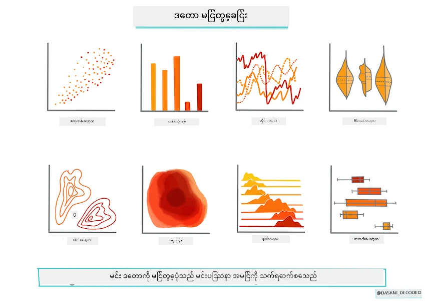
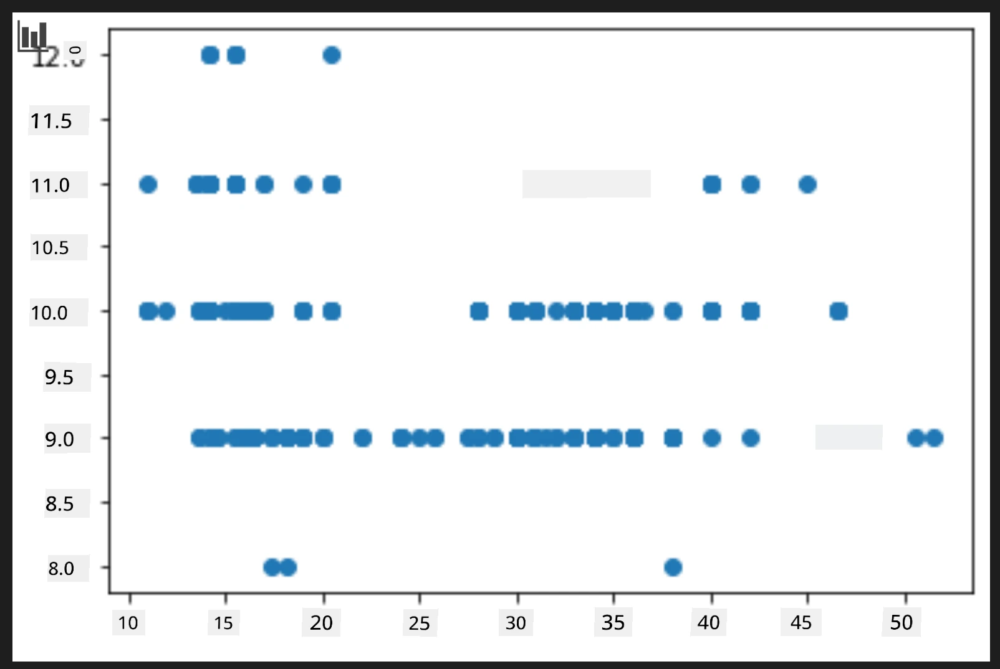
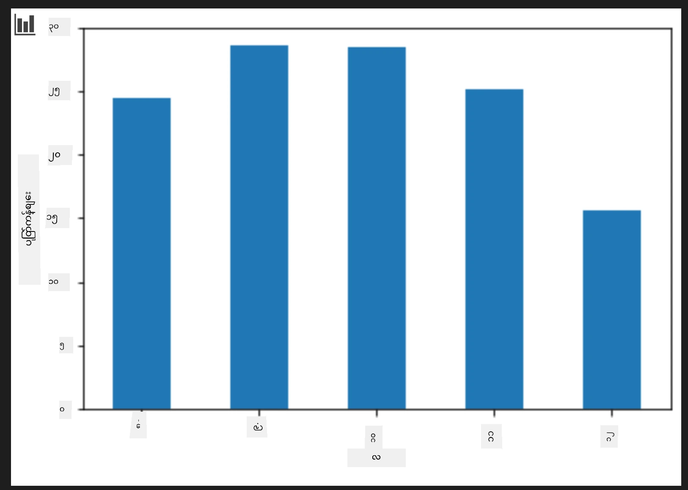
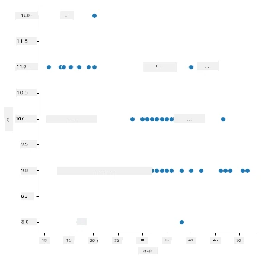
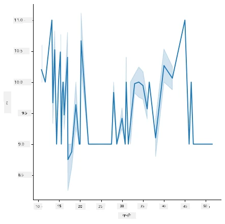
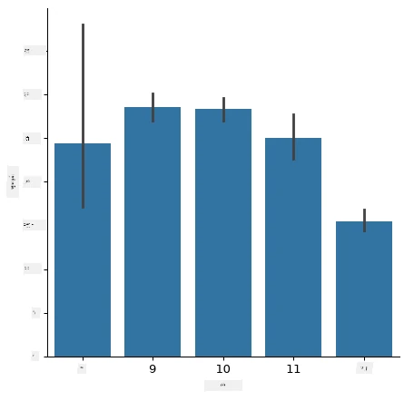
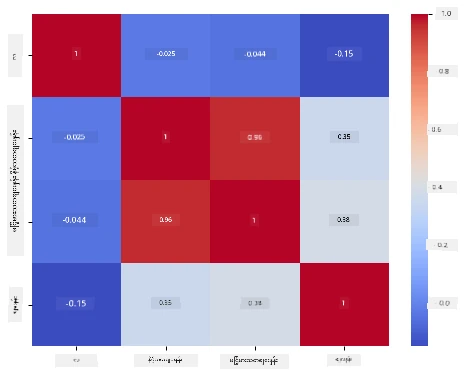

# Scikit-learn ကို အသုံးပြု၍ regression မော်ဒယ် တည်ဆောက်ခြင်း - ဒေတာ ပြင်ဆင်ခြင်းနှင့် မှတ်ပုံတင်ပြသခြင်း



အချက်အလက်ပုံတင်ကို [Dasani Madipalli](https://twitter.com/dasani_decoded) မှဆွဲဆောင်ထားသည်

## [သင်ခန်းစာမတိုင်မီ စစ်တမ်း](https://ff-quizzes.netlify.app/en/ml/)

> ### [ဤသင်ခန်းစာကို R ဖြင့်လည်း ရရှိနိုင်ပါသည်!](../../../../2-Regression/2-Data/solution/R/lesson_2.html)

## နိဒါန်း

Scikit-learn ဖြင့် ဂဏန်းသင်ယူမှုပုံစံ တည်ဆောက်ခြင်းလုပ်ငန်းစဉ်ကို စတင်ရန် လိုအပ်သော ကိရိယာများပေးပြီးဖြစ်သည့်အတွက် သင်၏ဒေတာကို မေးခွန်းမေးပြီးစတင်ကာ အကောင်အထည်ဖော်နိုင်ပါပြီ။ ဒေတာနှင့် အလုပ်လုပ်ရာတွင် ML ဖြေရှင်းနည်းများကို အသုံးပြုချိန်တွင် သင်၏datasets ၏ ထူးခြားချက်များကိုမှန်ကန်စွာဖော်ထုတ်ရန် တိကျသွားသောမေးခွန်းမေးခြင်း အရေးကြီးသည်။

ဤသင်ခန်းစာတွင် သင်လေ့လာမည့်အချက်များမှာ-

- မော်ဒယ် တည်ဆောက်ရန် သင်၏ဒေတာကို ပြင်ဆင်သမျှ။
- Matplotlib ကို ဒေတာမှတ်ပုံတင်ပြသရန် အသုံးပြုခြင်း။
- Seaborn ကို ပိုမိုစိတ်ဝင်စားဖွယ်ရာ ဒေတာမှတ်ပုံတင်ပြသမှုအတွက် အသုံးပြုခြင်း။

## သင်၏ဒေတာအတွက် မွန်မြတ်သည့်မေးခွန်းမေးခြင်း

သင့်ရဲ့ မေးခွန်းသည် မည်မျှသာ ML အယ်လဂေါရစ်သမ်သုံးရမည်ကို သတ်မှတ်ပေးမည်ဖြစ်သည်။ ပြန်လည်ရရှိမည့်ဖြေကြားချက်၏ အရည်အသွေးသည် သင့်ဒေတာ၏ ထုတ်လွှင့်မှုအပေါ် မူတည်သည်။

ဤသင်ခန်းစာအတွက် ပံ့ပိုးထားသော [ဒေတာ](https://github.com/microsoft/ML-For-Beginners/blob/main/2-Regression/data/US-pumpkins.csv) ကို ကြည့်ပါ။ VS Code တွင် .csv ဖိုင်ကိုဖွင့်နိုင်သည်။ ဗဟိုပြချက်တစ်ခုအနေနှင့် ရှင်းလင်းချက်များ၊ စာသားနှင့်ဂဏန်းဒေတာများ ဖြစ်ပေါ်နေကြောင်းမြင်ရမည်။ "Package" ဟုခေါ်သော မြင်ကွင်းထူးခြားသော ကော်လံတစ်ခု ရှိပြီး 'sacks', 'bins' နှင့် အခြားအဖြစ်များပေါင်းစပ်သည်။ ဒေတာသည် တကယ်လို့ စည်းမျဉ်းမရှိသော အခြေအနေတစ်ခုဖြစ်သည်။

[](https://youtu.be/5qGjczWTrDQ "ML for beginners - How to Analyze and Clean a Dataset")

> 🎥 ဤရုပ်ပုံကို နှိပ်ပြီး ဤသင်ခန်းစာအတွက် ဒေတာပြင်ဆင်ရေးလုပ်ငန်းစဉ်ကို ရှင်းလင်းတတ်၏ဗီဒီယိုတိုကိုကြည့်ပါ။

တကယ်လို့၊ အသုံးပြုနိုင်သော ML မော်ဒယ် တစ်ခုဖန်တီးရန် အထူပြင်ဆင်ထားပြီး ဒေတာကို ရရှိရခြင်း မရှိခြင်းသည် ရှားပါးသည်။ ဤသင်ခန်းစာတွင် Python စံထားသော ပိုင်ရာစာကြည့်တိုက်များ အသုံးပြု၍ သဘာဝဒေတာများကို ပြင်ဆင်ပုံကို သင်တတ်မြောက်ပါမည်။ ပိုပြီးမန်မာပြ ဒေတာမှတ်ပုံတင်ခြင်းနည်းလမ်းများကိုလည်း သင်ယူပါမည်။

## အမှုလေ့လာမှု - 'the pumpkin market'

ဤဖိုင်ကို ရှိသော `data` ဖိုလ်ဒါ၏ အမြစ်တွင် [US-pumpkins.csv](https://github.com/microsoft/ML-For-Beginners/blob/main/2-Regression/data/US-pumpkins.csv) နာမည်ရှိ .csv ဖိုင်ရှိပြီး မြို့အလိုက် စုပေါင်းထားသော pumpkin စျေးကွက်ဆိုင်ရာ ဒေတာ 1757 အကြောင်း ပါဝင်သည်။ ဤတွေ့ရှိချက်သည် US Department of Agriculture မှ အထူးစိုက်ပျိုးရေးဈေးကွက် စံအစီရင်ခံစာများမှ မူတည်၍ ရယူထားသည်။

### ဒေတာ ပြင်ဆင်ခြင်း

ဤဒေတာသည် ပြည်သူ့ပိုင်ဆိုင်မှု ဖြစ်သည်။ USDA ဝက်ဘ်ဆိုက်မှမြို့တိုင်းအလိုက် ဖိုင်များစွာကို မျှဝေသည်။ ဖိုင်များ အများကြီး မဖြန့်ချိရန် အားလုံးကို တစ်ခုတည်း စာရွက်ထဲတွင် ပေါင်းစပ်ထားပြီး ဒေတာကိုအနည်းငယ် ပြင်ဆင်ထားသည်။ အောက်တွင် ဒေတာကို နက်ရှိုင်းစွာကြည့်ခြင်းပြုလုပ်မည်။

### pumpkin data - ပထမအကြမ်းဖျင်းအမြင်

ဤဒေတာကို ကြည့်ပါက၊ စာသား၊နံပါတ်၊အစွန်းအထင်း၊ ထူးခြားတန်ဖိုးများ စပ်လျဥ်သည့်အချက်များ ရှိသည်ကို သတိထားမိသည်။

ကိန်းဂဏန်းပြားနည်းဖြင့် "တစ်လအတွင်း ရောင်းမည့် pumpkin ၏ ဈေးနှုန်း ခန့်မှန်းခြင်း" ထုတ်ထားသောမေးခွန်းတစ်ခု မေးလို့ရမလား? ဒေတာကို ထပ်မံကြည့်မည်ဆိုပါက ဤတာဝန်လုပ်ရန် မလိုက်ဖက်သည့် ဒေတာဖွဲ့စည်းမှု တချို့ ပြင်ဆင်ရန် လိုအပ်သည်။
## လေ့ကျင့်ခန်း - pumpkin data ကို စိစစ်ပါ

ဒေတာကို ပုံသဏ္ဍာန်ဖွဲ့ရာတွင် အထောက်အကူပြုသည့် [Pandas](https://pandas.pydata.org/) ကို အသုံးပြုကာ ဒီ pumpkin data ကို စိစစ်ပြီး ပြင်ဆင်ပါ။

### ပထမဦးစွာ ရက်စွဲပျောက်ဆုံးမှု ရှာဖွေစစ်ဆေးခြင်း

ပထမဦးစွာ ရက်စွဲများ ပျောက်သွားမှု ရှိမရှိ စစ်ဆေးရန် လိုအပ်သည်။

1. ရက်စွဲများကို လပိုင်းပုံစံအဖြစ် ပြောင်းရန် (အမေရိကန်ရက်စွဲ[MM/DD/YYYY])ဖြစ်သည်။
2. လပိုင်းကို ကော်လံအသစ်တစ်ခုသို့ ဖြုတ်ယူရန်။

Visual Studio Code တွင် _notebook.ipynb_ ဖိုင်ကို ဖွင့်၍ စာရွက်ကို pandas dataframe အသစ်သို့ ထည့်ပါ။

1. `head()` function ကို အသုံးပြု၍ ပထမဆုံးငါးကြောင်းကို ကြည့်ရှုပါ။

    ```python
    import pandas as pd
    pumpkins = pd.read_csv('../data/US-pumpkins.csv')
    pumpkins.head()
    ```

    ✅ နောက်ဆုံးငါးကြောင်းကို ကြည့်ရန် မည်သည့် function ကို အသုံးပြုမလဲ?

1. လက်ရှိ dataframe တွင် ဒေတာပျောက်ဆုံးမှုရှိမရှိစစ်ဆေးပါ-

    ```python
    pumpkins.isnull().sum()
    ```

    ဒေတာပျောက်ဆုံးထားသည်။ သို့သော် အလုပ်မှာ မထိခိုက်နိုင်ပါ။

1. ရိုးရှင်းစေဖို့သင်၏ dataframe တွင် လိုအပ်သောကော်လံများဖြင့် `loc` function ကို သုံးပြီး ဂဏန်းများ နှင့် ကော်လံများကို ရွေးချယ်ပါ။ ဤနေရာ `.loc[:, ]` သည် "အားလုံးကို" ဆိုလိုသည်။

    ```python
    columns_to_select = ['Package', 'Low Price', 'High Price', 'Date']
    pumpkins = pumpkins.loc[:, columns_to_select]
    ```

### ဒုတိယ - pumpkin ဈေးနှုန်းပျမ်းမျှတွက်ချက်ခြင်း

တစ်လအတွင်း pumpkin ဈေးနှုန်းပျမ်းမျှကို သိရန် ဘယ်ကော်လံများကို ရွေးမလဲ? အကြံပြုချက် - ကော်လံ ၃ ခုလိုအပ်သည်။

ဖြေရှင်းနည်း - `Low Price` နှင့် `High Price` ကော်လံများ၏ ပျမ်းမျှတန်ဖိုးကို Price ကော်လံသစ်တွင် ထည့်သွင်းပြီး Date ကော်လံကို လပိုင်းအဖြစ်သတ်မှတ်ပါ။ ရှေ့ကစစ်ဆေးချက်အရ ရက်စွဲနှင့် ဈေးနှုန်းတို့တွင် ဒေတာပျောက်မှုမရှိပါ။

1. ပျမ်းမျှတွက်ချက်ရန် အောက်ပါကုဒ်ကို ထည့်ပါ။

    ```python
    price = (pumpkins['Low Price'] + pumpkins['High Price']) / 2

    month = pd.DatetimeIndex(pumpkins['Date']).month

    ```

   ✅ လိုသမျှဒေတာကို `print(month)` ဖြင့် စစ်ဆေးနိုင်ပါသည်။

2. ယခု ပြောင်းထားသောဒေတာကို pandas dataframe အသစ်သို့ ကူးယူပါ။

    ```python
    new_pumpkins = pd.DataFrame({'Month': month, 'Package': pumpkins['Package'], 'Low Price': pumpkins['Low Price'],'High Price': pumpkins['High Price'], 'Price': price})
    ```

    dataframe ကို print ပြုလုပ်သည်မှာ စက်တင် အဆင်ပြေပြီး ပျက်စီးကြောင်းမရှိသော ဒေတာများကို မြင်နိုင်ပါသည်။

### သို့သော် အံ့အားသင့်စရာရှိသည်

`Package` ကော်လံကို ကြည့်ပါက pumpkins များသည် အမျိုးမျိုးသော ပုံစံများဖြင့် ရောင်းချသည်။ တချို့ '1 1/9 bushel' တိုင်းတာမှုဖြင့်၊ တချို့သည် '1/2 bushel', တစ်ခုချင်းစီနှင့် ပေါင်နှင့်၊ နောက်တစ်ချို့က ဂေဟာပြားများအမျိုးမျိုးဖြင့် ရောင်းချသည်။

> ဖရဲသီးများကို တိတိကျကျ ဝန်ချတတ်ခြင်း မလွယ်ကူပါ။

အစေခံဒေတာကို မြှောက် မြင်ပါက `Unit of Sale` သည် 'EACH' သို့မဟုတ် 'PER BIN' ဖြစ်သော နေရာများတွင် `Package` ပုံစံအဖြစ် ပေါင် အနည်းငယ်၊ တစ်ဦးချင်း သို့မဟုတ် 'each' ဖြစ်သည်။ ဖရဲသီးတွေကို တိတိကျကျ မလေးချိန်စစ်တာ ဖြစ်သောကြောင့် `Package` ကော်လမ်တွင် 'bushel' ဆိုသော စာကြောင်းပါဝင်သည့် ဖရဲသီးများကိုသာ ရွေးချယ် filter ထားမည်။

1. ဖိုင်၏ အပေါ်ဆုံးတွင် ထည့်သွင်းမှု filter ကို ထည့်ပါ။

    ```python
    pumpkins = pumpkins[pumpkins['Package'].str.contains('bushel', case=True, regex=True)]
    ```

    ယခုအခါ ဒေတာကို print ထုတ်မည်ဆိုသည့်အခါ bushel ဖြင့်ရောင်းချသော လူကြီး pumpkin များ ၄၁၅ ကြောင့်သောအတန်းများသာ ပြရန်ကြည့်ရမည်။

### သို့သော် တစ်ခုခု အနက်တစ်ခု ဆက်လုပ်ရန်ရှိသည်

bushel အရေအတွက်သည် ကွဲပြားခြားနားသည်။ ဈေးနှုန်းကို bushel တစ်ခုခြင်းဖြင့် ပေါင်းစပ် ပြန်တွက်သားရန် လိုအပ်သည်။

1. new_pumpkins dataframe ဖန်တီးပြီးနောက် အောက်ပါကုဒ်များထည့်ပါ။

    ```python
    new_pumpkins.loc[new_pumpkins['Package'].str.contains('1 1/9'), 'Price'] = price/(1 + 1/9)

    new_pumpkins.loc[new_pumpkins['Package'].str.contains('1/2'), 'Price'] = price/(1/2)
    ```

✅ [The Spruce Eats](https://www.thespruceeats.com/how-much-is-a-bushel-1389308) အစီရင်ခံချက်အရ bushel အလေးချိန်သည် ရွေးချယ်ထားသည့် ထွက်ပေါက်အမျိုးအစားပေါ် မူတည်သည်။ ပမာဏတန်ဖိုးဖြစ်သည်။ "ပုလြီး bushel ပမာဏသည် ၅၆ ပေါင်ခန့်ရှိသည်။ .. အသေအချာစောင့်ကြည့်သော အရွက်ငွေနှင့် ဟင်းသီးဟင်းရွက်များသည် ပိုမိုနေရာကုန်လျက် အလေးချိန်နည်းစွာဖြစ်၍ spinach bushel သည် ၂၀ ပေါင်သာရှိသည်။" ဆက်လက်ရှင်းလင်းမှု များသည်ခက်ခဲသော်လည်း bushel ကို ပေါင်သို့ပြောင်းနှိပ်မထားဘဲ၊ bushel နဲ့ ဈေးတွက်ပါ။ pumpkin bushel များကို လေ့လာခြင်းက သင့်ဒေတာ၏ ယန္တရားနဲ့ သဘာဝကို နက်ရှိုင်းစွာ နားလည်ရန် အရေးကြီးမှုကို ပြသသည်။

ယခု ချိန်ဆပေးပုံသည် သူတို့၏ bushel သတ်မှတ်ချက်အခြေခံ၍ တစ်ခုချင်းစီ ဈေးနှုန်းကို သုံးသပ်နိုင်သည်။ ဒေတာကို တစ်ကြိမ်လောက် print ထုတ်ပါက အသားပေးထားသည့် ပုံစံကို မြင်နိုင်ပါသည်။

✅ ထူးခြားသောအချက်မှာ half-bushel ဖြင့်ရောင်းခြင်းသည် အလွန်ကြီးမားသော ဈေးနှုန်းရှိသည်။ အကြောင်းရင်းကို ထောက်လှမ်းကြည့်ပါ။ အကြွင်းမဲ့နေရာရှိသော pie pumpkin တစ်ခုကြောင့် နည်းငယ်များသော စိတ်ကြိုက်မီးဖို pumpkin များသည် bushel တစ်ခုလျှင် အရေအတွက်ပိုမိုများ၍ ဈေးနှုန်းမြင့်တက်ခြင်းဖြစ်သည်။

## မှတ်ပုံတင်ပြသမှု အကြံပေးနည်းများ

ဒေတာ သိပ္ပံပညာရှင်၏ တာဝန်အချိုးအစားတစ်ခုမှာ အလုပ်လုပ်နေသည့် ဒေတာ၏ အရည်အသွေးနှင့် သဘာဝကို ပြသခြင်းဖြစ်ပြီး၊ ယင်းအတွက် ထူးခြားသောမှတ်ပုံတင်ပြသမှုများ၊ ဇယားများ၊ ဝိုင်းမြင်ကွင်းများ ဖန်တီးသည်။ ယင်းဖြင့် မျှမျှတတမရှာရသော ဆက်နွယ်မှု နှင့် အခွာအဝေးများကို ရုပ်မြင်ပြီး သတိမထားမိရသော တန်ဖိုးများကိုအလွယ်တကူ ဆွဲထုတ်နိုင်သည်။

[](https://youtu.be/SbUkxH6IJo0 "ML for beginners - How to Visualize Data with Matplotlib")

> 🎥 ဤရုပ်ပုံကို နှိပ်ပြီး ဤသင်ခန်းစာအတွက် ဒေတာမှတ်ပုံတင်ပြသမှု ဗီဒီယိုတိုကို ကြည့်ပါ။

မှတ်ပုံတင်ပြသမှုများသည် ဒေတာအတွက် ကိုက်ညီသော မက်ရှင်လေ့လာမှုနည်းလမ်းရွေးချယ်ရာ၌ အကူအညီဖြစ်စေနိုင်သည်။ ဥပမာ - scatterplot တစ်ခုသည် အတန်းလိုက်လိုက်ဟန်ချက်ကို သိလိုသော ရာဇဝင်သို့လိုက်လျောညီထွေရှိသည်ဆိုပါက linear regression လေ့လာမှုအတွက် ကောင်းမွန်သော ဒေတာဖြစ်ကြောင်း ပြသသည်။

Jupyter notebook များတွင် အသုံးပြုရန်သင့်တော်သော ဒေတာမှတ်ပုံတင်စာကြည့်တိုက်သည် [Matplotlib](https://matplotlib.org/) ဖြစ်သည် (ခန့်မှန်းချိန်တွင် မကြာခဏ တွေ့ရှိရမည့်အခြေအနေ)။

> စိတ်ဝင်စားသူများအတွက် [ဤသင်ခန်းစာများ](https://docs.microsoft.com/learn/modules/explore-analyze-data-with-python?WT.mc_id=academic-77952-leestott) တွင် ဒေတာမှတ်ပုံတင်ခြင်းနည်းပညာကို ပိုမိုတွေ့မြင်နိုင်သည်။

## လေ့ကျင့်ခန်း - Matplotlib ဖြင့် လေ့လာခြင်း

သင်สร้างထားသော များထဲတွင် ပုံစံပြုလုပ်မှု အခြေခံပုံများကို ဖန်တီးကြည့်ပါ။ လိုင်းပုံရိပ်အခြေခံထား၍ ဘာကို ပြသမည်လဲ?

1. pandas import ရှိသည့်နောက် ကျောဆုံးတွင် Matplotlib ကို import ပြုလုပ်ပါ။

    ```python
    import matplotlib.pyplot as plt
    ```

1. notebook အားလုံးကို ပြန်လည် အလုပ်လုပ်စေပါ။
1. notebook အောက်ဆုံးတွင် data ကို box plot အဖြစ် ပုံဖော်ရန် စာသားထည့်ပါ။

    ```python
    price = new_pumpkins.Price
    month = new_pumpkins.Month
    plt.scatter(price, month)
    plt.show()
    ```

    

    ဤပုံရိပ်သည် အသုံးဝင်ပါသလား? ဘာသာတခုခု သင့်အား အံ့အားသင့်စေပါသလား?

    ဤသည်အတော် မအသုံးဝင်သေးပါဘူး၊ လပိုင်း အတွင်း မျှဝေထားသောတစ်ချက်စာနယ်ဇင်းအဖြစ် ဒေတာကိုပဲပြသည်။

### အသုံးဝင်စေပါ

အသုံးဝင်သော ဇယားဖန်တီးရန် ဒေတာကို အဖွဲ့ခွဲရန်လိုအပ်သည်။ y axis သည် လပိုင်းများကို ပြပါက ဒေတာ သိမျှဝေမှုရိုက်ချက်ကို ပြနိုင်ပါသည်။

1. အဖွဲ့ခွဲထားသော ဘားဇယားရေးရန် စာသားထည့်ပါ။

    ```python
    new_pumpkins.groupby(['Month'])['Price'].mean().plot(kind='bar')
    plt.ylabel("Pumpkin Price")
    ```

    

    ဤသည်ဟာ ပိုအသုံးဝင်သော ဒေတာမှတ်ပုံတင်ပြသမှု တစ်ခုဖြစ်သည်။ pumpkin ဈေးနှုန်းအမြင့်ဆုံးသည် စက်တင်ဘာနှင့် အောက်တိုဘာတွင် ဖြစ်သည်ဟု ဆိုလိုသည်။ သင့်စိတ်ကူးနှင့် ကိုက်ညီပါသလား? ဘာကြောင့် ညီမညီပါသလဲ?

## လေ့ကျင့်ခန်း - Seaborn ဖြင့် လေ့လာခြင်း

Matplotlib သည် များစွာကိုင်တွယ်နိုင်သော်လည်း တောက်ပသောဇယားဖန်တီးရန် ကုဒ်များစွာလိုအပ်ပါသည်။ [Seaborn](https://seaborn.pydata.org/) သည် Matplotlib ပေါ်တွင် တည်ဆောက်ပြီး စာရင်းများနှင့် အချက်အလက်များကို စတိုင်လ် ဆွဲရန်၊ ဖန်တီးရန် လွယ်ကူစေသည်။ Seaborn သည် Matplotlib အ объက်များ ပြန်လည်ထုတ်ပေးသဖြင့် Matplotlib အသုံးပြုနည်းများကို ဆက်လက်အသုံးပြုနိုင်သည်။

> Seaborn ဆော့ဖ်ဝဲ မရှိသေးရင် `pip install seaborn` ဖြင့် 설치ပါ။

1. စာရွက်ပေါ်တွင် အချိတ်ဆက်များအောက် နေရာတွင် Seaborn ကို `sns` အဖြစ် import ပြုလုပ်ပါ။

    ```python
    import seaborn as sns
    ```

### ဆက်နွယ်မှုများ ပြသရန် scatter plot များ

မော်ဒယ်တည်ဆောက်မှု မတိုင်မီ ဒေတာစူးစမ်းရာ၌ လက္ခဏာများအကြား _ဆက်နွယ်မှုများ_ ရှာဖွေရန်အရေးကြီးသည်။ [scatter plot](https://en.wikipedia.org/wiki/Scatter_plot) သည် ထိပ်တန်းကိရိယာတစ်ခုဖြစ်သည်။ ပြင်ပတွင် အချက်များသည် တန်းလိုက်လိုက်လံများခဲ့လျှင်, လက္ခဏာနှစ်ခုမှာဆက်နွယ်မှုရှိနိုင်၍ linear regression မော်ဒယ်လုပ်ငန်းအတွက် အခြေခံဖြစ်နိုင်ပါသည်။

1. ယခင်စက်တင်ငွေမှတ်ပုံတင်အား Seaborn ၏ [`relplot()`](https://seaborn.pydata.org/generated/seaborn.relplot.html) ဖြင့် ပြန်ဖန်တီးပါ - dataframe ကော်လံများကို တိုက်ရိုက်အသုံးပြုသည်။

    ```python
    sns.relplot(x="Price", y="Month", data=new_pumpkins)
    ```

    

    ကော်လံအမည်များ နှင့် dataframe ကို ဖြတ်သွားပြီး Seaborn သည် axis အမည်များကို သင့်အတွက် ဖြည့်စည်းပေးသည်။

2. `kind="line"` ကို ပေးလိုက်၍ လိုင်းပုံဖော်လည်းလုပ်နိုင်သည်။ Seaborn သည် လိုင်းပေါ်တွင် ယုံကြည်မှုအပိုင်းအခြားများကို ခြုံဆိုင်ခြားပေးသည်။

    ```python
    sns.relplot(x="Price", y="Month", kind="line", data=new_pumpkins)
    ```

    

    ဤဒေတာသည် ဆူညံမှုများပါဝင်သဖြင့် လိုင်းပုံရိပ်သည် ထိပ်တန်းရှင်းလင်းမှုမရှိသဘောဖြစ်သည် - သို့သော် Seaborn တွင် ဇယားအမျိုးအစား ပြောင်းလဲရန် အလွန်လွယ်ကူသည်ကို ပြသသည်။

### အကြောင်းအမျိုးမျိုးကို ပြသရန် Bar chart များ


မကြာသေးမီက မင်းဟာလက်ဆောင်အဖြစ် ဒေတာတွေကို စုပုံပြီး Matplotlib နဲ့ ဘားဇယားချတ် ဖြတ်ချက်တခု ပြုလုပ်ခဲ့တယ်။ Seaborn ရဲ့ [`catplot()`](https://seaborn.pydata.org/generated/seaborn.catplot.html) (categorical plot) က စုပေါင်းခြင်းနဲ့ စုပေါင်းမှုကို မင်းအတွက် လုပ်ပေးနိုင်ပါတယ်။ ပုံမှန်အားဖြင့် `kind="bar"` က အမျိုးအစားတိုင်းရဲ့ ပျမ်းမျှတန်ဖိုးကို ပြသပြီး ယုံကြည်စိတ်ချနိုင်မှု အစိတ်အပိုင်းကို အနက်ရောင်လိုင်းနဲ့ပြသော့ပါတယ်။

1. လတိုင်း ပျမ်းမျှစျေးနှုန်းအတွက် ဘားချတ် တစ်ခု ဖန်တီးပါ။

    ```python
    sns.catplot(x="Month", y="Price", data=new_pumpkins, kind="bar")
    ```

    

    ဒါက Matplotlib နဲ့ တွေ့ရသလို အတည်ပြုပြထားတာပါ — စျေးနှုန်းတွေ က စက်တင်ဘာနဲ့ အောက်တိုဘာ လအတွင်း ပိုမိုမြင့်တက်တယ် — ဒါပေမဲ့ Seaborn ကလည်း လတိုင်းအတွင်း စျေးနှုန်း _ရောနှောမှု_ ရှိတာကို မြင်သာစေပါတယ်။

### အပူမြေပုံများဖြင့် သက်ဆိုင်မှုများကို ပြသောကြောင့်

Scatter plot တွေက တစ်ခါ သုံးသော အနည်းဆုံး ကွဲပြားမှုနှစ်ခုကို နှိုင်းယှဉ်သည်။ အရေအတွက်စာရင်း အနည်းများရှိတဲ့အခါ [heatmap](https://en.wikipedia.org/wiki/Heat_map) က လုံး၀ ကော်လံအတွဲတိုင်းရဲ့ ဆက်စပ်မှုခွန်အားကို တစ်ပြိုင်နက်တည်း တွေ့မြင်ခွင့်ပြုသည်။ ဒါဟာ မော်ဒယ်ထဲမှာ ဘာများထည့်မလဲ သတ်မှတ်တဲ့အရင်က ဆက်စပ်မှုများကိုရှာဖွေရန် နည်းလမ်း တစ်ခုဖြစ်ပြီး (ပြီးတော့ classification ရဲ့ confusion matrix များကို ပြသရာမှာကလည်း ဒီလို chart က အလားတူသုံးပါတယ်)။

1. Pandas နဲ့ correlation matrix တည်ဆောက်ပြီး Seaborn ရဲ့ [`heatmap()`](https://seaborn.pydata.org/generated/seaborn.heatmap.html) နဲ့ ဆွဲပါ။ `annot=True` ရွေးချယ်မှုက ဆက်စပ်မှုတန်ဖိုးတွေကို တစ်စက်စက်ပေါ်မှာ ပုံနှိပ်ပေးပါသည်။

    ```python
    correlations = new_pumpkins[['Month', 'Low Price', 'High Price', 'Price']].corr()
    sns.heatmap(correlations, annot=True, cmap="coolwarm")
    ```

    

    `1` (သို့မဟုတ် `-1`) နားကပ်သောတန်ဖိုးများက ကော်လံများသည် အပြင်းအထန် _တန်းလိုက်_ ဆက်စပ်မှုရှိကြောင်း ဆိုလိုသည်။ `Low Price` နဲ့ `High Price` တို့သည် အလွန်နီးစပ် ပြေသောဆက်စပ်မှုရှိသည်ကို သတိပေးပါ။ `Month` ကတော့ စျေးနှုန်းနှင့် တစ်ဖက်ဖက်မှ တန်းလိုက်ဆက်စပ်မှု သာ့နည်းနည်းရှိနေသည် — ဘားချတ်ထက်ဘယ်လိုက စက်တင်ဘာနဲ့ အောက်တိုဘာ လအတွင်း အရောင်ပြတ်သားတဲ့ ရာသီဦးတန်းရှိစေသည်ကို ဖော်ပြခဲ့သည်။ ဒါက သင်ခန်းစာတစ်ခု ဖြစ်ပါတယ် - correlation coefficient က _တိုက်ရိုက် စာကြောင်း_ ဆက်စပ်မှုများကို တိုင်းတာသောကြောင့် ရာသီဥတု သို့မဟုတ် အခြားအမျိုးအစား မဟုတ်သော ရွေ့လျားမှုများအား မတွေ့နိုင်တာပါ။ ✅ ဘားချတ်စာရင်းနဲ့အတူ အပူမြေပုံ တို့ကို ကြည့်သည့်အခါ ဘယ်တော့မှ ဘယ်ကော်လံတွေကို အသုံးပြုမလဲ ဆုံးဖြတ်ဖို့ ဘာကြောင့် အသုံးဝင်သလဲ?

### Matplotlib နဲ့ Seaborn?

နှစ်ခုလုံးကို သိထားဖို့ တန်ဖိုးရှိပါတယ်။

- **Matplotlib** က ချတ်တစ်ခု၏ အစိတ်အပိုင်း အားလုံးကို သေချာ ထိန်းချုပ်နိုင်စွမ်း ရှိပြီး အခြား Python ပုံဆွဲစာကြည့်တိုက်များအတွက် အခြေခံဖြစ်ပါသည်။
- **Seaborn** က မြင့်မားသောအဆင့် လုပ်ဆောင်မှုများနဲ့ သတင်းအချက်အလက် ရေးဆွဲချက်များအတွက် ဆွဲဆောင်မှုရှိတဲ့ ပုံသဏ္ဍာန်များကို ပေးပြီး ဒေတာဖရိမ်များနဲ့ တိုက်ရိုက် ဝင်ရောက်လေ့လာနိုင်သောကြောင့် အမြန်ရွေးချယ်မှုအတွက် အသုံးဝင်သည်။

ပုံမှန်လုပ်ငန်းစဉ်မှာ လျင်မြန်စွာ ဒေတာလေ့လာဖို့ Seaborn ကို အသုံးပြုပြီး အကြောင်းအရာ အသေးစိတ်ပြင်ဆင်ဖို့ Matplotlib ကို သုံးပါတယ်။

---

## 🚀စိန်ခေါ်မှု

Matplotlib နဲ့ Seaborn မှ ပေးသည့် မတူညီသော ဗီဇွယ်ဖိတ်ရှင်းအမျိုးအစားများကို စူးစမ်းပါ။ regression ပြဿနာများအတွက် ဘယ်အမျိုးအစားတွေ အကောင်းဆုံးလဲ?

## [စာသင်ခန်း ကြိုတင် စစ်ဆေးခြင်း](https://ff-quizzes.netlify.app/en/ml/)

## ပြန်လည် သုံးသပ်ခြင်း & ကိုယ်တိုင်လေ့လာခြင်း

ဒေတာဗီဇွယ်ဖိတ်ရှင်း များစွာကို ကြည့်ပြီး စာရင်းပြုလုပ်ပါ။ အသုံးဝင်တဲ့ စာကြည့်တိုက်အမျိုးအစားများနဲ့ မြင်သာဆုံးအလုပ်အမူများကို မှတ်သားပါ၊ ဥပမာ 2D ဗီဇွယ်ဖိတ်ရှင်း နှင့် 3D ဗီဇွယ်ဖိတ်ရှင်းအတွက် ဘယ်လိုမျိုးများကို တွေ့ရှိသလဲ?

## သတ်မှတ်ချက်

[ဗီဇွယ်ဖိတ်ရှင်း စူးစမ်းခြင်း](assignment.md)

---

<!-- CO-OP TRANSLATOR DISCLAIMER START -->
**ပြောကြားချက်**
ဤစာတမ်းကို AI ဘာသာပြန်ဝန်ဆောင်မှု [Co-op Translator](https://github.com/Azure/co-op-translator) အသုံးပြု၍ ဘာသာပြန်ထားပါသည်။ ကျွန်ုပ်တို့သည် တိကျမှန်ကန်မှုအတွက် ကြိုးပမ်းနေသော်လည်း၊ စက်ကိရိယာဘာသာပြန်ခြင်းများတွင် အမှားများ သို့မဟုတ် မှားယွင်းချက်များ ပါဝင်နိုင်ကြောင်း သတိပြုပါရန် လိုအပ်ပါသည်။ မူလစာတမ်းကို မူရင်းဘာသာဖြင့်သာ ယုံကြည်စိတ်ချရသော အချက်အလက်အဖြစ် သတ်မှတ်သင့်သည်။ အရေးကြီးသည့် သတင်းအချက်အလက်များအတွက် ပရော်ဖက်ရှင်နယ် လူသားဘာသာပြန်သူဝန်ဆောင်မှုကို အကြံပြုပါသည်။ ဤဘာသာပြန်ချက်ကို အသုံးပြုခြင်းမှ ဖြစ်ပေါ်လာသော နားလည်မှုကွာခြားမှုများ သို့မဟုတ် မမှန်ကန်သော အသုံးပြုမှုများအတွက် ကျွန်ုပ်တို့ တာဝန်မခံပါ။
<!-- CO-OP TRANSLATOR DISCLAIMER END -->