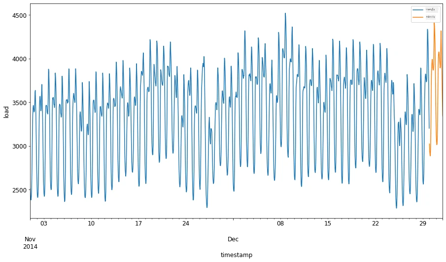
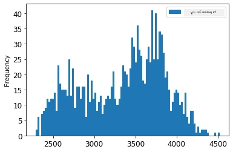
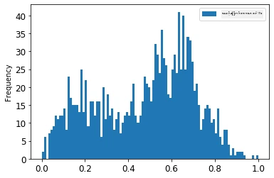
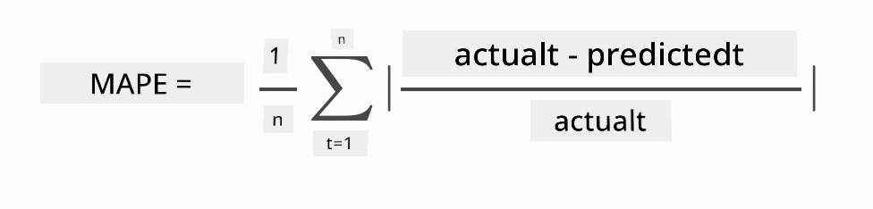

# ARIMA ဖြင့် အချိန်တန်းစီးရီး ခန့်မှန်းခြေ

ယခင်သင်ခန်းစာတွင် သင်သည် အချိန်တန်းစီးရီး ခန့်မှန်းခြေ အကြောင်း နည်းနည်း သိရှိခဲ့ပြီး အချိန်တစ်ရက်အတွင်း လျှပ်စစ်ဝန်ဆောင်မှု အပြောင်းအလဲများ ဖော်ပြထားသော ဒေတာစနစ်ကို ဖတ်ယူခဲ့သည်။

[](https://youtu.be/IUSk-YDau10 "ARIMA အကြောင်းအနိမ့်ဖော်ပြချက်")

> 🎥 ဗီဒီယိုကို ကြည့်ရန် အပေါ်ကို ဓာတ်ပုံနှိပ်ပါ။ ARIMA မော်ဒယ်များ၏ အနိမ့်ဖော်ပြချက်တို။ ဥပမာအား R မှာ ပြုလုပ်ထားသော်လည်း အကြောင်းအရာများသည် အားလုံးအတွက် ကျင်းပအသုံးပြုနိုင်သည်။

## [ဘာသာရပ်မတိုင်ခင် စစ်ဆေးရန်မေးခွန်း](https://ff-quizzes.netlify.app/en/ml/)

## အကိုယ်တိုင်မိတ်ဆက်ခြင်း

ဒီသင်ခန်းစာတွင် သင်သည် [ARIMA: *A*uto*R*egressive *I*ntegrated *M*oving *A*verage](https://wikipedia.org/wiki/Autoregressive_integrated_moving_average)ဖြင့် မော်ဒယ်များ တည်ဆောက်နည်း အထူးရှုသွားမည်ဖြစ်သည်။ ARIMA မော်ဒယ်များသည် [non-stationarity](https://wikipedia.org/wiki/Stationary_process) ပြသသော ဒေတာများအတွက် အထူးသင့်တော်သည်။

## အထွေထွေ အယူအဆများ

ARIMA နှင့် အလုပ်လုပ်နိုင်ရန် သိရန်လိုသော အယူအဆအချို့ရှိသည်။

- 🎓 **Stationarity**။ စာရင်းအင်းဆိုင်ရာအမြင်မှ ကြည့်လျှင်၊ stationarity သည် အချိန်အရိပ်အမြွက် ပြောင်းလဲမှုမရှိသော ဒေတာဖြစ်သည်။ non-stationary ဒေတာမှာ တိမ်ညိုမတ်မျိုးဖြစ်သော ပြောင်းလဲမှုများ ကြားသည်။ ဥပမာ တစ်ခုမှာ ရာသီဆိုင်ရာ ပြောင်းလဲမှု (seasonality) ပါဝင်ပြီး 'ရာသီပိုင်း ကွာခြားခြင်း' ဖြစ်စဉ်ဖြင့် ဖယ်ရှားနိုင်သည်။

- 🎓 **[Differencing](https://wikipedia.org/wiki/Autoregressive_integrated_moving_average#Differencing)**။ ပြန်လည်ကွာခြားခြင်း (differencing) သည် non-stationary ဒေတာကို stationarity ဖြစ်စေရန် လှုပ်ရှားချက်များ ဖယ်ရှားကာ ပြောင်းလဲခြင်း ဖြစ်ပြီး "Differencing သည် အချိန်တန်းစီးရီး၏ အဆင့် ပြောင်းလဲမှုများကို ဖယ်ရှားကာ ထုံးစံနှင့် ရာသီဆိုင်ရာများကို ဖယ်ရှားပြီး အချိန်တန်းစီးရီး၏ ပျမ်းမျှတန်ဖိုးကို တည်မြဲစေသည်။" [Shixiong et al စာတမ်း](https://arxiv.org/abs/1904.07632)

## အချိန်တန်းစီးရီးကိုင်တွယ်ရာ၌ ARIMA

ARIMA ၏ အစိတ်အပိုင်းများကို ခွဲခြမ်းစိတ်ဖြာပြီး အချိန်တန်းစီးရီး မော်ဒယ်တည်ဆောက်ရာတွင် အထောက်အကူဖြစ်စေသည်ကို သိရှိကြရအောင်။

- **AR - AutoRegressive အတွက်**။ Autoregressive မော်ဒယ်များသည် အမည်အရ ယခင်အချိန်များကို ကြည့်၍ ဒေတာတွင် တွေ့ရသော တန်ဖိုးများကို စုဆောင်းကာ ခန့်မှန်းချက်များပြုစုသည်။ ယင်း ယခင်တန်ဖိုးများကို 'lags' ဟုခေါ်သည်။ ဥပမာအားဖြင့် သစ်သားပင်ဆွဲ စီးဝယ်ရောင်းအားအတွက် လစဉ်ရောင်းအား ဒေတာဟာ 'ဖွံ့ဖြိုးရွှင်လာသော အသေးစိတ်' များအနေနှင့် တွက်ချက်သည်။ ဤမော်ဒယ်သည် "အဓိကစိတ်ဝင်စားမှုရှိသော အသေးစိတ်သည် မိမိ၏ ယခင်တန်ဖိုးများပေါ် အခြေခံ၍ ပြန်လည်ခန့်မှန်းခြေခံရသည်။" [wikipedia](https://wikipedia.org/wiki/Autoregressive_integrated_moving_average)

- **I - Integrated အတွက်**။ ARMA မော်ဒယ်များနှင့် ကွဲပြားပြီး 'I' ဆိုသည်မှာ *[integrated](https://wikipedia.org/wiki/Order_of_integration)* အချက်ဖြစ်သည်။ Differencing လုပ်ငန်းစဉ်များ ဖြင့် non-stationarity ဖယ်ရှားရာတွင် ဒေတာသည် 'integrated' ဖြစ်သည်။

- **MA - Moving Average အတွက်**။ ဤမော်ဒယ်၏ [moving-average](https://wikipedia.org/wiki/Moving-average_model) အစိတ်အပိုင်းသည် ယခုနှင့် ယခင် လက်တွေ့တန်ဖိုးများအား စစ်ဆေးသည့် output မဟာဗျူဟာဖြစ်သည်။

စာအုတ်တင်လိုက်ပါ။ ARIMA ကို အချိန်တန်းစီးရီး ဒေတာ အမျိုးအစားအတွက် အလွန်နီးကပ်စွာ မော်ဒယ် ပြုလုပ်ရန် အသုံးပြုသည်။

## လေ့ကျင့်ခန်း - ARIMA မော်ဒယ် တည်ဆောက်ခြင်း

ဒီသင်ခန်းစာမှ [_/working_](https://github.com/microsoft/ML-For-Beginners/tree/main/7-TimeSeries/2-ARIMA/working) ဖိုလ်ဒါကိုဖွင့်ပြီး [_notebook.ipynb_](https://github.com/microsoft/ML-For-Beginners/blob/main/7-TimeSeries/2-ARIMA/working/notebook.ipynb) ဖိုင်ကိုရှာပါ။

1. notebook များကို `statsmodels` Python စာကြည့်တိုက်ကို တင်ရန် လည်ပတ်ပါ။ ARIMA မော်ဒယ်များအတွက် လိုအပ်ပါသည်။

1. လိုအပ်သော စာကြည့်တိုက်များကို တင်ပါ

1. အခု အချက်အလက်တွေကို ကွက်ပန်းပြသရန် အသုံးဝင်သော စာကြည့်တိုက်များကို အပိုတင်ပါ။

    ```python
    import os
    import warnings
    import matplotlib.pyplot as plt
    import numpy as np
    import pandas as pd
    import datetime as dt
    import math

    from pandas.plotting import autocorrelation_plot
    from statsmodels.tsa.statespace.sarimax import SARIMAX
    from sklearn.preprocessing import MinMaxScaler
    from common.utils import load_data, mape
    from IPython.display import Image

    %matplotlib inline
    pd.options.display.float_format = '{:,.2f}'.format
    np.set_printoptions(precision=2)
    warnings.filterwarnings("ignore") # သတိပေးချက်မက်ဆေ့မြေ့များကို မက်မရောက်စေရန် သတ်မှတ်ပါ
    ```

1. `/data/energy.csv` ဖိုင်ထဲမှ ဒေတာအား Pandas dataframe သို့ တင်ပြီး ကြည့်ရှုပါ။

    ```python
    energy = load_data('./data')[['load']]
    energy.head(10)
    ```

1. ၂၀၁၂ ခုနှစ် ဇန်နဝါရီလမှ ၂၀၁၄ ခုနှစ် ဒီဇင်ဘာလ အထိ ပါဝင်သော စွမ်းအင်ဒေတာအား မျက်နှာပြင်တွင် ဖော်ပြပါ။ ယခင်သင်ခန်းစာတွင် တွေ့ခဲ့သောအတိုင်း မထင်မှတ်ထားသော အချက်မရှိပါ:

    ```python
    energy.plot(y='load', subplots=True, figsize=(15, 8), fontsize=12)
    plt.xlabel('timestamp', fontsize=12)
    plt.ylabel('load', fontsize=12)
    plt.show()
    ```

    ယခု မော်ဒယ် တည်ဆောက်ကြရအောင်!

### လေ့ကျင့်ရန်နှင့် စမ်းသပ်ရန် ဒေတာများကို ဖန်တီးခြင်း

ယခု ဒေတာတင်ပြီးဖြစ်သည်ဖြစ်၍ လေ့ကျင့်ရန် (train) နှင့် စမ်းသပ်ရန် (test) ဒေတာများအဖြစ် ခွဲနိုင်ပါသည်။ မော်ဒယ်ကို လေ့ကျင့်ရန် trainဒေတာမှာ အသုံးပြုပါမည်။ ထုံးစံအတိုင်း မော်ဒယ် လေ့ကျင့်ပြီးနောက် S test ဒေတာဖြင့် တိကျမှုအား စစ်ဆေးပါမည်။ စမ်းသပ်မှု ဒေတာက လေ့ကျင့်မှု ဒေတာထက်နောက်ပိုင်း အချိန်ကာလကို ဖုံးလွှမ်းထားသည့်အဆင့်ဖြစ်ရမည်။

1. ၂၀၁၄ ခုနှစ် စက်တင်ဘာ ၁ ရက်မှ အောက်တိုဘာ ၃၁ ရက် ပထမနှစ်လအထိ သင်တန်းဒေတာသာ ခွဲဝေပေးပါ။ စမ်းသပ် ဒေတာသည် ၂၀၁၄ ခုနှစ် နိုဝင်ဘာ ၁ ရက်မှ ဒီဇင်ဘာ ၃၁ ရက်အထိ ဖြစ်ပါသည်။

    ```python
    train_start_dt = '2014-11-01 00:00:00'
    test_start_dt = '2014-12-30 00:00:00'
    ```

    ဒီဒေတာမှာ နေ့စဉ် စွမ်းအင်အသုံးအနှုန်းကို ပြသသည့်အတွက် ရာသီဆိုင်ရာ ဖွဲ့စည်းမှုရှိသော်လည်း နောက်ဆုံးနေ့များထက် ပိုမိုနီးစပ်သည့် အသုံးအနှုန်းများ ဖြစ်သည်။

1. ကွဲပြားချက်များကို ကိုင်တွယ် ကြည့်ပါ။

    ```python
    energy[(energy.index < test_start_dt) & (energy.index >= train_start_dt)][['load']].rename(columns={'load':'train'}) \
        .join(energy[test_start_dt:][['load']].rename(columns={'load':'test'}), how='outer') \
        .plot(y=['train', 'test'], figsize=(15, 8), fontsize=12)
    plt.xlabel('timestamp', fontsize=12)
    plt.ylabel('load', fontsize=12)
    plt.show()
    ```

    

    ထို့ကြောင့် training ဒေတာကို သာသာလေး ခြေနေချိန်တွင် သင်ယူခြင်း သင့်လျော်သည်။

    > မှတ်ချက် - ARIMA မော်ဒယ် တည်ဆောက်ရာတွင် sample validation ကို အသုံးပြုသဖြင့် validation ဒေတာကို ထည့်မသုံးပါ။

### လေ့ကျင့်ရန် အချက်အလက်များ ပြင်ဆင်ခြင်း

ယခုသင်အချက်အလက်များကို စစ်ထုတ်ခြင်းနှင့် အတိုင်းအတာပြောင်းခြင်း ဖျော်ဖြေရန် လိုပါသည်။ သင့်လိုအပ်သည့် အချိန်ကာလနှင့် ကော်လံများ ကန့်သတ်ပြီး ဒေတာကို စစ်ထုတ်ပြီး၊ 0 နှင့် 1 ကြားသို့ အတိုင်းအတာပြောင်းပါ။

1. အစောပိုင်းဒေတာတွင် ယင်းအချိန်ကာလများနှင့် 'load' ကော်လံနှင့် ရက်စွဲကော်လံ များသာ ပါဝင်အောင် စစ်ထုတ်ပါ။

    ```python
    train = energy.copy()[(energy.index >= train_start_dt) & (energy.index < test_start_dt)][['load']]
    test = energy.copy()[energy.index >= test_start_dt][['load']]

    print('Training data shape: ', train.shape)
    print('Test data shape: ', test.shape)
    ```

    ဒေတာ၏ အပုံစံကို ကြည့်ရှုနိုင်သည်။

    ```output
    Training data shape:  (1416, 1)
    Test data shape:  (48, 1)
    ```

1. ဒေတာကို (0, 1) အတွင်း အတိုင်းအတာပြောင်းပါ။

    ```python
    scaler = MinMaxScaler()
    train['load'] = scaler.fit_transform(train)
    train.head(10)
    ```

1. မူလ ဒေတာနှင့် အတိုင်းအတာပြောင်းပြီး ဒေတာကို ကြည့်ရှုပါ။

    ```python
    energy[(energy.index >= train_start_dt) & (energy.index < test_start_dt)][['load']].rename(columns={'load':'original load'}).plot.hist(bins=100, fontsize=12)
    train.rename(columns={'load':'scaled load'}).plot.hist(bins=100, fontsize=12)
    plt.show()
    ```

    

    > မူလ ဒေတာ

    

    > အတိုင်းအတာပြောင်းပြီး ဒေတာ

1. အဲဒီအတိုင်းအတာပြောင်းထားသော ဒေတာနဲ့ စမ်းသပ် ဒေတာကိုလည်း အတိုင်းအတာပြောင်းပါ။

    ```python
    test['load'] = scaler.transform(test)
    test.head()
    ```

### ARIMA ကို အသုံးပြုပါ

ယခု ARIMA ကို အသုံးပြုရမှာ ဖြစ်ပြီး ယခင်တွင် တင်ထားသော `statsmodels` စာကြည့်တိုက်ကို အသုံးပြုပါမည်။

ယခုအဆင့်တွင် အဆင့်အလိုက် လုပ်ဆောင်ရမည့် အဆင့်များမှာ

   1. `SARIMAX()` ကို ခေါ်ပြီး မော်ဒယ် ပါရာမီတာများ p, d, q နှင့် P, D, Q ကို ဖြည့်ပါ။
   2. လေ့ကျင့်မှု ဒေတာအတွက် `fit()` လုပ်ဆောင်ချက်ကို ခေါ်ကာ မော်ဒယ်ကို ပြင်ဆင်ပါ။
   3. ခန့်မှန်းရန် `forecast()` ကို ခေါ်ပြီး ခန့်မှန်းမည့် အဆင့်များ (horizon) အရေအတွက် သတ်မှတ်ပါ။

> 🎓 ဒီ parameter တို့သည် ဘာအတွက်လဲ? ARIMA မော်ဒယ်တွင် ခန့်မှန်းရန် အဓိက အချက် ၃ ခု ရှိသည်။ ၎င်းမှာ ရာသီဆိုင်ရာ (seasonality), ချဲ့ထွင်မှု (trend), နှင့် အသံညှိ (noise) ဖြစ်သည်။ အကြောင်းအရာများမှာ:

`p`: မော်ဒယ်တွင် auto-regressive အပိုင်းနှင့် ဆက်စပ်မှုရှိပြီး *အရင်*တန်ဖိုးများကိုယူပါသည်။
`d`: မော်ဒယ်၏ integrated အပိုင်းနှင့် ဆက်စပ်မှုရှိပြီး *differencing* ထည့်သွင်းသည့်အတိုးအကျယ်ကို အကျိုးသက်ရောက်စေသည်။
`q`: မော်ဒယ်တွင် moving-average အပိုင်းနှင့် ဆက်စပ်သည်။

> မှတ်ချက်- သင့်ဒေတာတွင် ရာသီဆိုင်ရာအစိတ်အပိုင်းရှိပါက - ဒါမှမဟုတ် - ရာသီ ARIMA မော်ဒယ် (SARIMA) ကိုအသုံးပြုသည်။ ၎င်းအတွက် `P`, `D`, `Q` parameter များကိုအသုံးပြုရပြီး, p, d, q နှင့် တူညီသည်ဟုဆိုပါလျက် ရာသီဆိုင်ရာ component များအတွက် အသုံးပြုသည်။

1. သင့်နှစ်သက်ရာ horizon ကို သတ်မှတ်ပါ။ ၃ နာရီ ကြိုးစားကြည့်ရအောင်။

    ```python
    # ရှေ့ကြိုခန့်မှန်းရန်ခြေလှမ်းအရေအတွက်ကို ပြသပါ။
    HORIZON = 3
    print('Forecasting horizon:', HORIZON, 'hours')
    ```

    ARIMA မော်ဒယ် parameter များအတွက် အကောင်းဆုံးတန်ဖိုးရွေးချယ်ခြင်းသည် စိတ်ခံစားချက်နှင့် အချိန်ယူမှုကြောင့် အခက်အခဲရှိနိုင်သည်။ `auto_arima()` ကို [`pyramid` စာကြည့်တိုက်မှ](https://alkaline-ml.com/pmdarima/0.9.0/modules/generated/pyramid.arima.auto_arima.html) အသုံးပြုနိုင်သည်၊

1. ယခုအချိန်တွင် လက်ဖြင့် ရွေးချယ်၍ မော်ဒယ်ကောင်းမလား ကြိုးစားကြည့်ပါ။

    ```python
    order = (4, 1, 0)
    seasonal_order = (1, 1, 0, 24)

    model = SARIMAX(endog=train, order=order, seasonal_order=seasonal_order)
    results = model.fit()

    print(results.summary())
    ```

    အဖြေများ စာရင်းကို ပုံနှိပ်ပြပါမည်။

သင့်ပထမဆုံး မော်ဒယ်ကို တည်ဆောက်ပြီးပြီ! ယခု ဒီမော်ဒယ်ကို ရှာဖွေရန် လိုအပ်သည်။

### သင့် မော်ဒယ်ကို တိုင်းတာခြင်း

သင့်မော်ဒယ်အား `walk forward` စိစစ်မှုဖြင့် စမ်းသပ်နိုင်သည်။ လက်တွေ့တွင် အချိန်တန်းစီးရီး မော်ဒယ်များသည် ထပ်တလဲလဲ ပြန်လည်လေ့ကျင့်သည်။ ၎င်းအားဖြင့် မော်ဒယ်သည် အချိန်တိုင်းတွင် အကောင်းဆုံး ခန့်မှန်းချက်ဖော်ဆောင်နိုင်စေသည်။

အချိန်တန်းစီးရီးအစပိုင်းမှ စ၍ ဒီနည်းလမ်းဖြင့် သင်ယူရန် ဒေတာပေါ် မော်ဒယ်ကို လေ့ကျင့်ပါ။ နောက်ထပ် အချိန်အပိုင်းတွင် ခန့်မှန်းချက်ပြုလုပ်ပါ။ ခန့်မှန်းချက်ကို သိရှိပြီးသားတန်ဖိုးနှင့် နှိုင်းယှဉ်၍ တန်ဖိုးတိုင်း သိရှိပြီးမှ ပြန်လည် လေ့ကျင့်မှုလက်စွဲမှာ ထပ်ခေါင်းထည့်ပါ။ ဒီလုပ်ငန်းစဉ်ကို ထပ်လည်ပြုလုပ်ပါ။

> မှတ်ချက်- သင်ယူမှု data window ကို တည်တံ့စေဖို့ အဆင့်မြှင့်သင့်ပါသည်။ မည်သည့်ဖော်ပြချက်အသစ်ကို training set တွင် ထည့်သွင်းပါက အသစ်ထည့်သည့် အစိတ်အပိုင်းကို စတင်နေရာမှ ဖယ်ရှားရမည်။

ဤလုပ်ငန်းစဉ်သည်  မော်ဒယ်၏ လုပ်ဆောင်ချက်ကို ပိုမိုတိကျစွာ ခန့်မှန်းရန် အထောက်အကူပြုသည်။ သို့သော် မော်ဒယ်များ များစွာ ဖန်တီးရခြင်းကြောင့် ကြိုတင်တွက်ချက်မှုဝက်လက်များ ဖြစ်ပေါ်နိုင်သည်။ ဒေတာ သေးငယ်ပါက သို့မဟုတ် မော်ဒယ် လွယ်ကူပါက ခုံလုပ်နိုင်သည်၊ သို့မဟုတ် ပမာဏကြီးလျှင် ပြဿနာဖြစ်ပေါ်နိုင်သည်။

Walk-forward စစ်ဆေးမှုသည် အချိန်တန်းစီးရီး မော်ဒယ် စစ်ဆေးမှု၏ ရွှေစံချိန်ဖြစ်ပြီး သင့်ပရောဂျက်များတွင် အကြံပြုသည်။

1. ပထမဆုံး HORIZON အဆင့်အတွက် စမ်းသပ်ဒေတာ များကို ဖန်တီးပါ။

    ```python
    test_shifted = test.copy()

    for t in range(1, HORIZON+1):
        test_shifted['load+'+str(t)] = test_shifted['load'].shift(-t, freq='H')

    test_shifted = test_shifted.dropna(how='any')
    test_shifted.head(5)
    ```

    |            |          | load | load+1 | load+2 |
    | ---------- | -------- | ---- | ------ | ------ |
    | 2014-12-30 | 00:00:00 | 0.33 | 0.29   | 0.27   |
    | 2014-12-30 | 01:00:00 | 0.29 | 0.27   | 0.27   |
    | 2014-12-30 | 02:00:00 | 0.27 | 0.27   | 0.30   |
    | 2014-12-30 | 03:00:00 | 0.27 | 0.30   | 0.41   |
    | 2014-12-30 | 04:00:00 | 0.30 | 0.41   | 0.57   |

    ဒေတာသည် horizon point အတိုင်း အမြန်ကြောင့် ရွှေ့လျားထားသည်။

1. စမ်းသပ် ဒေတာတွင် ဒီ sliding window နည်းကို အသုံးပြု၍ loop ဇယားအတိုင်း ခန့်မှန်းချက်များ ပြုလုပ်ပါ။

    ```python
    %%time
    training_window = 720 # လေ့ကျင့်မှုအတွက် ၃၀ ရက် (၇၂၀ နာရီ) သီးသန့် ပေးပါ

    train_ts = train['load']
    test_ts = test_shifted

    history = [x for x in train_ts]
    history = history[(-training_window):]

    predictions = list()

    order = (2, 1, 0)
    seasonal_order = (1, 1, 0, 24)

    for t in range(test_ts.shape[0]):
        model = SARIMAX(endog=history, order=order, seasonal_order=seasonal_order)
        model_fit = model.fit()
        yhat = model_fit.forecast(steps = HORIZON)
        predictions.append(yhat)
        obs = list(test_ts.iloc[t])
        # လေ့ကျင့်သင်ကြားမှု ပြတင်းပေါ်ကို ရွှေ့ပါ
        history.append(obs[0])
        history.pop(0)
        print(test_ts.index[t])
        print(t+1, ': predicted =', yhat, 'expected =', obs)
    ```

    သင်ယူမှုဖြစ်စဉ်ကို ကြည့်နေရနိုင်သည်။

    ```output
    2014-12-30 00:00:00
    1 : predicted = [0.32 0.29 0.28] expected = [0.32945389435989236, 0.2900626678603402, 0.2739480752014323]

    2014-12-30 01:00:00
    2 : predicted = [0.3  0.29 0.3 ] expected = [0.2900626678603402, 0.2739480752014323, 0.26812891674127126]

    2014-12-30 02:00:00
    3 : predicted = [0.27 0.28 0.32] expected = [0.2739480752014323, 0.26812891674127126, 0.3025962399283795]
    ```

1. ခန့်မှန်းချက်များကို ပင်မ စွမ်းအင်အသုံးအနှုန်းနှင့် နှိုင်းယှဉ်ပါ။

    ```python
    eval_df = pd.DataFrame(predictions, columns=['t+'+str(t) for t in range(1, HORIZON+1)])
    eval_df['timestamp'] = test.index[0:len(test.index)-HORIZON+1]
    eval_df = pd.melt(eval_df, id_vars='timestamp', value_name='prediction', var_name='h')
    eval_df['actual'] = np.array(np.transpose(test_ts)).ravel()
    eval_df[['prediction', 'actual']] = scaler.inverse_transform(eval_df[['prediction', 'actual']])
    eval_df.head()
    ```

    ထွက်မည့်အချက်
    |     |            | timestamp | h   | prediction | actual   |
    | --- | ---------- | --------- | --- | ---------- | -------- |
    | 0   | 2014-12-30 | 00:00:00  | t+1 | 3,008.74   | 3,023.00 |
    | 1   | 2014-12-30 | 01:00:00  | t+1 | 2,955.53   | 2,935.00 |
    | 2   | 2014-12-30 | 02:00:00  | t+1 | 2,900.17   | 2,899.00 |
    | 3   | 2014-12-30 | 03:00:00  | t+1 | 2,917.69   | 2,886.00 |
    | 4   | 2014-12-30 | 04:00:00  | t+1 | 2,946.99   | 2,963.00 |


    နာရီစဉ် ဒေတာများ၏ ခန့်မှန်းချက်များကို တကယ့် စွမ်းအင်အသုံးအနှုန်းနှင့် နှိုင်းယှဉ်ပါ။ ဘယ်လောက်တိကျသနည်း။

### မော်ဒယ်တိကျမှု စစ်ဆေးခြင်း

သင်၏ မော်ဒယ်၏ တိကျမှုကို ခန့်မှန်းချက် အားလုံးတွင် သူ့ရဲ့ mean absolute percentage error (MAPE) ဖြင့် စမ်းသပ်ပါ။

> **🧮 ဂဏန်းသိပ္ပံကို ပြပါ**
>
> 
>
>  [MAPE](https://www.linkedin.com/pulse/what-mape-mad-msd-time-series-allameh-statistics/) ကို ခန့်မှန်းချက်တိကျမှုအနေဖြင့် အထက်ဖော်ပြထားသော ဖော်မြူလာအား အသုံးပြုသည်။ actual<sub>t</sub> နှင့် predicted<sub>t</sub> ကြား ကွာခြားမှုကို actual<sub>t</sub> ဖြင့် 나누다။ "ဤ ဂဏန်းတွက်ချက်မှု များကို အချိန်တိုင်း မှတ်တမ်းပြီး နောက်ဆုံးတွင် ခန့်မှန်းချက်အရေအတွက် n ဖြင့် ညှိသည်။" [wikipedia](https://wikipedia.org/wiki/Mean_absolute_percentage_error)


1. သင်္ချာညွှန်းချက်ကို ကုဒ်အနေဖြင့်ဖေါ်ပြပါ။

    ```python
    if(HORIZON > 1):
        eval_df['APE'] = (eval_df['prediction'] - eval_df['actual']).abs() / eval_df['actual']
        print(eval_df.groupby('h')['APE'].mean())
    ```

1. တစ်ဆင့် MAPE ကိုတွက်ချက်ပါ။

    ```python
    print('One step forecast MAPE: ', (mape(eval_df[eval_df['h'] == 't+1']['prediction'], eval_df[eval_df['h'] == 't+1']['actual']))*100, '%')
    ```

    တစ်ဆင့် ကောက်ချက် MAPE:  0.5570581332313952 %

1. မျိုးစုံတစ်ဆင့် ကောက်ချက် MAPE ကို ပုံနှိပ်ပါ။

    ```python
    print('Multi-step forecast MAPE: ', mape(eval_df['prediction'], eval_df['actual'])*100, '%')
    ```

    ```output
    Multi-step forecast MAPE:  1.1460048657704118 %
    ```

    နည်းနည်းနိမ့်တဲ့ နံပါတ်က အကောင်းဆုံးပါ: MAPE 10 ရတဲ့ ကောက်ချက်ဟာ 10% အမှားရှိတယ်လို့ သတ်မှတ်နိုင်ပါတယ်။

1. ဒါပေမယ့် အမြဲလိုအပ်သလို ဒီအမျိုးအစား တိကျမှုတိုင်းတာမှုကို မြင်ရှုဖို့ ပိုလွယ်ကူပါတယ်၊ ထို့ကြောင့် ပြသကြပါစို့။

    ```python
     if(HORIZON == 1):
        ## တစ်ဆင့် အနာဂတ်ခန့်မှန်းချက် ဆွဲကြည့်ခြင်း
        eval_df.plot(x='timestamp', y=['actual', 'prediction'], style=['r', 'b'], figsize=(15, 8))

    else:
        ## မျိုးစုံအဆင့် အနာဂတ်ခန့်မှန်းချက် ဆွဲကြည့်ခြင်း
        plot_df = eval_df[(eval_df.h=='t+1')][['timestamp', 'actual']]
        for t in range(1, HORIZON+1):
            plot_df['t+'+str(t)] = eval_df[(eval_df.h=='t+'+str(t))]['prediction'].values

        fig = plt.figure(figsize=(15, 8))
        ax = plt.plot(plot_df['timestamp'], plot_df['actual'], color='red', linewidth=4.0)
        ax = fig.add_subplot(111)
        for t in range(1, HORIZON+1):
            x = plot_df['timestamp'][(t-1):]
            y = plot_df['t+'+str(t)][0:len(x)]
            ax.plot(x, y, color='blue', linewidth=4*math.pow(.9,t), alpha=math.pow(0.8,t))

        ax.legend(loc='best')

    plt.xlabel('timestamp', fontsize=12)
    plt.ylabel('load', fontsize=12)
    plt.show()
    ```

    

🏆 တိကျမှုကောင်းတဲ့ မော်ဒယ်ကို ဖော်ပြသည့် အလွန်လှပတဲ့ ပုံတစ်ပုံ ပါ။ ကောင်းစွာဆောင်ရွက်ပြီးပါပြီ။

---

## 🚀 စိန်ခေါ်မှု

အချိန်အဆက်အတန်း မော်ဒယ် တိကျမှုကို စမ်းသပ်ရန် နည်းလမ်းများကို အပြည့်အဝ လေ့လာပါ။ ဤသင်ခန်းစာတွင် MAPE ကို အနည်းငယ် ပြောဆိုထားပြီး အခြားနည်းလမ်းများရှိပါသလား? သူတို့ကို ရှာဖွေပြီး မှတ်ချက်ထိုးပါ။ အကူအညီဖြစ်သည့် စာရွက်ကို [ဒီမှာ](https://otexts.com/fpp2/accuracy.html) ရရှိနိုင်သည်။

## [သင်ခန်းစာပြီးနောက် စစ်ဆေးမှု](https://ff-quizzes.netlify.app/en/ml/)

## ပြန်လည်သုံးသပ်ခြင်းနှင့် ကိုယ်တိုင်လေ့လာခြင်း

ဤသင်ခန်းစာသည် ARIMA ဖြင့် အချိန်စီးဆင်းမှု မော်ဒယ်တစ်ခု၏ အခြေခံအချက်များကိုသာ ဖြတ်သန်းသည်။ အချိန်စီးဆင်းမှု မော်ဒယ်များဖန်တီးခြင်းအတွက် မော်ဒယ်အမျိုးမျိုးနှင့်အတူ ဤ [repository](https://microsoft.github.io/forecasting/) ကို ဝင်ရောက်လေ့လာ၍ သင်၏အသိပညာကို အတိုးအကျယ်ပြုပါ။

## တာဝန်

[ARIMA မော်ဒယ်အသစ်](assignment.md)

---

<!-- CO-OP TRANSLATOR DISCLAIMER START -->
**ပြောကြားချက်**
ဤစာတမ်းကို AI ဘာသာပြန်ဝန်ဆောင်မှု [Co-op Translator](https://github.com/Azure/co-op-translator) အသုံးပြု၍ ဘာသာပြန်ထားပါသည်။ ကျွန်ုပ်တို့သည် တိကျမှန်ကန်မှုအတွက် ကြိုးပမ်းနေသော်လည်း၊ စက်ကိရိယာဘာသာပြန်ခြင်းများတွင် အမှားများ သို့မဟုတ် မှားယွင်းချက်များ ပါဝင်နိုင်ကြောင်း သတိပြုပါရန် လိုအပ်ပါသည်။ မူလစာတမ်းကို မူရင်းဘာသာဖြင့်သာ ယုံကြည်စိတ်ချရသော အချက်အလက်အဖြစ် သတ်မှတ်သင့်သည်။ အရေးကြီးသည့် သတင်းအချက်အလက်များအတွက် ပရော်ဖက်ရှင်နယ် လူသားဘာသာပြန်သူဝန်ဆောင်မှုကို အကြံပြုပါသည်။ ဤဘာသာပြန်ချက်ကို အသုံးပြုခြင်းမှ ဖြစ်ပေါ်လာသော နားလည်မှုကွာခြားမှုများ သို့မဟုတ် မမှန်ကန်သော အသုံးပြုမှုများအတွက် ကျွန်ုပ်တို့ တာဝန်မခံပါ။
<!-- CO-OP TRANSLATOR DISCLAIMER END -->